Quick Start Guide


## Network Video Recorder

Quick Start Guide

| Chapter1 Panels Description  8            |  |
|-------------------------------------------|--|
| 1.1 Front Panel 8                         |  |
| 1.2 Rear Panel 9                          |  |
| NVR-100H-D and NVR-100MH-D Series 9       |  |
| NVR-100H-D/P and NVR-100MH-D/P Series 10  |  |
| Chapter 2 Installation and Connections 11 |  |
| 2.1 NVR Installation11                    |  |
| 2.2 Hard Disk Installation11              |  |
| 2.3 HDD Storage Calculation Chart  13     |  |
| Chapter 3 Menu Operation 14               |  |
| 3.1 Startup and Shutdown 14               |  |
| 3.2 Activate Your Device  14              |  |
| 3.3 Set the Unlock Pattern for Login  15  |  |
| 3.4 User Login 16                         |  |
| 3.5 Network Settings  16                  |  |
| 3.6 Add IP Cameras 17                     |  |
| 3.7 Live View  18                         |  |
| 3.8 Recording Settings 18                 |  |
| 3.9 Playback  19                          |  |
| Chapter 4 Accessing by Web Browser 21     |  |

### **Quick Start Guide**

COPYRIGHT © 2019 Hangzhou Hikvision Digital Technology Co., Ltd.

### **ALL RIGHTS RESERVED.**

Any and all information, including, among others, wordings, pictures, graphs are the properties of Hangzhou Hikvision Digital Technology Co., Ltd. or its subsidiaries (hereinafter referred to be "Hikvision"). This user manual (hereinafter referred to be "the Manual") cannot be reproduced, changed, translated, or distributed, partially or wholly, by any means, without the prior written permission of Hikvision. Unless otherwise stipulated, Hikvision does not make any warranties, guarantees or representations, express or implied, regarding to the Manual.

### **About this Manual**

This Manual is applicable to Network Video Recorder (NVR).

The Manual includes instructions for using and managing the product. Pictures, charts, images and all other information hereinafter are for description and explanation only. The information contained in the Manual is subject to change, without notice, due to firmware updates or other reasons. Please find the latest version in the company website [(http://overseas.hikvision.com/en/)](http://overseas.hikvision.com/en/).

Please use this user manual under the guidance of professionals.

### **Trademarks Acknowledgement**

and other Hikvision's trademarks and logos are the properties of Hikvision in various jurisdictions. Other trademarks and logos mentioned below are the properties of their respective owners.

The terms HDMI and HDMI High-Definition Multimedia Interface, and the HDMI Logo

are trademarks or registered trademarks of HDMI Licensing Administrator, Inc. in the United States and other countries.

### **Legal Disclaimer**

TO THE MAXIMUM EXTENT PERMITTED BY APPLICABLE LAW, THE PRODUCT DESCRIBED, WITH ITS HARDWARE, SOFTWARE AND FIRMWARE, IS PROVIDED "AS IS", WITH ALL FAULTS AND ERRORS, AND HIKVISION MAKES NO WARRANTIES, EXPRESS OR IMPLIED, INCLUDING WITHOUT LIMITATION, MERCHANTABILITY, SATISFACTORY QUALITY, FITNESS FOR A PARTICULAR PURPOSE, AND NON-INFRINGEMENT OF THIRD PARTY. IN NO EVENT WILL HIKVISION, ITS DIRECTORS, OFFICERS, EMPLOYEES, OR AGENTS BE LIABLE TO YOU FOR ANY SPECIAL, CONSEQUENTIAL, INCIDENTAL, OR INDIRECT DAMAGES, INCLUDING, AMONG OTHERS, DAMAGES FOR LOSS OF BUSINESS PROFITS, BUSINESS INTERRUPTION, OR LOSS OF DATA OR DOCUMENTATION, IN CONNECTION WITH THE USE OF THIS PRODUCT, EVEN IF HIKVISION HAS BEEN ADVISED OF THE POSSIBILITY OF SUCH DAMAGES.

REGARDING TO THE PRODUCT WITH INTERNET ACCESS, THE USE OF PRODUCT SHALL BE WHOLLY AT YOUR OWN RISKS. HIKVISION SHALL NOT TAKE ANY RESPONSIBILITES FOR ABNORMAL OPERATION, PRIVACY LEAKAGE OR OTHER DAMAGES RESULTING FROM CYBER ATTACK, HACKER ATTACK, VIRUS INSPECTION, OR OTHER INTERNET SECURITY RISKS; HOWEVER, HIKVISION WILL PROVIDE TIMELY TECHNICAL SUPPORT IF REQUIRED.

SURVEILLANCE LAWS VARY BY JURISDICTION. PLEASE CHECK ALL RELEVANT LAWS IN YOUR JURISDICTION BEFORE USING THIS PRODUCT IN ORDER TO ENSURE THAT YOUR USE CONFORMS THE APPLICABLE LAW. HIKVISION SHALL NOT BE LIABLE IN THE EVENT THAT THIS PRODUCT IS USED WITH ILLEGITIMATE PURPOSES.

IN THE EVENT OF ANY CONFLICTS BETWEEN THIS MANUAL AND THE APPLICABLE LAW, THE LATER PREVAILS.

### **Regulatory Information**

### **FCC Information**

Please take attention that changes or modification not expressly approved by the party responsible for compliance could void the user's authority to operate the equipment.

**FCC compliance:** This equipment has been tested and found to comply with the limits for a Class A digital device, pursuant to part 15 of the FCC Rules. These limits are designed to provide reasonable protection against harmful interference when the equipment is operated in a commercial environment. This equipment generates, uses, and can radiate radio frequency energy and, if not installed and used in accordance with the instruction manual, may cause harmful interference to radio communications. Operation of this equipment in a residential area is likely to cause harmful interference in which case the user will be required to correct the interference at his own expense.

### **FCC Conditions**

This device complies with part 15 of the FCC Rules. Operation is subject to the following two conditions:

1. This device may not cause harmful interference.

2. This device must accept any interference received, including interference that may cause undesired operation.

### **EU Conformity Statement**

This product and - if applicable - the supplied accessories too are marked with "CE" and comply therefore with the applicable harmonized European standards listed under the EMC Directive 2014/30/EU, the LVD Directive 2014/35/EU, the RoHS Directive 2011/65/EU.

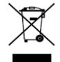

2012/19/EU (WEEE directive): Products marked with this symbol cannot be disposed of as unsorted municipal waste in the European Union. For proper recycling, return this product to your local supplier upon the purchase of equivalent new equipment, or dispose of it at designated collection points. For more information see: [www.recyclethis.info](http://www.recyclethis.info/)

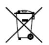

2006/66/EC (battery directive): This product contains a battery that cannot be disposed of as unsorted municipal waste in the European Union. See the product documentation for specific battery information. The battery is marked with this symbol, which may

include lettering to indicate cadmium (Cd), lead (Pb), or mercury (Hg). For proper recycling, return the battery to your supplier or to a designated collection point. For more information see: [www.recyclethis.info](http://www.recyclethis.info/)

### **Industry Canada ICES-003 Compliance**

This device meets the CAN ICES-3 (A)/NMB-3(A) standards requirements.

## Applicable Models

This manual is applicable to the models listed in the following table.

| Series        | Model          |  |
|---------------|----------------|--|
| NVR-100H-D    | NVR-104H-D     |  |
|               | NVR-108H-D     |  |
| NVR-100H-D/P  | NVR-104H-D/4P  |  |
|               | NVR-108H-D/8P  |  |
|               | NVR-104MH-D    |  |
| NVR-100MH-D   | NVR-108MH-D    |  |
|               | NVR-104MH-D/4P |  |
| NVR-100MH-D/P | NVR-108MH-D/8P |  |

## Symbol Conventions

The symbols that may be found in this document are defined as follows.

| Symbol | Description                                                                                                                                                                                |  |  |
|--------|--------------------------------------------------------------------------------------------------------------------------------------------------------------------------------------------|--|--|
|        | Provides<br>additional<br>information<br>to<br>emphasize<br>or<br>supplement<br>important points of the main text.                                                                         |  |  |
|        | Indicates a potentially hazardous situation, which if not avoided,<br>could<br>result<br>in<br>equipment<br>damage,<br>data<br>loss,<br>performance<br>degradation, or unexpected results. |  |  |
|        | Indicates a hazard with a high level of risk, which<br>if not avoided, will<br>result in death or serious injury.                                                                          |  |  |

## Safety Instructions

- Proper configuration of all passwords and other security settings is the responsibility of the installer and/or end-user.
- In the use of the product, you must be in strict compliance with the electrical safety regulations of the nation and region. Please refer to technical specifications for detailed information.
- Input voltage should meet both the SELV (Safety Extra Low Voltage) and the Limited Power Source with 100~240 VAC, 48 VDC or 12 VDC according to the IEC60950-1 standard. Please refer to technical specifications for detailed information.
- Do not connect several devices to one power adapter as adapter overload may cause over-heating or a fire hazard.
- Please make sure that the plug is firmly connected to the power socket.
- If smoke, odor or noise rise from the device, turn off the power at once and unplug the power cable, and then please contact the service center.
- If the POE ports of device do not comply with Limited Power Source, the additional equipment connected to POE ports shall have fire enclosure.
- The USB interface of the /P devices can be connected with the mouse and U-flash disk storage device only.

## Preventive and Cautionary Tips

Before connecting and operating your device, please be advised of the following tips:

- Ensure unit is installed in a well-ventilated, dust-free environment.
- Unit is designed for indoor use only.
- Keep all liquids away from the device.
- Ensure environmental conditions meet factory specifications.
- Ensure unit is properly secured to a rack or shelf. Major shocks or jolts to the unit as a result of dropping it may cause damage to the sensitive electronics within the unit.
- Use the device in conjunction with an UPS if possible.
- Power down the unit before connecting and disconnecting accessories and peripherals.
- A factory recommended HDD should be used for this device.
- Improper use or replacement of the battery may result in hazard of explosion. Replace with the same or equivalent type only. Dispose of used batteries according to the instructions provided by the battery manufacturer.

## Power Supply Instructions

Use only power supplies listed in the user instructions.

| NVR Models                                             | Standard  | Power Supply Models    | Manufacturer                          |
|--------------------------------------------------------|-----------|------------------------|---------------------------------------|
| NVR-104H-D<br>NVR-108H-D<br>NVR-104MH-D<br>NVR-108MH-D | European  | MSA-C1500IC12.0-18P-DE | MOSO Power Supply Technology Co., Ltd |
|                                                        |           | ADS-26FSG-12 12018EPG  | Shenzhen HONOR Electronic Co., Ltd    |
|                                                        |           | KL-AD3060VA            | Xiamen Keli Electronics Co., Ltd      |
|                                                        |           | KPD-018-VI             | Channel Well Technology Co., Ltd      |
|                                                        | British   | ADS-25FSG-12 12018GPB  | Shenzhen HONOR Electronic Co., Ltd    |
|                                                        |           | MSA-C1500IC12.0-18P-GB | MOSO Power Supply Technology Co., Ltd |
|                                                        |           | ADS-26FSG-12 12018EPB  | Shenzhen HONOR Electronic Co., Ltd    |
| NVR-104H-D/4P                                          | Universal | MSP-Z1360IC48.0-65W    | MOSO Power Supply Technology Co., Ltd |
| NVR-108H-D/8P                                          |           | MSA-Z1040IS48.0-65W-Q  | MOSO Power Supply Technology Co., Ltd |
| NVR-104MH-D/4P                                         |           |                        | MOSO Power Supply Technology Co., Ltd |
| NVR-108MH-D/8P                                         |           | MSA-Z1360IS48.0-65W-Q  |                                       |

- The power supplies list above is for EU countries only.
- The power supplies list is subject to change without prior notice.

# Chapter1 Panels Description

## 1.1 Front Panel

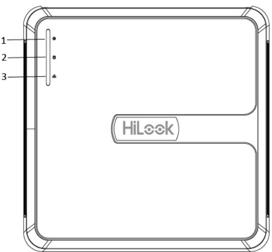

Figure 1-1 NVR-100H-D (/P) Series

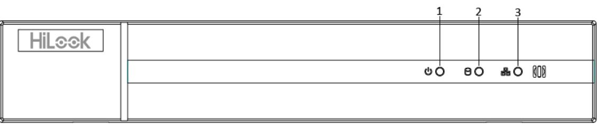

| Series |
|--------|
|        |

| Table 1-1 |  | Description of Front Panel |
|-----------|--|----------------------------|
|-----------|--|----------------------------|

| No. | Icon | Description                                                                |  |  |
|-----|------|----------------------------------------------------------------------------|--|--|
| 1   |      | Indicator turns red when NVR is powered up.                                |  |  |
| 2   |      | Indicator lights in red when data is being read from or written to<br>HDD. |  |  |
| 3   |      | Indicator blinks blue when network connection is functioning<br>properly.  |  |  |

## 1.2 Rear Panel

## NVR-100H-D and NVR-100MH-D Series

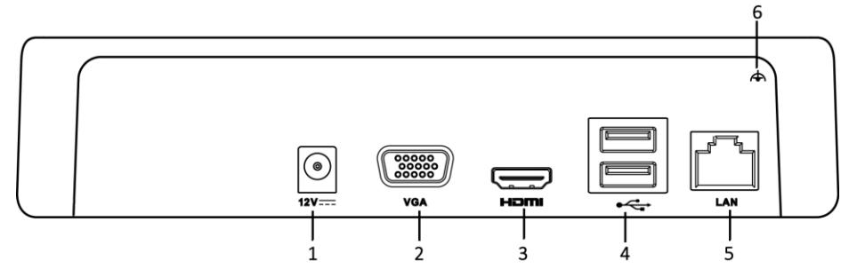

Figure 1-3 NVR-100H-D Rear Panel

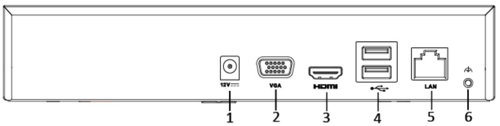

Figure 1-4 NVR-100MH-D Rear Panel

| No. | Item                  | Description                                                                                                 |  |  |
|-----|-----------------------|-------------------------------------------------------------------------------------------------------------|--|--|
| 1   | Power Supply          | 12 VDC<br>power supply.                                                                                     |  |  |
| 2   | VGA Interface         | DB9 connector for VGA output. Display local video<br>output and menu.                                       |  |  |
| 3   | HDMI Interface        | HDMI video output connector.                                                                                |  |  |
| 4   | USB Interface         | Universal Serial Bus (USB) ports for additional devices<br>such as USB mouse and USB Hard Disk Drive (HDD). |  |  |
| 5   | LAN Network Interface | 10/100<br>Mbps self-adaptive Ethernet interface.                                                            |  |  |
| 6   | Ground                | Ground<br>(needs to be connected when NVR starts up).                                                       |  |  |

### NVR-100H-D/P and NVR-100MH-D/P Series

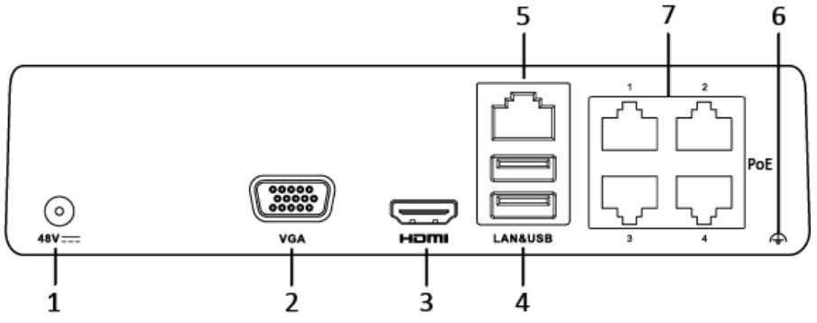

Figure 1-5 NVR-100H-D/P Rear Panel

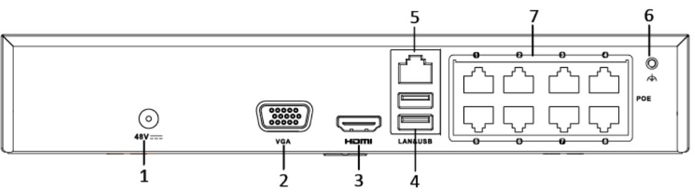

Figure 1-6 NVR-100MH-D/P Rear Panel

| No. | Item                                    | Description                                                                                                                                     |  |  |
|-----|-----------------------------------------|-------------------------------------------------------------------------------------------------------------------------------------------------|--|--|
| 1   | Power Supply                            | 12 VDC<br>power supply.                                                                                                                         |  |  |
| 2   | VGA Interface                           | DB9 connector for VGA output. Display local video<br>output and menu.                                                                           |  |  |
| 3   | HDMI Interface                          | HDMI video output connector.                                                                                                                    |  |  |
| 4   | USB Interface                           | Universal Serial Bus (USB) ports for additional devices<br>such as USB mouse and USB Hard Disk Drive (HDD).                                     |  |  |
| 5   | LAN Network Interface                   | 10/100<br>Mbps self-adaptive Ethernet interface.                                                                                                |  |  |
| 6   | Ground                                  | Ground<br>(needs to be connected when NVR starts up).                                                                                           |  |  |
| 7   | Network Interfaces with<br>PoE function | Network interfaces for the cameras and to provide<br>power over Ethernet.<br>4 interfaces for /4P models and 8<br>interfaces for /8P<br>models. |  |  |

### Table 1-3 Description of Rear Panel

# Chapter 2 Installation and Connections

## 2.1 NVR Installation

During installation of the NVR:

- Use brackets for rack mounting.
- Ensure ample room for audio and video cables.
- When routing cables, ensure that the bend radius of the cables are no less than five times than its diameter.
- Connect the alarm cable.
- Allow at least 2cm (≈0.75-inch) of space between racks mounted devices.
- Ensure the NVR is grounded.
- Environmental temperature should be within the range of -10 to +55º C, +14 to +131º F.
- Environmental humidity should be within the range of 10% to 90%.

## 2.2 Hard Disk Installation

Before you start:

Disconnect the power from the NVR before installing a hard disk drive (HDD). A factory recommended HDD should be used for this installation.

Tools Required: Screwdriver.

Step 1 Remove the cover from the device by unfastening the screws on the bottom.


Figure 2-1 Remove the Cover

- Step 2 Place the HDD on the bottom of the device and then fasten the screws on the bottom to fix the HDD.
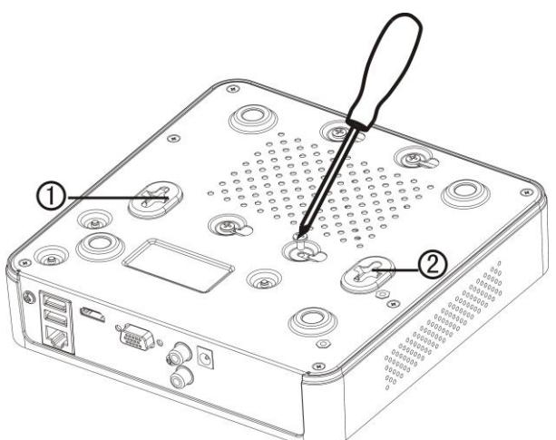

Figure 2-2 Fix the HDD

- Step 3 Connect one end of the data cable to the motherboard of NVR and the other end to the HDD.
- Step 4 Connect the power cable to the HDD.

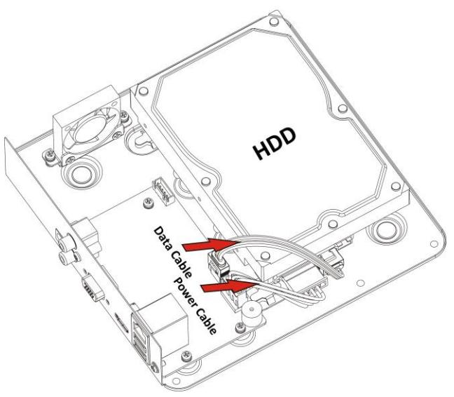

Figure 2-3 Connect Cables

Step 5 Re-install the cover of the NVR and fasten screws.

## 2.3 HDD Storage Calculation Chart

The following chart shows an estimation of storage space used based on recording at one channel for an hour at a fixed bit rate.

| Bit<br>Rate | Storage Used |  |
|-------------|--------------|--|
| 96K         | 42M          |  |
| 128K        | 56M          |  |
| 160K        | 70M          |  |
| 192K        | 84M          |  |
| 224K        | 98M          |  |
| 256K        | 112M         |  |
| 320K        | 140M         |  |
| 384K        | 168M         |  |
| 448K        | 196M         |  |
| 512K        | 225M         |  |
| 640K        | 281M         |  |
| 768K        | 337M         |  |
| 896K        | 393M         |  |
| 1024K       | 450M         |  |
| 1280K       | 562M         |  |
| 1536K       | 675M         |  |
| 1792K       | 787M         |  |
| 2048K       | 900M         |  |
| 4096K       | 1.8G         |  |
| 8192K       | 3.6G         |  |
| 16384K      | 7.2G         |  |

Please note that supplied values for storage space used is just for reference. The storage values in the chart are estimated by formulas and may have some deviation from actual value.

# Chapter 3 Menu Operation

## 3.1 Startup and Shutdown

Proper startup and shutdown procedures are crucial to expanding the life of the NVR.

To start your NVR:

- Step 1 Check the power supply is plugged into an electrical outlet. It is HIGHLY recommended that an Uninterruptible Power Supply (UPS) be used in conjunction with the device. The Power button) on the front panel should be red, indicating the device is receiving the power.
- Step 2 Press the power switch on the panel. The Power LED should turn blue. The unit will begin to start.

After the device starts up, the wizard will guide you through the initial settings, including modifying password, date and time settings, network settings, HDD initializing, and recording.

To shut down the NVR:

Step 1 Go to **Menu** > **Shutdown**.

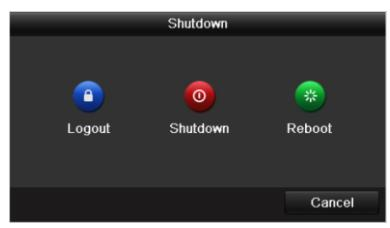

Figure 3-1 Shutdown

Step 2 Select **Shutdown**.

Step 3 Click **Yes**.

## 3.2 Activate Your Device

### *Purpose:*

For the first-time access, you need to activate the device by setting an admin password. No operation is allowed before activation. You can also activate the device via Web Browser, SADP or client software.

Step 1 Input the same password in **Create New Password** and **Confirm New Password**.

- Step 2 (Optional) Use customized password to activate and add network camera(s) connected to the device.
	- 1) Uncheck **Use Channel Default Password.**
	- 2) Enter a password in **IP Camera Activation.**

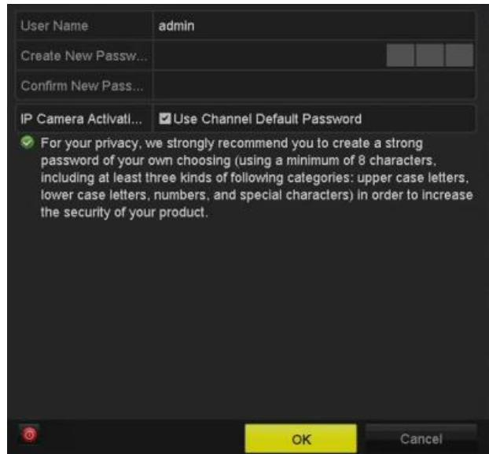

Figure 3-2 Set Admin Password


**STRONG PASSWORD RECOMMENDED**–We highly recommend you create a strong password of your own choosing (Using a minimum of 8 characters, including at least three of the following categories: upper case letters, lower case letters, numbers, and special characters.) in order to increase the security of your product. And we recommend you reset your password regularly, especially in the high security system, resetting the password monthly or weekly can better protect your product.

Step 3 Click **OK**.

## 3.3 Set the Unlock Pattern for Login

Admin can use the unlock pattern for device login.

For devices with PoE function, you can draw the device unlock pattern after activation. For other devices, the unlock pattern interface will show after the first-time login.

- Step 1 Use the mouse to draw a pattern among the 9 dots on the screen. Release the mouse when the pattern is done.
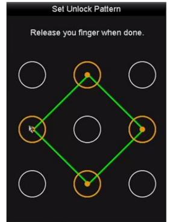

Figure 3-3 Draw the Pattern

- Connect at least 4 dots to draw the pattern.
- Each dot can be connected for once only.
- Step 2 Draw the same pattern again to confirm it. When the two patterns match, the pattern is configured successfully.

## 3.4 User Login

### *Purpose:*

If NVR has logged out, you must login the device before operating the menu and other functions. Step 1 Select the **User Name** in the dropdown list.

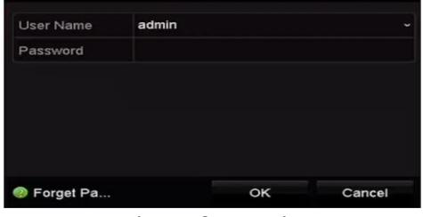

Figure 3-4 Login

Step 2 Input Password.

Step 3 Click **OK**.


In the Login dialog box, if you enter the wrong password 7 times, the current user account will be locked for 60 seconds.

## 3.5 Network Settings

### *Purpose:*

Network settings must be properly configured before you operate NVR over network.

Step 1 Enter the general network settings interface.

```
Menu > Configuration > Network > General
```

| NIC Type                              |                               | 100M Full-dup       |                |                              |
|---------------------------------------|-------------------------------|---------------------|----------------|------------------------------|
| Enable DHCP                           |                               | >                   |                |                              |
| .15 .1<br>10<br>. 108<br>IPv4 Address |                               |                     | IPv6 Address 1 | fe80::b6a3:82ff:febe:ad2c/64 |
| 255 . 255 . 255 . 0<br>IPv4 Subnet    |                               |                     | IPv6 Address 2 |                              |
| IPv4 Default G  10 .15 .1<br>.254     |                               |                     | IPv6 Default G |                              |
| MAC Address                           |                               | b4:a3:82:be:ad:2c   |                |                              |
| MTU(Bytes)                            |                               | 1500                |                |                              |
|                                       | Enable Obtain DNS Server Addr | >                   |                |                              |
| Preferred DNS Server                  |                               | 10.1.7.88           |                |                              |
| Alternate DNS Server                  |                               | 10.1.7.77           |                |                              |
| Internal NIC IPv4 Address             |                               | 192 . 168 . 254 . 1 |                |                              |

Figure 3-5 Network Settings

- Step 2 Configure the following settings: NIC Type, IPv4 Address, IPv4 Gateway, MTU and DNS Server.
- Step 3 If the DHCP server is available, you can check the checkbox of **DHCP** to automatically obtain an IP address and other network settings from that server.

Step 4 Click **Apply**.

## 3.6 Add IP Cameras

### *Purpose:*

Before you can get live video or record the video files, you should add the network cameras to the connection list of the device.

### *Before you start:*

Ensure the network connection is valid and correct, and the IP camera to add has already been activated. Please refer to the *User Manual* for activating the inactive IP camera.

You can select one of the following three options to add the IP camera.

### **OPTION 1:**

Step 1 Click to select an idle window in the live view mode.

Step 2 Click in the center of the window to pop up the Add IP Camera interface.

| Add IP Camera     |             |            |                                |           |         |  |
|-------------------|-------------|------------|--------------------------------|-----------|---------|--|
| No.               | IP Address  |            | Amount of  Device Ty  Protocol |           | Managem |  |
| 1                 | 10.16.1.62  | 11         | IPC                            | HIKVISION | 8000    |  |
| 2                 | 10.16.1.199 | 1          | IP Dome                        | HIKVISION | 8000    |  |
|                   |             |            |                                |           |         |  |
| <                 | -           |            |                                |           | V       |  |
| IP Camera Address |             | 10.16.1.62 |                                |           |         |  |
| Protocol          |             | HIKAISION  |                                |           |         |  |
| Management Port   |             | 8000       |                                |           |         |  |
| Channel Port      |             | 1          |                                |           |         |  |
| Transfer Protocol |             | Auto       |                                |           |         |  |
| User Name         |             | admin      |                                |           |         |  |
| Password          |             |            |                                |           |         |  |
|                   |             |            |                                |           |         |  |
|                   |             |            | Search                         | Add       | Cancel  |  |

Figure 3-6 Add IP Camera

- Step 3 Select the detected IP camera and click **Add** to add it directly, and you can click **Search** to refresh the online IP camera manually.
Or you can choose to custom add the IP camera by editing the parameters in the corresponding text field and then click **Add** to add it.

## 3.7 Live View

Icons are provided on screen in Live View mode to indicate camera status. These icons include:

### **Live View Icons**

In the live view mode, there are icons at the upper-right corner of the screen for each channel, showing the status of the record and alarm in the channel for quick reference.

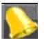

Alarm (video loss, tampering, motion detection, VCA or sensor alarm)

Record (manual record, continuous record, motion detection, VCA or alarm triggered record)


Alarm and Record

Event/Exception (event and exception information, appears at the lower-left corner of the screen.)

## 3.8 Recording Settings

### *Before you start:*

Make sure that the disk has already been installed. If not, please install a disk and initialize it. You may refer to the user manual for detailed information.

### *Purpose:*

Two kinds of record types are introduced in the following section, including Instant Record and All-day Record. And for other record types, you may refer to the user manual for detailed information.


After rebooting all the manual records enabled are canceled.

- Step 1 On the live view window, right lick the window and move the cursor to the **Start Recording** option, and select **Continuous Record** or **Motion Detection Record** on your demand.
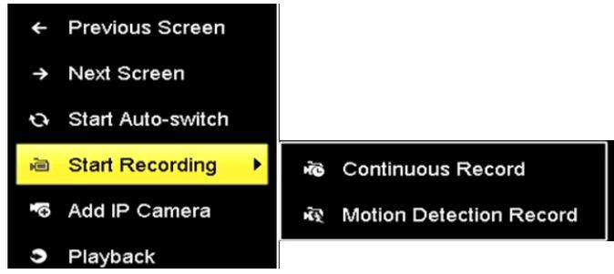

Figure 3-7 Start Recording from Right-click Menu

- Step 2 Click **Yes** in the pop-up Attention message box to confirm the settings. All the channels will start to record in the selected mode.
## 3.9 Playback

The recorded video files on the hard disk can be played back in the following modes: instant playback, all-day playback for the specified channel, and playback by normal/event/smart/tag/sub-periods/external file search.

Step 1 Enter playback interface.

Click Menu > Playback or from the right-click menu

- Step 2 Check the checkbox of channel(s) in the channel list and then double-click to select a date on the calendar.
- Step 3 You can use the toolbar in the bottom part of Playback interface to control playing progress.

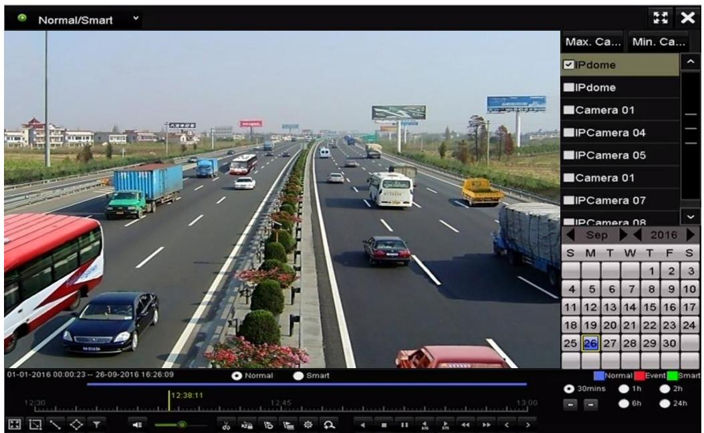

Figure 3-8 Playback Interface

Step 4 Select the channel(s) to or execute simultaneous playback of multiple channels.

# Chapter 4 Accessing by Web Browser

You shall acknowledge that the use of the product with Internet access might be under network security risks. For avoidance of any network attacks and information leakage, please strengthen your own protection. If the product does not work properly, please contact with your dealer or the nearest service center.

### *Purpose:*

You can get access to the device via web browser. You may use one of the following listed web browsers: Internet Explorer 6.0, Internet Explorer 7.0, Internet Explorer 8.0, Internet Explorer 9.0, Internet Explorer 10.0, Internet Explorer 11.0, Apple Safari, Mozilla Firefox, and Google Chrome. The supported resolutions include 1024*768 and above.

Step 1 Open web browser, input the IP address of the device and then press Enter.

Step 2 Login to the device.

- If the device has not been activated, you need to activate the device first before login.

| Activation |                                                                                                                                                                                        |        |
|------------|----------------------------------------------------------------------------------------------------------------------------------------------------------------------------------------|--------|
| User Name  | admin                                                                                                                                                                                  |        |
| Password   |                                                                                                                                                                                        |        |
|            | Valid password range [8-16]. You<br>can use a combination of numbers,<br>lowercase, uppercase and special<br>character for your password with at<br>least two kinds of them contained. | Strong |
| Confirm    |                                                                                                                                                                                        |        |
|            |                                                                                                                                                                                        | OK     |

Figure 4-1 Set Admin Password

- 1) Set the password for the admin user account.
- 2) Click **OK**.


**STRONG PASSWORD RECOMMENDED**– We highly recommend you create a strong password of your own choosing (using a minimum of 8 characters, including upper case letters, lower case letters, numbers, and special characters) in order to increase the security of your product. And we recommend you reset your password regularly, especially in the high security system, resetting the password monthly or weekly can better protect your product.

- If the device is already activated, enter the user name and password in the login interface, and click **Login**.

| વા<br>admin      |
|------------------|
| a<br>            |
|                  |
| Login            |
|                  |
| Figura 1 7 Login |

Figure 4-2 Login

- Step 3 Install the plug-in before viewing the live video and managing the camera. Please follow the installation prompts to install the plug-in.


You may have to close the web browser to finish the installation of the plug-in.

After login, you can perform the operation and configuration of the device, including the live view, playback, log search, configuration, etc.

**03041041090702**


23

Network Video Recorder Quick Start Guide