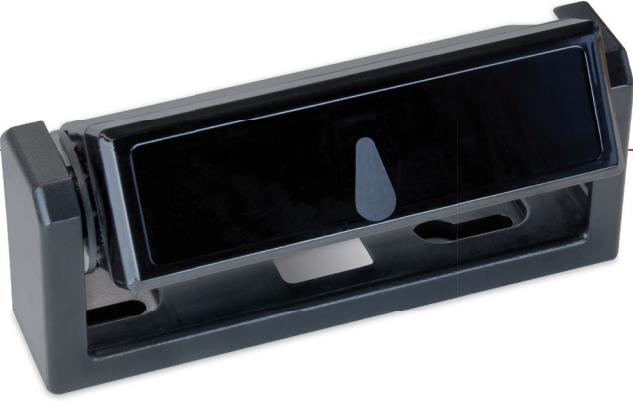

# **SpotScan**

Active infrared presence detector for automatic doors

## Strong, flexible and discreet

- **Background analysis mode mounting height 3.2 m (10.5 ft) (Analyse background)**
- **Background suppression mode mounting height 4.5 m (14.8 ft) (Ignore background)**
- **Discreet appearance and able to be installed almost anywhere thanks to its compact design**
- **Easily and individually adjustable with DIP switches and scanning range setting**
- **Multiple usage for mobile or stationary operating mode**
- **www.bircher.com With an extensive range of accessories for every situation**

Specifications

## **SpotScan**

# Active infrared presence detector for automatic doors

#### **Safe on the spot**

SpotScan has been proven as a really versatile all-rounder. In stationary operating mode it provides protection against entrapment at shearing edges of automatic revolving and swing doors. In the door ride-on type of application (mobile operating mode), it is installed as a collision prevention device. With sliding and curved sliding doors SpotScan monitors the main and secondary closing edges. Additionally it features a test input.

#### **For a wide range of applications**

Thanks to its compact design and the extensive accessory range the SpotScan can be adapted to suit any type of installation. It is suitable for counting people in confined spaces and picks-up the presence of objects or people on escalators and in elevators. Amongst other areas it can also be installed in making occupancy checks of people in security locks.

Concentrating on the importance of its design, SpotScan is really easy to understand and install. A screwdriver is all that's needed to adjust the optical scanning range of the sensor.

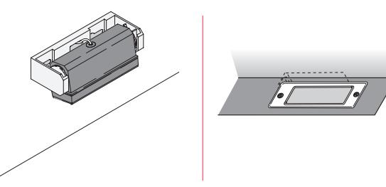

### Your benefits

#### **Multi-purpose adjustment with only three switches**

- As versatile the SpotScan is, as easy it is to be set up: only three switches are necessary to adust this sensor for the needs of the application. The type of operation, signal output and transmitting frequency are configured just using the three DIP switches at the front of the sensor. Depending on the installation height, the switching-point of the infrared light scanner can be adjusted for height up or down using the mechanical adjusting screw.
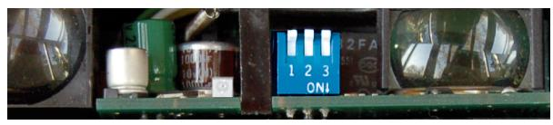

#### **Changing frequencies** (DIP switch 1)

Frequency selection 1 or 2 prevents two adjacent sensors from interfering with each other.

#### **Operating mode** (DIP switch 2)

The sensor can be optionally utilized for mobile or stationary operating mode using the background suppression or background analysis technology.

#### **Output switching mode** (DIP switch 3)

The output signal is switched active or passive depending on the type of control and application.

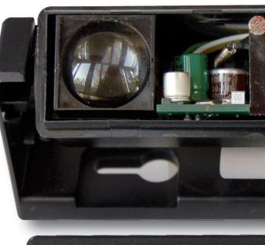

### Further accessories

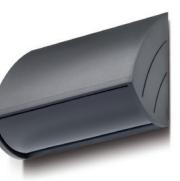

Protective cover for external mounting

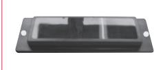

Flush-type cover for recessed installations

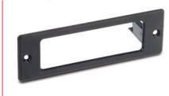

Mounting frame for recessed installations

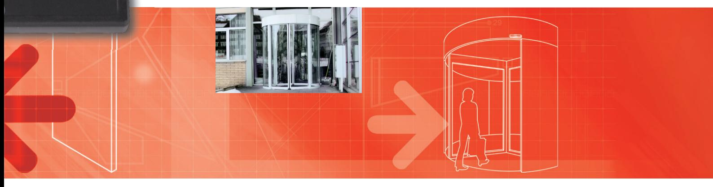

# Secure in every application

#### **Situation**

Main closing edge of curved sliding doors

#### **Solution**

- The SpotScan provides a single beam protection all along the main closing edge. Installation heights up to 3.2 m (10.5')!
- In suppression mode can be mount until a height of 4.5 m (14.8')

#### **Benefits**

- Protects people from getting trapped between two door leafs
- The safety beams are spread along the curve of the door

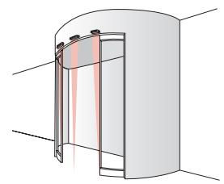

#### **Situation**

Main closing edge of revolving doors

#### **Solution**

- The built-in SpotScan detects persons and objects along the main closing edge
#### **Benefits**

- The movement of the door can be slowed down and stopped in time
- The rapid touch-free detection system ensures people don't get trapped between the door leaf and the door post (main and opposite closing edge)

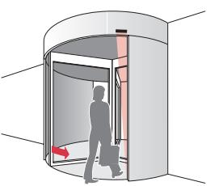

#### **Situation**

Secondary closing edge of sliding doors

#### **Solution**

- People are immediately detected in the danger areas that arise when sliding doors are opening. The SpotScan protects people before the door leafs reach their opening position
#### **Benefits**

- The touch-free protection device operates invisibly
- Precise and reliable protection system

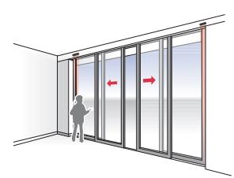

#### **Situation**

Seconrady closing edge of swing doors

#### **Solution**

- The touch-free protection prevents fingers getting trapped when the door closes along the entire secondary closing edge
#### **Benefits**

- There is no need for any other protection arrangements such as mechanical coverings
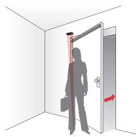

# Order details

| Item no. | Description Dimensionen                                                     |  |
|----------|--------------------------------------------------------------------------------|--|
| 212174   | SpotScan Relay output Factory settings: Stationary, passive switching |  |
| 212795   | Ceiling mounting frame black                                                   |  |
| 212808   | Protective cover anthracite                                                    |  |
| 213451   | Flush-type cover                                                               |  |

# Additional products

#### **Activation of automatic doors**

Merkur 2 Microwave Motion Detector with electronically adjustable range PIR 20 Passive Infrared Motion Detector with minimal dimensions particularly suitable for being built-in PIR 30 Passive Infrared Motion Detector for extended detection fields and installation heights up to 5.0 m (16.4')

#### **Safeguarding of swing doors** TopScan prevents interference with automatic Revolving and swing doors

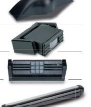

# Specifications

| Mechanical specifications                   |                                                                                                                     |  |
|---------------------------------------------|---------------------------------------------------------------------------------------------------------------------|--|
| Housing material                            | ABS (black)                                                                                                         |  |
| Optic window material                       | Lexan                                                                                                               |  |
| Weight                                      | 130 g (4.6 oz.)                                                                                                     |  |
| Dimensions                                  |                                                                                                                     |  |
| Sensor only                                 | 102 x 45 x 32 mm (4.02 x 1.77 x 1.26")                                                                              |  |
| With swivel bracket                         | 123 x 45x 50 mm (4.84 x 1.77 x 1.97")                                                                               |  |
| With mounting bracket                       | 140 x 45 x 34 mm (5.51 x 1.77 x 1.34")                                                                              |  |
| Type of connection                          | 5 m (16.4') cable with plug                                                                                         |  |
| Technical specifications                    |                                                                                                                     |  |
| Technology                                  | IRED (Active infrared)                                                                                              |  |
| Type of light                               | Pulsed light                                                                                                        |  |
| Beams                                       | 1                                                                                                                   |  |
| Mounting height                             | – Max. 3200 mm (10.5') for background analysis mode – Max. 4500 mm (14.8') for background suppression mode |  |
| Scanning range adjustment                   | 1000 –3200 mm (3.3 –10.5')                                                                                          |  |
| Detection range                             | 100–3200 mm (4"–10.5') (stationary) 500–4500 mm (19.7"–14.8') (mobile)                                           |  |
| Field size at 2.0 m (6.6')                  | Approx. 50 x 50 mm (2 x 2")                                                                                         |  |
| Operating mode                              | Mobile or stationary                                                                                                |  |
| Response time                               | Approx. 35 ms                                                                                                       |  |
| Electrical specifications Supply voltage | 10–48 V DC / 11–36 V AC, 50/60 Hz                                                                                   |  |
| Power consumption                           | Max. 100 mA                                                                                                         |  |
| Power absorbed                              | Max. 3 W / 3 VA                                                                                                     |  |
| Test                                        | 5–48 V DC                                                                                                           |  |
| Signal output                               | Relay, 1 contact normally open max. switching voltage 48 V AC/DC max. switching current 0.5 A AC / 1 A DC  |  |
| Output switching mode                       | Active or passive                                                                                                   |  |
| Function display                            | LED red                                                                                                             |  |
|                                             |                                                                                                                     |  |
|                                             |                                                                                                                     |  |
| Environmental conditions                    |                                                                                                                     |  |
| Protection class                            | Suitable for application in accordance with IP52,with protective cover IP65                                      |  |
|                                             | –20°C to +60°C (–4°F to +140 °F)                                                                                    |  |
| Operating temperature                       |                                                                                                                     |  |
| Humidity                                    |                                                                                                                     |  |
| Standards                                   | Max. 90% relative, non-condensing                                                                                   |  |

#### **EMV Immission EMV Emmission**  EN 61000-6-1 EN 61000-6-2 EN 61000-6-3 EN 61000-6-4

**Note**

Technical details and recommendations on our products are based upon experience and represent guidelines for the user. Details in brochures and specification sheets do not guarantee any special product features, apart from those which we confirm in individual cases. We reserve the right to make changes as the result of technical developments.

#### **BBC Bircher Smart Access**

Wiesengasse 20 8222 Beringen Switzerland Phone +41 52 687 11 11 info@bircher.com www.bircher.com