## **Installationsguide Touch Pro**

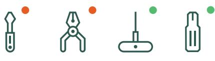

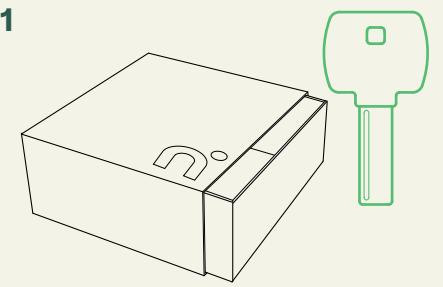

Öppna lådan, Gå igenom lådans innehåll och leta fram nödnycklarna. Nödnycklarna ska **alltid**  nnas tillgängliga under installationen av låset. Testa nycklarna i yerdelens cylinder.

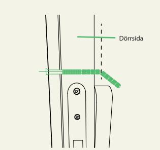

Justera de **kapbara skruvarna** så a de motsvarar dörrens tjocklek och lägg till en **extra**  gängad del. Använd en kraftavbitare för a kapa till önskad längd. Alla skruvar ska vara lika långa. Kapa mer om det behövs.

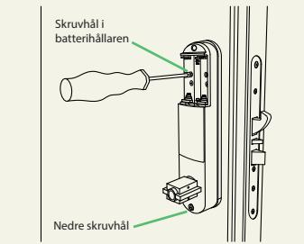

**9**

**5**

Fäst låsets insida genom a fästa båda **korta**  specialskruvarna i baerihållaren och den **långa**  specialskruven i boen av enheten. Använd medföljande bit och dra åt försiktigt. Sä i baerier och sä tillbaka baeriluckan. Spara medföljande bit för framtida behov.

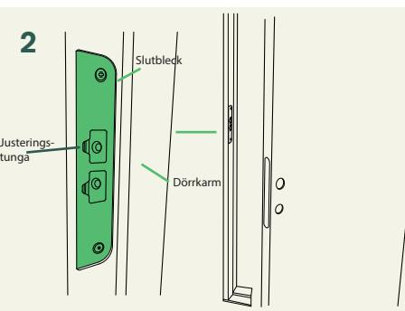

Montera **slutblecket** i dörrkarmen med de bentliga skruvarna. Om det behövs kan läget ändras med hjälp av justeringstungorna efter installationen.

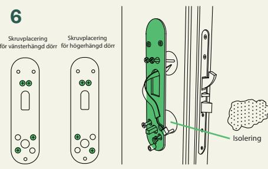

Lokalisera skruvhålen från insidan. Sä in den medföljande isoleringen i båda hålen i dörren. Montera den **invändiga montagebrickan** med de kapbara skruvarna. Dra åt försiktigt. **Två skruvar upptill** och **två nedtill**.

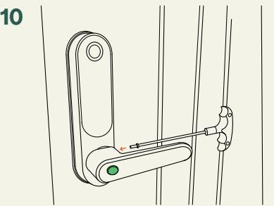

Montera båda handtagen. Det **yre dörrhandtaget** har e **hål** för nyckelcylindern. Placera handtagen i önskad riktning och använd det medföljande torx-verktyget för a fästa skruvarna.

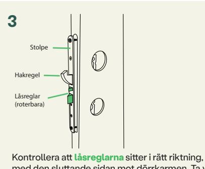

**7**

med den sluande sidan mot dörrkarmen. Ta vid behov bort frontpanelen och rotera låsreglarna. Montera låskistan i dörrkarmen med de bentliga skruvarna.

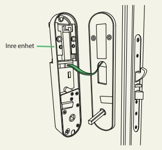

Placera gummitätningen på den invändiga montagebrickan och anslut **kabeln** till den **invändiga enheten**. Se till a tätningen täcker hela brickan.

Tillval: **Har du köpt nimly Connect Module**? Installera Connect Module på invändig enhet innan du går vidare.

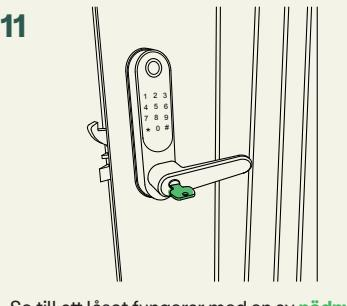

Se till a låset fungerar med en av **nödnycklarna innan** du stänger dörren. **Ta ut** nödnyckeln och förvara en eller flera nödnycklar på en plats utanför hemmet. Testa låset elektroniskt med fabrikskoden 123 #.

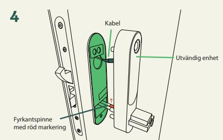

Placera **gummitätningen** och den utvändiga enheten på dörren. Se till a tätningens försänkta del monteras mot låsets baksida. Den röda markeringen på fyrkantspinnen **ska vara vänd uppåt**. För in kabeln genom det övre hålet i låskistan.

**8**

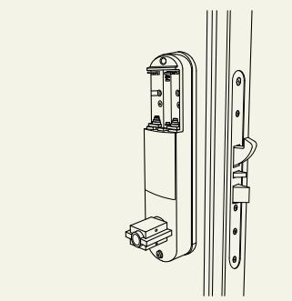

För in överflödig kabel försiktigt i dörren så a det inte kläms eller fastnar i något. Skjut den invändiga enheten försiktigt på plats och se till a tätningen sier jämnt runt den invändiga enheten.

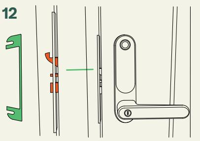

Stäng dörren utan a trycka ner handtaget och kontrollera a **hakregeln** skjuts ut vid stängningen. Om mellanrummet mellan dörrkarmen och dörren blir för stort kan du använda den medföljande **distansbrickan** bakom slutblecket.

# **Programmeringsguide Touch Pro**

installationsmanual på www.nimly.io **All programmering sker på den utvändiga enheten.**

För mer info om låsets Låsklass 3 lägen, se vår mer omfaande

**TIPS!** SKRIV NER VILKEN ANVÄNDARPLATS VARJE ANVÄNDARE BLIR TILLDELAD.

# **1**

**Innan du fortsäer**: Har du köpt **Connect Module** & **Gateway**?

Installera modulen enligt dess bruksanvisning och gör programmeringen med hjälp av appen.

Annars fortsäer du med manuell programmering.

### **3**

**Registrera användarkoder** – används endast för tillträde

Användarplats 003 till 999 är reserverade användarkoder. Alla koder kan innehålla upp till 8 siror. **Minimum 4** siror för a uppfylla låsklass 3.

#### Tryck:

* Användarplats Masterkod * ny användarkod * ny användarkod igen*

Exempel: * 003 345678 * 2323 * 2323 *

**Lägg till första masterngret** – används för tillträde och programmering

Det första masterngret kommer automatiskt a tilldelas plats 000.

För 001 eller 002, se installations manualen.

Tryck ###, placera ngret på läsaren, lyft ngret vid pipsignalen, placera ngret på läsaren igen, lyft ngret vid e ny pip, placera ngret på läsaren igen

### **2**

**Skapa masterkoden** – används för tillträde och programmering

Plats 000, 001 & 002 är reserverat för masterkod(er). Det räcker med en. Fabrikskoden är 123.

Alla koder kan innehålla upp till 8 siror, och vi rekommenderar **minst 6 siror** för bäre säkerhet. **Minimum 4** siror för a uppfylla låsklass 3.

Tryck: * Plats Fabrikskod * ny masterkod * ny masterkod igen * Exempel: * 000 123 * 345678 * 345678 *

**6**

**Registrera nyckelbrickor** – används endast för tillträde

Användarplatserna 000 till 999 är reserverade för nyckelrickor.

Tryck: #8 Användarplats Masterkod # placera nyckelbrickan på panelen.

Exempel: #8 000 345678 # placera nyckelbrickan på panelen.

**Lägg till användarnger** – används endast för tillträde

Användarplatserna 003 till 199 är reserverade för användarngrar.

Tryck ###, placera **masterngret**, ange en användarplats från 003 - 199 og *, placera e **ny nger** på läsaren, lyft ngret vid pipsignalen, placera ngret på läsaren igen, lyft ngret vid e ny pip, placera ngret på läsaren igen

**Önskar du en mer utförlig manual, kontakt med kundservice eller bara mer info?** Scanna QR koden eller besök oss på www.nimly.io