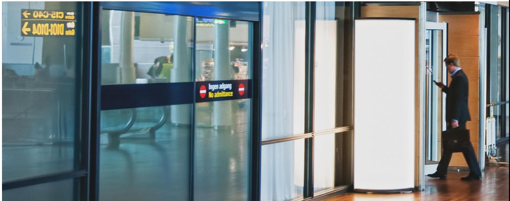
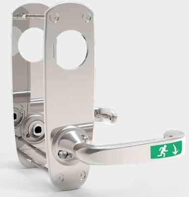
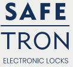
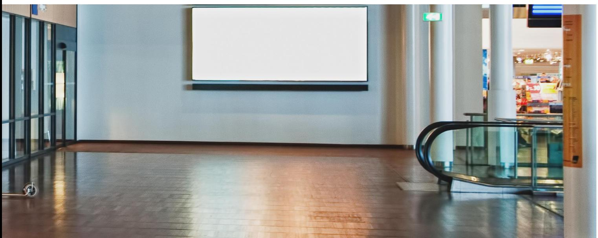
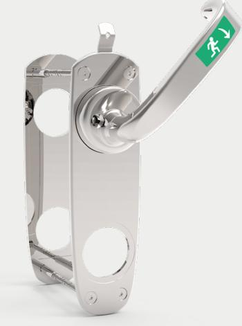
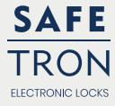

## **Nödutrymningsbehör för eltryckeslås**

SAFETRON 793 är ett nödutrymningsbehör placerat på tryckespositionen som

uppfyller nödutrymningskraven enligt SS-EN 179 samtidigt som det används som

#### dörren trycke.

SAFETRON 793 är anpassat för slagdörrar i modulprofilutförande med krav på nödutrymning. SAFETRON 793 är godkänt som nödutrymningsbehör ihop med SAFETRON SL620 eller SL630 och monteras på insidan. Nödutrymningsbehöret öppnar låset med ett handgrepp och ger en säker utrymning.

SAFETRON 793 monteras på tryckespositionen och används tillsammans med SL620/SL630 när låset är ställt i splitfunktion.

### **Ytbehandling**

SAFETRON 793 kan beställas i två olika ytbehandlingar: krom eller nickelsäker. Den nickelsäkra ytbehandlingen är en blank ytbehandling som uppfyller kraven för nickelallergi enligt EU-direktiv 94/27/EG.

### **SS-EN 179**

Nödutrymningsbehöret är certifierat enligt europastandarden SS-EN 179:2008 och får användas i nödutrymningsvägar tillsammans med SAFETRON SL620 eller SL630.

### **Återinrymning**

Används nödutrymningsbehör 793 tillsammans med eltryckeslås SL621 med omvänd funktion eller SL630 kan återinrymning uppnås genom brandlarmsaktivering alternativt en nödöppningsterminal som bryter spänningsmatningen till eltryckeslåset som då återgår i mekaniskt öppet läge från utsidan. SAFETRON SL630 har alltid omvänd funktion på tryckesaktiveringen och därför är alltid återinrymning möjlig med detta lås.

### **Egenskaper**

- Certifierad enligt SS-EN 179:2008
- Ger säker nödutrymning med ett handgrepp
- Kan användas med rund eller ovalcylindrar
- Får användas i brandcellsgränser

## SAFETRON 793

## **Nödutrymningsbehör för eltryckeslås**

SAFETRON 794 är ett nödutrymningsbehör placerat på cylinderpositionen som

uppfyller nödutrymningskraven enligt SS-EN 179

SAFETRON 794 är anpassat för slagdörrar i modulprofilutförande med krav på nödutrymning. SAFETRON 794 är godkänt som nödutrymningsbehör ihop med SAFETRON SL620 eller SL630 och monteras på insidan. Nödutrymningsbehöret öppnar låset med ett handgrepp och ger en säker utrymning.

SAFETRON 794 monteras på tryckespositionen och används tillsammans med SL620/SL630 när låset är ställt i enkel funktion eller utan tryckesfunktion tillsammans med SAFETRON SL630.

### **Ytbehandling**

SAFETRON 794 kan beställas i två olika ytbehandlingar: krom eller nickelsäker. Den nickelsäkra ytbehandlingen är en blank ytbehandling som uppfyller kraven för nickelallergi enligt EU-direktiv 94/27/EG.

### **SS-EN 179**

Nödutrymningsbehöret är certifierat enligt europastandarden SS-EN 179:2008 och får användas i nödutrymningsvägar tillsammans med SAFETRON SL620 eller SL630.

### **Egenskaper**

- Certifierad enligt SS-EN 179:2008
- Ger säker nödutrymning med ett handgrepp
- Kan användas med rund eller ovalcylindrar
- Får användas i brandcellsgränser
- Mikrobrytare finns som tillval

# SAFETRON 794

