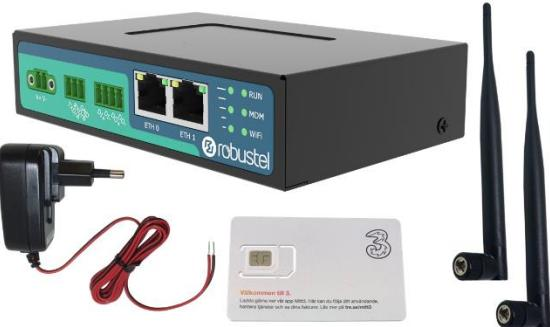

# **Routerpaket KIT-COP-07 R2010 förkonfigurerad och medföljande SIM-kort**

Denna router är förberedd för att enkelt kunna användas till passage- och portelefonisystem från Axema, Aptus samt många andra larm och övervakningssystem. Till routern medföljer ett SIM-kort från Tre och kortplats SIM1 är förberett för detta kort.

# **Paketets innehåll**

- 1st Router R2010 1st Nätadapter 2st mobilnätsantenner 1st SIM-kort
# **LAN-inställningar**

Routern har konfigurerats för att klara de vanligaste behoven och har därför redan från start 2 olika LAN-områden.

#### **ETH 0**

| IP-adress                        | Nätmask       | DHCP                          |
|----------------------------------|---------------|-------------------------------|
| 192.168.0.1                      | 255.255.255.0 | 192.168.0.2 – 192.168.0.100   |
| Port Forward 1                   |               | Port Forward 2                |
| 10001 – 192.168.0.101 port 10001 |               | 10101 – 192.168.0.101 port 80 |
| Port Forward 3                   |               | Port Forward 4                |
| 10002 – 192.168.0.102 port 10001 |               | 10102 – 192.168.0.102 port 80 |

#### **ETH 1**

| IP-adress                  | Nätmask       | DHCP                       |
|----------------------------|---------------|----------------------------|
| 10.0.0.1                   | 255.255.255.0 | 10.0.0.2 – 10.0.0.100      |
| Port Forward 5             |               | Port Forward 6             |
| 10201 – 10.0.0.201 port 80 |               | 10202 – 10.0.0.202 port 80 |

**Aptus** Anslut mot port ETH 0 och konfigurerar Aptus-systemet/systemen med IP: 192.168.0.101 - 102

## **Axema**

Anslut mot ETH 0 system innehållande B60. För system med upp till 10 portar och utan B60 ska de anslutas till ETH 1.

# **SIM-kort**

SIM 1 är för **Tre Telematik** – som ger en publik fast IP-adress som gör att man når utrustningen från Internet.

Aktivering av abonnemang görs enkelt på: www.acandia.se/aktivering

## **Inloggning**

Inloggningsuppgifter till routerns webgränssnitt: User: admin Password: **Copiax2Go**

## **Mer detaljerade instruktioner**

Fullständig manual, instruktioner hur routern är konfigurerad, hur man ställer om till andra konfigurationer finns på sidan: www.acandia.se/copiax

Du kan även kontakta Acandia och få kostnadsfri hjälp att via fjärråtkomst konfigurera om routern.

Tel: **08-5222 4030** Mail: info@acandia.se