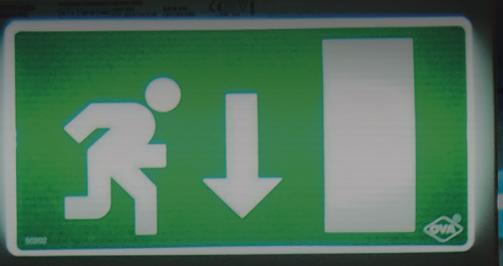

# Nödutrymningsbeslag enligt SS-EN 179:2008

för STEP Motorlås

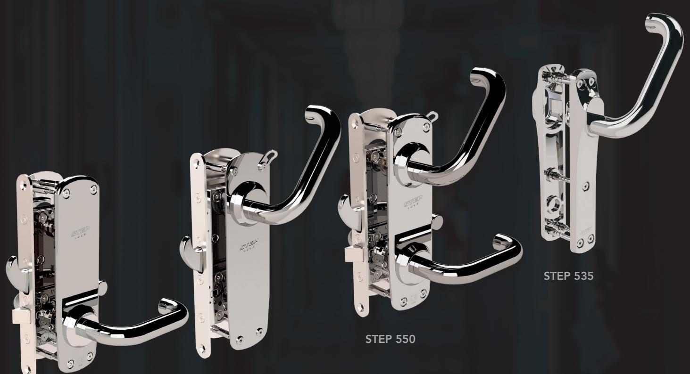

STEP 551

STEP 550

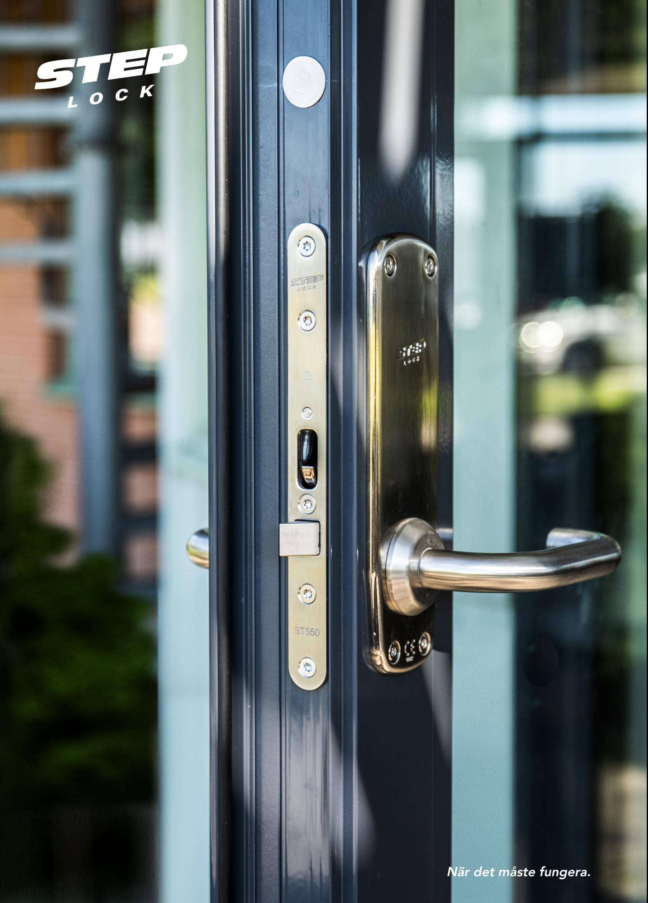

### SS-EN 179:2008

# STEP Exit SplitGo™ för motorlås

Nödutrymningsbeslag för dörrmiljöer med krav på låsklass 2B enligt SSF 3522.

# STEP Exit SplitGo™ för motorlås STEP 550

Nödutrymningsbeslag för dörrar där du vill skapa en säker utrymning. Certifierade enligt SS-EN 179:2008 tillsammans med STEP 550 motorlås.

### Med splitfunktion för slagdörrar i utrymningsvägar

Utrymningsbeslaget STEP Exit är konstruerat med smart SplitGo™-funktion, vilket möjliggör att insidan av behöret endast har ett tryckeshandtag. Därmed kan både utrymning och normal passage ske genom ett och samma trycke. På så sätt kan dörren få en fantastisk användarvänlighet, utan att kompromissa med inbrottsskyddet.

Produkten är brandgodkänd tillsammans med STEP Motorlås. Uppfyller kraven för låsklass 2B enligt SSF 3522.

#### Stora fördelar med unik splitfunktion

- SplitGo™-funktionen möjliggör användning av splithandtaget på tryckesroddar-placeringen, så att insidans trycke gör en helt mekanisk upplåsning av dörren, medan utsidans trycke endast påverkar låsets fallkolv.
- SplitGo™-funktionen säkerställer att utrymningen inte kan blockas med utsidans trycke.

#### Med unik FreeDrive®-teknik

FreeDrive®-tekniken frikopplar motorn och växellådan, vilket innebär att de aldrig påverkas när utrymningsbehörets trycke används. Därmed uteblir slitaget av motor och växellåda – trots att beslaget kanske används tusentals gånger varje dag.

#### Slimmad design med valbar ytfinish

STEP Exit är konstruerad i slimmad design. Det innebär valfri ytfinish i borstat eller blankpolerat rostfritt stål, samt att skylten samt att rosetten har en stilfullt designad och robust konstruktion. Beslaget får därmed en mycket stilren design.

De har även en grund konstruktion vilket gör att du kan montera STEP Exit i dörrar med A/B-mått ner till 20 mm utan att använda en distansplatta.

## Nödutrymningsbeslag STEP Exit SplitGo™ för motorlås STEP 550

### Teknisk information

Utrymning och normal passage från insidan sker genom användande av det godkända utrymningstrycket som sitter på vanlig tryckesplacering. Spitfunktionen i behöret får insidans trycke att dra in både hakregel och fallkolv så att dörren kan öppnas.

Yttre trycke används för att öppna dörren från utsida efter behörig upplåsning.

Motorlåset kan ställas in för återlåsning eller återinrymning.

Välj mellan olika typer av funktion på utsidan, ytbehandlingar samt om beslaget ska passa för höger- eller vänsterhängd dörr.

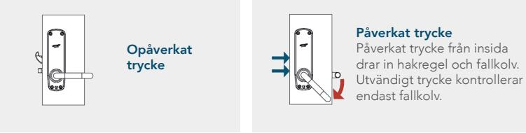

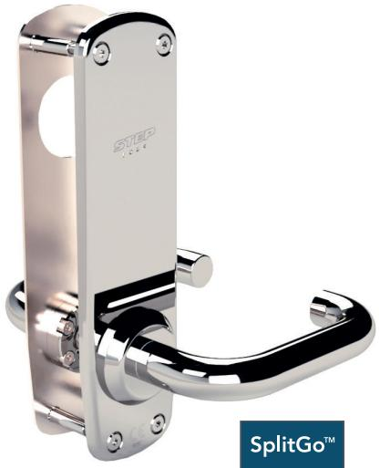

#### Insida

Behörets insida är endast försedd med ett tryckeshandtag. Välj mellan fyra olika typer av utsidor.

|                                                                                        | Art.nr      | Benämning                                         |
|----------------------------------------------------------------------------------------|-------------|---------------------------------------------------|
| Bildexempel art.nr ST17910-R-2 Tryckeshandtag och urtag för cylinder på utsidan. | ST17910-R-1 | STEP Exit i borstat rostfritt stål, höger.        |
|                                                                                        | ST17910-L-1 | STEP Exit i borstat rostfritt stål, vänster.      |
|                                                                                        | ST17910-R-2 | STEP Exit i blankpolerat rostfritt stål, höger.   |
|                                                                                        | ST17910-L-2 | STEP Exit i blankpolerat rostfritt stål, vänster. |
|                                                                                        |             |                                                   |

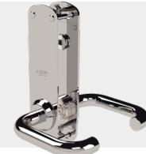

|                                                              | Art.nr      | Benämning                                         |
|--------------------------------------------------------------|-------------|---------------------------------------------------|
|                                                              | ST17911-R-1 | STEP Exit i borstat rostfritt stål, höger.        |
| Bildexempel art.nr ST17911-R-2 Tryckeshandtag på utsidan. | ST17911-L-1 | STEP Exit i borstat rostfritt stål, vänster.      |
|                                                              | ST17911-R-2 | STEP Exit i blankpolerat rostfritt stål, höger.   |
|                                                              | ST17911-L-2 | STEP Exit i blankpolerat rostfritt stål, vänster. |

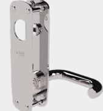

Bildexempel art.nr ST17912-R-2 Urtag för cylinder på utsidan.

| Art.nr      | Benämning                                         |
|-------------|---------------------------------------------------|
| ST17912-R-1 | STEP Exit i borstat rostfritt stål, höger.        |
| ST17912-L-1 | STEP Exit i borstat rostfritt stål, vänster.      |
| ST17912-R-2 | STEP Exit i blankpolerat rostfritt stål, höger.   |
| ST17912-L-2 | STEP Exit i blankpolerat rostfritt stål, vänster. |

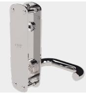

|                                                    | Art.nr      | Benämning                                         |
|----------------------------------------------------|-------------|---------------------------------------------------|
|                                                    | ST17913-R-1 | STEP Exit i borstat rostfritt stål, höger.        |
| Bildexempel art.nr ST17913-R-2 Slät på utsidan. | ST17913-L-1 | STEP Exit i borstat rostfritt stål, vänster.      |
|                                                    | ST17913-R-2 | STEP Exit i blankpolerat rostfritt stål, höger.   |
|                                                    | ST17913-L-2 | STEP Exit i blankpolerat rostfritt stål, vänster. |

# Nödutrymningsbeslag STEP Exit för motorlås STEP 550

### Teknisk information

Utrymning sker från insida med engreppsöppning genom användande av det godkända utrymningstrycket på cylinderplacering.

Det undre trycket påverkar endast fallkolv.

Motorlåset kan ställas in för återlåsning eller återinrymning.

Välj mellan olika typer av funktion på utsidan, ytbehandlingar samt om beslaget ska passa för höger- eller vänsterhängd dörr.

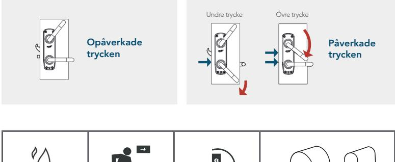

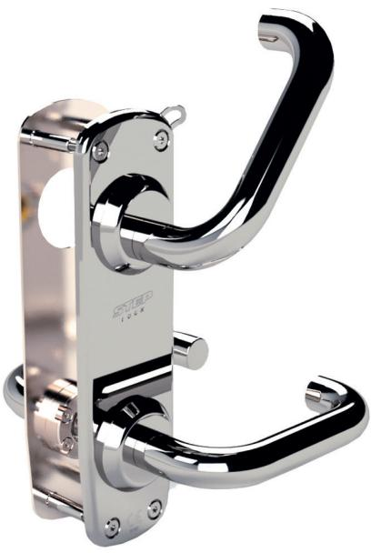

Insida Behörets insida är försedd med ett tryckeshandtag och utrymningshandtag. Välj mellan fyra olika typer av utsidor.

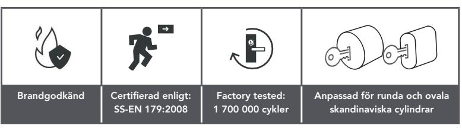

|                                | Art.nr      | Benämning                                         |
|--------------------------------|-------------|---------------------------------------------------|
| Bildexempel art.nr ST17920-L-2 | ST17920-R-1 | STEP Exit i borstat rostfritt stål, höger.        |
| Tryckeshandtag och urtag       | ST17920-L-1 | STEP Exit i borstat rostfritt stål, vänster.      |
| för cylinder på utsidan.       | ST17920-R-2 | STEP Exit i blankpolerat rostfritt stål, höger.   |
|                                | ST17920-L-2 | STEP Exit i blankpolerat rostfritt stål, vänster. |
|                                |             |                                                   |

|                                                              | Art.nr      | Benämning                                       |
|--------------------------------------------------------------|-------------|-------------------------------------------------|
|                                                              | ST17921-R-1 | STEP Exit i borstat rostfritt stål, höger.      |
| Bildexempel art.nr ST17921-L-2 Tryckeshandtag på utsidan. | ST17921-L-1 | STEP Exit i borstat rostfritt stål, vänster.    |
|                                                              | ST17921-R-2 | STEP Exit i blankpolerat rostfritt stål, höger. |
|                                                              |             |                                                 |

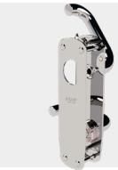

Bildexempel art.nr ST17922-L-2 Urtag för cylinder på utsidan.

| Art.nr      | Benämning                                         |
|-------------|---------------------------------------------------|
| ST17922-R-1 | STEP Exit i borstat rostfritt stål, höger.        |
| ST17922-L-1 | STEP Exit i borstat rostfritt stål, vänster.      |
| ST17922-R-2 | STEP Exit i blankpolerat rostfritt stål, höger.   |
| ST17922-L-2 | STEP Exit i blankpolerat rostfritt stål, vänster. |
|             |                                                   |

ST17921-L-2 STEP Exit i blankpolerat rostfritt stål, vänster.

|                                                    | Art.nr      | Benämning                                         |
|----------------------------------------------------|-------------|---------------------------------------------------|
|                                                    | ST17923-R-1 | STEP Exit i borstat rostfritt stål, höger.        |
| Bildexempel art.nr ST17923-L-2 Slät på utsidan. | ST17923-L-1 | STEP Exit i borstat rostfritt stål, vänster.      |
|                                                    | ST17923-R-2 | STEP Exit i blankpolerat rostfritt stål, höger.   |
|                                                    | ST17923-L-2 | STEP Exit i blankpolerat rostfritt stål, vänster. |
|                                                    |             |                                                   |

# Nödutrymningsbeslag STEP Exit för motorlås STEP 551

### Teknisk information

Utrymning sker från insida med engreppsöppning genom användande av det godkända utrymningstrycket på cylinderplacering.

Motorlåset kan ställas in för återlåsning eller återinrymning.

Välj mellan olika typer av funktion på utsidan, ytbehandlingar samt om beslaget ska passa för höger- eller vänsterhängd dörr.

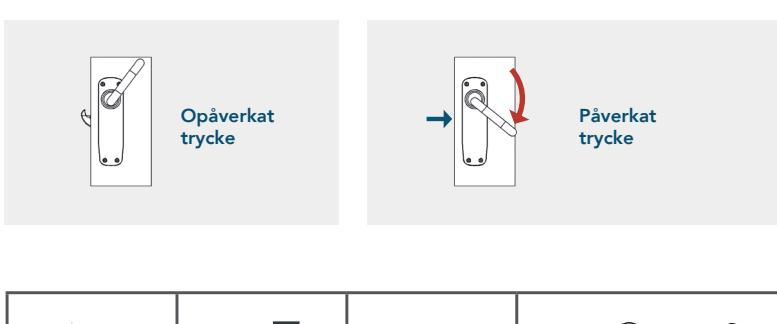

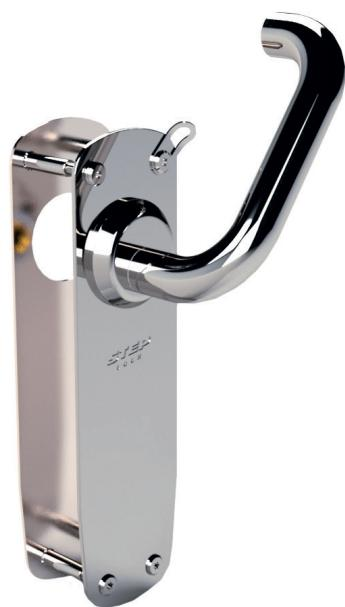

Insida Behörets insida är försedd med ett utrymningshandtag. Välj mellan två olika typer av utsidor.

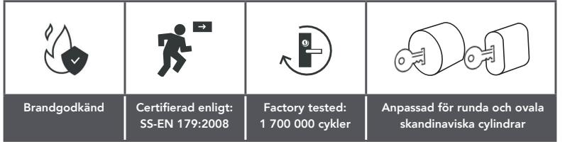

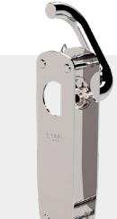

| Art.nr      | Benämning                                         |
|-------------|---------------------------------------------------|
| ST17930-R-1 | STEP Exit i borstat rostfritt stål, höger.        |
| ST17930-L-1 | STEP Exit i borstat rostfritt stål, vänster.      |
| ST17930-R-2 | STEP Exit i blankpolerat rostfritt stål, höger.   |
| ST17930-L-2 | STEP Exit i blankpolerat rostfritt stål, vänster. |

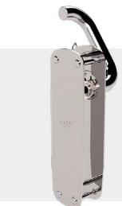

Bildexempel art.nr ST17931-L-2 Slät på utsidan.

Bildexempel art.nr ST17930-L-2 Urtag för cylinder på utsidan.

| Art.nr      | Benämning                                         |
|-------------|---------------------------------------------------|
| ST17931-R-1 | STEP Exit i borstat rostfritt stål, höger.        |
| ST17931-L-1 | STEP Exit i borstat rostfritt stål, vänster.      |
| ST17931-R-2 | STEP Exit i blankpolerat rostfritt stål, höger.   |
| ST17931-L-2 | STEP Exit i blankpolerat rostfritt stål, vänster. |

# Nödutrymningsbeslag STEP Exit för motorlås STEP 535

### Teknisk information

Opåverkat trycke

Utrymning sker från insida med engreppsöppning genom användande av det godkända utrymningstrycket på cylinderplacering.

Välj mellan olika typer av funktion på utsidan samt om beslaget ska passa för höger- eller vänsterhängd dörr.

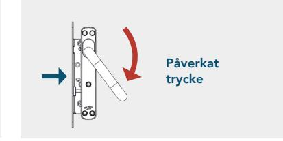

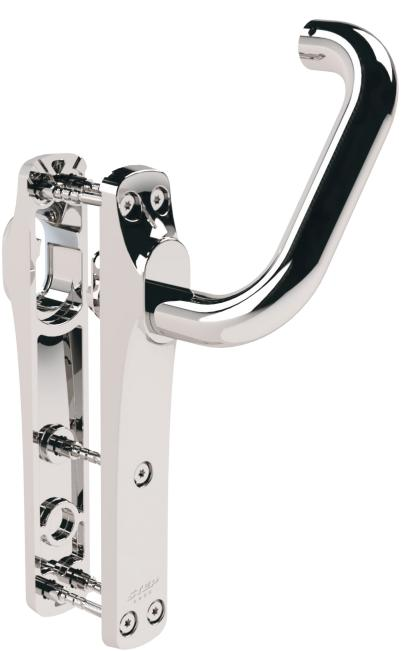

Insida Behörets insida är försedd med ett utrymningshandtag. Välj mellan två olika typer av utsidor.

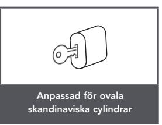

Bildexempel art.nr ST17940-L-2 Urtag för cylinder på utsidan.

| Art.nr      | Benämning                                         |
|-------------|---------------------------------------------------|
| ST17940-R-2 | STEP Exit i blankpolerat rostfritt stål, höger.   |
| ST17940-L-2 | STEP Exit i blankpolerat rostfritt stål, vänster. |

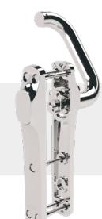

Bildexempel art.nr ST17941-L-2 Slät på utsidan.

Art.nr Benämning ST17941-R-2 STEP Exit i blankpolerat rostfritt stål, höger. ST17941-L-2 STEP Exit i blankpolerat rostfritt stål, vänster.

#### www.steplock.se

Stendals El AB Signalistgatan 17, 721 31 Västerås, Sweden +46 21-18 97 50 | info@steplock.se | www.steplock.se