# Explore the future

of PTZ

International Product and Solution Center

# 1 Single Bullet

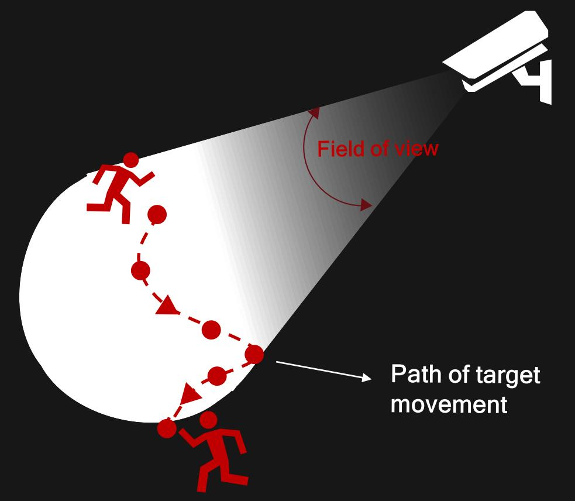

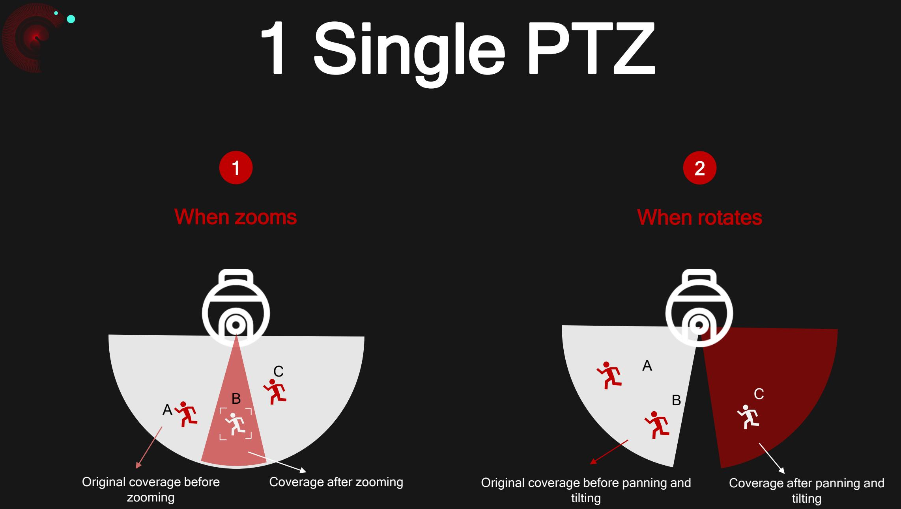

# 1 Bullet + 1 PTZ

The total budge of one PTZ plus one bullet are increased.

#### Double Budget Complex installation Difficult linkage

The cable installation, power supply installation and angle adjustment are complex.

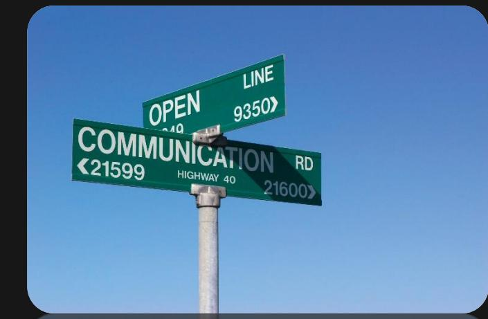

Two cameras work independently. It is hard to have some linkages.

## Cutting-edge Two-in-One Design

camera purchase for multiple-camera benefits

time Installation

IP to manage

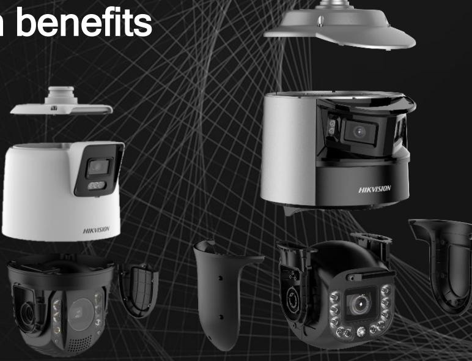

#### 1camera purchase for multiple-camera benefits

#### For SIs

#### • Easy to be applied

The two-in-one design gets around any compatibility problems when pairing different devices. Project application and install are much easier.

#### • Budget-friendly

One TandemVu PTZ camera is more cost-effective than two conventional cameras with accessories.

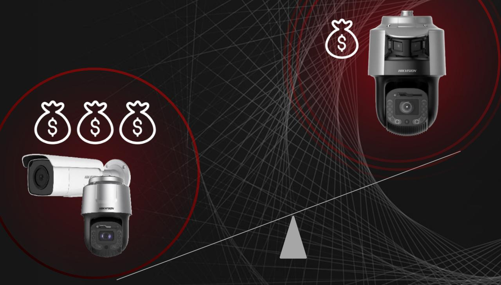

#### For Installers

- One-device installation One-time wiring One-time angle adjustment • Saving time and energy

#### For Installers and end users

- Easy to manage and easy to use
In contrast to installing one bullet and one PTZ, the TandemVu PTZ has only one IP address for dual-channel operations.

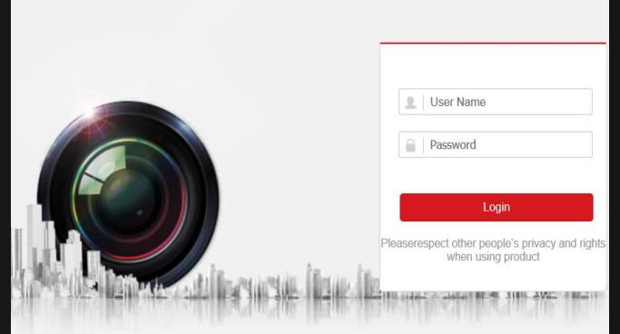

Log in once (TandemVu PTZ website)

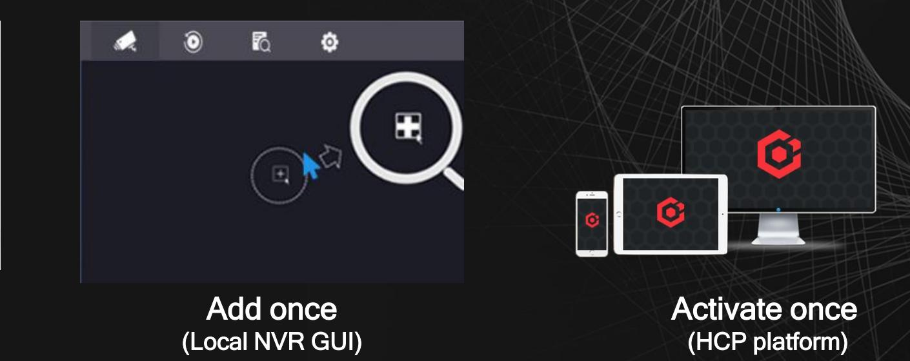

## Extraordinary Imaging

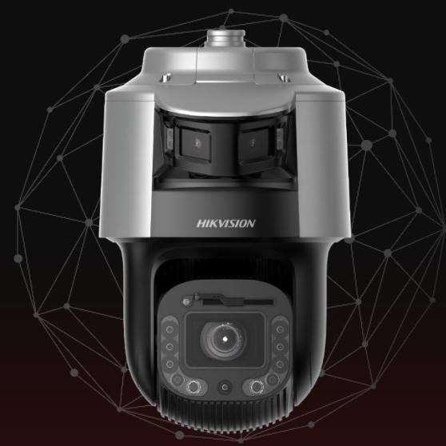

#### Big picture and details, in one view

The bullet camera provides the big picture while the PTZ camera provides zoomed in details in one TandemVu PTZ camera.

The bullet provides pictures in vivid color 24/7 while the PTZ provides up to 42x zoom.

#### Super wide view without distortion*

More vivid, more detailed Powered by Hikvision's proprietary imagestitching technology and advanced algorithms, the bullet camera provides a perfect 180° panoramic view.

> * Supported by 8-inch TandemVu PTZ camera models.

### Big picture and details, in one view

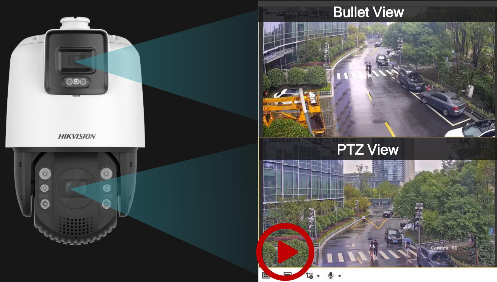

### Extraordinary Imaging

#### More vivid, more detailed

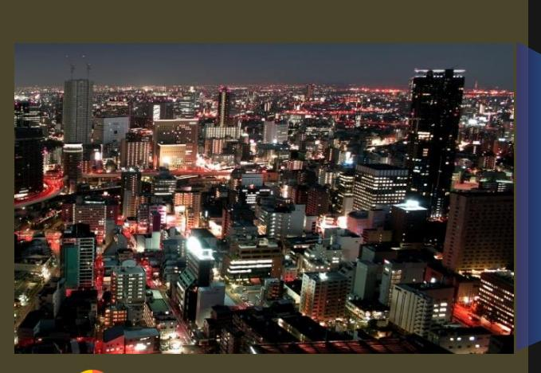

- 24/7 colorful imaging
- F1.0 super-large aperture
- Advanced sensor
- Active alignment technology

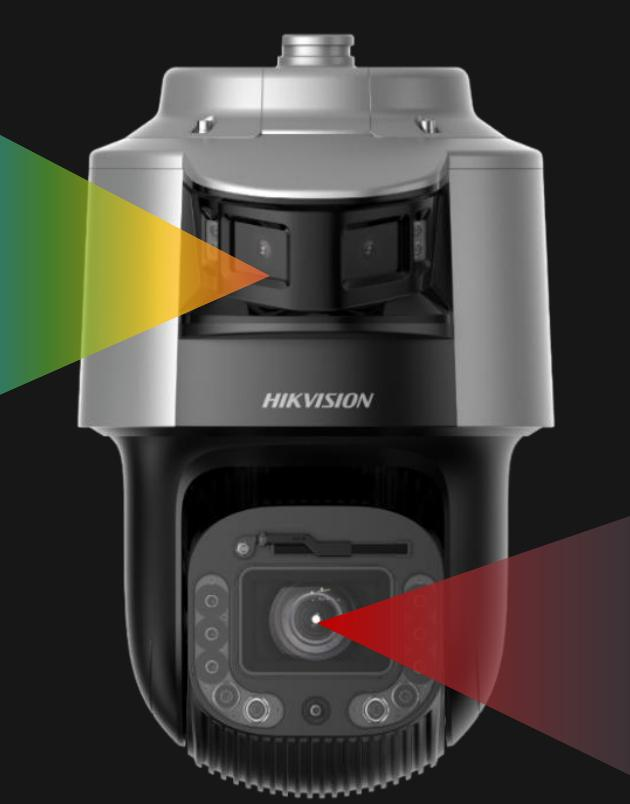

- 0.0005 lux DarkFighter (8-inch camera) • Superior low-light performance
- Up to 42x large zoom ratio

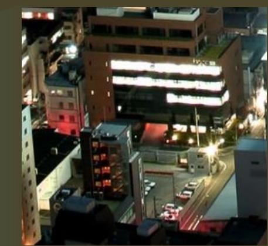

## Extraordinary Imaging

Super wide view without distortion

- Two 4 MP panoramic lenses 180**°** super-wide view
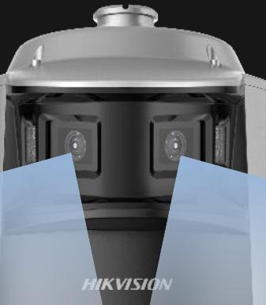

- 
### Intelligent TandemVu PTZ Camera

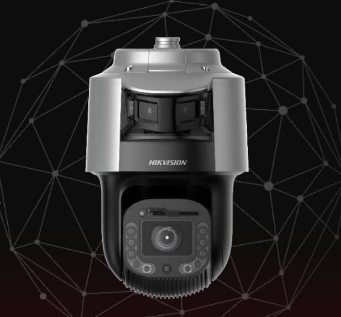

### No. 1 Target Classification

Focusing on humans and vehicles

#### TandemVu PTZ Camera

Using high-performance chips to create a variety of powerful intelligent functions through deep-learning technology

### No. 2 Smart Linkage

and faster

### No. 3 Making target tracking smarter Live Guard

Warning trespassers to minimize property losses

### No. 4 Intelligent Analysis

Generating more intelligent applications with software

## No. 1 Target Classification

#### Accurately identifies and responds

A TandemVu Camera accurately focuses on targets and events that are significant and responds to them in a timely and effective manner.

#### Reduces false alarms

It reduces the number of false alarms, reduces the workload for security personnel, and improves efficiency all around.

#### Eases search for target after an event

After an incident, security personnel can search for relevant video footage according to the target type to rapidly gather evidence for forensic review, investigation, and response.

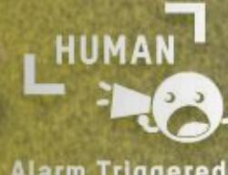

### No. 2 Smart Linkage

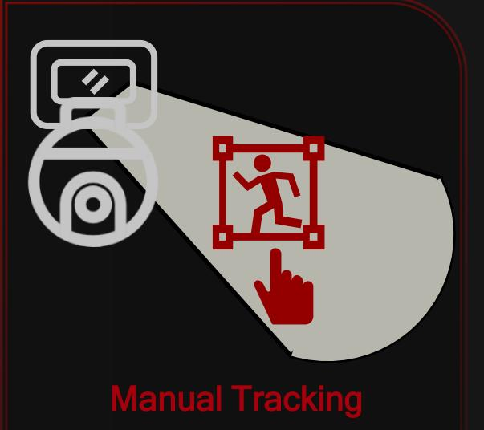

Manually select a target and the PTZ lens will track it. This mode has the highest priority.

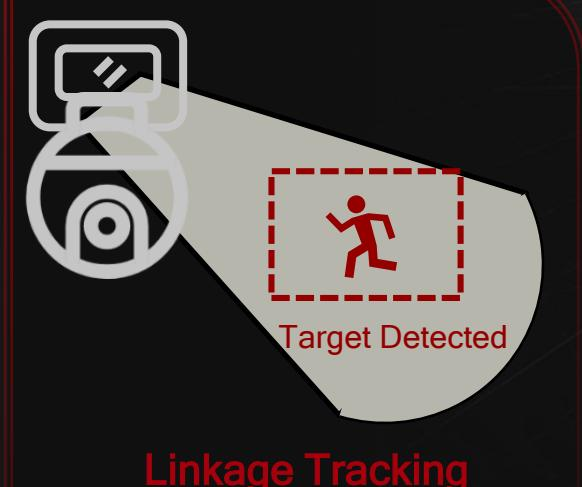

When a target appears in the specific monitoring area of the bullet lens, it will link the PTZ lens to automatically track.

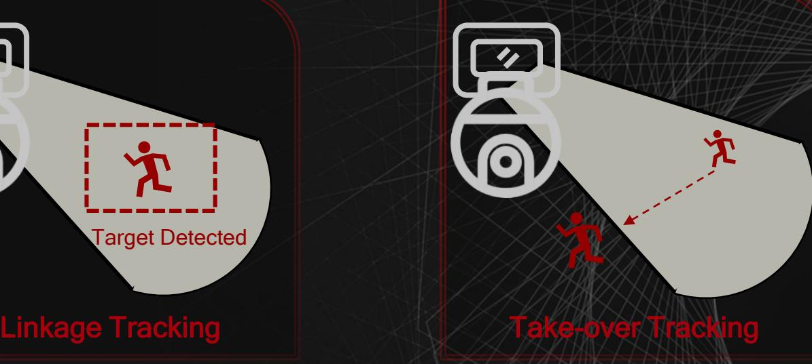

Even if the target has left the monitoring area of the bullet lens, the PTZ lens will continue to track the target.

The bullet and PTZ linkage supports multiple modes. The most suitable mode can be selected according to actual need and application.

### No. 2 Smart-Linkage – Linkage Tracking

Bullet Lens PTZ Lens

#### Function Overview

When a target enters the specified monitoring area of the bullet lens, the bullet lens will link the PTZ lens to track the target. When the target leaves the area, the PTZ lens stops tracking.

The most commonly used

## No. 3 Live Guard – Real-Time Response

One TandemVu PTZ can upgrade a security system from traditional human inspection to automatic monitoring and response.

#### Conventional Solutions

Daily inspections by security personnel are required.

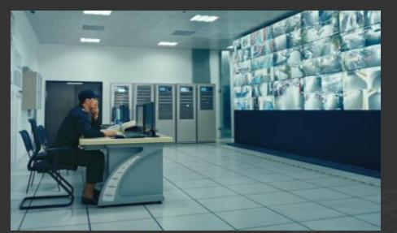

If an anomaly is found in the monitoring room, the security personnel must go to the scene.

TandemVu PTZ Solution

## No. 3 Live Guard – Visual and Auditory Warnings

Warning! This is a restricted area. Please exit this area.

¡Advertencia! Esta es un área restringida, ¡manténgase alejado!

警告! これは立ち入り禁止区域 ですので、遠ざけてください!

### Customized Audio

Audio customization is supported. (Three audio messages)

Audio Alarm

30-Meter

Audio alarms can accurately transmit warning information

### 30-Meter Strobe Light

The strobe light can give powerful warnings to targets within range

## No. 4 Intelligent Analysis

With dual AI chips, integrating multiple algorithms into one device is possible. This design tackles complex scenarios.

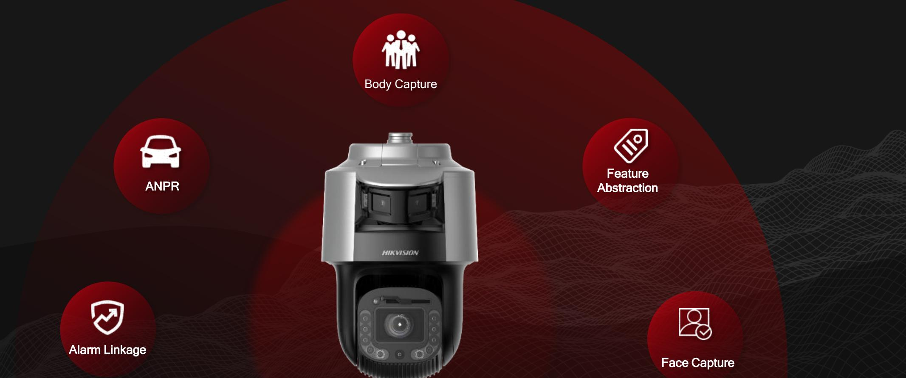

### Product Showcase – 7'' TandemVu PTZ Camera

#### Bullet

- 4 MP
- 4 mm
- 0.0005 lux @ F1.0
- 120 dB
- •

#### PTZ

- 4 MP
- 25x / 32x
- 0.005 lux @ F1.5
- 120 dB
- 

• , face capture DS-2SE7C432MW-AEB(14F1)(P3) DS-2SE7C425MW-AEB(14F1)(P3)

#### 30 m White light

#### 200 m IR distance for PTZ

Strobe lights

Built-in speaker

### Product Showcase – 8'' TandemVu PTZ Camera

#### Bullet Lens

- 4 MP (3840 × 1080)
- 0.0005 lux @ F1.0
- F1.0 large aperture
- 2.8 mm fixed lens
- 30 m white light
- •

#### PTZ Lens

- 4 MP resolution
- 0.0005 lux @ F1.2
- Up to 42x optical zoom
- 16x digital zoom
- 300 m IR light
- Strobe light and audio alarm

DS-2SF8C425MXS-DL(24F0)(P3) DS-2SF8C425MXS-DLW(24F0)(P3) DS-2SF8C442MXS-DL(24F0)(P3) DS-2SF8C442MXS-DLW(24F0)(P3) 30 m White light for bullet lens

#### Audio alarm speaker

#### 300 m IR light for PTZ (Switch according to zoom ratio)

#### Strobe light

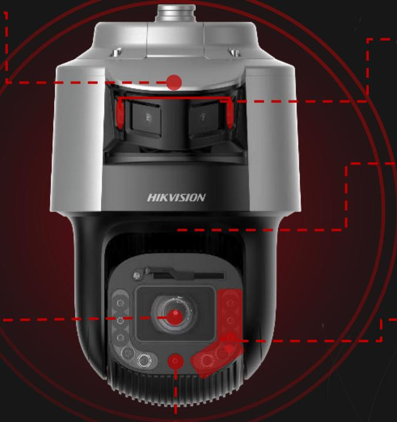

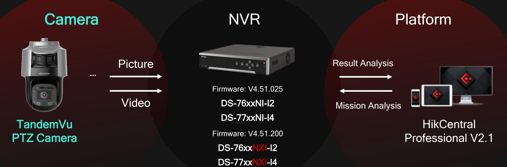

### Application Scenarios

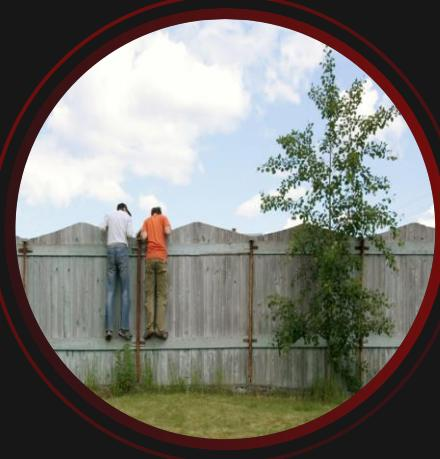

#### Perimeters City Intersections Squares

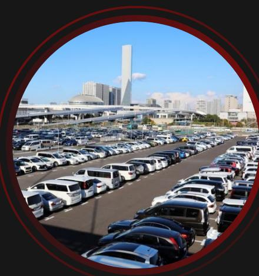

#### Expressways Outdoor Parking Lots

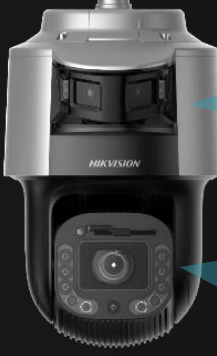

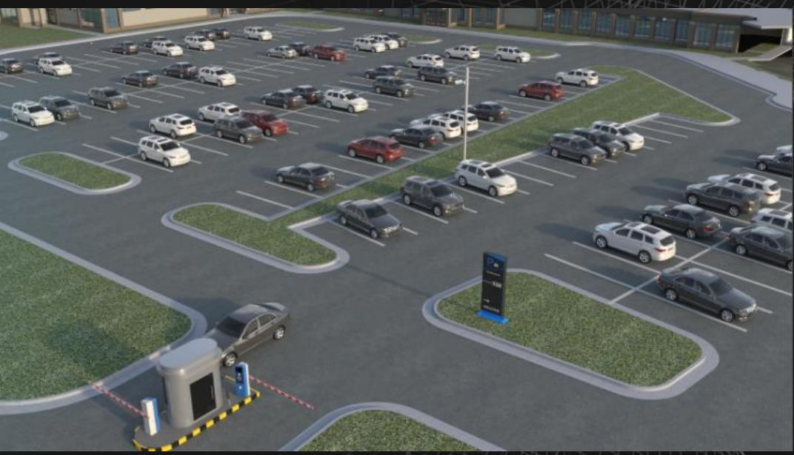

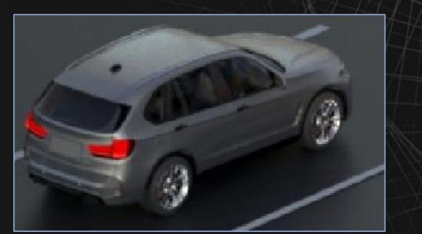

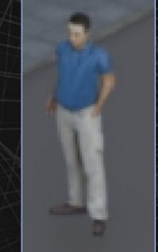

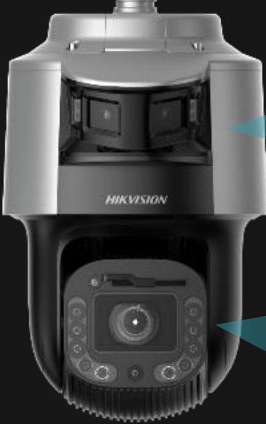

