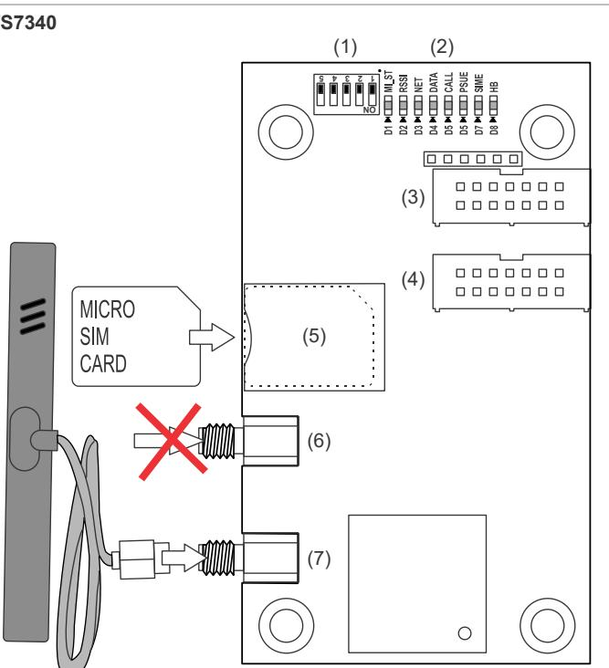
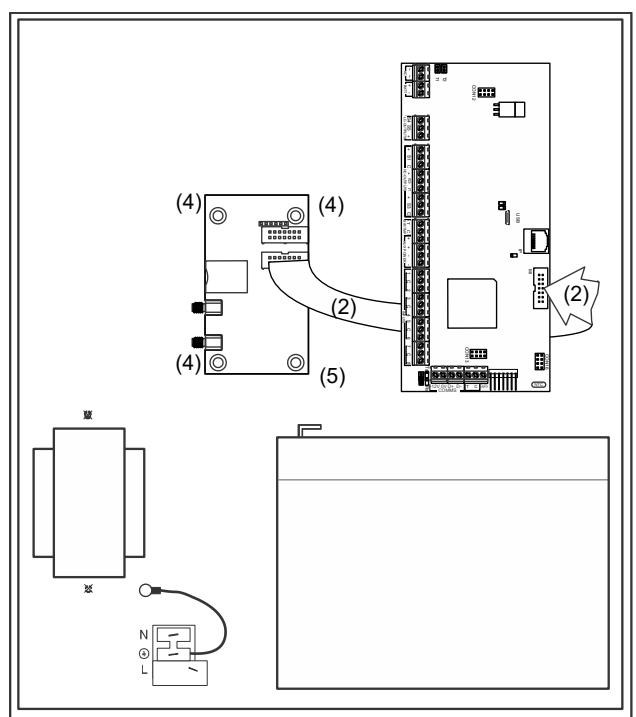
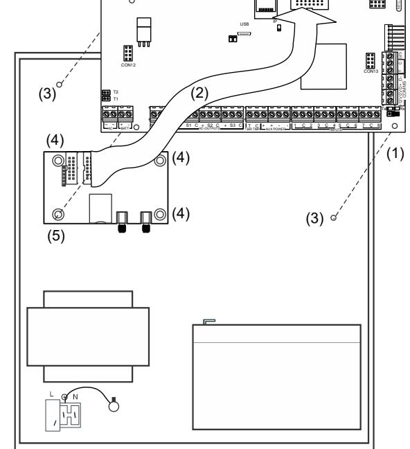
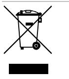

CON16

# ATS7340 4G Module Installation Sheet

## **EN DA DE ES FR IT NL NO PL PT RU SV**

# **1: ATS7340 2: ATSx500A(-IP)-SM** (1)

# **3: ATSx500A(-IP)-MM EN: Installation Sheet**

# **Description**

ATS7340 enables alarm reporting via 2G/3G/4G for the ATSx500A Advisor Advanced panels.

All reporting formats available through PSTN are fully functional, including voice reporting and audio listen-in. The 4G module can be used for primary reporting, as well as backup reporting (using multiple central stations).

ATS7340 can establish a reliable connection for remote up/downloading to and from the ATS panel.

## **Important notes**

- ATS7340-SIM is an ATS7340 4G module with a preinstalled UltraSync SIM card. This module and its SIM card should be used for UltraSync functionality only when the panel is registered in the UltraSync portal. Registering the panel in the UltraSync portal is linked to a monthly service cost.
Carrier reserves the right to check if the Carrier SIM card is used in the correct modem. Improper use of the modem or SIM card can result in the product to stop operating with the UltraSync infrastructure.

- Disable the PIN code request on your SIM card (via any mobile telephone).
- The product must be used only with the supplied antenna.
- Make sure the antenna itself is placed outside of the control panel.
- The antenna must be mounted on an appropriate distance from people, e.g. more than 200 mm.
- For up/downloading via the 4G module use a SIM card that has data enabled.
- ATS7340 cannot be connected remotely using the ATS7072 expander kit.
- This device can be installed only by a qualified electrician or other suitable trained and qualified person.

**Caution:** Ensure that there is only one GSM/GPRS dialler (ATS7320, ATS7340, TDA7400, TDA7400NG, or ATS7500) installed on the MI bus, to avoid any configuration conflicts.

# **Mounting location**

ATS7340 must be mounted inside an ATS panel housing.

## **WARNINGS**

- Disconnect the mains power before opening the cabinet. Disconnect the AC mains plug from the AC mains wall socket, or disconnect the mains using the dedicated circuit breaker.
- Disconnect the battery (when applicable).

# **Mounting the unit**

## **Figures 2 and 3**

- (1) Screws
- (2) Flat cable
- (3) Extension pillars with the plastic rings on existing pillars
- (4) Screws on clips
- (5) Screws on extension pillars

## **Mounting ATS7340 into ATSx500A-SM control panels**

See Figure 2.

- 1. Remove the screws (item 1) and lift off the control panel PCB.
- 2. Place the extension pillars with the plastic rings on top of the existing pillars (item 3).
- 3. Place the clips in the square holes (item 4).
- 4. Mount ATS7340 using the screws and extension pillars (item 5).
- 5. Place the ATS control panel PCB back into its original position.

## **Mounting ATS7340 into ATSx500A-MM control panels**

## See Figure 3.

- 1. Place the clips in the square holes (item 4). Use metal pillars when available.
- 2. Mount ATS7340 using screws.

# **Connecting the 4G module**

**WARNING:** Disconnect the AC mains plug from the AC mains wall socket.

- 1. Connect the flat cable (item 2 in Figures 2 and 3) between the control panel (MI connector) and ATS7340 (connector CON2 or CON3).
- 2. Connect the antenna to the 4G module.

**Note:** Use the antenna provided with the module to get the best signal strength.

- 3. Insert the SIM module into the SIM socket (SIM).
- 4. Apply power to the control panel and to the 4G module.
- 5. Check the field strength (RSSI LED). When required, move the antenna in order to get the best signal.

# **Operating instructions**

Refer to *ATSx500A Advisor Advanced Installation and Programming Manual* for details on:

- Operating instructions for all functionalities
- Available keys, codes, and related details
- User programmable functions

# **Testing the 4G module**

To check the correct reporting to the Central Station, we recommend you to create an event (for example, a test call, an opening, or a closing event), and to ensure that the Central Station receives this event successfully.

# **Description of the ATS7340**

## **Figure 1**

| Item     | Description | Function                                                |
|----------|-------------|---------------------------------------------------------|
| (1)      | DIP switch  | See Table 1 below.                                      |
| (2)      | LEDs        | Status LEDs.                                            |
| (3), (4) | CON3, CON2  | MI bus, system connector. Connects to the ATS panel. |
| (5)      | SIM         | SIM socket. Holds GSM micro-SIM card.                   |
| (6)      | ANT2        | Do not use.                                             |
| (7)      | ANT1        | SMA antenna connector.                                  |

# **DIP switch**

The DIP switch provides the functionality described in Table 1 below.

## **Table 1: DIP switch description**

| No. | Name | Function               | Default value |
|-----|------|------------------------|---------------|
| 1.  | TEST | Factory test mode      | Off           |
| 2.  |      | Reserved               | Off           |
| 3.  | FU   | Firmware upgrade       | Off           |
| 4.  | MFU  | Modem firmware upgrade | Off           |
| 5.  |      | Reserved               | Off           |

# **LEDs**

In the following LED descriptions, a flash is defined as 250 ms on and 250 ms off. Groups of flashes are separated by 1 s off.

## **MI_ST (D1)**

The MI_ST LED (green) displays the status of the communication interface to the panel.

## **Table 2: MI_ST LED status**

| Duty cycle | Rate (±10%) | Description                                               |
|------------|-------------|-----------------------------------------------------------|
| 100%       | —           | Power on (in case none of the cases below are valid)   |
| 0%         | —           | No power or power failure                                 |
| 25%        | 1 s         | Initialization OK, waiting for communication           |
| 50%        | 1 s         | Everything OK, communication running                      |
| 75%        | 500 ms      | Hardware failure                                          |
| 50%        | 250 ms      | Failure in communication, waiting for reinitialization |

## **RSSI (D2)**

The RSSI LED (green) indicates the field strength or signal strength found by the 4G module. The number of flashes indicates the level.

## **Table 3: RSSI LED status**

| Flashes | Description                                              |  |
|---------|----------------------------------------------------------|--|
| Off     | No field strength (no network detected)                  |  |
| 1 to 5  | Field strength indication from poor (1) to excellent (5) |  |

## **NET (D3)**

The NET LED (green) indicates the status of the network. The meaning of the number of flashes is described in Table 4 below.

## **Table 4: NET LED status**

| Flashes | Description                   |  |
|---------|-------------------------------|--|
| Off     | Not registered                |  |
| On      | Registered to home network    |  |
| 1       | Registered to roaming network |  |
| 2       | Searching network             |  |
| 3       | Denied                        |  |
| 4       | Unknown                       |  |

## **DATA (D4)**

The DATA LED (green) indicates the status of the GPRS/LTE communication.

## **Table 5: DATA LED status**

| State | Description                                                 |  |
|-------|-------------------------------------------------------------|--|
| Off   | GPRS/LTE is not available                                   |  |
| On    | GPRS/LTE is available, connection established               |  |
| Blink | GPRS/LTE is available, connection established, sending data |  |
| Flash | GPRS/LTE is available, connection not established           |  |

## **CALL (D5)**

The CALL LED (yellow) indicates status of the audio information transmitted to the central station.

## **Table 6: CALL LED status**

| Duty cycle | Rate (±10%) | Description     |
|------------|-------------|-----------------|
| 100%       | —           | Connected       |
| 0%         | —           | Offline         |
| 10%        | 1 s         | Connecting      |
| 50%        | 1 s         | Ringing present |
|            |             |                 |

## **PSUE (D6)**

The PSUE LED (red) indicates the status of the power supply.

## **Table 7: PSUE LED status**

| Duty cycle | Rate (±10%) | Description          |
|------------|-------------|----------------------|
| Off        | —           | Power supply okay    |
| 50%        | 1 s         | MI bus voltage low   |
| On         | —           | Power supply problem |

## **SIME (D7)**

The SIME LED (red) indicates the status of the SIM card. The meaning of the number of flashes is indicated in Table 8 below.

#### **Table 8: SIME LED status**

| Flashes | Description              |
|---------|--------------------------|
| Off     | Ready                    |
| 1       | PIN error                |
| 2       | PUK error                |
| 3       | PIN 2 error              |
| 4       | PUK 2 error              |
| 5       | SIM blocked from network |
| On      | SIM not present          |
|         |                          |

## **HB (D8)**

The HB LED (red) indicates that the device is running.

#### **Table 9: HB LED status**

| Duty cycle | Rate (±10%) | Description                |
|------------|-------------|----------------------------|
| Off        | —           | ATS7340 is not operational |
| 50%        | 1 s         | ATS7340 is running         |
| On         | —           | ATS7340 is not operational |
|            |             |                            |

## **Alarm transmission requirements**

All 4G module faults are logged in the control panel and indicated by the fault LED and corresponding fault messages on the keypad display.

The transmission between appropriate central stations and the 4G module is constantly monitored by sending presence (heartbeat) messages to central station receivers.

## **Advisor Advanced ATSx500A**

To program the required polling time in Advisor Advanced ATSx500A, go to menu "Heartbeat time" and set a value from every second (00:00'01) to every day (23:59'59).

In case of the dual path reporting, if the primary CS communication fails, the backup CS heartbeat time is switched from normal to frequent according to a value configured in the menu "Frequent HB time".

For programming details, see Advisor Advanced Installation and Programming Manual. The required settings for each ATS category are listed in Chapter "Regulations", section "Transmitter polling interval requirements".

#### **Substitution and information security**

- Triple-DES, Symmetric encryption algorithms are used with key length 192 bits.
- In case hash functions are used, they give a minimum of 128 bits output.
- Regular automatic key changes are used with machine generated randomized keys.

# **Specifications**

| Compatibility                                                            | ATSx500A Advisor Advanced control panel with firmware version MR4.4 or later                                                                |
|--------------------------------------------------------------------------|---------------------------------------------------------------------------------------------------------------------------------------------------|
| Power supply (via ribbon cable from control panel                     | 9 to 14 V                                                                                                                                        |
| Current consumption (at 13.8 V ±5%):                                    |                                                                                                                                                   |
| MI bus (standby) MI bus (GSM online) MI bus (2G/3G/4G max.) 200 mA | <100 mA 120 mA                                                                                                                                 |
| Wireless operating frequency                                             | 703–748 MHz (B28) 832–862 MHz (B20) 880–915 MHz (B8, E-GSM 900) 1710–1785 MHz (B3, DCS 1800) 1920–1980 MHz (B1) 2500–2570 MHz (B7) |
| Maximum power output:                                                    |                                                                                                                                                   |
| 703–748 MHz, 832–862 MHz, 1920–1980 MHz, 2500– 2570 MHz            | Class 3bis (23 dBm)                                                                                                                               |
| 1710–1785 MHz                                                            | Class 1 (30 dBm)                                                                                                                                  |
| 880–915 MHz                                                              | Class 4 (33 dBm)                                                                                                                                  |
| Dimensions                                                               | 86.5 x 50.0 mm                                                                                                                                    |
| Battery type and max. capacity                                        | See the appropriate control panel installation manual                                                                                          |
| Weight                                                                   | 35 g                                                                                                                                              |
| Temperature                                                              | −10 to +55°C                                                                                                                                      |
| Relative humidity                                                        | <95% noncondensing                                                                                                                                |
| Serviceable parts                                                        | There are no serviceable parts in ATS7340                                                                                                      |
| SPT type                                                                 | EN 50131-10:2014 Type Y                                                                                                                           |

# **Regulatory information**

| Manufacturer                        | Carrier Fire & Security Americas Corporation, Inc. 13995 Pasteur Blvd Palm Beach Gardens, FL 33418, USA                                                                                                                                                                                                                                                                                                                   |
|-------------------------------------|---------------------------------------------------------------------------------------------------------------------------------------------------------------------------------------------------------------------------------------------------------------------------------------------------------------------------------------------------------------------------------------------------------------------------------|
|                                     | Authorized EU manufacturing representative: Carrier Fire & Security B.V. Kelvinstraat 7, 6003 DH Weert, Netherlands                                                                                                                                                                                                                                                                                                       |
| Product warnings and disclaimers | THESE PRODUCTS ARE INTENDED FOR SALE TO AND INSTALLATION BY QUALIFIED PROFESSIONALS. CARRIER FIRE & SECURITY CANNOT PROVIDE ANY ASSURANCE THAT ANY PERSON OR ENTITY BUYING ITS PRODUCTS, INCLUDING ANY "AUTHORIZED DEALER" OR "AUTHORIZED RESELLER", IS PROPERLY TRAINED OR EXPERIENCED TO CORRECTLY INSTALL FIRE AND SECURITY RELATED PRODUCTS. For more information on warranty disclaimers and |
|                                     | product safety information, please check https://firesecurityproducts.com/policy/product warning/ or scan the QR code.                                                                                                                                                                                                                                                                                                    |
| Certification                       |                                                                                                                                                                                                                                                                                                                                                                                                                                 |
|                                     | This product was tested and certified to EN 50136-2:2013 for Alarm transmission system performance SP5 for reporting over GPRS to the OH or UltraSync Receiver.                                                                                                                                                                                                                                                        |
|                                     | This product was tested and certified to EN 50136-2:2013 for Alarm transmission system performance DP3 for backup reporting over GPRS to the UltraSync Receiver.                                                                                                                                                                                                                                                       |
|                                     | This product was tested and certified to EN 50136-2:2013 for Alarm transmission system performance DP4 for backup reporting over GPRS to the OH Receiver.                                                                                                                                                                                                                                                              |
|                                     | Alarm transmission class: Pass-through operation mode.                                                                                                                                                                                                                                                                                                                                                                       |
|                                     | Carrier Fire & Security hereby declares that this device is in compliance with the applicable requirements and provisions of all applicable rules and regulations, including but not limited to the Directive 2014/53/EU. For more information see: firesecurityproducts.com                                                                                                                                     |
| REACH                               | Product may contain substances that are also Candidate List substances in a concentration above 0.1% w/w, per the most recently published Candidate List found at ECHA Web site. Safe use information can be found at https://firesecurityproducts.com/en/content/intrusi on-intro                                                                                                                            |
|                                     | 2012/19/EU (WEEE directive): Products marked with this symbol cannot be disposed of as unsorted municipal waste in the European Union. For proper recycling, return this product to your local supplier upon the purchase of equivalent new equipment, or dispose of it at designated collection points. For more information see: recyclethis.info                                                        |
| Product documentation            | Please consult the following web link to retrieve the electronic version of the product documentation. This link will guide you to the EMEA regional contact page. On this page you can request your login to the secured web portal where all manuals are stored. https://firesecurityproducts.com/en/contact                                                                                             |

## firesecurityproducts.com or www.aritech.com

# **DA: Installations vejledning**

# **Indledning**

ATS7340 muliggør alarm transmission via 2G/3G/4G for ATSx500A Advisor Advanced centralerne.

Alle de transmissionsformater, der står til rådighed gennem PSTN er fuldt funktionsdygtige, herunder også taletransmission eller audio lytte ind. 4G modulet kan bruges til primær transmission såvel som til backup transmission (ved brug af flere kontrolcentraler).

ATS7340 giver mulighed for at oprette en stabil 4G-forbindelse for up/download fra mellem et ATS system og en PC.

## **Vigtigt**

- ATS7340-SIM er et ATS7340 4G modul med et PRE installeret UltraSync SIM kort. Dette modul og SIM kort skal bruges sammen med UltraSync funktionaliteten, og kun hvis AIA centralen er registreret i UltraSync portalen. Registreringen af AIA centralen i UltraSync portalen er sammenkoblet med en betalingsafgift pr. måned.
Carrier forbeholder sig ret til at kontrollere om Carrier SIM kort er benyttet I det korrekte modem. Ukorrekt anvendelse af modem eller SIM kort kan medføre at produktet stopper med at virke sammen med UltraSync infrastruktur.

- Pin koden skal deaktiveres på SIM kortet (gøres via en mobiltelefon).
- Produktet må kun bruges sammen med den medfølgende antenne.
- Sørg for, at 4G modulets antenne er placeret uden for centralenhedens metalkabinet.
- Antennen skal monteres i passende afstand fra personer. F.eks. mere end 200 mm.
- For at kunne op/downloade via 4G modulet, skal der benyttes SIM kort der tillader data.
- ATS7340 kan ikke forbindes til centralen ved brug af ATS7072 udvidelses kit.
- Denne enhed må kun installeres af en kvalificeret elektriker eller tilsvarende uddannet og kvalificeret person.

**Bemærk:** Det må kun være en GSM/GPRS sender (ATS7340, ATS7320, TDA7400, TDA7400NG eller TDA7500) installeret på MI bus, for at forhindre konfigurations konflikt.

# **Monteringssted**

ATS7340 skal monteres inde i et ATS kabinet.

## **ADVARSEL**

- Afbryd netspændingen før kabinettet åbnes.
- Afbryd forbindelsen til akkumulatoren.

# **Montering af enheden**

#### **Figurere 2 og 3**

- (1) Skruer
- (2) Fladkabel
- (3) Forlængerstag med plastic ringe på eksisterende stag
- (4) Skruer på clips
- (5) Skruer på udvidelse stag

## **Montering af ATS7340 i ATSx500A-SM centraler**

Se figur 2.

- 1. Fjern skruerne (punkt 1) og løft centralenhedens PCB af.
- 2. Placer forlængerstagene med plastikringene oven på de eksisterende stag (punkt 3).
- 3. Placer metalclipsene i de firkantede huller (punkt 4).
- 4. Monter ATS7340 ved hjælp af skruerne og forlængerstag (punkt 5).
- 5. Placer på ny ATS centralenhedens PCB i dens oprindelige position.

## **Montering af ATS7340 i ATSx500A-MM centraler**

Se figur 3.

- 1. Placer metalclipsene i de firkantede huller (punkt 4). Brug om muligt metalstag.
- 2. Monter ATS7340 ved hjælp af skruerne.

# **Tilslutning af 4G modul**

**ADVARSEL:** Afbryd netspændingen før kabinettet åbnes.

- 1. Tilslut fladkabelet (Figur 2 og 3, enhed 2) mellem centralenheden (konnektor MI) og ATS7340 (konnektor CON2 eller CON3).
- 2. Tilslut antennen til 4G modulet.
	- **Bemærk:** Produktet må kun bruges sammen med den medfølgende antenne.
- 3. Indsæt SIM-kortet i SIM-soklen (SIM).
- 4. Tilslut spænding til centralenheden og 4G modulet.
- 5. Kontroller feltstyrken (RSSI LED). Flyt om nødvendigt antennen for at opnå et bedre signal.

# **Betjeningsvejledning**

Se *ATSx500A Advisor Advanced Installations og Programmings manual* for detaljer om:

- Betjeningsvejledning til alle funktioner
- Tilgængelige nøgler, koder og relaterede detaljer
- Bruger programmerbare funktioner

# **Test af 4G modul**

For at kontrollere korrekt transmission til kontrolcentralen, anbefales det at foretage en hændelse (f.eks. testopkald, en tilkobling og frakableing) og sikre sig at kontrolcentralen har modtaget hændelserne korrekt.

# **Beskrivelse af ATS7340**

#### **Figur 1**

| Nr.      | Beskrivelse | Funktion                                                       |
|----------|-------------|----------------------------------------------------------------|
| (1)      | DIP switch  | Se Tabel 1 nedenfor.                                           |
| (2)      | LEDs        | Statusindikering.                                              |
| (3), (4) | CON3, CON2  | Konnektor MI. Kommunikerer mellem ATS7340 og ATS centralen. |
| (5)      | SIM         | SIM-sokkel. Til mikro-SIM-kort.                                |
| (6)      | ANT2        | For fremtidig brug.                                            |
| (7)      | ANT1        | SMA antenne konnektor.                                         |

# **DIP switch**

Indstilling af DIP switch funktion er beskrevet i Tabel 1 nedenfor.

## **Tabel 1: DIP switch beskrivelse**

| Nr. | Navn | Funktion                  | Standard værdi |
|-----|------|---------------------------|----------------|
| 1.  | TEST | Fabrikstest tilstand      | Off            |
| 2.  |      | Reserveret                | Off            |
| 3.  | FU   | Firmware opdatering       | Off            |
| 4.  | MFU  | Modem firmware opdatering | Off            |
| 5.  |      | Reserveret                | Off            |

## **LEDs**

I den følgende LED beskrivelse, er et blink defineret som 250 ms on og 250 ms off. Grupper af blink er adskilt af 1 sekund off.

## **MI_ST (D1)**

MI_ST LED (grøn) angiver status for kommunikationsinterface til centralen.

## **Tabel 2: MI LED status**

| Cyklus | Rate (±10%) | Beskrivelse                                                                                |
|--------|-------------|--------------------------------------------------------------------------------------------|
| 100%   | —           | Power ON — Spænding tilsluttet (i det tilfælde at ingen af nedenstående er gældende) |
| 0%     | —           | Ingen spænding / spændingsfejl                                                             |
| 25%    | 1 s         | Initialisering OK, afventer kommunikation                                                  |
| 50%    | 1 s         | Alt OK, kommunikation i gang                                                               |
| 75%    | 500 ms      | Hardwarefejl                                                                               |
| 50%    | 250 ms      | Kommunikationsfejl, afventer geninitialisering                                          |

## **RSSI (D2)**

RSSI LED (grøn) angiver den feltstyrke eller signalstyrke, som registreres af 4G modulet. Antallet af glimt angiver niveauet.

#### **Tabel 3: RSSI LED status**

| Pulser | Beskrivelse                                            |
|--------|--------------------------------------------------------|
| Off    | Ingen feltstyrke (intet netværk detekteret)            |
| 1–5    | Angivelse af feltstyrke fra ringe (1) til udmærket (5) |

## **NET (D3)**

NET LED (grøn) indikere status på GSM netværket. Betydning af blink er beskrevet i nede stående tabel.

#### **Tabel 4: NET LED status**

| Blink | Beskrivelse                         |
|-------|-------------------------------------|
| Off   | Ikke registeret                     |
| On    | Registrerede til eget netværk       |
| 1     | Registrerede til et roaming netværk |
| 2     | Søger netværk                       |
| 3     | Afvist                              |
| 4     | Ukendt                              |
|       |                                     |

## **DATA (D4)**

DATA LED (grøn) indikerer status på GPRS/LTE kommunikationen.

#### **Tabel 5: DATA LED status**

| Status       | Beskrivelse                                                    |
|--------------|----------------------------------------------------------------|
| Off          | GPRS/LTE er ikke tilgængelig                                   |
| On           | GPRS/LTE er tilgængelig, forbindelse etableret                 |
| Blink (50%)  | GPRS/LTE er tilgængelig, forbindelse etableret, sender data |
| Flash (kort) | GPRS/LTE er tilgængelig, forbindelse ikke etableret            |

## **CALL (D5)**

CALL LED (gul) angiver status for transmission til kontrolcentral.

#### **Tabel 6: CALL LED status**

| Cyklus | Rate (±10%) | Beskrivelse      |  |
|--------|-------------|------------------|--|
| 100%   | —           | Tilsluttet       |  |
| 0%     | —           | Offline          |  |
| 10%    | 1 s         | Tilslutning sker |  |
| 50%    | 1 s         | Ringning sker    |  |

## **PSUE (D6)**

PSUE LED (rød) indikere status på strømforsyningen.

#### **Tabel 7: PSUE LED status**

| Cyklus | Rate (±10%) | Beskrivelse              |
|--------|-------------|--------------------------|
| Off    | —           | Strømforsyning OK        |
| 50%    | 1 s         | MI bus spænding lav      |
| On     | —           | Strømforsynings problem. |

## **SIME (D7)**

SIME LED (rød) Indikere status på SIM kortet. Betydning af blink er beskrevet i nede stående tabel.

**Tabel 8: SIME LED status**

| Blink | Beskrivelse |
|-------|-------------|
| Off   | Klar        |

| Blink | Beskrivelse                   |
|-------|-------------------------------|
| 1     | PIN fejl                      |
| 2     | PUK fejl                      |
| 3     | PIN 2 fejl                    |
| 4     | PUK 2 fejl                    |
| 5     | SIM er blokeret fra netværket |
| On    | SIM mangler                   |

## **HB (D8)**

HB LED (rød) indikerer at enheden kører.

#### **Tabel 9: HB LED status**

| Cyklus  | Rate (±10%) | Beskrivelse             |
|---------|-------------|-------------------------|
| Slukket | —           | ATS7340 er ikke I drift |
| 50%     | 1 s         | ATS7340 kører           |
| Tændt   | —           | ATS7340 er ikke I drift |

# **Krav til alarmtransmissionssystem**

Alle 4G-modulfejl bliver logget i centralen og indikeret med fejl-LED'en og tilhørende fejlmeddelelser på tastatures display.

Transmissionen mellem de pågældende centraler og 4Gmodulet bliver konstant overvåget ved at sende (poll meddelelser til alarmcentralmodtagere.

## **Advisor Advanced**

Gå til menuen "Poll tid" for at programmere de ønskede pollingtid i Advisor Advanced ATSx500A, og angiv en værdi fra hvert sekund (00:00'01) til en gang hver dag (23:59'59).

I tilfælde af dobbelt sti-transmission ændres poll tiden for backup-KC, hvis den primære KC-kommunikation svigter, fra normal til hyppigt i henhold til en konfigureret værdi i menuen "Poll tid".

Se detaljer om programmering i installations- og programmeringsvejledning til Advisor Advanced. De krævede indstillinger for hver ATS-kategori er anført i kapitlet "Regulations" (Bestemmelser), afsnit "Transmitter polling interval requirements" (Krav til transmissions pollinginterval).

## **Udskiftning og sikkerhed**

- Der anvendes trippel-DES, symmetriske krypteringsalgoritmer med nøglelængde på 192 bit.
- Hvis der bruges hash-funktioner, giver de mindst 128 bit længde.
- Der anvendes regelmæssige automatiske nøgleændringer sammen med maskingenererede randomiserede nøgler.

# **Specifikationer**

| kompatibilitet                                        | ATSx500A Advisor Advanced centraler med firmware version MR4.4 eller nyere |
|-------------------------------------------------------|----------------------------------------------------------------------------------|
| Strømforsyning (via fladkabel fra central enheden) | 9 til 14 V                                                                      |
| Løbende strømforbrug (ved 13.8 V ±5%):               |                                                                                  |
| MI bus (standby)                                      | <100 mA                                                                          |
|                                                       |                                                                                  |

| MI bus (GSM online)                                           | 120 mA                                                                                                                                            |
|---------------------------------------------------------------|---------------------------------------------------------------------------------------------------------------------------------------------------|
| MI bus (2G/3G/4G maks.)                                       | 200 mA                                                                                                                                            |
| WiFi frekvens                                                 | 703–748 MHz (B28) 832–862 MHz (B20) 880–915 MHz (B8, E-GSM 900) 1710–1785 MHz (B3, DCS 1800) 1920–1980 MHz (B1) 2500–2570 MHz (B7) |
| Maksimal effekt:                                              |                                                                                                                                                   |
| 703–748 MHz, 832–862 MHz, 1920–1980 MHz, 2500– 2570 MHz | Class 3bis (23 dBm)                                                                                                                               |
| 1710–1785 MHz                                                 | Class 1 (30 dBm)                                                                                                                                  |
| 880–915 MHz                                                   | Class 4 (33 dBm)                                                                                                                                  |
|                                                               |                                                                                                                                                   |
| Dimensioner                                                   | 86,5 x 50,0 mm                                                                                                                                    |
| Akkumulator type og maks. kapacitet                        | Se relevante central installations manual                                                                                                      |
| Vægt                                                          | 35 g                                                                                                                                              |
| Temperatur                                                    | −10 til +55°C                                                                                                                                     |
| Relativ fugtighed                                             | <95% ikke kondenserende                                                                                                                           |
| Servicedele                                                   | Der er ingen servicedele i ATS7340                                                                                                                |

# **Certificering og overholdelse**

| Producent                                                | Carrier Fire & Security Americas Corporation, Inc. 13995 Pasteur Blvd Palm Beach Gardens, FL 33418, USA Europæisk repræsentant for producent: Carrier Fire & Security B.V. Kelvinstraat 7, 6003 DH Weert, Netherlands                                                                                                                                                                                                                                                                                                                                                   |
|----------------------------------------------------------|----------------------------------------------------------------------------------------------------------------------------------------------------------------------------------------------------------------------------------------------------------------------------------------------------------------------------------------------------------------------------------------------------------------------------------------------------------------------------------------------------------------------------------------------------------------------------------------|
| Advarsler og fraskrivelser vedrørende produktet | DISSE PRODUKTER ER BEREGNET TIL SALG TIL OG INSTALLATION AF KVALIFICEREDE FAGFOLK. CARRIER FIRE & SECURITY KAN IKKE GIVE NOGEN GARANTI FOR, AT EN PERSON ELLER ENHED, DER KØBER VORES PRODUKTER, INKLUSIVE EN "AUTORISERET FORHANDLER", ER BEHØRIGT UDDANNET ELLER ERFAREN TIL KORREKT INSTALLATION AF BRAND- OG SIKKERHEDSRELATEREDE PRODUKTER. Flere oplysninger om garanti og fraskrivelser samt oplysninger om produktsikkerhed kan findes ved at gå til https://firesecurityproducts.com/policy/product warning/ eller scanne QR-koden. |
| Certificering                                            |                                                                                                                                                                                                                                                                                                                                                                                                                                                                                                                                                                                        |
|                                                          | Dette produkt er testet og certificeret I henhold til EN 50136-2:2013 for opfyldelse af Alarm transmission system SP5 for transmission over GPRS til UltraSync eller OH modtager.                                                                                                                                                                                                                                                                                                                                                                                             |
|                                                          | Dette produkt er testet og certificeret i henhold til EN 50136-2:2013 for alarm transmission systemer med klassificering DP3, for backup rapportering over GPRS, til en UltraSync modtager.                                                                                                                                                                                                                                                                                                                                                                                |
|                                                          | Dette produkt er testet og certificeret i henhold til EN 50136-2:2013 for alarm transmission systemer med klassificering DP4, for backup rapportering over GPRS, til en OH modtager.                                                                                                                                                                                                                                                                                                                                                                                          |
|                                                          | Alarm transmission klasse: Pass-through driftstilstand.                                                                                                                                                                                                                                                                                                                                                                                                                                                                                                                             |

|                       | Carrier Fire & Security erklærer herved, at denne enhed overholder gældende regler og bestemmelser i alle gældende regler og bestemmelser, indeholdt men ikke begrænset til direktivet 2014/53/EU. For yderligere informationer se firesecurityproducts.com.                                                                                                                                                                                                                                                   |
|-----------------------|-------------------------------------------------------------------------------------------------------------------------------------------------------------------------------------------------------------------------------------------------------------------------------------------------------------------------------------------------------------------------------------------------------------------------------------------------------------------------------------------------------------------------------|
| REACH                 | Produktet kan indeholde stoffer, er også er kandidatliste stoffer i en koncentration over 0,1% w/w, pr. Den seneste offentliggjorte kandidatliste, findes på ECHAs websted.                                                                                                                                                                                                                                                                                                                                          |
|                       | Oplysninger om sikker brug findes på https://firesecurityproducts.com/en/content/intrusi on-intro                                                                                                                                                                                                                                                                                                                                                                                                                       |
|                       | 2012/19/EU (WEEE): Bortskaffelse af elektrisk og elektronisk udstyr har til formål at minimere den indvirkning, som affald af elektrisk og elektronisk udstyr har på miljøet og mennesker. I henhold til direktivet må elektrisk udstyr, der er mærket med dette symbol, ikke bortskaffes sammen med almindeligt husholdningsaffald i Europa. Europæiske brugere af elektrisk udstyr skal aflevere kasserede produkter til genbrug. Yderligere oplysninger findes på webstedet recyclethis.info |
| Produkt dokumation | Se følgende weblink for at hente den elektroniske version af produktdokumentationen.                                                                                                                                                                                                                                                                                                                                                                                                                                       |
|                       | Denne link vil guide dig til EMEA's regionale kontaktside. På denne side kan du anmode om dit log-ind til den sikrede webportal, hvor alle manualer er gemt. https://firesecurityproducts.com/en/contact                                                                                                                                                                                                                                                                                                          |

# **Kontaktinformation**

firesecurityproducts.com eller www.aritech.com

# **DE: Installationsanleitung**

# **Einführung**

Das ATS7340 ermöglicht die Alarmübertragung mittels 2G/3G/4G für die ATSx500A Advisor Advanced Zentralen.

Alle über PSTN (Analog) verfügbaren Übertragungsformate können übertragen werden, einschließlich Sprachübertragung und Audio-Listen-In. Das 4G-Modul kann sowohl für Primärmeldungen als auch für Ersatzmeldungen (bei mehreren Wachdiensten) eingesetzt werden.

Das ATS7340 kann auch für die Herstellung einer zuverlässigen Datenverbindung für Up-/Downloads zu und von der ATS-Zentrale genutzt werden.

## **Wichtige Hinweise**

- Das ATS7340-SIM ist ein ATS7340 4G-Modul mit einer vorinstallierten UltraSync SIM-Karte. Dieses Modul und seine SIM-Karte sollten nur dann für die UltraSyncFunktionalität verwendet werden, wenn die Zentrale im UltraSync-Portal registriert ist. Die Registrierung der Zentrale im UltraSync-Portal ist mit einem monatlichen Servicegebühr verbunden.
Carrier behält sich das Recht vor, zu überprüfen, ob die Carrier SIM-Karte mit dem korrekten Modem verwendet wird. Eine unsachgemäße Verwendung des Modems oder der SIM-Karte kann zu führen, dass kein weitere Nutzung der UltraSync-Infrastruktur möglich ist.

- Deaktivieren Sie die PIN-Abfrage Ihrer SIM-Karte (über Mobiltelefon).
- Das Produkt darf nur mit der mitgelieferten Antenne verwendet werden.
- Stellen Sie sicher, dass die Antenne außerhalb der Einbruchmeldezentrale platziert wird.
- Die Antenne muss in einem ausreichenden Abstand von Personen angebracht werden; zum Beispiel mehr als 200 mm.
- Um über das 4G-Modul Daten herauf-/herunterzuladen, aktivieren Sie der Datenübertragung Ihrer SIM-Karte.
- Das ATS7340 kann nicht abgesetzt durch Verwendung des ATS7072 Erweiterungs-Kit verbunden werden.
- Dieses Gerät darf nur durch einen qualifizierten Techniker oder einer anderen, entsprechend geschulten Person installiert werden.

**Vorsicht:** Stellen Sie sicher, dass nur ein GSM/GPRS Wählgerät (ATS7320, ATS7340, TDA7400, TDA7400NG oder TDA7500) an dem MI-Bus installiert wird, um Konfigurationskonflikte zu vermeiden.

# **Montageort**

Das ATS7340 muss im Gehäuse einer ATS-Einbruchmeldezentrale montiert werden.

## **WARNUNG**

- Schalten Sie die Netzspannung ab, bevor Sie das Gehäuse öffnen. Ziehen Sie den Netzstecker aus der Wandsteckdose, oder unterbrechen Sie die Spannungsversorgung mit dem zugehörigen Sicherungsautomaten.
- Unterbrechen Sie die Zuleitung zu der Batterie (falls zutreffend).

# **Montage des Geräts**

## **Abbildung 2 und 3**

- (1) Schrauben
- (2) Flachbandkabel
- (3) Abstandsbolzen mit Plastikunterlegscheiben für bestehende Abstandsbolzen
- (4) Schrauben für Metallklammern
- (5) Schrauben für Abstandsbolzen

## **Montage des ATS7340 in ATSx500A-SM Zentralen**

Siehe Abbildung 2.

- 1. Entfernen Sie die Schrauben (Position 1), und heben Sie die Einbruchmeldezentralen-Platine an.
- 2. Platzieren Sie die Erweiterungsstützen mit den Kunststoffringen oben auf den vorhandenen Stützen (Position 3).
- 3. Platzieren Sie die Klammern in den rechteckigen Löchern (Position 4).
- 4. Befestigen Sie das ATS7340 mithilfe der Schrauben und der Erweiterungsstützen (Position 5).

- 5. Platzieren Sie die ATS-Einbruchmeldezentralen-Platine wieder an ihrer ursprünglichen Position.
## **Montage des ATS7340 in ATSx500A-MM Zentralen**

Siehe Abbildung 3.

- 1. Platzieren Sie die Klammern in den rechteckigen Löchern (Position 4). Verwenden Sie Metallpfosten, falls verfügbar.
- 2. Befestigen Sie das ATS7340 mithilfe von Schrauben.

## **Anschließen des 4G-Moduls**

## **WARNUNG:** Ziehen Sie den Netzstecker aus der Wandsteckdose.

- 1. Verbinden Sie die Einbruchmeldezentrale (Anschluss MI) und das ATS7340 (Anschluss CON2 oder CON3) mit dem Flachbandkabel (Abbildung 2–3, Position 2).
- 2. Schließen Sie die Antenne an das 4G-Modul an.

**Hinweis:** Das Produkt darf nur mit der mitgelieferten Antenne verwendet werden.

- 3. Setzen Sie die SIM-Karte in den SIM-Steckplatz ein (SIM).
- 4. Verbinden Sie die Einbruchmeldezentrale und das 4G-Modul mit dem Stromkreis.
- 5. Überprüfen Sie die Feldstärke (RSSI LED). Fall erforderlich, richten Sie die Antenne anders aus, um das bestmögliche Signal zu empfangen.

# **Bedienungsanleitungen**

Weitere Informationen finden Sie im *ATSx500A Advisor Advanced Installations- und Programmierhandbuch*:

- Bedienungsanleitung für alle Funktionalitäten
- Verfügbare Schlüssel, Codes und zugehörige Details
- Benutzerprogrammierbare Funktionen

# **Testen des 4G-Moduls**

Um die korrekte Meldungsübertragung an den Wachdienst zu überprüfen, wird empfohlen ein Ereignis zu aktivieren (zum Beispiel ein Testruf oder ein Scharf/Unscharf Ereignis), um sicherzustellen, dass die Übertragung der Meldung auch erfolgreich von dem Wachdienst empfangen wurde.

# **Beschreibung des ATS7340**

## **Abbildung 1**

| Position | Beschreibung | Funktion                                                                              |
|----------|--------------|---------------------------------------------------------------------------------------|
| (1)      | DIP-Schalter | Siehe Tabelle 1 unten.                                                                |
| (2)      | LEDs         | LEDs zur Statusanzeige.                                                               |
| (3), (4) | CON3, CON2   | Anschluss MI. Kommuniziert zwischen dem ATS7340 und der Einbruchmelde zentrale. |
| (5)      | SIM          | SIM-Steckplatz. Platzieren Sie hier die Micro-SIM-Karte.                           |
| (6)      | ANT2         | Für die zukünftige Verwendung.                                                        |
| (7)      | ANT1         | SMA Antennenanschluß.                                                                 |

## **DIP-Schalter**

Die DIP-Schalter verfügen über die nachfolgend in Tabelle 1 beschriebene Funktionalität

#### **Tabelle 1: DIP-Schalter Beschreibung**

| Nr. | Name | Funktion               | Werkseinstellung |
|-----|------|------------------------|------------------|
| 1.  | TEST | Werksprüfung/Testmodus | Aus              |
| 2.  |      | Reserviert             | Aus              |
| 3.  | FU   | Firmware-Upgrade       | Aus              |
| 4.  | MFU  | Modem Firmware-Upgrade | Aus              |
| 5.  |      | Reserviert             | Aus              |

## **LED's**

In der folgenden LED-Beschreibung wird ein Blinken mit einer Aktivierungsdauer von 250 ms AN und 250 ms AUS definiert. Eine Folge von Blinksignalen wird durch eine Wartezeit von 1 Sekunde unterbrochen.

## **MI_ST (D1)**

Die MI_ST-LED (grün) zeigt den Status der Kommunikationsschnittstelle zur Einbruchmeldezentrale an.

#### **Tabelle 2 : MI_ST-LED-Status**

| Einschaltdauer | Rate (±10%) | Beschreibung                                                        |
|----------------|-------------|---------------------------------------------------------------------|
| 100%           | —           | Spannung EIN (sofern keiner der unten genannten Fälle zutrifft)  |
| 0%             | —           | Keine Spannung oder Netzausfall                                     |
| 25%            | 1 s         | Initialisierung ist OK, Warten auf Kommunikation                 |
| 50%            | 1 s         | Alles ist OK, Kommunikation wird übertragen                      |
| 75%            | 500 ms      | Hardwarefehler                                                      |
| 50%            | 250 ms      | Fehler bei der Kommunikation, Warten auf erneute Initialisierung |

## **RSSI (D2)**

Die RSSI-LED (grün) zeigt die vom 4G-Modul ermittelte Feldoder Signalstärke an. Die Stärke bestimmt sich danach, wie häufig die LED aufblinkt.

| Tabelle 3 : RSSI-LED-Status |                                                |  |
|-----------------------------|------------------------------------------------|--|
| Blinkt                      | Beschreibung                                   |  |
| Aus                         | Keine Feldstärke (kein Netzwerk erkannt).      |  |
| 1–5                         | Feldstärke schlecht (1) bis ausgezeichnet (5). |  |
|                             |                                                |  |

## **NET (D3)**

Die NET LED (grün) signalisiert den Status des GSM-Nertzwerks. Die Bedeutung der angezeigten Blinksignale ist in der nachfolgenden Tabelle beschrieben.

| Tabelle 4: NET LED-Status |                                |  |
|---------------------------|--------------------------------|--|
| Blinkt                    | Beschreibung                   |  |
| Ausf                      | Nicht eingebucht               |  |
| An                        | In Heim-Netzwerk eingebucht    |  |
| 1                         | In Roaming-Netzwerk eingebucht |  |

| Blinkt | Beschreibung  |  |
|--------|---------------|--|
| 2      | Netzwerksuche |  |
| 3      | Abgelehnt     |  |
| 4      | Unbekannt     |  |
|        |               |  |

## **DATA (D4)**

Die DATA LED (grün) signalisiert den Status der GPRS/LTE Kommunikation.

## **Tabelle 5: DATA LED-Status**

| Zusatnd | Beschreibung                                                   |  |
|---------|----------------------------------------------------------------|--|
| Aus     | GPRS/LTE ist nicht verfügbar                                   |  |
| An      | GPRS/LTE ist verfügbar, Verbindung hergestellt                 |  |
| Blinkt  | GPRS/LTE ist verfügbar, Verbindung hergestellt, sende Daten |  |
| Blitzt  | GPRS/LTE ist verfügbar, Verbindung nicht hergestellt           |  |

## **CALL (D5)**

Die CALL-LED (gelb) zeigt den Status der an den Wachdienst übermittelten Audioinformationen an.

## **Tabelle 6: CALL-LED-Status**

| Einschaltdauer | Rate (±10%)           | Beschreibung        |
|----------------|-----------------------|---------------------|
| 100%           | —                     | Verbunden           |
| 0%             | —                     | Offline             |
| 10%            | 1 s Wird verbunden |                     |
| 50%            | 1 s                   | Rufsignal vorhanden |

## **PSUE (D6)**

Die PSUE LED (rot) signalisiert den Zustand des GSM-Netzteils.

## **Tabelle 7: PSUE LED-Status**

| Einschaltdauer | Rate (±10%) | Beschreibung           |
|----------------|-------------|------------------------|
| Aus            | —           | Netzteil ist OK        |
| 50%            | 1 s         | MI-Busspannung niedrig |
| An             | —           | Netzteilproblem        |

## **SIME (D7)**

Die SIME LED (rot) signalisiert den Zustand der SIM-Karte. Die Bedeutung der angezeigten Blinksignale ist in der nachfolgenden Tabelle beschrieben.

## **Tabelle 8: SIME LED-Status**

| Blinkt | Beschreibung                           |
|--------|----------------------------------------|
| Aus    | Bereit                                 |
| 1      | PIN Fehler                             |
| 2      | PUK Fehler                             |
| 3      | PIN 2 Fehler                           |
| 4      | PUK 2 Fehler                           |
| 5      | SIM Karte durch das Netzwerk blockiert |
| An     | SIM-Karte nicht vorhanden              |

## **HB (D8)**

Die HB-LED (rot) zeigt an, dass das Gerät in Betrieb ist.

#### **Tabelle 9: HB LED-Status**

| Einschaltdauer | Rate (±10%) | Beschreibung                  |
|----------------|-------------|-------------------------------|
| Aus            | —           | ATS7340 ist nicht in Betrieb. |
| 50%            | 1 s         | ATS7340 ist in Betrieb.       |
| An             | —           | ATS7340 ist nicht in Betrieb. |

# **Alarmübertragungsanforderungen**

Alle Störungen des 4G-Moduls werden in der Zentrale protokolliert und anhand der Störungs-LED und der entsprechenden Fehlermeldungen auf dem Display des Bedienteils angezeigt.

Die Übertragung zwischen den entsprechenden Wachdiensten und dem 4G-Modul wird fortlaufend überwacht, indem Präsenzmeldungen (Polling) an Wachdienstempfänger gesendet werden.

## **Advisor Advanced ATSx500A**

Um die erforderliche Pollingzeit in Advisor Advanced ATSx500A zu programmieren, gehen Sie zum Menü "Pollingzeit" und legen Sie einen Wert von jeder Sekunde (00:00:01) bis zu jedem Tag (23:59:59) fest.

Wenn die Kommunikation des primären Wachdienstes im Falle der Dual-Pfadübertragung ausfällt, schaltet die Pollingzeit des Ersatz-Wachdienstes von normal auf regelmäßig um – entsprechend dem im Menü "Frequenz-Heardbeat-Zeit" konfigurierten Wert.

Einzelheiten zur Programmierung finden Sie im Installationsund Programmierhandbuch zur Advisor Advanced. Die erforderlichen Einstellungen für jede ATS-Kategorie sind im Abschnitt "Vorschriften", Bereich "Voraussetzungen für Übertragungs-Polling-Intervall" aufgeführt.

## **Ersatz und Informationssicherheit**

- Triple-DES, symmetrische Verschlüsselungsalgorithmen mit einer Schlüssellänge von 192 Bit werden verwendet.
- Werden Hash-Funktionen verwendet, so geben diese mindestens 128 Bit aus.
- Regelmäßige automatische Schlüsseländerungen mit maschinell generierten zufälligen Schlüsseln.

# **Technische Daten**

| Kompatibilität                                                | ATSx500A Advisor Advanced Zentrale mit Firmware-Version MR4.4 oder höher |
|---------------------------------------------------------------|--------------------------------------------------------------------------------|
| Spannungsversorgung (über Flachbandkabel von der Zentrale) | 9 bis 14 V                                                                    |
| Stromaufnahme (bei 13.8 V ±5%):                              |                                                                                |
| MI-Bus (Standby)                                              | <100 mA                                                                        |
| MI-Bus (GSM Online)                                           | 120 mA                                                                         |
| MI-Bus (2G/3G/4G Max.)                                        | 200 mA                                                                         |

| Frequenzband                                               | 703–748 MHz (B28) 832–862 MHz (B20) 880–915 MHz (B8, E-GSM 900) 1710–1785 MHz (B3, DCS 1800) 1920–1980 MHz (B1) 2500–2570 MHz (B7) |
|------------------------------------------------------------|------------------------------------------------------------------------------------------------------------------------------------------------------|
| Maximale Ausgangsleistung:                                 |                                                                                                                                                      |
| 703–748 MHz, 832–862 MHz, 1920– 1980 MHz, 2500–2570 MHz | Klasse 3bis (23 dBm)                                                                                                                                 |
| 1710–1785 MHz                                              | Klasse 1 (30 dBm)                                                                                                                                    |
| 880–915 MHz                                                | Klasse 4 (33 dBm)                                                                                                                                    |
| Abmessungen                                                | 86,5 x 50,0 mm                                                                                                                                       |
| Batterietyp und max. Kapazität                             | Siehe entsprechende Zentralen-Installationsanleitung                                                                                              |
| Gewicht                                                    | 35 g                                                                                                                                                 |
|                                                            |                                                                                                                                                      |

Gewicht 35 g Temperatur −10 bis +55°C Relative Luftfeuchtigkeit <95% nicht kondensierend Zu wartende Komponenten Es befinden sich keine zu wartenden Komponenten in ATS7340 SPT Typ EN 50131-10: 2014 Typ Y

# **Rechtliche Hinweise**

| Hersteller                                     | Carrier Fire & Security Americas Corporation, Inc. 13995 Pasteur Blvd Palm Beach Gardens, FL 33418, USA Autorisierter EU-Herstellungsrepräsentant: Carrier Fire & Security B.V. Kelvinstraat 7, 6003 DH Weert, Niederlande                                                                                                                                                                                                                                                                                                                                                                                                                                                                   |
|------------------------------------------------|-------------------------------------------------------------------------------------------------------------------------------------------------------------------------------------------------------------------------------------------------------------------------------------------------------------------------------------------------------------------------------------------------------------------------------------------------------------------------------------------------------------------------------------------------------------------------------------------------------------------------------------------------------------------------------------------------------------|
| Produktwarnungen und Haftungs ausschluss | DIESE PRODUKTE SIND FÜR DEN VERKAUF AN UND DIE INSTALLATION DURCH QUALIFIZIERTES PERSONAL VORGESEHEN. CARRIER FIRE & SECURITY ÜBERNIMMT KEINERLEI GEWÄHRLEISTUNG DAFÜR, DASS NATÜRLICHE ODER JURISTISCHE PERSONEN, DIE UNSERE PRODUKTE ERWERBEN, SOWIE "AUTORISIERTE HÄNDLER" ODER "AUTORISIERTE WIEDERVERKÄUFER" ÜBER DIE ERFORDERLICHE QUALIFIKATION UND ERFAHRUNG VERFÜGEN, UM BRANDSCHUTZ- ODER SICHERHEITSTECHNISCHE PRODUKTE ORDNUNGSGEMÄSS ZU INSTALLIEREN. Weitere Informationen zu Haftungsausschlüssen sowie zur Produktsicherheit finden Sie unter https://firesecurityproducts.com/policy/product warning/, oder scannen Sie den QR-Code. |
| Zertifizierung                                 |                                                                                                                                                                                                                                                                                                                                                                                                                                                                                                                                                                                                                                                                                                             |
|                                                | Dieses Produkt wurde geprüft und nach EN 50136-2:2013 für Alarmübertragungssysteme der Leistungsklasse SP5 für die Übertragung über GPRS an den UltraSync oder OH-Empfänger                                                                                                                                                                                                                                                                                                                                                                                                                                                                                                                        |

zertifiziert. Dieses Produkt wurde nach EN 50136-2: 2013 für Alarmübertragung Systemanforderung DP3 für Ersatzweg-Übertragung über GPRS an den UltraSync-Empfänger geprüft und zertifiziert. Dieses Produkt wurde nach EN 50136-2: 2013 für Alarmübertragung Systemanforderung DP4 für Ersatzweg-Übertragung über GPRS an den OH-Empfänger geprüft und zertifiziert.

Alarmübertragungsklasse: Durchreiche-Verfahren.

Carrier Fire & Security erklärt hiermit, dass dieses Gerät den geltenden Anforderungen und Bestimmungen aller anwendbaren Regeln und Vorschriften entspricht - einschließlich, aber nicht beschränkt auf die Richtlinie 2014/53/EU. Für weitere Informationen siehe firesecurityproducts.com

REACH Das Produkt kann Stoffe enthalten, die auch unter Stoffe der Kandidatenliste in einer Konzentration von mehr als 0,1 % w/w gemäß der zuletzt veröffentlichten Kandidatenliste auf der ECHA-Website aufgeführt sind.

> Informationen zur sicheren Verwendung finden Sie unter

https://firesecurityproducts.com/en/content/intrusi on-intro

2012/19/EU (WEEE): Produkte die mit diesem Symbol gekennzeichnet sind, dürfen nicht als unsortierter städtischer Abfall in der europäischen Union entsorgt werden. Für die korrekte Wiederverwertung bringen Sie dieses Produkt zu Ihrem lokalen Lieferanten nach dem Kauf der gleichwertigen neuen Ausrüstung zurück, oder entsorgen Sie das Produkt an den gekennzeichneten Sammelstellen. Weitere Informationen hierzu finden Sie auf der folgenden Website: recyclethis.info

Produkt-Dokumentation

Bitte konsultieren Sie den folgenden Web-Link, um die elektronische Version der Produktdokumentation abzurufen.

Dieser Link führt Sie zu der regionalen EMEA-Kontaktseite. Auf dieser Seite können Sie Ihr Login zum gesicherten Webportal anfordern, in dem alle Handbücher gespeichert sind. https://firesecurityproducts.com/en/contact

# **Kontaktinformationen**

firesecurityproducts.com oder www.aritech.com

# **ES: Guía de Instalación**

# **Introducción**

ATS7340 proporciona el envío de alarmas a través de 2G/3G/4G para los paneles Advisor Advanced ATSx500A.

Los formatos de informe accesibles mediante RTC son totalmente funcionales, incluidos el informe de voz y la escucha de audio. El módulo 4G puede utilizarse para realizar informes tanto primarios como de respaldo (mediante centrales receptoras múltiples).

El ATS7340 ha sido diseñado para establecer una conexión fiable de carga/descarga remota desde y hacia el Panel ATS.

## **Notas importantes**

- ATS7340-SIM es un módulo 4G con una tarjeta SIM UltraSync preinstalada. Este módulo y su tarjeta SIM deberían utilizarse para la funcionalidad UltraSync, solo cuando el panel este registrado en el portal UltraSync. El registrar el panel en el portal UltraSync lleva asociado un coste mensual por el servicio.
Carrier se reserve el derecho a comprobar si la tarjeta SIM de Carrier se está utilizando en el modem correcto. Un uso inapropiado del modem o la tarjeta SIM puede llevar a la paralización del funcionamiento del producto con la infraestructura UltraSync.

- Deshabilite la solicitud de código PIN de su tarjeta SIM (utilizando un teléfono celular).
- El producto debe ser utilizado unicamente con la antena suministrada.
- Asegúrese de que la antena esté colocada fuera del panel de control.
- La antena debe montarse a una distancia prudencial de las personas, por ej. más de 200 mm.
- Para realizar carga/descarga mediante el módulo 4G, utilice una tarjeta SIM con Datos habilitados.
- ATS7340 no puede ser conectado remotamente utilizando el kit de expansión ATS7072.
- Este dispositivo puede ser instalado únicamente por un electricista cualificado u otra persona con la formación y calificación adecuada.

**Precaución:** Asegúrese de que sólo hay un marcador GSM / GPRS (ATS7320, ATS7340, TDA7400, TDA7400NG o TDA7500) instalado en el bus MI, para evitar conflictos de configuración.

# **Posición de ensamblaje**

El ATS7340 debe montarse dentro de la carcasa de un panel ATS.

## **ADVERTENCIA**

- Corte la corriente eléctrica antes de abrir el armario. Desconecte el enchufe de red de CA de la toma mural de CA, o bien corte la corriente eléctrica mediante un interruptor destinado a tal uso.
- Desconecte la batería (si procede).

# **Ensamblaje de la unidad**

## **Figuras 2 y 3**

- (1) Tornillos
- (2) Cable plano
- (3) Soportes de extensión con arandelas de plástico sobre los soportes existentes
- (4) Tornillos sobre clips
- (5) Tornillos sobre soportes de extensión

## **Montaje de ATS7340 en paneles de control ATSx500A-SM**

Vea Figura 2.

- 1. Retire los tornillos (elemento 1) y levante la PCB del panel de control.
- 2. Coloque los pilares de extensión con anillos de plástico sobre los pilares existentes (elemento 3).
- 3. Coloque los clips en los orificios cuadrados (elemento 4).
- 4. Monte el ATS7340 con ayuda de los tornillos y pilares de extensión (elemento 5).
- 5. Coloque la PCB del panel de control de ATS en su posición original nuevamente.

# **Montaje de ATS7340 en paneles de control ATSx500A-MM**

Vea Figura 3.

- 1. Coloque los clips en los orificios cuadrados (elemento 4). Use pilares de metal si es posible.
- 2. Monte el ATS7340 mediante tornillos.

# **Conexión del módulo 4G**

**ADVERTENCIA:** El conector de salida de batería (OUT) no debe utilizarse.

- 1. Conecte el cable plano (figuras 2 y 3, elemento 2) entre el panel de control (conector MI) y el ATS7340 (conector CON2 o CON3).
- 2. Conecte la antena al módulo 4G.

**Nota:** El producto debe ser utilizado unicamente con la antena suministrada.

- 3. Introduzca el módulo SIM en el zócalo SIM (SIM).
- 4. Aplique alimentación al panel de control y al módulo 4G.
- 5. Compruebe la cobertura (LED RSSI). Si es necesario, mueva la antena hasta conseguir la señal óptima.

## **Manual de instrucciones**

Diríjase al Manual de *Programación e Instalación de ATSx500A Advisor Advanced* para más detalles sobre:

- Instrucciones de uso para todas las funcionalidades
- Teclas disponibles, códigos y detalles relacionados
- Funciones de usuario programables

# **Comprobación del módulo 4G**

Para comprobar el envío de informes a la Central Receptora, recomendamos crear un evento (por ejemplo, llamada de prueba, armado o desarmado) y asegurar que la Receptora recibe este evento correctamente.

# **Descripción del ATS7340**

| Nº       | Descripción   | Función                                                     |
|----------|---------------|-------------------------------------------------------------|
| (1)      | Interrup. DIP | Vea Cuadro 1 en la página 13.                               |
| (2)      | LED           | Estado de los LED.                                          |
| (3), (4) | CON3, CON2    | Conector MI. Comunica al ATS7340 con el panel principal. |
| (5)      | SIM           | Zócalo SIM. Soporta la tarjeta micro SIM del GSM.        |
| (6)      | ANT2          | Para uso futuro.                                            |
| (8)      | ANT1          | Conector de antena SMA.                                     |

# **Interruptores DIP**

Los interruptores DIP tienen las funcionalidades descritas en el Cuadro 1 siguiente.

**Cuadro 1: Descripción interruptores DIP** 

| No. | Nombre | Función                         | Predet. |
|-----|--------|---------------------------------|---------|
| 1.  | TEST   | Modo test de fabrica            | Off     |
| 2.  |        | Reservado                       | Off     |
| 3.  | FU     | Actualización de Firmware       | Off     |
| 4.  | MFU    | Actualización firmware de Modem | Off     |
| 5.  |        | Reservado                       | Off     |

## **LED**

En las siguientes descripciones de LED, un parpadeo se define como 250 ms encendido y 250 ms apagado. Los grupos de parpadeos están separados por 1s apagado.

## **MI_ST (D1)**

El LED MI_ST (verde) indica el estado de la interfaz de comunicación con el panel.

## **Cuadro 2: Estado del LED MI_ST**

| Ciclo encendido | Rate (±10%) | Descripción                                                       |
|--------------------|----------------|-------------------------------------------------------------------|
| 100%               | —              | Encendido (ON) (si ninguno de los casos siguientes es válido). |
| 0%                 | —              | Sin alimentación o error de alimentación.                         |
| 25%                | 1 s            | Iniciación correcta, estableciendo comunicación.               |
| 50%                | 1 s            | Funcionamiento correcto, comunicación establecida              |
| 75%                | 500 ms         | Error de hardware                                                 |
| 50%                | 250 ms         | Error de comunicación, esperando a que se reinicie             |

## **RSSI (D2)**

El LED RSSI (verde) indica la cobertura o la intensidad de la señal detectada por el módulo 4G. El número de parpadeos indica el nivel.

## **Cuadro 3: Estado del LED RSSI**

| Parpadea | Descripción                                          |
|----------|------------------------------------------------------|
| Off      | No hay cobertura (no se ha detectado ninguna red)    |
| 1–5      | Indicación de la cobertura, de baja (1) a óptima (5) |

## **NET (D3)**

El LED NET (verde) indica el estado de la red. El significado del número de parpadeos se indica en la siguiente tabla.

## **Cuadro 4: LED de estado de RED**

| Descripción                 |
|-----------------------------|
| No registrado               |
| Registrado en red doméstica |
| Registrado en red roaming   |
| Buscando red                |
| Denegado                    |
| Desconocido                 |
|                             |

## **DATA (D4)**

El LED DATA (verde) indica el estado de las comunicaciones GPRS/LTE.

#### **Cuadro 5: Estado LED DATA**

| Estado       | Descripción                                                  |
|--------------|--------------------------------------------------------------|
| Off          | GPRS/LTE no disponible                                       |
| On           | GPRS/LTE disponible, conexión establecida                    |
| Flash rápido | GPRS/LTE disponible, conexión establecida, enviando datos |
| Flash lento  | GPRS/LTE disponible, conexión no establecida                 |
|              |                                                              |

## **CALL (D5)**

El LED CALL (amarillo) indica el estado de los datos de audio transmitidos a la central receptora.

#### **Cuadro 6: Estado del LED CALL**

| Ciclo encendido | Rate (±10%) | Descripción            |
|-----------------|-------------|------------------------|
| 100%            | —           | Conectado              |
| 0%              | —           | Desconectado           |
| 10%             | 1 s         | Conectando             |
| 50%             | 1 s         | Emite una señal sonora |

## **PSUE (D6)**

El LED PSUE (rojo) indica el estado de la alimentación.

## **Cuadro 7: Estado del LED PSUE**

| Ciclo encendido | Rate (±10%) | Descripción              |
|-----------------|-------------|--------------------------|
| Off             | —           | Alimentación correcta    |
| 50%             | 1 s         | Bus MI voltaje bajo      |
| On              | —           | Problema de alimentación |

## **SIME (D7)**

El LED SIME (rojo) indica el estado de la tarjeta SIM. El significado del número de parpadeos se indica en la siguiente tabla.

#### **Cuadro 8: Estado del LED SIME**

| Parpadeo | Descripción                |
|----------|----------------------------|
| Off      | Listo                      |
| 1        | Error de PIN               |
| 2        | Error de PUK               |
| 3        | Error de PIN 2             |
| 4        | Error de PUK 2             |
| 5        | SIM bloqueada desde la red |
| On       | SIM ausente                |

## **HB (D8)**

El LED HB (rojo) indica que el dispositivo esta funcionando.

#### **Cuadro 9: Estado del LED HB**

| Ciclo encendido | Rate (±10%) | Descripción               |
|-----------------|-------------|---------------------------|
| Off             | —           | ATS7340 no esta operativo |
| 50%             | 1 s         | ATS7340 esta funcionando  |
| On              | —           | ATS7340 no esta operativo |

# **Requisitos para la transmisión de alarma**

Todos los fallos del módulo 4G se registran en el panel de control y se indican a través del LED y los mensajes de fallo correspondientes en la pantalla con teclado.

La transmisión entre las C.R.A. adecuadas y el módulo 4G se supervisa constantemente enviando mensajes de presencia (pulso) a los receptores de la C.R.A.

## **Advisor Advanced**

Para programar el tiempo de sondeo necesario en Advisor Advanced ATSx500A, entre en el menú "Tiempo de pulso" y establezca un valor que vaya desde cada segundo (00:00'01) hasta cada día (23:59'59).

En el caso de la generación de informes por doble ruta, si la comunicación de la estación central principal falla, el tiempo de pulso de la estación central secundaria pasa de ser normal a frecuente, según el valor configurado en el menú "tiempo de pulso frecuente".

Para obtener más información sobre la programación, consulte el Manual de instalación y programación de Advisor Advanced. La configuración necesaria para todas las categorías ATS aparecen en la lista del capítulo "Normativas", en la sección "Requisitos de intervalos de sondeo del transmisor".

## **Seguridad de la información y sustitución**

- Los algoritmos de cifrado simétrico y triple DES se utilizan con claves de 192 bits de longitud.
- En el caso de que se utilicen funciones de troceo, dan una salida de 128 bits mínimo.
- Se utilizan cambios de claves automáticos y regulares con claves aleatorias generadas por máquinas.

## **Especificaciones**

| Compatibilidad                                        | Panel de control Advisor Advance ATSx500A con version de firmware MR4.4 o superior                                                          |
|-------------------------------------------------------|---------------------------------------------------------------------------------------------------------------------------------------------------|
| Alimentación (a traves de cable plano desde panel) | 9 a 14 V                                                                                                                                         |
| Consumo eléctrico (a 13.8 V ±5%):                    |                                                                                                                                                   |
| Bus MI (reposo)                                       | <100 mA                                                                                                                                           |
| Bus MI (GSM en linea)                                 | 120 mA                                                                                                                                            |
| Bus MI (2G/3G/4G max.) 200 mA                         |                                                                                                                                                   |
| Banda de frecuencia                                   | 703–748 MHz (B28) 832–862 MHz (B20) 880–915 MHz (B8, E-GSM 900) 1710–1785 MHz (B3, DCS 1800) 1920–1980 MHz (B1) 2500–2570 MHz (B7) |

Maxima potencia de salida:

703–748 MHz, 832–862 MHz, 1920–1980 MHz, 2500– 2570 MHz Clase 3bis (23 dBm) 1710–1785 MHz Clase 1 (30 dBm)

| 880–915 MHz                           | Clase 4 (33 dBm)                                                           |
|---------------------------------------|----------------------------------------------------------------------------|
| Dimensiones                           | 86,5 x 50,0 mm                                                             |
| Tipo de batería y capacidad máxima | Consultar el manual de instalación del panel de control correspondiente |
| Peso                                  | 35 g                                                                       |
| Temperatura                           | −10 a +55°C                                                                |
| Humedad relativa                      | <95% sin condensación                                                      |
| Partes reparables                     | No hay partes reparables en ATS7340                                        |
| Tipo SPT                              | EN50131-10: 2014 Tipo Y                                                    |

# **Información de la normativa**

| Advertencias del ESTOS PRODUCTOS ESTÁN DESTINADOS producto A LA VENTA A, E INSTALACIÓN POR, UN y descargos de PROFESIONAL DE SEGURIDAD responsabilidad EXPERIMENTADO. CARRIER FIRE & SECURITY NO PUEDE GARANTIZAR QUE CUENTE CON LA FORMACIÓN O EXPERIENCIA PERTINENTE PARA SEGURIDAD. de garantía e información de seguridad de productos, consulte https://firesecurityproducts.com/policy/product warning/ o escanee el código QR. Certificado de alarmas SP5 con transmision por GPRS a receptora UltraSync o OH. Este producto ha sido chequeado y certificado de transmisión de alarmas DP3 a través de GPRS a la receptora UltraSync. Este producto ha sido chequeado y certificado de transmisión de alarmas DP4 a través de GPRS a la receptora OH. Clase de transmission de alarma: Modo de operación Pass-through Carrier Fire & Security declara por este medio que este dispositivo cumple con los requisitos y disposiciones aplicables de todas las reglas y regulaciones aplicables, incluyendo pero no limitado a la Directiva 2014/53/EU. Para mas | Fabricante | Carrier Fire & Security Americas Corporation, Inc. 13995 Pasteur Blvd Palm Beach Gardens, FL 33418, EE. UU. Representante autorizado en UE del fabricante: Carrier Fire & Security B.V. Kelvinstraat 7, 6003 DH Weert, Holanda |
|-------------------------------------------------------------------------------------------------------------------------------------------------------------------------------------------------------------------------------------------------------------------------------------------------------------------------------------------------------------------------------------------------------------------------------------------------------------------------------------------------------------------------------------------------------------------------------------------------------------------------------------------------------------------------------------------------------------------------------------------------------------------------------------------------------------------------------------------------------------------------------------------------------------------------------------------------------------------------------------------------------------------------------------------------------------------------------------------------------------------------------------------------------------------|------------|-----------------------------------------------------------------------------------------------------------------------------------------------------------------------------------------------------------------------------------------------|
|                                                                                                                                                                                                                                                                                                                                                                                                                                                                                                                                                                                                                                                                                                                                                                                                                                                                                                                                                                                                                                                                                                                                                                   |            | TODA PERSONA O ENTIDAD QUE COMPRE SUS PRODUCTOS, INCLUYENDO CUALQUIER "DISTRIBUIDOR O VENDEDOR AUTORIZADO", INSTALAR CORRECTAMENTE PRODUCTOS RELACIONADOS CON LOS INCENDIOS Y LA                                                  |
|                                                                                                                                                                                                                                                                                                                                                                                                                                                                                                                                                                                                                                                                                                                                                                                                                                                                                                                                                                                                                                                                                                                                                                   |            | Para obtener más información sobre exclusiones                                                                                                                                                                                                |
|                                                                                                                                                                                                                                                                                                                                                                                                                                                                                                                                                                                                                                                                                                                                                                                                                                                                                                                                                                                                                                                                                                                                                                   |            |                                                                                                                                                                                                                                               |
|                                                                                                                                                                                                                                                                                                                                                                                                                                                                                                                                                                                                                                                                                                                                                                                                                                                                                                                                                                                                                                                                                                                                                                   |            | Este producto ha sido testeado y certificado para EN 50136-2:2013 para sistemas de transmision                                                                                                                                             |
|                                                                                                                                                                                                                                                                                                                                                                                                                                                                                                                                                                                                                                                                                                                                                                                                                                                                                                                                                                                                                                                                                                                                                                   |            | EN 50136-2:2013 para el respaldo de sistemas                                                                                                                                                                                                  |
|                                                                                                                                                                                                                                                                                                                                                                                                                                                                                                                                                                                                                                                                                                                                                                                                                                                                                                                                                                                                                                                                                                                                                                   |            | EN 50136-2:2013 para el respaldo de sistemas                                                                                                                                                                                                  |
|                                                                                                                                                                                                                                                                                                                                                                                                                                                                                                                                                                                                                                                                                                                                                                                                                                                                                                                                                                                                                                                                                                                                                                   |            |                                                                                                                                                                                                                                               |
|                                                                                                                                                                                                                                                                                                                                                                                                                                                                                                                                                                                                                                                                                                                                                                                                                                                                                                                                                                                                                                                                                                                                                                   |            | información consulte firesecurityproducts.com                                                                                                                                                                                                 |

REACH Los productos REACH pueden contener sustancias que están incluidas en la Lista de sustancias Candidatas en una concentración en peso superior al 0,1%, según la más reciente Lista de sustancias Candidatas publicada en la Web de ECHA. Puede encontrar información sobre su uso seguro en https://firesecurityproducts.com/en/content/intrusi on-intro 2012/19/EU (Directiva WEEE): Los productos marcados con este símbolo no se pueden eliminar como basura normal sin clasificar en la Unión Europea. Para el reciclaje apropiado, devuelva este producto a su distribuidor al comprar el nuevo equipo equivalente, o deshágase de él en los puntos de reciclaje designados. Para mas información : recyclethis.info Documentación de Por favor, consulte el siguiente enlace Web para recuperar la versión electrónica de la

producto

documentación del producto. Este enlace le guiará a su página de contacto local de EMEA. En esta página puede solicitar su acceso al portal web seguro donde se almacenan todos los manuales.

https://firesecurityproducts.com/en/contact

## **Información de contacto**

firesecurityproducts.com o www.aritech.com

# **FR: Instruction d'installation**

## **Introduction**

L'ATS7340 permet une transmission d'alarme via 2G/3G/4G avec les centrales Advisor Advanced ATSx500A.

Tous les formats de transmission disponibles par RTC sont entièrement fonctionnels, y compris l'écoute et la transmission vocale. Le module 4G est adapté tant pour une transmission d'alarme principale que pour une transmission de secours (avec plusieurs centrales de réception).

L'ATS7340 permet d'établir une connexion de télémaintenance à distance avec la centrale ATS.

## **Notes importantes**

- ATS7340-SIM est un module 4G ATS7340 avec une carte SIM UltraSync préinstallée. Ce module et sa carte SIM ne peuvent être utilisés pour la fonctionnalité UltraSync que si la centrale est enregistrée sur le portail UltraSync. L'enregistrement de la centrale sur le portail UltraSync est associé à un coût de service mensuel.
Carrier se réserve le droit de vérifier si la carte SIM Carrier est utilisée dans le bon transmetteur. L'utilisation incorrecte du transmetteur ou de la carte SIM peut entraîner l'arrêt du fonctionnement du produit avec l'infrastructure UltraSync.

- Désactiver la demande de code PIN sur la carte SIM (via n'importe quel téléphone mobile).
- Ce produit ne doit être utilisé qu'avec l'antenne fournie.
- S'assurer que l'antenne est placée à l'extérieur de la centrale.
- L'antenne doit être installée à une distance appropriée de toute personne, par ex. à plus de 200 mm.
- Téléchargement via le module 4G, utiliser une carte SIM disposant d'un forfait données (Data).
- L'ATS7340 ne peut pas être déporté à l'aide du kit d'extension ATS7072.
- Le module doit être installé par un électricien qualifié ou tout autre personne qualifiée.

**Attention:** S'assurer qu'un seul transmetteur GSM/GPRS (ATS7320, ATS7340, TDA7400, TDA7400NG ou TDA7500) soit installé sur le bus MI, pour éviter tous conflits de configuration.

## **Emplacement de montage**

L'ATS7340 doit être monté à l'intérieur du boîtier de centrale.

#### **AVERTISSEMENT**

- Couper l'alimentation secteur avant d'ouvrir le coffret. Débrancher la prise secteur de la prise murale, ou couper l'alimentation secteur à l'aide d'un circuit de protection dédié.
- Débrancher la batterie (le cas échéant).

## **Installation de l'unité**

**Figures 2 et 3**

- (1) Vis
- (2) Câble plat
- (3) Entretoises d'extension avec anneaux plastiques pour entretoises existantes
- (4) Vis sur clips
- (5) Vis des entretoises d'extension

**Montage de l'ATS7340 dans les centrales ATSx500A-SM**

Voir la figure 2.

- 1. Retirer les vis (objet 1) et soulever la carte mère de la centrale pour la retirer de la centrale.
- 2. Installer les entretoises d'extension en plaçant les anneaux en plastique au-dessus des entretoises existantes (objet 3).
- 3. Placer les attaches dans les trous carrés (objet 4).
- 4. Installer l'ATS7340 à l'aide des vis et des entretoises d'extension (objet 5).
- 5. Remettre la carte mère de la centrale ATS en place.

**Montage de l'ATS7340 dans les centrales ATSx500A-MM**

Voir la figure 3.

- 1. Placer les entretoises dans les orifices carrés (objet 4). Utiliser des colonnes métalliques si disponibles.
- 2. Monter l'ATS7340 à l'aide des vis.

**AVERTISSEMENT:** Débranchez l'alimentation 220 V avant d'opérer.

- 1. Raccorder le câble plat (Figures 2 et 3, objet 2) entre la centrale (connecteur MI) et l'ATS7340 (connecteur CON2 ou CON3).
- 2. Brancher l'antenne au module 4G.

**Note :** Ce produit ne doit être utilisé qu'avec l'antenne fournie.

- 3. Insérer la carte SIM dans le socket SIM.
- 4. Mettre la centrale et le module 4G sous tension.
- 5. Vérifier l'intensité de champ (LED RSSI). Si nécessaire, déplacer l'antenne pour optimiser le signal.

# **Notice d'utilisation**

Reportez-vous au *manuel d'installation et de programmation de l'Advisor Advanced ATSx500A* pour plus de détails sur :

- Mode d'emploi pour toutes les fonctionnalités
- Les touches, codes et détails disponibles
- Les fonctions programmables par l'utilisateur

# **Test du module 4G**

Afin de vérifier que la transmission avec la centrale de réception est correcte , nous recommandons de générer un évènement dans le système (par exemple, un test d'appel, un évènement de marche ou d'arrêt), et s'assurer la centrale de réception a reçu cet évènement.

# **Description de l'ATS7340**

## **Figure 1**

| No.      | Description | Fonction                                                                   |
|----------|-------------|----------------------------------------------------------------------------|
| (1)      | DIP         | Voir Tableau 1 ci-dessous.                                                 |
| (2)      | LEDs        | Etat de signalisation des LED.                                             |
| (3), (4) | CON3, CON2  | Connecteur MI. Communication entre l'ATS7340 et la centrale principale. |
| (5)      | SIM         | Connecteur SIM. Emplacement de la carte micro-SIM.                      |
| (6)      | ANT2        | Pour usage futur.                                                          |
| (7)      | ANT1        | Connecteur d'antenne SMA.                                                  |

# **Commutateur DIP**

Les fonctions des commutateurs DIP sont décrits dans le Tableau 1 ci-dessous.

|  |  |  |  | Tableau 1: Description des commutateurs DIP |  |
|--|--|--|--|---------------------------------------------|--|
|--|--|--|--|---------------------------------------------|--|

| No. | Nom  | Fonction                         | Valeur par défaut |
|-----|------|----------------------------------|----------------------|
| 1.  | TEST | Mode de test usine               | Off                  |
| 2.  |      | Réservé                          | Off                  |
| 3.  | FU   | Mise à jour du firmware          | Off                  |
| 4.  | MFU  | Mise à jour du firmware du modem | Off                  |

| No. | Nom | Fonction | Valeur par défaut |
|-----|-----|----------|----------------------|
| 5.  |     | Réservé  | Off                  |

# **LED**

Dans les descriptions de voyant ci-dessous, un flash est défini comme 250 ms allumé et 250 ms éteint. Un ensemble de flashes est séparé par une pause de 1 s.

## **MI_ST (D1)**

Le voyant MI_ST (vert) indique l'état de l'interface de communication.

| Tableau 2: Etat du voyant MI_ST |  |  |  |
|---------------------------------|--|--|--|
|                                 |  |  |  |

| Facteur d'utilisation | Taux (±10%) | Description                                                                        |
|--------------------------|----------------|------------------------------------------------------------------------------------|
| 100%                     | —              | Système sous tension (dans le cas où aucun des cas ci-dessous ne serait valide) |
| 0%                       | —              | Système hors tension ou panne de courant                                           |
| 25%                      | 1 s            | Initialisation réussie, en attente de communication                             |
| 50%                      | 1 s            | Tout fonctionne correctement, communication en cours                            |
| 75%                      | 500 ms         | Défaillance de matériel                                                            |
| 50%                      | 250 ms         | Echec de communication, en attente de réinitialisation                          |

## **RSSI (D2)**

La LED RSSI (verte) indique l'intensité de champ ou la puissance du signal détecté par le module 4G. La valeur mesurée est indiquée par le nombre de clignotements.

## **Tableau 3: Etat du voyant RSSI**

| Clignotements | Description                                                           |
|---------------|-----------------------------------------------------------------------|
| Eteinte       | Intensité de champ nulle (aucun réseau détecté).                      |
| 1–5           | Indication de l'intensité de champ, de basse (1) à excellente (5). |

## **NET (D3)**

Le voyant NET (vert) indique l'état du réseau. La signification du nombre de clignotements est indiquée dans le tableau cidessous.

| Tableau 4: Etat du voyant NET |  |  |  |
|-------------------------------|--|--|--|
|                               |  |  |  |

| Clignotements | Description                       |
|---------------|-----------------------------------|
| Off           | Non enregistré                    |
| On            | Enregistré à un réseau domestique |
| 1             | Enregistré à un réseau itinérant  |
| 2             | Recherche réseau                  |
| 3             | Refusé                            |
| 4             | Inconnu                           |

## **DATA (D4)**

Le voyant DATA (vert) indique l'état de la communication GPRS/LTE.

#### **Table 5: Etat du voyant DATA**

| Etat       | Description                                                 |  |
|------------|-------------------------------------------------------------|--|
| Eteint     | GPRS/LTE non disponible                                     |  |
| Allumé     | GPRS/LTE disponible, connexion établie                      |  |
| Clignotant | GPRS/LTE disponible, connexion établie, envoi de données |  |
| Flash      | GPRS/LTE disponible, connexion non établie                  |  |

## **CALL (D5)**

Le voyant CALL (jaune) indique l'état des informations audio transmises à la centrale de réception.

#### **Tableau 6: Etat du voyant CALL**

| Facteur d'utilisation | Taux (±10%) | Description             |
|-----------------------|-------------|-------------------------|
| 100%                  | —           | Connecté                |
| 0%                    | —           | Hors ligne              |
| 10%                   | 1 s         | Connexion en cours      |
| 50%                   | 1 s         | Présence d'une sonnerie |

## **PSUE (D6)**

Le voyant PSUE (rouge) indique l'état de l'alimentation.

#### **Tableau 7: Etat du voyant PSUE**

| Facteur d'utilisation | Taux (±10%) | Description              |
|-----------------------|-------------|--------------------------|
| Off                   | —           | Alimentation OK          |
| 50%                   | 1 s         | Tension du bus MI faible |
| On                    | —           | Problème d'alimentation  |

#### **SIME (D7)**

Le voyant SIME (rouge) indique l'état de la carte SIM. La signification du nombre de clignotements est indiquée dans le tableau ci-dessous.

#### **Tableau 8: Etat du voyant SIME**

| Clignotements | Description  |
|---------------|--------------|
| Off           | Prêt         |
| 1             | Erreur PIN   |
| 2             | Erreur PUK   |
| 3             | Erreur PIN 2 |
| 4             | Erreur PUK 2 |
| 5             | SIM bloquée  |
| On            | SIM absente  |

#### **HB (D8)**

Le voyant HB (rouge) indique que l'appareil est en fonctionnement.

#### **Tableau 9: État du voyant HB**

| Facteur d'utilisation | Taux (±10%) | Description               |
|-----------------------|-------------|---------------------------|
| Eteint                | —           | ATS7340 non opérationnel  |
| 50%                   | 1 s         | ATS7340 en fonctionnement |
| Allumé                | —           | ATS7340 non opérationnel  |

## **Exigences pour la transmission d'alarme**

Toutes les anomalies du module 4G sont enregistrées dans la centrale et signalées au moyen de la LED défaut et de messages d'erreur correspondants sur l'écran du RAS.

La transmission entre les centrales de réception concernées et le module 4G fait l'objet d'une surveillance constante grâce aux messages de présence (heartbeat) transmis aux centrales de réception.

#### **Advisor Advanced ATSx500A**

Pour programmer la durée de scrutation requise dans Advisor Advanced ATSx500A, allez dans le menu « Heartbeat time » (durée Heartbeat) et définissez une valeur allant d'une seconde (00:00'01) à une journée (23:59'59).

Dans le cas d'une transmission double, si la communication de la CS principale échoue, la durée heartbeat de la CS de secours passe de normale à fréquente en fonction de la valeur configurée dans le menu « Frequent HB time » (durée heartbeat fréquent).

Pour plus de détails sur la programmation, consultez le manuel de programmation et d'installation Advisor Advanced. Les paramètres requis pour chaque catégorie de module ATS sont répertoriés au chapitre « Normes », à la section « Exigences d'intervalle de scrutation du transmetteur ».

#### **Substitution et sécurité des informations**

- Les algorithmes de cryptographie symétrique TripleDES utilisent une clé de longueur 192 bits.
- Si des fonctions de hachage sont utilisées, elles donnent au minimum une sortie de 128 bits.
- Des changements automatiques de clé sont régulièrement effectués à l'aide de clés randomisées générées par une machine.

## **Spécifications**

| Compatibilité                                                        | Centrale Advisor Advanced ATSx500A avec la version firmware MR4.4 ou supérieure                                                             |
|----------------------------------------------------------------------|---------------------------------------------------------------------------------------------------------------------------------------------------|
| Alimentation (par câble nappe de la centrale)                     | 9 à 14 V                                                                                                                                         |
| Consommation électrique (à 13.8 V ±5%) :                            |                                                                                                                                                   |
| Bus MI (au repos) Bus MI (GSM en ligne) Bus MI (2G/3G/4G max.) | <100 mA 120 mA 200 mA                                                                                                                       |
| Fréquence radio utilisée                                             | 703–748 MHz (B28) 832–862 MHz (B20) 880–915 MHz (B8, E-GSM 900) 1710–1785 MHz (B3, DCS 1800) 1920–1980 MHz (B1) 2500–2570 MHz (B7) |
| Puissance de sortie maximale:                                        |                                                                                                                                                   |
| 703–748 MHz, 832–862 MHz, 1920–1980 MHz, 2500– 2570 MHz        | Classe 3bis (23 dBm)                                                                                                                              |
| 1710–1785 MHz                                                        | Classe 1 (30 dBm)                                                                                                                                 |
| 880–915 MHz                                                          | Classe 4 (33 dBm)                                                                                                                                 |
| Dimensions                                                           | 86,5 x 50,0 mm                                                                                                                                    |
| Type de batterie et capacité maximale                             | Voir le manuel de la central concernée                                                                                                         |

| Poids               | 35 g                                                  |
|---------------------|-------------------------------------------------------|
| Température         | −10 à +55°C                                           |
| Humidité relative   | <95% sans condensation                                |
| Pièces remplaçables | Il n'y a pas de pieces remplaçables dans l'ATS7340 |
| Type SPT            | EN 50131-10: 2014 Type Y                              |

# **Information réglementaire**

| Fabriquant                                         | Carrier Fire & Security Americas Corporation, Inc. 13995 Pasteur Blvd Palm Beach Gardens, FL 33418, USA Mandataire agréé UE: Carrier Fire & Security B.V. Kelvinstraat 7, 6003 DH Weert, Pays-Bas                                                                                                                                                                                                                                                                                                                                                                                             |
|----------------------------------------------------|--------------------------------------------------------------------------------------------------------------------------------------------------------------------------------------------------------------------------------------------------------------------------------------------------------------------------------------------------------------------------------------------------------------------------------------------------------------------------------------------------------------------------------------------------------------------------------------------------------------|
| Avertissements et avis de non responsabilité | CES PRODUITS SONT DESTINÉS À DES PROFESSIONNELS EXPÉRIMENTÉS, QUI DOIVENT ÉGALEMENT SE CHARGER DE LEUR INSTALLATION. CARRIER FIRE & SECURITY NE PEUT GARANTIR QU'UNE PERSONNE OU ENTITÉ FAISANT L'ACQUISITION DE CEUX-CI, Y COMPRIS UN REVENDEUR AGRÉÉ, DISPOSE DE LA FORMATION OU DE L'EXPÉRIENCE REQUISE POUR PROCÉDER À CETTE MÊME INSTALLATION DE FAÇON APPROPRIÉE. Pour obtenir des informations supplémentaires sur les garanties et la sécurité, rendez-vous à l'adresse https://firesecurityproducts.com/policy/product warning/ ou scannez le code QR. |
| Certification                                      |                                                                                                                                                                                                                                                                                                                                                                                                                                                                                                                                                                                                              |
|                                                    | Ce produit a été testé et certifié EN 50136-2:2013 pour transmision d'alarme SP5 via GPRS au récepteur UltraSync ou OH.                                                                                                                                                                                                                                                                                                                                                                                                                                                                                |
|                                                    | Ce produit a été testé et certifié selon la norme EN 50136-2:2013 pour équipement de transmission DP3 pour transmission de secours en GPRS au récepteur UltraSync.                                                                                                                                                                                                                                                                                                                                                                                                                                  |
|                                                    | Ce produit a été testé et certifié selon la norme EN 50136-2:2013 pour équipement de transmission DP4 pour transmission de secours en GPRS au récepteur OH.                                                                                                                                                                                                                                                                                                                                                                                                                                         |
|                                                    | Classe de transmission de l'alarme : mode de fonctionnement pass-through.                                                                                                                                                                                                                                                                                                                                                                                                                                                                                                                                 |
|                                                    | Carrier Fire & Security déclare par la présente que cet appareil est conforme aux exigences applicables et aux dispositions de toutes les règles et règlements applicables, y compris, mais sans s'y limiter, de la Directive 2014/53/EU. Pour plus d'informations, voir firesecurityproducts.com.                                                                                                                                                                                                                                                                                            |
| REACH                                              | Ce produit peut contenir des substances figurant également sur la Liste de substances candidates à une concentration supérieure à 0,1 % p/p, selon la Liste de substances candidates la plus récente publiée sur le site web de l'Agence européenne des produits chimiques (ECHA).                                                                                                                                                                                                                                                                                                            |
|                                                    | Vous trouverez des renseignements sur l'utilisation sécuritaire du produit à l'adresse https://firesecurityproducts.com/en/content/intrusi on-intro                                                                                                                                                                                                                                                                                                                                                                                                                                                 |

2012/19/EU (WEEE) : Les produits marqués de ce symbole peuvent pas être éliminés comme déchets municipaux non triés dans l'Union européenne. Pour le recyclage, retourner ce produit à votre fournisseur au moment de l'achat d'un nouvel équipement équivalent, ou à des points de collecte désignés. Pour plus d'informations, voir : recyclethis.info

Documentation produit

Veuillez consulter le lien Web suivant pour récupérer la version électronique de la documentation du produit.

Ce lien vous guidera vers la page de contact régional EMEA. Sur cette page, vous pouvez demander votre connexion au portail Web sécurisé où tous les manuels sont stockés. https://firesecurityproducts.com/en/contact

# **Pour nous contacter**

firesecurityproducts.com ou www.aritech.com

# **IT: Foglio installazione**

# **Introduzione**

ATS7340 abilita la segnalazione degli allarmi tramite 2G/3G/4G per le centrali ATSx500A Advisor Advanced.

Tutti i formati di riporto eventi disponibili mediante PSTN sono interamente funzionali, inclusi quelli vocali o di ascolto ambientale. Il modulo 4G può essere utilizzato sia per il riporto eventi principale, sia per quello di backup (utilizzando più centrali di ricezione).

L'unità ATS7340 può essere utilizzata per compiere delle connessioni di telegestione (up-/download) con le centrali ATS.

## **Note importanti**

- ATS7340-SIM è un modulo ATS7340 4G con preinstallata una UltraSync SIM card. Questo modulo è la sua SIM card dovrebbe essere utilizzato per la funzionalità UltraSync solo quando la centrale è registrata nel portale UltraSync. La registrazione della centrale al portale UltraSync portal è legata a un costo mensile di servizio.
Carrier si riserva il diritto di verificare se la scheda SIM Carrier viene utilizzata nel modem corretto. Un uso improprio della scheda modem o SIM Card può causare l'interruzione del funzionamento con l'infrastruttura UltraSync.

- Disabilitare sulla scheda SIM la richiesta del codice PIN all'attivazione (utilizzando un telefono cellulare).
- Il prodotto deve essere utilizzato solamente con l'antenna fornita.
- Assicurarsi che l'antenna sia posizionata all'esterno della centrale di controllo.
- L'antenna deve errere installata ad una appropriata distanza dalle persone, ad esempio più di 200 mm.
- Per compiere up/download utilizzando il modulo 4G, utilizzare una scheda SIM che abbia la trasmissione dati abilitata.
- ATS7340 non può essere connessa remotamente utilizzando il kit espansione ATS7072.
- L'apparato può essere installato solo da personale elettrico qualificato o altro personale qualificato e istruito in modo adeguato.

**Attenzione:** Assicurarsi che solamente un comunicatore GSM/GPRS (ATS7320, ATS7340, TDA7400, TDA7400NG o TDA7500) sia installato sul bus MI, per evitare dei conflitti nella configurazione.

# **Posizione di montaggio**

L'unità ATS7340 deve essere montata all'interno di un contenitore per centrale ATS.

## **ATTENZIONE**

- Scollegare l'alimentazione di rete prima di aprire il contenitore della centrale. Scollegare la spina di rete c.a. dalla corrispondente presa a parete, oppure scollegare la rete c.a. attraverso un circuito di interruzione dedicato.
- Scollegare la batteria (se opportuno).

# **Montaggio dell'unità**

## **Figura 2 e 3**

- (1) Viti
- (2) Flat cable
- (3) Perni di prolunga con anelli di plastica sopra i perni esistenti
- (4) Viti su molletta
- (5) Viti su perni di prolunga

## **Installazione dell'ATS7340 nelle centrali ATSx500A-SM**

## Vedere Figura 2.

- 1. Rimuovere le viti (oggetto 1) e sollevare il C.S. della centrale di controllo.
- 2. Posizionare i perni di prolunga con gli anelli in plastica al di sopra dei perni esistenti (oggetto 3).
- 3. Collocare i supporti nei fori quadrati (oggetto 4).
- 4. Montare l'unità ATS7340 utilizzando le viti e i perni di prolunga (oggetto 5).
- 5. Riposizionare il C.S. della centrale di controllo ATS nella posizione originaria.

## **Installazione dell'ATS7340 nelle centrali ATSx500A-MM**

## Vedere Figura 3.

- 1. Collocare le graffette nei fori quadrati (oggetto 4). Utilizzare perni metallici laddove disponibili.
- 2. Montare l'unità ATS7340 utilizzando le viti.

# **Collegamento del modulo 4G**

**ATTENZIONE:** Scollegare il connettore dell'alimentazione di rete AC dalla presa a muro.

- 1. Collegare il cavo piatto (Figura 2 e 3, oggetto 2) tra la centrale di controllo (connettore MI) e l'unità ATS7340 (connettore CON2 o CON3).
- 2. Collegare l'antenna al modulo 4G.
**Nota:** Il prodotto deve essere utilizzato solamente con l'antenna fornita.

- 3. Inserire il modulo SIM nell'apposito zoccolo (SIM).
- 4. Alimentare la centrale di controllo e il modulo 4G.
- 5. Verificare l'intensità di campo (led RSSI). Se necessario, spostare l'antenna per ottimizzare la ricezione del segnale.

# **Istruzioni per l'uso**

Fare riferimento al *Manuale di Installazione e Programmazione ATSx500A Advisor Advanced* per i dettagli su:

- Istruzioni operative per tutte le funzionalità
- Tasti disponibili e relative dettagli
- Funzioni utente programmabili

# **Test del modulo 4G**

Per verificare il corretto invio alla centrale di ricezione, viene raccomandato di creare un evento (ad esempio una chiamata di test, un attivazione o disattivazione di un evento) ed assicurarsi che la centrale di ricezione riceva l'evento correttamente.

# **Descrizione dell'unità ATS7340**

#### **Figura 1**

| N.       | Descrizione  | Funzione                                                                                  |
|----------|--------------|-------------------------------------------------------------------------------------------|
| (1)      | DIP switch   | Vedere Tabella 1 più sotto.                                                               |
| (2)      | LED          | LED di stato.                                                                             |
| (3), (4) | CON 3, CON 2 | Connettore MI. Assicura la comunicazione tra l'unità ATS7340 e la centrale principale. |
| (5)      | SIM          | Zoccolo SIM: alloggia la tessera micro-SIM GSM.                                        |
| (6)      | ANT2         | Per usi futuri.                                                                           |
| (7)      | ANT1         | Connettore antenna SMA.                                                                   |

## **DIP switches**

I DIP switch forniscono le funzionalità descritte nella Tabella 1 più sotto.

## **Tabella 1: Descrizioni DIP switch**

| No. | Nome | Funzione                     | Valore di fabbrica |
|-----|------|------------------------------|--------------------|
| 1.  | TEST | Modalità test di fabbrica    | Off                |
| 2.  |      | Riservato                    | Off                |
| 3.  | FU   | Aggiornamento Firmware       | Off                |
| 4.  | MFU  | Aggiornamento firmware Modem | Off                |
| 5.  |      | Riservato                    | Off                |

# **LED**

Nelle seguente descrizione dei LED, il lampeggio è definito come 250 ms acceso e 250 ms spento. Gruppi di lampeggi sono separate da 1 s spento.

## **MI_ST (D1)**

Il LED MI_ST (verde) mostra lo stato dell'interfaccia di comunicazione verso la centrale.

#### **Tabella 2: Stato MI_ST LED**

| Ciclo di lavoro utile | Tempo (±10%) | Descrizione                                                          |
|--------------------------|-----------------|----------------------------------------------------------------------|
| 100%                     | —               | Alimentazione ATTIVATA (se nessuno dei casi sottostanti è valido) |
| 0%                       | —               | Alimentazione disattivata o interrotta                               |
| 25%                      | 1 s             | Inizializzazione completata, in attesa di comunicazione           |
| 50%                      | 1 s             | Funzionamento normale, comunicazione in corso                     |
| 75%                      | 500 ms          | Guasto hardware                                                      |
| 50%                      | 250 ms          | Errore di comunicazione, in attesa di reinizializzazione          |

## **RSSI (D2)**

Il LED RSSI (verde) indica l'intensità di campo o di segnale rilevata dal modulo 4G. Il numero di lampeggi denota il livello di intensità.

#### **Tabella 3: Stato RSSI LED**

| Lampeggi | Descrizione                                                            |
|----------|------------------------------------------------------------------------|
| Spento   | Nessuna intensità di campo (non viene individuata alcuna rete)      |
| 1–5      | Indicazione dell'intensità di campo: da scarsa (1) a eccellente (5) |

## **NET (D3)**

ll LED NET (verde) indica lo stato del network. Il significato del numero dei lampeggi è indicato nella tabella sotto.

#### **Tabella 4: Stato NET LED**

| Lampeggi | Descrizione                   |
|----------|-------------------------------|
| Spento   | Non registrato                |
| Acceso   | Registrato su home network    |
| 1        | Registrato su roaming network |
| 2        | Ricerca network               |
| 3        | Negato                        |
| 4        | Sconosciuto                   |

## **DATA (D4)**

Il LED DATA (verde) indica lo stato di comunicazione del GPRS/LTE.

#### **Tabella 5: Stato LED DATA**

| Stato               | Descrizione                                                  |
|---------------------|--------------------------------------------------------------|
| Off                 | GPRS/LTE non è disponibile                                   |
| On                  | GPRS/LTE è disponibile, connessione stabilita                |
| Lampeggio veloce | GPRS/LTE è disponibile, connessione stabilita, invio dati |
| Lampeggio lento     | GPRS/LTE è disponibile, connessione non stabilita            |

## **CALL (D5)**

Il LED CALL (giallo) indica lo stato dei dati audio trasmessi alla centrale di ricezione.

#### **Tabella 6: Stato CALL LED**

| Ciclo di lavoro utile | Tempo (±10%) | Descrizione          |
|-----------------------|--------------|----------------------|
| 100%                  | —            | In linea             |
| 0%                    | —            | Fuori linea          |
| 10%                   | 1 s          | Connessione in corso |
| 50%                   | 1 s          | Squillo presente     |

#### **PSUE (D6)**

Il LED PSUE (rosso) indica lo stato dell'alimentazione.

#### **Tabella 7: Stato PSUE LED**

| Ciclo di lavoro utile | Tempo (±10%) | Descrizione               |
|-----------------------|--------------|---------------------------|
| Spento                | —            | Alimentazione regolare    |
| 50%                   | 1 s          | MI bus tensione bassa     |
| Acceso                | —            | Problemi di alimentazione |

#### **SIME (D7)**

Il LED SIME (rosso) indica lo stato delle tessera SIM. Il significato del numero di lampeggi è indicato nella tabella sotto.

#### **Tabella 8: Stato SIME LED**

| Lampeggi | Descrizione              |
|----------|--------------------------|
| Spento   | Pronto                   |
| 1        | Errore PIN               |
| 2        | Errore PUK               |
| 3        | Errore PIN 2             |
| 4        | Errore PUK 2             |
| 5        | SIM bloccata del network |
| Acceso   | SIM non presente         |

## **HB (D8)**

Il HB LED (rosso) indica che l'apparato è in funzione.

#### **Tabella 9: HB LED stati**

| Ciclo di lavoro | Velocità (±10%) | Descrizione             |
|-----------------|-----------------|-------------------------|
| Off             | —               | ATS7340 non è operativo |
| 50%             | 1 s             | ATS7340 è in funzione   |
| On              | —               | ATS7340 non è operative |

## **Requisiti di trasmissione allarme**

Tutti i guasti al modulo 4G sono registrati nel pannello di controllo e indicati dal LED di guasto e dai corrispondenti messaggi di errore sul display del tastierino numerico.

La trasmissione tra le stazioni centrali appropriate e il modulo 4G viene costantemente monitorata dall'invio di messaggi di presenza (heartbeat) ai ricevitori della stazione centrale.

#### **Advisor Advanced ATSx500A**

Per programmare l'intervallo di polling in Advisor Advanced ATSx500A, andare al menu "Ora Heartbeat" e impostare un valore da ogni secondo (00:00'01) a ogni giorno (23:59'59).

In caso di segnalazione dual path, se la comunicazione CS primaria non funziona, l'ora di heartbeat CS di backup passa da normale a frequente a seconda del valore configurato nel menu "Ora HB frequente".

Per dettagli sulla programmazione, consultare il Manuale di installazione e programmazione di Advisor Advanced. Le impostazioni necessarie per ciascuna categoria ATS sono elencate nel capitolo "Regolazioni", sezione "Requisiti intervallo di polling del trasmettitore".

#### **Sostituzione e sicurezza delle informazioni**

- Triple-DES, vengono utilizzati algoritmi simmetrici con una lunghezza chiave di 192 bit.
- In caso di utilizzo di funzioni hash, viene fornita un'uscita minima di 128 bit.
- Modifiche automatiche della chiave vengono utilizzate regolarmente con chiavi casuali generate da una macchina.

## **Specifiche**

| Compatibilità                                                              | Centrale ATSx500A Advisor Advanced con firmware versione MR4.4 o superiore                                             |
|----------------------------------------------------------------------------|------------------------------------------------------------------------------------------------------------------------------|
| Alimentazione (termite cavo dalla centrale                              | da 9 a 14 V                                                                                                                 |
| Consumo di corrente (a 13.8 V ±5%):                                       |                                                                                                                              |
| MI bus (standby) MI bus (GSM in linea) MI bus (2G/3G/4G max.) 200 mA | <100 mA 120 mA                                                                                                            |
| Frequenza operativa via radio 703–748 MHz (B28)                            | 832–862 MHz (B20) 880–915 MHz (B8, E-GSM 900) 1710–1785 MHz (B3, DCS 1800) 1920–1980 MHz (B1) 2500–2570 MHz (B7) |
| Massima potenza di uscita:                                                 |                                                                                                                              |
| 703–748 MHz, 832–862 MHz, 1920–1980 MHz, 2500– 2570 MHz              | Class 3bis (23 dBm)                                                                                                          |
| 1710–1785 MHz                                                              | Class 1 (30 dBm)                                                                                                             |
| 880–915 MHz                                                                | Class 4 (33 dBm)                                                                                                             |
| Dimensioni                                                                 | 86,5 x 50,0 mm                                                                                                               |
| Tipo di batteria e capacità massima                                     | Vedere l'appropriato manuale d'installazione della centrale                                                               |
| Peso                                                                       | 35 g                                                                                                                         |
| Temperatura                                                                | da −10 a +55°C                                                                                                               |
| Umidità relativa                                                           | <95% non condensata                                                                                                          |
| Parti riparabili                                                           | Non ci sono parti riparabili in ATS7340                                                                                      |
| SPT type                                                                   | EN 50131-10: 2014 Type Y                                                                                                     |

# **Certificazione e conformità**

| Costruttore                                                            | Carrier Fire & Security Americas Corporation, Inc. 13995 Pasteur Blvd Palm Beach Gardens, FL 33418, USA Rappresentante costruttore EU autorizzato: Carrier Fire & Security B.V. Kelvinstraat 7, 6003 DH Weert, Netherlands                                                                                                                                                                                                                                                                                                                                                |
|------------------------------------------------------------------------|------------------------------------------------------------------------------------------------------------------------------------------------------------------------------------------------------------------------------------------------------------------------------------------------------------------------------------------------------------------------------------------------------------------------------------------------------------------------------------------------------------------------------------------------------------------------------------------|
| Avvertenze sul prodotto e dichiarazioni di non responsabilità | QUESTI PRODOTTI SONO DESTINATI ALLA VENDITA A, E DEVONO ESSERE MONTATI DA, UN ESPERTO QUALIFICATO. CARRIER FIRE & SECURITY NON PUÒ GARANTIRE CHE LE PERSONE O GLI ENTI CHE ACQUISTANO I SUOI PRODOTTI, COMPRESI I "RIVENDITORI AUTORIZZATI", DISPONGANO DELLA FORMAZIONE O ESPERIENZA ADEGUATE PER ESEGUIRE LA CORRETTA INSTALLAZIONE DI PRODOTTI PER LA SICUREZZA E PER LA PROTEZIONE ANTINCENDIO.                                                                                                                                                     |
|                                                                        | Per ulteriori informazioni sulle esclusioni di garanzia e sulla sicurezza dei prodotti, consultare il sito https://firesecurityproducts.com/policy/product warning/ oppure eseguire la scansione del codice QR.                                                                                                                                                                                                                                                                                                                                                           |
| Certificazione                                                         |                                                                                                                                                                                                                                                                                                                                                                                                                                                                                                                                                                                          |
|                                                                        | Questo prodotto è stato testato e certificato da EN 50136-2:2013 per trasmissioni di sistemi d'allarme SP5 per riporto tramite GPRS al ricevitore UltraSync o OH. Questo prodotto è stato testato e certificate per EN 50136-2:2013 per Sistema di trasmissione Allarme con prestazione DP3 per il backup del riporto in GPRS verso il ricevitore UltraSync. Questo prodotto è stato testato e certificate per EN 50136-2:2013 per Sistema di trasmissione Allarme con prestazione DP4 per il backup del riporto in GPRS verso il ricevitore UltraSync. |
|                                                                        | Classe trasmissione allarme : Modalità di funzionamento Pass-through.                                                                                                                                                                                                                                                                                                                                                                                                                                                                                                                 |
|                                                                        | Carrier Fire & Security dichiara che questo dispositivo è conforme ai requisiti applicabili e alle disposizioni di tutte le norme e regolamenti applicabili, inclusi ma non limitati alla direttiva 2014/53/EU. Per ulteriori informazioni, vedere firesecurityproducts.com                                                                                                                                                                                                                                                                                               |
| REACH                                                                  | Il prodotto può contenere sostanze che sono anche sostanze appartenenti all'elenco di candidati per una concentrazione superiore allo 0,1% p / p, l'elenco dei candidati pubblicato più di recente è disponibile sul sito Web dell'ECHA. Informazioni sull'uso sicuro sono disponibili all'indirizzo https://firesecurityproducts.com/en/content/intrusi on-intro                                                                                                                                                                                                |
|                                                                        | 2012/19/EU (Direttiva WEEE): I prodotti contrassegnati con questo simbolo, non possono essere smaltiti nei comuni contenitori per lo smaltimento rifiuti, nell' Unione Europea. Per il loro corretto smaltimento, potete restituirli al vostro fornitore locale a seguito dell'acquisto di un prodotto nuovo equivalente, oppure rivolgervi e consegnarli presso i centri di raccolta preposti. Per maggiori informazioni vedere: recyclethis.info                                                                                                               |

Documentazione Prodotto

Consultare il seguente collegamento Web per recuperare la versione elettronica della documentazione del prodotto.

Questo link ti guiderà alla pagina dei contatti regionali EMEA. In questa pagina è possibile richiedere l'accesso al portale Web protetto in cui sono memorizzati tutti i manuali.

#### https://firesecurityproducts.com/en/contact

# **Informazioni di contatto**

firesecurityproducts.com o www.aritech.com

# **NL: Installateurshandleiding**

# **Introductie**

ATS7340 maakt alarm rapportage mogelijk voor de ATSx500A Advisor Advanced controle panelen.

Alle doormeldingsprotocollen die mogelijk zijn via PSTN zijn volledig beschikbaar, waaronder de spraakdoormelding of audio listen-in. De 4G-module kan worden gebruikt voor zowel primaire doormelding als voor backupdoormelding (door gebruik te maken van meerdere meldkamers).

De ATS7340 heeft de mogelijkheid om een betrouwbare up- /download naar en van het ATS paneel te realiseren.

## **Belangrijke opmerkingen**

- ATS7340-SIM is een ATS7340 4G module met een voor geïnstalleerde UltraSync SIM kaart. Deze module en SIM kaart kunnen alleen worden gebruikt voor UltraSync functionaliteiten, wannneer het paneel is geregistreerd in het UltraSync portal. Aan het registreren van het paneel in het UltraSync portal zijn maandelijkse service kosten verbonden.
Carrier behoud zich het recht om te controleren of de Carrier SIM wordt gebruikt in een correct modem. Ongeoorloofd gebruik van modem of SIM kaart kan resulteren dat het product stopt met functioneren in de UltraSync omgeving.

- Schakel PIN code aanvraag op de SIM kaart uit (via ieder willekeurige GSM).
- Het product mag alleen worden gebruikt met de bijgeleverde antenne.
- Controleer of de antenne zelf buiten het controlepaneel is geïnstalleerd.
- De antenne moet worden gemonteerd met een geschikte afstand van mensen, b.v. meer dan 200 mm.
- Indien up / download via de 4G module wordt toegepast, dient de datafunctie op de SIM kaart actief aangezet te worden.
- ATS7340 kan niet op afstand worden gebruikt via een ATS7072 uitbreiding kit.
- De installatie van alle materiaal moet altijd volgens de geldende normen door een bevoegde installateur worden verricht.

**Let op:** Controleer dat er maar één GSM/GPRS kiezer (ATS7320, ATS7340, TDA7400, TDA7400NG, of TDA7500) is geïnstalleerd op de MI bus, om configuratie conflicten te voorkomen.

# **Montagelocatie**

De ATS7340 moet in de behuizing van het ATS-paneel geïnstalleerd worden.

## **WAARSCHUWING**

- Ontkoppel de netvoeding alvorens de behuizing te openen. Haal de stekker uit de wandcontactdoos, of ontkoppel de netvoeding middels de zekering.
- Ontkoppel de accu (indien van toepassing).

# **De eenheid installeren**

**Figuur 2 en 3**

- (1) Schroeven
- (2) Bandkabel
- (3) Afstandsbussen met plastic ringen op bestaande voetjes
- (4) Schroeven op veerklemmen
- (5) Schroeven op afstandsbussen

## **Montage van de ATS7340 in de ATSx500A-SM controlepanelen**

Zie Figuur 2.

- 1. Verwijder de schroeven (item 1) en verwijder de printplaat van het controlepaneel.
- 2. Plaats de afstandsbussen met de plastic ringen op de bestaande voetjes (item 3).
- 3. Plaats de veerklemmen in de vierkante gaten (item 4).
- 4. Installeer de ATS7340 met behulp van de schroeven en de afstandsbussen (item 5).
- 5. Plaats de printplaat van het ATS-controlepaneel in de oorspronkelijke plek terug.

**Montage van de ATS7340 in de ATSx500A-MM controlepanelen**

Zie Figuur 3.

- 1. Plaats de klemmen in de vierkante gaten (item 4). Gebruik, indien beschikbaar, metalen verlengstukken.
- 2. Installeer de ATS7340 met behulp van de schroeven.

# **De 4G-module aansluiten**

**WAARSCHUWING:** Haal de stekker uit het wandcontactdoos.

- 1. Sluit de platte kabel (item 2 in Figuur 2 en 3) aan tussen het controlepaneel (connector MI) en de ATS7340 (connector CON2 of CON3).
- 2. Sluit de antenne aan op de 4G-module.

**Opmerking:** Het product mag alleen worden gebruikt met de bijgeleverde antenne.

- 3. Plaats de SIM-module in de SIM-voet (SIM).
- 4. Schakel de netvoeding in naar het controlepaneel en de 4G-module.
- 5. Controleer de veldsterkte (RSSI LED). Beweeg zonodig de antenne om het beste signaal te verkrijgen.

# **Handleiding**

Raadpleeg de *ATSx500A Advisor Advanced Installatie en Programmeer Handleiding* voor meer informatie over:

- Gebruiksaanwijzing voor alle functionaliteiten.
- Beschikbare toetsen, codes en gerelateerde details.
- Door de gebruiker programmeerbare functies.

# **Testen van de 4G module**

Om een correcte doormelding naar de particuliere alarmcentrale te controleren, adviseren wij u om een gebeurtenis (bijvoorbeeld, een testmelding, inschakeling of uitschakeling) te activeren, en te verifieren of de particuliere alarmcentrale deze gebeurtenis met correct heeft ontvangt.

# **Beschrijving van de ATS7340**

#### **Figuur 1**

| Nr.      | Beschrijving    | Functie                                                             |
|----------|-----------------|---------------------------------------------------------------------|
| (1)      | DIP schakelaars | Zie Tabel 1 hieronder.                                              |
| (2)      | LED's           | De LED's geven de status weer.                                      |
| (3), (4) | CON3, CON2      | Connector MI. Communiceert tussen de ATS7340 en het hoofdpaneel. |
| (5)      | SIM             | SIM-voet. Voor de aansluiting van de micro-SIM-kaart van de GSM. |
| (6)      | ANT2            | Voor toekomstig gebruik.                                            |
| (7)      | ANT1            | SMA antenne connector.                                              |
|          |                 |                                                                     |

## **DIP schakelaars**

De functionaliteit van de DIP schakelaars is beschreven in Tabel 1 hieronder.

## **Tabel 1: Beschrijving DIP schakelaars**

| Nr. | Naam | Functie                | Standaard positie |
|-----|------|------------------------|-------------------|
| 1.  | TEST | Fabriek test modus     | Uit               |
| 2.  |      | Gereserveerd           | Uit               |
| 3.  | FU   | Firmware upgrade       | Uit               |
| 4.  | MFU  | Modem firmware upgrade | Uit               |
| 5.  |      | Gereserveerd           | Uit               |

# **LED's**

Bij de volgende beschrijvingen van de LEDs is een keer knipperen gedefinieerd als 250 ms aan en 250 ms uit. Tussen groepen van knipperen zit een pauze (uit-tijd) van 1 s.

## **MI_ST (D1)**

De MI_ST LED (groen) geeft de status weer van de communicatie-interface naar het paneel.

#### **Tabel 2: MI_ST LED status**

| Inscha keltijd | Percentage (±10%) | Beschrijving                                                                   |
|-------------------|----------------------|--------------------------------------------------------------------------------|
| 100%              | —                    | Spanning AAN (in geval dat geen van de onderstaande toestanden geldig zijn) |
| 0%                | —                    | Geen spanning of spanningsstoring                                              |
| 25%               | 1 s                  | Initialisatie OK, wachten op communicatie                                      |
| 50%               | 1 s                  | Alles OK, bezig met communiceren                                               |
| 75%               | 500 ms               | Hardwarestoring                                                                |
| 50%               | 250 ms               | Storing bij communicatie, wachten op herinitialisatie                       |

## **RSSI (D2)**

De RSSI LED (groen) geeft de veldsterkte of de signaalsterkte weer die ontvangen wordt door de 4G-module. Het aantal keer knipperen geeft het niveau aan.

| Knipperen | Beschrijving                                            |
|-----------|---------------------------------------------------------|
| Uit       | Geen veldsterkte (geen netwerk gedetecteerd)            |
| 1–5       | Veldsterkte-indicatie van slecht (1) tot uitstekend (5) |

## **NET (D3)**

De NET LED (groen) geeft de status van het netwerk weer. De betekenis van het aantal keer knipperen is aangegeven in de tabel hieronder.

| Tabel 4: NET LED status |                                  |  |
|-------------------------|----------------------------------|--|
| Knipperen               | Beschrijving                     |  |
| Uit                     | Niet geregistreerd               |  |
| Aan                     | Geregistreerd op home netwerk    |  |
| 1                       | Geregistreerd op roaming netwerk |  |
| 2                       | Zoek naar netwerk                |  |
| 3                       | Verboden                         |  |
| 4                       | Onbekend                         |  |

## **DATA (D4)**

De DATA LED (groen) geeft de status weer van de GPRS/LTE communicatie.

## **Tabel 5: DATA LED status**

| Status    | Beschrijving                                                                      |
|-----------|-----------------------------------------------------------------------------------|
| Uit       | GPRS/LTE is niet beschikbaar                                                      |
| Aan       | GPRS/LTE is beschikbaar, verbinding is opgebouwd                                  |
| Knipperen | GPRS/LTE is beschikbaar, verbinding is opgebouwd, bezig met versturen van data |
| Flits     | GPRS/LTE is beschikbaar, verbinding is niet opgebouwd                             |

## **CALL (D5)**

De CALL LED (geel) geeft de status weer van de audioinformatie die wordt verzonden naar het centrale station.

#### **Tabel 6: CALL LED status**

| Inschakeltijd | Percentage (±10%) | Beschrijving        |
|---------------|-------------------|---------------------|
| 100%          | —                 | Verbonden           |
| 0%            | —                 | Offline             |
| 10%           | 1 s               | Bezig met verbinden |
| 50%           | 1 s               | Bellen aanwezig     |

## **PSUE (D6)**

De PSUE LED (rood) geeft de status van de voedingsspanning weer.

#### **Tabel 7: PSUE LED status**

| Inschakeltijd | Percentage (±10%) | Beschrijving         |
|---------------|-------------------|----------------------|
| Uit           | —                 | Voeding ok           |
| 50%           | 1 s               | MI bus spanning laag |
| Aan           | —                 | Voeding probleem     |

## **SIME (D7)**

De SIME LED (rood) geeft de status van de SIM kaart weer. De betekenis van het aantal keer knipperen is aangegeven in de tabel hieronder.

#### **Tabel 8: SIME LED status**

| Knipperen | Beschrijving                |
|-----------|-----------------------------|
| Uit       | Klaar                       |
| 1         | PIN fout                    |
| 2         | PUK fout                    |
| 3         | PIN 2 fout                  |
| 4         | PUK 2 fout                  |
| 5         | SIM geblokkeerd van netwerk |
| Aan       | SIM niet aanwezig           |

## **HB (D8)**

De HB LED (rood) geeft aan dat het apparaat werkt.

#### **Tabel 9: HB LED status**

| Inschakeltijd | Percentage (±10%) | Beschrijving                 |
|---------------|-------------------|------------------------------|
| Uit           | —                 | ATS7340 is niet operationeel |
| 50%           | 1 s               | ATS7340 is actief            |
| Aan           | —                 | ATS7340 is niet operationeel |

## **Alarmtransmissievereisten**

Alle 4G-module storingen worden geregistreerd in het paneel en worden optisch aangegeven met het LED-storingslampje en de desbetreffende foutmeldingen op het codebediendeel display.

De transmissie tussen de juiste PAC's en de 4G-module wordt constant bewaakt door het zenden van

aanwezigheidsberichten (heartbeat) naar de ontvanger(s) van de PAC.

#### **Advisor Advanced ATSx500A**

Om de vereiste heartbeat tijd te programmeren in Advisor Advanced ATSx500A gaat u naar het menu "Heartbeat tijd" en stelt u een waarde in tussen elke seconde (00:00'01) tot elke dag (23:59'59).

In het geval van rapportage via dual-path als de primaire PACcommunicatie mislukt, schakelt de back-up PAC-heartbeat tijd van normaal naar frequent, in overeenstemming met de in het menu "Alternatieve HB-tijd" ingestelde waarde.

Voor details over programmering raadpleegt u de Installatie en Programmeringshandleiding van Advisor Advanced. De vereiste instellingen voor elke ATS-categorie worden weergegeven in het hoofdstuk "Reguleringen", sectie "Interval vereisten polling verzender".

**Substitutie en informatiebeveiliging**

- Triple-DES, Symmetrische encryptie-algoritmen worden gebruikt met een sleutellengte van 192 bits.
- Indien hash-functies worden gebruikt, geven deze een minimale uitvoer van 128 bits.
- Regelmatige automatische wijzigingen van sleutels worden gebruikt met door willekeurige door machine gegenereerde sleutels.

## **Specificaties**

| Compatibiliteit                                               | ATSx500A Advisor Advanced controle panelen met firmware versie MR4.4 of hoger                                                               |  |
|---------------------------------------------------------------|---------------------------------------------------------------------------------------------------------------------------------------------------|--|
| Voeding (via flat cable van controle paneel)               | 9 op 14 V                                                                                                                                        |  |
| Stroomverbruik (bij 13.8 V ±5%):                             |                                                                                                                                                   |  |
| MI bus (standby)                                              | <100 mA                                                                                                                                           |  |
| MI bus (GSM online)                                           | 120 mA                                                                                                                                            |  |
| MI bus (2G/3G/4G max.)                                        | 200 mA                                                                                                                                            |  |
| Draadloze frequentie                                          | 703–748 MHz (B28) 832–862 MHz (B20) 880–915 MHz (B8, E-GSM 900) 1710–1785 MHz (B3, DCS 1800) 1920–1980 MHz (B1) 2500–2570 MHz (B7) |  |
| Maximaal vermogen:                                            |                                                                                                                                                   |  |
| 703–748 MHz, 832–862 MHz, 1920–1980 MHz, 2500– 2570 MHz | Class 3bis (23 dBm)                                                                                                                               |  |
| 1710–1785 MHz                                                 | Class 1 (30 dBm)                                                                                                                                  |  |
| 880–915 MHz                                                   | Class 4 (33 dBm)                                                                                                                                  |  |
| Afmetingen                                                    | 86,5 x 50,0 mm                                                                                                                                    |  |
| Accutype en max. capaciteit                                   | Zie de bijbehorende controle paneel installatie handleiding                                                                                    |  |
| Gewicht                                                       | 35 g                                                                                                                                              |  |
| Temperatuur                                                   | −10 tot +55°C                                                                                                                                     |  |
| Relatieve vochtigheid                                         | <95% niet-condenserend                                                                                                                            |  |
| Repareerbare onderdelen                                       | Er zijn geen repareerbare onderdelen in de ATS7340                                                                                             |  |
| SPT type                                                      | EN 50131-10: 2014 Type Y                                                                                                                          |  |

# **Algemene Informatie**

| Fabrikant                                                              | Carrier Fire & Security Americas Corporation, Inc. 13995 Pasteur Blvd Palm Beach Gardens, FL 33418, USA                                                                                                                                                                                                                                                                                                                                                             |
|------------------------------------------------------------------------|---------------------------------------------------------------------------------------------------------------------------------------------------------------------------------------------------------------------------------------------------------------------------------------------------------------------------------------------------------------------------------------------------------------------------------------------------------------------------|
|                                                                        | Fabrikant geautoriseerde EU vertegenwoordiger: Carrier Fire & Security B.V. Kelvinstraat 7, 6003 DH Weert, Nederland                                                                                                                                                                                                                                                                                                                                                |
| Waarschuwingen en disclaimers met betrekking tot de producten | DEZE PRODUCTEN ZIJN BEDOELD VOOR VERKOOP AAN EN INSTALLATIE DOOR GEKWALIFICEERDE BEROEPSKRACHTEN. CARRIER FIRE & SECURITY GEVEN GEEN GARANTIE DAT EEN PERSOON OF ENTITEIT DIE DIENS PRODUCTEN AANSCHAFT, WAARONDER "GEAUTORISEERDE DEALERS" OF "GEAUTORISEERDE WEDERVERKOPERS", OP DE JUISTE WIJZE ZIJN OPGELEID OF VOLDOENDE ERVARING HEBBEN OM PRODUCTEN MET BETREKKING TOT BRAND EN BEVEILIGING OP DE JUISTE WIJZE TE INSTALLEREN. |
|                                                                        | Zie voor meer informatie over garantiebepalingen en productveiligheid https://firesecurityproducts.com/policy/product warning/ of scan de QR-code.                                                                                                                                                                                                                                                                                                               |
| Certificatie                                                           |                                                                                                                                                                                                                                                                                                                                                                                                                                                                           |
|                                                                        | Dit product is getest en gecertificeerd volgens EN 50136-2:2013 voor Alarm transmissie systeem performance SP5 voor doormelding over GPRS naar de UltraSync of OH ontvanger. Dit product is getest en gecertificeerd volgens EN 50136-2:2013 voor alarm transmissie system performance DP3 voor backup doormelding via GPRS naar een UltraSync ontvanger. Dit product is getest en gecertificeerd volgens                                         |
|                                                                        | EN 50136-2:2013 voor alarm transmissie system performance DP4 voor backup doormelding via GPRS naar een OH ontvanger.                                                                                                                                                                                                                                                                                                                                               |
|                                                                        | Alarm transmissie klasse: Pass-through werkingsmodus.                                                                                                                                                                                                                                                                                                                                                                                                                  |
|                                                                        | Carrier Fire & Security verklaart hierbij dat dit apparaat voldoet aan de geldende eisen en bepalingen van alle toepasselijke regels en voorschriften, met inbegrip van maar niet beperkt tot de richtlijn 2014/53/EU. Voor meer informatie zie firesecurityproducts.com                                                                                                                                                                                   |
| REACH                                                                  | Product kan stoffen bevatten die ook stoffen van de kandidatenlijst zijn in een concentratie van meer dan 0,1% w/w, volgens de meest recent gepubliceerde kandidatenlijst op ECHA-website. Informatie over veilig gebruik is te vinden op https://firesecurityproducts.com/en/content/intrusi on-intro                                                                                                                                                  |
|                                                                        | 2012/19/EU (WEEE richtlijn): Producten met deze label mogen niet verwijdert worden via de gemeentelijke huisvuilscheiding in de Europese Gemeenschap. Voor correcte vorm van kringloop, geef je de producten terug aan jou locale leverancier tijdens het aankopen van een gelijkaardige nieuw toestel, of geef het af aan een gespecialiseerde verzamelpunt. Meer informatie vindt u op de volgende website: recyclethis.info                    |

Product documentatie

Raadpleeg de volgende weblink om de digitale versie van de productdocumentatie te downloaden.

Deze link leidt u naar de regionale contactpagina van EMEA. Op deze pagina kunt u uw login aanvragen bij de beveiligde webportal waar alle handleidingen zijn opgeslagen.

https://firesecurityproducts.com/en/contact

# **Contact informatie**

firesecurityproducts.com of www.aritech.com

# **NO: Installasjon**

# **Introduksjon**

ATS7340 aktiverer alarm rapportering via 2G/3G/4G for ATSx500A Advisor Advanced paneler.

Alle tilgjengelige rapporteringsformater via PSTN fungerer fullt ut, iberegnet talerapportering eller audiolytting. 4G-modulen kan brukes både til hovedrapportering og nødsrapportering (når det benyttes flere alarmmottak).

ATS7340 tillater også fjernprogrammering av ATS sentralapparatet.

## **Viktige merknader**

- ATS7340-SIM er en 4G enhet med preinstallert UltraSync simkort. Denne modulen brukes opp mot UltraSync portalen til Carrier. Registrering mot UltraSync portalen vil medfører en månedlig kostnad.
Carrier reserverer seg retten til å verifisere at Carrier SIM kortet benyttes i riktig modem. Misbruk av modem eller SIM kort kan resultere i stop i kommunikasjonen med UltraSync infrastrukturen.

- Deaktiver PIN kode kontroll av SIM kortet (fra en mobiltelefon).
- Produktet må kun benyttes sammen med den medfølgende antennen.
- Kontroller at antennen er plassert utenfor sentralapparatet.
- Antennen skal monteres i en forsvarlig rekkevidde fra mennesker, dvs mer enn 200 mm.
- For fjernprogrammering via 4G modulen må et SIM kort som er data kompatibelt benyttes.
- ATS7340 kan ikke benytte seg av ATS7072 MI forlenger kit.
- Denne enheten skal kun installeres av en kvalifisert elektriker eller annen kvalifisert person som har gjennomgått kurs.

**Forsiktig:** Pass på at det bare er én GSM/GPRS sender (ATS7320, ATS7340, TDA7400, TDA7400NG eller TDA7500) installert på MI bussen for å unngå konfigurasjonskonflikter.

# **Monteringsplassering**

ATS7340 må monteres i et ATS-sentralkabinett.

## **ADVARSEL**

- Nettstrømmen må kobles fra før kabinettet åpnes. Koble AC-nettstøpselet fra AC-veggkontakten, eller koble fra nettstrømmen med en dedikert strømbryter.
- Koble fra batteriet (hvis dette finnes).

# **Montering av enheten**

## **Figur 2 og 3**

- (1) Skruer
- (2) Flatkabel (3) Avstandsstykker med plastikkringer på eksisterende pilarer
- (4) Skruer på klips
- (5) Skruer på avstandsstykker

## **Montering av ATS7340 i ATSx500A-SM sentralapparater**

## Se Figur 2.

- 1. Fjern skruene (enhet 1), og løft av sentralapparatkretskortet.
- 2. Sett avstandsstykkene med plastringene oppå de eksisterende pilarene (enhet 3).
- 3. Sett klypene inn i firkanthullene (enhet 4).
- 4. Monter ATS7340 med skruene og avstandsstykkene (enhet 5).
- 5. Sett ATS sentralapparat- kretskortet tilbake i opprinnelig stilling.

## **Montering av ATS7340 i ATSx500A-MM sentralapparater**

## Se Figur 3.

- 1. Sett klypene i firkanthullene (enhet 4). Bruk metallpilarer om nødvendig.
- 2. Monter ATS7340 med skruer.

# **Koble til 4G-modulen**

**ADVARSEL:** Nettstrømmen må kobles fra før kabinettet åpnes. Koble AC-nettstøpselet fra AC-veggkontakten, eller koble fra nettstrømmen med en dedikert strømbryter.

- 1. Koble flatkabelen (Figur 2–3, enhet 2) mellom sentralapparatet (kontakt MI) og ATS7340 (kontakt CON2 eller CON3).
- 2. Koble antennen til 4G-modulen.

**Merk:** Produktet må kun benyttes sammen med den medfølgende antennen.

- 3. Sett SIM- kortet inn i SIM-sokkelen (SIM).
- 4. Sett strømmen på til sentralapparatet og 4G-modulen.
- 5. Kontroller feltstyrken (RSSI-lysdioden). Om nødvendig flytter du på antennen for å få best mulig signal.

# **Brukerveiledning**

Referer til *ATSx500A Advisor Advanced Installasjons- og programmerings manual* for detaljene for:

- Brukerveiledning for alle funksjoner
- Tilgjengelige nøkler, koder og relaterte detaljer

- Bruker programmerbare funksjoner
# **Testing av 4G modulen**

For å kontrollere korrekt overføring til alarmmottaket anbefaler vi at du aktiverer en hendelse (for eksempel en testoppringing, en tilkobling eller en frakobling) og kontrollerer at alarmmottaket mottar hendelsen.

# **Beskrivelse av ATS7340**

## **Figur 1**

| Nr.      | Beskrivelse | Funksjon                                          |
|----------|-------------|---------------------------------------------------|
| (1)      | DIP bryter  | Se Tabell 1 nedenfor.                             |
| (2)      | Lysdioder   | Angir funksjonsstatus.                            |
| (3), (4) | CON2, CON3  | Kommuniserer mellom ATS7340 og hovedapparatet. |
| (5)      | SIM         | SIM-sokkel. Inneholder GSM mikro-SIM kort.     |
| (6)      | ANT2        | For fremtidig bruk.                               |
| (7)      | ANT1        | SMA antennetilkobling.                            |

## **DIP brytere**

DIP bryterene brukes til funksjonene bekrevet i Tabell 1 nedenfor.

## **Tabell 1: DIP bryter beskrivelse**

| Nr. | Navn | Funksjon                    | Standardverdi |
|-----|------|-----------------------------|---------------|
| 1.  | TEST | Fabrikk test modus          | AV            |
| 2.  |      | Reservert                   | AV            |
| 3.  | FU   | Firmware oppgradering       | AV            |
| 4.  | MFU  | Modem firmware oppgradering | AV            |
| 5.  |      | Reservert                   | AV            |

# **Lysdioder (LED)**

I LED beskrivelsene er et blink definert som 250 ms på og 250 ms av. Grupper av blink er skilt med en pause på 1 s av.

## **MI_ST (D1)**

Lysdioden MI_ST (grønn) angir kommunikasjonsgrensesnittets status til sentralen.

#### **Tabell 2: MI_ST-lysdiodens status**

| Impuls syklus | Hastighet (±10%) | Beskrivelse                                                 |
|------------------|---------------------|-------------------------------------------------------------|
| 100%             | —                   | Strøm PÅ (dersom ingen av situasjonene nedenfor inntrer) |
| 0%               | —                   | Ingen strøm, eller strømfeil                                |
| 25%              | 1 s                 | Oppstart OK, venter på kommunikasjon                        |
| 50%              | 1 s                 | Alt i orden, kommunikasjon fungerer                         |
| 75%              | 500 ms              | Maskinvarefeil                                              |
| 50%              | 250 ms              | Kommunikasjonsfeil, venter på ny oppstart                   |

## **RSSI (D2)**

RSSI-lysdioden (grønn) angir felt- eller signalstyrken detektert av 4G-modulen. Antallet blink angir nivået.

#### **Tabell 3: RSSI-lysdiodens status**

| Blink | Beskrivelse                                |
|-------|--------------------------------------------|
| Lyser | Ingen feltstyrke (ikke noe nett detektert) |
| 1–5   | Angir feltstyrke fra lav (1) til høy (5)   |

## **NET (D3)**

NET LED (grønn) viser statusen til nettverket. Beskrivelsen av antall blink forklares i tabellen under.

#### **Tabell 4: NET LED status**

| Blink | Beskrivelse                           |
|-------|---------------------------------------|
| Av    | Ikke registrert                       |
| På    | Registert på standard nettverk        |
| 1     | Registert på annet nettverk (roaming) |
| 2     | Søker etter nettverk                  |
| 3     | Nektet tilgang                        |
| 4     | Ukjent                                |

## **DATA (D4)**

DATA LED (grønn) indikerer statusen til GPRS/LTE oppkoblingen.

#### **Tabell 5: DATA LED status**

| Status | Beskrivelse                                              |
|--------|----------------------------------------------------------|
| Av     | GPRS/LTE ikke tilgjengelig                               |
| På     | GPRS/LTE tilgjengelig, forbindelse etablert              |
| Blink  | GPRS/LTE tilgjengelig, forbindelse etablert, sender data |
| Flash  | GPRS/LTE tilgjengelig, forbindelse ikke etablert         |

## **CALL (D5)**

CALL-lysdioden (gul) angir status for audioinformasjon overført til alarmmottaket.

## **Tabell 6: CALL-lysdiodens status**

| Impulssyklus | Hastighet (±10%) | Beskrivelse       |
|--------------|------------------|-------------------|
| 100%         | —                | Tilkoblet         |
| 0%           | —                | Offline           |
| 10%          | 1 s              | Tilkobling pågår  |
| 50%          | 1 s              | Ringing detektert |

## **PSUE (D6)**

PSUE LED (rød) viser statusen til strømforsyningen.

## **Tabell 7: PSUE LED status**

| Impulssyklus | Hastighet (±10%) | Beskrivelse          |
|--------------|------------------|----------------------|
| Av           | —                | Strømforsyning OK    |
| 50%          | 1 s              | MI buss lav spenning |
| På           | —                | Strømforsyningsfeil. |

## **SIME (D7)**

SIME LED (rød) viser status for SIM kortet. Beskrivelsen av antall blink forklares i tabellen under.

| Tabell 8: SIM LED status |  |  |
|--------------------------|--|--|
|--------------------------|--|--|

| Blink | Beskrivelse              |
|-------|--------------------------|
| Av    | Klar                     |
| 1     | PIN feil                 |
| 2     | PUK feil                 |
| 3     | PIN 2 feil               |
| 4     | PUK 2 feil               |
| 5     | SIM blokkert av nettverk |
| På    | SIM ikke montert         |
|       |                          |

## **HB (D8)**

HB LED (rød) indikerer enhetens status

#### **Tabell 9: HB-lysdiodens status**

| Impulssyklus | Hastighet (±10%) | Beskrivelse             |  |
|--------------|------------------|-------------------------|--|
| Av           | —                | ATS7340 er ikke i drift |  |
| 50%          | 1 s              | ATS7340 er i drift      |  |
| På           | —                | ATS7340 er i hvile      |  |

## **Alarmoverføringskrav**

Alle 4G-modulfeil logges i kontrollpanelet og vises av feil-LEDen og korresponderende feilmeldinger på betjeningspanelet.

Overføringen mellom konfigurerte sentralstasjoner og 4Gmodulen overvåkes konstant ved å sende tilstedeværelsesmeldinger (hjerterytme) til alarmmottaket.

## **Advisor Advanced ATSx500A**

For å programmere ønskede frekvens på tilstedeværelsesmeldingen i Advisor Advanced ATSx500A, gå til menyen «Hjerterytmetid» og innstill en verdi fra hvert sekund (00:00'01) til hver dag (23:59'59).

I tilfelle dobbel bane-rapportering, hvis den primære AMkommunikasjonen mislykkes, byttes reserve AMhjerterytmefrekvensen fra normal til hyppig i henhold til en verdi konfigurert i menyen «Hyppig HB-tid».

Se Advisor Advanced installasjons- og programmeringshåndbok for programmeringsdetaljer. De nødvendige innstillingene for hver ATS-kategori er listet i kapittelet «Forskrifter», i avsnittet «Senderens tilestedeværelsesmelding intervallkrav».

## **Erstatnings- og informasjonssikkerhet**

- Trippel-DES. Symmetriske krypteringsalgoritmer brukes med en tastelengde på 192 bits.
- I tilfelle hash-funksjoner brukes gir de et minimum på 128 bits-utdata.
- Jevnlige automatiske nøkkel endringer brukes med randomiserte maskingenererte taster.

# **Spesifikasjoner**

| Kompabilitet                                                  | ATSx500A Advisor Advanced panel med firmware versjon MR4.4 eller nyere                                                                      |
|---------------------------------------------------------------|---------------------------------------------------------------------------------------------------------------------------------------------------|
| Strømtilførsel (via flatkabel fra sentralapparat)          | 9 to 14 V                                                                                                                                        |
| Strømforbruk (ved 13.8 V ±5%):                               |                                                                                                                                                   |
| MI bus (hvile)                                                | <100 mA                                                                                                                                           |
| MI bus (GSM aktiv)                                            | 120 mA                                                                                                                                            |
| MI bus (2G/3G/4G maks)                                        | 200 mA                                                                                                                                            |
| Trådløs driftsfrekvens                                        | 703–748 MHz (B28) 832–862 MHz (B20) 880–915 MHz (B8, E-GSM 900) 1710–1785 MHz (B3, DCS 1800) 1920–1980 MHz (B1) 2500–2570 MHz (B7) |
| Maksimal signal effekt:                                       |                                                                                                                                                   |
| 703–748 MHz, 832–862 MHz, 1920–1980 MHz, 2500– 2570 MHz | Klasse 3bis (23 dBm)                                                                                                                              |
| 1710–1785 MHz                                                 | Klasse 1 (30 dBm)                                                                                                                                 |
| 880–915 MHz                                                   | Klasse 4 (33 dBm)                                                                                                                                 |
| Dimensjoner                                                   | 86,5 x 50,0 mm                                                                                                                                    |
| Batteritype og maks. kapasitet                                | Se installasjonsmanualen til sentral                                                                                                              |
| Vekt                                                          | 35 g                                                                                                                                              |
| Temperatur                                                    | −10 til +55°C                                                                                                                                     |
| Relativ fuktighet                                             | <95% ikke-kondenserende                                                                                                                           |
| Utskiftbare deler                                             | Det finnes ingen utskiftbare deler til ATS7340                                                                                                 |
| SPT type                                                      | EN 50131-10: 2014 Type Y                                                                                                                          |
|                                                               |                                                                                                                                                   |

# **Regulativ informasjon**

| Produsent                        | Carrier Fire & Security Americas Corporation, Inc. 13995 Pasteur Blvd Palm Beach Gardens, FL 33418, USA Autorisert representant for produsent i EU : Carrier Fire & Security B.V. Kelvinstraat 7, 6003 DH Weert, Netherlands                                                                                                                                                                                                                                                                                                                                                                              |
|----------------------------------|--------------------------------------------------------------------------------------------------------------------------------------------------------------------------------------------------------------------------------------------------------------------------------------------------------------------------------------------------------------------------------------------------------------------------------------------------------------------------------------------------------------------------------------------------------------------------------------------------------------------------|
| Produktadvarsler og forbehold | DISSE PRODUKTENE ER MENT FOR SALG TIL, OG INSTALLASJON AV, KVALIFISERTE FAGFOLK INNEN BRANN OG SIKKERHET. CARRIER FIRE & SECURITY KAN IKKE GI NOEN FORSIKRING OM AT NOEN PERSON ELLER ENHET SOM KJØPER DERES PRODUKTER, INKLUDERT EVENTUELL «AUTORISERT FORHANDLER» ELLER «AUTORISERT VIDEREFORHANDLER», HAR RIKTIG OPPLÆRING ELLER ERFARING TIL Å INSTALLERE BRANN- OG SIKKERHETSRELATERTE PRODUKTER PÅ RIKTIG MÅTE. For mer informasjon om garantifraskrivelser og produktsikkerhet, se https://firesecurityproducts.com/policy/product warning/ eller skann QR-koden. |
| Sertifisering                    |                                                                                                                                                                                                                                                                                                                                                                                                                                                                                                                                                                                                                          |

Dette produktet ble testet og sertifisert i henhold til EN 50136-2:2013 for alarmoverføring systemytelse SP5 for rapportering over GPRS til UltraSync eller OH mottaker.

|                          | Dette produktet ble testet og sertifisert i henhold til EN 50136-2:2013 for alarmoverføring systemytelse DP3 for alternativt alarmmottak rapportering over GPRS til UltraSync mottaker. Dette produktet ble testet og sertifisert i henhold til EN 50136-2:2013 for alarmoverføring systemytelse DP4 for alternativt alarmmottak rapportering over GPRS til OH mottaker. |
|--------------------------|-----------------------------------------------------------------------------------------------------------------------------------------------------------------------------------------------------------------------------------------------------------------------------------------------------------------------------------------------------------------------------------------------|
|                          | Alarm overføringsklasse: Pass-through operasjons modus.                                                                                                                                                                                                                                                                                                                                    |
|                          | Carrier Fire & Security deklarerer at denne enheten tilfredsstiller alle krav, regler og føringer inkludert i, men ikke begrenset til direktiv 2014/53/EU. For mer informasjon se firesecurityproducts.com                                                                                                                                                                        |
| REACH                    | Produktet kan inneholde stoffer som også er kandidatlistestoffer i en konsentrasjon over 0,1% w/w, per den sist publiserte kandidatlisten som finnes på ECHAs nettsted.                                                                                                                                                                                                              |
|                          | Informasjon om sikker bruk finner du på https://firesecurityproducts.com/en/content/intrusi on-intro                                                                                                                                                                                                                                                                                    |
|                          | 2012/19/EU (WEEE direktiv): Produkter merket med dette symbolet kan ikke kastes med usortert kommunalt søppel i den Europeiske Unionen. For riktig gjenvinning, returner dette produktet til din lokale leverandør når du kjøper et nytt produkt av tilsvarende type, eller lever det ved ett dedikert oppsamlingspunkt. For mer informasjon se: recyclethis.info        |
| Produkt dokumentasjon | Bruk følgende nettlenke for å hente den elektroniske versjonen av produkt dokumentasjonen. Denne lenken vil lede deg til EMEAs regionale                                                                                                                                                                                                                                             |
|                          | kontaktside. På denne siden kan du be om innlogging til den sikrede nettportalen der alle manualer er lagret.                                                                                                                                                                                                                                                                           |
|                          | https://firesecurityproducts.com/en/contact                                                                                                                                                                                                                                                                                                                                                   |

# **Kontaktinformasjon**

firesecurityproducts.com eller www.aritech.com

# **PL: Instrukcja Instalacji**

# **Wstęp**

Moduł ATS7340 umożliwia raportowanie alarmów poprzez sieć 2G/3G/4G przez centrale alarmowe ATSx500A Advisor Advanced.

Wszystkie formaty raportowania dostępne poprzez sieć PSTN są w pełni funkcjonalne, włącznie z raportowaniem głosowym oraz odsłuchiwaniem audio. Moduł 4G może być użyty do podstawowego raportowania, a także do raportowania rezerwowego (z wykorzystaniem kilku stacji monitorowania alarmów).

Urządzenie ATS7340 umożliwia również niezawodne połącznie z centralą alarmową ATS w celu programowania centrali.

## **Ważne informacje**

- ATS7340-SIM jest modułem 4G ATS7340 z zainstalowaną kartą SIM UltraSync. Ten moduł i ta karta SIM mogą być
użyte wyłącznie dla funkcjonalności UltraSync pod warunkiem, że centrala alarmowa jest zarejestrowana w portalu UltraSync. Rejestracja centrali w portalu UltraSync wiąże się z abonamentem miesięcznym.

Firma Carrier zastrzega prawo do upewnienia się, że karta SIM Carrier jest stosowana z odpowiednim modułem raportowania. Niewłaściwe użycie modemu lub karty SIM może skutkować zablokowaniem usług w infrastrukturze UltraSync.

- Wyłącz żądanie kodu PIN przez kartę SIM (użyj do tego telefonu komórkowego).
- Urządzenie może być stosowane wyłącznie z anteną dołączoną w komplecie.
- Upewnij się, że sama antena jest zlokalizowana poza obudową centrali.
- Antena powinna znajdować się w wystarczającej odległości od ludzi, czyli nie bliżej 200 mm.
- Aby przesyłać dane do/z centrali poprzez moduł 4G, abonament musi mieć aktywną usługę przesyłania danych.
- ATS7340 nie może być połączony do centrali zdalnie używając modułu rozszerzającego ATS7072.
- Ten moduł może być zainstalowany wyłącznie przez doświadczonego elektryka lub inną osobę przeszkoloną i posiadającą odpowiednie kwalifikacje.

**Przestroga:** W celu uniknięcia konfliktów konfiguracji, należy zwrócić uwagę, aby na magistrali MI był zainstalowany tylko jeden dialer GSM/GPRS typu ATS7340 lub ATS7400.

# **Lokalizacja montażowa**

Moduł ATS7340 musi być zamontowany wewnątrz obudowy centrali alarmowej ATS.

## **OSTRZEŻENIA**

- Przed otwarciem obudowy odłącz zasilanie. Wyciągnij wtyczkę kabla zasilającego z gniazdka sieciowego, lub odłącz zasilanie przy pomocy dedykowanego wyłącznika automatycznego.
- Odłącz baterię (jeśli dotyczy).

# **Montaż modułu**

# **Rysunki 2 i 3**

- (1) Śruby
- (2) Płaski kabel
- (3) Tulejki dystansowe z plastikowymi pierścieniami na istniejących tulejkach montażowych
- (4) Śruby w zaciskach montażowych
- (5) Śruby na tulejkach dystansowych

## **Montaż modułu ATS7340 w centralach ATSx500A-SM**

## Patrz rysunek 2.

- 1. Wykręć śruby (punkt 1) i podnieś płytkę drukowaną (PCB) centrali.
- 2. Nałóż tulejki dystansowe z plastikowymi pierścieniami na wierzch istniejących tulejek montażowych (punkt 3).
- 3. Umieść zaciski w kwadratowych otworach (punkt 4).
- 4. Przymocuj moduł ATS7340 przy pomocy śrub oraz tulejek dystansowych (punkt 5).
- 5. Umieść płytkę (PCB) centrali ATS na swoim miejscu.

## **Montaż modułu ATS7340 w centralach ATSx500A-MM**

Patrz rysunek 3.

- 1. Umieść zaciski w kwadratowych otworach (punkt 4). Użyj metalowych tulejek montażowych, gdy są dostępne.
- 2. Przymocuj moduł ATS7340 przy pomocy śrub.

# **Podłączanie modułu 4G**

**OSTRZEŻENIE:** Wyciągnij wtyczkę kabla zasilającego z gniazdka sieciowego.

- 1. Podłącz płaski kabel (punkt 2 na rysunkach 2 i 3) pomiędzy centralą (złączka MI) a modułem ATS7340 (złączka CON2 lub CON3).
- 2. Podłącz antenę do modułu 4G.

**Uwaga:** Dla uzyskania najlepszego sygnału urządzenie powinno być stosowane wyłącznie z anteną dołączoną w komplecie.

- 3. Umieść kartę SIM w gnieździe (SIM).
- 4. Włącz zasilanie centrali oraz modułu 4G.
- 5. Sprawdź siłę sygnału 4G (dioda LED o symbolu RSSI). Gdy zachodzi taka konieczność, ustaw antenę tak, by uzyskać najsilniejszy sygnał.

# **Obsługa urządzenia**

Zobacz *Instrukcję instalacji i programowania centrali Advisor Advanced ATSx500A*, aby uzyskać następujące informacje:

- Obsługa wszystkich funkcji
- Dostępne klucze, kody i inne szczegóły
- Funkcje programowane przez użytkownika

# **Testowanie modułu 4G**

Dla przetestowania poprawnego raportowania do stacji monitorującej zaleca się zaprogramować zdarzenie (na przykład, zdarzenie testowe, zdarzenie otwarcia lub zamknięcia), po czym upewnić się, że stacja monitorująca poprawnie odbiera komunikat o tym zdarzeniu.

# **Opis modułu ATS7340**

## **Rysunek 1**

| Nr       | Opis             | Funkcja                                                    |
|----------|------------------|------------------------------------------------------------|
| (1)      | Przełączniki DIP | Patrz: Tabela 1 na stronie 30.                             |
| (2)      | Diody LED        | Wskazują stan urządzenia.                                  |
| (3), (4) | CON3, CON2       | Złączka MI. Komunikacja pomiędzy ATS7340 oraz centralą. |
| (5)      | SIM              | Gniazdo dla karty micro-SIM.                               |
| (6)      | ANT2             | Do wykorzystania w przyszłości.                            |
| (7)      | ANT1             | Złącze anteny.                                             |

# **Przełączniki DIP**

Tabela 1 niżej opisuje funkcje przełączników DIP.

## **Tabela 1: Opis przełączników DIP**

| Nr | Nazwa | Funkcja                            | Wartość domyślna |
|----|-------|------------------------------------|---------------------|
| 1. | TEST  | Tryb testowy                       | Wył.                |
| 2. |       | Zarezerwowane                      | Wył.                |
| 3. | FU    | Aktualizacja oprogramowania        | Wył.                |
| 4. | MFU   | Aktualizacja oprogramowania modemu | Wył.                |
| 5. |       | Zarezerwowane                      | Wył.                |

# **Diody LED**

W poniższych opisach diod mignięcie zdefiniowane jest jako 250 ms załączenia i 250 ms wyłączenia. Pomiędzy każdym zestawem mignięć występuje 1-sekundowa przerwa.

## **Dioda MI_ST (D1)**

Dioda MI_ST (zielona) wskazuje stan interfejsu komunikacyjnego do centrali alarmowej.

## **Tabela 2: Stan diody MI_ST**

| Cykl pracy | Szybkość (±10%) | Opis                                                                                     |
|---------------|--------------------|------------------------------------------------------------------------------------------|
| 100%          | —                  | Zasilanie jest włączone (w przypadku, gdy nie zachodzi żaden z poniższych przypadków) |
| 0%            | —                  | Brak zasilania lub zasilanie wyłączone                                                   |
| 25%           | 1 s                | Inicjalizacja OK, oczekiwanie na komunikację                                             |
| 50%           | 1 s                | Wszystko OK, komunikacja działa                                                          |
| 75%           | 500 ms             | Błąd sprzętowy                                                                           |
| 50%           | 250 ms             | Błąd komunikacji, oczekiwanie na ponowną inicjalizację                                |

## **Dioda RSSI (D2)**

Dioda RSSI (zielona) wskazuje siłę sygnału pola lub sygnału 4G odbieranego przez moduł 4G. Liczba mignięć wskazuje siłę sygnału.

## **Tabela 3: Stan diody RSSI**

| Opis                                                  |
|-------------------------------------------------------|
| Nie wykryto sygnału 4G                                |
| Wskazanie siły sygnału od słabego (1) do silnego (5). |
|                                                       |

## **NET (D3)**

Dioda NET (zielona) wskazuje stan 4G w sieci. Poniższa tabela wyjaśnia możliwe stany diody.

**Tabela 4: Stan diody NET**

| Mignięcia | Opis                         |
|-----------|------------------------------|
| Wył.      | Nie w sieci                  |
| Zał.      | W sieci własnej              |
| 1         | W sieci na zasadzie roamingu |
| 2         | Poszukiwanie sieci           |
| 3         | Zablokowane                  |

| Mignięcia | Opis     |
|-----------|----------|
| 4         | Nieznane |

## **DATA (D4)**

Dioda DATA (zielona) wskazuje stan komunikacji GPRS/LTE.

| Tabela 5: Stan diody DATA |                                                                |  |  |
|---------------------------|----------------------------------------------------------------|--|--|
| Stan                      | Opis                                                           |  |  |
| Wył.                      | GPRS/LTE jest niedostępny                                      |  |  |
| Zał.                      | GPRS/LTE dostępny, połączenie zestawione                       |  |  |
| Błyska                    | GPRS/LTE dostępny, połączenie zestawione,przesyłanie danych |  |  |
| Miga (powoli)             | GPRS/LTE dostępny, ale połączenie nie jest zestawione       |  |  |

## **Dioda CALL (D5)**

Dioda CALL (żółta) wskazuje stan informacji audio, przesyłanych do centrali alarmowej.

#### **Tabela 6: Stan diody CALL**

| Cykl pracy | Szybkość (±10%) | Opis                     |
|------------|-----------------|--------------------------|
| 100%       | —               | Połączony                |
| 0%         | —               | Offline (bez połączenia) |
| 10%        | 1 s             | Łączenie                 |
| 50%        | 1 s             | Dzwonienie               |

## **PSUE (D6)**

Dioda PSUE (czerwona) wskazuje stan zasilania modułu.

## **Tabela 7: Stan diody PSUE**

| Cykl pracy | Szybkość (±10%) | Opis                                          |
|------------|-----------------|-----------------------------------------------|
| Wył.       | —               | Zasilanie OK                                  |
| 50%        | 1 s             | Niskie napięcie zasilania na magistrali MI |
| Zał.       | —               | Błąd zasilania                                |
|            |                 |                                               |

## **SIME (D7)**

Dioda SIME (czerwona) wskazuje stan karty SIM. Poniższa tabela wyjaśnia możliwe stany diody.

| Tabela 8: Stan diody SIME |                               |  |
|---------------------------|-------------------------------|--|
| Mignięcia                 | Opis                          |  |
| Wył.                      | Karta gotowa                  |  |
| 1                         | Błąd PIN                      |  |
| 2                         | Błąd PUK                      |  |
| 3                         | Błąd PIN 2                    |  |
| 4                         | Błąd PUK 2                    |  |
| 5                         | Karta SIM zablokowana w sieci |  |
| Zał.                      | Brak karty SIM                |  |

## **HB (D8)**

Dioda HB (czerwona) wskazuje, że urządzenie działa.

| Cykl pracy | Szybkość (±10%) | Opis               |
|------------|-----------------|--------------------|
| Wył.       | —               | ATS7340 nie działa |
| 50%        | 1 s             | ATS7340 działa     |
| Zał.       | —               | ATS7340 nie działa |

# **Raportowanie alarmów — wymagania**

Wszystkie błędy modułu są rejestrowane w logu centrali, a użytkownik otrzymuje powiadomienie o błędzie za pośrednictwem diody LED uszkodzenia oraz odpowiednich komunikatów na wyświetlaczu.

Przesyłanie między odpowiednimi stacjami monitorowania alarmu i modułem 4G jest stale monitorowane poprzez wysyłanie sygnałów obecności heartbeat do odbiorników stacji monitorowania.

## **Advisor Advanced ATSx500A**

Aby zaprogramować wymagany czas sondowania w Advisor Advanced ATSx500A, przejdź do menu "Czas Heartbeat" i ustaw wartość w zakresie od co sekundę (00:00'01) do codziennie (23:59'59).

W przypadku raportowania dwudrożnego, jeśli raportowanie do głównej SMA zawiedzie, monitorowanie połączenia z zapasową SMA przechodzi z trybu normalnego do częstego zgodnie z wartościami skonfigurowanymi w menu "Częste poł. test."

Szczegółowe informacje dotyczące programowania znajdują się w Instrukcji instalacji i programowania systemu Advisor Advanced. Ustawienia wymagane dla każdej kategorii ATS przedstawiono w rozdziale "Przepisy prawa" w sekcji "Wymagania dotyczące interwału odpytywania przekaźnika".

**Zastępowanie i informacje o bezpieczeństwie**

- Stosowane są potrójne, symetryczne algorytmy szyfrowania DES i klucze o długości 192 bitów.
- W przypadku stosowania funkcji mieszających zapewniają one wyniki o minimalnej długości 128 bitów.
- Stosowane są regularne, automatyczne zmiany kluczy, a klucze są w losowy sposób generowane maszynowo.

# **Specyfikacje**

| Zgodność                                       | Centrala alarmowa Advisor Advanced ATSx500A z wersją oprogramowania MR4.4 lub nowszą |  |
|------------------------------------------------|-----------------------------------------------------------------------------------------------|--|
| Zasilanie (poprzez kabel płaski z centrali) | Od 9 do 14 V                                                                                 |  |
| Pobór prądu (przy 13.8 V ±5%):                |                                                                                               |  |
| Magistrala MI (spoczynkowo)                    | <100 mA                                                                                       |  |
| Magistrala MI (włączony GSM)                   | 120 mA                                                                                        |  |
| Magistrala MI (2G/3G/4G maks.) 200 mA          |                                                                                               |  |
| Częstotliwość pracy modułu                     | 703–748 MHz (B28)                                                                             |  |
| bezprzewodowego                                | 832–862 MHz (B20)                                                                             |  |
|                                                | 880–915 MHz (B8, E-GSM 900)                                                                   |  |
|                                                | 1710–1785 MHz (B3,                                                                            |  |
|                                                | DCS 1800)                                                                                     |  |
|                                                | 1920–1980 MHz (B1)                                                                            |  |
|                                                | 2500–2570 MHz (B7)                                                                            |  |

| Maksymalna moc wyjściowa                                   |                                                       |
|------------------------------------------------------------|-------------------------------------------------------|
| 703–748 MHz, 832–862 MHz, 1920– 1980 MHz, 2500–2570 MHz | Klasa 3bis (23 dBm)                                   |
| 1710–1785 MHz                                              | Klasa 1 (30 dBm)                                      |
| 880–915 MHz                                                | Klasa 4 (33 dBm)                                      |
| Wymiary                                                    | 86,5 x 50,0 mm                                        |
| Typ baterii oraz pojemność maksymalna                   | Zobacz instrukcję instalacji odpowiedniej centrali |
| Waga                                                       | 35 g                                                  |
| Temperatura                                                | Od −10 do +55°C                                       |
| Wilgotność względna                                        | <95% nieskraplająca                                   |
| Części zamienne                                            | Brak części zamiennych w ATS7340                   |
| Typ SPT                                                    | EN 50131-10: 2014 Typ Y                               |

# **Informacje prawne**

| Producent                                              | Carrier Fire & Security Americas Corporation, Inc. 13995 Pasteur Blvd Palm Beach Gardens, FL 33418, USA Autoryzowany przedstawiciel producenta w EU: Carrier Fire & Security B.V. Kelvinstraat 7, 6003 DH Weert, Netherlands                                                                                                                                                                                                                                                                                                                                                                                                                                                                    |
|--------------------------------------------------------|----------------------------------------------------------------------------------------------------------------------------------------------------------------------------------------------------------------------------------------------------------------------------------------------------------------------------------------------------------------------------------------------------------------------------------------------------------------------------------------------------------------------------------------------------------------------------------------------------------------------------------------------------------------------------------------------------------------|
| Ostrzeżenia i zastrzeżenia dotyczące produktu | TEN PRODUKT JEST PRZEZNACZONY DO SPRZEDAŻY I MONTAŻU PRZEZ WYKWALIFIKOWANYCH SPECJALISTÓW. CARRIER FIRE & SECURITY NIE UDZIELA ŻADNEJ GWARANCJI, ŻE JAKAKOLWIEK OSOBA LUB JAKIKOLWIEK PODMIOT NABYWAJĄCY JEJ PRODUKTY, W TYM "AUTORYZOWANI SPRZEDAWCY" ORAZ "AUTORYZOWANI DEALERZY", SĄ PRAWIDŁOWO PRZESZKOLENI LUB DOŚWIADCZENI TAK, BY MOGLI PRAWIDŁOWO ZAMONTOWAĆ PRODUKTY ZABEZPIECZAJĄCE. Więcej informacji o zastrzeżeniach dotyczących gwarancji oraz bezpieczeństwa produktów można przeczytać na stronie https://firesecurityproducts.com/policy/product warning/ lub po zeskanowaniu kodu QR.                                                     |
| Certyfikaty                                            |                                                                                                                                                                                                                                                                                                                                                                                                                                                                                                                                                                                                                                                                                                                |
|                                                        | Ten produkt został sprawdzony oraz certyfikowany na zgodność z normami EN 50136- 2:2013 dla systemów transmisji alarmów SP5 w zakresie raportowania alarmów przez GPRS do stacji UltraSync lub OH. Ten produkt został sprawdzony oraz certyfikowany na zgodność z normami EN 50136- 2:2013 dla systemów transmisji alarmów DP3 w zakresie zapasowego raportowania alarmów przez GPRS do stacji UltraSync. Ten produkt został sprawdzony oraz certyfikowany na zgodność z normami EN 50136- 2:2013 dla systemów transmisji alarmów DP4 w zakresie zapasowego raportowania alarmów przez GPRS do stacji OH. Klasa raportowania alarmów: tryb pracy Pass through. |

|                          | Carrier Fire & Security niniejszym deklaruje zgodność urządzenia ze wszystkimi wymaganiami wszystkich stosownych dyrektyw, łącznie z, lecz nie ograniczając się do, Dyrektywą 2014/53/EU. Więcej informacji na stronie firesecurityproducts.com.                                                                                                                                                              |
|--------------------------|------------------------------------------------------------------------------------------------------------------------------------------------------------------------------------------------------------------------------------------------------------------------------------------------------------------------------------------------------------------------------------------------------------------------------|
| REACH                    | Produkt może zawierać substancje, które znajdują się na liście kandydackiej, w stężeniu powyżej 0,1% wag., zgodnie z ostatnio opublikowaną listą kandydacką na stronie internetowej ECHA.                                                                                                                                                                                                                        |
|                          | Informacje na temat bezpiecznego użytkowania można znaleźć na stronie https://firesecurityproducts.com/en/content/intrusi on-intro                                                                                                                                                                                                                                                                                  |
|                          | 2012/19/EU (Dyrektywa WEEE): W Unii Europejskiej produkty oznaczone tym symbolem mogą być usuwane tylko jako posegregowane odpady komunalne. Dla zapewnienia właściwej utylizacji, należy zwrócić ten produkt do dostawcy przy zakupie ekwiwalentnego, nowego urządzenia albo dostarczyć go do wyznaczonego punktu zbiórki. Więcej informacji można znaleźć na stronie internetowej recyclethis.info |
| Dokumentacja produktu | Zapoznaj się z poniższym linkiem, aby pobrać elektroniczne wersje dokumentacji produktu. Ten link prowadzi do regionalnej strony kontaktowej w regionie EMEA. Na tej stronie możesz wnioskować o login do bezpiecznego portalu internetowego, na którym przechowywane są wszystkie instrukcje.                                                                                                             |
|                          | https://firesecurityproducts.com/en/contact                                                                                                                                                                                                                                                                                                                                                                                  |

# **Informacje kontaktowe**

firesecurityproducts.com lub www.aritech.com

# **PT: Instruções de Instalação**

# **Introdução**

ATS7340 permite que que os painéis Advisor Advanced ATSx500 efetuem o reporte de alarmes via 2G/3G/4G.

Todos os formatos de reporte disponíveis através de PSTN estão totalmente funcionais, incluindo o reporte por voz ou o áudio listen-in. O módulo 4G pode ser utilizado tanto para o reporte principal como para o reporte de back-up (utilizando várias estações centrais).

O ATS7340 tem a capacidade de estabelecer uma ligação segura para up/download remoto com o painel ATS.

## **Notas Importantes**

- O ATS7321-SIM é um módulo ATS7340 4G com um cartão SIM UltraSync, pré-instalado. Este módulo e o seu cartão SIM deve ser utilizado para a funcionalidade UltraSync somente quando o painel se encontra registado no portal UltraSync. O registo do painel no portal UltraSync está vinculado a um custo mensal de serviço.
A Carrier reserve-se o direito de verificar se o cartão SIM Carrier é utilizado no modem correto. O uso inadequado do modem ou cartão SIM pode fazer com que o produto pare de operar com a infra-estrutura UltraSync.

- Desactivar o código PIN do cartão SIM (através de qualquer telemóvel).
- O produto deve ser utilizado somente com a antena fornecida.
- Certifique-se de que a antena está colocada fora do painel de controlo.
- A antena deve ser instalada a uma distância apropriada das pessoas, exemplo mais de 200 mm.
- Para efectuar up/download via modulo 4G, use um cartão SIM com a função de dados activada.
- O ATS7340 não pode ser ligado remotamente utilizando o kit de expansão ATS7072.
- Este dispositivo só pode ser instalado por um electricista qualificado ou com outra formação equivalente e qualificada.

**Atenção:** Certifique-se de que existe somente um comunicador GSM/GPRS (ATS7320, ATS7340, TDA7400, TDA7400NG ou TDA7500) instalado no bus MI, por forma a evitar conflitos de configuração.

# **Localização de montagem**

O ATS7340 deve ser montado dentro de uma caixa de painel ATS.

## **AVISO**

- Desligue a alimentação antes de abrir a caixa. Desligue a ficha AC da tomada de alimentação AC, ou desligue a alimentação com um disjuntor dedicado.
- Desligue a bateria (quando aplicável).

# **Montagem da unidade**

## **Figuras 2 e 3**

- (1) Parafusos
- (2) Flat cable
- (3) Pilares de extensão com encaixe
- (4) Parafusos nos clips
- (5) Parafusos nos pilares de extensão

## **Montagem do ATS7340 nos paineis de controlo ATSx500A-SM**

## Ver Figura 2.

- 1. Retire os parafusos (item 1) e levante a PCB do painel de controlo.
- 2. Coloque os pilares de extensão com os anéis plásticos sobre os pilares existentes (item 3).
- 3. Coloque os grampos nos orifícios quadrados (item 4).
- 4. Monte o ATS7340 utilizando os parafusos e os pilares de extensão (item 5).
- 5. Coloque a PCB do painel de controlo ATS novamente na sua posição original.

## **Montagem do ATS7340 nos paineis de controlo ATSx500A-MM**

Ver Figura 3.

- 1. Coloque os grampos nos orifícios quadrados (item 4). Utilize pilares metálicos quando disponíveis.
## 2. Monte o ATS7340 utilizando parafusos.

# **Ligação do módulo 4G**

## **AVISO:** Desligue a alimentação AC!

- 1. Ligue o flat cable (Figura 2 e 3, item 2) entre o painel de controlo (conector MI) e o ATS7340 (conector CON2 ou CON3).
- 2. Ligue a antena ao módulo 4G.

**Nota:** O produto deve ser utilizado somente com a antena fornecida.

- 3. Insira o módulo SIM na ranhura para colocar o cartão SIM (SIM).
- 4. Ligue a corrente para o painel de controlo e o módulo 4G.
- 5. Verifique o nível de sinal (LED RSSI). Quando necessário, desloque a antena, para obter o melhor sinal possível.

# **Instruções de operação**

Consulte o *Manual de instalação e programação da Advisor Advanced ATSx500* para mais informações:

- Instruções de operação para todas as funcionalidades
- Teclas disponíveis, códigos e outras informações
- Funções programáveis pelo utilizador

# **Testar o módulo 4G**

Para verificar o correcto reporte para a Central Receptora, recomendamos que crie um evento (por exemplo um evento de chamada de teste, desarme ou arme) e certifique-se de que a Central Receptora recebe este evento com sucesso.

# **Descrição do ATS7340**

## **Figura 1**

| Descrição  | Função                                                                  |
|------------|-------------------------------------------------------------------------|
| DIP switch | Ver Quadro 1 abaixo.                                                    |
| LED        | LEDs que indicam o estado.                                              |
| CON3, CON2 | Conector MI. Faz a comunicação entre o ATS7340 e o painel principal. |
| SIM        | Ranhura para colocar o cartão micro-SIM.                                |
| ANT2       | Uso futuro                                                              |
| ANT1       | Conector de antenna SMA.                                                |
|            |                                                                         |

## **DIP switches**

Os DIP switch permitem as funcionalidades descritas no Quadro 1 abaixo.

## **Quadro 1: Descrição de DIP switch**

| Nº. | Nome | Função                       | Valor por defeito |
|-----|------|------------------------------|-------------------|
| 1.  | TEST | Modo de teste de fábrica     | Off               |
| 2.  |      | Reservado                    | Off               |
| 3.  | FU   | Upgrade de firmware          | Off               |
| 4.  | MFU  | Upgrade de firmware do modem | Off               |
| 5.  |      | Reservado                    | Off               |

# **LED**

Nas descrições seguintes sobre o LED, o piscar é definido como 250 ms iluminado e 250 ms desligado. A separação entre grupos de "intermitente" é separado por 1s desligado.

## **MI_ST (D1)**

O LED MI_ST (verde) indica o estado do interface de comunicação com o painel.

#### **Quadro 2: Estado do LED MI_ST**

| Ciclo de aparecimento | Velocidade (±10%) | Descrição                                                       |
|--------------------------|----------------------|-----------------------------------------------------------------|
| 100%                     | —                    | Alimentação ON (caso nenhum dos casos seguintes seja válido) |
| 0%                       | —                    | Sem alimentação ou falha de alimentação                      |
| 25%                      | 1 s                  | Inicialização OK, a aguardar comunicação                     |
| 50%                      | 1 s                  | Tudo OK, comunicação em curso                                   |
| 75%                      | 500 ms               | Falha do hardware                                               |
| 50%                      | 250 ms               | Falha na comunicação, a aguardar reinicialização             |

## **RSSI (D2)**

O LED RSSI (verde) indica o nível de sinalencontrado pelo módulo 4G. O número de sinais intermitentes indica o nível.

## **Quadro 3: Estado do LED RSSI**

| Intermitente | Descrição                                           |  |
|--------------|-----------------------------------------------------|--|
| Desligado    | Sem sinal (nenhuma rede detectada)                  |  |
| 1–5          | Indicação nível de sinal, de má (1) a excelente (5) |  |

## **NET (D3)**

O LED NET (verde) indica o estado da rede. O significado do número de vezes que o led pisca é indicado na tabela seguinte.

## **Quadro 4: Estado do LED NET**

| Pisca | Description                         |
|-------|-------------------------------------|
| Off   | Não registado                       |
| On    | Registado na rede na rede domestica |
| 1     | Registado na rede roaming           |
| 2     | A procurar rede                     |
| 3     | Negado                              |
| 4     | Desconhecido                        |

## **DATA (D4)**

O LED DATA (verde) indica o estado da comunicação GPRS/LTE.

#### **Tabela 5: Estado do LED DATA**

| Estado | Descrição                                                 |
|--------|-----------------------------------------------------------|
| Off    | GPRS/LTE não disponível                                   |
| On     | GPRS/LTE disponível, ligação estabelecida                 |
| Piscar | GPRS/LTE disponível, ligação estabelecida, a enviar dados |

## **CALL (D5)**

O LED CALL (amarelo) indica o estado da informação áudio transmitida à estação central.

#### **Quadro 6: Estado do LED CALL**

| Ciclo de aparecimento | Velocidade (±10%) | Descrição |
|-----------------------|-------------------|-----------|
| 100%                  | —                 | Ligada    |
| 0%                    | —                 | Offline   |
| 10%                   | 1 s               | A ligar   |
| 50%                   | 1 s               | A tocar   |

#### **PSUE (D6)**

O LED PSUE (vermelho) indica o estado da fonte de alimentação.

#### **Quadro 7: Estado do LED PSUE**

| Ciclo de aparecimento | Velocidade (±10%) | Descrição                        |
|--------------------------|----------------------|----------------------------------|
| Off                      | —                    | Alimentação OK                   |
| 50%                      | 1 s                  | MI bus tensão baixa              |
| On                       | —                    | Problema na fonte de alimentação |

#### **SIME (D7)**

O LED SIME (vermelho) indica o estado do cartão SIM. O significado do número de vezes que o LED pisca é indicado na tabela seguinte.

#### **Quadro 8: Estado do LED SIME**

| Pisca | Descrição             |
|-------|-----------------------|
| Off   | Pronto                |
| 1     | Erro de PIN           |
| 2     | Erro de PUK           |
| 3     | Erro de PIN 2         |
| 4     | Erro de PUK 2         |
| 5     | SIM bloqueado da rede |
| On    | SIM não presente      |

#### **HB (D8)**

O LED HB (vermelho) indica que o dispositivo está a funcionar.

#### **Quadro 9: Estado do LED HB**

| Ciclo de aparecimento | Velocidade (±10%) | Descrição                |
|-----------------------|----------------------|--------------------------|
| Apagado               | —                    | ATS7340 não operacional  |
| 50%                   | 1 s                  | ATS4340 em funcionamento |
| Ligado                | —                    | ATS7340 não operacional  |

## **Requisitos de transmissão de alarme**

Todas as falhas do módulo 4G são registadas no painel de controlo e indicadas pelo LED de falha e pelas mensagens de falha correspondentes no visor do teclado.

A transmissão entre as centrais recetoras aplicáveis e o módulo 4G é monitorizada de maneira constante através do envio de mensagens de presença (heartbeat) para os recetores das centrais recetoras.

#### **Advisor Advanced ATSx500A**

Para programar o tempo de polling necessário no Advisor Advanced ATSx500A, navegue para o menu "Tempo de heartbeat" e defina um valor entre cada segundo (00:00:01) e cada dia (23:59:59).

No caso de reporte de duplo caminho, se a comunicação com a CRA primária falhar, o tempo de heartbeat de CRA de backup muda de normal para frequente de acordo com um valor configurado no menu "Tempo HB frequente".

Para informações sobre programação, consulte o Manual de Instalação e Programação do Advisor Advanced. As definições necessárias para cada categoria ATS são indicadas no capítulo "Regulamentos", secção "Requisitos de intervalo de polling de transmissor".

#### **Substituição e segurança das informações**

- São utilizados algoritmos de encriptação simétrica Triple-DES, com um comprimento de chave de 192 bits.
- Caso sejam utilizadas funções hash, estas proporcionam uma saída mínima de 128 bits.
- São utilizadas alterações de chave regulares automáticas com chaves aleatórias geradas por máquina.

## **Especificações**

| Compatibilidade                                                   | Painel de controlo Advisor Advanced ATSx500 com versão de firmware MR4.4 ou superior                                                        |
|-------------------------------------------------------------------|---------------------------------------------------------------------------------------------------------------------------------------------------|
| Alimentação (via flatcable a partir do painel de controlo)     | 9 a 14 V                                                                                                                                         |
| Consumo (a 13.8 V ±5%):                                          |                                                                                                                                                   |
| MI bus (standby) MI bus (GSM online) MI bus (2G/3G/4G max.) | <100 mA 120 mA 200 mA                                                                                                                       |
| Frequência de operação                                            | 703–748 MHz (B28) 832–862 MHz (B20) 880–915 MHz (B8, E-GSM 900) 1710–1785 MHz (B3, DCS 1800) 1920–1980 MHz (B1) 2500–2570 MHz (B7) |
| Potência máxima saída:                                            |                                                                                                                                                   |
| 703–748 MHz, 832–862 MHz, 1920–1980 MHz, 2500– 2570 MHz     | Class 3bis (23 dBm)                                                                                                                               |
| 1710–1785 MHz                                                     | Class 1 (30 dBm)                                                                                                                                  |
| 880–915 MHz                                                       | Class 4 (33 dBm)                                                                                                                                  |
| Dimensões                                                         | 86,5 x 50,0 mm                                                                                                                                    |
| Tipo de bateria e capacidade máxima                            | Consultar o manual de instalação do respectivo painel de controlo                                                                              |
| Peso                                                              | 35 g                                                                                                                                              |

| Temperatura        | de −10 a +55°C                                  |  |
|--------------------|-------------------------------------------------|--|
| Humidade relativa  | <95% sem condensação                            |  |
| Peças de reparação | Não existem peças de substituição no ATS7340 |  |
| Tipo SPT           | EN 50131-10: 2014 Type Y                        |  |

# **Certificação e conformidade**

| Representante autorizado do farbricante na EU: ESTES PRODUTOS ESTÃO PREVISTOS PARA PROFISSIONAIS QUALIFICADOS. A CARRIER FIRE & SECURITY NÃO PODE APRESENTAR QUALQUER GARANTIA DE QUE QUALQUER PESSOA OU ENTIDADE QUE COMPRE OS SEUS PRODUTOS, INCLUINDO QUALQUER FORMAÇÃO OU EXPERIÊNCIA ADEQUADA A SEGURANÇA E A PROTEÇÃO CONTRA |
|------------------------------------------------------------------------------------------------------------------------------------------------------------------------------------------------------------------------------------------------------------------------------------------------------------------------------------------------------------|
|                                                                                                                                                                                                                                                                                                                                                            |
| garantia e sobre a segurança dos produtos, https://firesecurityproducts.com/policy/product                                                                                                                                                                                                                                                              |
|                                                                                                                                                                                                                                                                                                                                                            |
| a EN 50136-2:2013 para desempenho de sistema                                                                                                                                                                                                                                                                                                               |
| EN 50136-2:2013 para o desempenho de sistema de transmissão de alarme DP3 para reporte de                                                                                                                                                                                                                                                               |
| EN 50136-2:2013 para o desempenho de sistema de transmissão de alarme DP4 para reporte de                                                                                                                                                                                                                                                               |
|                                                                                                                                                                                                                                                                                                                                                            |
| dispositivo se encontra em conformidade com os requisitos e disposições aplicáveis, e com todas as regras e regulamentos aplicáveis, incluindo, entre outros, a Diretiva 2014/53/EU. Para mais informações consulte firesecurityproducts.com                                                                                                   |
| O produto pode conter substancias da Lista de Candidatos de concentração acima de 0.1% w/w, de acordo com a lista de Candidatos publicada                                                                                                                                                                                                            |
| Informações de utilização segura podem ser https://firesecurityproducts.com/en/content/intrusi                                                                                                                                                                                                                                                          |
| de transmissão de alarme SP5 para reporte backup via GPRS para receptora UltraSync. Classe de transmissão de alarme: modo de                                                                                                                                                                                                                         |

2012/19/EU (WEEE directive): Produtos marcados com este símbolo não podem ser eliminados como resíduos urbanos indiferenciados na União Europeia. Para proceder à reciclagem adequada, devolva este produto ao seu fornecedor local na compra de novo equipamento equivalente, ou entregue-o nos pontos de recolha designados para o efeito. Para mais informações, ver recyclethis.info

Documentação de produto

Por favor consulte o link seguinte para obter a versão eletrónica da documentação do produto.

Este link irá direciona-lo para a página regional da EMEA. Nesta página pode solicitar o acesso ao portal seguro, onde todos os manuais se encontram armazenados.

https://firesecurityproducts.com/en/contact

# **Informação de contacto**

firesecurityproducts.com ou www.aritech.com

# **RU: Инструкция по установке**

# **Введение**

Модуль ATS7340 позволяет использовать функцию оповещения о сигналах тревоги через 2G/3G/4G на панелях ATSx500A Advisor Advanced.

Все форматы оповещения, доступные через PSTN, полностью функциональны, включая голосовое оповещение и подключение для прослушивания звука. Модуль 4G можно использовать для основных сообщений о тревоге, а также для резервных сообщений (используя несколько пультов централизованного наблюдения).

Модуль ATS7340 обеспечивает надежное соединение для удаленной выгрузки/загрузки с панели и на панель ATS.

## **Важные примечания**

- ATS7340-SIM представляет собой 4G-модуль ATS7340 с установленной SIM-картой UltraSync. Этот модуль может быть использован для функциональности UltraSync только в том случае, если панель зарегистрирована в портале UltraSync. Регистрация панели в портале UltraSync связана с ежемесячной сервисной оплатой.
Фирма Carrier сохраняет за собой право убедиться, используется ли SIM-карта с соответствующим модемом. При неправильном использовании модема или SIM-карты функциональность продукта в инфраструктуре UltraSync может быть заблокирована.

- Отключите запрос ПИН-кода на SIM-карте при помощи любого сотового телефона).
- Продукт должен использоваться только с прилагаемой антенной.
- Убедитесь, что антенна расположена снаружи контрольной панели.
- Антенна должна быть установлена на соответствующем расстоянии от людей, например, на расстоянии не менее 200 мм.
- Для выгрузки/загрузки через 4G-модуль используйте SIM-карту, на которой включены функции передачи данных.
- ATS7340 не может быть подключен удаленно при помощи расширения ATS7072.
- Установку устройства может осуществлять только квалифицированный электрик или другой квалифицированный специалист с соответствующей подготовкой.

**Осторожно!** Убедитесь, что на шине MI установлен только один коммуникатор GSM/GPRS (ATS7320, ATS7340, TDA7400, TDA7400NG, или TDA7500), чтобы избежать конфликтов конфигурации.

# **Место установки**

Модуль ATS7340 необходимо установить в корпусе панели ATS.

## **ПРЕДУПРЕЖДЕНИЯ**

- Отключите электропитание, перед тем как открыть корпус. Отсоедините сетевую вилку от розетки переменного тока или отключите электропитание с помощью специального автоматического выключателя.
- Отсоедините аккумулятор (если подключен).

# **Монтаж устройства**

## **Рисунки 2 и 3**

- (1) Винты
- (2) Плоский кабель
- (3) Удлинительные стойки с пластмассовыми кольцами на имеющихся стойках
- (4) Винты на крепежах
- (5) Винты на удлинительных стойках

## **Установка ATS7340 в контрольные панели ATSx500A-SM**

## См. рис. 2.

- 1. Открутите винты (элемент 1) и снимите плату контрольной панели.
- 2. Поместите удлинительные стойки с пластмассовыми кольцами поверх имеющихся стоек (элемент 3).
- 3. Поместите крепежи в квадратные отверстия (элемент 4).
- 4. Установите модуль ATS7340 с помощью винтов и удлинительных стоек (элемент 5).
- 5. Верните плату контрольной панели ATS назад на исходное место.

## **Установка ATS7340 в контрольные панели ATSx500A-MM**

См. рис. 3.

- 1. Поместите крепежи в квадратные отверстия (элемент 4). Используйте металлические стойки, если таковые имеются в наличии.
- 2. Установите плату ATS7340 с помощью винтов.

# **Подключение 4G-модуля**

**ВНИМАНИЕ!** Отсоедините сетевую вилку от розетки переменного тока.

- 1. Соедините плоским кабелем (элемент 2 на рис. 2 и 3) контрольную панель (разъем MI) и модуль ATS7340 (разъем CON2 или COM3).
- 2. Подсоедините антенну к 4G-модулю.

**Примечание:** Для получения оптимального сигнала продукт должен использоваться только с прилагаемой антенной.

- 3. Вставьте SIM-модуль в SIM-разъем (SIM).
- 4. Включите питание на контрольной панели и на 4Gмодуле.
- 5. Проверьте уровень сигнала (индикатор RSSI). При необходимости переместите антенну для получения лучшего сигнала.

## **Инструкция по эксплуатации**

См. соответствующее руководство по установке контрольной панели (ATS Advisor Master или ATS Advisor Advanced) для получения следующих дополнительных сведений:

- Инструкции по эксплуатации всех функций
- Доступные клавиши, коды и соответствующие подробности
- Программируемые пользователем функции

# **Проверка 4G-модуля**

Для проверки правильности сообщений на пульт централизованного наблюдения (ПНЦ) рекомендуется создать событие (например, проверочный вызов, открывающее или закрывающее событие), и убедиться, что пульт централизованного наблюдения успешно получил это событие.

# **Описание модуля ATS7340**

#### **Рисунок 1**

| Элемент  | Обозначение       | Функция                                              |
|----------|-------------------|------------------------------------------------------|
| (1)      | Переключатель DIP | См. Таблицу 1 ниже.                                  |
| (2)      | Индикаторы        | Индикаторы состояния.                                |
| (3), (4) | CON2, CON3        | Шина MI, разъем системы. Соединяет с панелью ATS. |
| (5)      | SIM               | Разъем SIM. Держит микро-SIM карту GSM.           |
| (6)      | ANT2              | Для использования в будущем.                         |
| (7)      | ANT1              | Разъем антенны SMA.                                  |

# **Переключатель DIP**

Переключатель DIP обеспечивает функции, описанные в Таблице 1 ниже.

#### **Таблица 1: Описание DIP-переключателя**

| №  | Имя  | Функция                  | Значение по умолчанию |
|----|------|--------------------------|--------------------------|
| 1. | TEST | Режим заводской проверки | Выкл.                    |
| 2. |      | Резерв                   | Выкл.                    |
| 3. | FU   | Обновление ПО            | Выкл.                    |
| 4. | MFU  | Обновление ПО модема     | Выкл.                    |
| 5. |      | Резерв                   | Выкл.                    |

## **Индикаторы**

В следующих описаниях индикаторов время включения/отключения вспышки определяется как 250 мс. Группы вспышек разделяются интервалом 1 с.

#### **MI_ST (D1)**

Индикатор MI_ST (зеленый) отображает на панели состояние интерфейса связи.

#### **Таблица 2: Состояние индикатора MI_ST**

| Рабочий цикл | Показатель (±10%) | Описание                                                                     |
|-----------------|----------------------|------------------------------------------------------------------------------|
| 100%            | —                    | Питание вкл. (если не действителен ни один из перечисленных ниже случаев) |
| 0%              | —                    | Питание отсутствует или сбой питания                                         |
| 25%             | 1 с                  | Инициализация завершена успешно, ожидание связи.                          |
| 50%             | 1 с                  | Все в порядке, связь работает.                                               |
| 75%             | 500 мс               | Сбой оборудования                                                            |
| 50%             | 250 мс               | Сбой связи, ожидание повторной инициализации.                             |

#### **RSSI (D2)**

Индикатор RSSI (зеленый) показывает уровень сигнала или мощность сигнала, найденного 4G-модулем. Число вспышек показывает уровень.

#### **Таблица 3: Состояние индикатора RSSI**

| Вспышки   | Описание                                                    |
|-----------|-------------------------------------------------------------|
| Выключить | Отсутствует уровень сигнала (сеть не обнаружена)            |
| 1–5       | Индикация уровня сигнала от слабого (1) до отличного (5) |

#### **NET (D3)**

Индикатор NET (зеленый) показывает состояние сети. Значение числа вспышек описано в таблице ниже.

#### **Таблица 4: Состояние индикатора NET**

| Вспышки | Описание                        |  |
|---------|---------------------------------|--|
| Выкл.   | Не зарегистрирован              |  |
| Вкл.    | Зарегистрирован в домашней сети |  |
| 1       | Зарегистрирован в сети роуминга |  |
| 2       | Поиск сети                      |  |
| 3       | Отказано                        |  |
| 4       | Неизвестно                      |  |

#### **DATA (D4)**

Индикатор GPRS (зеленый) показывает состояние GPRS/LTE-связи.

#### **Таблица 5: Состояние индикатора DATA**

| Состояние | Описание                                                           |
|-----------|--------------------------------------------------------------------|
| Выкл.     | GPRS/LTE не доступен                                               |
| Вкл.      | GPRS/LTE доступен, соединение установлено.                         |
| Мигание   | GPRS/LTE доступен, соединение установлено, отправляются данные. |
| Вспышка   | GPRS/LTE доступен, соединение не установлено.                      |

#### **CALL (D5)**

Индикатор CALL (желтый) показывает состояние звуковой информации, передаваемой на центральную станцию.

#### **Таблица 6: Состояние индикатора CALL**

| Рабочий цикл | Показатель (±10%) | Описание    |
|--------------|-------------------|-------------|
| 100%         | —                 | Подключено  |
| 0%           | —                 | Не в сети   |
| 10%          | 1 с               | Подключение |
| 50%          | 1 с               | Звонок      |

#### **PSUE (D6)**

Индикатор PSUE (красный) показывает состояние источника питания.

#### **Таблица 7: Состояние индикатора PSUE**

| Рабочий цикл | Показатель (±10%) | Описание                             |
|-----------------|----------------------|--------------------------------------|
| Выкл.           | —                    | Источник питания в норме             |
| 50%             | 1 c                  | Низкое напряжение питания на шине MI |
| Вкл.            | —                    | Проблема с источником питания.       |

#### **SIME (D7)**

Индикатор SIME (красный) показывает состояние SIMкарты. Значение числа вспышек указано в таблице ниже.

#### **Таблица 8: Состояние индикатора SIME**

| Вспышки | Описание                        |
|---------|---------------------------------|
| Выкл.   | Готов                           |
| 1       | Ошибка ПИН-кода                 |
| 2       | Ошибка PUK-кода                 |
| 3       | Ошибка ПИН-кода 2               |
| 4       | Ошибка PUK-кода 2               |
| 5       | SIM-карта заблокирована из сети |
| Вкл.    | Отсутствует SIM-карта           |

#### **HB (D8)**

Индикатор HB (красный) показывает, что устройство функционирует.

#### **Таблица 9: Состояние индикатора HB**

| Рабочий цикл | Показатель (±10%) | Описание                 |
|--------------|-------------------|--------------------------|
| Выкл.        | —                 | ATS7340 не функционирует |
| 50%          | 1 s               | ATS7340 функционирует    |
| Вкл.         | —                 | ATS7340 не функционирует |

# **Требования к тревожному оповещению**

Все неисправности модуля 4G регистрируются в журнале событий контрольной панели, и индицируются диодом неисправности клавиатуры и соответствующими сообщениями на экране клавиатуры.

Сообщение с соответствующими пультами централизованного наблюдения непрерывно контролируется посредством отправления периодических сообщений сигнала присутствия (Heartbeat) на приемные устройства этих пультов.

## **Advisor Advanced ATSx500A**

Для установки времени опроса в панели Advisor Advanced ATSx500A войдите в меню «Heartbeat time» и установите значение от 1 секунды (00:00'01) до 1 дня (23:59'59).

В случае двойного оповещения, если нарушается связь с главным пультом, период передачи сигнала присутствия на запасной пульт переключается с обычного на учащенный согласно значению, установленному в меню «Frequent HB time».

Для получения более детальной информации о настройках панели обратитесь к инструкции по установке и программированию Advisor Advanced. Требуемые настройки для каждой категории оповещения (ATS) указаны в части «Regulations», глава «Transmitter polling interval requirements».

**Подмена сигнала и безопасность**

- 3DES, используются алгоритмы симметричного шифрования с длиной ключа 192 битов.
- В случае использования хэш-функций выход минимум 128 битов.
- Используется регулярная смена ключа на случайный автоматически сгенерированный ключ.

## **Характеристики**

| Совместимость                                            | Панели ATSx500A Advisor Advanced с ПО в версии MR4.4 или более поздней |
|----------------------------------------------------------|------------------------------------------------------------------------------|
| Питание (через ленточный кабель с контрольной панели) | От 9 до 14 В                                                                |
| Потребляемый ток (при 13,8 В ±5%):                      |                                                                              |
| Шина MI (бездействие)                                    | <100 мА                                                                      |
| Шина MI (связь GSM активна)                              | 120 мА                                                                       |
| Шина MI (2G/3G/4G, макс.)                                | 200 мА                                                                       |
| Рабочая частота передачи                                 | 703–748 МГц (B28)                                                            |
|                                                          | 832–862 МГц (B20)                                                            |
|                                                          | 880–915 МГц (B8, E                                                           |
|                                                          | GSM 900)                                                                     |
|                                                          | 1710–1785 МГц (B3,                                                           |
|                                                          | DCS 1800) 1920–1980 МГц (B1)                                              |
|                                                          |                                                                              |
|                                                          | 2500–2570 МГц (B7)                                                           |

| Максимальная мощность излучения:                           |                                               |
|------------------------------------------------------------|-----------------------------------------------|
| 703–748 МГц, 832–862 МГц, 1920– 1980 МГц, 2500–2570 МГц | Класс 3bis (23 дБм)                           |
| 1710–1785 МГц                                              | Класс 1 (30 дБм)                              |
| 880–915 МГц                                                | Класс 4 (33 дБм)                              |
| Габариты                                                   | 86.5 x 50.0 mm                                |
| Тип аккумулятора и максимальная емкость                 | См. инструкцию по установке панели         |
| Вес                                                        | 35 г                                          |
| Температура                                                | От −10 до +55°С                               |
| Относительная влажность                                    | Макс. 95%, без образования конденсата      |
| Обслуживаемые детали                                       | В модуле ATS7340 нет обслуживаемых деталей |
| Тип SPT                                                    | EN 50131-10: 2014 Type Y                      |

## **Нормативная информация**

| Производитель                                                  | Carrier Fire & Security Americas Corporation, Inc. 13995 Pasteur Blvd Palm Beach Gardens, FL 33418, США Полномочный представитель компании в ЕС: Carrier Fire & Security B.V. Kelvinstraat 7, 6003 DH Weert, Нидерланды                                                                                                                                                                                                                                                                                                                                                                                                                                                                            |
|----------------------------------------------------------------|-------------------------------------------------------------------------------------------------------------------------------------------------------------------------------------------------------------------------------------------------------------------------------------------------------------------------------------------------------------------------------------------------------------------------------------------------------------------------------------------------------------------------------------------------------------------------------------------------------------------------------------------------------------------------------------------------------------------|
| Предупреждения о продукции и отказ от ответственности | ДАННЫЙ ПРОДУКТ ПРЕДНАЗНАЧЕН ДЛЯ ПРОДАЖИ КВАЛИФИЦИРОВАННЫМ СПЕЦИАЛИСТАМ И ПОДРАЗУМЕВАЕТ УСТАНОВКУ ТАКИМИ СПЕЦИАЛИСТАМИ. CARRIER FIRE & SECURITY НЕ ПРЕДОСТАВЛЯЕТ НИКАКИХ ГАРАНТИЙ ТОГО, ЧТО КАКОЕ-ЛИБО ЛИЦО ИЛИ ОРГАНИЗАЦИЯ, ВКЛЮЧАЯ ЛЮБОГО «ОФИЦИАЛЬНОГО ДИЛЕРА» ИЛИ «ОФИЦИАЛЬНОГО ПРЕДСТАВИТЕЛЯ», ПРИОБРЕТАЮЩИЕ ПРОДУКЦИЮ ЭТОЙ КОМПАНИИ, ПРОШЛИ СООТВЕТСТВУЮЩЕЕ ОБУЧЕНИЕ ИЛИ ИМЕЮТ СООТВЕТСТВУЮЩИЙ ОПЫТ ДЛЯ ПРАВИЛЬНОЙ УСТАНОВКИ ПРОТИВОПОЖАРНЫХ И ОХРАННЫХ СИСТЕМ. Для получения дополнительной информации по отказу от ответственности и правилах безопасности для продукта перейдите по ссылке https://firesecurityproducts.com/policy/product |
| Сертификация                                                   | warning/ или отсканируйте QR-код.                                                                                                                                                                                                                                                                                                                                                                                                                                                                                                                                                                                                                                                                                 |
|                                                                |                                                                                                                                                                                                                                                                                                                                                                                                                                                                                                                                                                                                                                                                                                                   |
|                                                                | Этот продукт проверен и сертифицирован согласно стандартам EN 50136-2:2013 как соответствующий системе передачи сигналов тревоги SP5 для передачи отчетов через GPRS на UltraSync или OH-ресивер.                                                                                                                                                                                                                                                                                                                                                                                                                                                                                                     |
|                                                                | Этот продукт проверен и сертифицирован согласно стандартам EN 50136-2:2013 как соответствующий системе передачи сигналов тревоги DP3 для резервной передачи отчетов через GPRS на UltraSync-ресивер.                                                                                                                                                                                                                                                                                                                                                                                                                                                                                                  |
|                                                                | Этот продукт проверен и сертифицирован согласно стандартам EN 50136-2:2013 как соответствующий системе передачи сигналов тревоги DP4 для резервной передачи отчетов через GPRS на OH-ресивер.                                                                                                                                                                                                                                                                                                                                                                                                                                                                                                         |
|                                                                | Класс тревожного оповещения: режим сквозного оповещения.                                                                                                                                                                                                                                                                                                                                                                                                                                                                                                                                                                                                                                                       |
|                                                                |                                                                                                                                                                                                                                                                                                                                                                                                                                                                                                                                                                                                                                                                                                                   |

|                          | Компания Carrier Fire & Security подтверждает, что данное устройство соответствует всем необходимым требованиям и положениям всех необходимых правил и директив, включая Директиву 2014/53/EU, но не ограничиваясь ею. Дополнительную информацию см. на сайте firesecurityproducts.com                                                                                                                                                                                   |
|--------------------------|--------------------------------------------------------------------------------------------------------------------------------------------------------------------------------------------------------------------------------------------------------------------------------------------------------------------------------------------------------------------------------------------------------------------------------------------------------------------------------------------|
| REACH                    | Продукт может содержать вещества, которые входят в Список кандидатов, в концентрации выше 0,1% по массе, согласно недавно опубликованному Списку кандидатов на веб сайте ECHA.                                                                                                                                                                                                                                                                                                 |
|                          | Информацию о безопасном использовании можно найти по адресу https://firesecurityproducts.com/en/content/intrusi on-intro                                                                                                                                                                                                                                                                                                                                                          |
|                          | 2012/19/EU (директива WEEE): Продукты, на которых имеется такой символ, запрещено утилизировать вместе с неотсортированными бытовыми отходами на территории стран Евросоюза. Для надлежащей переработки изделие необходимо возвратить региональному поставщику при покупке аналогичного нового оборудования либо утилизировать в специально предназначенных местах сбора отходов. Для получения дополнительной информации посетите сайт: recyclethis.info |
| Документация продукта | Пожалуйста, пройдите по следующей веб ссылке, чтобы получить электронные версии документации продукта. Эта ссылка приведет вас к региональной контактной странице EMEA. На этой странице вы можете запросить ваш логин на защищенном веб-портале, где хранятся все инструкции.                                                                                                                                                                                        |
|                          | https://firesecurityproducts.com/en/contact                                                                                                                                                                                                                                                                                                                                                                                                                                                |

# **Контактная информация**

firesecurityproducts.com или www.aritech.com

# **SV: Installationsanvisning**

# **Introduktion**

ATS7340 möjliggör larmrapportering via 2G/3G/4G för ATSx500A Advisor Advanced centraler.

Alla rapporteringsformat som är tillgängliga genom PSTN fungerar även via 4G, inklusive röstrapportering eller ljudupptagning. 4G-modulen kan användas för primär rapportering såväl som backupprapportering (med hjälp av flera larmcentraler).

ATS7340 ger möjlighet att på ett pålitligt sätt koppla upp sig mot ATS centralapparaten över 4G nätet.

## **Viktigt**

- ATS7340-SIM är en ATS7340 4G modul med ett förinstallerad UltraSync SIM-kort. Denna modul inkl. SIMkortet ska användas för UltraSync funktioner enbart när centralen är registrerad i UltraSync portalen. Registrering av centralen i UltraSync portalen innebär en månatlig servicekostnad.
Carrier reserverar rätten att kontrollera om Carrier SIM kort används iI rätt enhet. card is used in the correct modem. Felaktigt användande av enheten eller SIM kortet kan resultera i att produkten slutar fungera med UltraSync infrastruktur.

- Avaktivera PIN-kodsförfrågan för SIM-kortet (via valfri mobiltelefon).
- Produkten får enbart användas med antennen som medföljer.
- Se till att själva antennen placeras utanför centralapparaten.
- Antennen skall vara monterad på ett lamplight avstånd från människor t.ex. mer än 200 mm.
- För att kunna upp/nedladda via 4G-modul, använd ett SIM-kort som har datafunktion.
- ATS7340 kan inte anslutas med ATS7072 enheten.
- Enheten skall endast monteras av en utbildad installatör.

**Varning:** Se till att det bara finns en GSM/GPRS sändare ATS7320, ATS7340, TDA7400, TDA7400NG eller ATS7500) installerad på MI-bussen för att undvika konfigureringskonflikter.

# **Monteringsplats**

ATS7340 måste monteras i ett ATS-apparathölje.

## **VARNING**

- Koppla bort huvudmatningen innan du öppnar lådan. Dra ur AC-nätkontakten ur AC-nätuttaget, eller koppla bort huvudmatningen med hjälp av den därför avsedda brytaren.
- Koppla bort batteriet (om så är tillämpligt).

# **Montera enheten**

## **Figur 2 och 3**

- (1) Skruvar
- (2) Flatkabel
- (3) Distanser med plast ringar för montering på befintliga distanser
- (4) Skruvar och clips
- (5) Skruvar och distanser

## **Montering av ATS7340 i ATSx500A-SM centralapparat**

Se Figur 2.

- 1. Ta bort skruvarna (artikel 1) och lyft av centralapparatens PCB.
- 2. Placera expansionspinnarna med plastringarna på de befintliga pinnarna (artikel 3).
- 3. Placera clipsen i de fyrkantiga hålen (artikel 4).
- 4. Montera ATS7340 med hjälp av skruvarna och expansionspinnarna (artikel 5).
- 5. Placera ATS-centralapparatens PCB i sitt originalläge.

**Montering av ATS7340 i ATSx500A-MM centralapparat**

Se Figur 3.

- 1. Placera clipsen i de fyrkantiga hålen (artikel 4). Använd metallpinnar om sådana finns.
- 2. Montera ATS7340 med hjälp av skruvar.

# **Ansluta 4G-modulen**

**VARNING:** Koppla ur AC huvudmatningskontakten från vägguttaget.

- 1. Anslut den platta kabeln (figure 2 och 3, artikel 2) mellan centralapparaten (kontakt MI) och ATS7340 (kontakt CON2 eller CON3).
- 2. Anslut antennen till 4G-modulen.

**Obs:** Produkten får enbart användas med antennen som medföljer.

- 3. Sätt i SIM-modulen i SIM-uttaget (SIM).
- 4. Slå på strömmen till centralapparaten och 4G-modulen.
- 5. Kontrollera fältstyrkan (lysdioden RSSI). Om så krävs flyttar du antennen för att få bästa möjliga signal.

# **Bruksanvisning**

Se *ATSx500A Advisor Advanced Installation och Programmeringsmanual* för detaljer gällande:

- Instruktioner gällande alla funktioner
- Tillgängliga nycklar, koder och andra relaterade detaljer
- Användarprogrammerbara funktioner

# **Test av 4G-modul**

För att kontrollera rapportering till larmcentral, rekomenderar vi att ni skapar en händelse (tex. testsändning, tillkoppling eller frånkoppling), och kontrollerar att rapporten når fram till larmcentralen.

# **Beskrivning av ATS7340**

## **Figur 1**

| Nr.      | Beskrivning | Funktion                                                          |
|----------|-------------|-------------------------------------------------------------------|
| (1)      | DIP switch  | Se Tabel 1 nedan.                                                 |
| (2)      | Lysdioder   | Lysdioder som visar status.                                       |
| (3), (4) | CON2, CON3  | Kontakt MI. Kommunication mellan ATS7340 och centralapparaten. |
| (5)      | SIM         | SIM-uttag. Innehåller GSM mikro-SIM kortet.                    |
| (6)      | ANT2        | För framtida användning.                                          |
| (7)      | ANT1        | SMA antenn-anslutning.                                            |

## **DIP-switchar**

DIP-switcharna anger funktionerna beskrivna i Tabel 1 nedan.

## **Tabel 1: DIP-switch beskrivning**

| Nr. | Namn | Funktion              | Fabriksinst. |
|-----|------|-----------------------|--------------|
| 1.  | TEST | Fabrikstestläge       | Off          |
| 2.  |      | Reserverad            | Off          |
| 3.  | FU   | Firmware uppgradering | Off          |

| Nr. | Namn | Funktion                    | Fabriksinst. |
|-----|------|-----------------------------|--------------|
| 4.  | MFU  | Modem firmware uppgradering | Off          |
| 5.  |      | Reserverad                  | Off          |

# **Lysdioder**

I följande LED beskrivningar, en blink definieras som 250 ms on och 250 ms off. Grupper av blinkningar är separerade av 1 s off.

## **MI_ST (D1)**

Lysdioden MI_ST (grön) visar status för kommunikationsgränssnittet till centralapparaten.

## **Tabell 2: MI_ST-lysdiodstatus**

| Puls | Längd (±10%) | Beskrivning                                               |
|------|--------------|-----------------------------------------------------------|
| 100% | —            | Ström PÅ (i de fall ingen av nedanstående fall gäller) |
| 0%   | —            | Ingen ström eller strömavbrott                            |
| 25%  | 1 s          | Initiering OK, väntar på kommunikation                    |
| 50%  | 1 s          | Allt OK, kommunikation sker                               |
| 75%  | 500 ms       | Hårdvarufel                                               |
| 50%  | 250 ms       | Kommunikationsfel, väntar på återinitiering               |

## **RSSI (D2)**

RSSI-lysdioden(grön) visar den fältstyrka eller signalstyrka som 4G-modulen tar emot. Antalet blinkningar visar nivån.

## **Tabell 3: RSSI-lysdiodstatus**

| Blink  | Beskrivning                                              |  |
|--------|----------------------------------------------------------|--|
| Släckt | Ingen fältstyrka (inget nätverk har upptäckts)           |  |
| 1–5    | Indikation om fältstyrka från dålig (1) till utmärkt (5) |  |

## **NET (D3)**

NET LED (grön) indikerar nätverkets status. Betydelsen av antal blink beskrivs I tabellen nedan.

|  |  | Tabell 4: NET-lysdiodstatus |  |
|--|--|-----------------------------|--|
|--|--|-----------------------------|--|

| Blink | Beskrivning                      |
|-------|----------------------------------|
| Av    | Ej registrerad                   |
| På    | Registrerad till hemnätverk      |
| 1     | Registrerad till roaming nätverk |
| 2     | Söker nätverk                    |
| 3     | Nekad                            |
| 4     | Okänd                            |

## **DATA (D4)**

DATA LED (grön) indikerar status för GPRS/LTE kommunikationen.

#### **Tabell 5: DATA-lysdiodstatus**

| Läge  | Beskrivning                                              |  |
|-------|----------------------------------------------------------|--|
| Av    | GPRS/LTE inte tillgängligt                               |  |
| På    | GPRS/LTE tillgängligt, anslutning etablerad              |  |
| Blink | GPRS/LTE tillgängligt, anslutning etablerad, sänder data |  |
| Flash | GPRS/LTE tillgängligt, anslutning inte etablerad         |  |

## **CALL (D5)**

CALL-lysdioden (gul) visar status för den ljudinformation som sänds till larmcentralen.

#### **Tabell 6: CALL-lysdiodstatus**

| Puls | Längd (±10%) | Beskrivning |
|------|--------------|-------------|
| 100% | —            | Ansluten    |
| 0%   | —            | Offline     |
| 10%  | 1 s          | Ansluter    |
| 50%  | 1 s          | Ringer      |
|      |              |             |

## **PSUE (D6)**

PSUE LED (röd) indikerar statusen för strömförsörjningen.

#### **Tabell 7: PSUE-lysdiodstatus**

| Puls | Längd (±10%) | Beskrivning          |
|------|--------------|----------------------|
| Av   | —            | Strömförsörjning OK  |
| 50%  | 1 c          | MI buss låg spänning |
| På   | —            | Problem              |

## **SIME (D7)**

SIME LED (röd) indikerar status för SIM-kort. Betydelsen av de olika blinkningarna beskrivs nedan.

## **Tabel 8: SIME-lysdiodstatus**

| Blink | Beskrivning                  |
|-------|------------------------------|
| Av    | Klar                         |
| 1     | PIN fel                      |
| 2     | PUK fel                      |
| 3     | PIN 2 fel                    |
| 4     | PUK 2 fel                    |
| 5     | SIM blockerad från nätverket |
| På    | SIM saknas                   |

## **HB (D8)**

HB LED (röd) indikerar att enheten är igång.

#### **Tabel 9: HB-lysdiodstatus**

| Puls   | Längd (±10%) | Beskrivning             |
|--------|--------------|-------------------------|
| Släckt | —            | ATS7340 är inte I drift |
| 50%    | 1 s          | ATS7340 är I drift      |
| Tänd   | —            | ATS7340 är inte I drift |

# **Krav för larmöverföring**

Alla fel i 4G-moduler loggas i centralapparaten och indikeras av fel-LED:en och motsvarande felmeddelande på LCDskärmen.

Överföring mellan gällande larmcentral och 4G-modulen övervakas konstant genom att skicka statusmeddelanden (hjärtslag) till larmcentralens mottagare.

## **Advisor Advanced ATSx500A**

För att programmera nödvändig pollningstid i Advisor Advanced ATSx500A, gå till menyn "Heartbeat tid" och ställ in ett värde mellan varje sekund (00:00'01) och varje dag (23:59'59).

I fall dubbla vägar rapporteras om den primära LCkommunikationen misslyckas, växlas backup-LC-tiden från normal till frekvent enligt ett värde inställt i menyn "Frekvens HB-tid".

För mer information om programmering, se Advisor Advanced Installations- och programmeringsmanual. Nödvändiga inställningar för varje ATS-kategori finns listade i kapitlet "Regler" under avsnittet "Sändarens krav för pollningsintervall".

## **Utbyte och informationssäkerhet**

- Triple-DES, symmetriska krypteringsalgoritmer används med nyckellängd 192 bitar.
- Om hashfunktioner används ger de minst 128 bitars kryptering.
- Regelbundna automatiska nyckelförändringar används med maskingenererade slumpmässiga nycklar.

# **Specifikationer**

| Kompabilitet                                                         | ATSx500A Advisor Advanced centraler med firmware version MR4.4 eller senare                                                                 |
|----------------------------------------------------------------------|---------------------------------------------------------------------------------------------------------------------------------------------------|
| Strömförsörjning (via bandkabel från centralen)                   | 9 till 14 V                                                                                                                                      |
| Strömförbrukning (vid 13.8 V ±5%):                                  |                                                                                                                                                   |
| MI buss (standby) MI buss (GSM online) MI buss (2G/3G/4G max.) | <100 mA 120 mA 200 mA                                                                                                                       |
| Trådlös frekvens:                                                    | 703–748 MHz (B28) 832–862 MHz (B20) 880–915 MHz (B8, E-GSM 900) 1710–1785 MHz (B3, DCS 1800) 1920–1980 MHz (B1) 2500–2570 MHz (B7) |
| Maximal effekt:                                                      |                                                                                                                                                   |
| 703–748 MHz, 832–862 MHz, 1920–1980 MHz, 2500– 2570 MHz        | Klass 3bis (23 dBm)                                                                                                                               |
| 1710–1785 MHz                                                        | Klass 1 (30 dBm)                                                                                                                                  |
| 880–915 MHz                                                          | Klass 4 (33 dBm)                                                                                                                                  |
| Mått                                                                 | 86,5 x 50,0 mm                                                                                                                                    |
| Batterityp och max. kapacitet                                        | Se lämplig manual för centralapparat                                                                                                              |
| Vikt                                                                 | 35 g                                                                                                                                              |
| Temperatur                                                           | −10 till +55°C                                                                                                                                    |
| Relativ luftfuktighet                                                | <95% ej kondens                                                                                                                                   |
| Delar som kan repareras                                              | Det finns inga delar som kan repareras i ATS7340                                                                                               |
| SPT typ                                                              | EN 50131-10:2014 Typ Y                                                                                                                            |

## **Information om regler och föreskrifter**

| Tillverkare | Carrier Fire & Security Americas Corporation, Inc. 13995 Pasteur Blvd Palm Beach Gardens, FL 33418, USA |
|-------------|---------------------------------------------------------------------------------------------------------------|
|             | Auktoriserad EU representant för tillverkaren: Carrier Fire & Security B.V.                                |
|             | Kelvinstraat 7, 6003 DH Weert, Netherlands/Holland                                                         |
|             |                                                                                                               |

| Produktvarningar och friskrivningar | DESSA PRODUKTER ÄR AVSEDDA FÖR FÖRSÄLJNING TILL OCH INSTALLATION AV BEHÖRIG PERSONAL. CARRIER FIRE & SECURITY KAN INTE GARANTERA ATT EN PERSON ELLER JURIDISK PERSON SOM KÖPER DESS PRODUKTER, INKLUSIVE "KVALIFICERAD FÖRSÄLJARE" ELLER "ÅTERFÖRSÄLJARE", ÄR ORDENTLIGT UTBILDAD ELLER HAR ERFARENHET AV ATT INSTALLERA BRAND- OCH SÄKERHETSRELATERADE PRODUKTER. |
|----------------------------------------|--------------------------------------------------------------------------------------------------------------------------------------------------------------------------------------------------------------------------------------------------------------------------------------------------------------------------------------------------------------------------------------------------|
|                                        | För mer information om garantifriskrivningar och produktsäkerhet, se https://firesecurityproducts.com/policy/product warning/ eller skanna QR-koden.                                                                                                                                                                                                                                    |
| Certifiering                           |                                                                                                                                                                                                                                                                                                                                                                                                  |
|                                        | Produkten är testad och certifierad för EN 50136- 2:2013 för larmöverföring uppfyller systemet SP5 för rapportering via GPRS till UltraSync eller OH mottagare.                                                                                                                                                                                                                         |
|                                        | Denna produkt var testad och certifierad mot EN 50136-2:2013 för larmrapporteringssystem prestanda DP3 för backup rapportering över GPRS till UltraSync mottagare.                                                                                                                                                                                                                      |
|                                        | Denna produkt var testad och certifierad mot EN 50136-2:2013 för larmrapporteringssystem prestanda DP4 för backup rapportering över GPRS till OH mottagare.                                                                                                                                                                                                                             |
|                                        | Larmöverföringsklass: Genomgångsläge                                                                                                                                                                                                                                                                                                                                                             |
| SBSC                                   | Larmklass 3, Miljöklass 2                                                                                                                                                                                                                                                                                                                                                                        |
|                                        | Carrier Fire & Security deklarerar härmed att denna enhet överensstämmer med gällande krav och bestämmelser i alla tillämpliga regler och föreskrifter, inklusive men inte begränsat till direktivet 2014/53/EU. För mer information: firesecurityproducts.com                                                                                                                    |
| REACH                                  | Produkten kan innehålla ämnen som finns i Kandidatförteckningen i en koncentration av 0,1% w/w, per den senast listade kandidatförteckningen på ECHA:s webbplats.                                                                                                                                                                                                                       |
|                                        | Information om säker användning finns på https://firesecurityproducts.com/en/content/intrusi                                                                                                                                                                                                                                                                                                  |
|                                        | on-intro                                                                                                                                                                                                                                                                                                                                                                                         |
|                                        | 2012/19/EU (WEEE): Produkter märkta med denna symbol får inte kastas i allmänna sophanteringssytem inom den europeiska unionen. För korrekt återvinning av utrustningen skall den returneras din lokala återförsäljare vid köp av liknande ny utrustning eller lämnas till en därför avsedd deponering. För mer information, se: recyclethis.info                           |
| Produkt dokumentation               | Använd följande webblänk för att hämta den elektroniska versionen av produktdokumentationen.                                                                                                                                                                                                                                                                                               |

**Kontaktuppgifter**

firesecurityproducts.com eller www.aritech.com