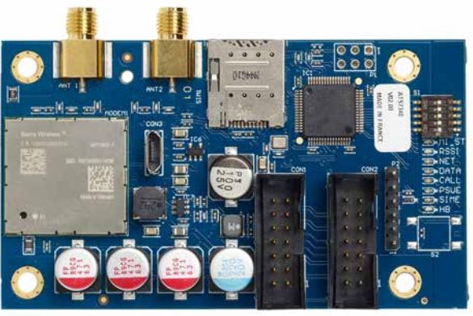

# ATS7340-SIM **4G/3G/2G cellular module for ATSx500A panels, SIM card included**

## **Communication devices**

The Advisor Advanced features a true communication center offering multiple reporting connections to multiple central stations. Control panels having an IP on board and optional ISDN, PSTN, GSM, IP communication modules. The ATS7340 4G GSM module can be used as a primary or backup reporting channel. It is scalable with back-up reporting options according your needs.

#### **Product overview**

The ATS7340 GSM module is directly connected to the Advisor Advanced panel via MI-Bus and enables alarm reporting and uploading and downloading to ATS85xx. All reporting protocols available through PSTN are available via GSM, including voice reporting or audio listen-in. The GSM module can be used for primary reporting as well as back-up reporting (using multiple central stations). Besides, in case local network does not grant access to internet, ATS7340 can connect the panel to internet, enabling UltraSync connectivity.

#### **Up / downloading**

The ATS7340 can establish a GPRS connection for uploading and downloading when connected to the Advisor Advanced. For convenience 8 status LED's are permanently indicating, communication to the panel, GSM signal strength, GSM module status (device heartbeat, network registration, GPRS/LTE communication, audio connection) and power supply

#### **SMS, reporting & command/control**

The ATS7340 support SMS functionality when connected to the Advisor Advanced panels. When connected together the system can send localized SMS messages to any mobile phone configured in the panel. Optionally, the end user can send control commands through SMS to the Advisor Advanced.

ATS7340 achieves SP5 over LTE when reporting to OH servers, and DP4 when reporting over IP (primary) and LTE (backup) to OH servers - highest grades defined in EN50136. This enables reaching EN50131 Grade III with Advisor Advanced panels, and go beyond Grade 3 requirements.

Through UltraSync, end-users can also control their Advisor Advanced through the Advisor Advanced Pro App.

#### **SIM card included**

ATS7340-SIM comes with a SIM card included, ready to connect your panel to reporting services. Once activated, the SIM card connects to the authorized operators' network and enables UltraSync access. Carrier periodically invoices the installer for the SIM usage, who in turn charge their customers.

#### **Details**

- Reliable CAT-1 LTE connectivity for 4G networks with 3G and 2G fallback
- Cyber-secure by design both the new modem and the module firmware have been redesigned to stand against modern cyber security threats
- Alarm reporting via cellular, can be used as primary or secondary path
- All popular reporting formats available, except voice reporting (the included SIM card does not have a voice plan)
- Data connection for upload and download, can be used to connect to the panel via ATS85xx and Advisor Advanced App.
- 8 status LED's for diagnostics
- Multi-band GSM antenna is included
- All popular 2G/3G/4G bands are supported
- Fast and simple local firmware upgrade for the communication module and the modem
- SIM card included, with subscription to data services. Once the SIM card is activated, the panel gains access to 4G network. The subscription is billed to installers, who manages the billing of the end user.
- SMS reporting and SMS command & control are NOT included in the subscription

# ATS7340-SIM

**4G/3G/2G cellular module for ATSx500A panels, SIM card included**

## **Technical specifications**

| Allmänt               |                                            |
|-----------------------|--------------------------------------------|
| Product line          | Advisor Advanced                           |
| Status indication     | x500A panels, MR4.4 onwards                |
| Nätverk               |                                            |
| Communicator type     | 2G, 3G, 4G                                 |
| GSM frequency         | 703-748 MHz, 824-849 MHz, 832-862 MHz,     |
|                       | 880-915 MHz, 1710-1785 MHz, 1850-1910 MHz, |
|                       | 1920-1980 MHz, 2500-2570 MHz               |
| Rapportering          |                                            |
| Supported receivers   | Osborne Hoffman (OH), PSTN receivers,      |
|                       | UltraSync                                  |
| Interface             |                                            |
| Antenna               | Yes, included                              |
| Spänning              |                                            |
| Operating voltage     | 9 to 14 VDC                                |
| Current consumption   | <100 mA (idle)                             |
|                       | 120 mA (GSM online)                        |
|                       | 200 mA (GSM max.)                          |
| Mått                  |                                            |
| Physical dimensions   | 86.5 x 50 mm                               |
| Net weight            | 35 g                                       |
| Miljö                 |                                            |
| Operating temperature | -10 to +55°C                               |
| Relative humidity     | Max. 95% noncondensing                     |
| Environment           | EN50130-5 ; Class II - Indoor (General)    |
| Regulatory            |                                            |
| Certification         | EN50131 Grade 3, NFA2P                     |
|                       |                                            |

Powered by TCPDF (www.tcpdf.org)

Carrier Fire & Security förbehåller sig rätten att ändra produktspecifikationer utan föregående meddelande. För de senaste produktspecifikationerna, besök se.firesecurityproducts.com online eller kontakta din försäljningsrepresentant.