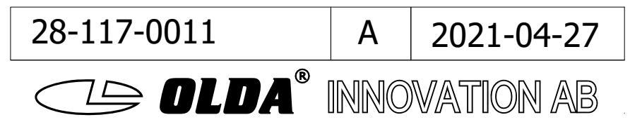
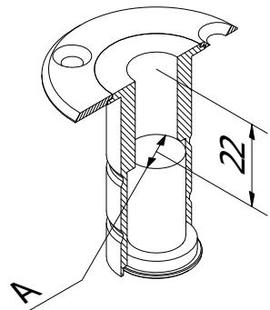
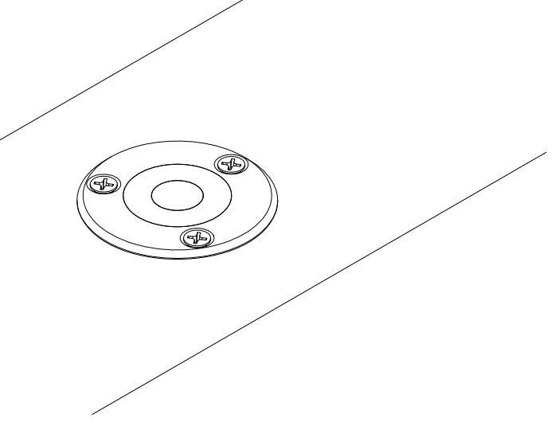

C-C ( 1 : 1,5 )

D-D ( 1 : 1,5 )

C

C

D

 D

MA-FSR30

A

2021-04-27

A

FSR12

13

FSR15

16

P50 P30

49

## mounting guide - external fitting drawing

|             |                   | A   |
|-------------|-------------------|-----|
| 20-117-1201 | OLDA FS R12 | '13 |
| 20-117-1501 | OLDA FS R15 | '16 |

