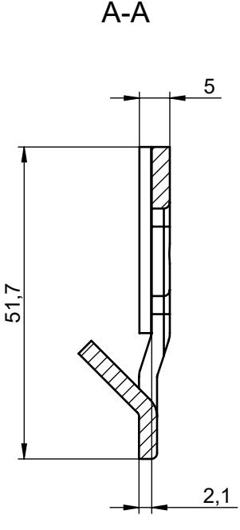
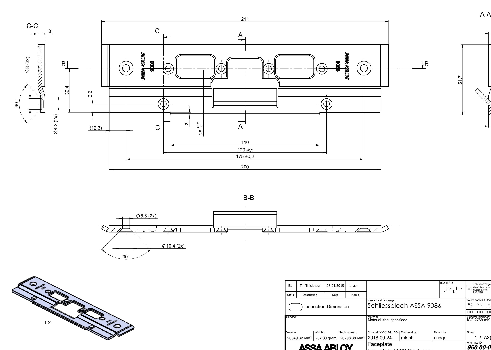

B

| E1                                               |             | Tin Thickness 08.01.2019 ralsch |               | ISO 13715 -0,2 +0,2                                |        |           | Toleranz allgemein / General Tolerance abweichend von/ Nennmaßbereiche / nominal size range divergent from ≤10 >10 - ≤30 >30 - ≤50 >50 |                    |                                                                   |            |
|--------------------------------------------------|-------------|---------------------------------|---------------|-------------------------------------------------------|--------|-----------|-------------------------------------------------------------------------------------------------------------------------------------------------------|--------------------|-------------------------------------------------------------------|------------|
| State                                            | Description | Date                            | Name          |                                                       |        |           | ISO 2768                                                                                                                                              | 0,1                | 0,2 0,3                                                        | 0,5        |
| Inspection Dimension                             |             |                                 |               | Name local language Schliessblech ASSA 9086        |        |           | Tolerances ISO 2768 m > 3 0.5 3 6 ± 0.1 ± 0.1                                                                                          | > 6 30 ± 0.2 | > 30 > 120 > 400 120 400 1000 ± 0.3 ± 0.5 ± 0.8 |            |
| Surface:                                         |             |                                 |               | Material: Material <not specified=""></not>        |        |           | General tolerance: ISO 2768-mK                                                                                                                     |                    |                                                                   |            |
| Volume:                                          |             | Weight:                         | Surface area: | Created (YYYY-MM-DD): Designed by:                    |        | Drawn by: | Scale:                                                                                                                                                |                    | Projection:                                                       |            |
| 26349.32 mm³ 202.89 gram 20798.38 mm² 2018-09-24 |             |                                 |               |                                                       | ralsch | eliega    | 1:2 (A3)                                                                                                                                              |                    |                                                                   |            |
| ASSA ABLOY Sicherheitstechnik GmbH               |             |                                 |               | Faceplate Faceplate 9086 Customer -------44G-01 |        |           | Alternate ID 960.00-00-66-1-1000                                                                                                                   |                    |                                                                   |            |
|                                                  |             |                                 |               |                                                       |        |           | Document ID D000906265-004                                                                                                                         |                    |                                                                   | Rev.: 4 |
| Configuration:D000906265-004                     |             |                                 |               |                                                       |        |           |                                                                                                                                                       |                    | SHEET 1 OF 1                                                      |            |

**Approved 2021-06-10**