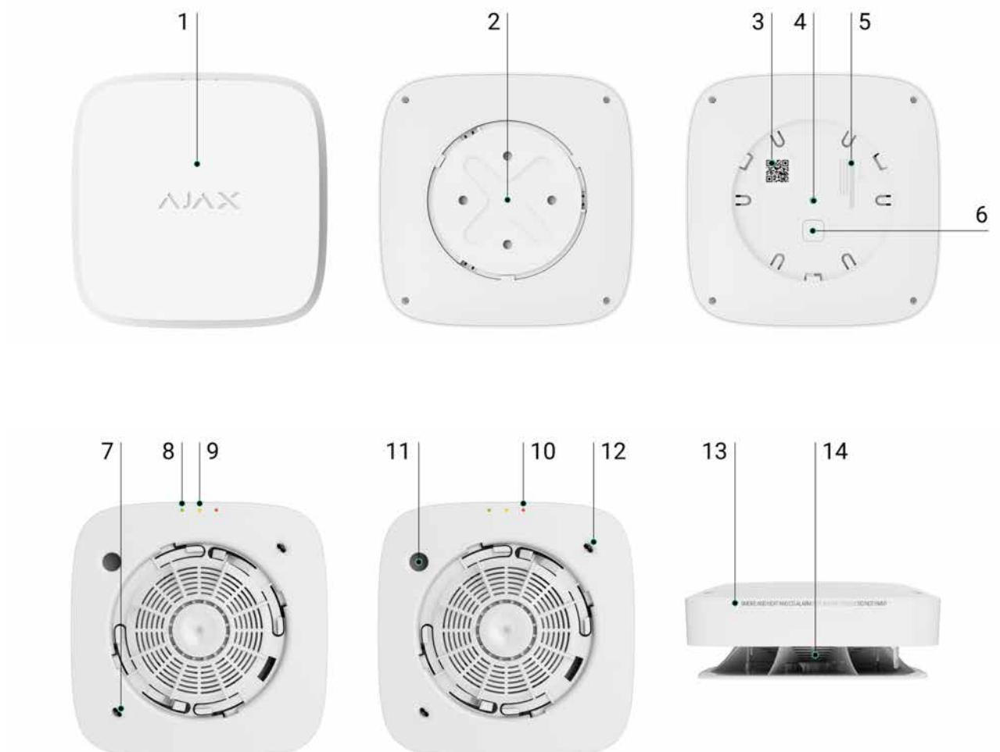
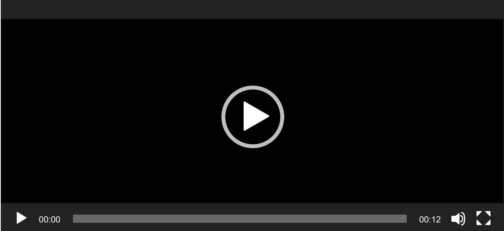
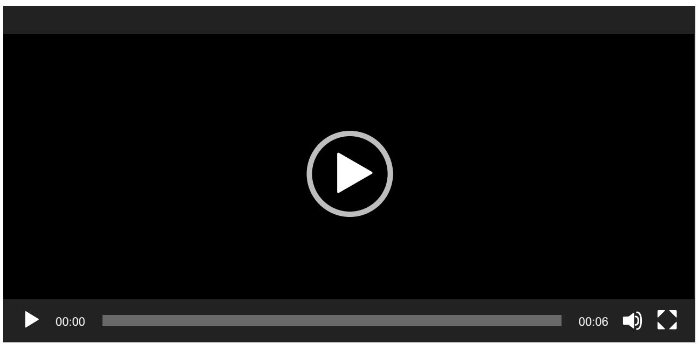
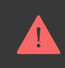
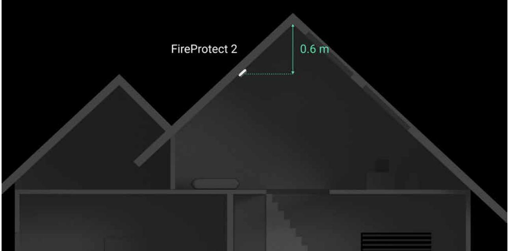

# FireProtect 2 (Heat/Smoke/CO) Jeweller User manual

Updated January 12, 2023

**FireProtect 2 (Heat/Smoke/CO) Jeweller** is a wireless fire detector with a builtin siren. Designed for indoor installation. Detects smoke, temperature rise, and dangerous CO (carbon monoxide) level.

It is available in two modifications: with sealed batteries (has **SB** in the name) that run up to 10 years, and with replaceable ones (has **RB** in the name) that run up to 7 years.

The detector operates as part of the Ajax security system, communicating with the hub via the secure radio protocol. The hub communication range is up to 1,700 meters without obstacles. Jeweller

Versions of the detector with other sensor combinations are also available. All Ajax fire detectors are . available here

## Functional elements

- **1.** The front panel of the detector with a . To activate the button, press the center of the panel. Test/Mute button
- **2.** SmartBracket mounting panel. To remove the panel, turn it counterclockwise.
- **3.** Device QR code and ID (serial number). It is used to add the detector to the Ajax security system.
- **4.** . Triggers when an attempt is made to detach the detector from the surface or remove it from the mounting panel. Tamper button
- **5.** Detector certification information.
- **6.** Power button.
- **7.** First thermistor. Detects dangerous temperatures.
- **8.** Green LED indicator.
- **9.** Yellow LED indicator.
- **10.** Red LED indicator.
- **11.** Siren.
- **12.** Second thermistor. Detects dangerous temperatures.
- **13.** Information about the detector's end of life date.
- **14.** Smoke chamber lid.

# Operating principle

FireProtect 2 (Heat/Smoke/CO) is a wireless fire detector designed for indoor installation. Available in two versions:

- With sealed batteries. Such a detector has **SB** in its name. Built-in battery life is 10 years. After the batteries are discharged, the detector should be replaced with a new one.
- With replaceable batteries. Such a detector has **RB** in its name. Pre-installed battery life is 7 years. When the batteries are discharged, they can be replaced with new ones.

#### How to replace batteries in FireProtect 2 RB (Heat/Smoke/CO)

The detector is equipped with a siren (piezoelectric buzzer) for audible notification of alarms and events with a volume of up to 85 dB (at a distance of 3 m from the detector). The detector is always actives and reacts to a fire 24/7, regardless of the system's security mode.

A smoke/temperature rise alarm can be easily distinguished from a high CO level alarm due to different audible and LED indications. Learn more about the types of indication of the detector's alarms and events in the section of this manual. LED Indication

FireProtect 2 is protected by two tampers. The first tamper controls the removal of the detector from the SmartBracket mounting panel: the detector reacts with LED indication and sends notifications to users in Ajax apps and the security company monitoring station. The second tamper signals the removal of the smoke chamber lid, which is located under the front panel of the detector.

> Removing the smoke chamber lid is possible when the enclosure is fully disassembled. The system detects this event as a malfunction. When the lid is removed, the detector reacts with an audible signal, and users and the security company receive a malfunction notification.

 respond to FireProtect 2 alarms and perform userdefined actions using . For example, the relay can turn on the ventilation system and emergency lighting when an alarm occurs. Ajax automation devices automation scenarios WallSwitch

## Operation without a hub

FireProtect 2 detectors can be used without connecting to an Ajax hub. All you need is to install the detector following this manual and turn it on.

In case of autonomous operation, the detector notifies of fire with a built-in siren and LED indication only and does not send notifications to the user's smartphone, Ajax Translator, or PRO Desktop. In this case, the feature is not available. Interconnected Fire Detectors Alarms

#### Smoke sensor

FireProtect 2 detects smoke with a bispectral optical sensor. Inside the smoke chamber, the sensor has blue and infrared LEDs which emit light at different wavelengths. This technology allows the detector to determine the size of the volatile particles inside the chamber and respond only to smoke, ignoring vapour and steam.

The smoke chamber in FireProtect 2 is protected from dust, dirt, and insects. Even if dust gets inside and settles, this does not threaten or impair fire detection. The optical system is designed to prevent non-volatile particles from getting within the field of both blue and infrared LEDs at the same time. So that situation does not cause a false alarm.

The HazeFlow 2 software algorithm also protects against false alarms. When an alarm is detected, the algorithm additionally processes the data received from the detector and confirms the alarm.

## Temperature sensor

Two built-in class A1 thermistors detect a rapid rise and exceeding the temperature threshold in FireProtect 2. This class of thermistors notifies of alarms when a rapid temperature rise or static temperature is detected in the range of +54°C to +65°C.

The thermistors are mounted outside under the front panel of the detector. This allows you to respond to threats faster than when the sensors are inside the detector enclosure.

FireProtect 2 reports that the temperature threshold has been exceeded as soon as its value exceeds +64°C. The detector reports a rapid temperature rise if the indicator increases by 10°C within one minute. If the temperature indicator rises sharply by 20°C or more, the detector alerts immediately.

# CO (carbon monoxide) sensor

FireProtect 2 has a chemical sensor which detects dangerous levels of carbon monoxide. The operation principle of the sensor is based on a chemical reaction. There is an electrolyte bath inside the sensor. When a specific level of carbon monoxide is reached, a chemical reaction is triggered. The detector reads this event and transforms it into an alarm.

The detector raises an alarm if the CO level reaches:

- 50 ppm (0.005%) and above in no more than 90 minutes.
- 100 ppm (0.01%) and above in no more than 40 minutes.
- 300 ppm (0.03%) and above in no more than 3 minutes.

A CO concentration of 400 ppm (0.04%) for three hours is life-threatening. The detector stops warning of a dangerous carbon monoxide level as soon as the concentration drops to 40 ppm (0.004%).

## Test/Mute button

The Test/Mute button is located under the front panel of the detector. This is a mechanical button. Тo activate it, press lightly on the central part of the front panel with your hand or a suitable item if the detector is in a hard-to-reach place. For example, you can do this with a mop handle.

The button performs several functions:

- In normal mode, it starts the detector self-test.
- In case of an alarm, it mutes the detector alarm or of all fire detectors in the system. Interconnected Alarm

## Interconnected Fire Detectors Alarms

All fire detectors of the FireProtect 2 product line support the Interconnected Alarm function. This function activates the built-in sirens of all fire detectors in the system as soon as at least one of the fire detectors detects an alarm. Sirens of FireProtect 2 detectors are activated within 20 seconds after an alarm is detected. and are activated over a detector ping interval set in the **Jeweller** or **Jeweller/Fibra** settings, but no later than in 60 seconds. FireProtect FireProtect Plus

The **FireProtect 2 detectors** have different sound and LED indications of alarm types to make it easier for users to distinguish between them. In case of interconnected alarm, all FireProtect 2 detectors exactly the alarm type detected by the initiating detector. Instead, and detectors notify all types of alarms with the same sound. indicate FireProtect FireProtect Plus

How to set Interconnected Fire Detectors Alarms

# Sending events to the monitoring station

The Ajax security system can transmit events and alarms to the monitoring app as well as the Central Monitoring Station (CMS) via **SurGard (Contact ID), SIA DC-09 (ADM-CID), ADEMCO 685**, and other protocols. The list of supported protocols is . PRO Desktop available here

#### Which CMSs Ajax connects to

Addressability of Ajax devices allows you to send not only events but also the type of the device, the name, virtual room, and security group assigned to it to the PRO Desktop and to the CMS. The list of transmitted parameters may differ depending on the type of the CMS and the selected communication protocol.

# Adding to the system

# Before adding a device

- **1.** Install the Ajax app.
- **2.** Create an account if you don't have one.
- **3.** Add a to your app. Set the required settings and create at least one . hub compatible with the detector virtual room
- **4.** Make sure that the hub is on and has Internet access via Ethernet, Wi-Fi, and/or mobile network. You can do this in the Ajax app or by looking at the

LED indicator of the hub: it should light up white or green.

- **5.** Make sure that the hub does not start updates and that it is disarmed by checking the status in the Ajax app.
A can connect the device to the hub. PRO or a user with system setup rights

To connect to the hub, the detector should be within the coverage area of the hub radio network. To operate via a , first connect the detector to the hub and then to the range extender. You can do this in the range extender settings in Ajax apps. radio signal range extender

## How to connect FireProtect 2 to a hub

- **1.** Open the Ajax app.
- **2.** Select the hub if you have several of them or if you are using the . Ajax PRO app
- **3.** Go to the **Devices** tab. Press **Add Device**.
- **4.** Enter the name of the device.
- **5.** Scan the QR code or enter the ID manually. QR code is located on the rear part of the enclosure (under the mounting panel) and on the device packaging. The device ID can be found below the QR code.
- **6.** Select the virtual room and security group (if the group mode is enabled).
- **7.** Click **Add**; the countdown will begin.

If the maximum number of devices is added to the hub, when you add the device, you will get a notification about exceeding the device limit. The number of devices that you can connect to the hub depends on the central unit model.

- **8.** Turn on the detector by holding the power button for 3 seconds. The hub connection request is sent only if the detector is enabled. If the detector fails to connect to the hub, try again in 5 seconds.

The detector cannot connect to the hub if they operate on different radio frequencies. The radio frequency range of the device may vary by region. Please contact for information on the operating frequency range of your devices. technical support

Once connected, FireProtect 2 will appear in the hub device list in the Ajax app. Device status update depends on the ping interval set in the **Jeweller** or **Jeweller/Fibra** settings. The default value is 36 seconds.

FireProtect 2 only works with one hub. When connected to a new hub, the detector stops transmitting data to the old hub. Once added to a new hub, FireProtect 2 is not removed from the list of devices of the old hub. This must be done manually in Ajax apps.

## Indication

LEDs and the built-in siren of the detector can report alarms as well as certain states of the detector.

| LED indication                      | Sound indication                                        | Event                      | Notes                                                                    |
|-------------------------------------|---------------------------------------------------------|----------------------------|--------------------------------------------------------------------------|
| The red LED blinks continuously. | The siren sounds in time with the LED indication. | Alarm by: smoke;        | The detector stops alarming as soon as its sources are eliminated. |
|                                     |                                                         | rapid temperature rise; | Also, you can mute the alarm by pressing the                          |

|                                                   |                                                        | temperature threshold exceeded.                                                                                               | Test/Mute button or in the Ajax app. The LED and sound indications resume if the source of the alarm is still present after the muting timer (10 minutes) has expired.                                                                                                                                                                                                               |
|---------------------------------------------------|--------------------------------------------------------|-------------------------------------------------------------------------------------------------------------------------------------|-----------------------------------------------------------------------------------------------------------------------------------------------------------------------------------------------------------------------------------------------------------------------------------------------------------------------------------------------------------------------------------------------------------|
| The red LED blinks 3 times every 3 seconds. | The siren beeps in time with the LED indication. | Alarm by dangerous CO (carbon monoxide) level.                                                                                | The detector will stop alarming as soon as the CO level drops below 50 ppm. You can also mute the alarm by pressing the Test/Mute button or in the Ajax app. The alarm cannot be muted if the CO level exceeds 300 ppm. The LED and sound indications resume if the source of the alarm is still present after the muting timer (10 minutes) has expired. |
| No.                                               | Short, low tone beep.                                  | Prohibition on alarm muting.                                                                                                     | The sound is played after pressing the Test/Mute button The alarm cannot be muted if the CO level exceeds 300 ppm.                                                                                                                                                                                                                                                                         |
| The red LED blinks every 8 seconds.            | No.                                                    | Muted alarm.                                                                                                                        | The detector stops alarming as soon as its source is eliminated.                                                                                                                                                                                                                                                                                                                                    |
| The red LED blinks every 8 seconds.            | The siren beeps 3 times every 3 seconds.         | The system has a muted alarm by smoke/rapid temperature rise/temperature threshold exceeded, as well as an active | The alarm cannot be muted if the CO level exceeds 300 ppm. The LED and sound indication for alarm by smoke/rapid                                                                                                                                                                                                                                                                           |

|                                                                                               |     | alarm by a high CO level exceeding 300 ppm.                                       | temperature rise/temperature threshold exceeded resumes if the source of the alarm is still present after the muting timer (10 minutes) has expired. |
|-----------------------------------------------------------------------------------------------|-----|-----------------------------------------------------------------------------------------|---------------------------------------------------------------------------------------------------------------------------------------------------------------------------|
| The red LED blinks 2 times in a row.                                                       | No. | Restore after alarm.                                                                    | If the source of the alarm is removed, the detector is restored automatically.                                                                                   |
| The yellow LED lights up for 1 second.                                                     | No. | Tamper alarm. The detector is removed from the SmartBracket mounting panel. |                                                                                                                                                                           |
| The green LED lights up for 1 second.                                                      | No. | The detector is installed on the SmartBracket mounting panel.                  | Turns on when the tamper is triggered.                                                                                                                                 |
| Green, yellow, and red LEDs light up in turn, then go off.                              | No. | Turning the detector on.                                                             | To turn on the detector, hold the power button for 1 second.                                                                                                        |
| Green, yellow, and red LEDs light up at the same time, then go off in reverse order. | No. | Turning the detector off.                                                            | To turn off the detector, hold the power button for 2 seconds.                                                                                                   |
| The green LED is permanently on.                                                           | No. | Connection to the hub in progress.                                                   | The indication turns off after the detector is connected to the hub.                                                                                                |
| The green LED blinks 6 times in a row.                                                     | No. | The detector has been removed from the hub.                                       | The indication turns on when the detector receives information that it has been removed from the hub.                                                         |
| The green LED blinks once per minute.                                                      | No. | Detector power is OK.                                                                   | The indication is present when the detector is on and the tamper status is OK (the detector is installed on the                                            |

|                                                            |                                                                           |                                             | SmartBracket mounting panel). There is no indication when the detector switches to the Jeweller Signal Strength Test mode.                                                                                                                                                                                   |
|------------------------------------------------------------|---------------------------------------------------------------------------|---------------------------------------------|-----------------------------------------------------------------------------------------------------------------------------------------------------------------------------------------------------------------------------------------------------------------------------------------------------------------------------------|
| The yellow LED blinks 2 times in a row every minute. | The siren beeps in time with the LED indication every minute.    | Malfunction detected.                       | All malfunctions are displayed in the states detector in Ajax apps. Fields with malfunctions are highlighted in red. If the detector needs to be repaired, contact Technical our Support                                                                                                      |
| The yellow LED blinks once per minute.                  | The siren beeps in time with the LED indication once per minute. | Low battery level.                          | You can replace batteries in a detector with replaceable batteries only (has RB in its name). A detector with sealed batteries (with SB in the name) should be replaced with a new one after the batteries are discharged. How to replace batteries in FireProtect 2 RB (Heat/Smoke/CO) |
| The yellow LED constantly blinks.                       | No.                                                                       | The battery is completely discharged. | You can replace batteries in a detector with replaceable batteries only (has RB in its name). A detector with sealed batteries (with SB in the name) should be replaced with a new one after                                                                                                              |

|                                                                          |                                                                       |                                         | the batteries are discharged. How to replace batteries in FireProtect 2 RB (Heat/Smoke/CO)                                                                       |
|--------------------------------------------------------------------------|-----------------------------------------------------------------------|-----------------------------------------|---------------------------------------------------------------------------------------------------------------------------------------------------------------------------------|
| The red LED blinks5 times, then blinks 3 more times but slower. | The siren beeps 5 times, then beeps 3 more times but longer. | Performing a self test.              | The test can be started by pressing the Test/Mute button or in the detector settings in the Ajax app.                                                            |
| The yellow LED blinks 3 times in a row every minute.               | The siren beeps 3 times every minute.                              | The device service life has expired. | The device has operated for more than 10 years. The sensitivity of its sensors may have decreased. We recommend replacing this detector with a new one. |

If an alarm by smoke/temperature occurs at the same time as a dangerous CO level alarm, the detector starts the indication of the first alarm.

# Detector testing

## Functionality testing

The test allows you to check the status of the detector's sensors. You can run it in two ways: by pressing the Test/Mute button of the detector and in Ajax apps.

**To run the test using the Test/Mute button**, press the center of the front panel and hold it for 1.5 seconds.

#### **To run the test in the Ajax app:**

- **1.** Open the Ajax app.
- **2.** Select the hub if you have several of them or if you are using the . Ajax PRO app
- **3.** Go to the **Devices** menu.
- **4.** Select **FireProtect 2 (Heat/Smoke/CO)**.
- **5.** Go to the settings by clicking on the gear icon .
- **6.** Click on the **Self-test** field.

After starting the test, the red LED of the detector blinks 5 times in a row and then blinks 3 more times but slower. The detector's siren sound in time with an LED indication. When the test is over, users receive a notification about the detector state in Ajax apps.

The detector also notifies about the test result with sound and LED indications. If the test is failed and a malfunction is detected, the detector starts to **Indicate a malfunction** 3 seconds after the test is begun: the yellow LED blinks twice, and the siren beeps in time with the LED indication.

The self-test does not start immediately, but no later than 30 seconds after pressing the Test/Mute button or running from the Ajax app.

If no sound and LED indications occurred during the self-test, the detector may not be used. Contact our . Technical Support

# Testing at the place of installation

Ajax security system provides several tests to select the correct installation place of devices. **Jeweller Signal Strength Test** is available for FireProtect 2. The test determines the strength and stability of the signal at the intended location of the device.

#### **To run the test in the Ajax app:**

- **1.** Select the hub if you have several of them or if you are using the . Ajax PRO app
- **2.** Go to the **Devices** menu.
- **3.** Select **FireProtect 2 (Heat/Smoke/CO)**.
- **4.** Go to the settings by clicking on the gear icon .
- **5.** Select **Jeweller Signal Strength Test**.
- **6.** Perform the test following the tips in the app.

The test does not start immediately, but the waiting time does not exceed the duration of one detector ping interval. The default value is 36 seconds. You can change the detector ping interval in the **Jeweller** (or **Jeweller/Fibra**) menu in the hub settings.

#### Icons

The icons show some of the device states. You can view them in Ajax apps in the **Devices** tab.

| Icon | Meaning                                                                                                                                                |
|------|--------------------------------------------------------------------------------------------------------------------------------------------------------|
|      | Jeweller signal strength between the detector and the hub or radio signal range extender. The recommended value is two or three bars. Learn more |
|      | Battery charge level of the device. Learn more                                                                                                      |
|      | The Interconnected Fire Detectors Alarm feature is activated. Learn more                                                                            |

| The detector operates in the Always Active mode. The icon is displayed permanently. FireProtect 2 is always active and responds to a fire 24/7, regardless of the system's security mode. Learn more |
|---------------------------------------------------------------------------------------------------------------------------------------------------------------------------------------------------------------|
| radio signal range extender The detector operates through the                                                                                                                                              |
| The detector is temporarily deactivated. Learn more                                                                                                                                                        |
| The detector has detected a rapid temperature rise.                                                                                                                                                           |
| The detector has detected that the temperature threshold has been exceeded.                                                                                                                                   |
| The detector has detected smoke.                                                                                                                                                                              |
| The detector has detected the dangerous CO (carbon monoxide) level.                                                                                                                                           |
| The detector was removed from the SmartBracket mounting panel, or the enclosure integrity was violated in another way. Check the mounting of the detector.                                              |
| The detector's siren plays an alarm sound.                                                                                                                                                                    |
| The detector service life has expired. The device has been operated for more than 10 years. The sensitivity of its sensors may have decreased. We recommend replacing this detector with a new one.  |
| Malfunction detected. The list of malfunctions is available in the detector states                                                                                                                         |
| The detector has tamper triggering events temporarily deactivated. Learn more                                                                                                                              |

The states include information about the device and its operating parameters. You can see FireProtect 2 (Heat/Smoke/CO) states in Ajax apps. To access them:

- **1.** Open the Ajax app.
- **2.** Select a hub if you have several of them or if you are using the Ajax PRO app.
- **3.** Go to the **Devices** tab.
- **4.** Select the device from the list.

| Parameter                | Meaning                                                                                                                                                                                                                                                                                                                                                    |
|--------------------------|------------------------------------------------------------------------------------------------------------------------------------------------------------------------------------------------------------------------------------------------------------------------------------------------------------------------------------------------------------|
| Temperature              | Air temperature in the room where FireProtect 2 is installed. Measured in Celsius or Fahrenheit degrees depending on the app settings. In the normal state, the temperature value is displayed in black. When a temperature rise or threshold exceeding is detected, the field highlights red and displays the High Temperature text. |
| Jeweller Signal Strength | Jeweller signal strength between FireProtect 2 and the hub or radio signal range extender. The recommended value is two or three bars. Jeweller is a protocol for transmitting FireProtect 2 events and alarms.                                                                                                                                |
| Connection via Jeweller  | Connection status between FireProtect 2 and the hub or range extender via Jeweller: Online — the detector is connected to the hub or range extender. Normal state. Offl ine — no connection between the detector and the hub or range extender. Check the detector connection.                                                        |
| Battery Сharge           | The battery charge level of the device:                                                                                                                                                                                                                                                                                                                    |

| OK — detector batteries have sufficient |  |  |
|-----------------------------------------|--|--|
| charge. Normal state.                   |  |  |

- **Battery low** detector batteries are discharged.
When the batteries are discharged, users and the security company monitoring station receive a notification.

After the low battery notification, the detector is able to operate for another month under normal conditions. In case of an alarm, the battery charge is enough to ensure 4 minutes of the sound and LED indication operation.

#### How the battery charge is displayed Battery life calculator

You can replace batteries in a detector with replaceable batteries only (has **RB** in its name). A detector with sealed batteries (with **SB** in the name) should be replaced with a new one after the batteries are discharged.

#### How to replace batteries in FireProtect 2 RB (Heat/Smoke/CO)

The status of the detector's tamper that responds to detachment of the device from the surface or opening of the enclosure:

- **Open** the detector is removed from the SmartBracket mounting panel, or the enclosure integrity is violated in another way. Check the mounting of the detector.
- **Closed** the detector is installed on the SmartBracket mounting panel. The integrity of the device enclosure and the mounting panel is not violated. Normal state.

#### Learn more

Smoke Smoke sensor status:

- **Clear** normal state, the detector does not detect smoke.
Lid

|                                | Alarm — the detector detects smoke.                                                   |
|--------------------------------|---------------------------------------------------------------------------------------|
|                                | If smoke is detected, the text field highlights red.                               |
|                                | Learn more                                                                            |
|                                | Alarm state if temperature threshold is exceeded:                                  |
|                                | No — normal state, the detector does not detect temperature threshold exceeding.   |
| Temperature Threshold Exceeded | Alarm — the detector has detected temperature threshold exceeding.                 |
|                                | If temperature threshold exceeding is detected, the text field highlights red.     |
|                                | Learn more                                                                            |
|                                | Alarm by the rapid temperature rise:                                                  |
|                                | No — normal state, the detector does not detect a rapid temperature rise.          |
| Rapid Temperature Rise         | Alarm — the detector has detected a rapid temperature rise.                        |
|                                | If a rapid temperature rise is detected, the text field highlights red.            |
|                                | Learn more                                                                            |
|                                | CO (carbon monoxide) level in the room where FireProtect 2 is installed:           |
|                                | No — the CO level is normal.                                                          |
| High CO Level                  | Alarm — the detector has detected a dangerous CO level.                            |
|                                | If a dangerous CO level is detected by the detector, the text field will turn red. |
|                                | Learn more                                                                            |

| Temporary Deactivation | Shows the status of the device temporary deactivation function: No — the device operates in normal mode. Lid only — detector's tamper triggering notifications are disabled. Entirely — the detector does not execute system commands, does not participate in automation scenarios, and does not send notifications of alarms, malfunctions, and other events to the CMS and system users. In this case, the detector will continue to operate autonomously and indicate alarms using the built-in siren. Learn more |
|------------------------|--------------------------------------------------------------------------------------------------------------------------------------------------------------------------------------------------------------------------------------------------------------------------------------------------------------------------------------------------------------------------------------------------------------------------------------------------------------------------------------------------------------------------------------------------------------|
| Firmware               | FireProtect 2 firmware version.                                                                                                                                                                                                                                                                                                                                                                                                                                                                                                                              |
| Device ID              | ID (serial number) of FireProtect 2. Also available on the detector's enclosure (under the mounting panel) below the QR code and on the packaging box.                                                                                                                                                                                                                                                                                                                                                                                              |
| Device No.             | The number of FireProtect 2 loop (zone). Events are sent to the CMS with this number.                                                                                                                                                                                                                                                                                                                                                                                                                                                                     |

## Settings

To change FireProtect 2 (Heat/Smoke/CO) settings in an Ajax app:

- **1.** Open the Ajax app.
- **2.** Select the hub if you have several of them or if you are using the . Ajax PRO app
- **3.** Go to the **Devices** tab.
- **4.** Select the device from the list.
- **5.** Go to **Settings** by clicking on the gear icon .
- **6.** Set the required settings.

- **7.** Click **Back** to save the new settings.

| Settings                           | Meaning                                                                                                                                                     |  |  |  |
|------------------------------------|-------------------------------------------------------------------------------------------------------------------------------------------------------------|--|--|--|
|                                    | Detector name. Displayed in the list of hub devices, text of SMS and notifications in the events feed.                                                |  |  |  |
| Name                               | To change the name, click on the text field.                                                                                                                |  |  |  |
|                                    | The name can contain up to 12 Cyrillic characters or up to 24 Latin characters.                                                                          |  |  |  |
|                                    | Selecting the virtual room to which FireProtect 2 is assigned.                                                                                           |  |  |  |
| Room                               | The room name is displayed in the SMS text and notifications in the events feed.                                                                         |  |  |  |
|                                    | To change the room, click on the field.                                                                                                                     |  |  |  |
| Alert with a siren                 |                                                                                                                                                             |  |  |  |
| If temperature threshold exceeded  | Ajax sirens When this option is enabled, the connected to the system are activated when the detector detects a temperature threshold exceeding. |  |  |  |
| If rapid temperature rise detected | Ajax sirens When this option is enabled, the connected to the system are activated when the detector detects a rapid temperature rise.             |  |  |  |
| If smoke is detected               | Ajax sirens When this option is enabled, connected to the system are activated when the detector detects smoke.                                    |  |  |  |
| If CO detected                     | Ajax sirens When this option is enabled, the connected to the system are activated when the detector registers a dangerous CO level.               |  |  |  |
| Jeweller Signal Strength Test      | Switches the detector to the Jeweller signal strength test mode. The test helps determine the optimal place for installing FireProtect 2.             |  |  |  |
|                                    | The test shows the signal strength between the detector and the hub or range extender via the Jeweller wireless data transfer protocol.               |  |  |  |

|                        | The recommended value is two or three bars. Learn more                                                                                                                                                                                                                                                                                                                                                                                                                                                                                                                                                     |
|------------------------|---------------------------------------------------------------------------------------------------------------------------------------------------------------------------------------------------------------------------------------------------------------------------------------------------------------------------------------------------------------------------------------------------------------------------------------------------------------------------------------------------------------------------------------------------------------------------------------------------------------|
| Device Self-test       | Runs a detector self-test. Learn more                                                                                                                                                                                                                                                                                                                                                                                                                                                                                                                                                                      |
| User Guide             | Opens FireProtect 2 User Manual in the Ajax app.                                                                                                                                                                                                                                                                                                                                                                                                                                                                                                                                                           |
| Temporary Deactivation | Allows to temporarily deactivate the device without removing it from the system. Three options are available: No — the device operates in normal mode. Lid only — detector's tamper triggering notifications are disabled. Entirely — the detector does not execute system commands, does not participate in automation scenarios, and does not send notifications of alarms, malfunctions, and other events to the CMS and system users. In this case, the detector will continue to operate autonomously and indicate alarms using the built-in siren. Learn more |
| Unpair Device          | Unpairs FireProtect 2 from the hub and deletes its settings.                                                                                                                                                                                                                                                                                                                                                                                                                                                                                                                                               |

## Selection of installation place

The detector is designed for indoor installation only.

The coverage area of one FireProtect 2 (Heat/Smoke/CO) is 50 to 60 m², depending on the type of premises.

The detector should be installed in every room. The detector is placed in the center of the ceiling at a distance of 30 cm from light fixtures, chandeliers, or any other decorative objects that may interfere with alarm detection.

If there are beams on the ceiling protruding 30 cm or more, the detector must be installed between every two beams. If the beams protrude by less than 30 cm, installation on a beam in the central part of the ceiling is allowed.

In halls or narrow corridors, detectors should be installed at a distance of no more than 7.5 m from each other.

If the ceiling is sloping, the detector is installed at a distance of 60 cm from the top point of the ceiling. To select an installation place, draw a straight line down from the top of the ceiling. Then, draw a perpendicular from this line to the sloping part of the ceiling. The detector is installed at this point.

We do not recommend mounting the detector on a wall. This installation is acceptable if closely spaced beams or other obstacles interfere with the installation of the detector. Wall mounting is possible only if the detector is placed at a distance of 15–30 cm below the ceiling but above the doorways.

When choosing the location of the detector, consider the parameters that affect its operation:

- Jeweller signal strength.
- Distance between the detector and the hub.

- Presence of barriers for radio signal passage between devices: walls, interfloor ceilings, large objects located in the room.
Consider the placement recommendations when designing your Ajax security system for the object. The security system must be designed and installed by specialists. The list of recommended Ajax partners is . available here

## Signal strength

The Jeweller signal strength is determined by the ratio of the number of undelivered/corrupted data packets that are exchanged between the hub and the detector to expected ones within a certain period of time. Signal strength is indicated by the icon on the **Devices** tab:

- **Three bars** excellent signal strength.
- **Two bars** good signal strength.
- **One bar** low signal strength; stable operation is not guaranteed.
- **Crossed out icon** no signal; stable operation is not guaranteed.

Check the Jeweller signal strength at the installation site. If the signal strength is as low as one or zero bars, we cannot guarantee stable operation of the device. In this case, move the device. Repositioning even by 20 cm can significantly improve the signal reception.

If, after relocation, the detector still has a low or unstable signal strength, use a . radio signal range extender

## Do not install the detector

- Outdoors. This can lead to the detector failure.
- In places with low or unstable Jeweller signal strength. This can result the connection loss.
- Inside premises with temperature and humidity outside the permissible limits. This could damage the detector.
- In places with fast air circulation. For example, near fans, vents, open windows, or doors. This may interfere with fire detection.
- Opposite any objects with rapidly changing temperature. For example, electric and gas heaters. This can lead to false alarms.
- In the corners of the room. This may interfere with fire detection.
- In bathrooms, showers, or other areas where the temperature changes rapidly. This can lead to false alarms.
- In rooms where the generation of gases/vapors/smoke is part of the operating process. For example, in a garage, where the possibility of a detector's alarm due to vehicle exhaust gases exists. For such premises we recommend using a detector without a smoke sensor: . FireProtect 2 (Heat/CO)
- In very dusty places or areas with a lot of insects. Insects, dust, and other contaminants can settle on the smoke chamber lid and prevent fire detection.
- Near lighting fixtures, decorations, and other interior items that may interfere with the circulation of air in the room. This may interfere with fire detection.
- On surfaces that are usually warmer or colder than the rest of the room. For example, roof traps. Temperature fluctuations can interfere with fire detection.
- In high or inconvenient places. Access to the Test/Mute button is required to mute the alarm and test the detector if it's used without connection to a hub.

## Installation

Make sure that you have selected the optimal installation place and it complies with the requirements of this manual.

**To install the detector:**

- **1.** Remove the SmartBracket mounting panel from the detector. To remove the panel, turn it counterclockwise.
- **2.** Fix the SmartBracket panel to a surface using double-sided adhesive tape or other temporary fasteners. The mounting panel has an UP sign, which indicates the correct position.

Use double-sided adhesive tape for temporary fixation only. The device fixed by the adhesive tape can peel off the surface at any time, which can lead to damage if the device is dropped.

- **3.** Run the signal strength test. The recommended value is two or three bars. Jeweller
If the signal strength is a single bar or lower, we cannot guarantee the stable operation of the detector. Consider to relocate the device as repositioning even by 20 cm can significantly improve the signal strength. If there is still low or unstable signal after the relocation, use a . radio signal range extender

- **4.** Remove the detector from the mounting panel.
- **5.** Attach the SmartBracket panel with the bundled screws using all fixation points. When using other fasteners, make sure they do not damage or deform the mounting panel.
- **6.** Place the detector on the SmartBracket mounting panel.
- **7.** Adjust the position of the detector if necessary.

## Malfunctions

If FireProtect 2 malfunction is detected (for example, there is no connection with the hub), the malfunction counter is displayed in the device field in the Ajax apps.

All malfunctions are displayed in the detector . Fields with malfunctions are highlighted in red. States

The device can report malfunctions to the CMS, as well as to users through push notifications and SMS.

# FireProtect 2 (Heat/Smoke/CO) malfunctions

- No connection with the hub or radio signal range extender.
- The detector's enclosure is open.
- Low battery charge level.
- The device service life has expired.
- Hardware malfunction (failure of one or more sensors of the detector).

#### Maintenance

The detector has a self-test system and does not require the user or installer intervention. The smoke chamber is protected from dust and insects, so there is no need to clean it. We recommend to periodically run a to familiarize people with the alarm sound and LED indication. self-test

Clean the detector enclosure of dust, cobwebs, and other contaminants as they emerge. Use a soft dry cloth suitable for equipment care. Do not use substances that contain alcohol, acetone, gasoline, and other active solvents to clean the device.

The service life of the detector is 10 years. After this period, the sensitivity of the sensors decreases. We recommend replacing the detector with a new one to ensure uninterrupted fire protection at the premises.

The version of the detector with replaceable batteries (has **RB** in the name) operates from pre-installed batteries for up to 7 years. When the batteries are discharged, replace them with new ones.

#### How to replace batteries in FireProtect 2 RB (Heat/Smoke/CO)

A detector with sealed batteries (has **SB** in the name) should be replaced with a new one after the batteries are discharged.

Ensure the batteries are installed with the correct polarity. The polarity is marked inside the enclosure. Please run a **self-test** with Ajax apps or by pressing the **Test/Mute button** after the batteries are replaced to check the correct operation of the detector.

# Technical specifications

All technical specifications of FireProtect 2 (Heat/Smoke/CO)

Compliance with standards

## Complete set

**For FireProtect 2 RB (Heat/Smoke/CO)**

- **1.** FireProtect 2 RB (Heat/Smoke/CO) Jeweller
- **2.** SmartBracket mounting panel
- **3.** Installation kit
- **4.** 2 × CR123A battery (pre-installed)
- **5.** Quick Start Guide

#### **For FireProtect 2 SB (Heat/Smoke/CO)**

- **1.** FireProtect 2 SB (Heat/Smoke/CO) Jeweller
- **2.** SmartBracket mounting panel
- **3.** Installation kit
- **4.** Quick Start Guide

# Warranty

Warranty for the Limited Liability Company "Ajax Systems Manufacturing" products is valid for 2 years after the purchase.

If the device does not function correctly, please contact the Ajax Technical Support first. In most cases, technical issues can be resolved remotely.

- Warranty obligations
User Agreement

#### **Contact Technical Support**

- email
- Telegram

# Subscribe to the newsletter about safe life. No spam Email Subscribe