User Manual of Network Camera

0

## **Network Camera**

## **User Manual**

UD18001N

### **User Manual**

### **About this Manual**

The Manual includes instructions for using and managing the Product. Pictures, charts, images and all other information hereinafter are for description and explanation only. The information contained in the Manual is subject to change, without notice, due to firmware updates or other reasons. Please find the latest version of this Manual at the company website

Please use this Manual with the guidance and assistance of professionals trained in supporting the Product.

### **Trademarks Acknowledgement**

Trademarks and logos mentioned are the properties of their respective owners.

### **LEGAL DISCLAIMER**

TO THE MAXIMUM EXTENT PERMITTED BY APPLICABLE LAW, THIS MANUAL AND THE PRODUCT DESCRIBED, WITH ITS HARDWARE, SOFTWARE AND FIRMWARE, ARE PROVIDED "AS IS" AND "WITH ALL FAULTS AND ERRORS". OUR COMPANY MAKES NO WARRANTIES, EXPRESS OR IMPLIED, INCLUDING WITHOUT LIMITATION, MERCHANTABILITY, SATISFACTORY QUALITY, OR FITNESS FOR A PARTICULAR PURPOSE. THE USE OF THE PRODUCT BY YOU IS AT YOUR OWN RISK. IN NO EVENT WILL OUR COMPANY BE LIABLE TO YOU FOR ANY SPECIAL, CONSEQUENTIAL, INCIDENTAL, OR INDIRECT DAMAGES, INCLUDING, AMONG OTHERS, DAMAGES FOR LOSS OF BUSINESS PROFITS, BUSINESS INTERRUPTION, OR LOSS OF DATA, CORRUPTION OF SYSTEMS, OR LOSS OF DOCUMENTATION, WHETHER BASED ON BREACH OF CONTRACT, TORT (INCLUDING NEGLIGENCE), PRODUCT LIABILITY, OR OTHERWISE, IN CONNECTION WITH THE USE OF THE PRODUCT, EVEN IF OUR COMPANY HAS BEEN ADVISED OF THE POSSIBILITY OF SUCH DAMAGES OR LOSS.

YOU ACKNOWLEDGE THAT THE NATURE OF INTERNET PROVIDES FOR INHERENT SECURITY RISKS, AND OUR COMPANY SHALL NOT TAKE ANY RESPONSIBILITIES FOR

1

ABNORMAL OPERATION, PRIVACY LEAKAGE OR OTHER DAMAGES RESULTING FROM CYBER-ATTACK, HACKER ATTACK, VIRUS INSPECTION, OR OTHER INTERNET SECURITY RISKS; HOWEVER, OUR COMPANY WILL PROVIDE TIMELY TECHNICAL SUPPORT IF REQUIRED.

YOU AGREE TO USE THIS PRODUCT IN COMPLIANCE WITH ALL APPLICABLE LAWS, AND YOU ARE SOLELY RESPONSIBLE FOR ENSURING THAT YOUR USE CONFORMS TO THE APPLICABLE LAW. ESPECIALLY, YOU ARE RESPONSIBLE, FOR USING THIS PRODUCT IN A MANNER THAT DOES NOT INFRINGE ON THE RIGHTS OF THIRD PARTIES, INCLUDING WITHOUT LIMITATION, RIGHTS OF PUBLICITY, INTELLECTUAL PROPERTY RIGHTS, OR DATA PROTECTION AND OTHER PRIVACY RIGHTS. YOU SHALL NOT USE THIS PRODUCT FOR ANY PROHIBITED END-USES, INCLUDING THE DEVELOPMENT OR PRODUCTION OF WEAPONS OF MASS DESTRUCTION, THE DEVELOPMENT OR PRODUCTION OF CHEMICAL OR BIOLOGICAL WEAPONS, ANY ACTIVITIES IN THE CONTEXT RELATED TO ANY NUCLEAR EXPLOSIVE OR UNSAFE NUCLEAR FUEL-CYCLE, OR IN SUPPORT OF HUMAN RIGHTS ABUSES.

IN THE EVENT OF ANY CONFLICTS BETWEEN THIS MANUAL AND THE APPLICABLE LAW, THE LATER PREVAILS.

### **Safety Instruction**

These instructions are intended to ensure that the user can use the product correctly to avoid danger or property loss.

The precaution measure is divided into "Warnings" and "Cautions":

**Warnings**: Serious injury or death may be caused if any of these warnings are neglected.

**Cautions**: Injury or equipment damage may be caused if any of these cautions are neglected.

| Warnings Follow these safeguards to prevent serious injury or death. | Cautions Follow these precautions to prevent potential injury or material damage. |  |  |
|----------------------------------------------------------------------------|--------------------------------------------------------------------------------------------|--|--|

- If camera fails to synchronize local time with that of the network, you need to set up camera time manually. Visit the camera and enter system settings interface for time setting.
- Please adopt the power adapter which can meet the safety extra low voltage (SELV) standard. And source with 12 VDC or 24 VAC (depending on models) according to the IEC60950-1 and Limited Power Source standard.
- To reduce the risk of fire or electrical shock, do not expose this product to rain or moisture.
- This installation should be made by a qualified service person and should conform to all the local codes.
- Please install blackouts equipment into the power supply circuit for convenient supply interruption.
- Please make sure that the ceiling can support more than 50(N) Newton gravities if the camera is fixed to the ceiling.
- If the product does not work properly, please contact your dealer or the nearest service center. Never attempt to disassemble the camera yourself. (We shall not assume any responsibility for problems caused by unauthorized repair or maintenance.)

- Make sure the power supply voltage is correct before using the camera.
- Do not drop the camera or subject it to physical shock.
- Do not touch sensor modules with fingers. If cleaning is necessary, use a clean cloth with a bit of ethanol and wipe it gently. If the camera will not be used for an extended period of time, put on the lens cap to protect the sensor from dirt.
- Do not aim the camera lens at the strong light such as sun or incandescent lamp. The strong light can cause fatal damage to the camera.
- The sensor may be burned out by a laser beam, so when any laser equipment is being used, make sure that the surface of the sensor not be exposed to the laser beam.
- Do not place the camera in extremely hot, cold temperatures (refer to product specification for working temperature), dusty or damp environment, and do not expose it to high electromagnetic radiation.
- To avoid heat accumulation, ensure there is good ventilation to the device.
- Keep the camera away from water and any liquids.
- While shipping, pack the camera in its original, or equivalent, packing materials. Or packing the same texture.
- Improper use or replacement of the battery may result in hazard of explosion. Please use the manufacturer recommended battery type.

### *Notes:*

For the camera supports IR, you are required to pay attention to the following precautions to prevent IR reflection:

- Dust or grease on the dome cover will cause IR reflection. Please do not remove the dome cover film until the installation is finished. If there is dust or grease on the dome cover, clean the dome cover with clean soft cloth and isopropyl alcohol.
- Make certain the installation location does not have reflective surfaces of objects too close to the camera. The IR light from the camera may reflect back into the lens causing reflection.
- The foam ring around the lens must be seated flush against the inner surface of the bubble to isolate the lens from the IR LEDS. Fasten the dome cover to camera body so that the foam ring and the dome cover are attached seamlessly.

| Chapter 1 | System Requirement                                     | 9  |
|-----------|-----------------------------------------------------------|----|
| Chapter 2 | Network Connection                                     | 10 |
| 2.1       | Setting the Network Camera over the LAN 10                |    |
| 2.1.1     | Wiring over the LAN10                                     |    |
| 2.1.2     | Activating the Camera11                                   |    |
| 2.1.3     | (Optional) Setting Security Question 18                   |    |
| 2.2       | Setting the Network Camera over the WAN18                 |    |
| 2.2.1     | Static IP Connection18                                    |    |
| 2.2.2     | Dynamic IP Connection 19                                  |    |
| Chapter 3 | Access to the Network Camera                              | 22 |
| 3.1       | Accessing by Web Browsers22                               |    |
| 3.2       | Accessing by Client Software 23                           |    |
| Chapter 4 | Wi-Fi Settings                                         | 25 |
| 4.1       | Configuring Wi-Fi Connection in Manage and Ad-hoc Modes25 |    |
| 4.2       | Easy Wi-Fi Connection with WPS function 30                |    |
| 4.3       | IP Property Settings for Wireless Network Connection32    |    |
| Chapter 5 | Live View                                              | 34 |
| 5.1       | Live View Page 34                                         |    |
| 5.2       | Live Operation 35                                         |    |
| 5.3       | Recording and Capturing Pictures Manually 36              |    |
| 5.4       | Quick Setup37                                             |    |
| 5.4.1     | Operating PTZ Control37                                   |    |
| 5.4.2     | General Settings40                                        |    |
| 5.4.3     | VCA Resource 41                                           |    |
| 5.5       | Operating PTZ Control41                                   |    |
| 5.5.1     | PTZ Control Panel41                                       |    |
| 5.5.2     | Setting/Calling a Preset43                                |    |
| 5.5.3     | Setting/Calling a Patrol44                                |    |
| 5.6       | Install Plug-in 45                                        |    |
| Chapter 6 | Network Camera Configuration                              | 46 |
| 6.1       | Configuring Local Parameters46                            |    |
| 6.2       | Configure System Settings48                               |    |

| 6.2.1     | Configuring Basic Information 48                        |    |
|-----------|---------------------------------------------------------|----|
| 6.2.2     | Configuring Time Settings 48                            |    |
| 6.2.3     | Configuring DST Settings50                              |    |
| 6.2.4     | Configuring RS-232 Settings 51                          |    |
| 6.2.5     | Configuring RS-485 Settings 52                          |    |
| 6.2.6     | Configuring VCA Resource52                              |    |
| 6.2.7     | Configuring Metadata Settings53                         |    |
| 6.2.8     | Open Source Software License 54                         |    |
| 6.3       | Maintenance54                                           |    |
| 6.3.1     | Upgrade & Maintenance54                                 |    |
| 6.3.2     | Log 55                                                  |    |
| 6.3.3     | System Service57                                        |    |
| 6.3.4     | Security Audit Log57                                    |    |
| 6.4       | Security Settings 59                                    |    |
| 6.4.1     | Authentication59                                        |    |
| 6.4.2     | IP Address Filter60                                     |    |
| 6.4.3     | Security Service 62                                     |    |
| 6.4.4     | Advanced Security 62                                    |    |
| 6.5       | User Management63                                       |    |
| 6.5.1     | User Management63                                       |    |
| 6.5.2     | Security Question 65                                    |    |
| 6.5.3     | Online Users67                                          |    |
| Chapter 7 | Network Settings                                        | 68 |
| 7.1       | Configuring Basic Settings68                            |    |
| 7.1.1     | Configuring TCP/IP Settings68                           |    |
| 7.1.2     | Configuring DDNS Settings70                             |    |
| 7.1.3     | Configuring PPPoE Settings 71                           |    |
| 7.1.4     | Configuring Port Settings72                             |    |
| 7.1.5     | Configure NAT (Network Address Translation) Settings 73 |    |
| 7.1.6     | Configuring Multicast74                                 |    |
| 7.2       | Configure Advanced Settings75                           |    |
| 7.2.1     | Configuring SNMP Settings76                             |    |
| 7.2.2     | Configuring FTP Settings78                              |    |
| 7.2.3     | Configuring Email Settings80                            |    |
| 7.2.4     | Platform Access82                                       |    |
| 7.2.5     | Wireless Dial83                                         |    |
| 7.2.6     | HTTPS Settings84                                        |    |
| 7.2.7     | Configuring QoS Settings87                              |    |
| 7.2.8     |                                                         |    |
|           | Configuring 802.1X Settings 88                          |    |

| 7.2.10     | Bandwidth Adaptation90                       |    |
|------------|----------------------------------------------|----|
| 7.2.11     | Network Service90                            |    |
| 7.2.12     | Smooth Streaming 91                          |    |
| 7.2.13     | Security Control Panel Configuration93       |    |
| Chapter 8  | Video/Audio Settings                         | 94 |
| 8.1        | Configuring Video Settings94                 |    |
| 8.1.1      | Video Settings94                             |    |
| 8.1.2      | Custom Video 97                              |    |
| 8.2        | Configuring Audio Settings99                 |    |
| 8.3        | Configuring ROI Encoding99                   |    |
| 8.4        | Display Info. on Stream101                   |    |
| 8.5        | Configuring Target Cropping101               |    |
| Chapter 9  | Image Settings103                            |    |
| 9.1        | Configuring Display Settings103              |    |
| 9.2        | Configuring OSD Settings107                  |    |
| 9.3        | Configuring Privacy Mask108                  |    |
| 9.4        | Configuring Image Parameters Switch109       |    |
|            |                                              |    |
| 9.5        | Configuring Picture Overlay 110              |    |
| Chapter 10 | Event Settings111                            |    |
| 10.1       | Basic Events111                              |    |
| 10.1.1     | Configuring Motion Detection 111             |    |
| 10.1.2     | Configuring Video Tampering Alarm 117        |    |
| 10.1.3     | Configuring Alarm Input 118                  |    |
| 10.1.4     | Configuring Alarm Output 119                 |    |
| 10.1.5     | Handling Exception  120                      |    |
| 10.1.6     | Configuring Flashing Alarm Light Output  120 |    |
| 10.1.7     | Configuring Audible Alarm Output  121        |    |
| 10.1.8     | Configuring Other Alarm 122                  |    |
| 10.2       | Smart Events124                              |    |
| 10.2.1     | Configuring Scene Change Detection 125       |    |
| 10.2.2     | Configuring Intrusion Detection  126         |    |
| 10.2.3     | Configuring Line Crossing Detection  128     |    |
| 10.2.4     | Configuring Region Entrance Detection  130   |    |
| 10.2.5     | Configuring Region Exiting Detection 132     |    |
| 10.3       | Face Capture 133                             |    |

| 11.1       | Configuring Record Schedule 138              |  |
|------------|----------------------------------------------|--|
| 11.2       | Configure Capture Schedule141                |  |
| 11.3       | Configure HDD Management142                  |  |
| 11.4       | Configuring Net HDD144                       |  |
| 11.5       | Memory Card Detection145                     |  |
| 11.6       | Configuring Lite Storage147                  |  |
| 11.7       | Configuring Cloud Storage148                 |  |
| Chapter 12 | Playback 149                              |  |
| Chapter 13 | Picture 151                               |  |
| Appendix   | ………………………………………………………………………………………………………152   |  |
|            | Appendix 1 SADP Software Introduction 152 |  |
|            |                                              |  |

## **Chapter 1 System Requirement**

### **Operating System**

Microsoft Windows XP SP1 and above version

### **CPU**

2.0 GHz or higher

### **RAM**

1G or higher

### **Display**

1024×768 resolution or higher

### **Web Browser**

### **For camera that supports plug-in free live view**

Internet Explorer 8 – 11, Mozilla Firefox 30.0 and above version and Google Chrome 41.0 and above version.

### *Note:*

For Google Chrome 45 and its above version or Mozilla Firefox 52 and its above

version that are plug-in free, **Picture** and **Playback** functions are hidden.

To use mentioned functions via web browser, change to their lower version, or

change to Internet Explorer 8.0 and above version.

### **For camera that does NOT support plug-in free live view**

Internet Explorer 8 – 11, Mozilla Firefox 30.0 – 51, and Google Chrome 41.0- 44.

## **Chapter 2 Network Connection**

### *Note:*

- You shall acknowledge that the use of the product with Internet access might be under network security risks. For avoidance of any network attacks and information leakage, please strengthen your own protection. If the product does not work properly, please contact with your dealer or the nearest service center.
- To ensure the network security of the network camera, we recommend you to have the network camera assessed and maintained termly. You can contact us if you need such service.

### *Before you start:*

- If you want to set the network camera via a LAN (Local Area Network), please refer to 2.1 Setting the Network Camera over the LAN*.*
- If you want to set the network camera via a WAN (Wide Area Network), please refer to 2.2 Setting the Network Camera over the WAN*.*

### *Purpose:*

To view and configure the camera via a LAN, you need to connect the network camera in the same subnet with your computer, and install the SADP or Guarding Expert software to search and change the IP of the network camera.

*Note:* For the detailed introduction of SADP, please refer to Appendix 1 SADP Software Introduction.

The following figures show the two ways of cable connection of a network camera and a computer:

### *Purpose:*

- To test the network camera, you can directly connect the network camera to the computer with a network cable as shown in Figure 2-1.
- Refer to the Figure 2-2 to set network camera over the LAN via a switch or a router.

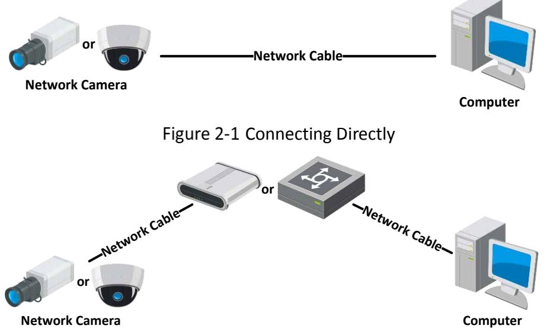

Connecting via a Switch or a Router

You are required to activate the camera first by setting a strong password for it before you can use the camera.

Activation via Web Browser, Activation via SADP, and Activation via Client Software are all supported.

### **Activation via Web Browser**

### *Steps:*

- 1. Power on the camera, and connect the camera to the network.
2. Input the IP address into the address bar of the web browser, and click **Enter** to enter the activation interface.

### *Notes:*

- The default IP address of the camera is 192.168.1.64.
- The computer and the camera should belong to the same subnet.
- For the camera enables the DHCP by default, you need to use the SADP software to

### search the IP address.

| Activation |                                                                                                                                                                                        |        | User Name |
|------------|----------------------------------------------------------------------------------------------------------------------------------------------------------------------------------------|--------|-----------|
|            |                                                                                                                                                                                        |        | Password  |
| User Name  | admin                                                                                                                                                                                  |        |           |
| Password   |                                                                                                                                                                                        | 0      | Login     |
|            | Valid password range [8-16]. You can use a combination of numbers, lowercase, uppercase and special character for your password with at least two kinds of them contained. | Strong |           |
| Confirm    |                                                                                                                                                                                        |        |           |
|            |                                                                                                                                                                                        | OK     |           |

Activation via Web Browser

- 3. Create a password and input the password into the password field.
A password with user name in it is not allowed.

**STRONG PASSWORD RECOMMENDED**–We highly recommend you create a strong password of your own choosing (using a minimum of 8 characters, including at least three of the following categories: upper case letters, lower case letters, numbers, and special characters) in order to increase the security of your product. And we recommend you reset your password regularly, especially in the high security system, resetting the password monthly or weekly can better protect your product.

4. Confirm the password.

5. Click **OK** to save the password and enter the live view interface.

### **Activation via SADP Software**

SADP software is used for detecting the online device, activating the camera, and resetting the password.

Get the SADP software from the supplied disk or the official website, and install the SADP according to the prompts. Follow the steps to activate the camera.

- 1. Run the SADP software to search the online devices.
- 2. Check the device status from the device list, and select the inactive device.

|  |  | Select inactive device. |           |  |                   |  |
|--|--|-------------------------|-----------|--|-------------------|--|
|  |  |                         |           |  |                   |  |
|  |  |                         |           |  |                   |  |
|  |  |                         |           |  | Input and confirm |  |
|  |  |                         | password. |  |                   |  |
|  |  |                         |           |  |                   |  |
|  |  |                         |           |  |                   |  |
|  |  |                         |           |  |                   |  |
|  |  |                         |           |  |                   |  |

SADP Interface

### *Note:*

The SADP software supports activating the camera in batch. Refer to the user manual of SADP software for details.

- 3. Create a password and input the password in the password field, and confirm the password.
A password with user name in it is not allowed.

**STRONG PASSWORD RECOMMENDED***–* We highly recommend you create a strong password of your own choosing (using a minimum of 8 characters, including at least three of the following categories: upper case letters, lower case letters, numbers, and special characters) in order to increase the security of your product. And we recommend you reset your password regularly, especially in the high security system, resetting the password monthly or weekly can better protect your product.

### *Note:*

You can enable the Guarding Vision service for the device during activation.

- 4. Click **Activate** to save the password.
You can check whether the activation is completed on the popup window. If activation failed, please make sure that the password meets the requirement and try again.

- 5. Change the device IP address to the same subnet with your computer by either
modifying the IP address manually or checking the checkbox of Enable DHCP.

| Modify Network Parameters |                       |
|---------------------------|-----------------------|
| Enable DHCP               |                       |
| J Enable Guarding Vision  |                       |
| Device Serial No .:       |                       |
| IP Address:               | 10.16.6.89            |
| Port:                     | 8000                  |
| Subnet Mask:              | 255,255.255.0         |
| Gateway:                  | 10.16.6.254           |
| IPv6 Address:             | =                     |
| IPv6 Gateway:             | ::                    |
| IPv6 Prefix Length:       | 0                     |
| HTTP Port                 | 80                    |
| Admin Password:           | Security Verification |
|                           | Modify                |
|                           | Forgot Password       |

Modify the IP Address

6. Input the admin password and click **Modify** to activate your IP address

modification.

The batch IP address modification is supported by the SADP. Refer to the user manual of SADP for details.

### **Activation via Client Software**

The client software is versatile video management software for multiple kinds of devices.

Get the client software from the supplied disk or the official website, and install the software according to the prompts. Follow the steps to activate the camera*.*

### *Steps:*

- 1. Run the client software and the control panel of the software pops up, as shown in the figure below.

Control Panel

- 2. Click the **Device Management** icon to enter the Device Management interface, as
shown in the figure below.

| Organization                                      | Device for Management (3) |               |          |                                        |            |             |                      |           |
|---------------------------------------------------|---------------------------|---------------|----------|----------------------------------------|------------|-------------|----------------------|-----------|
| Encoding Device/Door Sta                          | Add Device                | [4 Modify     | X Delete | 你 Remote  腦 QR Code ● Activate         |            | 9 Online U. | C Refresh All Filter |           |
| Decoding Device                                   | A IP Nickname          |               |          | Device Serial No.                      |            | Security    | Net Status           | HDD Statu |
| Cascading Server                                  | 10.16.1.250               | 10.16.1.250   |          | 20141119CCWR490340679B                 |            | Strong      | ్ర                   | C         |
| Hil Video Wall Controller                         | Heat Map                  | 10.33.3.162   |          |                                        |            |             | ್ರಿ                  | 0         |
| Third-party Encoding Device                       | Intersection              | 10.99.105.140 |          | DS-9616N-ST1620130301BBRR407129395WCVU |            | Weak        | 0                    | 0         |
| Stream Media Server 198 Add New Device Type |                           |               |          |                                        |            |             |                      |           |
|                                                   |                           |               |          |                                        |            |             |                      |           |
|                                                   | Online Device (3)         |               |          | Refresh Every 60s                      |            |             |                      |           |
|                                                   | Add to Client             | Add All       |          | Reset Password [4 Modify Netinfo    | · Activate |             | Filter               |           |
|                                                   | lb                        | - Device Type |          | Firmware Version                       | Security   | Server Port | Start Time           | Ac        |
| Encoding device/Outdoor Device:                   | 10.16.1.250               |               |          | V5.3.12build 151103                    | Active     | 8000        | 2015-12-01 16:54:37  | Ye        |

Device Management Interface

- 3. Check the device status from the device list, and select an inactive device.
- 4. Click the **Activate** button to pop up the Activation interface.
- 5. Create a password and input the password in the password field, and confirm the password.

A password with user name in it is not allowed.

**STRONG PASSWORD RECOMMENDED***–*We highly recommend you create a strong password of your own choosing (using a minimum of 8 characters, including at least three of the following categories: upper case letters, lower case letters, numbers, and special characters) in order to increase the security of your product. We recommend you reset your password regularly, especially in the high security system, resetting the password monthly or weekly can better protect your product.

|                       | Activation                                                                                                                                                                             |        |
|-----------------------|----------------------------------------------------------------------------------------------------------------------------------------------------------------------------------------|--------|
| User Name:            | admin                                                                                                                                                                                  |        |
| Password:             |                                                                                                                                                                                        |        |
|                       |                                                                                                                                                                                        | Strong |
|                       | Valid password range [8-16]. You can use a combination of numbers, lowercase, uppercase and special character for your password with at least two kinds of them contained. |        |
|                       |                                                                                                                                                                                        |        |
| Confirm New Password: |                                                                                                                                                                                        |        |

Activation Interface (Client Software)

- 6. Click **OK** button to start activation.
- 7. Click the Modify Netinfo button to pop up the Network Parameter Modification

interface, as shown in the figure below.

|                                | Modify Network Parameter                  |        |
|--------------------------------|-------------------------------------------|--------|
| Device Information:            |                                           |        |
| MAC Address:                   | XX-XX-XX-XX-XX-XX-XX                      | Copy   |
| Software Version:              | Vx.x.xbuild xxxxxx                        | Copy   |
| Device Serial No .:            | XX-XXXXXXXXXX-XXXXXXXXXXXXXXXXXXXXXXXXXXX | Copy   |
| Network Information: D DHCP |                                           |        |
| Port                           | 8000                                      |        |
| J IPv4(Enable)                 |                                           |        |
| IP address:                    | 192.168.1.64                              |        |
| Subnet Mask:                   | 255.255.255.0                             |        |
| Gateway:                       | 192.168.1.64                              |        |
| IPv6(Disable) 17            |                                           |        |
| Password:                      |                                           |        |
|                                |                                           |        |
|                                | OK                                        | Cancel |
|                                |                                           |        |

Modifying the Network Parameters

- 8. Change the device IP address to the same subnet with your computer by either modifying the IP address manually or checking the checkbox of Enable DHCP.
- 9. Input the password to activate your IP address modification.

Security question is used to reset the admin password when admin user forgets the password.

Admin user can follow the pop-up window to complete security question settings during camera activation. Or, admin user can go to **User Management** interface to set up the function.

### *Purpose:*

This section explains how to connect the network camera to the WAN with a static IP or a dynamic IP.

### *Before you start:*

Please apply a static IP from an ISP (Internet Service Provider). With the static IP address, you can connect the network camera via a router or connect it to the WAN directly.

### **Connecting the network camera via a router**

### *Steps:*

- 1. Connect the network camera to the router.
- 2. Assign a LAN IP address, the subnet mask and the gateway. Refer to 2.1.2 Activating the Camera for detailed IP address configuration of the network camera.
- 3. Save the static IP in the router.
- 4. Set port mapping, e.g., 80, 8000, and 554 ports. The steps for port mapping vary according to the different routers. Please call the router manufacturer for assistance with port mapping.

*Note:* Refer to Appendix 2 Port Mapping for detailed information about port mapping.

- 5. Visit the network camera through a web browser or the client software over the internet.
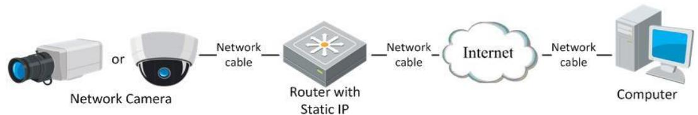

Accessing the Camera through Router with Static IP

### **Connecting the network camera with static IP directly**

You can also save the static IP in the camera and directly connect it to the internet without using a router. Refer to 2.1.2 Activating the Camera for detailed IP address configuration of the network camera.

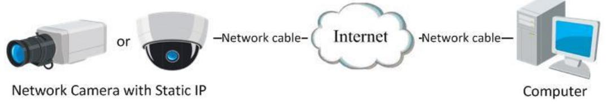

Accessing the Camera with Static IP Directly

### *Before you start:*

Please apply a dynamic IP from an ISP. With the dynamic IP address, you can connect the network camera to a modem or a router.

- **Connecting the network camera via a router**
- 1. Connect the network camera to the router.
- 2. In the camera, assign a LAN IP address, the subnet mask and the gateway. Refer to 2.1.2 Activating the Camera for detailed IP address configuration of the network camera.
- 3. In the router, set the PPPoE user name, password and confirm the password.
- 4. Set port mapping. E.g. 80, 8000, and 554 ports. The steps for port mapping vary

depending on different routers. Please call the router manufacturer for assistance with port mapping.

*Note:* Refer to Appendix 2 Port Mapping for detailed information about port mapping.

- 5. Apply a domain name from a domain name provider.
- 6. Configure the DDNS settings in the setting interface of the router.
- 7. Visit the camera via the applied domain name.

### **Connecting the network camera via a modem**

### *Purpose:*

This camera supports the PPPoE auto dial-up function. The camera gets a public IP address by ADSL dial-up after the camera is connected to a modem. You need to configure the PPPoE parameters of the network camera. Refer to 7.1.3 Configuring PPPoE Settings for detailed configuration.

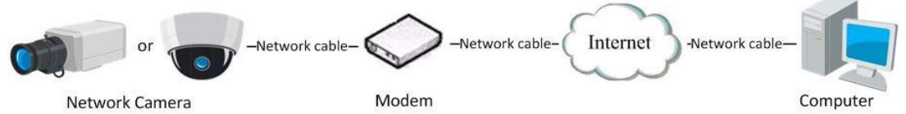

Accessing the Camera with Dynamic IP

*Note:* The obtained IP address is dynamically assigned via PPPoE, so the IP address always changes after rebooting the camera. To solve the inconvenience of the dynamic IP, you need to get a domain name from the DDNS provider (E.g. DynDns.com). Please follow the steps below for normal domain name resolution and private domain name resolution to solve the problem.

- Normal Domain Name Resolution
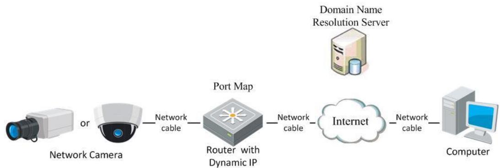

### Normal Domain Name Resolution

### *Steps:*

- 1. Apply a domain name from a domain name provider.
- 2. Configure the DDNS settings in the **DDNS Settings**interface of the network camera.

Refer to 7.1.2 Configuring DDNS Settings for detailed configuration.

- 3. Visit the camera via the applied domain name.
# **Chapter 3 Access to the Network Camera**

### *Note:*

For certain camera models, HTTPS is enabled by default and the camera creates an unsigned certificate automatically. When you access to the camera the first time, the web browser prompts a notification about the certificate issue.

To cancel the notification, install a signed-certificate to the camera. For detailed operation, see 7.2.6 HTTPS Settings*.*

### *Steps:*

1. Open the web browser.

- 2. In the browser address bar, input the IP address of the network camera, and press the **Enter** key to enter the login interface.
### *Note:*

The default IP address is 192.168.1.64. You are recommended to change the IP address to the same subnet with your computer.

- 3. Input the user name and password and click **Login**.
The admin user should configure the device accounts and user/operator permissions properly. Delete the unnecessary accounts and user/operator permissions.

### *Note:*

The IP address is locked if the admin/user/operator performs 7 failed password attempts.

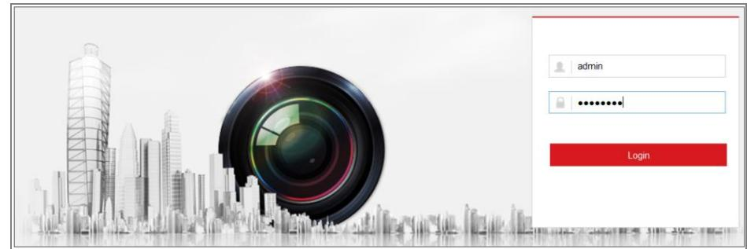

Login Interface

- 4. Click **Login**.
- 5. (Optional) Install the plug-in before viewing the live video and operating the camera. Follow the installation prompts to install the plug-in

### *Note:*

For camera that supports plug-in free live view, if you are using Google Chrome 57 and its above version or Mozilla Firefox 52 and its above version, plug-in installation is not required. But **Picture** and **Playback** functions are hidden. To use mentioned function via web browser, change to their lower version, or change to Internet Explorer 8.0 and above version.

The product CD contains the Guarding Expert client software. You can view the live video and manage the camera with the software.

Follow the installation prompts to install the software. The control panel and live view interface of Guarding Expert client software are shown as below.

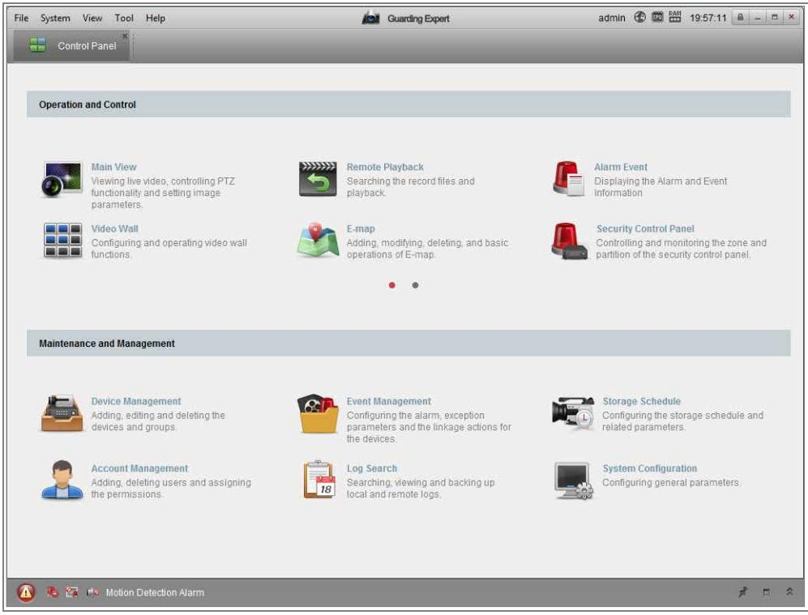

Guarding Expert Control Panel

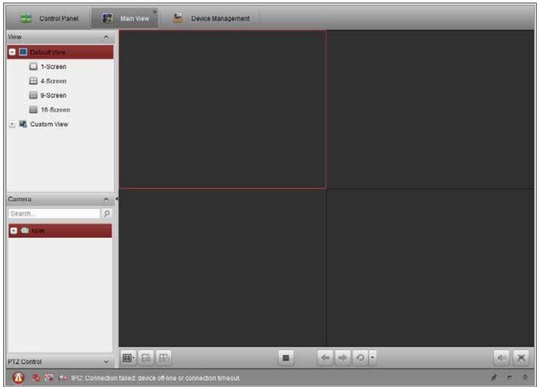

Guarding Expert Main View

## **Chapter 4 Wi-Fi Settings**

### *Purpose:*

By connecting to the wireless network, you do not need to use cable of any kind for network connection, which is very convenient for the actual surveillance application. *Note:* This chapter is only applicable for the cameras with the built-in Wi-Fi module.

### *Purpose:*

Two connection modes are supported. Choose a mode as desired and perform the steps to configure the Wi-Fi.

### **Wireless Connection in Manage Mode**

### *Steps:*

- 1. Enter the Wi-Fi configuration interface.
### **Configuration> Network> Advanced Settings> Wi-Fi**

- 2. Click **Search** to search the online wireless connections.

| Wireless List |                  |              |               |         |                 | Search       |
|---------------|------------------|--------------|---------------|---------|-----------------|--------------|
| No.           | SSID             | Working Mode | Security Mode | Channel | Signal Strength | Speed (Mbps) |
| 1             | TP-LINK_SoftWare | Manage       | disable       | 1       | 81              | 150          |
| 2             | C-WEP            | Manage       | WEP           | 11      | 50              | 54           |
| 3             | C-not-encrypted  | Manage       | disable       | 11      | 50              | 54           |
| 4             | C-WPA2-Personal  | Manage       | WPA2-personal | 11      | 47              | 54           |
| 5             | FINALHAUT        | Manage       | WPA2-personal | 6       | 46              | 54           |
| 6             | 6688             | Manage       | WPA2-personal | 6       | 46              | 54           |
| 7             | C199TH           | Manage       | WPA2-personal | 6       | 46              | 54           |
| 8             | 6688             | Manage       | WPA2-personal | 6       | 44              | 54           |
| 9             | FINALHAUT        | Manage       | WPA2-personal | 6       | 44              | 54           |
| 10            | maomao           | Manage       | WPA2-personal | 6       | 43              | 54           |
| 11            | yingkongshi12    | Manage       | WPA2-personal | 6       | 43              | 54           |
| 12            | Hik-Guest        | Manage       | WPA-personal  | 1       | 43              | 54           |
| 13            | Hik-Meeting      | Manage       | WEP           | 1       | 43              | 54           |

Wi-Fi List

- 3. Click to choose a wireless connection on the list.

| Wi-Fi           |                   |
|-----------------|-------------------|
| SSID            | C-WPA2-Personal   |
| Network Mode    | @ Manage @ Ad-Hoc |
| Security Mode   | WPA2-personal     |
| Encryption Type | TKIP              |
| Key 1 @         |                   |

Wi-Fi Setting- Manage Mode

- 4. Check the radio button to select the Network mode as Manage*,* and the *Security mode* of the network is automatically shown when you select the wireless network, please don't change it manually.
*Note:* These parameters are identical with those of the router.

- 5. Enter the key to connect the wireless network. The key should be that of the wireless network connection you set on the router.
### **Wireless Connection in Ad-hoc Mode**

If you choose the Ad-hoc mode, you don't need to connect the wireless camera via a router. The scenario is the same as you connect the camera and the PC directly with a network cable.

- 1. Choose Ad-hoc mode.

| Wi-Fi           |                   |
|-----------------|-------------------|
| SSID            | C-WPA2-Personal   |
| Network Mode    | @ Manage @ Ad-Hoc |
| Security Mode   | WPA2-personal     |
| Encryption Type | TKIP              |
| Key 1 @         |                   |

Wi-Fi Setting- Ad-hoc

- 2. Customize a SSID for the camera.
- 3. Choose the Security Mode of the wireless connection.
- 4. Enable the wireless connection function for your PC.
- 5. On the PC side, search the network and you can see the SSID of the camera listed.

| camera6467 wifi                 |    |
|---------------------------------|----|
| belkin54g                       | 37 |
| Tenda_0A0698                    |    |
| yourPC                          |    |
| HenryHu                         |    |
| APPLE                           |    |
| Peter_Ma                        |    |
| Open Network and Sharing Center |    |

Ad-hoc Connection Point

- 6. Choose the SSID and connect.
### **Security Mode Description:**

| WPA2-personal   |  |
|-----------------|--|
| not-encrypted   |  |
| WEP             |  |
| WPA-personal    |  |
| WPA-enterprise  |  |
| WPA2-personal   |  |
| WPA2-enterprise |  |

Security Mode

You can choose the Security Mode as not-encrypted, WEP, WPA-personal, WPA-

enterprise, WPA2-personal, and WPA2-enterprise.

WEP mode:

| Security Mode  | WEP                |
|----------------|--------------------|
| Authentication | Open @ Shared 0 |
| Key Length     | @ 64bit @ 128bit   |
| Key Type       | @ HEX @ ASCII      |
| Key 1 @        |                    |
| Key 2 0        |                    |
| Key 3 0        |                    |
| Key 4 ©        |                    |

- Authentication Select Open or Shared Key System Authentication, depending on the method used by your access point. Not all access points have this option, in which case they probably use Open System, which is sometimes known as SSID Authentication.
- Key length This sets the length of the key used for the wireless encryption, 64 or 128 bit. The encryption key length can sometimes be shown as 40/64 and 104/128.
- Key type The key types available depend on the access point being used. The following options are available:

HEX - Allows you to manually enter the hex key.

ASCII - In this method, the string must be exactly 5 characters for 64-bit WEP and

13 characters for 128-bit WEP.

WPA-personal and WPA2-personal Mode:

Enter the required Pre-shared Key for the access point, which can be a hexadecimal number or a passphrase.

| Security Mode   | WPA-personal |
|-----------------|--------------|
| Encryption Type | TKIP         |
| Key 1 @         |              |

Security Mode- WPA-personal

WPA- enterprise and WPA2-enterprise Mode:

Choose the type of client/server authentication being used by the access point: EAP-

TLS or EAP-PEAP.

EAP-TLS

| Security Mode        | WPA-enterprise > |                  |
|----------------------|---------------------|------------------|
| Authentication       | EAP-TTLS >       |                  |
| User Name            |                     |                  |
| Password             |                     |                  |
| Inner authentication | PAP >            |                  |
| Anonymous identity   |                     |                  |
| EAPOL version        | 1 >              |                  |
| CA certificate       |                     | Browse Upload |

EAP-TLS

- Identity Enter the user ID to present to the network.
- Private key password Enter the password for your user ID.
- EAPOL version Select the version used (1 or 2) in your access point.
- CA Certificates Upload a CA certificate to present to the access point for authentication.

EAP-PEAP:

- User Name Enter the user name to present to the network
- Password Enter the password of the network
- PEAP Version Select the PEAP version used at the access point.
- Label Select the label used by the access point.
- EAPOL version Select version (1 or 2) depending on the version used at the access point
- CA Certificates Upload a CA certificate to present to the access point for authentication

- *For your privacy and to better protect your system against security risks, we strongly recommend the use of strong passwords for all functions and network*
*devices. The password should be something of your own choosing (using a minimum of 8 characters, including at least three of the following categories: upper case letters, lower case letters, numbers and special characters) in order to increase the security of your product.*

- *Proper configuration of all passwords and other security settings is the responsibility of the installer and/or end-user.*
### *Purpose:*

The setting of the wireless network connection is never easy. To avoid the complex setting of the wireless connection you can enable the WPS function.

WPS (Wi-Fi Protected Setup) refers to the easy configuration of the encrypted connection between the device and the wireless router. The WPS makes it easy to add new devices to an existing network without entering long passphrases. There are two modes of the WPS connection, the PBC mode and the PIN mode.

*Note:* If you enable the WPS function, you do not need to configure the parameters such as the encryption type and you don't need to know the key of the wireless connection.

| PIN Code              | 12345678        | Generate |
|-----------------------|-----------------|----------|
| · PBC connection      | Connect         |          |
| C Use router PIN code | Connect         |          |
| SSID                  | C-WPA2-Personal |          |
| Router PIN code       |                 |          |

Wi-Fi Settings - WPS

PBC refers to the Push-Button-Configuration, in which the user simply has to push a

button, either an actual or virtual one (as the button on the

configuration interface of the IE browser), on both the Access Point (and a registrar of the network) and the new wireless client device.

1. Check the checkbox of to enable WPS.

- 2. Choose the connection mode as PBC.

|  | @ PBC connection | Connect |  |
|--|------------------|---------|--|
|  |                  |         |  |

*Note:* Support of this mode is mandatory for both the Access Points and the connecting devices.

3. Check on the Wi-Fi router to see if there is a WPS button. If yes, push the button and you can see the indicator near the button start flashing, which means the WPS function of the router is enabled. For detailed operation, please see the user guide of the router.

4. Push the WPS button to enable the function on the camera.

If there is not a WPS button on the camera, you can also click the virtual button to enable the PBC function on the web interface.

5. Click **Connect** button.

When the PBC mode is both enabled in the router and the camera, the camera and the wireless network is connected automatically.

### **PIN Mode:**

The PIN mode requires a Personal Identification Number (PIN) to be read from either a sticker or the display on the new wireless device. This PIN must then be entered to connect the network, usually the Access Point of the network.

- 1. Choose a wireless connection on the list and the SSID is loaded automatically.
- 2. Choose **Use route PIN code**.

| WPS                   |                 |          |
|-----------------------|-----------------|----------|
| Enable WPS >       |                 |          |
| PIN Code              | 12345678        | Generate |
| PBC connection 0   | Connect         |          |
| @ Use router PIN code | Connect         |          |
| SSID                  | C-WPA2-Personal |          |
| Router PIN code       |                 |          |

Use PIN Code

If the PIN code is generated from the router side, you should enter the PIN code you get from the router side in the **Router PIN code** field.

- 3. Click **Connect**.
Or

You can generate the PIN code on the camera side. And the expired time for the PIN code is 120 seconds.

- 1. Click **Generate**.

| PIN Code | 12345678 | Generate |
|----------|----------|----------|
|          |          |          |

- 2. Enter the code to the router, in the example, enter 48167581 to the router.
The default IP address of wireless network interface controller is 192.168.1.64. When you connect to the wireless network, you can change the default IP.

*Steps:*

- 1. Enter the TCP/IP configuration interface.
### **Configuration** > **Network** > **Basic Settings** > **TCP/IP**

- 2. Select the Wlan tab.

|                      | DHCP                       |      |
|----------------------|----------------------------|------|
| IPv4 Address         | 169.254.121.194            | Test |
| IPv4 Subnet Mask     | 255.255.0.0                |      |
| IPv4 Default Gateway |                            |      |
| Multicast Address    |                            |      |
|                      | Enable Multicast Discovery |      |
| DNS Server           |                            |      |
| Preferred DNS Server | 8.8.8.8                    |      |
| Alternate DNS Server |                            |      |

Setting WLAN Parameters

- 3. Customize the IPv4 address, the IPv4 Subnet Mask and the Default Gateway.
The setting procedure is the same with that of LAN.

If you want to be assigned the IP address, you can check the checkbox to enable the DHCP.

## **Chapter 5 Live View**

### *Purpose:*

The live view page allows you to view the real-time video, capture images, record videos, realize PTZ control, configure display settings, OSD settings, video/audio settings, VCA settings and set/call presets.

Log in the network camera to enter the live view page, or you can click **Live View** on the menu bar of the main page to enter the live view page.

### **Descriptions of the live view page:**

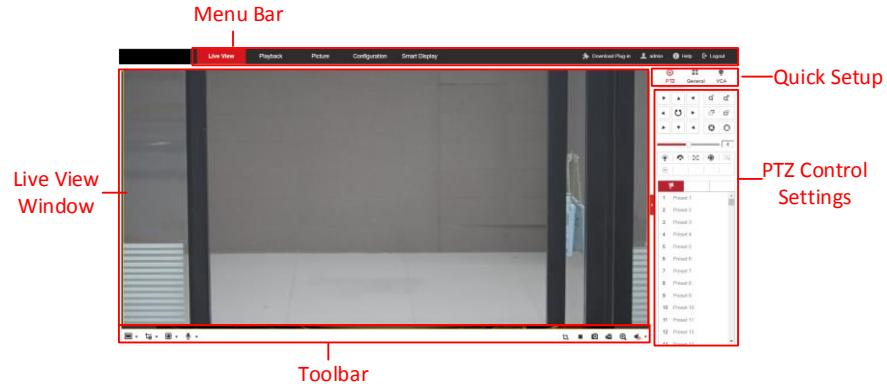

### **Menu Bar**

Click each tab to enter Live View, Playback, Picture, Application, Configuration and Smart Display page respectively.

### **Live View Window**

Display the live video.

### **Toolbar**

Toolbar allows you to adjust the live view window size, the stream type, and the plugsin. It also allows you to process the operations on the live view page, e.g., start/stop live view, capture, record, audio on/off, two-way audio, start/stop digital zoom, etc. For IE (Internet Explorer) users, plugs-in as webcomponents and quick time are selectable. And for Non-IE users, webcomponents, quick time, VLC or MJPEG are selectable if the web browser supports them.

### *Note:*

For camera that supports plug-in free live view, when Google Chrome 45 and its above version or Mozilla Firefox 52 and its above version are used, plug-in installation is not required. But **Picture** and **Playback** functions are hidden. To use mentioned function via web browser, change to their lower versions, or change to Internet Explorer 8.0 and its above version.

### **Quick Setup**

It allows quick setup of PTZ control, image, video/audio settings and VCA settings on live view page.

### **PTZ Control Settings**

Perform panning, tilting and zooming actions of the camera. Control the light and the wiper (only available for cameras supporting PTZ function). Set/call/delete the presets or patrols for PTZ cameras.

In the live view window as shown in Figure 5-1, click on the toolbar to start the live view of the camera.

### Live View Toolbar

| Icon   | Description                                 |
|--------|---------------------------------------------|
| /      | Start/Stop live view.                       |
|        | 4:3 window size.                            |
|        | 16:9 window size.                           |
|        | Original widow size.                        |
|        | Self-adaptive window size.                  |
|        | Original ratio window size.                 |
| , , | Live view with the different video streams. |

### Table 5-1 Toolbar Description

| Icon                                                     | Description                                                                     |  |  |  |  |  |
|----------------------------------------------------------|---------------------------------------------------------------------------------|--|--|--|--|--|
| , etc.                                                   | Supported video streams vary according to camera models.                        |  |  |  |  |  |
|                                                          | For the camera models that support 10 streams, go to |  |  |  |  |  |
|                                                          | Video/Audio > Custom to add the streams.                                        |  |  |  |  |  |
|                                                          | Click to select the third-party plug-in.                                        |  |  |  |  |  |
|                                                          | Manually capture the picture.                                                   |  |  |  |  |  |
| /                                                        | Manually start/stop recording.                                                  |  |  |  |  |  |
| /                                                        | Audio on and adjust volume /Mute.                                               |  |  |  |  |  |
| /                                                        | Turn on/off microphone.                                                         |  |  |  |  |  |
| /                                                        | Start/stop digital zoom function.                                               |  |  |  |  |  |
| /                                                        | Start/stop pixel counter                                                        |  |  |  |  |  |
| Click the button to display pictures captured by camera. |                                                                                 |  |  |  |  |  |
|                                                          | Note: The function is only available for certain camera models that          |  |  |  |  |  |
|                                                          | support face capture.                                                           |  |  |  |  |  |

*Note:* The icons vary according to the different camera models.

### **Pixel Counter:**

### *Steps:*

- 1. Click **Start Pixel Counter** to enable the function.
- 2. Drag the mouse on the image to select the desired rectangle area. The width pixel

and height pixel is displayed on the bottom of the web.

- 3. Click the button again to stop the function.
### *Note:*

The pixel counter is only supported under the main stream and only one rectangle is supported.

### **Full-screen Mode:**

You can double-click on the live video to switch the current live view into fullscreen or return to normal mode from the full-screen.

In the live view interface, click on the toolbar to capture the live pictures or click

to record the live view. The saving paths of the captured pictures and clips can be

set on the **Configuration > Local** page. To configure remote scheduled recording, please refer to 6.1 Configuring Local Parameters.

*Note***:** The captured image will be saved as JPEG file or BMP file in your computer.

It offers the quick access to the display settings, OSD, and video/audio on live view page.

*Steps:*

- 1. Click on the right of the live view window to show the quick setup panel. Click
to hide it.

- 2. Set display settings, OSD, and video/audio.
For PTZ parameters settings, refer to

For Display settings, refer to 9.1 Configuring Display Settings.

For OSD settings, refer to 9.2 Configuring OSD Settings.

For Video/Audio settings, refer to Chapter 8 Video/Audio Settings.

For VCA resources settings, refer to 6.2.6 Configuring VCA Resource.

*Note:* Quick setup function varies according to different camera model.

### **PTZ Control Panel**

### *Purpose:*

You can use the PTZ control buttons to realize pan/tilt/zoom control of the camera. *Note:* To realize PTZ control, the camera connected to the network must support the PTZ function or have a pan/tilt unit installed to the camera. Please properly set the PTZ parameters on RS-485 settings page by referring to 6.2.5 Configuring RS-485 Settings*.* Click the direction buttons to control the pan/tilt movements.

|   |   | a e PTZ General VCA |    |      |
|---|---|------------------------|----|------|
|   |   |                        |    |      |
|   |   |                        | 'ರ | ್ ರ್ |
| v |   | 5 >                    | ට් | പി   |
| 4 | > | ◀                      | 2  | 0    |

PTZ Control Panel

Click the zoom/focus/iris buttons to realize lens control.

### *Notes***:**

- There are eight direction arrows ( , , , , , , , ) in the control panel. Click the arrows to realize adjustment in the relative positions.
- For the cameras that support lens movements only, the direction buttons are invalid.

| Icon | Description                        |
|------|------------------------------------|
|      | Zoom in/out                        |
|      | Focus near/far                     |
|      | Iris +/-                           |
|      | PTZ speed adjustment               |
|      | Light on/off                       |
|      | Wiper on/off                       |
|      | Auxiliary focus                    |
|      | Initialize lens                    |
|      | Adjust speed of pan/tilt movements |
|      | Start Manual Tracking              |
|      | Start 3D Zoom                      |

### **Setting/Calling a Preset**

- **Setting a Preset:**
- 1. In the PTZ control panel, select a preset number from the preset list.

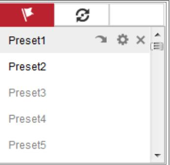

Setting a Preset

- 2. Use the PTZ control buttons to move the lens to the desired position.
	- Pan the camera to the right or left.
	- Tilt the camera up or down.
	- Zoom in or out.
	- Refocus the lens.
- 3. Click to finish the setting of the current preset.
- 4. You can click to delete the preset.
- **Calling a Preset:**

This feature enables the camera to point to a specified preset scene manually or automatically when an event takes place.

For the defined preset, you can call it at any time to the desired preset scene.

In the PTZ control panel, select a defined preset from the list and click to call the preset.

Or you can place the mouse on the presets interface, and call the preset by typing the preset No. to call the corresponding presets.

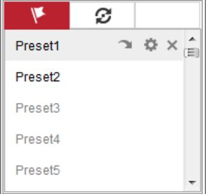

Calling a Preset

### **Setting/Calling a Patrol**

### *Note:*

No less than 2 presets should be configured before you set a patrol.

### *Steps:*

- 1. Click to enter the patrol configuration interface.
- 2. Select a path No., and click to add the configured presets.
- 3. Select the preset, and input the patrol duration and patrol speed.
- 4. Click **OK** to save the first preset.
- 5. Follow the steps above to add the other presets.

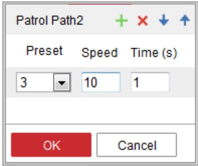

Add Patrol Path

- 6. Click **OK** to save a patrol.
- 7. Click to start the patrol, and click to stop it.
- 8. (Optional) Click to delete a patrol.

### **Display Settings**

- **Scene:** Select a scene according to actual installation environment. (Only certain camera models support.)
- **WDR:** The WDR (Wide Dynamic Range) function helps the camera provide clear images even under back light circumstances. When there are both very bright and very dark areas simultaneously in the field of view, WDR balances the

brightness level of the whole image and provide clear images with details. You can enable or disable the WDR function and set the level.

- **HLC:** High Light Compensation makes the camera identify and suppress the strong light sources that usually flare across a scene. This makes it possible to see the detail of the image that would normally be hidden.
### **OSD (On Screen Display)**

Set text information displayed on screen. Alignment adjustment is available for Text Overlay. Save the settings after configuration.

### **Video/Audio**

Resolution and Max. Bit rate are adjustable. Click to change stream.

VCA Resource offers options to enable certain VCA functions and hide others. It helps allocate more resources to the wanted functions. A reboot is required after setting the VCA Resource.

### *Note:*

- VCA Resource function varies according to different camera models.
- VCA options are mutually exclusive.
- Only certain camera models support the function.

### *Purpose:*

You can use the PTZ control buttons to realize pan/tilt/zoom control of the camera.

*Note:* To realize PTZ control, the camera connected to the network must support the

PTZ function or have a pan/tilt unit installed to the camera. Please properly set the PTZ

parameters on RS-485 settings page by referring to 6.2.5 Configuring RS-485 Settings*.*

| ் ு U - |      | PTZ | General | VCA |
|------------------|------|-----|---------|-----|
| v                |      |     |         | ್ ಇ |
|                  |      |     |         | വ   |
| 한 イ           |      |     |         | 0   |
|                  |      |     |         | 4   |
| 0 0 0 0 0 0 0    | (ap) |     |         |     |

Click the direction buttons to control the pan/tilt movements.

PTZ Control Panel

Click the zoom/focus/iris buttons to realize lens control.

### *Notes***:**

- There are eight direction arrows ( , , , , , , , ) in the control panel. Click the arrows to realize adjustment in the relative positions.
- For the cameras that support lens movements only, the direction buttons are invalid.

| Icon | Description                        |
|------|------------------------------------|
|      | Zoom in/out                        |
|      | Focus near/far                     |
|      | Iris +/-                           |
|      | PTZ speed adjustment               |
|      | Light on/off                       |
|      | Wiper on/off                       |
|      | Auxiliary focus                    |
|      | Initialize lens                    |
|      | Adjust speed of pan/tilt movements |
|      | Start Manual Tracking              |
|      | Start 3D Zoom                      |

Descriptions of PTZ Control Panel

### **Setting a Preset:**

- 1. In the PTZ control panel, select a preset number from the preset list.
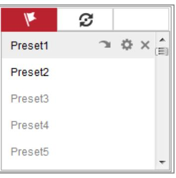

- 2. Use the PTZ control buttons to move the lens to the desired position.
	- Pan the camera to the right or left.
	- Tilt the camera up or down.
	- Zoom in or out.
	- Refocus the lens.
- 3. Click to finish the setting of the current preset.
- 4. You can click to delete the preset.

### **Calling a Preset:**

This feature enables the camera to point to a specified preset scene manually or

automatically when an event takes place.

For the defined preset, you can call it at any time to the desired preset scene.

In the PTZ control panel, select a defined preset from the list and click to call the preset.

Or you can place the mouse on the presets interface, and call the preset by typing the preset No. to call the corresponding presets.

| 12      | ਾ |    |     |
|---------|---|----|-----|
| Preset1 | 7 | ×× | (듣) |
| Preset2 |   |    |     |
| Preset3 |   |    |     |
| Preset4 |   |    |     |
| Preset5 |   |    |     |

Calling a Preset

### *Note:*

No less than 2 presets should be configured before you set a patrol.

- 1. Click to enter the patrol configuration interface.
- 2. Select a path No., and click to add the configured presets.
- 3. Select the preset, and input the patrol duration and patrol speed.
- 4. Click **OK** to save the first preset.
- 5. Follow the steps above to add the other presets.

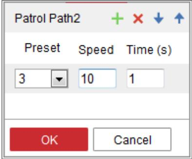

Add Patrol Path

- 6. Click **OK** to save a patrol.
- 7. Click to start the patrol, and click to stop it.
- 8. (Optional) Click to delete a patrol.

Certain operation system and web browser may restrict the display and operation of the camera function. You should install plug-in or complete certain settings to ensure normal display and operation.

| Operation System | Web Browser                                                               | Operation                                                                                                                                                                                                                                                                                                                                                                                                                        |
|---------------------|---------------------------------------------------------------------------|----------------------------------------------------------------------------------------------------------------------------------------------------------------------------------------------------------------------------------------------------------------------------------------------------------------------------------------------------------------------------------------------------------------------------------|
|                     | Internet Explorer 8+                                                      | Follow pop-up prompts to complete plug-in installation.                                                                                                                                                                                                                                                                                                                                                              |
| Windows             |  Google Chrome 57+  Mozilla Firefox 52+                        | Click to download and install plug-in.                                                                                                                                                                                                                                                                                                                                                                                     |
| Mac OS              |  Google Chrome 57+  Mozilla Firefox 52+  Mac Safari 16+ |  Plug-in installation is not required.  Enable WebSocket or WebSockets (Configuration > Network > Advanced Settings > Network Service) for normal live view. Display and operation of certain functions are restricted. For example, Playback and Picture are not available. For detailed restricted function, refer to the actual device. |

### *Note:*

The camera only supports Windows and Mac OS system and do not support Linux system.

# **Chapter 6 Network Camera Configuration**

### *Purpose:*

The local configuration refers to the parameters of the live view, record files and captured pictures. The record files and captured pictures are the ones you record and capture using the web browser and thus the saving paths of them are on the PC running the browser.

### *Steps:*

- 1. Enter the Local Configuration interface: **Configuration** > **Local**.
- 2. Configure the following settings:
- **Live View Parameters:** Set the protocol type and live view performance.
	- **Protocol Type:** TCP, UDP, MULTICAST and HTTP are selectable.

**TCP:** Ensures complete delivery of streaming data and better video quality, yet the real-time transmission will be affected.

**UDP:** Provides real-time audio and video streams.

**HTTP:** Allows the same quality as of TCP without setting specific ports for streaming under some network environments.

**MULTICAST:** It's recommended to select MCAST type when using the Multicast function. For detailed information about Multicast, refer to 7.1.1 Configuring TCP/IP Settings*.*

- **Play Performance:** Set the live view performance to Shortest Delay, Balanced, Fluent or Custom. For Custom, you can set the frame rate for live view.
- **Rules:** It refers to the rules on your local browser, select enable or disable to display or not display the colored marks when the motion detection, face detection, or intrusion detection is triggered. E.g., enabled as the rules are,

and the face detection is enabled as well, when a face is detected, it will be marked with a green rectangle on the live view.

- **Display POS Information:** Enable the function, feature information of the detected target is dynamically displayed near the target in the live image. The feature information of different functions is different. For example, ID and waiting time for Queue Management, height for People Counting, etc.
### *Note:*

Display POS Information is only available for certain camera models.

- **Image Format:** Choose the image format for picture capture.

| Live View Parameters    |                |            |             |                        |
|-------------------------|----------------|------------|-------------|------------------------|
| Protocol                | 6 TCP          | O UDP      | O MULTICAST | O HTTP                 |
| Play Performance        | Shortest Delay | O Balanced | O Fluent    | ● Custom   20 frame |
| Rules                   | () Enable      | · Disable  |             |                        |
| Display POS Information | () Enable      | · Disable  |             |                        |
| Image Format            | ● JPEG         | O BMP      |             |                        |

Live View Parameters

- **Record File Settings:** Set the saving path of the recorded video files. Valid for the record files you recorded with the web browser.
	- **Record File Size:** Select the packed size of the manually recorded and downloaded video files to 256M, 512M or 1G. After the selection, the maximum record file size is the value you selected.
	- **Save record files to:** Set the saving path for the manually recorded video files.
	- **Save downloaded files to:** Set the saving path for the downloaded video files in playback mode.
- **Picture and Clip Settings:** Set the saving paths of the captured pictures and clipped video files. Valid for the pictures you capture with the web browser.
	- **Save snapshots in live view to:** Set the saving path of the manually captured pictures in live view mode.
	- **Save snapshots when playback to:** Set the saving path of the captured pictures in playback mode.
	- **Save clips to:** Set the saving path of the clipped video files in playback mode.
- *Note***:** You can click **Browse** to change the directory for saving the clips and pictures, and click **Open** to open the set folder of clips and picture saving.
- 3. Click **Save** to save the settings.

### *Purpose:*

Follow the instructions below to configure the system settings, include System Settings, Maintenance, Security, and User Management, etc.

Enter the Device Information interface: **Configuration** > **System** > **System Settings** > **Basic Information**.

In the **Basic Information** interface, you can edit the Device Name and Device No. Other information of the network camera, such as Model, Serial No., Firmware Version, Encoding Version, Number of Channels, Number of HDDs, Number of Alarm Input and Number of Alarm Output are displayed. The information cannot be changed in this menu. It is the reference for maintenance or modification in future.

### *Purpose:*

You can follow the instructions in this section to configure the time synchronization and DST settings.

- 1. Enter the Time Settings interface, **Configuration > System> System Settings > Time Settings**.

| Time Zone           | v (GMT+08:00) Beijing, Urumqi, Singapore, Perth |                    |  |
|---------------------|----------------------------------------------------|--------------------|--|
| NTP                 |                                                    |                    |  |
| O NTP               |                                                    |                    |  |
| Server Address      | time.windows.com                                   |                    |  |
| NTP Port            | 123                                                |                    |  |
| Interval            | 1440                                               | minute(s)          |  |
|                     | Test                                               |                    |  |
| Manual Time Sync.   |                                                    |                    |  |
| · Manual Time Sync. |                                                    |                    |  |
| Device Time         |                                                    |                    |  |
| Set Time            |                                                    | vith computer time |  |

Time Settings

- 2. Select the Time Zone of your location from the drop-down menu.
- 3. Configure the NTP settings.
	- (1) Click to enable the **NTP** function.
	- (2) Configure the following settings:

**Server Address:** IP address of NTP server.

**NTP Port:** Port of NTP server.

**Interval:** The time interval between the two synchronizing actions with NTP

server.

- (3) (Optional) You can click the **Test** button to test the time synchronization function via NTP server.

| @ NTP          |              |           |
|----------------|--------------|-----------|
| Server Address | 10.65.222.26 |           |
| NTP Port       | 123          |           |
| Interval       | 1440         | minute(s) |
|                | Test         |           |

Time Sync by NTP Server

*Note***:** If the camera is connected to a public network, you should use a NTP server that has a time synchronization function, such as the server at the National Time Center (IP Address: 210.72.145.44). If the camera is set in a customized network, NTP software can be used to establish a NTP server for time synchronization.

- Configure the manual time synchronization.
	- (1) Check the **Manual Time Sync.** to enable the manual time synchronization function.
	- (2) Click the icon to select the date, time from the pop-up calendar.
	- (3) (Optional) You can check **Sync. with computer time** to synchronize the time of the device with that of the local PC.

Time Sync Manually

- Click **Save** to save the settings.
### *Purpose:*

Daylight Saving Time (DST) is a way of making better use of the natural daylight by setting your clock forward one hour during the summer months, and back again in the fall.

Configure the DST according to your actual demand.

- 1. Enter the DST configuration interface**: Configuration** > **System** > **System Settings** > **DST.**

| Enable DST 1 |                                       |  |
|-----------------|---------------------------------------|--|
| Start Time      | First   Sun 00 Jan P V |  |
| End Time        | First Sun 00 Jan             |  |
| DST Bias        | 30min                                 |  |

### DST Settings

- 2. Select the start time and the end time.
- 3. Select the DST Bias.
- 4. Click **Save** to activate the settings.

The RS-232 port can be used in two ways:

- Console: Connect a computer to the camera through the serial port. Device parameters can be configured by using software such as HyperTerminal. The serial port parameters must be the same as the serial port parameters of the camera.
- Transparent Channel: Connect a serial device directly to the camera. The serial device will be controlled remotely by the computer through the network.

### *Steps:*

- 1. Enter RS-232 Port Setting interface: **Configuration**> **System** > **System Settings** > **RS-232**.
- 2. Configure the Baud Rate, Data Bit, Stop Bit, Parity, Flow Control, and Usage.

| Baud Rate | 115200  |
|-----------|---------|
| Data Bit  | 8       |
| Stop Bit  | 1       |
| Parity    | None    |
| Flow Ctrl | None    |
| Usage     | Console |
|           |         |
| 을 Save    |         |

RS-232 Settings

*Note:* If you want to connect the camera by the RS-232 port, the parameters of the RS-

232 should be the same with the parameters you configured here.

- 3. Click **Save** to save the settings.
### *Purpose:*

The RS-485 serial port is used to control the PTZ of the camera. The configuring of the

PTZ parameters should be done before you control the PTZ unit.

*Note:* Only certain camera models support this function.

### *Steps:*

- 1. Enter RS-485 Port Setting interface: **Configuration** > **System** > **System Settings** > **RS-485**.

| Baud Rate    | 9600    |
|--------------|---------|
| Data Bit     | 8       |
| Stop Bit     | 1       |
| Parity       | None    |
| Flow Ctrl    | None    |
| PTZ Protocol | PELCO-D |
| PTZ Address  | 0       |
|              |         |
| 을 Save    |         |

RS-485 Settings

- 2. Set the RS-485 parameters and click **Save** to save the settings.
By default, the Baud Rate is set as 9600 bps, the Data Bit is 8, the stop bit is 1 and the Parity and Flow Control is None.

*Note:* The Baud Rate, PTZ Protocol and PTZ Address parameters should be exactly the same as the PTZ camera parameters.

### *Purpose:*

VCA resource offers you options to enable certain VCA functions according to actual need when several VCA functions are available. It helps allocate more resources to the desired functions.

### *Steps:*

- 1. Enter VCA Resource configuration interface:
### **Configuration > System > System Settings > VCA Resource**

- 2. Select a desired VCA combination. Available VCA combination varies according to different camera models.
- 3. Click **Save** to save the settings. A reboot is required after setting the VCA Resource.

### *Notes:*

- **•** VCA combinations are mutually exclusive. When you activate one combination, the others are hidden.
- **•** Only certain camera models support the function.

### *Purpose:*

Metadata is the raw data the camera collects before algorithm processing. Metadata of intrusion detection, line crossing detection, region entrance detection, region exiting detection, unattended baggage detection, object removal, queue management and face capture can be uploaded. If enabled, the metadata of the corresponding event are available for users to explore the possibility of various data usage.

### *Steps:*

- 1. Enter Metadata settings interface:
### **Configuration > System > System Settings > metadata Settings**

- 2. Check the checkbox of the corresponding function to enable the metadata function.
- The metadata of the smart event includes the target ID, target coordinate and time information.
- The metadata of face capture includes the rule information, target ID, target coordinate, face grading and time information. The camera detects the whole image by default. If the region is configured in the face capture settings, the camera detects the configured region.
- 3. Check **Enable Stream Rule** to overlay the stream rule on the live view image. Make sure you have checked **Sub-stream** and selected the **Sub-stream** in the live view.
- 4. Check **Overlay Rule Frame and Target Frame on Background Picture** to enable the function. Make sure you have checked Sub-stream and selected the **Sub-stream** in the live view.

*Note:* Only certain camera models support the function.

Information about the open source software that applies to the IP camera can be checked if required. Go to **Configuration > System Settings > About.**

### *Purpose:*

The upgrade & maintenance interface allows you to process the operations, including reboot, partly restore, restore to default, export/import the configuration files, and upgrade the device.

Enter the Maintenance interface: **Configuration** > **System** > **Maintenance** > **Upgrade** 

### **& Maintenance**

- **Reboot**: Restart the device.
- **Restore:** Reset all the parameters, except the IP parameters and user information, to the default settings.
- **Default**: Restore all the parameters to the factory default.

### *Notes:*

- **•** After restoring the default settings, the IP address is also restored to the default IP address, please be careful for this action.
- **•** For camera that supports Wi-Fi, wireless dial, or wlan function, **Restore** action does not restore the related settings of mentioned functions to default.

- **•** When you restore the device to the factory default, video standard is reserved.
### **Information Export**

**Device Parameters:** click to export the current configuration file of the camera.

This operation requires admin password to proceed.

For the exported file, you also have to create an encryption password. The encryption password is required when you import the file to other cameras. **Diagnose Information:** click to download log and system information.

- **Import Config. File**
Configuration file is used for the batch configuration of the cameras.

*Steps:*

- 1. Click **Browse** to select the saved configuration file.
- 2. Click **Import** and input the encryption password that you set during exporting. *Note:* You need to reboot the camera after importing configuration file.
- **Upgrade**: Upgrade the device to a certain version.

### *Steps:*

- 1. Select firmware or firmware directory to locate the upgrade file.
Firmware: Locate the exact path of the upgrade file.

Firmware Directory: Only the directory the upgrade file belongs to is required.

- 2. Click **Browse** to select the local upgrade file and then click **Upgrade** to start remote upgrade.
*Note:* The upgrading process will take 1 to 10 minutes. Please do not disconnect power of the camera during the process, and the camera reboots automatically after upgrade.

### *Purpose:*

The operation, alarm, exception and information of the camera can be stored in log files. You can also export the log files on your demand.

### *Before you start:*

Please configure network storage for the camera or insert a SD card in the camera.

### *Steps:*

- 1. Enter log searching interface: **Configuration** > **System** > **Maintenance** > **Log**.

| Upgrade & Maintenance | Log                 |            |            |            |                     |                                              |             |  |
|-----------------------|---------------------|------------|------------|------------|---------------------|----------------------------------------------|-------------|--|
| Major Type            | All Types           |            | >          | Minor Type | All Types           |                                              | >           |  |
| Start Time            | 2015-06-04 00:00:00 |            | gi         | End Time   | 2015-06-04 23:59:59 |                                              | 用 Search |  |
| Log List              |                     |            |            |            |                     |                                              | Export      |  |
| No.                   | Time                | Major Type | Minor Type |            |                     | Channel No. Local/Remote User Remote Host IP |             |  |
|                       |                     |            |            |            |                     |                                              |             |  |

Log Searching Interface

- 2. Set the log search conditions to specify the search, including the Major Type, Minor Type, Start Time and End Time.
- 3. Click **Search** to search log files. The matched log files will be displayed on the log list interface.

|     | Log List            |            |                         |                                              | Export      |  |
|-----|---------------------|------------|-------------------------|----------------------------------------------|-------------|--|
| No. | Time                | Major Type | Minor Type              | Channel No. Local/Remote User Remote Host IP |             |  |
|     | 2015-05-25 19:12:34 | Operation  | Remote: Get Working Sta | admin                                        | 10.16.1.107 |  |
|     | 2015-05-25 19:12:12 | Operation  | Remote: Get Working Sta | admin                                        | 10.16.1.107 |  |
|     | 2015-05-25 19:12:12 | Operation  | Remote: Get Working Sta | admin                                        | 10.16.1.107 |  |
|     | 2015-05-25 19:12:12 | Operation  | Remote: Get Working Sta | admin                                        | 10.16.1.107 |  |
|     | 2015-05-25 19:12:11 | Operation  | Remote: Get Working Sta | admin                                        | 10.16.1.107 |  |
|     | 2015-05-25 19:12:11 | Operation  | Remote: Get Working Sta | admin                                        | 10.16.1.107 |  |
|     | 2015-05-25 19:12:11 | Operation  | Remote: Get Working Sta | admin                                        | 10.16.1.107 |  |
|     | 2015-05-25 19:12:10 | Operation  | Remote: Get Working Sta | admin                                        | 10.16.1.107 |  |
|     | 2015-05-25 19:09:28 | Operation  | Remote: Get Parameters  | admin                                        | 10.16.1.107 |  |
| 10  | 2015-05-25 19:09:25 | Operation  | Remote: Get Parameters  | admin                                        | 10.16.1.107 |  |
| 11  | 2015-05-25 19:09:25 | Operation  | Remote: Get Parameters  | admin                                        | 10.16.1.107 |  |
| 12  | 2015-05-25 19:09:24 | Operation  | Remote: Get Parameters  | admin                                        | 10.16.1.107 |  |

Log Searching

- 4. To export the log files, click **Export** to save the log files.
### *Purpose:*

System service settings refer to the software and hardware service the camera supports. Supported functions vary according to the different cameras. For the cameras support IR LED, ABF (Auto Back Focus), Auto Defog, or Status LED, you can select to enable or disable the corresponding service according to the actual demands. *Note*: Only certain camera models support the function.

**ABF:** When ABF function is enabled, you can click on PTZ control panel to realize auxiliary focus.

**Third Stream**: For some models, third stream is not enabled by default. You can check the checkbox of **Enable Third Stream** to reboot the system and enable the third stream. eMMC Protection**:** If you enable eMMC protection, the lifespan of the eMMC is displayed.

Enable Motion Detection: Check **Enable Motion Detection** to enable the function.

### *Purpose:*

The security audit logs refer to the security operation logs. You can search and analyze the security log files of the camera so that to find out the illegal intrusion and troubleshooting the security events. Security audit logs can be saved on device flash. The log will be saved every half hour after device booting.

Due to limited saving space of the flash, you can also save the logs on a log server. Configure the server settings at Advanced Settings.

*Note*: Only certain camera models support the function.

### **Searching Logs**

- 1. Enter log searching interface: **Configuration** > **System** > **Maintenance** > **Security Audit Log**.

|            | Log Query |                     |                 |                               |                |        |
|------------|-----------|---------------------|-----------------|-------------------------------|----------------|--------|
| Major Type |           | All Types           | > Minor Type | All Types                     | >              |        |
| Start Time |           | 2018-12-14 00:00:00 | 行 End Time   | 2018-12-14 23:59:59           | 配              | Search |
| Log List   |           |                     |                 |                               | Export         |        |
| No.        | Time      | Major Type          | Minor Type      | Channel No. Local/Remote User | Remote Host IP |        |
|            |           |                     |                 |                               |                |        |

Security Audit Log Searching Interface

- 2. Set the log search conditions to specify the search, including the Major Type, Minor Type, Start Time and End Time.
- 3. Click **Search** to search log files. The matched log files will be displayed on the log list interface.

| Start Time |                     | 2018-12-14 00:00:00 | E End Time            |   | 2018-12-14 23:59:59           | E              | Search |
|------------|---------------------|---------------------|--------------------------|---|-------------------------------|----------------|--------|
| Log List   |                     |                     |                          |   |                               | Export         |        |
| No.        | Time                | Major Type          | Minor Type               |   | Channel No. Local/Remote User | Remote Host IP |        |
| 1          | 2018-12-14 17:22:08 | Operation           | Remote: Get Network Par  | 1 | admin                         | 10.6.112.12    | C      |
| 2          | 2018-12-14 17:22:08 | Operation           | Remote: Get Security Par | 1 | admin                         | 10.6.112.12    |        |
| 3          | 2018-12-14 17:22:08 | Operation           | Remote: Get Security Par | 1 | admin                         | 10.6.112.12    |        |
| 4          | 2018-12-14 17:11:44 | Operation           | Remote: Get Security Par | 1 | admin                         | 10.6.112.12    |        |
| 5          | 2018-12-14 17:11:44 | Operation           | Remote: Get Security Par | 1 | admin                         | 10.6.112.12    |        |
| 6          | 2018-12-14 17:11:44 | Operation           | Remote: Get Parameters   | 1 | admin                         | 10.6.112.12    |        |
| 7          | 2018-12-14 17:11:43 | Operation           | Remote: Get Security Par | 1 | admin                         | 10.6.112.12    |        |
| 8          | 2018-12-14 17:11:06 | Operation           | Remote: Get Security Par | 1 | admin                         | 10.6.112.12    |        |
| த          | 2018-12-14 17:11:04 | Operation           | Remote: Get Security Par | 1 | admin                         | 10.6.112.12    |        |
| 10         | 2018-12-14 17:11:03 | Operation           | Remote: Login            | 1 | admin                         | 10.6.112.12    |        |

Log Searching

- 4. To export the log files, click **Export** to save the log files.
### **Setting Log Server**

- 1. Check Enable Log Upload Server.
- 2. Input Log Server IP and Log Server Port.
- 3. Click Test to test settings.
- 4. Install certificates. Client certificate and CA certificate are required.
	- Client Certificate
	- (1) Click Create button to create the certificate request. Fill in the required information in the popup window.
	- (2) Click Download to download the certificate request and submit it to the

trusted certificate authority for signature.

- (3) Install the signed certificate to the device.
- CA Certificate Install the CA certificate to the device.

Configure the parameters, including Authentication, IP Address Filter, and Security Service from security interface.

### *Purpose:*

You can specifically secure the stream data of live view.

### *Steps:*

- 1. Enter the Authentication interface: **Configuration** > **System** > **Security** >
### **Authentication.**

| RTSP Authentication   | digest |
|-----------------------|--------|
| RTSP Digest Algorithm | MD5    |
| WEB Authentication    | digest |
| WEB Digest Algorithm  | MD5    |

Authentication

- 2. Set up authentication method for RTSP authentication and WEB authentication, RTSP digest algorithm, and WEB digest algorithm.
	- RTSP Authentication

Digest and digest/basic are supported, which means authentication information is needed when RTSP request is sent to the device. If you select digest/basic, it means the device supports digest or basic authentication. If you select digest, the device only supports digest authentication.

- RTSP Digest Algorithm
MD5, SHA256 and MD5/SHA256 encrypted algorithm in RTSP authentication. If

you enable the digest algorithm except for MD5, the third-party platform might not be able to log in to the device or enable live view because of compatibility. The encrypted algorithm with high strength is recommended.

- WEB Authentication
Digest and digest/basic are supported, which means authentication information is needed when WEB request is sent to the device. If you select digest/basic, it means the device supports digest or basic authentication. If you select digest, the device only supports digest authentication.

- WEB Digest Algorithm
MD5, SHA256 and MD5/SHA256 encrypted algorithm in WEB authentication. If you enable the digest algorithm except for MD5, the third-party platform might not be able to log in to the device or enable live view because of compatibility. The encrypted algorithm with high strength is recommended.

*Note:*

Refer to the specific content of protocol to view authentication requirements.

- 3. Click **Save** to save the settings.
### *Purpose:*

This function makes it possible for access control.

### *Steps:*

- 1. Enter the IP Address Filter interface: **Configuration** > **System** > **Security** > **IP**
### **Address Filter**

| Authentication |                            | IP Address Filter | Security Service |                         |
|----------------|----------------------------|-------------------|------------------|-------------------------|
|                | 7 Enable IP Address Filter |                   |                  |                         |
|                | IP Address Filter Type     | Forbidden         | -                |                         |
|                | IP Address Filter          |                   |                  | Add Modify Delete |
| 同              | No.                        | IP                |                  |                         |
|                |                            |                   |                  |                         |

IP Address Filter Interface

- 2. Check the checkbox of **Enable IP Address Filter**.
- 3. Select the type of IP Address Filter in the drop-down list, **Forbidden** and **Allowed** are selectable.
- 4. Set the IP Address Filter list.
	- Add an IP Address

*Steps:*

- (4) Click the **Add** to add an IP.
- (5) Input the IP Adreess.

| Add IP Address |            |        |
|----------------|------------|--------|
| IP Address     | 172.6.23.2 |        |
|                | OK         | Cancel |

Add an IP

- (6) Click the **OK** to finish adding.
- Modify an IP Address

### *Steps:*

- (1) Left-click an IP address from filter list and click **Modify**.
- (2) Modify the IP address in the text filed.

| Modify IP Address |            | ×      |
|-------------------|------------|--------|
| IP Address        | 172.6.23.2 |        |
|                   | OK         | Cancel |

Modify an IP

- (3) Click the **OK** to finish modifying.
- Delete an IP Address or IP Addresses.

Select the IP address(es) and click **Delete**.

- 5. Click **Save** to save the settings.
To enable the remote login, and improve the data communication security, the camera provides the security service for better user experience.

*Note*: Only certain camera models support the function.

### *Steps:*

- 1. Enter the security service configuration interface: **Configuration** > **System** > **Security** > **Security Service**.
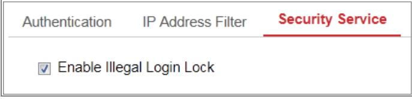

Security Service

### 2. Check the checkbox of **Enable Illegal Login Lock**.

Illegal Login Lock: it is used to limit the user login attempts. Login attempt from the IP address is rejected if admin user performs 7 failed user name/password attempts (5 times for the operator/user).

*Note:* If the IP address is rejected, you can try to login the device after 30 minutes.

### *Purpose:*

Advanced security offers options to manage more network security settings of the device.

### **Security Reinforce**

Check the checkbox to enable the function. Security reinforce is a solution to enhance network security. With the function enabled, risky functions, protocols, ports of the device are disabled and more secured alternative functions, protocols and ports are enabled.

### **Control Timeout Settings**

If you enable the function and set timeout period, you will be logged out when

you make no operation to the device via web browser (Viewing live image and playback are not included.) for the set timeout period.

### **Algorithm**

Displays the currently active digest algorithm. If Security Reinforce is enabled, MD5 is disabled and SHA256 is enabled instead.

### **As Administrator**

- The admin user can add, delete or modify user accounts, and grant them different permissions. We highly recommend you manage the user accounts and permissions properly.
Enter the User Management interface: **Configuration** > **System** > **User Management**

### *Note:*

Admin password if required for adding and modifying a user account.

| User Management | Online Users |                                                          |
|-----------------|--------------|----------------------------------------------------------|
| User List       | Add          | Account Security Settings Modify Delete General |
| No.             | User Name    | Level                                                    |
|                 | admin        | Administrator                                            |

User Management Interface

### **Adding a User**

The *admin* user has all permissions by default and can create/modify/delete

other accounts.

The *admin* user cannot be deleted and you can only change the *admin* password.

- 1. Click **Add** to add a user.
- 2. Input the **Admin Password**, **User Name**, select **Level** and input **Password.**
### *Notes:*

- Up to 31 user accounts can be created.
- Users of different levels own different default permissions. Operator and user are selectable.

**STRONG PASSWORD RECOMMENDED***–*We highly recommend you create a strong password of your own choosing (using a minimum of 8 characters, including at least three of the following categories: upper case letters, lower case letters, numbers, and special characters) in order to increase the security of your product. And we recommend you reset your password regularly, especially in the high security system, resetting the password monthly or weekly can better protect your product.

- 3. You can check or uncheck the permissions for the new user.
- 4. Click **OK** to finish the user addition.
- **Modifying a User**

### *Steps:*

- 1. Left-click to select the user from the list and click **Modify**.
- 2. Modify the **User Name**, **Level** and **Password**.

**STRONG PASSWORD RECOMMENDED***–*We highly recommend you create a strong password of your own choosing (using a minimum of 8 characters, including at least three of the following categories: upper case letters, lower case letters, numbers, and special characters) in order to increase the security of your product. And we recommend you reset your password regularly, especially in the high security system, resetting the password monthly or weekly can better protect your product.

- 3. You can check or uncheck the permissions.
- 4. Click **OK** to finish the user modification.
- **Deleting a User**

- 1. Click to select the user you want to delete and click **Delete**.
- 2. Click **OK** on the pop-up dialogue box to confirm the deletion.
- **Setting Simultaneous Login**

*Steps:*

- 1. Click **General**.
- 2. Slide the slide bar to set the simultaneous login. If the number of the illegal login attempts exceeds the set threshold, your access will be denied.

### **As Operator or User**

Operator or user can modify password. Old password is required for this action.

### *Purpose:*

Security question is used to recover the admin password when admin user forgets the password. Recovering the password via the security questions and via the email are available.

*Note*: Only certain camera models support the function.

### **Set Account Security:**

You can set the security questions during camera activation. Or you can set the function at user management interface.

Security question setting is not cleared when you restore the camera (not to default).

### *Steps:*

- 1. Enter setting interface:
### **Configuration > System > User Management > User Management**

- 2. Click **Account Security Settings.**
- 3. Select questions and input answers.
- 4. Enter the E-mail address to receive the verification code for password recovery.
- 5. Click **OK** to save the settings.

### **Reset Admin Password:**

### *Before you start:*

The PC used to reset password and the camera should belong to the same IP address segment of the same LAN.

### *Steps:*

- 1. Enter login interface via web browser.
- 2. Click **Forget Password**.
- 3. Select the verification mode to **E-mail Verification**.
- 4. Read the Privacy Policy and click **OK**.
- 5. Click **Export QR Code** and save the code to local.
- 6. Send the code to pw_recovery@device-service.com as an attachment. Your email account for password recovery will receive a verification code in 5 minutes.

*Note:*

The verification code is valid within 48 hours.

- 7. Input the verification code in the text field below.

|                       | 2                                                                                                              |                                                         | 3                                                                                                 |  |
|-----------------------|----------------------------------------------------------------------------------------------------------------|---------------------------------------------------------|---------------------------------------------------------------------------------------------------|--|
| Verify Identification | Set New Password                                                                                               |                                                         | Complete                                                                                          |  |
| Verification Mode     | E-mail Verification                                                                                            |                                                         |                                                                                                   |  |
|                       |                                                                                                                |                                                         |                                                                                                   |  |
|                       |                                                                                                                |                                                         |                                                                                                   |  |
|                       |                                                                                                                |                                                         |                                                                                                   |  |
|                       |                                                                                                                |                                                         |                                                                                                   |  |
|                       |                                                                                                                |                                                         |                                                                                                   |  |
|                       | Export QR Code                                                                                                 |                                                         |                                                                                                   |  |
|                       | 1. Click Export QR Code and save the code to local. 3. Input the verification code in the text field below. | recovery will receive a verification code in 5 minutes. | 2. Send the code to pw_recovery@device-service.com as an attachment. Your email account for passw |  |
|                       | Verification Code                                                                                              |                                                         |                                                                                                   |  |

Reset Password

- 8. Click **Next**.
- 9. Input the password and confirm.
- 10. Follow the instructions to create a new password.

### *Note:*

- User IP address is locked for 30 minutes after 7 failed attempts of answering security questions.
- Only certain camera models support the function.
### *Purpose:*

You can see the current users who are visiting the device through this interface. User information, such as user name, level, IP address, and operation time, is displayed in the User List.

Click **Refresh** to refresh the list.

| User Management | Online Users |               |             |                     |
|-----------------|--------------|---------------|-------------|---------------------|
|                 |              |               |             |                     |
| User List       |              |               |             | Refresh             |
| No.             | User Name    | Level         | IP Address  | User Operation Time |
| 1               | admin        | Administrator | 10.16.2.101 | 2015-11-16 10:57:55 |
|                 |              |               |             |                     |

View the Online Users

## **Chapter 7 Network Settings**

### *Purpose:*

Follow the instructions in this chapter to configure the basic settings and advanced settings.

### *Purpose:*

You can configure the parameters, including TCP/IP, DDNS, PPPoE, Port, and NAT, etc., by following the instructions in this section.

### *Purpose:*

TCP/IP settings must be properly configured before you operate the camera over network. The camera supports both the IPv4 and IPv6. Both versions can be configured simultaneously without conflicting to each other, and at least one IP version should be configured.

### *Steps:*

1. Enter TCP/IP Settings interface: **Configuration > Network > Basic Settings > TCP/IP** 

| NIC Type             | Auto                       |                          |
|----------------------|----------------------------|--------------------------|
|                      | DHCP D                  |                          |
| IPv4 Address         | 10.11.37.120               | Test                     |
| IPv4 Subnet Mask     | 255.255.255.0              |                          |
| IPv4 Default Gateway | 10.11.37.254               |                          |
| IPv6 Mode            | Route Advertisement        | View Route Advertisement |
| IPv6 Address         |                            |                          |
| IPv6 Subnet Mask     | 0                          |                          |
| IPv6 Default Gateway |                            |                          |
| Mac Address          | c0:56:e3:60:27:5d          |                          |
| MTU                  | 1500                       |                          |
| Multicast Address    |                            |                          |
|                      | Enable Multicast Discovery |                          |
| DNS Server           |                            |                          |
| Preferred DNS Server | 8.8.8.8                    |                          |
| Alternate DNS Server |                            |                          |
|                      |                            |                          |
| Save                 |                            |                          |

- 2. Configure the basic network settings, including the NIC Type, IPv4 or IPv6 Address, IPv4 or IPv6 Subnet Mask, IPv4 or IPv6 Default Gateway, MTU settings and Multicast Address.
- 3. (Optional) Check the checkbox of **Enable Multicast Discovery**, and then the online network camera can be automatically detected by client software via private multicast protocol in the LAN.
- 4. Configure the DNS server. Input the preferred DNS server, and alternate DNS server.
- 5. Click **Save** to save the above settings.

### *Notes***:**

- The valid value range of MTU is 1280 to 1500.
- The Multicast sends a stream to the multicast group address and allows multiple clients to acquire the stream at the same time by requesting a copy from the multicast group address. Before utilizing this function, you have to enable the

Multicast function of your router.

- A reboot is required for the settings to take effect.
### *Purpose:*

If your camera is set to use PPPoE as its default network connection, you can use the Dynamic DNS (DDNS) for network access.

### *Before you start***:**

Registration on the DDNS server is required before configuring the DDNS settings of the camera.

### *Steps:*

- 1. Enter the DDNS Settings interface: **Configuration > Network > Basic Settings > DDNS**.
- 2. Check the **Enable DDNS** checkbox to enable this feature.
- 3. Select **DDNS Type**. Two DDNS types are selectable: DynDNS and NO-IP.
	- DynDNS:

- (1)Enter **Server Address** of DynDNS (e.g. members.dyndns.org).
- (2)In the **Domain** text field, enter the domain name obtained from the DynDNS website.
- (3)Enter the **User Name** and **Password** registered on the DynDNS website.
- (4)Click **Save** to save the settings.

| DDNS Type      | DynDNS             |  |
|----------------|--------------------|--|
| Server Address | members dyndns.org |  |
| Domain         | 123.dyndns.com     |  |
| User Name      | test               |  |
| Port           | 0                  |  |
| Password       |                    |  |
| Confirm        |                    |  |
|                |                    |  |

Figure 7-2 DynDNS Settings

- NO-IP:
### *Steps:*

(1) Choose the DDNS Type as NO-IP.

| DDNS Type      | NO-IP        |  |
|----------------|--------------|--|
| Server Address | www.noip.com |  |
| Domain         |              |  |
| User Name      |              |  |
| Port           | 0            |  |
| Password       |              |  |
| Confirm        |              |  |
|                |              |  |

Figure 7-3 NO-IP DNS Settings

- (2) Enter the Server Address as www.noip.com
- (3) Enter the Domain name you registered.
- (4) Enter the User Name and Password.
- (5) Click **Save** and then you can view the camera with the domain name.

- 1. Enter the PPPoE Settings interface: **Configuration > Network > Basic Settings >**
### **PPPoE**

| Dynamic IP | 0.0.0.0 |  |
|------------|---------|--|
| User Name  |         |  |
| Password   |         |  |
| Confirm    |         |  |
|            |         |  |

### PPPoE Settings

- 2. Check the **Enable PPPoE** checkbox to enable this feature.
- 3. Enter **User Name**, **Password**, and **Confirm** password for PPPoE access.

*Note:* The User Name and Password should be assigned by your ISP.

- *For your privacy and to better protect your system against security risks, we strongly recommend the use of strong passwords for all functions and network devices. The password should be something of your own choosing (using a minimum of 8 characters, including at least three of the following categories: upper case letters, lower case letters, numbers and special characters) in order to increase the security of your product.*
- *Proper configuration of all passwords and other security settings is the responsibility of the installer and/or end-user.*
- 4. Click **Save** to save and exit the interface.

*Note***:** A reboot is required for the settings to take effect.

### *Purpose:*

You can set the port No. of the camera, e.g., HTTP port, RTSP port and HTTPS port.

- 1. Enter the Port Settings interface, **Configuration > Network > Basic Settings > Port**
- 2. Set the ports of the camera.
**HTTP Port**: The default port number is 80, and it can be changed to any port No. that is not occupied.

**RTSP Port:** The default port number is 554 and it can be changed to any port No. ranges from 1 to 65535.

**HTTPS Port:** The default port number is 443, and it can be changed to any port No. that is not occupied.

**Server Port:** The default server port number is 8000, and it can be changed to any port No. ranges from 2000 to 65535.

**Enhanced SDK Service Port**: The default server number is 8443. It refers to the port through which the client adds the device. Certificate verification is required to ensure the secure access.

### *Note:*

When you use client software to visit the camera and you have changed the server port number, you have to input the correct server port number in login interface to access to the camera.

**WebSocket Port:** The default port number is 7681. It can be changed to any port No. ranges from 1 to 65535.

**WebSockets Port:** The default server port number is 7682. It can be changed to any port No. ranges from 1 to 65535.

### *Note:*

WebSocket and WebSockets protocol are used for plug-in free live view. For detailed information, see *7.2.11 Network Service.*

- 3. Click **Save** to save the settings.
### *Purpose:*

NAT interface allows you to configure the UPnP™ parameters.

Universal Plug and Play (UPnP™) is a networking architecture that provides

compatibility among networking equipment, software and other hardware devices. The UPnP protocol allows devices to connect seamlessly and to simplify the implementation of networks in the home and corporate environments.

With the function enabled, you don't need to configure the port mapping for each port, and the camera is connected to the Wide Area Network via the router.

| Enable UPnP™ তি। Friendly Name | TestCam       | 0                   |               |           |
|--------------------------------------|---------------|---------------------|---------------|-----------|
| Port Mapping Mode                    | Auto          | ♪                   |               |           |
| Port Type                            | External Port | External IP Address | Internal Port | Status    |
| HTTP                                 | 80            | 0.0.0.0             | 80            | Not Valid |
| RTSP                                 | 554           | 0.0.0.0             | 554           | Not Valid |
| Server Port                          | 8000          | 0.0.0.0             | 8000          | Not Valid |
| WEBSOCKET                            | 7681          | 0.0.0.0             | 7681          | Not Valid |
| WEBSOCKETS                           | 7682          | 0.0.0.0             | 7682          | Not Valid |

### UPnP Settings

### *Steps:*

- 1. Enter the NAT settings interface. **Configuration > Network > Basic Settings > NAT.**
- 2. Check the checkbox to enable the UPnP™ function.

### *Note:*

Only when the UPnP™ function is enabled, ports of the camera are active.

- 3. Choose a friendly name for the camera, or you can use the default name.
- 4. Select the port mapping mode. Manual and Auto are selectable.

### *Note:*

If you select Auto, you should enable UPnP™ function on the router.

If you select Manual, you can customize the value of the external port and complete port mapping settings on router manually.

- 5. Click **Save** to save the settings.
### *Purpose:*

Multicast is group communication where data transmission is addressed to a group of destination devices simultaneously. After setting up active multicast, you can send the source efficiently to multiple devices.

| IP Address  | 0.0.0.0          |   |
|-------------|------------------|---|
| Stream Type | Main Stream > |   |
| Video Port  | 8860             |   |
| Audio Port  | 8862             |   |
| FEC Port    | 8960             |   |
| FEC Ratio   | 0                | % |
|             |                  |   |
| Save        |                  |   |

*Note:* Only certain camera models support this function.

Setting Multicast

### *Steps:*

- 1. Enter the Multicast setting interface.
### **Configuration** > **Network** > **Basic Settings** > **Multicast**

- 2. Set IP Address, Stream Type, Video Port, Audio Port, FEC Port and FEC Ratio of the camera.
### *Notes:*

- **•** IP Address stands for the address of multicast.
- **•** Video port and audio port of each video stream of each camera channel can be specified by selecting a stream in Video Stream and inputting port number in Video Port and Audio Port.
- 3. Click **Save**.

### *Purpose:*

You can configure the parameters, including SNMP, FTP, Email, HTTPS, QoS, 802.1x,

etc., by following the instructions in this section.

### *Purpose:*

You can set the SNMP function to get camera status, parameters and alarm related information, and manage the camera remotely when it is connected to the network.

### *Before you start:*

Before setting the SNMP, please download the SNMP software and manage to receive the camera information via SNMP port. By setting the Trap Address, the camera can send the alarm event and exception messages to the surveillance center.

*Note:* The SNMP version you select should be the same as that of the SNMP software. And you need to use the different version according to the security level you required. SNMP v1 provides no security and SNMP v2 requires password for access. And SNMP v3 provides encryption and if you use the third version, HTTPS protocol must be enabled.

- *For your privacy and to better protect your system against security risks, we strongly recommend the use of strong passwords for all functions and network devices. The password should be something of your own choosing (using a minimum of 8 characters, including at least three of the following categories: upper case letters, lower case letters, numbers and special characters) in order to increase the security of your product.*
- *Proper configuration of all passwords and other security settings is the responsibility of the installer and/or end-user.*

### *Steps:*

1. Enter the SNMP Settings interface: **Configuration > Network > Advanced Settings > SNMP**.

| Enable SNMPv1 国       |                  |  |
|--------------------------|------------------|--|
| Enable SNMP v2c 1     |                  |  |
| Read SNMP Community      | public           |  |
| Write SNMP Community     | private          |  |
| Trap Address             |                  |  |
| Trap Port                | 162              |  |
| Trap Community           | public           |  |
| SNMP v3                  |                  |  |
| Enable SNMPv3            |                  |  |
| Read UserName            |                  |  |
| Security Level           | no auth, no priv |  |
| Authentication Algorithm | @ MD5 SHA        |  |
| Authentication Password  |                  |  |
| Private-key Algorithm    | @ DES AES        |  |
| Private-key password     |                  |  |
| Write UserName           |                  |  |
| Security Level           | no auth, no priv |  |
| Authentication Algorithm | MD5 C SHA        |  |
| Authentication Password  |                  |  |
| Private-key Algorithm    | @ DES AES        |  |
| Private-key password     | 00000            |  |
| SNMP Other Settings      |                  |  |
| SNIMP Port               | 161              |  |
|                          |                  |  |

SNMP Settings

2. Check **Enable SNMPv1**, **Enable SNMP v2c**, **Enable SNMPv3** to enable the feature correspondingly.

- 3. Configure the SNMP settings.
*Note:* The settings of the SNMP software should be the same as the settings you configure here.

- 4. Click **Save** to save and finish the settings.
### *Note***:**

To lower the risk of information leakage, you are suggested to enable SNMP v3 instead of SNMP v1 or v2.

### *Purpose:*

You can configure the FTP/SFTP server related information to enable the uploading of the captured pictures to the FTP/SFTP server. The captured pictures can be triggered by events or a timing snapshot task.

- 1. Enter the FTP Settings interface: **Configuration > Network > Advanced Settings > FTP**.

| FTP Protocol            | FTP                        | >           |
|-------------------------|----------------------------|-------------|
| Server Address          | 0.0.0.0                    |             |
| Port                    | 21                         |             |
| User Name               |                            | Anonymous   |
| Password                |                            |             |
| Confirm                 |                            |             |
| Directory Structure     | Save in the root directory | >           |
| Picture Filing Interval | OFF                        | Day(s) > |
| Picture Name            | Default                    | >           |
|                         | Upload Picture             |             |
|                         | Test                       |             |
|                         |                            |             |
| 름 Save               |                            |             |

FTP Settings

- 2. Select the FTP protocol.
- 3. Input the server address and port.
- 4. Configure the FTP/SFTP settings; and the user name and password are required

for the FTP server login.

- *For your privacy and to better protect your system against security risks, we strongly recommend the use of strong passwords for all functions and network devices. The password should be something of your own choosing (using a minimum of 8 characters, including at least three of the following categories: upper case letters, lower case letters, numbers and special characters) in order to increase the security of your product.*
- *Proper configuration of all passwords and other security settings is the responsibility of the installer and/or end-user.*
- 5. Set the directory structure and picture filing interval.

**Directory**: In the **Directory Structure** field, you can select the root directory, parent directory and child directory. When the parent directory is selected, you have the option to use the Device Name, Device Number or Device IP for the name of the directory; and when the Child Directory is selected, you can use the Camera Name or Camera No. as the name of the directory.

**Picture Filing Interval:** For better picture management, you can set the picture filing interval from 1 day to 30 days. Pictures captured in the same time interval will be saved in one folder named after the beginning date and ending date of the time interval.

**Picture Name:** Set the naming rule for captured picture files. You can choose **Default** in the drop-down list to use the default rule, that is,

*IP address_channel number_capture time_event type.jpg*

(e.g., *10.11.37.189_01_20150917094425492_FACE_DETECTION.jpg*).

Or you can customize it by adding a **Custom Prefix** to the default naming rule.

- 6. Check the Upload Picture checkbox to enable the function.
**Upload Picture:** To enable uploading the captured picture to the FTP server. **Anonymous Access to the FTP Server (in which case the user name and password won't be required.):** Check the **Anonymous** checkbox to enable the anonymous access to the FTP server.

*Note:* The anonymous access function must be supported by the FTP server.

- 7. Click **Save** to save the settings.
### *Purpose:*

The system can be configured to send an Email notification to all designated receivers if an alarm event is detected, e.g., motion detection event, video loss, video tampering, etc.

### *Before you start:*

Please configure the DNS Server settings under **Configuration > Network > Basic** 

**Settings > TCP/IP** before using the Email function.

### *Steps:*

- 1. Enter the TCP/IP Settings (**Configuration > Network > Basic Settings > TCP/IP**) to set the IPv4 Address, IPv4 Subnet Mask, IPv4 Default Gateway and the Preferred DNS Server.
*Note:* Please refer to 7.1.1 Configuring TCP/IP Settings for detailed information.

- 2. Enter the Email Settings interface: **Configuration** > **Network** >**Advanced Settings** > **Email**.
- 3. Configure the following settings:

**Sender:** The name of the email sender.

**Sender's Address:** The email address of the sender.

**SMTP Server:** IP address or host name (e.g., smtp.263xmail.com) of the SMTP Server.

**SMTP Port:** The SMTP port. The default TCP/IP port for SMTP is 25 (not secured). And the SSL SMTP port is 465.

**Email Encryption:** None, SSL, and TLS are selectable. When you select SSL or TLS and disable STARTTLS, e-mails will be sent after encrypted by SSL or TLS. The SMTP port should be set as 465 for this encryption method. When you select SSL or TLS and enable STARTTLS, emails will be sent after encrypted by STARTTLS, and the SMTP port should be set as 25.

*Note:* If you want to use STARTTLS, make sure that your e-mail server supports the protocol. If you check the Enable STARTTLS checkbox when the protocol is not supported by your e-mail sever, your e-mail will not be encrypted.

**Attached Image:** Check the checkbox of Attached Image if you want to send emails with attached alarm images.

**Interval:** The interval refers to the time between two actions of sending attached pictures.

**Authentication** (optional): If your email server requires authentication, check this checkbox to use authentication to log in to this server and input the login user name and password.

- *For your privacy and to better protect your system against security risks, we strongly recommend the use of strong passwords for all functions and network devices. The password should be something of your own choosing (using a minimum of 8 characters, including at least three of the following categories: upper case letters, lower case letters, numbers and special characters) in order to increase the security of your product.*
- *Proper configuration of all passwords and other security settings is the responsibility of the installer and/or end-user.*

The **Receiver** table**:** Select the receiver to which the email is sent. Up to 3 receivers can be configured.

**Receiver:** The name of the user to be notified.

**Receiver's Address**: The email address of user to be notified.

| Sender              | test           |                    |      |
|---------------------|----------------|--------------------|------|
| Sender's Address    | test@gmail.com |                    |      |
| SMTP Server         |                |                    |      |
| SMTP Port           | 25             |                    |      |
| E-mail Encryption   | None           | >                  |      |
| Attached Image D |                |                    |      |
| Interval            | 2              | s S                |      |
| Authentication D |                |                    |      |
| User Name           |                |                    |      |
| Password            |                |                    |      |
| Confirm             |                |                    |      |
| Receiver            |                |                    |      |
| No.                 | Receiver       | Receiver's Address | Test |
|                     |                |                    | Test |
| 1                   |                |                    |      |
| 2                   |                |                    |      |
| 3                   |                |                    |      |
|                     |                |                    |      |
|                     |                |                    |      |

### Email Settings

- 4. Click **Save** to save the settings.
### *Purpose:*

Platform access provides you an option to manage the devices via platform.

### *Steps:*

- 1. Enter the **Platform Access** settings interface: **Configuration > Network > Advanced Settings > Platform Access**
- 2. Check the checkbox of Enable to enable the platform access function of the device.
- 3. Select the Platform Access Mode.

*Note:* Hik-Connect is an application for mobile devices. With the App, you can view live image of the camera, receive alarm notification and so on.

If you select Platform Access Mode as Hik-Connect,

- 1) Click and read "Terms of Service" and "Privacy Policy" in pop-up window.
- 2) Create a verification code or change the verification code for the camera.
*Note:* 

- **•** The verification code is required when you add the camera to Hik-Connect app.
- **•** For more information about the Hik-Connect app, refer to Hik-Connect Mobile Client User Manual.
- 3) You can use the default server address. Or you can check the Custom checkbox on the right and input a desired server address.

If you select Platform Access Mode as ISUP,

- 1) Check **Enable**.
- 2) Enter the Server Address, Port, Device ID, and Key.
- 4. Click **Save** to save the settings.

### *Purpose:*

Data stream of audio, video and image can be transferred via 3G/4G wireless network.

### *Notes:*

- **•** The wireless dial function may not be supported by some camera models.
- **•** Camera that supports wireless dial does not support PPPoE.

- 1. Click **Wireless Dial** tab to enter the Wireless Dial configuration interface: **Configuration > Network > Advanced Settings > Wireless Dial**
- 2. Check the checkbox to enable the wireless dial settings.
- 3. Configure the dial parameters.
	- 1) Select the dial mode from the drop-down list. Auto and Manual are selectable. If Auto is selected, you can set the arming schedule for dialing; If Manual is selected, you can set the offline time and manual dialing parameters.
	- 2) Set the access number, user name, password, APN, MTU and verification protocol. You can also leave these parameters blank, and the device will adopt

the default settings for dialing after other parameters are configured.

- 3) Select the network mode from the drop-down list. Auto, 3G and 4G are selectable. If Auto is selected, the network selection priority comes as: 4G > 3G > Wired Network.
- 4) Input the offline time if Manual is selected as the dial mode.
- 5) Input the UIM Number (Mobile Phone Number).
- 6) Click the Edit button to set the arming schedule if Auto is selected as the dial mode.
- 7) Click **Save** to save the settings.
- 4. View the dial status.
	- 1) Click the Refresh button to view the dial status including real-time mode, UIM status, signal strength, etc.
	- 2) If Manual is selected as the dial mode, you can also manually connect / disconnect the wireless network.
- 5. Set the white list. The mobile phone number on the white list can receive the alarm message from the device and reboot the device via SMS.
	- 1) Check **Enable SMS Alarm**.
	- 2) Select the item on the white list, and click **Edit**.
	- 3) Enter the mobile phone number for the white list, check the checkbox of **Reboot via SMS**, select the alarm for SMS push, and click **OK**.

*Note:* To reboot the device via SMS, send the message "reboot" to the device, and the device will reply a message "reboot success" after rebooting succeeded.

- 4) (Optional) You can click **Send Test SMS** to send a message to the mobile phone for test.
- 5) Click **Save** to save the settings.

*Purpose:*

HTTPS provides authentication of the web site and its associated web server, which protects against Man-in-the-middle attacks.

### *Note:*

- For the camera that supports plug-in free live view, when you use HTTPS to visit the camera, you should enable **Websockets** for live view. Go to **Configuration > Network > Advanced Settings > Network Service**.
- If HTTPS is enabled by default, the camera creates an unsigned certificate automatically. When you visit the camera via HTTPS, the web browser will send a notification about the certificate issue. Install a signed-certificate to the camera to cancel the notification.

- 1. Enter the HTTPS settings interface. **Configuration > Network > Advanced Settings > HTTPS**.
- 2. Check **Enable** to access the camera via HTTP or HTTPS protocol.
- 3. Check **Enable HTTPS Browsing** to access the camera only via HTTPS protocol.

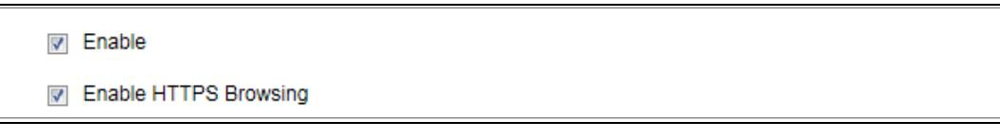

- 4. Create the self-signed certificate or authorized certificate.
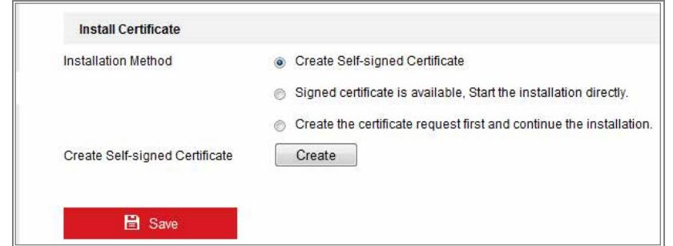

Create Self-signed Certificate

- Create the self-signed certificate
- (1) Select **Create Self-signed Certificate** as the Installation Method.
- (2) Click **Create** button to enter the creation interface.
- (3) Enter the country, host name/IP, validity and other information.
- (4) Click **OK** to save the settings.

*Note:* If you already had a certificate installed, the Create Self-signed Certificate is grayed out.

- Create the request and import the authorized certificate
- (1) Select **Create the certificate request first and continue the installation** as the Installation Method.
- (2) Click **Create** button to create the certificate request. Fill in the required information in the popup window.
- (3) Click **Download** to download the certificate request and submit it to the trusted certificate authority for signature.
- (4) After receiving the signed valid certificate, you can import the certificate in two ways:
	- a) Select **Signed certificate is available, Start the installation directly**. Click **Browse** and **Install** to import the certificate to the device.

| Install Certificate        |                                                                          |        |         |
|----------------------------|--------------------------------------------------------------------------|--------|---------|
| Installation Method        | Create Self-signed Certificate                                           |        |         |
|                            | · Signed certificate is available, Start the installation directly.      |        |         |
|                            | Create the certificate request first and continue the installation. 0 |        |         |
| Install Signed Certificate |                                                                          | Browse | Install |
|                            |                                                                          |        |         |
| Save                       |                                                                          |        |         |

Import the Certificate (1)

- b) Select **Create the certificate request first and continue the installation**.
Click **Browse** and **Install** to import the certificate to the device.

| Install Certificate           |                                                                        |
|-------------------------------|------------------------------------------------------------------------|
| Installation Method           | Create Self-signed Certificate C                                    |
|                               | Signed certificate is available, Start the installation directly. O |
|                               | · Create the certificate request first and continue the installation.  |
| Create Certificate Request    | C=CN, H/IP=10.11.11.111 Create                                      |
| Download Certificate Request  | Download                                                               |
| Delete Certificate Request    | Delete                                                                 |
| Install Generated Certificate | Install Browse                                                      |

### Import the Certificate (2)

- 5. There will be the certificate information after your successfully creating and installing the certificate.

| SAFM MILT C Installed Certificate | C=CN, ST=ZJ, L=HZ, OU=embeddedsofteware, H/IP=10.                                                                                                                                                                                     | Delete |
|--------------------------------------|---------------------------------------------------------------------------------------------------------------------------------------------------------------------------------------------------------------------------------------|--------|
| Property                             | Subject: C=CN, ST=ZJ, L=HZ, OU=embeddedsofteware, H/IP=10.13.33.209, EM=com.cn Issuer: C=CN, ST=ZJ, L=HZ, OU=embeddedsofteware, H/IP=10.13.33.209, EM=com.cn Validity: 2015-04-29 14:25:24 ~ 2018-04-28 14:25:24 |        |
|                                      |                                                                                                                                                                                                                                       |        |

Installed Certificate

- 6. Export and save the certificate for verification when adding the device to client software.
*Note:*

The exported certificate should be saved in the certificate folder of your client software before adding the device to your PC client.

- 7. Click the **Save** button to save the settings.
### *Purpose:*

QoS (Quality of Service) can help solve the network delay and network congestion by configuring the priority of data sending.

- 1. Enter the QoS Settings interface: **Configuration > Network > Advanced Settings >**

QoS Settings

- 2. Configure the QoS settings, including Video/Audio DSCP, Event/Alarm DSCP and Management DSCP.
The valid value range of the DSCP is 0 to 63. The bigger the DSCP value is, the higher the priority is.

*Note:* DSCP refers to the Differentiated Service Code Point; and the DSCP value is used in the IP header to indicate the priority of the data.

- 3. Click **Save** to save the settings.
### *Purpose:*

The IEEE 802.1X standard is supported by the network cameras, and when the feature is enabled, the camera data is secured and user authentication is needed when connecting the camera to the network protected by the IEEE 802.1X.

### *Before you start:*

The authentication server must be configured. Please apply and register a user name and password for 802.1X in the server.

- *For your privacy and to better protect your system against security risks, we strongly recommend the use of strong passwords for all functions and network devices. The password should be something of your own choosing (using a minimum of 8 characters, including at least three of the following categories:*
*upper case letters, lower case letters, numbers and special characters) in order to increase the security of your product.*

- *Proper configuration of all passwords and other security settings is the responsibility of the installer and/or end-user.*
### *Steps:*

- 1. Enter the 802.1X Settings interface, **Configuration > Network > Advanced Settings > 802.1X.**

| Enable IEEE 802.1X ア |         |
|-------------------------|---------|
| Protocol                | EAP-MD5 |
| EAPOL version           | 1       |
| User Name               |         |
| Password                |         |
| Confirm                 |         |
|                         |         |
| 글 Save                  |         |

802.1X Settings

- 2. Check the **Enable IEEE 802.1X** checkbox to enable the feature.
- 3. Configure the 802.1X settings, including Protocol, EAPOL version, User Name, Password and Confirm.

*Note:* The **EAPOL version** must be identical with that of the router or the switch.

- 4. Enter the user name and password to access the server.
- 5. Click **Save** to finish the settings.

*Note***:** A reboot is required for the settings to take effect.

### *Purpose:*

If you need to access to the camera through the third party platform, you can enable CGI function. And if you need to access to the device through ONVIF protocol, you can configure ONVIF user in this interface. Refer to ONVIF standard for detailed configuration rules.

*Note:* Integration protocol function varies according to different device model.

**CGI**

Check the Enable Hikvision_CGI checkbox and then select the authentication from the drop-down list.

*Note:* Digest is the recommended authentication method.

**ONVIF**

*Steps:*

- 1. Check Enable ONVIF to enable the function.
- 2. Add ONVIF users. Up to 32 users are allowed.

Set the user name and password, and confirm the password. You can set the user as media user, operator, and administrator.

*Note:* ONVIF user account is different from the camera user account. You have set ONVIF user account independently.

- 3. Save the settings.
*Note:* User settings of ONVIF are cleared when you restore the camera.

When you enable the function, live view fluency is taken as the priority of camera performance. The camera adjusts video-related parameters automatically, and the pre-set video-related configuration is invalid. A reboot is required for the function to take effect.

*Note:* Bandwidth adaptation is only available for certain camera models.

You can control the ON/OFF status of certain protocol that the camera supports.

### *Note:*

- **•** Keep unused function OFF for security concern.
- **•** Only certain camera models support the function.

### **WebSocket** and **WebSockets**

WebSocket or WebSockets protocol should be enabled if you use Google Chrome 45

and its above version or Mozilla Firefox 52 and its above version to visit your camera.

Otherwise, live view, image capture, and digital zoom function cannot be used.

If the camera uses HTTP, enable **WebSocket**.

If the camera uses HTTPS, enable **WebSockets**.

### **SDK Service** and **Enhanced SDK Service**

If you want to add the device to the client software, you should enable SDK Service or Enhanced SDK Service.

**SDK Service:** SDK protocol is used.

**Enhanced SDK Service:** SDK over TLS protocol is used. Communication between the device and the client software is secured by using TLS (Transport Layer Security) protocol.

### **TLS (Transport Layer Security)**

The device offers TLS 1.1 and TLS 1.2. Enable one or more protocol versions according to your need.

### *Purpose:*

When the network is unstable or high quality of video is required, you can enable Smooth Streaming function to view the live view smoothly via the client software or Web Browser.

*Note*: Only certain camera models support the function.

### *Before you start:*

Add the device to your client software and select **NPQ** protocol in client software before configuring the smooth streaming function.

- 1. Enter the Smooth Streaming Settings interface, **Configuration > Network > Advanced Settings > Smooth Streaming.**

| Stream Type             | Third Stream | V |  |  |
|-------------------------|--------------|---|--|--|
| Enable Smooth Streaming |              |   |  |  |
| Mode                    | Auto         | V |  |  |
|                         |              |   |  |  |
|                         |              |   |  |  |

Smooth Streaming Settings

- 2. Select **Stream Type.**
- 3. Check **Enable Smooth Streaming**.

*Note:* Be sure the **Bitrate Type** is selected as **Constant** and the **SVC** is selected as **OFF** before enable this function. Go to **Configuration > Video/Audio > Video** page to set the parameters.

- 4. Select the mode of smooth streaming. There are three modes selectable: **Auto, Resolution Priority**, and **Error Correction.**
**Auto**: The resolution and bitrate will be adjusted automatically and resolution will take the priority, the upper limits of these two parameters will not exceed the values you set on Video page. Go to **Configuration > Video/Audio > Video** page, set the **Resolution** and **Max. Bitrate** before you enable smooth streaming function. And in this mode, the framerate will be adjusted automatically to max. value.

**Resolution Priority**: The resolution stays the same as the set value in Vid eo page, and the bitrate will be adjusted automatically. Go to **Configurati on > Video/Audio > Video** page, set the **Max. Bitrate** before you enable smooth streaming function. And in this mode the framerate will be adjust ed automatically to max. value.

**Error Correction:** The resolution and bitrate stay the same as the set values in Video page. When the bandwidth is sufficient, there is packet loss or bit error during transmission and these situations will lead to the video data error or loss. This mode is used to correct the data error during transmission. You can configure the error correction proportion within range of 0-100. When the proportion is 0, the data error will be corrected by data retransmission. When the proportion is higher than 0, the error data will be corrected via redundant data that is added to the stream and data retransmission. The higher the value is, the more redundant date will be generated, the more data error will be corrected, and the larger bandwidth is required. When the proportion is 100, the redundant data will be as large as the original data, and the bandwidth is twice required.

*Note:* Be sure the bandwidth is sufficient in Error Correction mode.

- 5. Click **Save** to save the settings.
### *Purpose:*

The camera can send alarm information to the destination IP or host name via HTTP, HTTPS, or ISUP protocol. If the network is disconnected, the data can be uploaded to the destination IP or host name after the network connection is normal.

### *Before you start:*

The destination IP or host name should support the HTTP, HTTPS, or ISUP protocol to receive the alarm information.

### *Steps:*

- 1. Enter the HTTP Listening interface, **Configuration > Network > Advanced Settings > Security Control Panel Configuration.**

| HTTP Data Transmission Default |     |          |      |      |
|-----------------------------------|-----|----------|------|------|
| Destination IP or Host Name       | URL | Protocol | Port | Test |
| 0.0.0.0                           |     | HTTP     | 80   | Test |
| 0.0.0.0                           |     | HTTP     | 80   | Test |
| 0.0.0.0                           |     | HTTP     | 80   | Test |

### Figure 7-18 HTTP Listening

- 2. Enter the desired destination IP or host name, URL and port.
- 3. You can click **Test** to test whether the entered IP address or host name are valid.
- 4. Or you can click **Default** to reset the destination IP or host name.

*Note*: Only certain camera models support the function.

## **Chapter 8 Video/Audio Settings**

### *Purpose:*

Follow the instructions below to configure the video setting, audio settings, ROI, Display info. on Stream, etc.

For certain camera models, you can configure parameters for available video streams, for example, the main stream, the sub-stream, etc. And you can also customize additional video streams for further needs.

- **•** On **Video** page, set-up available video streams.
- **•** On **Custom Video** page, add extra video streams

- 1. Enter the Video Settings interface, **Configuration > Video/Audio > Video**

| Stream Type      | Main Stream(Normal) |          |
|------------------|---------------------|----------|
| Video Type       | Video Stream        |          |
| Resolution       | 3840*2160           |          |
| Bitrate Type     | Variable            |          |
| Video Quality    | Medium              |          |
| Frame Rate       | 25                  | fps      |
| Max. Bitrate     | 16384               | Kops &   |
| Video Encoding   | H.264               |          |
| H.264+           | OFF                 |          |
| Profile          | Basic Profile       |          |
| I Frame Interval | 25                  |          |
| SVC              | OFF                 |          |
| Smoothing        |                     | 1 ooth 1 |

Video Settings

### 2. Select the Stream Type.

Supported stream types are listed in the drop-down list.

### *Notes:*

- **•** For some models, the **Third Stream** is not enabled by default. Go to **System > Maintenance > System Service> Software** to enable the function is required.
- **•** The main stream is usually for recording and live view with good bandwidth, and the sub-stream can be used for live view when the bandwidth is limited.
- 3. You can customize the following parameters for the selected stream type.

### **Video Type**:

Select the stream type to video stream, or video & audio composite stream. The audio signal will be recorded only when the **Video Type** is **Video & Audio**.

### **Resolution:**

Select the resolution of the video output.

### **Bitrate Type:**

Select the bitrate type to constant or variable.

### **Video Quality:**

When bitrate type is selected as Variable, 6 levels of video quality are selectable.

### **Frame Rate:**

Set the frame rate. The frame rate is to describe the frequency at which the video stream is updated and it is measured by frames per second (fps). A higher frame rate is advantageous when there is movement in the video stream, as it maintains image quality throughout.

### **Max. Bitrate:**

Set the max. bitrate from 32 to 16384 Kbps. The higher value corresponds to the higher video quality, but the better bandwidth is required.

*Note:* The maximum limit of the max. bitrate value varies according to different camera platforms. For certain cameras, the maximum limit is 8192 Kbps or 12288 Kbps.

### **Video Encoding:**

The camera supports multiple video encodings types, such as H.264, H.265, MJPEG,

and MPEG4. Supported encoding type for different stream types may differ. H.265 is a new encoding technology. Compared with H.264, it reduces the transmission bitrate under the same resolution, frame rate and image quality.

*Note:* Selectable video encoding types may vary according to different camera modes.

### **H.264+ and H.265+:**

- **• H.264+:** If you set the main stream as the stream type, and H.264 as the video encoding, you can see H.264+ available. H.264+ is an improved compression coding technology based on H.264. By enabling H.264+, users can estimate the HDD consumption by its maximum average bitrate. Compared to H.264, H.264+ reduces storage by up to 50% with the same maximum bitrate in most scenes.
- **• H.265+:** If you set the main stream as the stream type, and H.265 as the video encoding, you can see H.265+ available. H.265+ is an improved compression coding technology based on H.265. By enabling H.265+, users can estimate the HDD consumption by its maximum average bitrate. Compared to H.265, H.265+ reduces storage by up to 50% with the same maximum bitrate in most scenes.

You need to reboot the camera if you want to turn on or turn off the H.264+/H.265+. If you switch from H.264+ to H.265+ directly, and vice versa, a reboot is not required by the system.

### *Notes:*

- **•** Upgrade your video player to the latest version if live view or playback does not work properly due to compatibility.
- **•** With H.264+/H.265+ enabled, the parameters such as profile, I frame interval, video quality, and SVC are greyed out.
- **•** With H.264+/H.265+ enabled, some functions are not supported. For those functions, corresponding interfaces will be hidden.
- **•** H.264+/H.265+ can spontaneously adjust the bitrate distribution according the requirements of the actual scene in order to realize the set maximum average

bitrate in the long term. The camera needs at least 24 hours to adapt to a fixed monitoring scene.

### **Max. Average Bitrate:**

When you set a maximum bitrate, its corresponding recommended maximum average bitrate will be shown in the Max. Average Bitrate box. You can also set the maximum average bitrate manually from 32 Kbps to the value of the set maximum bitrate.

### **Profile:**

When you select H.264 or H.265 as video encoding, you can set the profile. Selectable profiles vary according to camera models.

### **I Frame Interval:**

Set I Frame Interval from 1 to 400.

**SVC:** 

Scalable Video Coding is an extension of the H.264/AVC and H.265 standard. Select OFF/ON to disable/enable the SVC function. Select Auto and the device will automatically extract frames from the original video when the network bandwidth is insufficient.

### **Smoothing:**

It refers to the smoothness of the stream. The higher value of the smoothing is, the better fluency of the stream will be, though, the video quality may not be so satisfactory. The lower value of the smoothing is, the higher quality of the stream will be, though it may appear not fluent.

- 4. Click **Save** to save the settings.
### *Note:*

The video parameters vary according to different camera models. Refer to the actual display page for camera functions.

You can set up additional video streams if required. For custom video streams, you can

live view them, but cannot record or playback them.

### *Notes:*

- **•** Custom video function requires the support of the camera.
- **•** Only certain camera models support this function.
- **•** After a camera restore action (not restore to default setting), quantity of custom video streams and their names are kept, but the related parameters are restored.

| Stream Type    | Add X Delete                      |      |
|----------------|--------------------------------------|------|
|                | Sixth Stream                         |      |
|                | Seventh Stream                       |      |
|                | Eighth Stream                        |      |
|                | Ninth Stream                         |      |
|                | Tenth Stream                         |      |
| Resolution     | 1280*720P T                       |      |
| Frame Rate     | 25 T                              | fps  |
| Max. Bitrate   | 2048                                 | Kbps |
| Video Encoding | H.264 T                           |      |
| Description    | Input description for the stream. |      |
|                |                                      | 11   |

Custom Video Settings

### *Steps:*

- 1. Click to add a stream.
- 2. Change the stream name if needed.

*Note:* Up to 32 letters and symbols (except &, <, >, ', or ") are allowed for the stream name.

- 3. Customize the stream parameters (resolution, frame rete, max. bitrate, video encoding). For parameter introduction, see *Section 8.1.1*.
- 4. (Optional) Add stream description is needed.
- 5. (Optional) If a custom stream is not needed, click to delete it.

- 6. Save the settings.
### *Steps:*

- 1. Enter the Audio Settings interface: **Configuration > Video/Audio > Audio**.

| Analog Camera1                 |    |
|--------------------------------|----|
| G.711alaw                      |    |
| Micln                          |    |
|                                | 50 |
| Environmental Noise Filter OFF |    |
|                                |    |
|                                |    |

Audio Settings

- 2. Configure the following settings.
*Note:* Audio settings vary according to different camera models.

**Audio Encoding:** G.722.1, G.711 ulaw, G.711alaw, G.726, MP2L2, PCM and MP3 are selectable. For MP2L2, the Sampling Rate and Audio Stream Bitrate are configurable. For PCM, the Sampling Rate can be set.

**Audio Input:** MicIn and LineIn are selectable for the connected microphone and pickup respectively.

**Input Volume**: 0-100 adjustable.

**Environmental Noise Filter**: Set it as OFF or ON. When the function is enabled,

the noise in the environment can be filtered to some extent.

- 3. Click **Save** to save the settings.
### *Purpose:*

ROI (Region of Interest) encoding helps to discriminate the ROI and background information in video compression, which means, the technology assigns more

encoding resource to the region of interest, thus to increase the quality of the ROI whereas the background information is less focused.

*Note:* ROI function varies according to different camera models.

Region of Interest Settings

- 1. Enter the ROI settings interface: **Configuration > Video/Audio > ROI**.
- 2. Select the Stream Type for ROI encoding.
- 3. Check the checkbox of **Enable** under Fixed Region item.
- 4. Set **Fixed Region** for ROI.
	- (1) Select the Region No. from the drop-down list.
	- (2) Check the **Enable** checkbox to enable ROI function for the chosen region.
	- (3) Click **Drawing**. Click and drag the mouse on the view screen to draw a red rectangle as the ROI region. You can click **Clear** to cancel former drawing. Click **Stop Drawing** when you finish.
	- (4) Select the ROI level.
	- (5) Enter a region name for the chosen region.
	- (6) Click **Save** to save the settings of ROI settings for chosen fixed region.
	- (7) Repeat steps (1) to (6) to setup other fixed regions.
- 5. Set **Dynamic Region** for ROI.

- (1) Check the checkbox to enable **Face Tracking**.
*Note:* To enable face tracking function, the face detection function should be supported and enabled.

(2) Select the ROI level.

6. Click **Save** to save the settings.

*Note:* ROI level means the image quality enhancing level. The larger the value is, the better the image quality would be.

Check the checkbox of **Enable Dual-VCA**, and the information of the objects (e.g. human, vehicle, etc.) will be marked in the video stream. Then, you can set rules on the connected rear-end device to detect the events including line crossing, intrusion, etc.

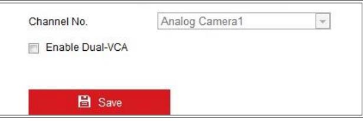

Display Info. on Stream

### *Purpose:*

You can specify a target area on the live video, and then the specified video area can be displayed via the third stream in certain resolution, providing more details of the target area if needed.

*Note:* Target cropping function varies according to different camera models.

- 1. Enter the **Target Cropping** settings interface.
- 2. Check **Enable Target Cropping** checkbox to enable the function.
- 3. Set Third Stream as the stream type.
- 4. Select the cropping resolution for the video display of target area. A red rectangle is displayed on the live video to mark the target area, and you can click-and-drag the rectangle to locate the target area as desired.
- 5. Click **Save** to save the settings.

## **Chapter 9 Image Settings**

### *Purpose:*

Follow the instructions in this chapter to configure the image parameters, including display settings, OSD settings, privacy mask, and picture overlay and image parameters switch.

### *Purpose:*

Configure the image adjustment, exposure settings, day/night switch, backlight settings, white balance, image enhancement, video adjustment, and other parameters in display settings.

*Note:* The display parameters vary according to the different camera models. Please refer to the actual interface for details.

### *Steps:*

- 1. Enter the Display Settings interface, **Configuration > Image > Display Settings**.
- 2. Select the desired scene.
- 3. Set the image parameters of the camera.

### **Image Adjustment**

**Brightness** describes bright of the image, which ranges from 1 to 100.

**Contrast** describes the contrast of the image, which ranges from 1 to 100.

**Saturation** describes the colorfulness of the image color, which ranges from 1 to 100.

**Sharpness** describes the edge contrast of the image, which ranges from 1 to 100.

### **Exposure Settings**

If the camera is equipped with the fixed lens, only **Manual** is selectable, and the iris mode is not configurable.

If **Auto** is selected, you can set the auto iris level from 0 to 100.

The **Exposure Time** refers to the electronic shutter time, which ranges from 1 to 1/100,000s. Adjust it according to the actual luminance condition.

**Gain** of image can also be manually configured from 0 to 100. The bigger the value is, the brighter would the image be, and the noise would be amplified to a larger extent.

| ^ Exposure Settings |      |
|---------------------|------|
| Iris Mode           | Auto |
| Auto Iris Level     | 50   |
| Exposure Time       | 1/25 |

Exposure Settings

### **Focus**

For camera support motor-driven lens, you can set the focus mode as Auto, Manual or Semi-auto.

**Auto:** Camera focus is adjusted automatically according to the actual monitoring scenario.

**Manual:** You can control the lens by adjusting the zoom, focus, lens initialization, and auxiliary focus manually.

**Semi-Auto:** Camera will focus automatically when you adjust the zoom parameters.

### **Day/Night Switch**

Select the Day/Night Switch mode according to different surveillance demand. Day, Night, Auto, Scheduled-Switch, and Triggered by alarm input are selectable for day/night switch.

| ^Day/Night Switch |      |
|-------------------|------|
| Day/Night Switch  | Auto |
| Sensitivity       | য    |
| Filtering Time    | 5    |

Day/Night Switch

**Day:** the camera stays at day mode.

**Night:** the camera stays at night mode.

**Auto:** the camera switches between the day mode and the night mode according to the illumination automatically. The sensitivity ranges from 0 to 7, the higher the value is, the easier the mode switches. The **Filtering Time** refers to the interval time between the day/night switch. You can set it from 5s to 120s.

**Scheduled-Switch:** Set the start time and the end time to define the duration for day/night mode.

**Triggered by alarm input:** The switch is triggered by alarm input. You can set the triggered mode to day or night.

**Smart Supplement Light:** Set the supplement light.

Select **Auto**, and the supplement light changes according to the actual luminance. E.g., if the current scene is bright enough, then the supplement light adjusts itself to lower power; and if the scene is not bright enough, the light adjusts itself to higher power.

Select **Manual**, and you can adjust the supplement by adjusting the distance. E.g., if the object is near the camera, the device adjusts the supplement light to lower power, and the light is in higher power if the object is far away.

### **Backlight Settings**

**BLC Area**: If you focus on an object against strong backlight, the object will be too dark to be seen clearly. BLC compensates light to the object in the front to make it clear. OFF, Up, Down, Left, Right, Center, Auto, and Custom are selectable.

*Note:* If BLC mode is set as Custom, you can draw a red rectangle on the live view image as the BLC area.

**WDR**: Wide Dynamic Range can be used when there is a high contrast of the bright area and the dark area of the scene.

**HLC:** High Light Compression function can be used when there are strong lights in the scene affecting the image quality.

### **White Balance**

White balance is the white rendition function of the camera used to adjust the

color temperature according to the environment.

| AWB2              |  |
|-------------------|--|
| MWB               |  |
| AWB1              |  |
| AWB2              |  |
| Locked WB         |  |
| Fluorescent Lamp  |  |
| Incandescent Lamp |  |
| Warm Light Lamp   |  |
| Natural Light     |  |

White Balance

### **Image Enhancement**

**Digital Noise Reduction**: DNR reduces the noise in the video stream. OFF, Normal and Expert are selectable. Set the DNR level from 0 to 100 in Normal Mode. Set the DNR level from both space DNR level [0-100] and time DNR level [0-100] in Expert Mode.

**Defog Mode**: You can enable the defog function when the environment is foggy and the image is misty. It enhances the subtle details so that the image appears clearer.

**EIS (Electrical Image Stabilizer)**: EIS reduces the effects of vibration in a video.

**Gray Scale**: You can choose the range of the gray scale as [0-255] or [16-235].

- **Video Adjustment**
**Mirror**: It mirrors the image so you can see it inversed. Left/Right, Up/Down, Center, and OFF are selectable.

**Rotate**: To make a complete use of the 16:9 aspect ratio, you can enable the rotate function when you use the camera in a narrow view scene.

When installing, turn the camera to the 90 degrees or rotate the 3-axis lens to 90 degrees, and set the rotate mode as on, you will get a normal view of the scene with 9:16 aspect ratio to ignore the needless information such as the wall, and get more meaningful information of the scene.

**Scene Mode**: Choose the scene as indoor or outdoor according to the real environment.

**Video Standard**: 50 Hz and 60 Hz are selectable. Choose according to the different video standards; normally 50 Hz for PAL standard and 60 Hz for NTSC standard.

**Lens Distortion Correction**: For cameras equipped with motor-driven lens, image may appear distorted to some extent. Turn on this function to correct the distortion.

*Note:* Video adjustment function varies according to different device model.

- **Others**
Certain camera models support CVBS, SDI, or HDMI output. Set the local output ON or OFF according to the actual device.

### *Purpose:*

You can customize OSD information on the live view.

| Character Set | GBK                            | > | Display Name V Display Date                            |                                    |   |
|---------------|--------------------------------|---|-----------------------------------------------------------|------------------------------------|---|
|               |                                |   | Display Week Camera Name Time Format Date Format | Camera 01 24-hour MM-DD-YYYY | - |
|               |                                |   | Text OverLay 0 1                                       | Item1                              |   |
|               |                                |   | 团 2 0 3 ■ 4                                      | Item2 item3                     | > |
| Display Mode  | Not transparent & Not flashing | - |                                                           |                                    |   |
| OSD Size      | Auto                           | - |                                                           |                                    |   |
| Font Color    | Black&White Self-adaptive      | 4 |                                                           |                                    |   |
| Alignment     | Custom                         | - |                                                           |                                    |   |

OSD Settings

- 1. Enter the OSD Settings interface: **Configuration > Image > OSD Settings**.
- 2. Select the desired character set.
- 3. Check the corresponding checkbox to select the display of camera name, date or week if required.
- 4. Edit the camera name in the text field of **Camera Name**.
- 5. Select from the drop-down list to set the time format and date format.
- 6. Select from the drop-down list to set the time format, date format, display mode, OSD size and OSD color.
- 7. Configure the text overlay settings.
	- (1) Check the checkbox in front of the textbox to enable the on-screen display.
	- (2) Input the characters in the textbox.

*Note:* Up to 4 text overlays are configurable.

- 8. Adjust the OSD position and alignment.
- 9. Character align right, character align left, all align right, all align left and custom are selectable. If you select character align right, character align left, all align left or all align right, you can set the left and right margins and up and down margins. 1 Character, 2 character and none are available. If you select custom, you can use the mouse to click and drag text frames in the live view window to adjust their positions.
- 10. Click **Save** to save the settings.

### *Purpose:*

Privacy mask enables you to cover certain areas on the live video to prevent certain spots in the surveillance area from being previewed and recorded.

- 1. Enter the Privacy Mask Settings interface: **Configuration** > **Image** > **Privacy Mask**.
- 2. Check the checkbox of **Enable Privacy Mask** to enable this function.
- 3. Click **Draw Area**.

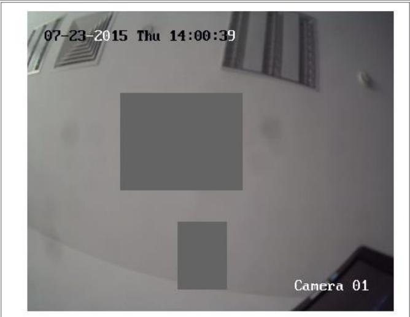

Privacy Mask Settings

- 4. Click and drag the mouse in the live video window to draw the mask area.
*Note:* You are allowed to draw up to 4/8 areas on the same image. The supported number of the areas vary with the camera model.

- 5. Click **Stop Drawing** to finish drawing or click **Clear All** to clear all of the areas you set without saving them.
- 6. Click **Save** to save the settings.

Image parameters scheduled-switch configuration interface enables you to set the time period and linked scene and it will go to the linked scene in the configured time period when you check the corresponding checkbox.

| Scheduled-Switch |          |             |    |              |        |   |
|------------------|----------|-------------|----|--------------|--------|---|
| Period1          | 00:00:00 | -- 00:00:00 | ST | Linked Scene | Normal | > |
| Period2          | 00:00:00 | -- 00:00:00 | ST | Linked Scene | Normal | > |
| Period3          | 00:00:00 | -- 00:00:00 | 最  | Linked Scene | Normal | > |
| Period4          | 00:00:00 | -- 00:00:00 | 是  | Linked Scene | Normal | V |
|                  |          |             |    |              |        |   |
| 을 Save           |          |             |    |              |        |   |

Scheduled-Switch Configuration Interface

- 1. Enter Image Parameters Switch interface: **Configuration** > **Image** > **Image Parameters Switch**.
- 2. Check **Scheduled-Switch**.
- 3. Set the time period and the linked scene. Up to four periods can be configured.
- 4. Click **Save**.

### *Purpose:*

Picture overlay enables you to overlay a picture on the image. This function enables a certain enterprise or users to overlay their logo on the image.

*Note:* Picture overlay function varies according to different camera models.

### *Steps:*

- 1. Enter the Picture Overlay Settings interface, **Configuration** > **Image** > **Picture**
### **Overlay**.

| Channel No. | Analog Camera1 | ア |                              |      |        |        |
|-------------|----------------|---|------------------------------|------|--------|--------|
|             |                |   | Upload Picture               |      |        |        |
|             |                |   |                              |      | Browse | Upload |
|             |                |   | Configure Overlay Parameters |      |        |        |
|             |                |   | Enable Picture Overlay       |      |        |        |
|             |                |   | X Coordinate                 | 622. |        |        |
|             |                |   | Y Coordinate                 | 576  |        |        |
|             |                |   | Picture Width                | 80   |        |        |
|             |                |   | Picture Height               | 28   |        |        |
|             |                |   |                              |      |        |        |
| 을 Save      |                |   |                              |      |        |        |

Picture Overlay

- 2. Click **Browse** to select a picture.
- 3. Click **Upload** to upload it.
- 4. Check **Enable Picture Overlay** checkbox to enable the function.
- 5. Set X Coordinate and Y Coordinate values adjust the picture position on the image. Adjust Picture Width and Picture Height to the desired size.
- 6. Click **Save** to save settings.

*Note*: The picture must be in RGB24 bmp format and the maximum picture size is 128*128.

## **Chapter 10 Event Settings**

This section explains how to configure the network camera to respond to alarm events, including basic event and smart event.

You can configure the basic events by following the instructions in this section, including motion detection, video tampering, alarm input, alarm output, and exception, etc. These events can trigger the linkage methods, such as Notify Surveillance Center, Send Email, Trigger Alarm Output, etc.

*Note***:** Check the checkbox of Notify Surveillance Center if you want the alarm information to be pushed to PC or mobile client software as soon as the alarm is triggered.

### *Purpose:*

Motion detection detects the moving objects in the configured surveillance area, and a series of actions can be taken when the alarm is triggered.

In order to detect the moving objects accurately and reduce the false alarm rate, normal configuration and expert configuration are selectable for different motion detection environment.

### **Normal Configuration**

Normal configuration adopts the same set of motion detection parameters in the daytime and at night.

### *Tasks 1: Set the Motion Detection Area*

- 1. Enter the motion detection settings interface: **Configuration > Event > Basic Event > Motion Detection**.
- 2. Check the checkbox of **Enable Motion Detection**.
- 3. Check the checkbox of **Enable Dynamic Analysis for Motion** if you want to mark the detected objects with green irregular rectangles.

*Note:* Select Disable for rules if you don't want the detected objected displayed with the green rectangles. Select disable rules from **Configuration > Local Configuration > Live View Parameters-rules**.

| Area Settings                   | Arming Schedule | Linkage Method  |
|---------------------------------|-----------------|-----------------|
| Configuration                   | Normal          |                 |
| 12-17-2019 Tue 11 18 100        |                 |                 |
|                                 |                 | anera 01        |
| Draw Area Clear All          |                 |                 |
| Detection Target Sensitivity | J Human         | V Vehicle 60 |

Enable Motion Detection

- *4.* Click **Draw Area**. Click and drag the mouse on the live video to draw a motion detection area.
### *Note:*

The device supports up to four areas.

- 5. (Optional) Click **Clear All** to clear all of the areas.
- 6. Select the detection target. Human and vehicle are available. If the detection target is not selected, all the detected targets will be reported, including the human and vehicle.

### *Note:*

To enable detection target, go to **System > System Settings > VCA Resource to**  select Smart Event first.

- 7. (Optional) Move the slider to set the sensitivity of the detection.
*Task 2: Set the Arming Schedule for Motion Detection*

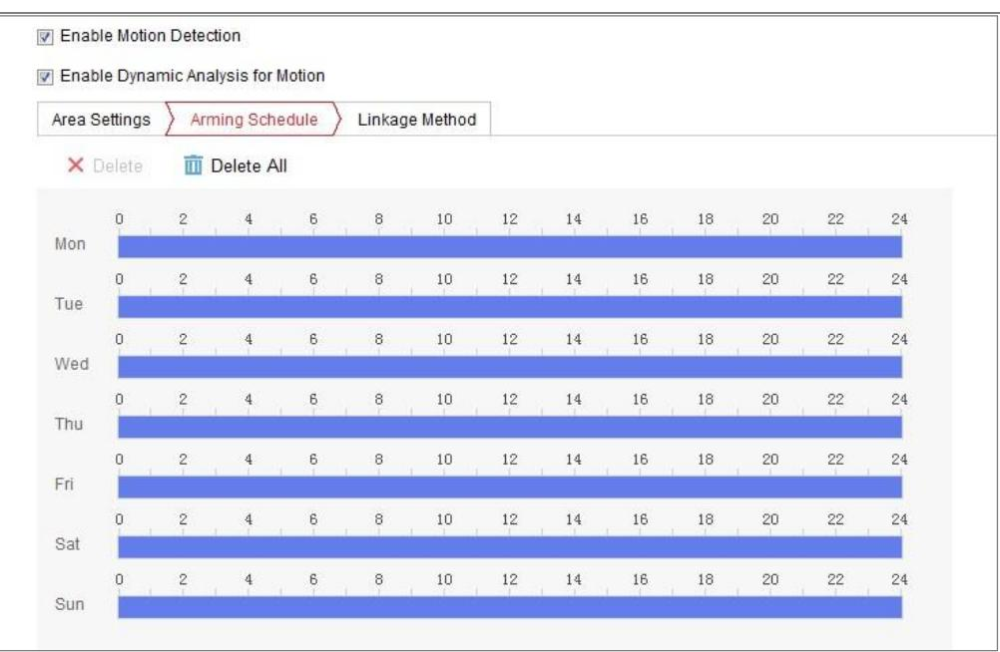

Arming Schedule

- 1. Click **Arming Schedule** to edit the arming schedule.
- 2. Click on the time bar and drag the mouse to select the time period.

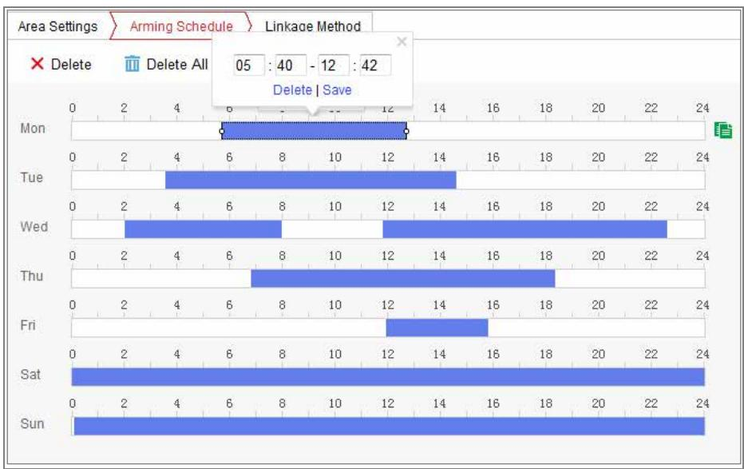

Arming Schedule

*Note:* Click on the selected time period, you can adjust the time period to the desired time by either moving the time bar or input the exact time period.

- 3. (Optional) Click Delete to delete the current arming schedule, or click Save to save the settings.
- 4. Move the mouse to the end of each day, a copy dialogue box pops up, and you can copy the current settings to other days.
- 5. Click **Save** to save the settings.

*Note:* The time of each period cannot be overlapped. Up to 8 periods can be configured for each day.

### *Task 3: Set the Linkage Method for Motion Detection*

Check the checkbox to select the linkage method. Audible Warning, Send Email, Notify Surveillance Center, Upload to FTP/Memory Card/NAS, Trigger Channel and Trigger Alarm Output are selectable. You can specify the linkage method when an event occurs.

| Normal Linkage                  | Trigger Alarm Output | Trigger Recording 1 |
|---------------------------------|----------------------|------------------------|
| Send Email                      | A->1                 | 7 A1                   |
| Notify Surveillance Center S |                      |                        |
| Upload to FTP/Memory Card/      |                      |                        |
| Audible Warning                 |                      |                        |
|                                 |                      |                        |

Linkage Method

*Note:* The linkage methods vary according to the different camera models.

- **Audible Warning**
Trigger the audible warning locally. And it only supported by the device that have the audio output.

### **Notify Surveillance Center**

Send an exception or alarm signal to remote management software when an event occurs.

### **Send Email**

Send an email with alarm information to a user or users when an event occurs.

*Note:* To send the Email when an event occurs, please refer to 7.2.3 Configuring

Email Settings to complete Email setup in advance.

### **Upload to FTP/Memory Card/NAS**

Capture the image when an alarm is triggered and upload the picture to a FTP server.

### *Notes:*

- Set the FTP address and the remote FTP server first. Refer to 7.2.2
Configuring FTP Settings for detailed information.

- Go to **Configuration > Storage > Schedule Settings> Capture > Capture Parameters** page, enable the event-triggered snapshot, and set the capture interval and capture number.
- The captured image can also be uploaded to the available SD card or network disk.

### **Trigger Recording**

The video will be recorded when the motion is detected. You have to set the recording schedule to realize this function. Please refer to 11.1 Configuring Record Schedule for detailed information.

### **Trigger Alarm Output**

Trigger one or more external alarm outputs when an event occurs.

*Note:* To trigger an alarm output when an event occurs, please refer to 10.1.4 Configuring Alarm Output to set the related parameters.

### **Expert Configuration**

Expert mode is mainly used to configure the sensitivity and proportion of object on each area for different day/night switch.

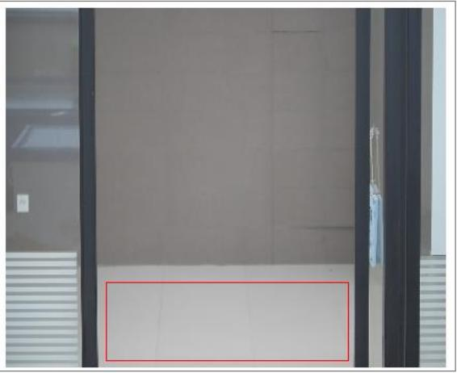

Expert Mode of Motion Detection

- Day/Night Switch OFF
### *Steps:*

- 1. Draw the detection area as in the normal configuration mode. Up to 8 areas are supported.
- 2. Select **OFF** for **Switch Day and Night Settings**.
- 3. Select the area by clicking the area No.
- 4. Slide the cursor to adjust the sensitivity and proportion of object on the area for the selected area.
- 5. Set the arming schedule and linkage method as in the normal configuration mode.
- 6. Click **Save** to save the settings.
- Day/Night Auto-Switch

- 1. Draw the detection area as in the normal configuration mode. Up to 8 areas are supported.
- 2. Select **Auto-Switch** for **Switch Day and Night Settings**.
- 3. Select the area by clicking the area No.
- 4. Slide the cursor to adjust the sensitivity and proportion of object on the area for the selected area in the daytime.
- 5. Slide the cursor to adjust the sensitivity and proportion of object on the area for the selected area at night.
- 6. Set the arming schedule and linkage method as in the normal configuration mode.

7. Click **Save** to save the settings.

- Day/Night Scheduled-Switch
### *Steps:*

- 1. Draw the detection area as in the normal configuration mode. Up to 8 areas are supported.
- 2. Select **Scheduled-Switch** for **Switch Day and Night Settings**.

|            | Switch Day and Night Set  Scheduled-Switch |  |
|------------|--------------------------------------------|--|
| Start Time | 06:00:00                                   |  |
| End Time   | 18:00:00                                   |  |

Day/Night Scheduled-Switch

- 3. Select the start time and the end time for the switch timing.
- 4. Select the area by clicking the area No.
- 5. Slide the cursor to adjust the sensitivity and proportion of object on the area for the selected area in the daytime.
- 6. Slide the cursor to adjust the sensitivity and proportion of object on the area for the selected area at night.

7. Set the arming schedule and linkage method as in the normal configuration mode.

- 8. Click **Save** to save the settings.
### *Purpose:*

You can configure the camera to trigger the alarm when the lens is covered and take certain alarm response actions.

Detection area for this alarm is the whole screen.

*Steps:*

- 1. Enter the video tampering Settings interface, **Configuration > Event > Basic Event > Video Tampering**.
- 2. Check **Enable Video Tampering** checkbox to enable the video tampering detection.
- 3. Click **Edit** to edit the arming schedule for video tampering. The arming schedule configuration is the same as the setting of the arming schedule for motion detection. Refer to *Task 2: Set the Arming Schedule for Motion Detection* in 10.1.1 Configuring Motion Detection*.*
- 4. Check the checkbox to select the linkage method taken for the video tampering. Please refer to *Task 3: Set the Linkage Method for Motion Detection* in 10.1.1 Configuring Motion Detection*.*
- 5. Click **Save** to save the settings.

- 1. Enter the Alarm Input Settings interface: **Configuration > Event > Basic Event > Alarm Input**.
- 2. Choose the alarm input No. and the Alarm Type. The alarm type can be NO (Normally Open) and NC (Normally Closed). Edit the name to set a name for the alarm input (optional).

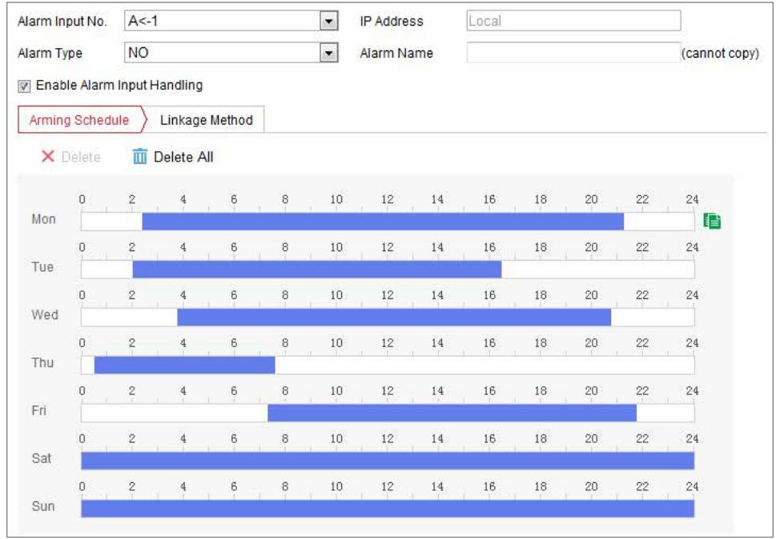

### Alarm Input Settings

- 3. Click **Arming Schedule** to set the arming schedule for the alarm input. Refer to *Task 2: Set the Arming Schedule for Motion Detection* in 10.1.1 Configuring Motion Detection*.*
- 4. Click **Linkage Method** and check the checkbox to select the linkage method taken for the alarm input. Refer to *Task 3: Set the Linkage Method for Motion Detection* in 10.1.1 Configuring Motion Detection*.*
- 5. You can copy your settings to other alarm inputs.
- 6. Click **Save** to save the settings.

*Note*: Only certain camera models support the function.

| Alarm Output No. | A->1  | IP Address    | Local |               |
|------------------|-------|---------------|-------|---------------|
| Delay            | ર્ફિક | Alarm Name    |       | (cannot copy) |
| Alarm Status     | OFF   | (cannot copy) |       |               |

### Alarm Output Settings

- 1. Enter the Alarm Output Settings interface: **Configuration> Event > Basic Event >**
### **Alarm Output**.

- 2. Select one alarm output channel in the **Alarm Output** drop-down list. You can also set a name for the alarm output (optional).
- 3. Set delay time. The delay time refers to the time duration that the alarm output remains in effect after alarm occurs.
- 4. Click **Arming Schedule** to enter the Edit Schedule Time interface. The time schedule configuration is the same as the settings of the arming schedule for motion detection Refer to *Task 2: Set the Arming Schedule for Motion Detection* in 10.1.1 Configuring Motion Detection*.*
- 5. You can copy the settings to other alarm outputs.
- 6. Click **Save** to save the settings.

*Note*: Only certain camera models support the function.

The exception type can be HDD full, HDD error, network disconnected, IP address conflicted and illegal login to the cameras.

### *Steps:*

- 1. Enter the Exception Settings interface: **Configuration > Event > Basic Event > Exception**.
- 2. Check the checkbox to set the actions taken for the Exception alarm. Refer to *Task*

*3: Set the Linkage Method for Motion Detection* in 10.1.1 Configuring Motion Detection*.*

- 3. Click **Save** to save the settings.

| Flashing Duration  | 15     | S |
|--------------------|--------|---|
| Flashing Frequency | Medium | V |

Flashing Alarm Light Output Settings

- 1. Enter the Flashing Alarm Light Output settings interface: **Configuration > Event > Basic Event > Flashing Alarm Light Output**.
- Flashing Duration: The time period the flashing lasts when one alarm happens.
- Flashing Frequency: The flashing speed of the light. High, Medium, and Low are selectable.
- 2. Set the flashing duration and flashing frequency.
- 3. Edit the arming schedule.
- 4. Click **Save**.

*Note:* Only certain camera models support the function.

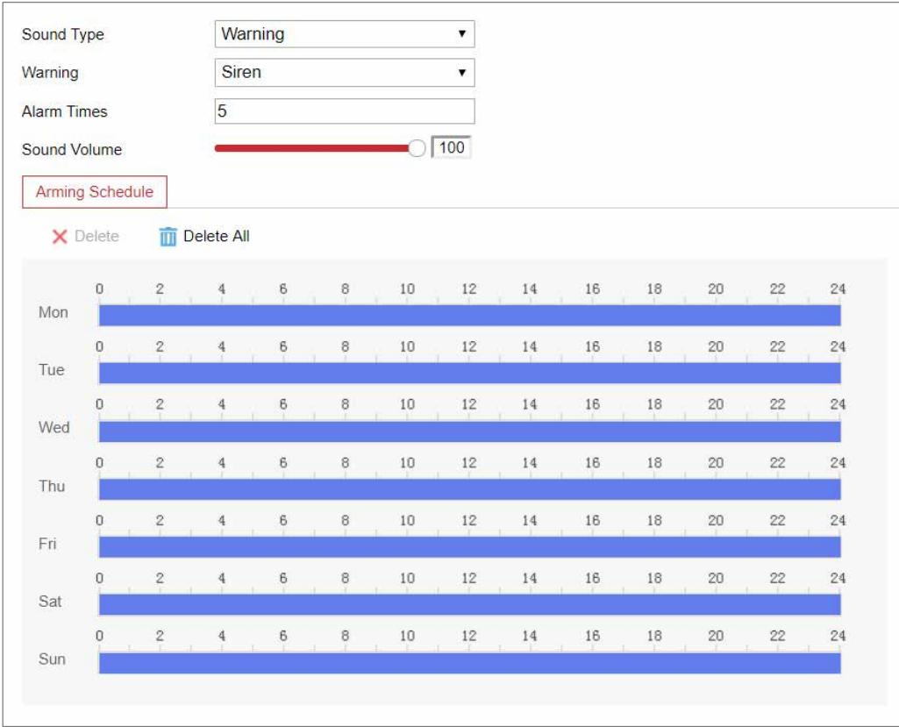

Audible Alarm Output Settings

- 1. Enter the Audible Alarm Output settings interface: **Configuration > Event > Basic Event > Audible Alarm Output**.
- Sound Type: Warning and Prompt are selectable.
- Warning: The content of warning
- Alarm Times: The repeating times of the warning.
- 2. Select the alarm sound type.
- 3. Set the alarm times and sound volume.
- 4. Edit the arming schedule.
- 5. Click **Save**.

*Note:* Only certain camera models support the function.

*Note:* Only certain cameras support Wireless Alarm, PIR (passive infrared sensor) Alarm or Emergency Alarm.

### **Wireless Alarm**

### *Purpose:*

When wireless alarm signal is sent to the camera from the detector, such as the wireless door contact, the wireless alarm is triggered and a series of response actions can be taken.

### *Steps:*

- 1. Enter the Wireless Alarm Settings interface:
### **Configuration > Advanced Configuration> Basic Event > Wireless Alarm**

- 2. Select the wireless alarm number.
Up to 8 channels of external wireless alarm input are supported.

- 3. Check the checkbox of **Enable Wireless Alarm** to activate the wireless alarm.
- 4. Input the alarm name in the text field as desired.
- 5. Check the checkbox to select the linkage methods taken for the wireless alarm.
- 6. Click **Save** to save the settings.
- 7. Locate the external wireless device beside the camera, and go to **Configuration > System > System Settings > Remote Control** to arm the camera and study the wireless alarm.

| Study          |    |   |       |
|----------------|----|---|-------|
| Wireless Alarm | 1  | V | Study |
| Arm / Disarm   |    |   |       |
| Arm            | 0s |   | Set   |

Configuring Wireless Alarm Settings

### **PIR Alarm**

### *Purpose:*

A PIR (Passive Infrared) alarm is triggered when an intruder moves within the detector's field of view. The heat energy dissipated by a person, or any other warm blooded creature such as dogs, cats, etc., can be detected.

### *Steps:*

- 1. Enter the PIR Alarm Settings interface:
### **Configuration > Advanced Configuration> Basic Event> PIR Alarm**

| د Enable   |                             |   |            |                |      |    |    |    |    |    |      |    |    |
|------------|-----------------------------|---|------------|----------------|------|----|----|----|----|----|------|----|----|
| Alarm Name |                             |   |            |                |      |    |    |    |    |    |      |    |    |
|            | Arming Schedule X Delete |   | Delete All | Linkage Method |      |    |    |    |    |    |      |    |    |
| Mon        | 0                           | 2 | 4          | 6              | 00   | 10 | 12 | 14 | 16 | 18 | 20   | 22 | 24 |
| Tue        | 0                           | 2 | 4          | 6              | - 00 | 10 | 12 | 14 | 16 | 18 | 20   | 22 | 24 |
| Wed        | 0                           | 2 | 4          | 6              | 00   | 10 | 12 | 14 | 16 | 18 | ട്രാ | 22 | 24 |
| Thu        | 0                           | 2 | 4          | 6              | 00   | 10 | 15 | 14 | 16 | 18 | ട്‌വ | 22 | 24 |
| Fri        | 0                           | 2 | 4          | 6              | 00   | 10 | 12 | 14 | 16 | 18 | 20   | 22 | 24 |
| Sat        | 0                           | 2 | 4          | 6              | 00   | 10 | 12 | 14 | 16 | 18 | 20   | 22 | 24 |
| Sun        | 0                           | 2 | 4          | - თ            | - CO | 10 | 12 | 14 | 16 | 18 | 20   | 22 | 24 |

### Setting PIR Alarm

- 2. Check the checkbox of **Enable** to activate the PIR alarm function.
- 3. Input the alarm name in the text field as desired.
- 4. Check the checkbox to select the linkage methods taken for the PIR alarm.
- 5. Click the **Edit** button to set the arming schedule.
- 6. Click **Save** to save the settings.
- 7. Go to **Configuration > Advanced Configuration> System> Remote Control** to arm the camera.

| Study Remote Control Study |  |
|----------------------------------|--|
|                                  |  |
|                                  |  |
| Arm / Disarm                     |  |
| 0s Arm Set >            |  |

Arming PIR Alarm

### **Emergency Alarm**

### *Purpose:*

You can press the Emergency button on the remote control to trigger the Emergency Alarm in case of an emergency.

*Note:* The remote control is required for the Emergency Alarm. Go to

**Configuration > System> System Settings > Remote Control** to study the remote control first.

### *Steps:*

- 1. Enter the Emergency Alarm Settings interface:
### **Configuration > Event > Basic Event> Emergency Alarm**

- 2. Check the checkbox to select the linkage methods taken for the Emergency alarm.
- 3. Click **Save** to save the settings.

You can configure the smart events by following the instructions in this section, including audio exception detection, defocus detection, scene change detection, intrusion detection, and line crossing detection, etc. These events can trigger the linkage methods, such as Notify Surveillance Center, Send Email, Trigger Alarm Output, etc.

### *Purpose:*

Scene change detection function detects the change of surveillance environment affected by the external factors, such as the intentional rotation of the camera. Some certain actions can be taken when the alarm is triggered.

*Note*: Scene change detection function varies according to different camera models.

- 1. Enter the Scene Change Detection settings interface, **Configuration > Event > Smart Event > Scene Change Detection**.
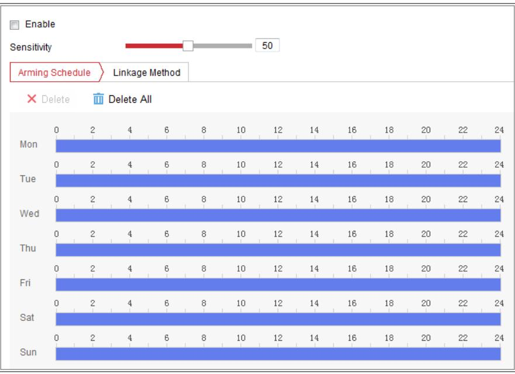

Scene Change Detection

- 2. Check the checkbox of **Enable** to enable the function.
- 3. Click-and-drag the slider to set the detection sensitivity. The sensitivity value ranges from 1 to 100, and the higher the value is, the more easily the change of scene can trigger the alarm.
- 4. Click **Arming Schedule** to set the arming schedule. Refer to *Task 2 Set the Arming Schedule for Motion Detection* in 10.1.1 Configuring Motion Detection for detailed steps*.*
- 5. Click **Linkage Method** to select the linkage methods for scene change, including

Notify Surveillance Center, Send Email, Upload to FTP/Memory Card/NAS, Trigger Recording and Trigger Alarm Output.

- 6. Click **Save** to save the settings.
### *Purpose:*

Intrusion detection function detects people, vehicle or other objects that enter and loiter in a pre-defined virtual region, and some certain actions can be taken when the alarm is triggered.

*Note:* Intrusion detection function varies according to different camera models.

### *Steps:*

- 1. Enter the Intrusion Detection settings interface, **Configuration> Event > Smart Event > Intrusion Detection**.
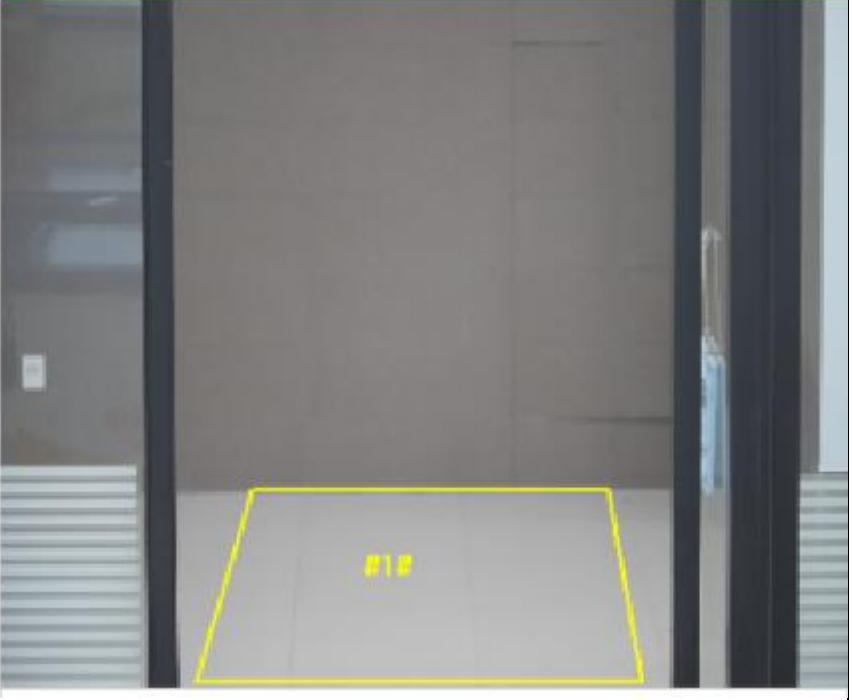

Intrusion Detection

- 2. Check the checkbox of **Enable** to enable the function.
- 3. Select a region number from the drop-down list of **Region**.

**Region**: A pre-defined vertexes area on the live view image. Targets, such as,

people, vehicle or other objects, who enter and loiter in the region will be detected and trigger the set alarm.

- 4. Set the Max. Size and Min. Size for valid targets. Targets smaller or larger than the valid target size are not able to trigger detection. Select a point in the live image as the start to draw a rectangle as the max. size or min. size.
**Max. Size**: The maximum size of a valid target. Targets with larger sizes would not trigger detection.

**Min. Size**: The minimum size of a valid target. Targets with smaller sizes would not trigger detection.

- 5. Set the Detection Area. Click on the live video to specify the four vertexes of the detection region.
- 6. Select the detection target. Human and vehicle are available. If the detection target is not selected, all the detected targets will be reported, including the human and vehicle.
- 7. Set the time threshold for intrusion detection.

**Threshold:** Range [0s-10s], the threshold for the time of the object loitering in the region. If you set the value as 0, alarm is triggered immediately after the object entering the region.

- 8. Drag the slider to set the sensitivity value.
**Sensitivity**: Range [1-100]. Sensitivity stands for the percentage of the body part of an acceptable target that enters the pre-defined region.

Sensitivity = 100 – S1/ST*100

S1 stands for the target body part that goes across the pre-defined region. ST stands for the complete target body.

Example: if you set the value as 60, the action can be counted as an intrusion only when 40 percent body part enters the region.

*Note:* The **Sensitivity** of the detection is supported by certain models.

- 9. Repeat the above steps to configure other regions. Up to 4 regions can be set. You can click the **Clear** button to clear all pre-defined regions.
- 10. Click **Arming Schedule** to set the arming schedule.

- 11. Click **Linkage Method** to select the linkage methods for intrusion detection, including Notify Surveillance Center, Send Email, Upload to FTP/Memory Card/NAS, Trigger Recording, Trigger Alarm Output, Flashing Alarm and Audible Warning.
*Note:* Only certain models support Trigger Recording, Trigger Alarm Output, Flashing Alarm and Audible Warning.

- 12. Click **Save** to save the settings.
### *Purpose:*

Line crossing detection function detects people, vehicle or other objects that cross a pre-defined virtual line, and some certain actions can be taken when the alarm is triggered.

*Note:* Line crossing detection function varies according to different camera models.

- 1. Enter the Line Crossing Detection settings interface, **Configuration > Event > Smart Event > Line Crossing Detection**.
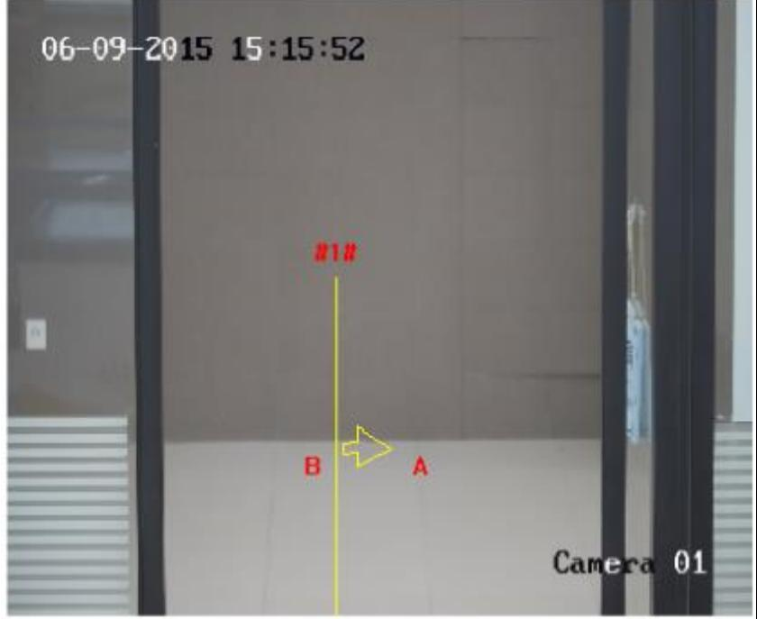

Line Crossing Detection

- 2. Check the checkbox of **Enable** to enable the function.
- 3. Select the line from the drop-down list.
- 4. Set the Max. Size and Min. Size for valid targets. Targets smaller or larger than the valid target size are not able to trigger detection.

**Max. Size**: The maximum size of a valid target. Targets with larger sizes would not trigger detection.

**Min. Size**: The minimum size of a valid target. Targets with smaller sizes would not trigger detection.

- 5. Set the detection area. Drag the line, and you can locate it on the live video as desired.
- 6. Select the detection target. Human and vehicle are available. If the detection target is not selected, all the detected targets will be reported, including the human and vehicle.
- 7. Select the direction for line crossing detection. And you can select the directions as A<->B, A ->B, and B->A.

**A<->B**: The object going across the plane with both directions can be detected and alarms are triggered.

**A->B**: Only the object crossing the configured line from the A side to the B side can be detected.

**B->A**: Only the object crossing the configured line from the B side to the A side can be detected.

- 8. Drag the slider to set the sensitivity value.
**Sensitivity**: Range [1-100]. It stands for the percentage of the body part of an acceptable target that goes across the pre-defined line.

Sensitivity = 100 – S1/ST*100

S1 stands for the target body part that goes across the pre-defined line. ST stands for the complete target body.

Example: if you set the value as 60, the action can be counted as a line crossing action only when 40 percent or more body part goes across the line. *Note:* Only certain camera models support **Sensitivity** function.

- 9. Repeat the above steps to configure other lines. Up to 4 lines can be set. You can click the **Clear** button to clear all pre-defined lines.
- 10. Click the **Arming Schedule** to set the arming schedule.
- 11. Click **Linkage Method** to select the linkage methods for intrusion detection, including Notify Surveillance Center, Send Email, Upload to FTP/Memory Card/NAS, Trigger Recording, Trigger Alarm Output, Flashing Alarm and Audible Warning.

*Note:* Only certain models support Trigger Recording, Trigger Alarm Output, Flashing Alarm and Audible Warning.

- 12. Click **Save** to save the settings.
### *Purpose:*

Region entrance detection function detects people, vehicle or other objects that enter a pre-defined virtual region from the outside place, and some certain actions can be taken when the alarm is triggered.

- 1. Enter the Region Entrance Detection settings interface, **Configuration > Event > Smart Event > Region Entrance Detection**.

Region Entrance Detection

- 2. Check the **Enable** checkbox to enable the function.
- 3. Select the **Region** from the drop-down list for detection settings.
- 4. Set the Max. Size and Min. Size for valid targets. Targets smaller or larger than the valid target size are not able to trigger detection.

**Max. Size**: The maximum size of a valid target. Targets with larger sizes would not trigger detection.

**Min. Size**: The minimum size of a valid target. Targets with smaller sizes would not trigger detection.

- 5. Set the detection area. Click on the live video to specify the four vertexes of the detection region.
- 6. Select the detection target. Human and vehicle are available. If the detection target is not selected, all the detected targets will be reported, including the human and vehicle.
- 7. Drag the slider to set the sensitivity value.

**Sensitivity**: Range [1-100]. Sensitivity stands for the percentage of the body part of an acceptable target that enters the pre-defined region.

Sensitivity = 100 – S1/ST*100

S1 stands for the target body part that enters the pre-defined region ST stands for the complete target body.

Example: if you set the value as 60, the action can be counted as a region entrance action only when 40 percent body part enters the region. *Note:* Only certain camera models support **Sensitivity** function.

- 8. Repeat the above steps to configure other regions. Up to 4 regions can be set. You can click the **Clear** button to clear all pre-defined regions.
- 9. Click **Arming Schedule** to set the arming schedule.
- 10. Click **Linkage Method** to select the linkage methods for intrusion detection, including Notify Surveillance Center, Send Email, Upload to FTP/Memory Card/NAS, Trigger Channel, Trigger Alarm Output, Flashing Alarm and Audible Warning.

*Note:* Only certain models support Trigger Channel, Trigger Alarm Output,

Flashing Alarm and Audible Warning.

- 11. Click **Save** to save the settings.
### *Purpose:*

Region exiting detection function detects people, vehicle or other objects that exit from a pre-defined virtual region, and some certain actions can be taken when the alarm is triggered.

### *Steps:*

- 1. Enter the Region Exiting Detection settings interface, **Configuration > Event > Smart Event > Region Exiting Detection**.
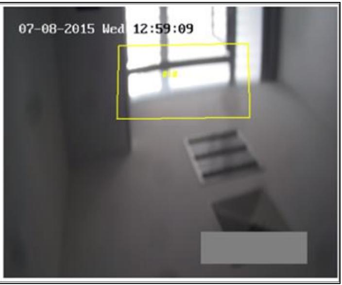

Region Exiting Detection

- 2. Check **Enable** checkbox to enable the function.
- 3. Select the **Region** from the drop-down list for detection settings.
- 4. Set the Max. Size and Min. Size for valid targets. Targets smaller or larger than the valid target size are not able to trigger detection.

**Max. Size**: The maximum size of a valid target. Targets with larger sizes would not trigger detection.

**Min. Size**: The minimum size of a valid target. Targets with smaller sizes would not trigger detection.

- 5. Set the detection area. Click on the live video to specify the four vertexes of the detection region.
- 6. Select the detection target. Human and vehicle are available. If the detection target is not selected, all the detected targets will be reported, including the human and vehicle.
- 7. Drag the slider to set the sensitivity value.

**Sensitivity**: Range [1-100]. Sensitivity stands for the percentage of the body part of an acceptable target that exits the pre-defined region.

Sensitivity = 100 – S1/ST*100

S1 stands for the target body part that exits the pre-defined region. ST stands for the complete target body.

Example: if you set the value as 60, the action can be counted as a region exiting action only when 40 percent body part exits the region.

*Note:* Only certain camera models support **Sensitivity** function.

- 8. Repeat the above steps to configure other regions. Up to 4 regions can be set. You can click the **Clear** button to clear all pre-defined regions.
- 9. Click **Arming Schedule** to set the arming schedule.
- 10. Click **Linkage Method** to select the linkage methods for intrusion detection, including Notify Surveillance Center, Send Email, Upload to FTP/Memory Card/NAS, Trigger Recording, Trigger Alarm Output, Flashing Alarm and Audible Warning.

*Note:* Only certain models support Trigger Recording, Trigger Alarm Output, Flashing Alarm and Audible Warning.

- 11. Click **Save** to save the settings.
Face capture can capture the face appears in the configured area, and the face information will be uploaded with the captured picture as well.

*Note*: Only certain camera models support the function.

### **Overlay & Capture**

**Display VCA info. on Stream**: The red frames will be displayed on the target if in a live view or playback.

**Display Target info. on Alarm Picture**: There will be a frame on the target on the uploaded alarm picture if the checkbox is checked.

### **Snapshot Settings:**

- Target Picture Settings
- a. Set the target picture size. Four types are available: Custom, Head Shot, Half-Body Shot and Full-Body Shot. If you select the Custom, you can customize the width, head height and body height as required.
- b. Check the Fixed Value to set the picture height.
- Background Picture Settings
- a. Select the Picture Quality and Resolution from the drop-down list.
- b. Check **Background Upload** to upload the background image.

*Note:* Background upload is only available for face capture camera.

### **Camera Information:**

You can set the Device No. and Camera Info. for the camera, which can be overlaid on captured picture.

### **Text Overlay Information:**

You can check desired items and adjust their order to display on captured pictures.

### **Shield Region**

The shield region allows you to set the specific region in which the face capture does not work. Up to 4 shield regions are supported.

### *Steps:*

- 1. Click to draw shield area by left click end-points in the live view window, and right click to finish the area drawing.
### *Notes:*

- Polygon area (4 to 10 sides) sides is supported.
- Click to delete the drawn areas.
- If the live view is stopped, there is no way to draw the shield regions.

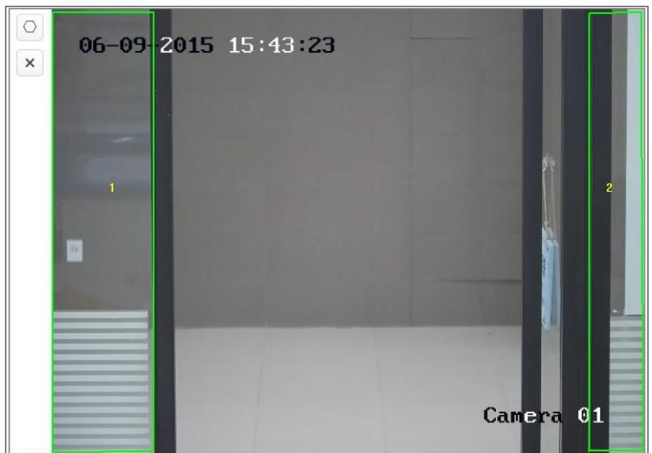

Draw Shield Area

- 2. Click **Save** to save the settings.
### **Rule**

### *Steps:*

- 1. Check **Rule** to enable rules of face capture.
- 2. Click to draw the minimum pupil distance. The distance of the drawn pupil will be displayed on the box below the live view. The minimize pupil distance refers to the minimum square size composed by

the area between two pupils, and it is the basic standard for a camera to identify a target.

- 3. Click to draw the maximum pupil distance.
- 4. Click to draw the detection area you want the face capture to take effect. Draw area by left click end-points in the live view window, and right click to finish the area drawing.

### *Notes:*

- Polygon area (4 to 10 sides) sides is supported.
- If the live view is stopped, there is no way to draw the configured area.
- 5. Click **Save**.
- 6. Click Arming Schedule tab, and set the schedule time for each rule, and click **Save** to save the settings.
- 7. Click Alarm Linkage tab, check the checkbox of corresponding linkage

method for each rule, and click **Save** to save the settings.

### **Advanced Configuration**

Face Capture Version: It lists the version of the algorithms library.

Configure the following parameters according to your actual environment.

*Note:* These functions vary according to different models.

| Detection Parameters   |                                                                                                                 |
|------------------------|-----------------------------------------------------------------------------------------------------------------|
| Generation Speed       | 3                                                                                                               |
| Sensitivity            | 3                                                                                                               |
| Capture Parameters     |                                                                                                                 |
| Face Capture Mode      | C Best Shot Q Quick Shot                                                                                     |
| Capture Times          | 1                                                                                                               |
| Capture Interval       | 1 frame                                                                                                      |
| Capture Threshold      | 4                                                                                                               |
| Face Exposure          |                                                                                                                 |
| Reference Brightness   | 50                                                                                                              |
| Min. Duration          | 60 minute(s)                                                                                                    |
| Face Filtering Time    | 0 S                                                                                                          |
|                        | () The Filtering Time only works in Best Shot mode. If the Filtering Time is changed, the actual capture times. |
| Invalid Capture Filter |                                                                                                                 |
| Restore Parameters     |                                                                                                                 |

Advanced Configuration

### **Detection Parameters:**

**Generation Speed** [1 to 5]: The speed to identify a target. The higher the value, the faster the target will be recognized. Setting the value quite low, and if there was a face in the configured area from the start, this face will not be captured. It can reduce the misinformation of the faces in the wall painting or posters. The default value of 3 is recommended.

**Sensitivity** [1 to 5]**:** The sensitivity to identify a target. The higher the value is, the easier a face will be recognized, and the higher possibility of misinformation would be. The default value of 3 is recommended.

### **Capture Parameters:**

**Face Capture Mode:** Best Shot and Quick Shot are available.

- Best Shot: The best shot after target leave the detection area. Capture Times [1 to 3]: Refers to the capture times a face will be captured during its stay in the configured area.
Capture Interval: [1 to 255 Frame]: The frame interval to capture a picture. If you set the value as 1, which is the default value, it means the camera captures the face in every frame.

Capture Threshold: It stands for the quality of face to trigger capture and alarm. Higher value means better quality should be met to trigger capture and alarm.

- Quick Shot: You can define quick shot threshold and max. capture interval. Quick Shot Threshold: It stands for the quality of face to trigger quick shot. Capture Times: It can be set as limited and unlimited. When it is set as limited, it can be set [0 to 100]. Refers to the capture times a face will be captured during its stay in the configured area.
**Face Exposure**: Check the checkbox to enable the face exposure.

**Reference Brightness** [0 to 100]: The reference brightness of a face in the face exposure mode. If a face is detected, the camera adjusts the face brightness according to the value you set. The higher the value, the brighter the face is.

**Minimum Duration** [1 to 60 minute(s)]: The minimum duration of the camera exposures the face.

*Note:* If the face exposure is enabled, please make sure the WDR function is disabled, and the manual iris is selected.

**Face Filtering Time**: It means the time interval between the camera detecting a face and taking a capture action. If the detected face stays in the scene for less than the set filtering time, capture will not be triggered. For example, if the face filtering time is set as 5 seconds, the camera will capture the detected face when the face keeps staying in the scene for 5 seconds.

*Note:* The face filtering time (longer than 0 s) may increase the possibility of the actual capture times less than the set value above.

**Invalid Capture Filter:** Check the checkbox to enable invalid capture filter. The invalid captured face pictures will be filtered if the function is enabled.

**Restore Default**: Click **Restore** to restore all the settings in advanced configuration to the factory default.

## **Chapter 11 Storage Settings**

### *Before you start:*

To configure record settings, please make sure that you have the network storage device or local storage device configured.

### *Purpose:*

There are two kinds of recording for the cameras: manual recording and scheduled recording. In this section, you can follow the instructions to configure the scheduled recording. By default, the record files of scheduled recording are stored in the local storage or in the network disk.

### *Steps:*

- 1. Enter the Record Schedule Settings interface: **Configuration** > **Storage** > **Schedule Settings > Record Schedule**.
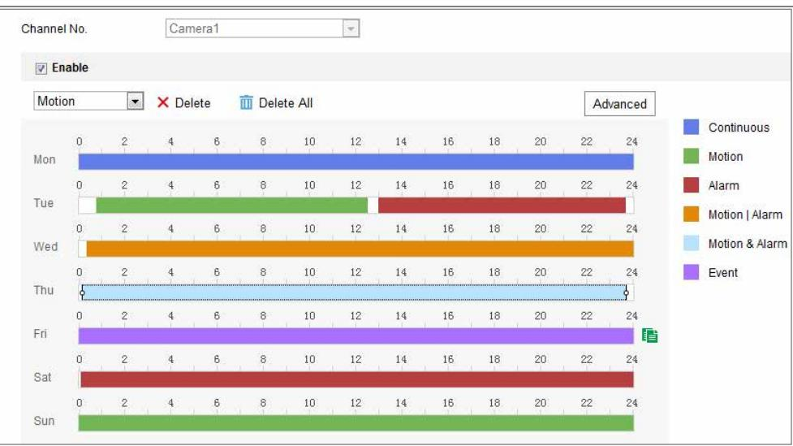

Recording Schedule Interface

- 2. Check the checkbox of **Enable** to enable scheduled recording.
- 3. Click **Advanced** to set the camera record parameters.

| Advanced       |             |  |
|----------------|-------------|--|
| Overwrite J |             |  |
| Pre-record     | 5s          |  |
| Post-record    | 5s          |  |
| Stream Type    | Main Stream |  |

### Record Parameters

- Pre-record: The time you set to start recording before the scheduled time or the event. For example, if an alarm triggers recording at 10:00, and the prerecord time is set as 5 seconds, the camera starts to record at 9:59:55. The Pre-record time can be configured as No Pre-record, 5s, 10s, 15s, 20s, 25s, 30s or not limited.
- Post-record: The time you set to stop recording after the scheduled time or the event. For example, if an alarm triggered recording ends at 11:00, and the postrecord time is set as 5 seconds, the camera records until 11:00:05. The Post-record time can be configured as 5s, 10s, 30s, 1 min, 2 min, 5 min or 10 min.
- Stream Type: Select the stream type for recording.

*Note:* The record parameter configurations vary depending on the camera model.

- 4. Select a **Record Type**. The record type can be Continuous, Motion Detection, Alarm, Motion | Alarm, Motion & Alarm, and Event.
	- **Continuous**

If you select **Continuous**, the video will be recorded automatically according to the time of the schedule.

### **Record Triggered by Motion Detection**

If you select **Motion Detection**, the video will be recorded when the motion is detected.

Besides configuring the recording schedule, you have to set the motion detection area and check the checkbox of Trigger Recording in the Linkage Method of Motion Detection Settings interface. For detailed information,

please refer to the *Task 1: Set the Motion Detection Area* in 10.1.1 Configuring Motion Detection*.*

### **Record Triggered by Alarm**

If you select **Alarm**, the video will be recorded when the alarm is triggered via the external alarm input channels.

Besides configuring the recording schedule, you have to set the **Alarm Type** and check the checkbox of **Trigger Recording** in the **Linkage Method** of **Alarm Input Settings** interface. For detailed information, please refer to *10.1.3* Configuring Alarm Input.

### **Record Triggered by Motion & Alarm**

If you select **Motion & Alarm**, the video will be recorded when the motion and alarm are triggered at the same time.

Besides configuring the recording schedule, you have to configure the settings on the **Motion Detection** and **Alarm Input Settings** interfaces. Please refer to 10.1.1 Configuring Motion Detection and 10.1.3 Configuring Alarm Input for detailed information*.*

### **Record Triggered by Motion | Alarm**

If you select **Motion | Alarm**, the video will be recorded when the external alarm is triggered or the motion is detected.

Besides configuring the recording schedule, you have to configure the settings on the **Motion Detection** and **Alarm Input Settings** interfaces. Please refer to 10.1.1 Configuring Motion Detection and *10.1.3* Configuring Alarm Input for detailed information*.*

### **Record Triggered by Events**

If you select **Event**, the video will be recorded if any of the events is triggered. Besides configuring the recording schedule, you have to configure the event settings*.*

- 5. Select the record type, and click-and-drag the mouse on the time bar to set the record schedule.
- 6. Click **Save** to save the settings.

### *Purpose:*

You can configure the scheduled snapshot and event-triggered snapshot. The captured picture can be stored in the local storage or network storage.

### *Steps:*

- 1. Enter the Capture Settings interface: **Configuration** > **Storage** > **Storage Settings** >
### **Capture**.

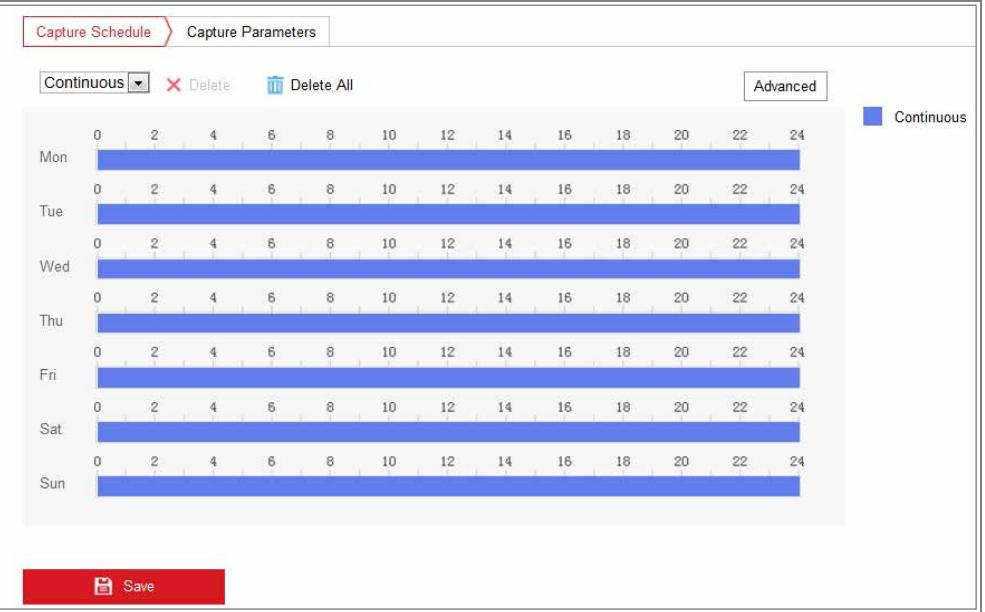

Capture Configuration

- 2. Go to **Capture Schedule** tab to configure the capture schedule by click-and-drag the mouse on the time bar. You can copy the record schedule to other days by clicking the green copy icon on the right of each time bar.
- 3. Click **Advanced** to select stream type.

| Advanced    |            |    | ×      |
|-------------|------------|----|--------|
| Stream Type | Sub Stream |    |        |
|             |            | OK | Cancel |

Advanced Setting of Capture Schedule

- 4. Click **Save** to save the settings.
- 5. Go to **Capture Parameters** tab to configure the capture parameters.
- (1) Check the **Enable Timing Snapshot** checkbox to enable continuous snapshot.
- (2) Select the picture format, resolution, quality and capture interval.
- (3) Check the **Enable Event-triggered Snapshot** checkbox to enable eventtriggered snapshot.
- (4) Select the picture format, resolution, quality, capture interval, and capture number.

| Timing                            |         |             |   |
|-----------------------------------|---------|-------------|---|
| Enable Timing Snapshot র বি    |         |             |   |
| Format                            | JPEG    | 4           |   |
| Resolution                        | 704*576 | ▼           |   |
| Quality                           | High    | ।           |   |
| Interval                          | 500     | millisecond | > |
|                                   |         |             |   |
| 7 Enable Event-Triggered Snapshot |         |             |   |
| Format                            | JPEG    | 4           |   |
| Resolution                        | 704*576 | >           |   |
| Quality                           | High    | V           |   |
| Interval                          | 500     | millisecond | > |

Set Capture Parameters

- 6. Set the time interval between two snapshots.
- 7. Click **Save** to save the settings.

### *Purpose:*

HDD management allows you to view the HDD capacity, free space, status, encryption status, type, formatting type, property and progress, etc. You can format, encrypted format or verify the selected HDD as required. And you can assign the quota for different file types.

- 1. Enter the HDD management interface, **Configuration** > **Storage** > **Storage Management > HDD Management**.

|   | HDD Management        |          |            |        |                   |       | Encrypted Fo    | Parity   | Format   |
|---|-----------------------|----------|------------|--------|-------------------|-------|-----------------|----------|----------|
| > | HDD No.               | Capacity | Free space | Status | Encryption Status | Type  | Formatting Type | Property | Progress |
| V | 1                     | 14.43GB  | 2.00GB     | Normal | Encrypted         | Local | EXT4            | RW       |          |
|   |                       |          |            |        |                   |       |                 |          |          |
|   |                       |          |            |        |                   |       |                 |          |          |
|   |                       |          |            |        |                   |       |                 |          |          |
|   |                       |          |            |        |                   |       |                 |          |          |
|   |                       |          |            |        |                   |       |                 |          |          |
|   |                       |          |            |        |                   |       |                 |          |          |
|   |                       |          |            |        |                   |       |                 |          |          |
|   |                       |          |            |        |                   |       |                 |          |          |
|   |                       |          |            |        |                   |       |                 |          |          |
|   |                       |          |            |        |                   |       |                 |          |          |
|   | Quota                 |          |            |        |                   |       |                 |          |          |
|   | Max.Picture Capacity  |          | 3.00GB     |        |                   |       |                 |          |          |
|   | Free Size for Picture |          | 2.00GB     |        |                   |       |                 |          |          |

HDD Management

- 2. Select the desired disk and operate as required.
	- (1) The status of the disk includes **Uninitialized** and **Normal**.
		- If the status of the disk is **Uninitialized**, you can click **Format** to initialize the disk. When the initialization completed, the status of disk will become **Normal**. Then the disk can be used normally.
	- (2) The encryption status of the disk includes **Unencrypted**, **Encrypted** and **Verification Failed**.
		- If the status of the disk is **Unencrypted**, you can click **Format** or **Encrypted Format** to format it. The encryption password is required for the encryption format.
		- For the encrypted memory card, its status is displayed: **Encrypted** or **Verification Failed**. If the status of the disk is **Verification Failed**, you can click **Parity**, and enter the password for the verification. If the verification is succeeded, its status changes to **Encrypted**.
- 3. (Optional) Define the quota for record and pictures.
	- (1) Input the quota percentage for picture and for record.
	- (2) Click **Save** and refresh the browser page to activate the settings.

| Quota                 |         |    |
|-----------------------|---------|----|
| Max.Picture Capacity  | 4.75GB  |    |
| Free Size for Picture | 4.75GB  |    |
| Max. Record Capacity  | 14.50GB |    |
| Free Size for Record  | 14.50GB |    |
| Percentage of Picture | 25      | 96 |
| Percentage of Record  | 75      | %  |
|                       |         |    |
| 글 Save                |         |    |

Quota Settings

### *Before you start:*

The network disk should be available within the network and properly configured to store the recorded files, log files, pictures, etc.

- 1. Enter the Net HDD settings interface, **Configuration** > **Storage** > **Storage Management** > **Net HDD**.

| Net HDD            |                   |                 |      |        |  |
|--------------------|-------------------|-----------------|------|--------|--|
| HDD No.            | Server Address    | File Path       | Type | Delete |  |
|                    | 10 10.36.61       | /cxy_1          | NAS  | ×      |  |
|                    |                   |                 |      |        |  |
| SMB/CIFS -         | User Name cxy1 | Password        |      | Test   |  |
| Mounting Type 2 | 10.10.36.252      | /dvr/yangjian_1 | NAS  | ×      |  |

Add Network Disk

- 2. Enter the IP address of the network disk, and enter the file path.
- 3. Select the mounting type. NFS and SMB/CIFS are selectable. And you can set the user name and password to guarantee the security if SMB/CIFS is selected.

*Note:* Please refer to the *NAS User Manual* for creating the file path.

- *For your privacy and to better protect your system against security risks, we strongly recommend the use of strong passwords for all functions and network devices. The password should be something of your own choosing (using a minimum of 8 characters, including at least three of the following categories: upper case letters, lower case letters, numbers and special characters) in order to increase the security of your product.*
- *Proper configuration of all passwords and other security settings is the responsibility of the installer and/or end-user.*
- 4. Click **Test** to check whether the network disk is available.
- 5. Click **Save**.

### *Note:*

Up to 8 NAS disks can be connected to the camera.

### *Purpose:*

With memory card detection, you can view the memory card status, lock your memory card, and receive notification when your memory card is detected abnormal.

*Note:* Only certain camera models support the function. If this tab page doesn't show on your web page, it means either that your camera doesn't support the function, or your installed memory card is not supported for this function. You can contact the dealer or the retailer for the information of memory card that supports the function. *Steps:*

- 1. Enter Memory Card Detection configuration interface:
**Configuration > Storage > Storage Management > Memory Card Detection**

| Status Detection   | Linkage Method Arming Schedule R/W Lock |        |
|--------------------|-----------------------------------------------|--------|
| Remaining Lifespan |                                               | 99%    |
| Health Status      |                                               | Normal |
|                    |                                               |        |
| 을 Save             |                                               |        |

Memory Card Detection

- 2. View the memory card status on **Status Detection** tab.
**Remaining Lifespan:** It shows the percentage of the remaining lifespan. The lifespan of a memory card may be influenced by factors such as its capacity and the bitrate. You need to change the memory card if the remaining lifespan is not enough.

**Health Status:** It shows the condition of your memory card. There are three status descriptions, good, bad, and damaged. You will receive a notification if the health status is anything other than good when the **Arming Schedule** and **Linkage Method** are set.

*Note:* It is recommended that you change the memory card when the health status is not "good".

- 3. Click **R/W Lock** tab to add a lock to the memory card.
With the R/W lock added, the memory card can only be read and write when it is unlocked.

| Status Detection  | RW Lock Arming Schedule | Linkage Method |
|-------------------|----------------------------|----------------|
| Lock Switch       | ON                         |                |
| Password Settings |                            |                |
| 글 Save            |                            |                |

R/W Lock Setting

- Add a Lock
- (1) Select the **Lock Switch** as ON.
- (2) Input the password.
- (3) Click **Save** to save the settings.
- Unlock
- (1) If you use the memory card on the camera that locks it, unlocking will be done automatically and no unlocking procedures are required on the part of users.
- (2) If you use the memory card (with a lock) on a different camera, you can go to **HDD Management** interface to unlock the memory card. Select the memory card, and click the **Unlock** button shown next to the **Format** button. Then input the correct password to unlock it.

### *Notes:*

- **•** The memory card can only be read and written in when it is unlocked.
- **•** If the camera, which adds a lock to a memory card, is restored to the factory settings, you can go to the HDD Management interface to unlock the memory card.
- Remove the Lock
- (1) Select the **Lock Switch** as **OFF**.
- (2) Input the correct password in **Password Settings** text field.
- (3) Click **Save** to save the settings.
- 4. Set the **Arming Schedule** and **Linkage Method**, if you want to receive a notification when the health status of the memory card is anything other than good. Refer to *Task 2: Set the Arming Schedule for Motion Detection* and *Task 3: Set the Linkage Method for Motion Detection* in 10.1.1 Configuring Motion Detection*.*
- 5. Click **Save** to save the settings.

### *Purpose:*

When there is no moving object in the monitoring scenario, the frame rate and bitrate of the video stream can be reduced to lengthen the storage time of the memory card. *Notes:*

- Only certain camera models support the function.
- The video files recorded in lite storage mode will be played back in full frame rate

(25fps/30fps), and thus the playback process is speeded up to the eye.

- 1. Enter the Lite Storage interface:
### **Configuration > Storage > Storage Management > Lite Storage**

- 2. Check the Checkbox of **Enable** to enable the lite storage function.
- 3. Input the storage time in the text field. You can view the available space of the SD card on the page.
- 4. Click **Save** to save the settings.

### *Purpose:*

The captured pictures can be saved on Cloud Storage when the function is

configured.

*Note*: Only certain camera models support the function.

### *Steps:*

- 1. Check **Enable Cloud Storage**.
- 2. Select a protocol version.
- 3. Input the IP address and port of the storage server.
- 4. Input the user name, password and confirm password for the authentication of the storage server if you select the protocol version as Cloud1.0. Input AccessKey and SecretKey if you select the protocol version as Cloud2.0.
- 5. Input picture storage pool ID on the server.
- 6. (Optional) You can click Test to test the cloud storage settings.
- 7. Click **Save**.

### *Note:*

The storage server port ranges from 2000 to 65535 and the picture storage pool ID ranges from 1 to 255.

## **Chapter 12 Playback**

### *Purpose:*

This section explains how to view the remotely recorded video files stored in the network disks or memory cards.

### *Steps:*

- 1. Click **Playback** on the menu bar to enter playback interface.
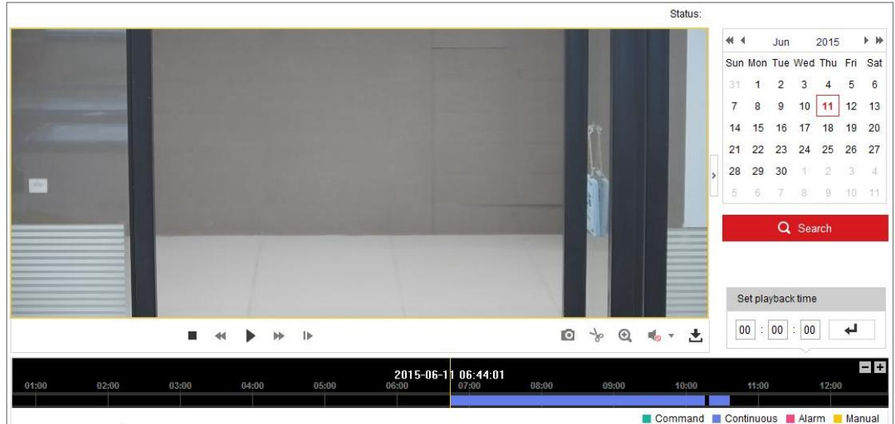

Playback Interface

- 2. Select the date and click **Search**.

| 41 4 |          | May |                             | 2015 |    | ▶ W |
|------|----------|-----|-----------------------------|------|----|-----|
|      |          |     | Sun Mon Tue Wed Thu Fri Sat |      |    |     |
|      | 26 27    |     | 28 29 30                    |      | 1  | 2   |
| 3    | 4        | 5   | 6                           | 7    | 8  | 9   |
| 10   | 11       | 12  | 13                          | 14   | 15 | 16  |
|      | 17 18 19 |     | 20 21 22 23                 |      |    |     |
| 24   |          |     | 25 26 27 28 29 30           |      |    |     |
| 31   | 子        | 23  | 3                           | না   | ua | 16  |

Search Video

- 3. Click to play the video files found on this date.
The toolbar on the bottom of Playback interface can be used to control playing process.

| - - - - - - |  |  |  |  |  |  |  |  | 可 * Q % = = |  |  |
|-------------|--|--|--|--|--|--|--|--|-------------|--|--|
|-------------|--|--|--|--|--|--|--|--|-------------|--|--|

Playback Toolbar

Table 12-1 Description of the buttons

| Button | Operation                      | Button | Operation                          |  |  |
|--------|--------------------------------|--------|------------------------------------|--|--|
|        | Play                           |        | Capture a picture                  |  |  |
|        | Pause                          | /      | Start/Stop clipping video files |  |  |
|        | Stop                           | /      | Audio on and adjust volume/Mute |  |  |
|        | Speed down                     |        | Download                           |  |  |
|        | Speed up                       |        | Playback by frame                  |  |  |
| /      | Enable/Disable digital zoom |        |                                    |  |  |

*Note:* You can choose the file paths locally for downloaded playback video files and pictures in Local Configuration interface.

You can also input the time and click to locate the playback point in the **Set** 

**playback time** field. You can also click to zoom out/in the progress bar.

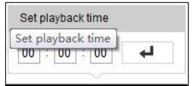

Set Playback Time

|       |       |       | 2015-06-15 05:34:54 |       |       |       |
|-------|-------|-------|---------------------|-------|-------|-------|
| 03:00 | 04:00 | 05:00 | 06:00               | 07:00 | 08:00 | 09:00 |
|       |       |       |                     |       |       |       |

Progress Bar

The different colors of the video on the progress bar stand for the different video types.

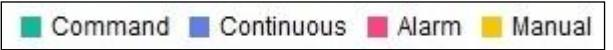

Video Types

## **Chapter 13 Picture**

Click Picture to enter the picture searching interface. You can search, view, and download the pictures stored in the local storage or network storage.

### *Notes:*

- Make sure HDD, NAS or memory card are properly configured before you process the picture search.
- Make sure the capture schedule is configured. Go to **Configuration > Storage > Schedule Settings > Capture** to set the capture schedule.

| Search Conditions   |        | & Download Stop Downloading File List |                           |                     |           |          |  |  |  |  |
|---------------------|--------|---------------------------------------------|---------------------------|---------------------|-----------|----------|--|--|--|--|
| File Type           | ির     | No.                                         | File Name                 | Time                | File Size | Progress |  |  |  |  |
| Continuous          | 网 > | 1                                           | ch01_0800000000000068600  | 2015-07-10 15:35:13 | 134 KB    |          |  |  |  |  |
| Start Time          | D      | 2                                           | ch01_08000000000000068700 | 2015-07-10 15:35:18 | 134 KB    |          |  |  |  |  |
| 2015-07-02 00:00:00 | 网 T | 3                                           | ch01_0800000000000068800  | 2015-07-10 15:35:24 | 134 KB    |          |  |  |  |  |
| End Time            | 国      | 4                                           | ch01_080000000000068900   | 2015-07-10 15:35:29 | 132 KB    |          |  |  |  |  |
| 2015-07-10 23:59:59 | D n | 5                                           | ch01_0800000000000069000  | 2015-07-10 15:35:34 | 132 KB    |          |  |  |  |  |
|                     | ि      | 6                                           | ch01_080000000000069100   | 2015-07-10 15:35:39 | 133 KB    |          |  |  |  |  |
| Q Search            | D      | 7                                           | ch01_0800000000000069200  | 2015-07-10 15:35:45 | 133 KB    |          |  |  |  |  |
|                     | 10     | 8                                           | ch01 080000000000069300   | 2015-07-10 15:35:50 | 131 KB    |          |  |  |  |  |
|                     | 100    | ਰੇ                                          | ch01_0800000000000069400  | 2015-07-10 15:35:55 | 131 KB    |          |  |  |  |  |
|                     | D      | 10                                          | ch01_08000000000000069500 | 2015-07-10 15:36:01 | 132 KB    |          |  |  |  |  |
|                     | n      | 11                                          | ch01_0800000000000069600  | 2015-07-10 15:36:06 | 132 KB    |          |  |  |  |  |

Picture Search Interface

### *Steps:*

- 1. Select the file type from the dropdown list. Continuous, Motion, Alarm, Motion | Alarm, Motion & Alarm, Line Crossing, Intrusion Detection, and Scene Change Detection are selectable.
- 2. Select the start time and end time.
- 3. Click **Search** to search the matched pictures.
- 4. Check the checkbox of the pictures and then click **Download** to download the selected pictures.

### *Note:*

Up to 4000 pictures can be displayed at one time.

## **Appendix**

### **Appendix 1 SADP Software Introduction**

### **Description of SADP**

SADP (Search Active Devices Protocol) is a kind of user-friendly and installation-free online device search tool. It searches the active online devices within your subnet and displays the information of the devices. You can also modify the basic network information of the devices using this software.

### **Search active devices online**

### **Search online devices automatically**

After launch the SADP software, it automatically searches the online devices every 15 seconds from the subnet where your computer locates. It displays the total number and information of the searched devices in the Online Devices interface. Device information including the device type, IP address and port number, etc. will be displayed.

| 0     | SADP  |                                                                                                                                                                                                                                                                                                                                                                                                                                                                                                |          |              |       |                                                                                                                                                                                |     |                                                                                                                                                                                | 0 _ □ ×                                  |
|-------|-------|------------------------------------------------------------------------------------------------------------------------------------------------------------------------------------------------------------------------------------------------------------------------------------------------------------------------------------------------------------------------------------------------------------------------------------------------------------------------------------------------|----------|--------------|-------|--------------------------------------------------------------------------------------------------------------------------------------------------------------------------------|-----|--------------------------------------------------------------------------------------------------------------------------------------------------------------------------------|---------------------------------------------|
|       |       | 10 Total number of online devices:                                                                                                                                                                                                                                                                                                                                                                                                                                                          |          |              |       |                                                                                                                                                                                |     | Refresh Export                                                                                                                                                              | I Activate the Device                       |
|       | CI ID | -   Device Type                                                                                                                                                                                                                                                                                                                                                                                                                                                                                | Security | IPv4 Address | Part  | Software Version   IPs4 Gateway                                                                                                                                                |     | ISTEP Port   Device Serial No                                                                                                                                                  |                                             |
| (금    | 001   | xxxxxxxxxxxxxxxxxxxxxxxxxxxxxxxxxxxxxxxxxxxxxxxxxxxxxxxxxxxxxxxxxxxxxxxxxxxxxxxxxxxxxxxxxxxxxxxxxxxxxxxxxxxxxxxxxxxxxxxxxxxxxxxxxxxxxxxxxxxxxxxxxxxxxxxxxxxxxxxxxxxxxxxxxxxxxx                                                                                                                                                                                                                                                                                                                 | Artive   | 10,16,6.21   | Dogge | 10.16.16.2500000 Billudion K                                                                                                                                                   | 80  | 00                                                                                                                                                                             |                                             |
|       | 002   | O - REECCCODE-IX                                                                                                                                                                                                                                                                                                                                                                                                                                                                               | Active   | 10.16.6.20   | 8000  | 10.16.10.10.1000000 ItliudiocxVC                                                                                                                                               | 80  | 00000000000000000000000000                                                                                                                                                     |                                             |
| ল     | 003   | KX <xxxxxxxxxxxxxxxxxxxxxxxxxxxxxxxxxxxxxxxxxxxxxxxxxxxxxxxxxxxxxxxxxxxxxxxxxxxxxxxxxxxxxxxxxxxxxxxxxxxxxxxxxxxxxxxxxxxxxxxxxxxxxxxxxxxxxxxxxxxxxxxxxxxxxxxxxxxxxxxxxxxxxxxxxxx< td=""><td>Active</td><td>10.16.6.171</td><td>8000</td><td>10.16.6.254</td><td>80</td><td>SOC. NORDER SOCIODERIOS</td><td></td></xxxxxxxxxxxxxxxxxxxxxxxxxxxxxxxxxxxxxxxxxxxxxxxxxxxxxxxxxxxxxxxxxxxxxxxxxxxxxxxxxxxxxxxxxxxxxxxxxxxxxxxxxxxxxxxxxxxxxxxxxxxxxxxxxxxxxxxxxxxxxxxxxxxxxxxxxxxxxxxxxxxxxxxxxxx<> | Active   | 10.16.6.171  | 8000  | 10.16.6.254                                                                                                                                                                    | 80  | SOC. NORDER SOCIODERIOS                                                                                                                                                        |                                             |
| 12    | 004   | STERIOUNCE-DOL                                                                                                                                                                                                                                                                                                                                                                                                                                                                                 | Active   | 10.16.6.22   | BOOD  | 14.25.6.10/ xxxxxxxxxxxxxxxxxxxV                                                                                                                                               | N/A | CCC - 100000000000000000000000000000000000000000000000000000000000000000000000000000000000000000000000000000000000000000000000000000000000000000000000000000000000000000000000 |                                             |
| 0 103 | 005   | OOL- XXXXIII HOODLA - XX                                                                                                                                                                                                                                                                                                                                                                                                                                                                       | Active   | 10.16.6.127. | 8000  | 10.xxxbuild xxxxxxxxxxxxxxxxxx                                                                                                                                                 | N/A | 100-1000000 - 1000000000000000                                                                                                                                                 | The device is not activated.                |
|       | DOG   | Property - Reflex                                                                                                                                                                                                                                                                                                                                                                                                                                                                              | Active   | 10,16.6.179  | 8000  | 0 Caliul 1 xxxxxxxxxxxxxxxxxxxxxxxxxxxxxxxxxxxxxxxxxxxxxxxxxxxxxxxxxxxxxxxxxxxxxxxxxxxxxxxxxxxxxxxxxxxxxxxxxxxxxxxxxxxxxxxxxxxxxxxxxxxxxxxxxxxxxxxxxxxxxxxxxxxxxxxxxxxxxxxxxxx | N/A | 2007 MAGUIGIST - MAGGIOGOGIOGIO                                                                                                                                                |                                             |
| 【三】   | 007   | XX-XXXXXXXXX-X                                                                                                                                                                                                                                                                                                                                                                                                                                                                                 | Active   | 10.16.6.250  | BOOD  | PEN ANAIH SECCEE 10.16.6.254                                                                                                                                                   | 80  | XX - > DODDOOX - JOODGOGOOOOOOOOOOOOOOOOOOOOOOOOOOOOOOOOOOOOOOOOOOOOOOOOOOOOOOOOOOOOOOOOOOOOOOOOOOOOOOOOOOOOOOOOOOOOOOOOOOOOOOOOOOOOOOOOOOOOOOOOOOOOOOOOOOOOOOOOOOOOOOOOOOOOOO |                                             |
| B     | 008   | of other court                                                                                                                                                                                                                                                                                                                                                                                                                                                                                 | Inactive | 192 168 1.64 | 0008  | 11.681 261 11.000 MILIBEXA                                                                                                                                                     | 08  | D ATTERN (SCHEELOCK)                                                                                                                                                           | You can modify the network parameters after |
|       | 1 009 | XX - COREXXXXX - Z                                                                                                                                                                                                                                                                                                                                                                                                                                                                             | Active   | 10.16.6.111  | BOOD  | \$4,9,961,01 xxxxxx, 10,16,6,254                                                                                                                                               | 80  | 100 - 100000000000000000000000000000000000000000000000000000000000000000000000000000000000000000000000000000000000000000000000000000000000000000000000000000000000000000000000 | the device activation.                      |
|       | 010   | KX+300000000000000000000000000000000000000000000000000000000000000000000000000000000000000000000000000000000000000000000000000000000000000000000000000000000000000000000000000                                                                                                                                                                                                                                                                                                                 | Active   | 10.16.6.177  | 8000  | VE Exhullif Tioooor (10.16.6.254                                                                                                                                               | 80  | KXXXXXXXXXXXXXXXXXXXXXXXXXXXXXXXXXXXXXXXXXXXXXXXXXXXXXXXXXXXXXXXXXXXXXXXXXXXXXXXXXXXXXXXXXXXXXXXXXXXXXXXXXXXXXXXXXXXXXXXXXXXXXXXXXXXXXXXXXXXXXXXXXXXXXXXXXXXXXXXXXXXXXXXXXXXXX | Acresses Prisse                             |
|       |       |                                                                                                                                                                                                                                                                                                                                                                                                                                                                                                |          |              |       |                                                                                                                                                                                |     |                                                                                                                                                                                |                                             |
|       |       |                                                                                                                                                                                                                                                                                                                                                                                                                                                                                                |          |              |       |                                                                                                                                                                                |     |                                                                                                                                                                                | New Password                             |
|       |       |                                                                                                                                                                                                                                                                                                                                                                                                                                                                                                |          |              |       |                                                                                                                                                                                |     |                                                                                                                                                                                | Strong                                      |
|       |       |                                                                                                                                                                                                                                                                                                                                                                                                                                                                                                |          |              |       |                                                                                                                                                                                |     |                                                                                                                                                                                | Confirm Password:                        |
|       |       |                                                                                                                                                                                                                                                                                                                                                                                                                                                                                                |          |              |       |                                                                                                                                                                                |     |                                                                                                                                                                                |                                             |
|       |       |                                                                                                                                                                                                                                                                                                                                                                                                                                                                                                |          |              |       |                                                                                                                                                                                |     |                                                                                                                                                                                |                                             |
|       |       |                                                                                                                                                                                                                                                                                                                                                                                                                                                                                                |          |              |       |                                                                                                                                                                                |     |                                                                                                                                                                                | Activate                                    |
| 4     |       |                                                                                                                                                                                                                                                                                                                                                                                                                                                                                                |          |              |       |                                                                                                                                                                                |     |                                                                                                                                                                                |                                             |

Figure A.1.1 Searching Online Devices

### *Note:*

Device can be searched and displayed in the list in 15 seconds after it went online;

it will be removed from the list in 45 seconds after it went offline.

### **Search online devices manually**

You can also click to refresh the online device list manually. The newly searched devices will be added to the list.

You can click or on each column heading to order the information; you

can click to expand the device table and hide the network parameter panel on the

right side, or click to show the network parameter panel.

### **Modify network parameters**

### *Steps:*

- 1. Select the device to be modified in the device list and the network parameters of the device will be displayed in the **Modify Network Parameters** panel on the right side.
- 2. Edit the modifiable network parameters, e.g. IP address and port number.
- 3. Enter the password of the admin account of the device in the **Admin Password**

field and click to save the changes.

- *For your privacy and to better protect your system against security risks, we strongly recommend the use of strong passwords for all functions and network devices. The password should be something of your own choosing (using a minimum of 8 characters, including at least three of the following categories: upper case letters, lower case letters, numbers and special characters) in order to increase the security of your product.*
- *Proper configuration of all passwords and other security settings is the responsibility of the installer and/or end-user.*

| I Modify Network Parameters |                                                                                      |
|-----------------------------|--------------------------------------------------------------------------------------|
| Enable DHCP                 |                                                                                      |
| Device Serial No .:         | XX-XXXXXXXXXXXXXXXXXXXXXXXXXXXXXXXXXXXXXXXXXXXXXXXXXXXXXXXXXXXXXXXXXXXXXXXXXXXXXXXXX |
| IP Address:                 | 10.16.5.106                                                                          |
| Port:                       | 8003                                                                                 |
|                             | Subnet Mask: 255.255.255.255.0                                                       |
| Gateway:                    | 0.0.0.0                                                                              |
| 1Pv6 Address:               |                                                                                      |
| IPv6 Gateway:               |                                                                                      |
| 19v6 Prefix Length:         |                                                                                      |
| HTTP Port: 0.               |                                                                                      |
|                             | Socurity Venticalian                                                                 |
|                             | Admin Password:                                                                      |
|                             | Modify                                                                               |
|                             | Fargot Password                                                                      |

Figure A.1.2 Modify Network Parameters

### **Appendix 2 Port Mapping**

The following settings are for TP-LINK router (TL-WR641G). The settings vary depending on different models of routers.

### *Steps:*

- 1. Select the **WAN Connection Type**, as shown below:

| 108M Wireless Router Model No .: TL-WR641G / TL-WR642G      | WAN                     |                                                                                           |  |  |  |
|----------------------------------------------------------------------|-------------------------|-------------------------------------------------------------------------------------------|--|--|--|
| · Status                                                             | WAN Connection Type:    | PPPOE                                                                                     |  |  |  |
| · Quick Setup                                                        |                         |                                                                                           |  |  |  |
| --- Basic Settings --- - Network · LAN · WAN · MAC Clone | User Name: Password: | Static IP PPPOE 802.1X + Dynamic IP 802. 1X + Static IP BigPond Cable L2TP |  |  |  |

Figure A.2.1 Select the WAN Connection Type

- 2. Set the **LAN** parameters of the router as in the following figure, including IP address
and subnet mask settings.

| 108M Wireless Router Model No .: TL-WR641G / TL-WR642G     | LAN                         |                                   |
|---------------------------------------------------------------------|-----------------------------|-----------------------------------|
| · Status · Quick Setup                                           | MAC Address: IP Address: | 00-14-78-6A-DB-0C 192.168.10.1 |
| -- Basic Settings --- - Network · LAN · WAN · MAC Clone | Subnet Mask:                | 255.255.255.0 Save             |

Figure A.2.2 Set the LAN parameters

- 3. Set the port mapping in the virtual severs of **Forwarding**. By default, camera uses port 80, 8000 and 554. You can change these ports value with web browser or client software.
### *Example:*

When the cameras are connected to the same router, you can configure the ports of a camera as 80, 8000, and 554 with IP address 192.168.1.23, and the ports of another camera as 81, 8001, 555, 8201 with IP 192.168.1.24. Refer to the steps as below:

### *Steps:*

- 1. As the settings mentioned above, map the port 80, 8000, 554 and 8200 for the network camera at 192.168.1.23
- 2. Map the port 81, 8001, 555 and 8201 for the network camera at 192.168.1.24.
- 3. Enable **ALL** or **TCP** protocols.
- 4. Check the **Enable** checkbox and click **Save** to save the settings.

| Model No .: TL-WR641G / TL-WR642G    | Virtual Servers                                            |              |             |      |           |   |        |
|-----------------------------------------|------------------------------------------------------------|--------------|-------------|------|-----------|---|--------|
| · Status                                | ID                                                         | Service Port | IP Address  |      | Protocol  |   | Enable |
| · Quick Setup                           | 1                                                          | 80           | 192.168.10. | 23   | ALL       | 1 | >      |
| -- Basic Settings --- + Network      | 2                                                          | 8000         | 192.168.10. | 23   | ALL       | > | >      |
| + Wireless --- Advanced Settings --- | 3                                                          | 554          | 192.168.10. | 23   | ALL       | > | >      |
| + DHCP                                  | 4                                                          | 8200         | 192.168.10. | 23   | ALL       | > | >      |
| - Forwarding · Virtual Servers       | 5                                                          | 81           | 192.168.10. | 24   | ALL       | < | >      |
| · Port Triggering                       | 6                                                          | 8001         | 192.168.10. | 24   | ALL       | V | >      |
| · DMZ · UPnP                         | 7                                                          | 555          | 192.168.10. | 24   | ALL       | > | K      |
| + Security                              | 8                                                          | 8201         | 192.168.10. | 24   | ALL       | 2 | >      |
| · Static Routing · Dynamic DNS       |                                                            |              |             |      |           |   |        |
| -- Maintenance --- + System Tools    | Common Service Port: 1 DNS(53) ID Copy to > |              |             |      |           | > |        |
|                                         |                                                            |              | Previous    | Next | Clear All |   | Save   |

Figure A.2.3 Port Mapping

*Note:* The port of the network camera cannot conflict with other ports. For example, some web management port of the router is 80. Change the camera port if it is the same as the management port.

Network Camera User Manual

157