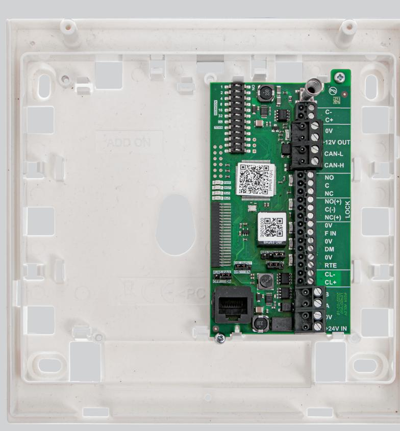
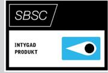
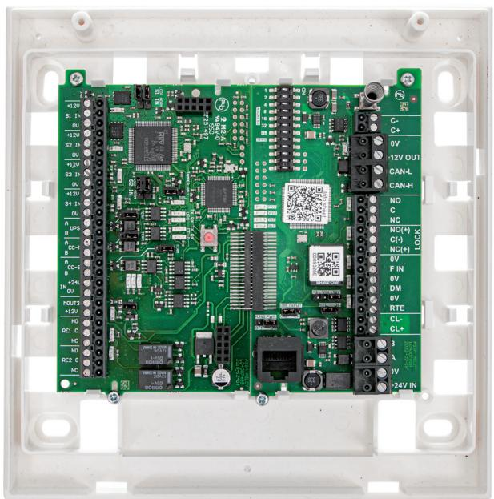

# ASSA ABLOY DAC630

# Dörrkontrollenhet

## **Användningsområde**

Intelligent kontrollenhet för varje dörrmiljö som kopplar samman lås, läsare, öppnaknapp och annan kringutrustning som till exempel dörrautomatik.

#### **Funktion**

Kopplar samman dörrmiljöer med undercentral i passersystem.

DAC630 fungerar även som standalone och styrning av dörr kan ske via ingångar. Ingångar kan kopplas till valfritt passer och säkerhetssystem där relevanta in och utgångsfunktioner finns.

DAC630 kopplas till ARX Säkerhetssystem centralenhet för kommunikation.

### **Egenskaper**

Kommunicerar med HiO enheter såväl som traditionella CL20-enheter. DAC630 har 2 ingångar för öppnaknapp och dörrövervakning, 2 utgångar för larmförbikoppling och ellåsstyrning.

Till DAC630 finns fler olika tilläggskort för utökade funktioner som ansluts direkt och monteras i samma kapsling. Tilläggskort 400RC64 med ytterligare sex utgångar och fyra ingångar.

Tilläggskort SIO6-4 med sex ingångar och fyra utgångar för ARX Säkerhetssystem. Krävs för inbrottslarmfunktioner och larmgodkännande. DAC630 inklusive SIO6-4 finns att beställa med eget artikelnummer, se sida 2.

# ASSA ABLOY DAC630

# Dörrkontrollenhet

# **Data**

- Spänningsmatning: 24 28V DC
- Strömförbrukning Min: 30mA, Max: 35mA
- Strömförbrukning DAC630 inkl SIO6-4: 50mA, max 60mA
- Vikt: DAC630 inkl SIO6-4: 562 g
- Mått (mm): B 182,3 x H 182,3 x D 45,5
- Temperaturområde: +5˚C till +40˚C
- Luftfuktighet: 75% (Ej kondenserande)

## **Kommunikation**

- 2 st CL-20
- 1 st CAN (Hi-O)
- CL-20 till Kortläsare och Centralenhet
- Hi-O till Hi-O kompatibla enheter

#### **Certifierad för**

• Centralutrustning SSF 1014 utgåva 5* SBSC intyg 16-130

- Lamklass 3/4** MK 2
- CE

ASSA ABLOY Opening Solutions Sweden P.O. Box 371 SE-631 05 Eskilstuna Sweden

Phone +46 (0)16 17 70 00 Customer support:

Phone intl. +46 (0)16 17 71 00 Phone nat. 0771-640 640 helpdesk.se.openingsolutions@assaabloy.com assaabloy.com

## **Indikeringar**

- Diod indikeringar: Se teknisk beskrivning
#### **Material**

- Kapsling PC/ABS
#### **Artikelnummer**

- ASSA ABLOY DAC630
- S55666300085, E58 719 63
- DAC630 + SIO6-4
- S5566504000, E58 719 86

#### **Tillbehör**

- ASSA ABLOY 400RC64 S556651160, E58 760 12
- ASSA ABLOY SIO6-4 S5566512160, E58 703 81
- ASSA ABLOY DACIII-BS02 S5590102131 E58 703 89
- Borrskyddsdetektor VD400*** E63 325 00
- * För larmklass 1/2 krävs SIO6-4 ** För larmklass 3/4 krävs SIO6-4 och SIO/DAC-BS02
- *** Beställs i separat kanal