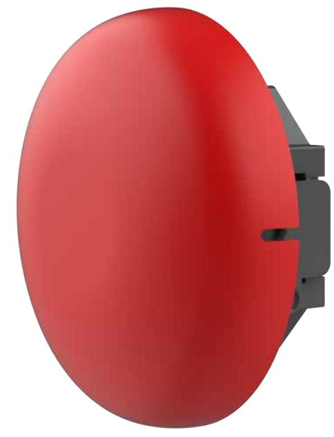

## **Brandlarmsklocka 12V 6 tum Röd**

BK-6-C-12

E-nummer: 5373230

Vår nya brandlarmsklocka BK-6-C utmanar den traditionella konstruktionen på brandlarmsklockor. Klockans monteringsplatta eller IP-klassade kapsling sitter fast med en gångjärnskonstruktion vilket gör monteringen smidig. Skruva dit den och stäng igen klockan så är monteringen klar! Klockan kommer i en inomhusversion samt en IP56 kapslad utomhusversion. Klockan är EN54-3 godkänd.

## **Specifikationer**

| Djup (mm):             | 64               |
|------------------------|------------------|
| Bredd (mm):            | 150              |
| Höjd (mm):             | 150              |
| Vikt (kg):             | 0.378            |
| Spänning (VDC):        | 12               |
| IP klass:              | IP21C            |
| Larmdonstyp:           | Brandlarmsklocka |
| Ljudnivå dB(A):        | 96 @ 1 meter     |
| Certifierad enligt:    | EN54.3           |
| Strömförbrukning (mA): | 12 mA @ 24VDC    |
| Färg:                  | Röd              |