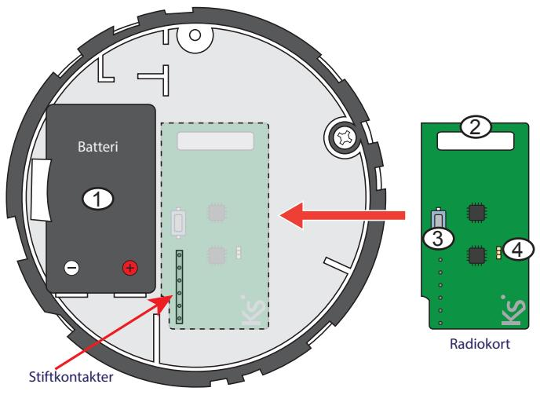
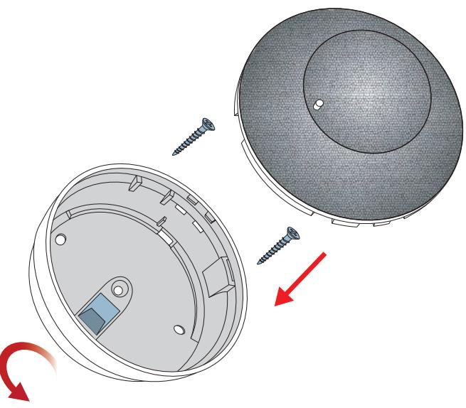

# **12255-56 - Radiobaserad rök. Nebula**

Installationsanvisning

### **Introduktion**

Nebula är en radiobaserad optisk rökdetektor som ger en mycket snabb rök och branddetektering. Två modeller finns tillgängliga: den första med silver, den andra med glasdesign. Båda har en röd lysdiod och summer (> 85dB) som indikerar vid lågt batteri och larm.

Radiomodulen levereras separat.

## **Montering av radiomodul**

- 1.9V lithum batteri.
- 2. Serienummer.
- 3. Knapp för inlärning.
- 4. LED.

### **Inlärning**

1. Tryck på **lär in radiobaserade enheter automatisk** i programmet basis.

2. Anslut batteriet och tryck på inlärningsknappen (3) på radiomodulen.

- 3. För mer information, programmeringsmanual lares.
- **Byte av batteri**
**Montering av rökdetektor**

- 1. Lossa rökdetektorn genom att vrida den motsols.
- 2. Ta bort det gamla batteriet och anslut det nya batteriet.
- 3. Tryck på inlärningsknappen på radiomodulen i ca 2 sekunder.
- 4. Placera rökdetektorn tillbaka in i sockeln och vrid medurs.

5. Gör ett funktionstest. Tryck därför på LED i ca 5-10 sekunder eller använd rökspray.

### **Teknisk specifikation**

| Batteri:          | 9V lithum icke laddningsbart batteri. |
|-------------------|---------------------------------------|
| Batterilivslängd: | Upp till 4 år beroende på pollning.   |
| Frekvens:         | 868 MHz.                              |
| Räckvidd:         | 350 m öppen terräng.                  |
| Arbetstemperatur: | +5 till +40 °C.                       |
| Övervakat område: | max.: 60m² på 6 meters höjd.          |
| IP-klass:         | IP40.                                 |