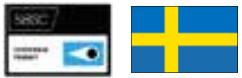
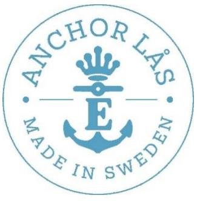
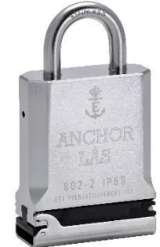
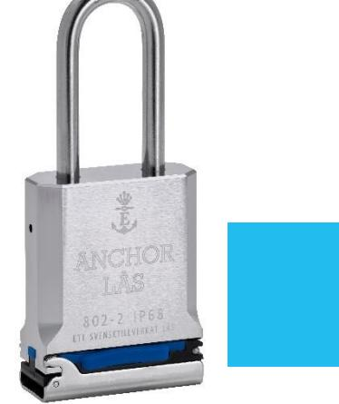
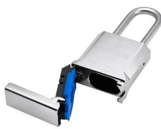
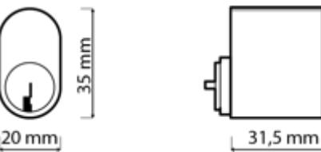
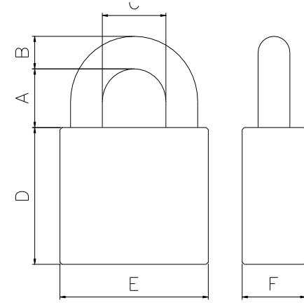

Ett klass 2 hänglås för oval cylinder där cylindern är skyddad enligt IP68-standarden. Lämplig för låsning i tuffare miljöer, t.ex. luckor, förråd och källare. Hänglåset är konstruerat för montering av skandinavisk ovalcylindern och levereras med O-ringar i bygelhålen och med en tät, utfällbar lucka över cylindern. Hermetiskt försluten. Gummitätningen levereras i svart som standard, men finns i flera olika färger för att förenkla märkningen av t.ex. område, tillhörighet. Patenterad produkt.

- > Hänglåskropp: 60 mm härdat stål
- 
- > Ytbehandling: Krom
- > Cylindertyp: Oval
- 
- 

> Bygel: 8mm rostfritt stål

- 
- 
- > Bygelhöjder: 15, 25, 60 resp 110mm
- > Klassning: Klass 2 enligt SSF 014 utg 4. Grade 3 enligt EN 12320:2021

IP-class: IP68 Standard: EN 60529:1991 + A1:2000 + A2:2013. IEC 60529:1989 + A1:1999 + A2:2013.

| A            | B | C  | D  | E  | F  |
|--------------|---|----|----|----|----|
| 15/25/60/110 | 8 | 24 | 77 | 60 | 25 |