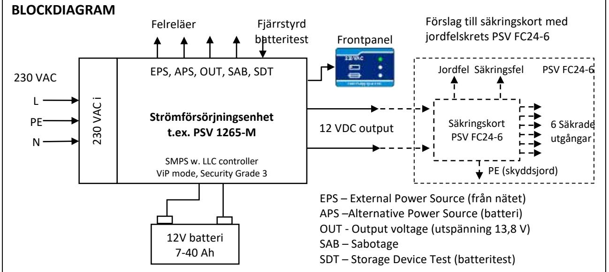
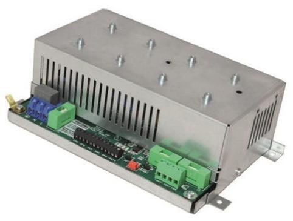
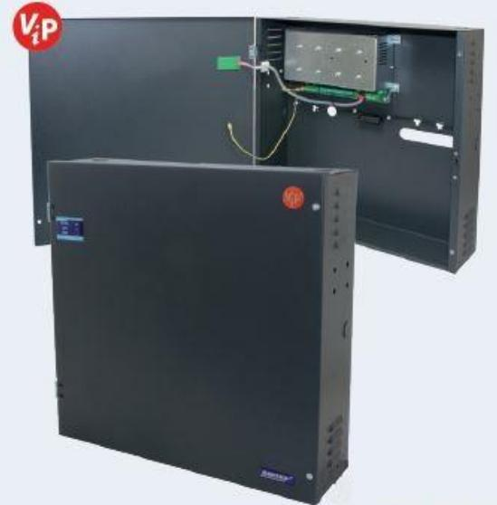
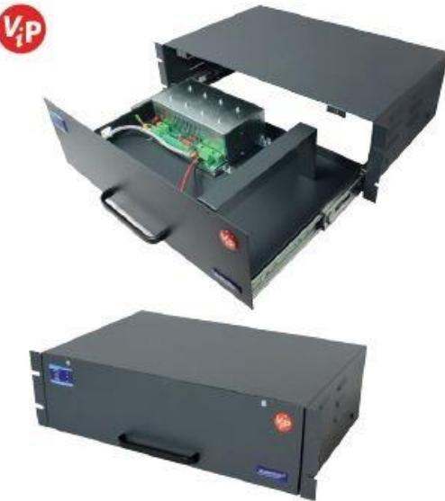
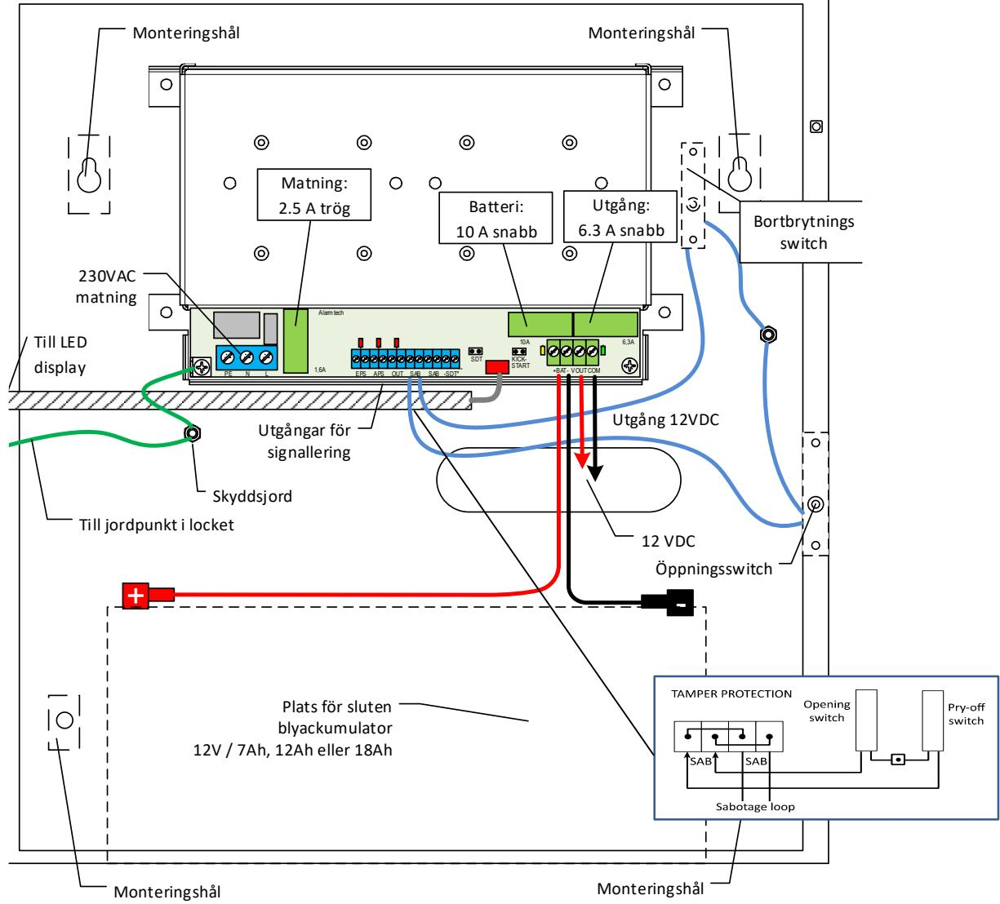
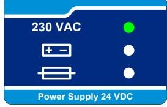
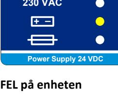
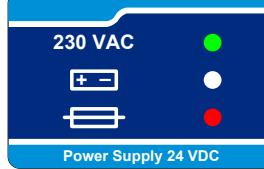
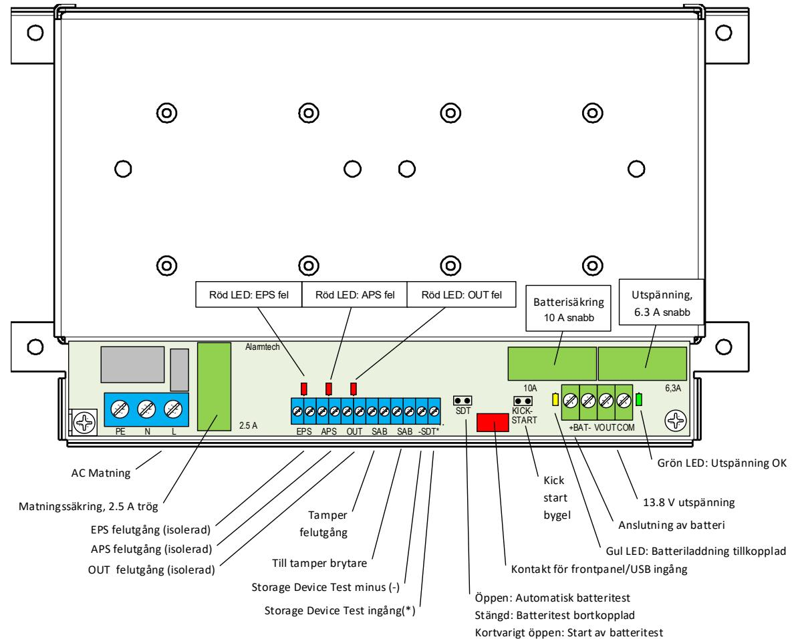

# **Strömförsörjning**

# **Datablad, Installationsanvisning och Bruksanvisning för PSV 12V serien**

# **BESKRIVNING**

Alarmtechs serie med 12V strömförsörjningar PSV 1265, PSV 1235 och PSV 1215 är strömförsörjningsenheter med batteriladdning och plats för 1 eller 2 st (parallella) 12V batterier. De uppfyller normen EN 50131-6:2017, Säkerhetsklass 3. Dessa skall anslutas till nätet med ett frånkopplingsdon som ligger nära och är lätt tillgängligt.

De har alla den unika funktionen ViP (Voltage in Parallell) som har utvecklats av Alarmtech. Strömförsörjningsaggregat med ViP funktion kan parallellkopplas, både plus (+) och minus (-) på samma matningsslinga utan extra synkronisering. Enheter anslutna på slingan kommer att dela på lasten. ViP funktionen kan användas för att bygga distribuerade och felsäkra strömförsörjningsanläggningar (redundans). Genom att placera ytterligare ViP aggregat på slingan kan ViP funktionen användas för att kompensera för spänningsfall.

Spänningsomvandlingen baseras på en högfrekvent SMPS resonans mode regulator med hög verkningsgrad och liten inre värmeutveckling som skyddar batterierna från överhettning. Den processorstyrda batteriladdningen arbetar under första delen av laddningen med konstant ström och begränsad spänning, för att när batterierna är tillräckligt laddade övergå till konstant spänning. Det är den mest avancerade och den bästa metoden för att erhålla längsta möjliga batterilivslängd.

Strömförsörjningsaggregaten har inbyggd självdiagnostik som indikerar nätspänninsbortfall, olika typer av batterifel, låg utspänning och säkringsfel.

- Strömförsörjning till 12 V installationer för larmsystem och industriella anläggningar
- Distribuerad strömförsörjning för att kompensera för spänningsfall och för att bygga felsäkra system.

# **EGENSKAPER**

- Larmklass 3 enligt SS-EN 50131-6:2017, SSF1014-5
- Typ A nätanslutning med laddningsbara batterier
- Utspänning 13,8 VDC
- Max totalt strömuttag 6,5A (PSV 1265)
- Max strömuttag till anläggning 6,0A (PSV 1265)
- ViP (Voltage-in-Parallell) funktionen utökar säkerheten och kapaciteten i systemet. Strömförsörjningsenheter med ViP kan anslutas parallellt och delar lasten utan extra synkronisering oberoende märkströmmen för varje ansluten enhet.
- Plats för och kapacitet att ladda upp till två 12 V/40 Ah slutna blyackumulatorer om man önskar parallellkoppling (låda A1, se nedan).
- Kortslutningsskydd och överbelastningsskydd
- Detektering av nätspänningsbortfall (EPS-fel)
- Detektering av låg utspänning (OUT-fel)
- Detektering av säkringsfel (OUT-fel)
- Detektering av olika typer av batterifel (APS-fel) t.ex om batterier inte inkopplade, för låg batterispänning eller hög intern resistans
- Djupurladdningsskydd som kopplar bort batterierna vid för låg batterispänning
- Lokal eller fjärrstyrd start av batteritest
- Sabotageskydd mot öppning eller bortbrytning av skåpet
- Anslutna batterier skall ha minst Flamklass V-2

# **TILLÄMPNINGAR**

# **1. Kombinationer av strömförsörjningar och lådor**

Det finns en rad olika kombinationer av strömförsörjningar (moduler) och lådor för att kunna hitta en lösning till specifika behov:

#### **12V moduler**

| PSV 1265-M | 12V, 6.5A |
|------------|-----------|
| PSV 1235-M | 12V, 3.5A |
| PSV 1215-M | 12V, 1.5A |

#### **Väggmonterade lådor [BxHxD]**

- **A1** 425x440x200mm, 2x40Ah batterier
- **B1** 265x385x115mm, 1x(7Ah, alt. 12Ah, alt 18Ah)
- **B2** 385x385x115mm, 2x(7Ah, alt. 12Ah, alt 18Ah)
- **B3** 385x575x115mm, 2x(7Ah, alt. 12Ah, alt 18Ah)

### **Rackmonterade lådor [BxHxD]**

- **R1** 482x132x292mm, 2x(7Ah alt. 12Ah) batterier
# **2. INSTALLATION av PSV 1265-M (här i låda B1)**

# **INSTALLATION**

#### **PSV 1265-B1-18 Installationsanvisning och Uppstart:**

- Enheten måste anslutas till nätet med ett frånkopplingsdon som ligger nära och är lätt tillgängligt
- Säkerställ att 230 VAC kabeln inte är ansluten till elnätet av säkerhetsskäl när du jobbar.
- Montera enheten med hjälp av de 4 fästhålen
- Placera en sluten blyackumulator 12 V/18Ah (med Flamklass minst V-2 enligt UL) i botten av kapslingen
- Anslut batteri (+) med röd batterikabel
- Anslut batteri (-) med svart batterikabel
- Anslut utrustningen som skall spänningsmatas till utspänning 13,8 VDC.
- Om felutgångar/styringång för batteritest (utgång EPS, APS, OUT, SAB, ingång –SDT*) skall användas, anslut dessa till extern utrustning
- Anslut 230 VAC kabeln till ingång 230 VAC, säkerställ att jordning sker på korrekt sätt
- **OBS!** Av säkerhetsskäl är batterierna bortkopplade när nätspänningen inte är tillkopplad. Innan nätspänningen är ansluten kan anläggningen drivas med enbart batterierna men då måste kick-starten användas för att öppna den elektroniska spärren.
- Slå på nätspänningen. PSV 1265-40 kommer att starta automatiskt och leverera ström till anläggningen och övervaka alla funktioner

# **3. TEKNISK BESKRIVNING**

# 3.1 Indikeringspanel på locket

Samtliga lådor för PSV har en indikeringspanel på lådans framsida som visar aktuell status. Panelens tre lysdioder indikerar:

Grön LED: Nätspänning OK – enheten är i EPS läge och matas från elnätet Gul LED: Nätspänning saknas - enheten är i APS läge och matas från batteri Röd LED: Fel detekterat – identifiering av fel är möjligt med hjälp av lysdioderna på kretskortet.

**Enheten OK** Matas från elnätet Batteri OK Utgång OK Inga fel

(EPS utgång aktiv) Matas från batteri Inga andra fel

**FEL på enheten** Matas från elnätet Möjliga fel: APS (batteri) OUT (utspänning)

**230 VAC Power Supply 24 VDC + _ FEL på enheten**

Saknar nätspänning Matas från batteri Möjliga fel: APS (batterispänning låg) OUT (säkringsfel)

# 3.2 Interna indikeringar på kretskortet samt anslutningar i strömförsörjningsenheten

Elektronikens funktion visas med lysdioder (LED) på kretskortet för snabb identifiering. I bilden nedan visas placeringen av statusdioderna. Förklaring till diodernas färger är följande:

- Grön Normalt läge, OK
- Röd Fel detekterat
- Gul Informationsindikering

Storleken på säkringarna beror på modultyp

# 3.3 Byglingar:

Strömförsörjningsmodulen har två bygelfält som är placerade på kretskortet markerade med SDT och Kickstart:

### **SDT (**Storage Device Test**)**

När den byglas kopplas batteriet från installationen om den är ansluten till nätet (230 VAC), ansluter batteriet till en intern belastning och mäter batteriets interna motstånd. Om värdet inte ligger inom de gränser som definieras av batterikapaciteten aktiveras APS-fel. Denna funktion körs vid uppstart och sedan automatiskt var tionde timme. Testen kan aktiveras manuellt med bygeln på kretskortet eller fjärraktiveras om SDT-terminal är ansluten. Standardläget är öppen och aktivering av testen görs genom en kortvarig bygling till minus. Om SDT permanent byglas är batteriladdningen inaktiverad.

**VARNING**: Koppla inte in batteriet i detta läge eftersom det då kommer att laddas ur. DDP kommer fortfarande vara aktiv för att undvika permanent skada på batteriet.

|  | SDT Batterifunktion (Storage Device Test) bygel (default-läge: öppen) |  |  |
|--|-----------------------------------------------------------------------|--|--|
|--|-----------------------------------------------------------------------|--|--|

| Kortvarig bygling | Batteritest aktiverat (30 sek test av batteriets resistans) |  |
|-------------------|-------------------------------------------------------------|--|
| Öppen (default)   | Batteriladdning aktiverad                                   |  |
| Stängd            | Batteriladdning avstängd                                    |  |

#### **Kickstart**

NOTERA: Under installation utan elnät, men batteri anslutet, kommer det inte att finnas någon utspänning från PSV. Genom en kortvarig kortslutning av kickstart-bygeln kommer utspänningen att aktiveras och anläggningen matas från batteriet. Denna funktion är till för att förhindra att batteriet urladdas av misstag under installationen. Kickstart bygel - Kortslut kortvarigt för att starta PSV utan att matningsspänningen är ansluten

| Kortvarig bygling | "Kick-start" av enheten från batteri (utan nätanslutning) |
|-------------------|-----------------------------------------------------------|
| Öppen (default)   | Djupurladdningsskydd (DDP) av batteri aktiverat           |
| Stängd            | Djupurladdningsskydd (DDP) av batteri avstängt            |

#### 3.4 In- och utgångar

| Ingång / Utgång     | Märkning  | Beskrivning                                                                  |
|---------------------|-----------|------------------------------------------------------------------------------|
| Nätspänning         | PE, N, L  | 230 VAC, skyddsjord, nolla och fas                                           |
| Spänningsutgång     | VOUT, COM | Plus och minus till systemet                                                 |
| Batterianslutning   | + BAT -   | Plus och minus för 12 V batteri                                              |
| Nätfelsutgång       | EPS       | Potentialfri NC opto reläutgång indikerar EPS fel (External Power Supply)    |
| Batterifelsutgång   | APS       | Potentialfri NC opto reläutgång indikerar APS fel (Alternative Power Supply) |
| Spänningsfelsutgång | OUT       | Potentialfri NC opto reläutgång indikerar OUT fel                            |
| Batteritestingång   | -SDT*     | Test aktiveras vid tillfällig bygling mellan (-) och (*)                     |
| Sabotageutgångar    | 2xSAB     | För seriekoppling av öppnings-och bortbrytningskontakt                       |

# **4. TEKNISKA DATA (PSV 1265/PSV 1235/PSV 1215)**

| Typ av strömförsörjning:       | Typ A med batteriladdning,                                    |
|--------------------------------|---------------------------------------------------------------|
| Nominell inspänning:           | 230 VAC +/-15 %, 0.9 A/0.6 A/0.4 A med maximal last, 50 Hz    |
| Utspänning:                    | 13.8 VDC                                                      |
| Maximalt rippel:               | < 50mV                                                        |
| Totalt maximalt strömuttag:    | 6.5 A/3.5 A/1.5 A                                             |
| Max ström till anläggningen    | 6.0 A/3.0 A/1.3 A                                             |
| PSV 1265                       |                                                               |
| Max ström i säkerhetsklass 3   | 1.33 A (30 tim. batteridrift med 40 Ah batteri)               |
| Max ström i säkerhetsklass 2   | 3.33 A (12 tim. batteridrift med 40 Ah batteri)               |
| Maximal batteriladdningsström: | 1.5 A i säkerhetsklass 3 ger en återuppladdning på ca 24 tim. |
|                                | 0.5 A i säkerhetsklass 2 ger en återuppladdning på ca 72 tim. |
| PSV 1235                       |                                                               |
| Max ström i säkerhetsklass 3   | 1.33 A (30 tim. batteridrift med 40 Ah batteri)               |
| Max ström i säkerhetsklass 2   | 3.33 A (12 tim. batteridrift med 40 Ah batteri)               |
| Maximal batteriladdningsström: | 1.5 A i säkerhetsklass 3 ger en återuppladdning på ca 24 tim. |
|                                | 0.5 A i säkerhetsklass 2 ger en återuppladdning på ca 72 tim. |

Batterispänning som aktiverar APS fel: 11 V Batterispänning som aktiverar DDP krets: 10.6 V Utspänning som aktiverar OUT fel: 12.5 V Övervakningsutgångar: EPS – Nätspänningsfel

Logisk data på statusutgångar: Sluten – inget fel (OK)

Bekräftelse på fjärrstyrd batteritest: APS utgång Lokalt batteritest: SDT bygel, tillfällig bygling Miljöklass enligt EN 50130-5:1998: Class II Safety: EN 62368-1:2014/AC:2015 EMC: EN 61000-6-3

Lådans ytterdimensioner: Se sidan 2 Vikt utan batterier: A1 ca 9.5 kg

Max ström i säkerhetsklass 3 0.4 A (30 tim. batteridrift med 12 Ah batteri) Max ström i säkerhetsklass 2 1 A (12 tim. batteridrift med 12 Ah batteri) Maximal batteriladdningsström: 0.5 A i säkerhetsklass 3 ger en återuppladdning på ca 24 tim. 0.2 A i säkerhetsklass 2 ger en återuppladdning på ca 72 tim. Batterityp: 1-2st 12 V/7 Ah-40 Ah blyackumulatorer (slutna) i parallellkoppling. Flamklass minst V-2 enligt UL. Batteriladdningsmetod: Initialt konstant ström, sedan konstant spänning APS – Batterifel OUT – Utspänning låg, Nätdelsfel SAB – Kapslingssabotage Elektriska data på statusutgångar: Optoreläer för EPS, APS, OUT, max ström 100mA. Microswitchar för öppnings-/bortbrytningsskydd. Öppen – fel (LARM) Ingång för fjärrstyrd batteritest: -SDT* - slutning mellan (-) och (*) aktiverar 30 sek test av intern batteriresistans Automatisk batteritest: Aktiveras automatiskt var 10:e timme Arbetstemperatur och luftfuktighet: -10° C…+40° C, RH till 90 %, ingen kondensering Certifieringar: SSF1014-5 Larmklass 3, Miljöklass II EN 50131-6:2017 Grade 3 B1 ca 4 kg B2 ca 5 kg B3 ca 7 kg

PSV 12V serien 2113se 6 ©2021 Alarmtech

R1 ca 7.5 kg