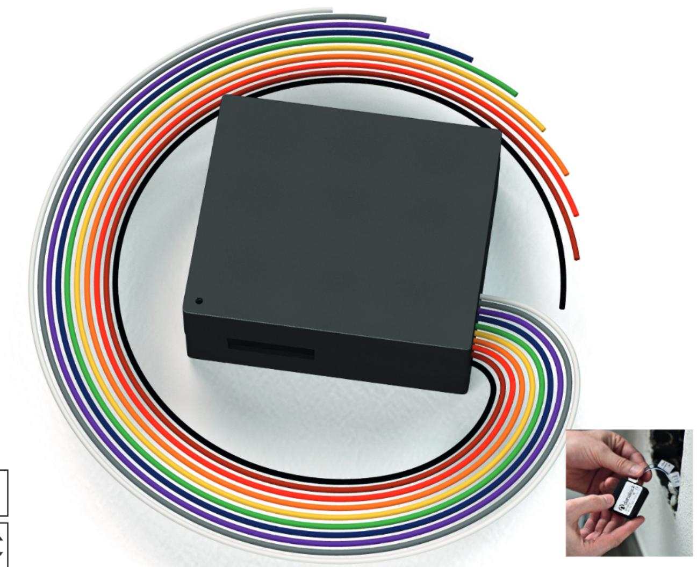
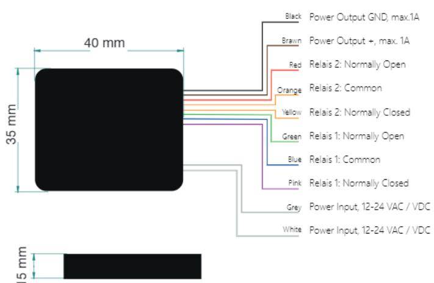

## DATASHEET

# Danalock Universal module for Electric locking systems

The Danalock Universal module is a special device that enables you to control doors as garage doors, doorstrikes, electromechanical or magnetic locks, gates, windows, shades ... using your mobile phone through the Bluetooth Low Energy (BLE) technology.

The Danalock V3 evolution is based on the feedback from devoted customers and the latest development in data security and smart home technology.

www.saltosystems.com

# TECHNICAL SPECIFICATION: DANALOCK UNIVERSAL MODULE (D0xU)

Publications of SALTO SYSTEMS S.L. are protected by copyright and all rights are reserved. SALTO SYSTEMS publications may not be reproduced in any form or by any means without written permission from the copyright owner.

#### TECHNICAL DATA:

| Product dimensions: (H x W x D):: | 35 x 40 x 15 mm                              |
|-----------------------------------|----------------------------------------------|
| Weight:                           | 14Gms                                        |
| Material:                         | ABS                                          |
| Colour available:                 | Black                                        |
| Power source1:                    | 12-24V 1amp solid or battery power supply |
| Operating voltage range:          | 12-24V DC, 12-24V AC.                        |
| Max input (at 24V):               | 100mA                                        |
| Number of relays:                 | 2                                            |
| Type of relays:                   | Potential-free cotntacts (NO/NC)          |
| Max AC power:                     | 1A at 12V                                    |
| Max AC current:                   | 1A at 12V                                    |
| Max relay voltage:                | 48 V                                         |
| Environmental conditions:         | 0 °C / +60 °C.                               |
| IP class:                         | Not suitable for outdoor use.                |
| Certifications:                   | CE, FCC/IC                                   |
| Bluetooth range                   | 5-10 meters                                  |

### ACCESS CONTROL FEATURES:

#### Users & doors:

| Unlimited |
|-----------|
| Unlimited |
| Unlimited |
|           |

#### Calendars & time zones:

| Calendars in system: |           |
|----------------------|-----------|
| Timetables:          | Unlimited |
| Time periods:        |           |
|                      |           |

#### Events:

| Maximum events on lock audit: |                                                                     |
|-------------------------------|---------------------------------------------------------------------|
|                               | Events are automatically sent to the Danalock cloud database. |
| ID TECHNOLOGIES:              |                                                                     |
| Bluetooth Smart BLE:          |                                                                     |
| Smartphone OS compatibility:  | IOS 9 or superior                                                   |
|                               | Android 6.0 or superior                                             |

### WIRELESS TECHNOLOGIES:

| Zigbee:                        |        |
|--------------------------------|--------|
| Z-Wave regional compatibility: | EU     |
|                                | വട     |
|                                | AUS-NZ |
|                                | Japan  |

#### TECHNICAL DRAWING:

#### PLATFORMS:

#### Host-based access control:

| Smile - Selfprogrammable |  |
|--------------------------|--|
| ROM:                     |  |
| SVN data-on-card:        |  |
| SALTO BLUEnet:           |  |
| SALLIS:                  |  |
|                          |  |

### Cloud-based locking solution:

| SALTO KS:          |  |
|--------------------|--|
| Danalock platform: |  |

### INTEGRATIONS:

#### Hardware integration:

| Zigbee: | Samsung SmartThings       |
|---------|---------------------------|
| Z-Wave: | Vera Smarter Home control |
|         | Amazon Echo               |
|         | Nest                      |
|         | IFTTT                     |
|         | Logitech Harmony          |
|         |                           |

### Cloud integration:

Airbnb:

#### 1 Power supply not included, as to be ordered separately 2 Frecuencies depend on diferent hardware

