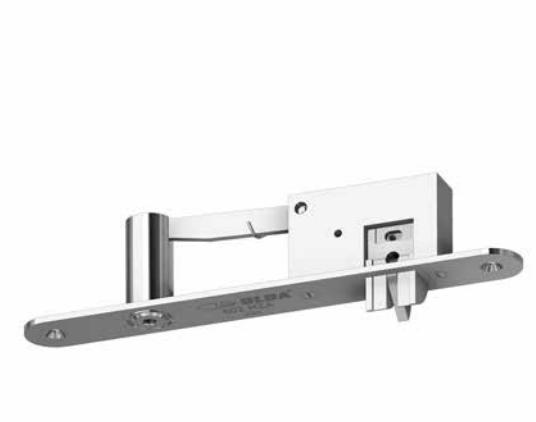
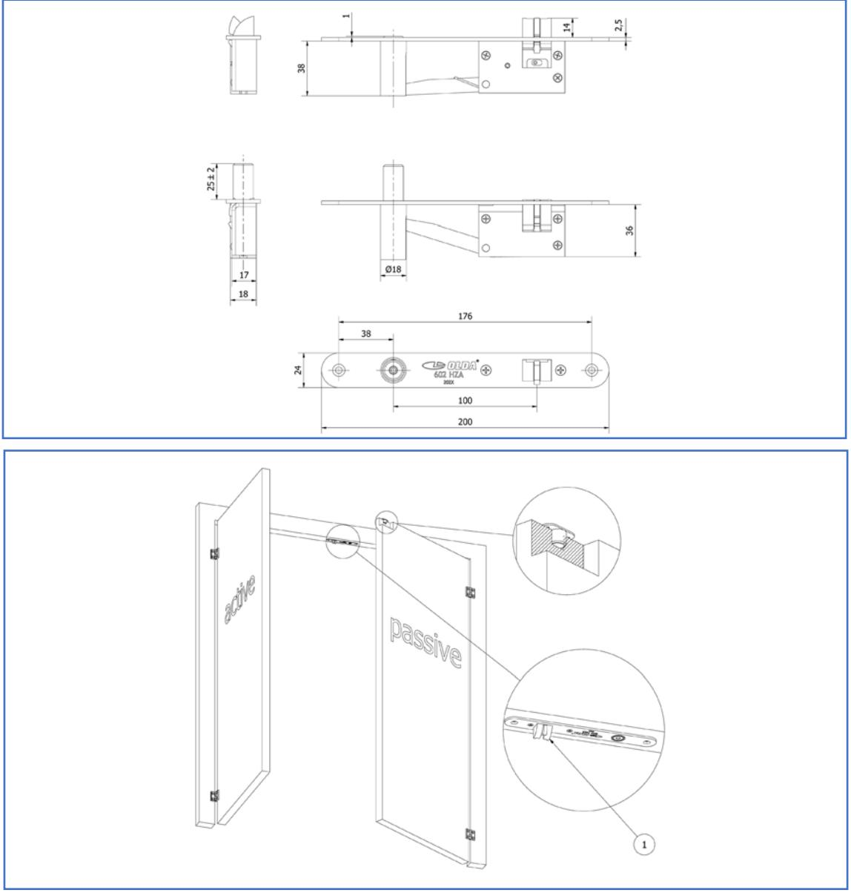

# **Automatisk karmregel OLDA 602 HZA typ 1**

# **Funktion:**

Automatisk, enkelverkande karmregel för tvingande regling av passivt dörrblad i pardörrar.

# **Egenskaper:**

OLDA 602 HZA reglas & avreglas automatiskt, har regeldiameter 14 mm, stolpbredd 24 mm och centrumavstånd 100 mm mellan regel och kolv.

# **Användning:**

Fälls in upptill i stål- & aluminiumprofildörrkarmar i dörrpartier där det högra dörrbladet är passivt, särskilt där stränga brandkrav föreligger.

## **Montage:**

OLDA 602 HZA monteras infällt i dörrkarmen, antingen med eller utan urtag för stolpen, med minimalt ingrepp i det passiva dörrbladet. Fästs med två försänkta 4,0 x 20 mm skruvar.

#### **Behör:**

Slutbeck LT 14 (17x15) fästs med två försänkta 3,5 x 16 mm skruvar. Glidbleck SP 20 fästs med två försänkta 4,2 x 16 mm skruvar.

## **Specifikation:**

- Automatisk, enkelverkande och tvingande regelfunktion
- Regel av rostfritt stål:
	- o diameter: 14 mm
	- o projektion: 25 mm
	- o justermån: -2 / +2 mm
- Rund stolpe av rostfritt stål
- Produkt:
	- o bredd: 24 mm
	- o längd: 200 mm
	- o djup: 40,5 mm
	- o stolptjocklek: 2,5 mm
	- o c/c regel/kolv: 100 mm
- Material:
	- o stål
	- o regel & stolpe rostfritt stål
- Ytbehandling: elförzinkning

# **Produktserie OLDA karmreglar:**

- 602 HZA typ 1 (c/c = 100 mm) o (10-602-1)
- 602 HZA typ 2 (c/c = 100 mm) o (10-602-2)
- 600 HZA typ 1, (c/c = 60 mm)
- 600 HZA typ 2, (c/c = 60 mm)

# **Service:**

Funktions- & systemtest rekommenderas en till två gånger per år. Testa, smörj och justera rörliga delar vid behov.

Vid krävande miljöer eller hög passagefrekvens bör karmregeln testas oftare.

#### **Garanti:**

Mekaniska produkter med varumärke "OLDA" har 36 månaders fabriksgaranti.

# **Automatisk karmregel OLDA 602 HZA typ 1**

#### **Produktdokument:**

- Mått
- Montering med urtag för stolpe
- Montering utan uttag för stolpe

#### **Produktvyer – 2D:**

- PDF
- DXF
- DWG

#### **Produktmodeller – 3D:**

- STEP
- DWG
- PDF 3D

#### **OLDA produktlänkar:**

- Automatisk karmregel 602 HZA
- Behör kantreglar
- OLDA kantreglar
- OLDA beslagsskolan