# DD1012AM(-D)-N Dual Detector Installation Sheet

**EN DA DE ES FR IT NL PL PT SV**

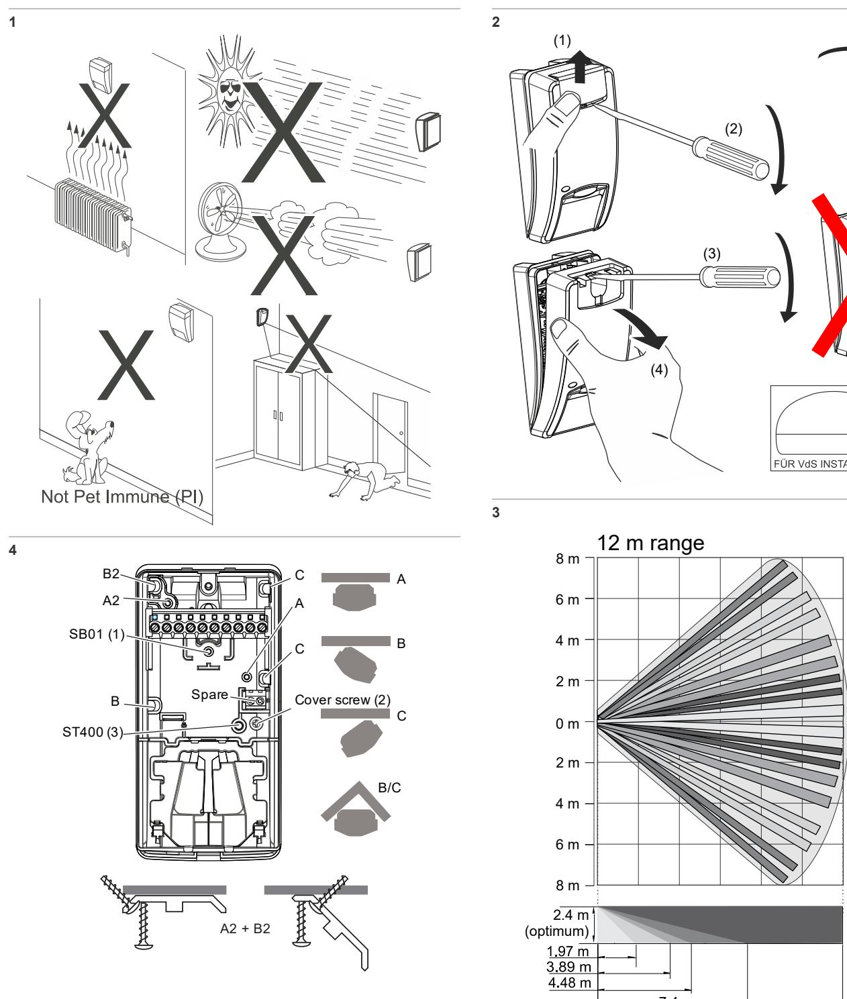

12.0 m

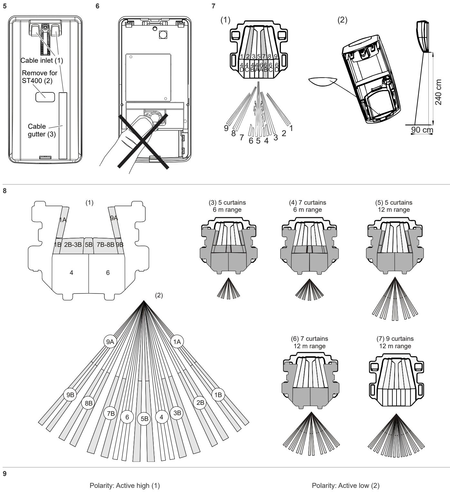

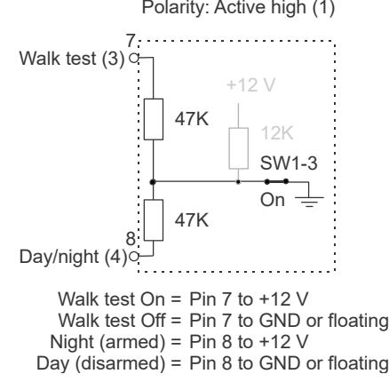

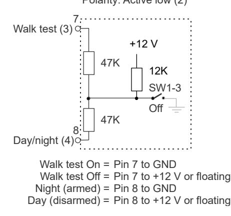

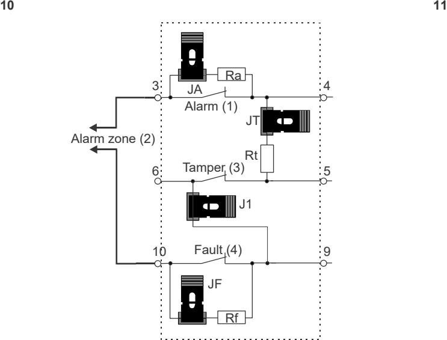

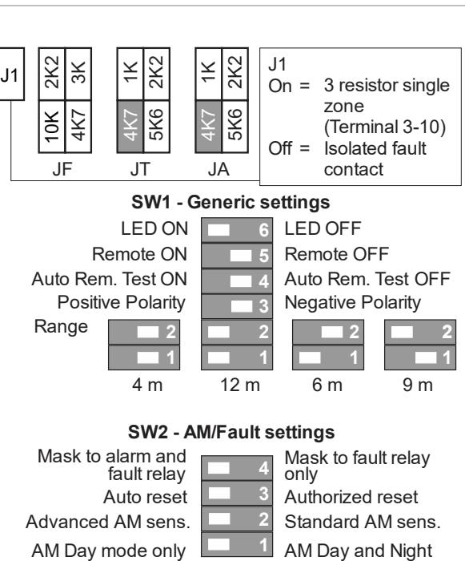

**12**

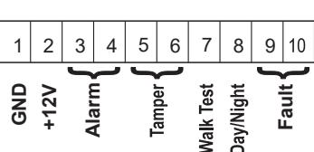

**13**

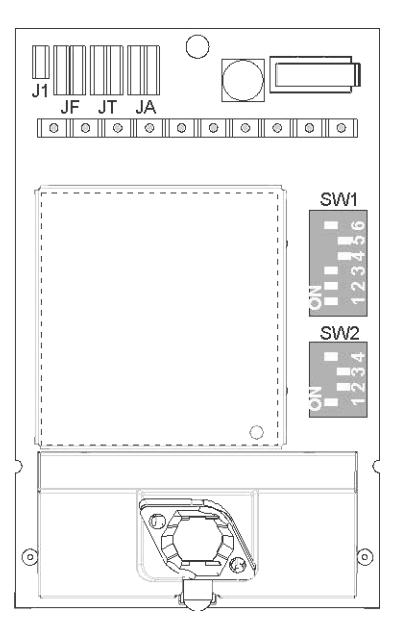

**14**

#### **Single zone EOL**

| Zone state     | Value    | Default |  |
|----------------|----------|---------|--|
| Tamper (short) | 0 Ω      | 0 Ω     |  |
| Normal         | Rt       | 4.7 kΩ  |  |
| Alarm          | Rt+Ra    | 9.4 kΩ  |  |
| Fault          | Rt+Rf    | 14.7 kΩ |  |
| AM*            | Rt+Ra+Rf | 19.4 kΩ |  |
| Tamper (open)  | ∞        | ∞       |  |

* SW2-4 must be set to On.

# **EN: Installation Sheet**

### **Description**

DD1012AM(-D)-N is a dual AM motion sensor.

It combines the patented PIR mirror optics technology with the patented Range Controlled Radar technology.

### **Installation guidelines**

See Figure 1.

The detector is intended to be mounted on walls but can also be mounted on ceilings by using a mounting bracket.

Use the following guidelines to determine the best location to install the detector.

- Mount the detector so the expected movement of an intruder is across the detection pattern (see Figure 3).
- Mount the detector at a stable surface. For the allowed mounting height, see "Specifications" on page 7.
- Do not mount the detector within 0.5 m of metallic objects or within 1.5 m of fluorescent lights.
- Do not place objects in front of the detector that may prevent a clear line of sight.
- Place detectors at least 6 m apart, and use the shortrange setting to avoid interference, when mounting detectors face to face.

The dual technology processing of this detector is very resistant to false alarm hazards. However, avoid potential causes of instability, such as:

#### PIR hazards:

- Direct sunlight on the detector
- Heat sources within the detector field of view
- Strong air draughts onto the detector
- Animals in the field of view
- Obscuring the detector field of view with large objects, such as furniture

#### Microwave hazards:

- Mounting surface susceptible to vibrations
- Metal surfaces reflecting microwave energy
- Water movement through plastic pipes
- Moving or vibrating objects like fans, heating, or airconditioning ducts

### AM hazards:

- Moving objects less than 1 m in front of the detector
- Small insects on the detector
- Modern fluorescent lighting in close proximity (within 1.5 m)

**WARNING!** The equipment is not earthed. Any external circuit connected to the equipment must be located within the same building and connected to a protective earthing conductor.

Wire insulation of cables connected to the equipment must conform to IEC 60332-1-2 and IEC 60332-1-3 or IEC 60332- 2-2, depending on the wire cross sectional area, or IEC TS 60695-11-21, regardless of cross-sectional area. Alternatively, such wires must comply with UL 2556 VW-1.

The detector power supply source must be power limited at 15 W.

We recommend that the detector is regularly walk tested and checked at the control panel.

#### **To install the detector:**

- 1. Lift off the custom insert (see Figure 2, items 1 and 2).
- 2. Using a screwdriver, carefully prise open the detector (see Figure 2, items 3 and 4).

**Caution:** Do not touch the pyroelectric sensor (Figure 6).

- 3. Take out the cover screw (Figure 4, item 2).
- 4. Fix the base to the wall. For the allowed mounting height, see "Specifications" on page 7.

See Figure 4. In all positions use a minimum of two M4 screws from the standards DIN 7505B, DIN 96, DIN 7996, or a screw with a head with 8 mm diameter and a flat surface.

- For flat mounting, use screws in positions A.
- For corner mounting, use screws in position B or C.

**Note for EN 50131 Grade 3 installations:** Do not use mounting position C. It is required to use both mounting holes A2 and B2 for mounting positions A and B.

- To install the pry-off tamper ST400, use mounting positions A. ST400 mounting position is shown as item 3 in Figure 4. Open the outlet in the back plate (Figure 5, item 2).

- 5. Wire the detector (see Figures 4 and 12). Use back plate cable inlets (Figure 5, item 1) and cable gutter (Figure 5, item 3).
- 6. Select the desired jumper and DIP switch settings. See "Setting the detector" below for more information.
- 7. Remove the blinders and add the stickers, if required. See "Configuring the coverage pattern" on page 6 for more details.

- 8. For ceiling-mount applications, use the SB01 swivel-mount bracket. SB01 mounting position is shown as item 1 in Figure 4.
**Note:** Using SB01 is not compliant with EN 50131 Grade 3 installations.

- 9. Close the cover, insert the cover screw, and place the custom insert.
### **Connections**

See Figure 12.

#### **Table 1: Detector Connections**

| Terminal | Label        | Explanation                                                                                                                                                                                                                                                   |
|----------|--------------|---------------------------------------------------------------------------------------------------------------------------------------------------------------------------------------------------------------------------------------------------------------|
| 1, 2     | GND, +12V | Power supply connection (9 to 15 V, 12 V nominal)                                                                                                                                                                                                        |
| 3, 4     | ALARM        | Alarm relay output (33 Ω). Use jumper JA to set the onboard EOL resistor in series with the relay. See "Jumpers" below.                                                                                                                                 |
| 5, 6     | TAMPER       | Tamper switch output (0 Ω). Use jumper JT to set the onboard EOL resistor in series with the switch. See "Jumpers" below.                                                                                                                               |
| 7        | Walk test    | This input enables and disables the LED (walk test On/Off). Walk test mode can only be entered when detector is in Day mode (pin 8). Active high or low is determined by SW1-3 (see "SW1-3: Polarity" on page 5).                                 |
| 8        | Day/Night    | This input switches the detector in day (show memory on the LED indicator) or night mode (activates the alarm memory and clears previous stored alarms). Active high or low polarity is determined by SW1-3 (see "SW1-3: Polarity" on page 5). |
| 9, 10    | Fault        | Fault Relay output (33 Ω). Use jumper JF to insert one of the on-board EOL resistors in series with the relay. See "Jumpers" below for the correct resistor settings.                                                                                |

#### **Notes**

- Inputs 7 and 8 are only useable when SW1-5 is set to Remote on. See "SW1-5: Remote functionality" on page 6.
- The LED is only enabled when SW1-6 is set to LED on.

Figure 10 explains how to create a single zone with multiple resistor configuration.

#### **Figure 10**

- (1) Alarm relay
- (2) Alarm zone
- (3) Tamper switch output (4) Fault relay
- Rt Tamper EOL resistor
	- Rf Fault EOL resistor

Ra Alarm EOL resistor

### **Setting the detector**

See Figure 13 for jumpers and DIP switch location.

### **Jumpers**

Jumpers set onboard EOL mode and value. The circuit is shown in Figure 10.

**JA: Set onboard alarm EOL resistor (Ra)**

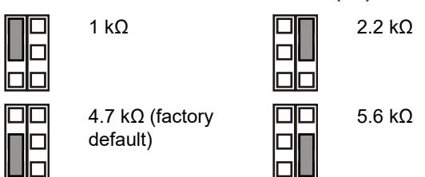

Off: No onboard alarm EOL.

### **JT: Set onboard tamper EOL resistor (Rt)**

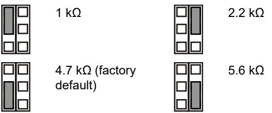

Off: No onboard tamper EOL.

#### **JF: Set onboard fault EOL resistor (Rf)**

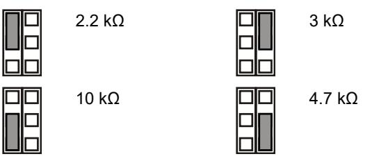

Off: No onboard fault EOL (factory default).

#### **J1: Set zone EOL mode**

On: 3-resistor single zone.

Off: Isolated fault contact and 2-resistor zone.

#### **Configuring the zone**

To set up the zone, apply the following guidelines.

- Select appropriate EOL resistor values with JA, JT and JF. For example, setting of jumper JT determines Rt value.
- For isolated outputs remove JT and J1.
- Remove jumpers JA, JT and JF to exclude onboard EOL values.
- For dual resistor setting remove J1 and use terminal 3 and 6.

For a single zone with all onboard resistors set, the zone resistance can be the following.

#### **Table 2: Zone resistance values**

| Zone state     | Value    | Default |  |
|----------------|----------|---------|--|
| Tamper (short) | 0 Ω      | 0 Ω     |  |
| Normal         | Rt       | 4.7 kΩ  |  |
| Alarm          | Rt+Ra    | 9.4 kΩ  |  |
| Fault          | Rt+Rf    | 14.7 kΩ |  |
| AM             | Rt+Ra+Rf | 19.4 kΩ |  |
| Tamper (open)  | ∞        | ∞       |  |

### **DIP switches**

#### **Table 3: SW1, general settings**

| Switch                 | Values                                |                                       |
|------------------------|---------------------------------------|---------------------------------------|
| 6: LED                 | On: LED on*                           | Off: LED off                          |
| 5: Remote              | On: Remote on                         | Off: Remote off*                      |
| 4: Auto remote test | On: Auto remote test enabled       | Off: Auto remote test disabled*    |
| 3: Polarity            | On: Positive polarity                 | Off: Negative polarity*               |
| 1, 2: Radar range   | 1 On, 2 On: 12 m* 1 Off, 2 On: 9 m | 1 On, 2 Off: 6 m 1 Off, 2 Off: 4 m |

* Factory default

#### **Table 4: SW2, AM settings**

| Switch                  | Values                               |                                 |
|-------------------------|--------------------------------------|---------------------------------|
| 4: AM signalling        | On: AM to fault and alarm relays* | Off: AM to fault relay only  |
| 3: Reset                | On: Auto reset*                      | Off: Authorised reset           |
| 2: AM sensitivity       | On: Advanced AM sensitivity*      | Off: Standard AM sensitivity |
| 1: AM day/night mode | On: AM day mode only*                | Off: AM day and night           |

* Factory default

### **DIP switch SW1, general settings**

#### **SW1-1, SW1-2: Radar range**

Use SW1-1 and SW1-2 to set the radar range exactly to fit the application. The radar is of a range-gating type which means that the range of detection is very accurate.

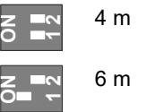

#### **SW1-3: Polarity**

On: Positive polarity. Configures the inputs (WT and D/N) as "Active high".

Off: Negative polarity. Configures the inputs (WT and D/N) as "Active low". Factory default.

The functionality is explained in Figure 9.

#### **Figure 9**

| (1) | Polarity high | (3) | Walk test |
|-----|---------------|-----|-----------|
| (2) | Polarity low  | (4) | Day/night |

This function also depends on the SW1-5 setting. See "SW1-5: Remote functionality" on page 6.

#### **SW1-4: Auto remote test**

On: Auto remote test on. Enables Auto remote test.

Off: Auto remote test off. Disables Auto remote test (factory default).

If auto remote test is enabled, the control panel can trigger the detector to perform a diagnostic test. This test is activated by switching to walk test mode (day mode and WT enabled). The detector activates the alarm relay if the test result is positive,

and the fault relay if the test result is negative. After the test the detector continues with normal operation.

This function also depends on the SW1-5 setting. See "SW1-5: Remote functionality" below.

#### **SW1-5: Remote functionality**

On: Remote on. Enables WT and day/night inputs.

Off: Remote off. Disables WT and day/night inputs (factory default).

The following functionality depends on the Remote setting.

|  | Table 5: Functions dependent on the Remote setting |  |  |  |
|--|----------------------------------------------------|--|--|--|
|  |                                                    |  |  |  |

| Item  | Description          | SW1-5 Remote on                                     | SW1-5 Remote off |
|-------|----------------------|-----------------------------------------------------|------------------|
| SW1-3 | Polarity             | Selectable                                          | Positive only    |
| SW2-1 | AM day/night mode | Selectable                                          | AM day and night |
| SW2-3 | Reset                | Selectable                                          | Auto reset       |
| WT    | WT input             | Enabled                                             | Disabled         |
| D/N   | D/N input            | Enabled                                             | Disabled         |
| Other | Green Mode           | Enabled in day mode with no WT                   | Disabled         |
|       | Alarm memory         | Enabled in day mode with no WT                   | Disabled         |
|       | Remote test          | Performed after switching to day mode with WT | Disabled         |

See also "Connections" on page 4.

#### **SW1-6: LEDs**

On: LEDs are enabled. See "LEDs and outputs" on page 7 for LED functionality.

Off: LEDs are disabled for any state.

### **DIP switch SW2, AM settings**

#### **SW2-1: AM day/night mode**

On: AM day mode only. AM detection is only operating during the day mode (factory default).

Off: AM day and night. AM detection is always operating (day and night mode).

This function also depends on the SW1-5 setting. See "SW1-5: Remote functionality" above.

#### **SW2-2: AM sensitivity**

On: Advanced AM sensitivity. The detector signals the AM area masking (factory default).

**Note:** This is EN 50131 Grade 3 required configuration.

Off: Standard AM sensitivity. The detector signals the AM area approaching.

#### **SW2-3: Reset**

On: Auto reset. AM alarm state can be reset 40 s after the AM alarm occurs (factory default).

Off: Authorized reset. AM alarm state can only be reset after applying WT mode and day mode.

#### **Notes**

- For the advanced setting (SW2-2 is On) the source of AM alarm needs to be removed before AM reset is allowed.
- If the AM alarm cannot be reset with an auto reset or authorized reset, disconnect the power supply and reconnect again.
- A walk test should be performed to ensure the device settings are appropriate for its application.

This function also depends on the SW1-5 setting. See "SW1-5: Remote functionality" above.

#### **SW2-4: AM signalling**

On: AM to fault and alarm relays. AM alarm is signalled via both alarm and fault outputs (factory default).

**Note:** This is EN 50131 Grade 3 required configuration.

Off: AM to fault relay only. AM alarm is signalled via fault output.

### **AM calibration**

During start-up the AM circuitry calibrates itself to its environment. It is important to make sure that there are no changes made to the environment within 1 m distance of the detector within 60 s after powering up, otherwise the detector may be vulnerable to false AM alarms and these alarms may be impossible to reset.

### **Configuring the coverage pattern**

- Remove blinders (Figure 8, item 1) if necessary. The modified pattern is shown in Figure 8, items 3 to 7.
**Note:** If both blinders are installed, the detector range is limited to 6 m (default).

- Modify the pattern by breaking out blinder parts (shown as gray in Figure 8, item 1). The corresponding curtain fragments are shown in Figure 8, item 2.
- Put the appropriate mirror stickers if necessary. See Figure 7, item 1 for details.

**Caution:** Removing stickers can damage the mirror surface.

- When near objects directly under the detector, fit the mask to the inside of the window (default). This disables the part of the curtains looking down at the object, whose closeness might destabilize the detector. See Figure 7, item 2.
**Note:** Reducing close-in field of view is not compliant with EN 50131 Grade 3 installations.

### **Self test**

The detector continuously monitors the PIR, microwave and AM circuits. Defects are reported to the panel as technical faults.

### **Walk testing the detector**

There are two ways for switching on the walk test mode.

#### **SW1-6 set to LED on, SW1-5 set to Remote off**

In this mode the LED indication is always enabled (constant walk test mode).

#### **SW1-6 set to LED on, SW1-5 set to Remote on**

This setting enables the walk test input (pin 7) and the day/night input (pin 8). This allows the user to activate LED indication remotely by setting the detector into the day mode and activate the walk test.

### **Green mode**

When SW1-5 is set to Remote on, the radar is switched off during the day mode (with no WT) to reduce current consumption. The detector is then operating in PIR only mode.

**Note:** The Day/night line must be connected to the control panel for this mode to work.

This mode is not compliant with the EN 50131-2-4 standard.

**DD1012AM-N only:** For first 180 second of the Green mode operation the detector is switched to high sensitivity PIR mode to enable additional testing, for example, by using an external heat source to test against a significant range reduction. After 180 seconds the detector is switched back to the standard sensitivity.

### **Alarm memory**

When SW1-5 is set to Remote on, alarms that occurred during the night mode are stored in the detector memory. They are indicated by flashing red LED when the unit switches to day mode (walk test disabled). The memory is cleared when the detector switches back to the night mode.

**Note:** Set SW1-6 to Off to prevent showing the alarm memory on the LEDs. See "SW1-6: LEDs" on page 6.

### **LEDs and outputs**

To enable LEDs functionality, set SW1-6 to On, otherwise LEDs are disabled in any condition. See "SW1-6: LEDs" on page 6 for more details.

#### **Table 6: LEDs and outputs**

| Status                        | Red LED | Yellow LED | Alarm relay | Fault relay | To reset                    |
|-------------------------------|------------|---------------|----------------|----------------|-----------------------------|
| Start up                      |            |               | Closed         | Closed         | Automatically after 60 s |
| Low voltage                   |            |               | Open           | Open           | Apply correct voltage    |
| PIR intruder alarm         |            |               | Closed         | Closed         |                             |
| Microwave intruder alarm   |            |               | Closed         | Closed         |                             |
| Dual motion intruder alarm |            |               | Open           | Closed         | Automatically after 3 s  |
| Dual Alarm Memory          |            |               | Closed         | Closed         | Switch to the night mode |

| Status          | Red LED | Yellow LED | Alarm relay      | Fault relay | To reset                |
|-----------------|------------|---------------|---------------------|----------------|-------------------------|
| AM alarm        |            |               | Depends on SW2-4 | Open           | Depends on SW2-3     |
| Technical fault |            |               | Closed              | Open           | Successful walk test |
|                 |            |               |                     |                |                         |

Continuously on Normal blinking (1 Hz)

### **Specifications**

| Detector technology                         | Dual+AM                                         |
|---------------------------------------------|-------------------------------------------------|
| Range                                       | 4, 6, 9, 12 m selectable via SW1-1 and SW1-2 |
| Viewing angle                               | 78 degrees                                      |
| PIR optics                                  | 9 high-density mirror curtains                  |
| Microwave frequency                         | 5725 to 5875 MHz                                |
| Maximum power output                        | 13.46 mW                                        |
| Maximum microwave output at 1 m             | 0.003 μW/cm²                                    |
| Memory function                             | Yes                                             |
| Input power                                 | 9 to 15 V (12 V nominal)                       |
| Peak-to-peak ripple immunity                | 2 V (at 12 V)                                  |
| Detector start-up time                      | 60 s                                            |
| Current consumption                         | 10 to 22 mA (11 mA nom.)                        |
| Mounting height                             | 2 to 2.6 m                                      |
| Target speed range:                         |                                                 |
| DD1012AM-N                                  | 0.2 to 3.0 m/s                                  |
| DD1012AM-D-N                                | 0.1 to 4.0 m/s                                  |
| Alarm (NC) / Tamper relay characteristic | 80 mA 30 V, Form A                             |
| Fault relay characteristic                  | 80 mA 30 V, Form A                             |
| Alarm time                                  | 3 s                                             |
| Operating temperature                       | −10 to +55°C                                    |
| Relative humidity                           | 95% max. noncondensing                          |
| Weight                                      | 120 g                                           |
| Dimensions (H x W x D)                      | 126 × 63 × 50 mm                                |
| IP/IK rating                                | IP30 IK04                                       |
| Pry-off tamper                              | Yes                                             |

### **Regulatory information**

| Manufacturer                        | PLACED ON THE MARKET BY: Carrier Fire & Security Americas Corporation Inc. 13995 Pasteur Blvd Palm Beach Gardens, FL 33418, USA AUTHORIZED EU REPRESENTATIVE: Carrier Fire & Security B.V. Kelvinstraat 7, 6003 DH Weert, Netherlands        |
|-------------------------------------|----------------------------------------------------------------------------------------------------------------------------------------------------------------------------------------------------------------------------------------------------------------|
| Product warnings and disclaimers | THESE PRODUCTS ARE INTENDED FOR SALE TO AND INSTALLATION BY QUALIFIED PROFESSIONALS. CARRIER FIRE &                                                                                                                                                      |
|                                     | SECURITY CANNOT PROVIDE ANY ASSURANCE THAT ANY PERSON OR ENTITY BUYING ITS PRODUCTS, INCLUDING ANY "AUTHORIZED DEALER" OR "AUTHORIZED RESELLER", IS PROPERLY TRAINED OR EXPERIENCED TO CORRECTLY INSTALL FIRE AND SECURITY RELATED PRODUCTS. |

For more information on warranty disclaimers and product safety information, please check https://firesecurityproducts.com/policy/productwarning/ or scan the QR code.

|                          | Carrier Fire & Security hereby declares that this device is in compliance with the applicable requirements and provisions of all applicable rules and regulations, including but not limited to the Directive 2014/53/EU. For more information see: firesecurityproducts.com                                                                              |
|--------------------------|--------------------------------------------------------------------------------------------------------------------------------------------------------------------------------------------------------------------------------------------------------------------------------------------------------------------------------------------------------------------------|
| REACH                    | Product may contain substances that are also Candidate List substances in a concentration above 0.1% w/w, per the most recently published Candidate List found at ECHA Web site.                                                                                                                                                                                |
|                          | Safe use information can be found at https://firesecurityproducts.com/en/content/intrusi on-intro                                                                                                                                                                                                                                                                  |
|                          | 2012/19/EU (WEEE directive): Products marked with this symbol cannot be disposed of as unsorted municipal waste in the European Union. For proper recycling, return this product to your local supplier upon the purchase of equivalent new equipment, or dispose of it at designated collection points. For more information see: recyclethis.info |
| Product documentation | Please consult the following weblink to retrieve the electronic version of the product documentation.                                                                                                                                                                                                                                                              |
|                          | This link will guide you to the EMEA regional contact page. On this page you can request your login to the secured webportal where all manuals are stored.                                                                                                                                                                                                      |
|                          | https://firesecurityproducts.com/en/contact                                                                                                                                                                                                                                                                                                                              |

### **Contact information**

firesecurityproducts.com or www.aritech.com

# **DA: Installationsvejledning**

# **Beskrivelse**

DD1012AM(-D)-N er en kombi detektor med antimask (AM).

Den omfatter den patentbeskyttede PIR-spejloptikteknologi med den patentbeskyttede Range Controlled Radar-teknologi.

# **Installationsvejledning**

### Se figur 1.

Detektoren er beregnet til vægophæng men kan også monteres i loftet med et monteringsbeslag.

Følg denne vejledning til at fastlægge den bedste placering til installation af detektoren.

- Monter detektoren så den forventede bevægelse ved et indbrud er på tværs af detektionsmønstret (se figur 3).
- Monter detektoren på en stabil overflade. For den tilladte monterings højde, se "Specifikationer" på side 12.
- Monter ikke detektoren på en afstand af 0,5 m fra metalgenstande eller 1,5 m fra lysstofarmaturer.
- Placer ikke en genstand foran detektoren, som kan forhindre en direkte synslinje.
- Placer detektorerne mindst 6 m fra hinanden og brug kortafstandsindstillingen til at undgå interferens ved montering af detektorerne rettet mod hinanden.

Detektorteknologien beskytter effektivt mod falske alarmer. Undgå imidlertid mulige årsager til ustabilitet, f.eks.:

### PIR-fare:

- Direkte sollys på detektoren
- Varmekilder inden for detektorens synsfelt
- Kraftig træk på detektoren
- Dyr i synsfeltet
- Blokering af detektorens synsfelt med store genstande som f.eks. møbler

#### Mikrobølgefare:

- Monteringsoverflade modtagelig for rystelser
- Metaloverflader reflekterer mikrobølgeenergi
- Vandbevægelse gennem plastikrør
- Bevægelige eller vibrerende dele som blæsere, varmeeller airconditionkanaler

#### AM-fare:

- Flytning af genstande under 1 m foran detektoren
- Mindre insekter på detektoren
- Moderne lysstofrør i nærheden (under 1,5 m)

**ADVARSEL!** Udstyret er ikke jordet. Ethvert ekstern kredsløb, der er tilsluttet udstyreret, skal være placeret i den samme bygning og tilsluttes en beskyttende jordleder.

Trådisolering af kabler, der er tilsluttet udstyret, skal være i overensstemmelse med IEC 60332-1-2 og IEC 60332-1-3 eller IEC 60332-2-2, afhængig af ledningens tværsnit, eller IEC TS 60695-11-21, uanset af tværsnitsarealet. Alternativ skal sådanne ledninger være i overensstemmelse med UL 2556 VW-1.

Strømforsyning til detektoren skal være begrænset til 15 W.

Vi anbefaler, at alarmen gangtestes med jævne mellemrum, og at kommunikationen med kontrolpanelet kontrolleres.

#### **Sådan installeres detektoren:**

- 1. Tag dækpladen af (se figur 2, pkt. 1 og 2).
- 2. Åbn forsigtigt detektoren med en skruetrækker (se figur 2, pkt. 3 og 4).

**Bemærk:** Rør ikke den pyroelektriske føler (figur 6).

- 3. Tag dækskruen ud (figur 4, pkt. 2).
- 4. Gør soklen fast til væggen. For den tilladte monterings højde, se "Specifikationer" på side 12.

Se figur 4. I alle positioner anvendes mindst to M4 skruer fra standard DIN 7505B, DIN 96, DIN 7996 eller en skrue med et hoved med 8 mm diameter og flad overflade.

- Til flad montering bruges skruer i position A.
- Ved hjørnemontering bruges skruer i position B eller C.

**Bemærk ved EN 50131 Grade 3 installationer:** Må monterings position C ikke benyttes. Der er krævet at begge monterings huller A2 og B2 for monterings position A og B.

- For installation af vægsabotagekontakt ST400 bruges monteringsposition A. ST400-monteringsposition vises som pkt. 3 i figur 4. Åbn kontakten i bagpladen (figur 5, pkt. 2).

- 5. Tilslut detektoren (se figur 4 og 12). Brug bagpladens ledningsindgange (figur 5, pkt. 1) og kabelrende (figur 5, pkt. 3).
- 6. Vælg de ønskede indstillinger for jumper og DIP-switch (se "Indstilling af detektoren" nedenfor for mere information.
- 7. Fjern afdækningspladerne foran spejlet og indsæt afdækningslabel, hvis dette kræves. Se "Indstilling af dækningsmønster" på side 11 for flere detaljer.
- 8. Til loftmontering anvendes SB01-svingmonteringskonsol. SB01-monteringspositionen vises som pkt. 1 i figur 4.

**Bemærk:** Brug af SB01 er ikke kompatibel med EN 50131 Grade 3 installationer.

- 9. Luk detektoren, indsæt dækskrue og indsæt dækpladen.
### **Tilslutninger**

Se figur 12.

#### **Tabel 1: Detektortilslutninger**

| Terminal | Etiket       | Forklaring                                                                                                                                                                                                                                                          |
|----------|--------------|---------------------------------------------------------------------------------------------------------------------------------------------------------------------------------------------------------------------------------------------------------------------|
| 1, 2     | GND, +12V | Strømforsyningstilslutning (9 til 15 VDC 12 VDC nominel)                                                                                                                                                                                                         |
| 3, 4     | ALARM        | Alarmrelæudgang (33 Ω). Brug jumper JA til at sætte den indbyggede EOL-modstand i serie med relæet. Se "Jumpere" nedenfor.                                                                                                                                    |
| 5, 6     | TAMPER       | Sabotagekontaktudgang (0 Ω). Brug jumper JT til at sætte den indbyggede EOL-modstand i serie med kontakten. Se "Jumpere" nedenfor.                                                                                                                            |
| 7        | Gangtest     | Denne indgang aktiverer og deaktiverer LED (gangtest til/fra). Gangtestfunktionen kan kun vælges, når detektoren er i dagtilstand (pin 8). Aktiv høj eller lav fastsættes af SW1-3 (se "SW1-3: Polaritet" på side 10).                                  |
| 8        | Dag/nat      | Det indstiller detektoren til dagtilstand (vis hukommelse på LED-indikator) eller nattilstand (aktiverer alarmhukommelsen og sletter tidligere gemte alarmer). Aktiv høj eller lav polaritet fastsættes af SW1-3 (se "SW1-3: Polaritet" på side 10). |
| 9, 10    | Fejl         | Fejlrelæudgang (33 Ω). Brug jumper JF til at indsætte en indbyggede EOL-modstand i serie med relæet. Se "Jumpere" nedenfor for at finde den korrekte modstandsindstilling.                                                                                 |

#### **Noter**

- Indgang 7 og 8 kan kun anvendes, når SW1-5 indstilles til Ekstern til. Se "SW1-5: Ekstern funktion" på side 10.
- LED aktiveres kun, når SW1-6 indstilles til LED til.

Figur 10 forklarer, hvordan man opretter en enkelt zone med individuel indstilling af modstandene.

#### **Figure 10**

- (1) Alarmrelæ
- (2) Alarmzone
- Ra Alarm EOL-modstand
- Rt Sabotage EOL-modstand
- Rf Fejl EOL-modstand
- (3) Sabotagekontaktudgang (4) Fejlrelæ udgang

# **Indstilling af detektoren**

Se figur 13 om placering af jumpere og DIP-kontakt.

### **Jumpere**

Jumpere, indstilling af indbygget EOL, tilstand og værdi. Kredsløbet vises i figur 12.

**JA: Indstil indbygget alarm EOL-modstand (Ra)**

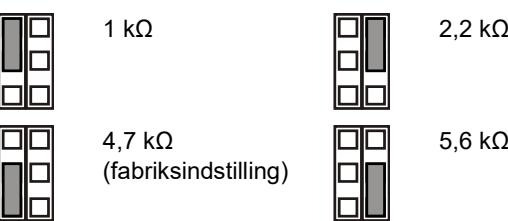

- OFF: Ingen indbygget alarm EOL.
**JT: Indstil indbygget sabotage EOL-modstand (Rt)**

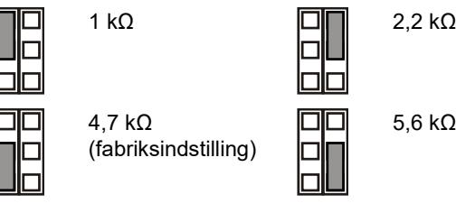

OFF: Ingen indbygget sabotage EOL.

#### **JF: Indstil indbygget fejl-EOL-modstand (Rf)**

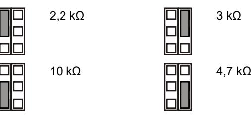

OFF: Ingen indbygget fejl EOL (fabriksindstilling).

**J1: Indstil zone-EOL-funktion**

ON: 3-modstand enkelt zone.

OFF: Isoleret fejlkontakt 2-modstandszone.

### **Zonekonfiguration**

Du kan indstille zonen ved hjælp af følgende retningslinjer.

- Vælg den relevante EOL modstandsværdi med JA, JT og JF. Eksempelvis indstilling af jumper JT fastsætter Rtværdien.
- Til isolerede udgange fjernes JT og J1.
- Fjern jumpere JA, JT og JF for at udelukke indbyggede EOL-værdier.
- For indstilling af dobbeltbalanceret zone fjernes J1 og terminal 3 og 6 tilsluttes zonen.

For enkelt zone med alle indbyggede modstande kan zonemodstanden være følgende.

#### **Tabel 2: Zonemodstandsværdier**

| Zonetilstand    | Værdi    | Fabriksindstilling |
|-----------------|----------|--------------------|
| Sabotage (kort) | 0 Ω      | 0 Ω                |
| Normal          | Rt       | 4,7 kΩ             |
| Alarm           | Rt+Ra    | 9,4 kΩ             |
| Fejl            | Rt+Rf    | 14,7 kΩ            |
| AM              | Rt+Ra+Rf | 19,4 kΩ            |
| Sabotage (åben) | ∞        | ∞                  |

### **DIP-kontakter**

#### **Tabel 3: SW1, generelle indstillinger**

| Kontakt                      | Værdier                                  |                                        |
|------------------------------|------------------------------------------|----------------------------------------|
| 6: Lysdioder                 | ON: Lysdioder til*                       | OFF: Lydsdiode slukket                 |
| 5: Eksternt                  | ON: Ekstern til                          | OFF: Ekstern fra*                      |
| 4: Auto fjernstyring test | ON: Auto fjernstyring test til        | OFF: Auto fjernstyring test fra*    |
| 3: Polaritet                 | ON: Positiv polaritet                    | OFF: Negativ polaritet*                |
| 1, 2: Radarrække vidde    | 1 til, 2 til: 12 m* 1 fra, 2 til: 9 m | 1 til, 2 fra: 6 m 1 til, 2 fra: 4 m |

* Fabriksindstilling

#### **Tabel 4: SW2, AM-indstillinger**

| Kontakt                   | Værdier                           |                                |
|---------------------------|-----------------------------------|--------------------------------|
| 4: AM-signal              | ON: AM til fejl og alarmrelæ * | OFF: Kun AM til fejlrelæ    |
| 3: Afstilling af AM alarm | ON: Auto afstilling*              | OFF: Autoriseret afstilling |
| 2: AM-følsomhed           | ON: Avanceret AM følsomhed*    | OFF: Standard AM følsomhed  |
| 1: AM dag/nat tilstand    | ON: AM kun dagtilstand*        | OFF: AM dag og nat             |

* Fabriksindstilling

# **DIP-kontakt SW1, generelle indstillinger**

#### **SW1-1, SW1-2: Radarrækkevidde**

Brug SW1-1 og SW1-2 til at indstille radarrækkevidden, så den passer til formålet. Radarens dækningsområde er meget præcis.

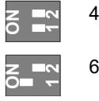

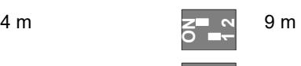

**ON1 2**

6 m 12 m Fabriksindstilling.

#### **SW1-3: Polaritet**

ON: Positiv polaritet. Konfigurerer indgang (WT og D/N) som "aktiv høj".

OFF: Negativ polaritet. Konfigurerer indgang (WT og D/N) som "aktiv lav". Fabriksindstilling.

Funktionen forklares i figur 9.

#### **Figure 9**

| (1) | Polaritet høj |
|-----|---------------|
| (2) | Polaritet lav |

- (3) Gangtest
- (4) Dag/nat

Funktionen afhænger også af indstillingen af SW1-5. Se "SW1- 5: Ekstern funktion" nedenfor.

#### **SW1-4: Auto fjernstyring test**

ON: Auto fjernstyring test TIL. Tillader Auto fjernstyring test.

OFF: Auto fjernstyring test FRA. Frakobler Auto fjernstyring test (fabriksindstilling).

Hvis auto fjernstyring test er sat til "Tilkoblet" vil AIA centralen kunne aktivere detektoren til at foretage en elektronisk selvtest. Denne test bliver aktiveret ved at skifte til Walk test tilstand (dagtilstand og walk test tilkoblet). Detektoren aktiverer alarm udgangen hvis testresultatet er positivt, og fejl udgangen hvis test resultatet er negativt. Efter testen vil detektoren vende tilbage til normal operation.

Denne funktion er afhængig af SW1-5 indstillingen. Se "SW1- 5: Ekstern funktion" nedenfor.

#### **SW1-5: Ekstern funktion**

ON: Ekstern til. Aktiverer WT og dag/nat.

OFF: Ekstern fra. Deaktiverer WT og dag/nat-indgang (fabriksindstilling).

Følgende funktion afhænger af ekstern indstilling.

#### **Tabel 5: Funktion afhænger af ekstern indstilling**

| Punkt | Beskrivelse            | SW1-5 Ekstern til                             | SW1-5 Ekstern fra |
|-------|------------------------|-----------------------------------------------|-------------------|
| SW1-3 | Polaritet              | Valgbar                                       | Kun positiv       |
| SW2-1 | Am dag/nat tilstand | Valgbar                                       | AM dag og nat     |
| SW2-3 | Retabler               | Valgbar                                       | Auto afstilling   |
| WT    | WT indgang             | Tilkoblet                                     | Frakoblet         |
| D/N   | D/N-indgang            | Tilkoblet                                     | Frakoblet         |
| Andet | Grøn tilstand          | Aktiveret i dagtilstand uden WT            | Frakoblet         |
|       | Alarm hukom.        | Aktiveret i dagtilstand uden WT            | Frakoblet         |
|       | Ekstern test           | Udføres efter skift til dagtilstand med WT | Frakoblet         |

Se også "Tilslutninger" på side 9.

#### **SW1-6: Lysdioder**

ON: LED er aktiveret. Se "Lysdioder og udgange" på side 11 for LED-funktioner.

OFF: Lysdioder er deaktiverede for enhver tilstand.

### **DIP-kontakt SW2, AM-indstillinger**

#### **SW2-1: AM dag/nat tilstand**

ON: AM kun dagtilstand. AM-detektion kører kun i dagtilstand (fabriksindstilling).

OFF: AM dag og nat. AM-detektion kører altid (dag- og nattilstand).

Funktionen afhænger også af indstillingen af SW1-5. Se "SW1- 5: Ekstern funktion" ovenfor.

#### **SW2-2: AM-følsomhed**

ON: Avanceret AM-følsomhed. Detektor signalerer AM-område afskærmning (fabriksindstilling).

**Bemærk:** Dette er en EN 50131 Grade 3 krævet konfiguration.

OFF: Standard AM-følsomhed. Detektor signalerer AM-område har ændret værdi.

### **SW2-3: Afstilling af AM**

ON: Automatisk afstilling. AM-alarmtilstanden kan afstilles 40 sekunder efter AM-alarmen optræder (fabriksindstilling).

OFF: Autoriseret afstilling. AM-alarmtilstand kan kun afstilles efter anvendelse af WT-tilstand og dagtilstand.

#### **Noter**

- For den avancerede indstilling (SW2-2 er Til) skal kilden til AM-alarmen fjernes, før AM-afstillingen tillades.
- Hvis AM-alarmen ikke kan afstilles med en automatisk eller autoriseret afstilling, afbrydes strømforsyningen og tilsluttes igen.
- Gangtest udføres for at sikre, at detektorens indstillinger er korrekte til formålet.

Funktionen afhænger også af indstillingen af SW1-5. Se "SW1- 5: Ekstern funktion" på side 10.

#### **SW2-4: AM-signal**

ON: AM til fejl og alarmrelæ. AM-alarm signalleres med både alarm- og fejludgang (fabriksindstilling).

**Note:** Det er den påkrævede konfiguration for EN 50131 klasse 3.

OFF: Kun AM til fejlrelæ. AM-alarm signalleres via fejludgang.

### **AM-kalibrering**

Ved start kalibrerer AM-kredsløbet sig selv i forhold til miljøet. Det er vigtigt at sikre, at der ikke er ændringer i miljøet 1 m i nærheden af detektoren indtil 60 sekunder efter start, ellers kan detektoren være følsom for falske AM-alarmer og måske kan disse alarmer ikke afstilles.

### **Indstilling af dækningsmønster**

- Fjern afdækningspladerne (Figur 8, punkt 1) hvis dette kræves. Det modificerede mønster er vist på figur 8, punkt 3 til 7.
**Bemærk:** Hvis begge afdækningsplader er monteret, vil detektorens rækkevidde være begrænset til 6 meter (fabriksindstilling).

- Ændring af detektorens dækningsmønster gøres, ved at fjerne afdækningspladerne (vist som grå markering på figur 8, punkt 1). De tilsvarende gardinmønstre er vist på figur 8, punkt 2.
- Indsæt nu de aktuelle afdækningslabels, hvis dette ønskes. Se figur 7, punkt 1 for yderligere detaljer.

**Husk:** Ved fjernelse af afdækningslabels kan spejlets overflade ødelægges.

- Når emner (reoler o.a) som er placeret direkte under detektoren, placeres afdækningspladen inde i detektoren (fabriksindstilling). Dette afskærmer den del af spejlet som
kigger direkte ned under detektoren. Emner der er i direkte nærhed under detektoren, kan medføre utilsigtede alarmer. Se figur 7, punkt 2.

**Bemærk:** Reduktion af nærsynsfeltet er ikke I overensstemmelse med EN 50131 Grade 3 installationers.

### **Selvtest**

Detektoren overvåger PIR- og AM-kredsløbene kontinuerligt. Fejl rapporteres til kontrolpanelet som teknisk fejl.

### **Gangtest af detektoren**

Der er to måder til at aktivere gangtestfunktionen på.

**SW1-6 indstilles til LED til, SW1-5 indstilles til Ekstern fra**

I denne tilstand er LED-angivelsen altid aktiveret (konstant gangtesttilstand).

**SW1-6 indstilles til LED til, SW1-5 indstilles til Ekstern til**

Denne indstilling aktiverer gangtestindgangen (pin 7) og dag/nat-indgang (pin 8). Så kan brugeren aktivere LEDangivelse på afstand ved at indstille detektoren til dagtilstand og aktivere gangtesten.

### **Grøn tilstand**

Når SW1-5 indstilles til Ekstern til, så slukkes radaren i dagstilstand (uden WT) for at reducere strømforbruget. Detektoren kører så kun i PIR-tilstand.

**Note:** Dag/nat-forbindelsen skal tilsluttes kontrolpanelet for, at funktionen virker.

Denne tilstand er ikke kompatibel med EN 50131-2-4 standard.

**Kun for DD1012AM-N:** I de første 180 sekunder af grøn tilstand skifter detektoren til høj følsom PIR-tilstand, for at muliggøre yderligere test, for eksempel ved at bruge en ekstern varmekilde til at test mod en betydelig rækkevidereduktion. Efter 180 sekunder skifter detektoren tilbage til standardfølsomhed.

### **Alarm hukommelse**

Når SW1-5 indstilles til Ekstern til, gemmes en alarm, som opstår om natten, i detektorens hukommelse. De angives med blinkende rød lysdiode, når enheden skifter til dagtilstand (gangtest deaktiveret). Hukommelsen slettes, når detektoren skifter til nattilstand.

**Note:** Indstil SW1-6 til Fra for at forhindre, at alarmhukommelsen vises på LED. Se "SW1-6: Lysdioder" på side 10.

### **Lysdioder og udgange**

LED-funktionen aktiveres ved at indstille SW1-6 til Til, eller er LED deaktiveret i en given tilstand. Se "SW1-6: Lysdioder" på side 10 for flere detaljer.

#### **Tabel 6: Lysdioder og udgange**

| Status                      | Rød lys diode | Gul lys diode | Alarmrelæ Fejlrelæ   | udgang | Afstilling                  |
|-----------------------------|---------------------|---------------------|----------------------|--------|-----------------------------|
| Start                       |                     |                     | Lukket               | Lukket | Automatisk efter 60 sek. |
| Lav spænding                |                     |                     | Åben                 | Åben   | Tilfør korrekt spænding  |
| PIR-indbruds alarm       |                     |                     | Lukket               | Lukket |                             |
| Mikrobølge indbrudsalarm |                     |                     | Lukket               | Lukket |                             |
| Kombi indbruds alarm     |                     |                     | Åben                 | Lukket | Automatisk efter 3 sek.  |
| Dobbel alarm hukommelse  |                     |                     | Lukket               | Lukket | Skift til nattilstand    |
| AM-alarm                    |                     |                     | Afhænger af SW2-4 | Åben   | Afhænger af SW2-3        |
| Teknisk fejl                |                     |                     | Lukket               | Åben   | Gennemført gangtest      |
|                             |                     |                     |                      |        |                             |

Løbende TIL Normal blink (1 Hz)

# **Specifikationer**

| Detektorteknologi                       | Kombi+AM                                   |
|-----------------------------------------|--------------------------------------------|
| Rækkevidde                              | 4, 6, 9, 12 m vælges via SW1-1 og SW1-2 |
| Visningsvinkel                          | 78 grader                                  |
| PIR-optik                               | 9 spejlgardiner med høj densitet           |
| Mikrobølgefrekvens                      | 5725–5875 MHz                              |
| Maksimal udgangs effekt                 | 13,46 mW                                   |
| Maks. mikrobølge ved 1 m                | 0,003 μW/cm²                               |
| Hukommelsesfunktion                     | Ja                                         |
| Indgangseffekt                          | 9 til 15 VDC (12 VDC nominel)              |
| Peak-to-peak ripple Vpp                 | 2 V (ved 12 VDC)                           |
| Detektoropstartstid                     | 60 sek.                                    |
| Strømforbrug                            | 10 til 22 mA (11 mA nom.)                  |
| Monteringshøjde                         | 2,0 til 2,6 m                              |
| Indstilling af detekteringshastighed:   |                                            |
| DD1012AM-N                              | 0,2 til 3,0 m/s                            |
| DD1012AM-D-N                            | 0,1 til 4,0 m/s                            |
| Alarm (NC) / sabotage relæegenskaber | 80 mA 30 VDC, Form A                       |
| Fejlrelæegenskaber                      | 80 mA 30 VDC, Form A                       |
| Alarmtid                                | 3 sek.                                     |
| Driftstemperatur                        | −10 til +55°C                              |
| Relativ fugtighed                       | 95% maks., ikke-kondenserende              |
| Vægt                                    | 120 g                                      |
| Mål (H x B x D)                         | 126 × 63 × 50 mm                           |
| IP-/IK-klasse                           | IP30 IK04                                  |
| Vægsabotage                             | Ja                                         |

### **Lovgivningsmæssig information**

| Producent                                                | MARKEDSFØRT AF: Carrier Fire & Security Americas Corporation Inc. 13995 Pasteur Blvd Palm Beach Gardens, FL 33418, USA AUTORISERET EU-REPRÆSENTANT: Carrier Fire & Security B.V. Kelvinstraat 7, 6003 DH Weert, Netherlands                                                                                                                                                                                                                                                                                                                                          |
|----------------------------------------------------------|----------------------------------------------------------------------------------------------------------------------------------------------------------------------------------------------------------------------------------------------------------------------------------------------------------------------------------------------------------------------------------------------------------------------------------------------------------------------------------------------------------------------------------------------------------------------------------------|
| Advarsler og fraskrivelser vedrørende produktet | DISSE PRODUKTER ER BEREGNET TIL SALG TIL OG INSTALLATION AF KVALIFICEREDE FAGFOLK. CARRIER FIRE & SECURITY KAN IKKE GIVE NOGEN GARANTI FOR, AT EN PERSON ELLER ENHED, DER KØBER VORES PRODUKTER, INKLUSIVE EN "AUTORISERET FORHANDLER", ER BEHØRIGT UDDANNET ELLER ERFAREN TIL KORREKT INSTALLATION AF BRAND- OG SIKKERHEDSRELATEREDE PRODUKTER. Flere oplysninger om garanti og fraskrivelser samt oplysninger om produktsikkerhed kan findes ved at gå til https://firesecurityproducts.com/policy/product warning/ eller scanne QR-koden. |
|                                                          |                                                                                                                                                                                                                                                                                                                                                                                                                                                                                                                                                                                        |
|                                                          | Carrier Fire & Security erklærer herved, at denne enhed overholder gældende regler og bestemmelser i alle gældende regler og bestemmelser, indeholdt men ikke begrænset til direktivet 2014/53/EU. For yderligere informationer se firesecurityproducts.com.                                                                                                                                                                                                                                                                                                            |
| REACH                                                    | Produktet kan indeholde stoffer, er også er kandidatliste stoffer i en koncentration over 0,1% w/w, pr. Den seneste offentliggjorte kandidatliste, findes på ECHAs websted.                                                                                                                                                                                                                                                                                                                                                                                                   |
|                                                          | Oplysninger om sikker brug findes på https://firesecurityproducts.com/en/content/intrusi on-intro                                                                                                                                                                                                                                                                                                                                                                                                                                                                                |
|                                                          | 2012/19/EU (WEEE): Bortskaffelse af elektrisk og elektronisk udstyr har til formål at minimere den indvirkning, som affald af elektrisk og elektronisk udstyr har på miljøet og mennesker. I henhold til direktivet må elektrisk udstyr, der er mærket med dette symbol, ikke bortskaffes sammen med almindeligt husholdningsaffald i Europa. Europæiske brugere af elektrisk udstyr skal aflevere kasserede produkter til genbrug. Yderligere oplysninger findes på webstedet recyclethis.info                                                          |
| Produkt dokumation                                    | Se følgende weblink for at hente den elektroniske version af produktdokumentationen.                                                                                                                                                                                                                                                                                                                                                                                                                                                                                                |
|                                                          | Denne link vil guide dig til EMEA's regionale kontaktside. På denne side kan du anmode om dit log-ind til den sikrede webportal, hvor alle manualer er gemt. https://firesecurityproducts.com/da/contact                                                                                                                                                                                                                                                                                                                                                                   |

### **Kontaktinformation**

firesecurityproducts.com eller www.aritech.com

# **DE: Installationsanleitung**

### **Beschreibung**

Der DD1012AM(-D)-N ist ein Dual-AM-Bewegungsmelder.

Er vereint die patentierte PIR-Spiegeloptik mit der patentierten Radar-Reichweitensteuerung.

### **Installationsanleitung**

#### Siehe Abb. 1.

Der Melder ist auf die Montage an Wänden ausgerichtet, kann aber auch mithilfe einer Montagehalterung an der Decke angebracht werden.

Die folgenden Richtlinien helfen Ihnen bei der Auswahl einer geeigneten Montageposition für den Melder:

- Montieren Sie den Melder so, dass die Bewegung eines Eindringlings im Erfassungsbereich des Melders liegt (siehe Abb. 3).
- Montieren Sie den Melder auf einer stabilen Oberfläche. Die zulässige Montagehöhe finden Sie unter "Technische Daten" auf Seite 17.
- Montieren Sie den Melder nicht innerhalb eines Radius von 0,5 m um metallische Objekte oder innerhalb eines Radius von 1,5 m um Leuchtstoffleuchten.
- Stellen Sie keine Objekte vor den Melder, die die Sichtlinie beeinträchtigen könnten.
- Platzieren Sie Melder in einem Abstand von mindestens 6 m zueinander, und verwenden Sie die Einstellung für eine kurze Reichweite, um Störungen zu vermeiden, wenn Sie die Melder gegenüberliegend anbringen.

Die Dual-Technologie dieses Melders dient der Vermeidung falscher Alarmmeldungen. Sie sollten jedoch potenzielle Instabilitätsfaktoren vermeiden, darunter:

#### Risiken für PIR:

- Direkte Sonneneinstrahlung auf den Melder
- Hitzequellen innerhalb des Erfassungsbereichs des Melders
- Starke Zugluft am Melder
- Tiere innerhalb des Erfassungsbereichs
- Verdecken des Erfassungsbereichs des Melders durch große Objekte wie z. B. Möbel

#### Risiken für Mikrowellen:

- Vibrationsanfällige Montagefläche
- Metallische Oberflächen, die Mikrowellen reflektieren
- Durch Kunststoffleitungen fließendes Wasser
- Sich bewegende oder vibrierende Objekte wie Ventilatoren, Heizungs- oder Klimaanlagenschächte

#### AM-Fehlerquellen:

- Sich bewegene Objekte in weniger als 1 m Entfernung vor dem Melder
- Kleine Insekten auf dem Melder
- Moderne Leuchtstoffbeleuchtung in unmittelbarer Nähe (innerhalb von 1,5 m)

**WARNUNG!** Das Gerät ist nicht geerdet. Jeder externe Stromkreis, der an das Gerät angeschlossen ist, muss sich im selben Gebäude befinden und mit einem Schutzleiter verbunden sein.

Die Aderisolation von Kabeln, die an das Gerät angeschlossen sind, muss den Anforderungen der IEC 60332-1-2 und IEC 60332-1-3 oder IEC 60332-2-2-2, abhängig von der Drahtquerschnittsfläche, oder der IEC TS 60695-11-21 entsprechen, unabhängig von der Querschnittsfläche. Alternativ müssen diese Leitungen der UL 2556 VW-1 entsprechen.

Die Leistung der Spannungsquelle muss auf 15 W begrenzt sein.

Wir empfehlen, in regelmäßigen Abständen einen Meldergehtest durchzuführen und den Melder vom Bedienelement der Zentrale aus zu überprüfen.

#### **Montage des Bewegungsmelders:**

- 1. Nehmen Sie den kundenspezifischen Einsatz ab (siehe Abb. 2, Elemente 1 und 2).
- 2. Öffnen Sie den Melder vorsichtig mit einem Schraubendreher (siehe Abb. 2, Elemente 3 und 4).

**Achtung:** Berühren Sie nicht den pyroelektrischen Sensor (siehe Abb. 6).

- 3. Nehmen Sie die Schraube der Abdeckung heraus (siehe Abb. 4, Element 2).
- 4. Befestigen Sie den Sockel an der Wand. Die zulässige Montagehöhe finden Sie unter "Technische Daten" auf Seite 17.

Siehe Abb. 4. Benutzen Sie für alle Positionen mindestens zwei M4-Schrauben der Standards DIN 7505B, DIN 96, DIN 7996 oder eine Flachkopfschraube mit 8 mm Durchmesser.

- Verwenden Sie für eine flache Montage die Schrauben in Position A.

- Verwenden Sie für die Eckmontage die Schrauben in Position B oder C.

**Hinweis für Installationen nach EN 50131 Grad 3:**  Verwenden Sie nicht die Montageposition C. Für die Montageposition A und B sind beide Montagebohrungen A2 und B2 zu verwenden.

- Um den Abreißkontakt für die Gehäuseüberwachung ST400 zu installieren, verwenden Sie Montageposition A. Die Montageposition für ST400 wird in Abbildung 4, Element 3 dargestellt. Öffnen Sie die Öffnung in der Rückplatte (siehe Abb. 5, Element 2).

- 5. Verdrahten Sie den Melder (siehe Abb. 4 und 12). Verwenden Sie die Kabeleinführungen (siehe Abb. 5, Element 1) und die Kabelrinne (siehe Abb. 5, Element 3).
- 6. Wählen Sie die gewünschten Steckbrücken- und DIP-Schalter-Einstellungen aus (weitere Informationen unter "Einstellen des Melders" unten.
- 7. Entfernen Sie die Abdeckungen und bringen Sie die Aufkleber falls erforderlich an. Siehe auch "Konfiguration des Erfassungsbereichs" unten für weitere Details.

- 8. Verwenden Sie für Deckenmontagen die Dreh-Befestigungshalterung SB01. Die Montageposition für SB01 ist in Abbildung 4 als Element 1 dargestellt.
**Hinweis:** Die Verwendung von SB01 ist nicht konform mit EN 50131 Grad 3 Installationen.

- 9. Schließen Sie die Abdeckung und setzen Sie die Schraube und den kundenspezifischen Einsatz ein.
### **Anschlüsse**

Siehe Abb. 12.

#### **Tabelle 1: Melderanschlüsse**

| Klemme | Bezeich nung      | Erklärung                                                                                                                                                                                                                                                                                                                    |
|--------|----------------------|------------------------------------------------------------------------------------------------------------------------------------------------------------------------------------------------------------------------------------------------------------------------------------------------------------------------------|
| 1, 2   | MASSE, +12 V      | Anschluss Stromversorgung (9 bis 15 V, 12 V nominal)                                                                                                                                                                                                                                                                    |
| 3, 4   | ALARM                | Alarmrelaisausgang (33 Ω). Verwenden Sie die Steckbrücke JA, um den integrierten Abschlusswiderstand mit dem Relais in Serie zu schalten. Siehe "Steckbrücken" unten.                                                                                                                                            |
| 5, 6   | SABOTAGE ALARM    | Sabotageschalterausgang (0 Ω). Verwenden Sie die Steckbrücke JT, um den integrierten Abschlusswiderstand mit dem Schalter in Serie zu schalten. Siehe"Steckbrücken" unten.                                                                                                                                       |
| 7      | Gehtest              | Dieser Eingang aktiviert und deaktiviert die LED (Gehtest ein/aus). Der Gehtest-Modus kann nur eingeschaltet werden, wenn sich der Melder im Unscharf-Modus befindet (Pin 8) "Aktiv-High" bzw. "Aktiv-Low" wird durch SW1-3 festgelegt (siehe "SW1-3: Polarität" unten).                                   |
| 8      | Scharf / Unscharf | Dieser Eingang versetzt den Melder in den Unscharf-Modus (Alarmspeicher auf LED Anzeige anzeigen) oder Scharf-Modus (aktiviert den Alarmspeicher und löscht bereits gespeicherte Alarme). Die Polarität für "Aktiv-High" oder "Aktiv-Low" wird durch SW1-3 festgelegt (siehe "SW1-3: Polarität" unten). |
| 9, 10  | Störung              | Störungsmelderelaisausgang (33 Ω). Verwenden Sie die Steckbrücke JF, um einen der integrierten EOL-Widerstände mit dem Relais in Serie zu schalten. Informationen zu den richtigen Einstellungen für den Widerstand finden Sie unter "Steckbrücken" unten.                                                 |

#### **Hinweise**

- Eingänge 7 und 8 werden nur verwendet, wenn SW1-5 auf Remote geschaltet ist. Siehe "SW1-5: Remote-Funktionalität" unten.
- Die LED ist nur aktiviert, wenn "LED ein" über SW1-6 aktiviert wurde.

In Abbildung 10 wird erklärt, wie eine einzelne Meldegruppe mit mehreren Widerständen eingerichtet werden kann.

#### **Abbildung 10**

- (1) Alarmrelais
- (2) Meldegruppe
- (3) Sabotageschalterausgang (4) Störungsrelais
- Ra Alarmabschlusswiderstand
- Rt Sabotageabschlusswiderstand
- Rf MG-Widerstand

# **Einstellen des Melders**

Die Positionen der Steckbrücken und DIP-Schalter sind in Abbildung 13 dargestellt.

### **Steckbrücken**

Steckbrücken legen den integrierten Abschlusswiderstand und dessen Wert fest. Die Schaltung ist in Abbildung 12 dargestellt.

#### **JA: Definiert den integrierten Alarmabschlusswiderstand (Ra)**

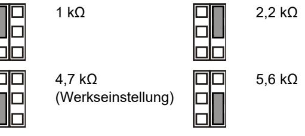

Aus: Kein integrierter Alarmabschlusswiderstand.

#### **JT: Definiert den integrierten Sabotageabschlusswiderstand (Rt)**

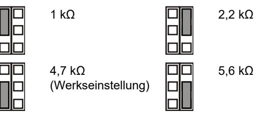

Aus: Kein integrierter Sabotageabschlusswiderstand.

#### **JF: Definiert den integrierten Störungsabschlusswiderstand (Rf)**

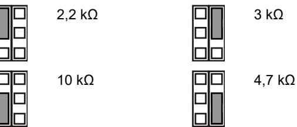

Aus: Kein integrierter Störungsabschlusswiderstand (Werkseinstellung).

**J1: Einstellen des Meldegruppen-Abschlusswiderstands**

Ein: Einzelne Meldegruppe mit 3 Widerständen.

Aus: Isolierter Störungskontakt und 2-Widerstand-Meldegruppe.

#### **Konfigurieren der Meldegruppe**

Beachten Sie bei der Einrichtung der Meldegruppe folgende Richtlinien:

- Wählen Sie die passenden Werte für den Abschlusswiderstand über JA, JT und JF. Das Setzen der Steckbrücke JT bestimmt beispielsweise den Rt-Wert.
- Entfernen Sie die Steckbrücke JT und J1 für einen getrennten Alarm-und Sabotageausgang.
- Entfernen Sie die Steckbrücken JA, JT und JFF , um keine integrierte Abschlusswiderstands-Werte zu berücksichtigen.

- Zur Einstellung des Dual-Widerstands entfernen Sie die Steckbrücke J1 und verwenden Anschluss 3 und 6.
Bei einer einzelne Meldegruppe, bei der alle integrierten Widerstände eingeschaltet sind, kann der Widerstand der Gruppe wie folgt aussehen.

#### **Tabelle 2: Widerstandswerte der Meldegruppe**

| Meldegruppen-status | Wert     | Werkseinstellung |
|---------------------|----------|------------------|
| Sabotage (kurz)     | 0 Ω      | 0 Ω              |
| Normal              | Rt       | 4,7 kΩ           |
| Alarm               | Rt+Ra    | 9,4 kΩ           |
| Störung             | Rt+Rf    | 14,7 kΩ          |
| AM                  | Rt+Ra+Rf | 19,4 kΩ          |
| Sabotage (offen)    | ∞        | ∞                |

### **DIP-Schalter**

#### **Tabelle 3: SW1, allgemeine Einstellungen**

| Schalter                  | Werte                                    |                                        |
|---------------------------|------------------------------------------|----------------------------------------|
| 6: LED                    | Ein: LED ein*                            | Aus: LED aus                           |
| 5: Remote                 | Ein: Remote ein                          | Aus: Remote aus*                       |
| 4: Auto-Ferntest          | Ein: Auto-Ferntest eingeschaltet      | Aus: Auto-Ferntest ausgeschaltet*   |
| 3: Polarität              | Ein: Positive Polarität                  | Aus: Negative Polarität*               |
| 1, 2: Radarreich weite | 1 Ein, 2 Ein: 12 m* 1 Aus, 2 Ein: 9 m | 1 Ein, 2 Aus: 6 m 1 Aus, 2 Aus: 4 m |

* Werkseitige Einstellung

#### **Tabelle 4: SW2, AM-Einstellungen**

| Schalter              | Werte                                    |                                     |
|-----------------------|------------------------------------------|-------------------------------------|
| 4: AM-Signalisierung  | Ein: AM an Störungs und Alarm-Relais* | Aus: AM nur an Störungsrelais    |
| 3: Reset              | Ein: Automatischer Reset*             | Aus: Autorisiertes Zurücksetzen  |
| 2: AM-Empfindlichkeit | Ein: Erweiterte AM Empfindlichkeit*   | Aus: Standard-AM Empfindlichkeit |
| 1: AM-Tag-/Nachtmodus | Ein: Nur AM Tagmodus*                 | Aus: AM-Tag- /Nachtmodus         |

* Werkseitige Einstellung

### **DIP-Schalter SW1, allgemeine Einstellungen**

#### **SW1-1, SW1-2: Radarreichweite**

Verwenden Sie SW1-1 und SW1-2, um die Radarreichweite exakt an die Anwendung anzupassen. Das Radarsystem basiert auf der Range-Gating-Technologie und gewährleistet somit eine sehr genaue Erfassungsreichweite.

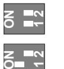

**1**

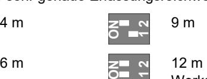

Werkseitige Einstellung.

#### **SW1-3: Polarität**

Ein: Positive Polarität. Konfiguriert die Eingänge (WT und D/N) als "Aktiv-High".

Aus: Negative Polarität. Konfiguriert die Eingänge (WT und D/N) als "Aktiv-Low". Werkseitige Einstellung.

Die Funktionalität wird in Abbildung 9 erklärt.

#### **Abbildung 9**

- (1) Polarität hoch (2) Polarität gering

| (3) | Gehtest (WT)          |  |
|-----|-----------------------|--|
| (4) | Scharf/Unscharf (D/N) |  |

Diese Funktion hängt ebenfalls von der Einstellung von SW1-5 ab. Siehe "SW1-5: Remote-Funktionalität" unten.

#### **SW1-4: Auto Ferntest**

Ein: Auto-Ferntest eingeschaltet. Ermöglicht den automatischen Ferntest.

Aus: Auto-Ferntest ausgeschaltet. Schaltet den automatischen Ferntest aus (Werkseinstellung).

Wenn der automatische Ferntest eingeschaltet ist, kann die Einbruchmeldezentrale den Melder für einen Diagnosetest ansteuern. Der Test wird durch die Umschaltung in den Gehtestmodus (Unscharfmodus und Gehtest eingeschaltet) aktiviert. Der Melder aktiviert in dieser Betriebsart bei positivem Testresultat das Alarmrelais oder aktiviert das Störungsrelais bei einem negativen Testresultat. Nach dem Test kehrt der Melder wieder in den normalen Betriebszustand zurück.

Diese Funktion ist auch abhängig von der SW1-5 Einstellung. Siehe "SW1-5: Remote-Funktionalität" nachstehend.

#### **SW1-5: Remote-Funktionalität**

Ein: Remote ein. Aktiviert die Eingänge (Gehtest) WT und (Scharf/Unscharf) D/N.

Aus: Remote aus. Deaktiviert die Eingänge WT und D/N (werkseitig eingestellt).

Die folgenden Funktionen sind von der Remote-Einstellung abhängig.

**Tabelle 5: Von der Remote-Einstellung abhängige Funktionen**

| Element | Bezeichnung               | SW1-5 Remote ein                                      | SW1-5 Remote aus       |
|---------|---------------------------|-------------------------------------------------------|------------------------|
| SW1-3   | Polarität                 | Einstellbar                                           | Nur positiv            |
| SW2-1   | AM-Tag- /Nachtmodus    | Einstellbar                                           | AM-Tag- /Nachtmodus |
| SW2-3   | Reset                     | Einstellbar                                           | Automatischer Reset |
| WT      | Eingang WT                | Eingeschaltet                                         | Abgeschaltet           |
| D/N     | Eingang D/N               | Eingeschaltet                                         | Abgeschaltet           |
| Andere  | "Grüner" Modus         | Im Tag-Modus aktiviert ohne WT                     | Abgeschaltet           |
|         | Alarmspeicher             | Im Tag-Modus aktiviert ohne WT                     | Abgeschaltet           |
|         | Remote test (Ferntest) | Erfolgt nach dem Umschalten zum Tagmodus mit WT | Abgeschaltet           |

Siehe auch "Anschlüsse" oben.

#### **SW1-6: LEDs**

Ein: LEDs sind aktiviert. Siehe "LEDs und Ausgänge" unten, um mehr über die LED-Funktionen zu erfahren.

Aus: LEDs sind in allen Zuständen deaktiviert.

### **DIP-Schalter SW2, AM-Einstellungen**

#### **SW2-1: AM-Tag-/Nachtmodus**

Ein: Nur AM-Tagmodus. AM-Erkennung ist nur im Tagmodus aktiv (Werkseinstellung).

Aus: AM-Tag-/Nachtmodus. AM-Erkennung ist dauerhaft aktiv (Tag- und Nachtbetrieb).

Diese Funktion hängt ebenfalls von der Einstellung von SW1-5 ab. Siehe "SW1-5: Remote-Funktionalität" oben.

#### **SW2-2: AM-Empfindlichkeit**

Ein: Erweiterte AM-Empfindlichkeit. Der Melder signalisiert die Maskierung des Melderfensters (Werkseinstellung).

**Hinweis:** Dies ist eine nach EN 50131 Grad 3 erforderliche Konfiguration.

Aus: Standard-AM-Empfindlichkeit. Der Melder signalisiert eine Annäherung des Maskierungsfeldes.

#### **SW2-3: Reset**

Ein: Automatischer Reset. Der AM-Alarmzustand kann 40 s nach dem Auslösen des AM-Alarms zurückgesetzt werden (Werkseinstellung).

Aus: Autorisierter Reset. AM-Alarmzustand kann nur nach dem Anwenden des Gethtestmodus im unscharfen Zustand (Tagmodus) zurückgesetzt werden.

#### **Hinweise**

- Für die erweiterte Einstellung (SW2-2 ist eingeschaltet (On)) muss die Ursache des AM-Alarms beseitigt werden, bevor der AM-Reset durchgeführt werden kann.
- Wenn der AM-Alarm nicht mit einem automatischen oder einem autorisierten Reset zurückgesetzt werden kann, trennen Sie die Versorgungsspannung und schließen das Gerät anschiließend wieder an.
- Ein Gehtest sollte durchgeführt werden, um zu gewährleisten, dass das Gerät ordnungsgemäß eingerichtet wurde.

Diese Funktion hängt ebenfalls von der Einstellung von SW1-5 ab. Siehe "SW1-5: Remote-Funktionalität" oben.

#### **SW2-4: AM-Signalisierung**

Ein: AM an Störungs- und Alarm-Relais. Der AM-Alarm wird über die Alarm- sowie über die Störungsausgänge signalisiert (Werkseinstellung).

**Hinweis:** Diese Konfiguration ist bei EN 50131 Grad 3 vorgeschrieben.

Aus: AM nur an Störungsrelais. Der AM-Alarm wird über den Störungsausgang signalisiert.

### **AM-Kalibierung**

Während des Startvorgangs kalibriert sich der AM-Schaltkreis auf seine Umgebung. Dabei müssen Sie gewährleisten, dass sich die Umgebung in einem Abstand von 1 m vom Melder innerhalb von 60 s nach dem Startvorgang nicht verändert. Andernfalls können falsche AM-Alarmmeldungen ausgelöst werden, die nicht zurückgesetzt werden können.

### **Konfiguration des Erfassungsbereichs**

- Entfernen Sie die Abdeckungen (Abb. 8, Punkt 1) falls erforderlich. Der geänderte Erfassungsbereich ist in Abbildung 8, Punkt 3 bis 7 dargestellt.
**Hinweis:** Falls beide Abdeckungen eingesetzt sind, ist die Reichweite des Melders auf 6 m begrenzt (Werkseinstellung).

- Verändern Sie den Erfassungsbereich, indem Sie Teile der Abdeckung herausbrechen (graue Darstellung in Abbildung 8, Punkt 1). Die entsprechenden Vorhangfragmente sind in Abbildung 8, Punkt 2 dargestellt.
- Setzten Sie die passenden Spiegelabdeckungen falls erforderlich ein. Siehe Abbildung 7, Punkt 1 für Details.

**Vorsicht:** Das Entfernen der Aufkleber kann die Spiegeloberfläche beschädigen.

- Falls sich in der Nähe Objekte direkt unterhalb des Melders befinden, setzten Sie die Abdeckmaske in die Innenseite des Melderfensters ein (Werkseinstellung). Hierdurch werden Teile des Vorhangs die nach unten auf das Objekt gerichtet sind ausgeblendet, dessen Nähe möglicherweise den Melder destabilisieren könnte. Siehe Abbildung 7, Punkt 2.
**Hinweis:** Die Verringerung des Sichtfelds im Nahbereich ist in EN 50131 Grad 3 Installationen nicht zulässig.

### **Selbsttest**

Der Melder führt eine kontinuierliche Prüfung der PIR-, Mikrowellen- und AM-Schaltkreise durch. Eventuelle Defekte werden als technische Störungen an die Zentrale gemeldet.

### **Durchführen eines Gehtests**

Es gibt zwei Möglichkeiten, den Gehtest-Modus zu aktivieren.

**SW1-6 wird auf "LED ein" geschaltet, SW1-5 wird auf "Remote aus" geschaltet**

In diesem Modus ist die LED-Anzeige immer aktiviert (durchgehender Gehtest-Modus).

**SW1-6 wird auf "LED ein" geschaltet, SW1-5 wird auf "Remote ein" geschaltet**

Diese Einstellung aktiviert den Gehtest-Eingang (Klemme 6) und den Scharf/Unscharf-Eingang (Klemme 8). Auf diese Weise kann die LED-Anzeige über einen Gehtestausgang der Zentrale im unscharfen Zustand aktiviert werden.

### **"Grüner" Modus**

Wenn SW1-5 auf "Remote ein" geschaltet wird, ist der Radar im Tag-Modus (ohne WT) deaktiviert, um den Stromverbrauch zu senken. Der Melder arbeitet in diesem Fall ausschließlich im PIR-Modus.

**Hinweis:** Dieser Modus funktioniert nur, wenn die Scharf/Unscharf Klemme an die Zentrale angeschaltet wurde.

Dieser Modus ist nicht konform mit der Norm EN 50131-2-4.

**Nur DD1012AM-N:** Während der ersten 180 Sekunden des "Grünen-Modus" Betriebs wird der Melder in den hochempfindlichen PIR-Modus geschaltet, um zusätzliche Tests zu ermöglichen, z. B. durch Verwendung einer externen Wärmequelle, um eine erhebliche Verringerung der Reichweite zu testen. Nach 180 Sekunden wird der Melder wieder auf die Standardempfindlichkeit zurückgeschalt.

### **Alarmspeicher**

Wird SW1-5 auf "Remote ein" eingestellt, werden Alarmzustände, die während des Scharf-Modus ausgelöst wurden, im Speicher des Melders gespeichert. Sie werden durch ein rot blinkendes LED-Signal angezeigt, sobald die Einheit in den Unscharf-Modus wechselt (Gehtest deaktiviert). Der Speicher wird gelöscht, sobald der Melder wieder in den Scharf-Modus umschaltet.

**Hinweis:** Schalten Sie SW1-6 auf "Aus", um zu verhindern, dass der Alarmspeicher über die LEDs angezeigt wird. Siehe "SW1-6: LEDs" oben.

# **LEDs und Ausgänge**

Um die LED-Funktionalität zu aktivieren, schalten Sie SW1-6 auf "Ein". Anderenfalls sind die LEDs in allen Zuständen deaktiviert. Weitere Einzelheiten finden Sie in Abschnitt "SW1- 6: LEDs" oben.

#### **Tabelle 6: LEDs und Ausgänge**

| Status                                 | Rote LED | Gelbe LED | Alarm relais | Störungs relais | Zurücksetzen                            |
|----------------------------------------|----------|-----------|-----------------|--------------------|-----------------------------------------|
| Start                                  |          |           | G               | G                  | Automatisch nach 60 s                   |
| Unterspannung                          |          |           | O               | O                  | Verwenden Sie die korrekte Spannung. |
| PIR Einbruchalarm                   |          |           | G               | G                  |                                         |
| Mikrowellen Einbruchalarm           |          |           | G               | G                  |                                         |
| (Dual) Bewegungs- /Einbruchalarm |          |           | O               | G                  | Automatisch nach 3 s                    |
| Dual Alarmspeicher                  |          |           | G               | G                  | Schalten Sie in den Scharfbetrieb    |
| AM-Alarm                               |          |           | [1]             | O                  | Abhängig von SW2-3                      |
| Technischer Fehler                  |          |           | G               | O                  | Gehtest erfolgreich                     |

|            | G — Geschlossen, O — Offen, [1] — Abhängig von SW2-4 |
|------------|------------------------------------------------------|
| Ständig an | Normales Blinken (1 Hz)                              |

### **Technische Daten**

| Melder-Technologie  | Dual+AM                                            |
|---------------------|----------------------------------------------------|
| Reichweite          | 4, 6, 9, 12 m einstellbar über SW1- 1 und SW1-2 |
| Sichtwinkel         | 78 Grad                                            |
| PIR-Optik           | 9 Spiegelvorhänge mit hoher Dichte                 |
| Mikrowellenfrequenz | 5725–5875 MHz                                      |

| Maximale Ausgangsleistung                          | 13,46 mW                       |
|----------------------------------------------------|--------------------------------|
| Max. Mikrowellenleistung bei 1 m                | 0,003 µW/cm²                   |
| Alarmspeicher-Funktion                             | Ja                             |
| Versorgungsspannung                                | 9 bis 15 V (12 V nominal)     |
| Spitze/Spitze-Brummspannung                        | 2 V (bei 12 V)                |
| Meldereinschaltzeit                                | 60 s                           |
| Stromaufnahme                                      | 10 bis 22 mA (11 mA nom.)      |
| Montagehöhe                                        | 2 bis 2,6 m                    |
| Erfassungsgeschwindigkeitsbereich:                 |                                |
| DD1012AM-N                                         | 0,2 bis 3,0 m/s                |
| DD1012AM-D-N                                       | 0,1 bis 4,0 m/s                |
| Eigenschaften Alarmrelais (NC) / Sabotagerelais | 80 mA, 30 V, Form A           |
| Eigenschaften Störungsrelais                       | 80 mA, 30 V, Form A           |
| Alarmdauer                                         | 3 s                            |
| Betriebstemperatur                                 | −10 bis +55°C                  |
| Relative Luftfeuchtigkeit                          | max. 95 %, nicht kondensierend |
| Gewicht                                            | 120 g                          |
| Abmessungen (H x B x T)                            | 126 × 63 × 50 mm               |
| IP/IK-Klasse                                       | IP30 – IK04                    |
| Abreisskontakt                                     | Ja                             |

# **Zertifizierung und Einhaltung**

| Hersteller                                     | INVERKEHRBRINGER: Carrier Fire & Security Americas Corporation Inc. 13995 Pasteur Blvd Palm Beach Gardens, FL 33418, USA BEVOLLMÄCHTIGTER EU REPRÄSENDANT: Carrier Fire & Security B.V. Kelvinstraat 7, 6003 DH Weert, Niederlande                                                                                                                                                                                                                                                                                                                                                                                                                                                        |
|------------------------------------------------|-------------------------------------------------------------------------------------------------------------------------------------------------------------------------------------------------------------------------------------------------------------------------------------------------------------------------------------------------------------------------------------------------------------------------------------------------------------------------------------------------------------------------------------------------------------------------------------------------------------------------------------------------------------------------------------------------------------|
| Produktwarnungen und Haftungs ausschluss | DIESE PRODUKTE SIND FÜR DEN VERKAUF AN UND DIE INSTALLATION DURCH QUALIFIZIERTES PERSONAL VORGESEHEN. CARRIER FIRE & SECURITY ÜBERNIMMT KEINERLEI GEWÄHRLEISTUNG DAFÜR, DASS NATÜRLICHE ODER JURISTISCHE PERSONEN, DIE UNSERE PRODUKTE ERWERBEN, SOWIE "AUTORISIERTE HÄNDLER" ODER "AUTORISIERTE WIEDERVERKÄUFER" ÜBER DIE ERFORDERLICHE QUALIFIKATION UND ERFAHRUNG VERFÜGEN, UM BRANDSCHUTZ- ODER SICHERHEITSTECHNISCHE PRODUKTE ORDNUNGSGEMÄSS ZU INSTALLIEREN. Weitere Informationen zu Haftungsausschlüssen sowie zur Produktsicherheit finden Sie unter https://firesecurityproducts.com/policy/product warning/, oder scannen Sie den QR-Code. |
|                                                |                                                                                                                                                                                                                                                                                                                                                                                                                                                                                                                                                                                                                                                                                                             |

Carrier Fire & Security erklärt hiermit, dass dieses Gerät den geltenden Anforderungen und Bestimmungen aller anwendbaren Regeln und Vorschriften entspricht - einschließlich, aber nicht beschränkt auf die Richtlinie 2014/53/EU. Für weitere Informationen siehe firesecurityproducts.com.

REACH Das Produkt kann Stoffe enthalten, die auch unter Stoffe der Kandidatenliste in einer Konzentration von mehr als 0,1 % w/w gemäß der zuletzt veröffentlichten Kandidatenliste auf der ECHA-Website aufgeführt sind. Informationen zur sicheren Verwendung finden Sie unter https://firesecurityproducts.com/en/content/intrusi on-intro 2012/19/EU (WEEE): Produkte die mit diesem Symbol gekennzeichnet sind, dürfen nicht als unsortierter städtischer Abfall in der europäischen Union entsorgt werden. Für die korrekte Wiederverwertung bringen Sie dieses Produkt zu Ihrem lokalen Lieferanten nach dem Kauf der gleichwertigen neuen Ausrüstung zurück, oder entsorgen Sie das Produkt an den gekennzeichneten Sammelstellen. Weitere Informationen hierzu finden Sie auf der folgenden Website: recyclethis.info Dokumentation Bitte konsultieren Sie den folgenden Web-Link, um die elektronische Version der Produktdokumentation abzurufen. Dieser Link führt Sie zu der regionalen EMEA-Kontaktseite. Auf dieser Seite können Sie Ihr

> Login zum gesicherten Webportal anfordern, in dem alle Handbücher gespeichert sind. https://firesecurityproducts.com/en/contact

Produkt-

**Kontaktinformationen**

firesecurityproducts.com oder www.aritech.com

# **ES: Hoja de instalación**

### **Descripción**

DD1012AM(-D)-N es un sensor de movimiento AM de doble tecnología.

Combina la tecnología de óptica de espejo patentada PIR con la tecnología patentada de zonas controladas por radar.

### **Instrucciones para la instalación**

Consulte la figura 1.

El detector se ha diseñado para que se instale en la pared, pero también puede instalarse en el techo utilizando un soporte de montaje.

Utilice las siguientes instrucciones para determinar cuál es la mejor posición para instalar el detector.

- Instale el detector de forma que el movimiento esperado de un intruso entre dentro del patrón de detección (consulte la figura 3).
- Instale el detector sobre una superficie estable. Para conocer la altura de montaje permitida, véase "Especificaciones" en la página 22.
- No instale el detector a una distancia inferior a 0,5 m de objetos metálicos o 1,5 m de luces fluorescentes.
- No coloque objetos delante del detector que puedan impedir una línea de visión clara.

- Cuando coloque los detectores uno enfrente del otro, colóquelos a una distancia de al menos 6 m entre sí y utilice una configuración de corto alcance para evitar las interferencias.
El procesamiento de tecnología dual de este detector es muy resistente a los riesgos de falsas alarmas. Sin embargo, debe evitar potenciales causas de inestabilidad, como:

Riesgos relacionados con los PIR:

- Luz solar directa en el detector.
- Fuentes de calor dentro del campo de visión del detector.
- Fuertes corrientes de aire sobre el detector.
- Animales en el campo de visión.
- Oscurecer el campo de visión del detector con objetos de gran tamaño, como por ejemplo mobiliario.

Causas relacionadas con las microondas:

- Superficie de montaje susceptible a sufrir vibraciones.
- Superficies de metal que reflejan la energía de microondas.
- Movimiento de agua a través de tuberías de plástico.
- Objetos en movimiento o que vibren, como ventiladores o conductos de calefacción o aire acondicionado.

Riesgos relacionados con AM:

- Objetos que se mueven a una distancia inferior a 1 metro delante del detector.
- Insectos de pequeño tamaño en el detector.
- Modernas luces fluorescentes en las proximidades (en un radio de 1,5 m).

**¡ADVERTENCIA!** El equipo no está conectado a tierra. Cualquier circuito externo conectado al equipo debe estar situado dentro del mismo edificio y conectado a tierra.

El aislamiento de los cables conectados al equipo debe cumplir con las normas IEC 60332-1-2 e IEC 60332-1-3 o IEC 60332-2-2-2, dependiendo de la sección del cable, o IEC TS 60695-11-21, independientemente de la sección. Alternativamente, estos cables deben cumplir con UL 2556 VW-1.

La fuente de alimentación del detector debe tener una potencia de 15 W.

Se recomienda que se realice la prueba de paseo al detector con regularidad y se compruebe con el panel de control.

**Para instalar el detector:**

- 1. Levante la tapa de la carcasa (consulte la figura 2, pasos 1 y 2).
- 2. Utilizando un destornillador, abra el detector con cuidado (consulte la figura 2, pasos 3 y 4).

**Precaución:** No toque el sensor piroeléctrico (figura 6).

- 3. Saque el tornillo de la tapa (figura 4, paso 2).
- 4. Fije la base a la pared. Para conocer la altura de montaje permitida, véase "Especificaciones" en la página 22.

Consulte la figura 4. En todas las posiciones utilice un mínimo de dos tornillos M4 de los estándares DIN 7505B, DIN 96, DIN 7996 o un tornillo con una cabeza de 8 mm de diámetro y superficie plana.

- Para realizar un montaje sobre una superficie plana utilice tornillos en la posición A.

- Para los montajes en esquina, utilice tornillos en posición B o C.

**Nota para instalaciones EN 50131 Grado 3:** No utilice la posición de montaje C. Es necesario utilizar ambos orificios de montaje A2 y B2 para las posiciones de montaje A y B.

- Para instalar el ST400 de tamper de pared, utilice las posiciones de montaje A. La posición de montaje del ST400 se muestra como paso 3 en la figura 4. Abra la tapa de la placa posterior (figura 5, paso 2).

- 5. Conecte el detector (consulte la figura 3, paso 8). Utilice las entradas de cable de la placa posterior (figura 4, paso 1) y la abrazadera de cables (figura 4, paso 3).
- 6. Seleccione el puente que desee y la configuración de los conmutadores DIP (consulte "Configuración del detector" más adelante para obtener más información).
- 7. Retire las mascaras y coloque las etiquetas, si es necesario. Para más detalles, consulte "Configuración del patron de cobertura" en la página 21.
- 8. Para las aplicaciones de montaje en el techo, utilice el soporte de montaje giratorio SB01. La posición de montaje del SB01 se muestra en el paso 1 de la figura 4.

**Nota:** El uso de la SB01 no es compatible con las instalaciones de grado 3 de la norma EN 50131.

- 9. Cierre la carcasa, introduzca el tornillo de la tapa y coloque la tapa de la carcasa.
### **Conexiones**

Consulte la figura 12.

#### **Tabla 1: Conexiones del detector**

| Terminal | Etiqueta               | Explicación                                                                                                                                                                                                                                                                                                         |
|----------|------------------------|---------------------------------------------------------------------------------------------------------------------------------------------------------------------------------------------------------------------------------------------------------------------------------------------------------------------|
| 1, 2     | GND, +12V              | Conexión de alimentación eléctrica (de 9 a 15 V, 12 V nominal)                                                                                                                                                                                                                                                 |
| 3, 4     | ALARMA                 | Relé de salida de alarma (33 Ω). Utilice el puente JA para definir la resistencia EOL integrada en serie con el relé. Consulte "Puentes" más adelante.                                                                                                                                                     |
| 5, 6     | TAMPER                 | Salida del interruptor del tamper (0 Ω). Utilice el puente JT para definir la resistencia EOL integrada en serie con el interruptor. Consulte "Puentes" más adelante.                                                                                                                                   |
| 7        | Prueba de detección | Esta entrada habilita e inhabilita el LED (prueba de detección activada/desactivada). El modo de prueba de detección solo puede introducirse cuando el detector está en modo Día (clavija 8). Activo nivel bajo o alto viene determinado por SW1-2 (consulte "SW1-3: Polaridad" en la página 20). |
| 8        | Día/noche              | El interruptor cambia el detector a modo día (muestra la memoria en el indicador LED) o noche (activa la memoria de la alarma y borra las alarmas almacenadas previamente). La polaridad activa nivel bajo o alto viene determinada por SW1-3 (consulte "SW1-3: Polaridad" en la página 20).   |

| Relé de salida de fallo (33 Ω). Utilice el 9, 10 Avería puente JF para introducir una de las resistencias EOL en serie con el relé. Consulte "Puentes" más adelante para averiguar la configuración de resistencia correcta. | Terminal | Etiqueta | Explicación |
|---------------------------------------------------------------------------------------------------------------------------------------------------------------------------------------------------------------------------------------------------|----------|----------|-------------|
|                                                                                                                                                                                                                                                   |          |          |             |

#### **Notas**

- Las entradas 7 y 8 solo se utilizan cuando SW1-5 tiene activado el modo remoto. Consulte "SW1-5: Funcionalidad remota" en la página 20.
- El LED solo está habilitado cuando SW1-6 tiene activado el LED.

La figura 10 explica cómo se crea una zona única con una configuración de resistencia múltiple.

#### **Figura 10**

- (1) Relé de alarma Ra Resistencia EOL de la
- (2) Zona de alarma (3) Salida del interruptor del
- alarma
	- Rt Resistencia EOL del
		- tamper
- tamper (4) Relé de fallo Rf Resistencia EOL de fallo

### **Configuración del detector**

Consulte la figura 13 para ver la ubicación de los puentes y del interruptor DIP.

### **Puentes**

Los puentes definen el valor y el modo EOL integrado. El circuito se muestra en la figura 12.

#### **JA: Define la resistencia EOL integrada de la alarma (Ra)**

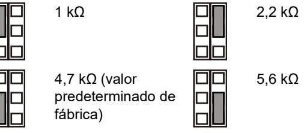

Desactivado: No hay EOL integrado de alarma.

#### **JT: Define la resistencia EOL integrada del tamper (Rt)**

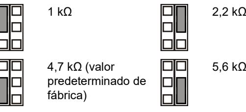

Desactivado: No hay EOL integrado de tamper.

#### **JF: Define la resistencia EOL integrada de fallo (Rf)**

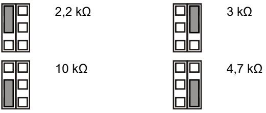

Desactivado: No hay EOL integrada de fallo (valor predeterminado de fábrica).

#### **J1: Definir modo EOL de zona**

Activado: Zona única de 3 resistencias.

Desactivado: Contacto de fallo aislado y zona de 2 resistencias.

#### **Configuración de la zona**

Para configurar la zona, aplique las siguientes instrucciones.

- Seleccione los valores de resistencia EOL correspondientes con JA, JT y JF. Por ejemplo, la configuración del puente JT determina el valor Rt.
- Para las salidas aisladas elimine JT y J1.
- Elimine los puentes JA, JT y JF para excluir los valores EOL integrados.
- Para la configuración de resistencia dual elimine J1 y utilice el terminal 3 y 6.

Para una zona única con todos los valores de resistencia definidos, la zona de resistencia puede ser la siguiente.

**Tabla 2: Valores de resistencia de la zona**

| Estado de zona   | Valor    | Predeterminado |
|------------------|----------|----------------|
| Tamper (corto)   | 0 Ω      | 0 Ω            |
| Normal           | Rt       | 4,7 kΩ         |
| Alarma           | Rt+Ra    | 9,4 kΩ         |
| Avería           | Rt+Rf    | 14,7 kΩ        |
| AM               | Rt+Ra+Rf | 19,4 kΩ        |
| Tamper (abierto) | ∞        | ∞              |

### **Conmutadores DIP**

#### **Tabla 3: SW1, configuración general**

| Interruptor           | Valores                                                               |                                                                           |  |
|-----------------------|-----------------------------------------------------------------------|---------------------------------------------------------------------------|--|
| 6: LED                | Activado: LED activado*                                            | Desactivado: LED desactivado                                           |  |
| 5: Remoto             | Activado: Remoto activado                                          | Desactivado: Remoto desactivado*                                       |  |
| 4: Autotest remoto    | Activado: Autotest remota activado                                 | Desactivado: Autotest remoto desactivado*                              |  |
| 3: Polaridad          | Activado: Polaridad positiva                                       | Desactivado: Polaridad negativa*                                       |  |
| 1, 2: Rango del radar | 1 activado, 2 activado: 12 m* 1 desactivado, 2 activado: 9 m | 1 activado, 2 desactivado: 6 m 1 desactivado, 2 desactivado: 4 m |  |

* Predeterminado de fábrica

#### **Tabla 4: Configuración AM, SW2**

| Interruptor        | Valores                                      |                                                |  |
|--------------------|----------------------------------------------|------------------------------------------------|--|
| 4: Señalización AM | Activado: AM a relés de alarma y fallo*   | Desactivado: AM solo a relé de fallo        |  |
| 3: Rearmar         | Activado: Restablecimiento automático* | Desactivado: Restablecimiento autorizado |  |

| Interruptor             | Valores                                   |                                             |  |
|-------------------------|-------------------------------------------|---------------------------------------------|--|
| 2: Sensibilidad de AM   | Activado: Sensibilidad AM avanzada* | Desactivado: Sensibilidad AM estándar |  |
| 1: Modo Día/Noche de AM | Activado: Solo en modo día de AM*      | Desactivado: AM día y noche              |  |

* Predeterminado de fábrica

## **Conmutador DIP SW1, configuración general**

#### **SW1-1, SW1-2: Rango del radar**

Utilice SW1-1 y SW1-2 para definir el rango del radar para que se ajuste exactamente a la aplicación. El radar es de tipo puerta de distancia lo que significa que el rango de detección es muy preciso.

**ON**

**ON**

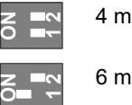

4 m 9 m **1 2**

> **1 2**

6 m 12 m Predeterminado de fábrica.

#### **SW1-3: Polaridad**

Activado: Polaridad positiva. Configura las entradas (WT y D/N) como "Activo alto".

Desactivado: Polaridad negativa. Configura las entradas (WT y D/N) como "Activo bajo". Predeterminado de fábrica.

Esta funcionalidad se explica en la figura 9.

| Figura 9 |                |     |                     |  |
|----------|----------------|-----|---------------------|--|
| (1)      | Polaridad alta | (3) | Prueba de detección |  |
| (2)      | Polaridad baja | (4) | Día/noche           |  |

Esta función también depende de la configuración de SW1-5. Consulte "SW1-5: Funcionalidad remota" más adelante.

#### **SW1-4: Autotest remoto**

Activado: Autotest remoto on. Activa Autotest remoto.

Desactivado: Autotest remoto off. Desactiva Autotest remoto (valor predeterminado de fábrica).

Si el Autotest remoto esta activado, el panel de control puede activar el detector para realizar un test de diagnostico. Este test se activa cambiando a modo test de paseo (Modo dia y WT activado). El detector activa el rele de alarma, si el resultado del test es positivo, y el rele de fallo, si el resultado del test es negativo. Despues del test, el detector continua con su operación habitual.

Esta funcion tambien depende de la programacion de los microinterruptores SW1-5. Consultar "SW1-5: Funcionalidad remota" más adelante.

#### **SW1-5: Funcionalidad remota**

Activado: Remoto activado. Activa WT y las entradas día/noche.

Desactivado: Remoto desactivado. Desactiva las entradas día/noche y WT (predeterminado de fábrica).

La siguiente funcionalidad depende de la configuración Remoto.

**Tabla 5: Funciones que dependen de la configuración Remoto.**

| Elemento | Descripción             | SW1-5 Remoto activado                                       | SW1-5 Remoto desactivado    |
|----------|-------------------------|----------------------------------------------------------------|--------------------------------|
| SW1-3    | Polaridad               | Seleccionable                                                  | Solo positivo                  |
| SW2-1    | Modo Día/Noche de AM | Seleccionable                                                  | AM día y noche                 |
| SW2-3    | Rearmar                 | Seleccionable                                                  | Restablecimiento automático |
| WT       | Entrada WT              | Habilitado                                                     | Inhabilitado                   |
| D/N      | Entrada D/N             | Habilitado                                                     | Inhabilitado                   |
| Otros    | Modo verde              | Habilitado en modo día sin WT                               | Inhabilitado                   |
|          | Memoria de alarma    | Habilitado en modo día sin WT                               | Inhabilitado                   |
|          | Prueba remota           | Llevada a cabo después de cambiar al modo día con WT. | Inhabilitado                   |

Consulte también "Conexiones" en la página 19.

#### **SW1-6: LED**

Activado: Los LED están activados. Consulte "LED y salidas" en la página 22 para ver la funcionalidad de los LED.

Desactivado: Los LED están desactivados para todos los estados.

### **Conmutador DIP SW2, configuración AM**

#### **SW2-1: Modo Día/Noche de AM**

Activado: Solo en modo día de AM. La detección AM solo funciona durante el modo de día (valor predeterminado de fábrica).

Desactivado: AM día y noche. La detección AM siempre está en funcionamiento (modo día y noche).

Esta función también depende de la configuración de SW1-5. Consulte "SW1-5: Funcionalidad remota" en la página 20.

#### **SW2-2: Sensibilidad AM**

Activado: Sensibilidad AM avanzada. El detector señala la zona AM enmascarada (valor predeterminado de fábrica).

**Nota:** Esta es la configuración requerida por la norma EN 50131 Grado 3.

Desactivado: Sensibilidad AM estándar. El detector señala la zona AM de acercamiento.

#### **SW2-3: Restablecimiento**

Activado: Restablecimiento automático. El estado de alarma AM puede restablecerse 40 segundos después de que se produzca la alarma (valor predeterminado de fábrica).

Desactivado: Restablecimiento autorizado. El estado de alarma AM solo se puede restablecer después de que se apliquen los modos WT y día.

#### **Notas**

- Para la configuración avanzada (SW2-2 está activado) tiene que eliminarse el origen de la alarma AM para que pueda restablecerse AM.
- Si la alarma no se puede restablecer con un restablecimiento automático o autorizado, desconecte la fuente de alimentación y vuelva a conectarla.
- Debe llevarse a cabo una prueba de detección para garantizar que la configuración del dispositivo es la apropiada para la aplicación.

Esta función también depende de la configuración de SW1-5. Consulte "SW1-5: Funcionalidad remota" en la página 20.

#### **SW2-4: Señalización AM**

Activado: AM a relés de alarma y fallo. La alarma AM se señaliza mediante las salidas de alarma y de fallo (predeterminado de fábrica)

**Nota:** Esta es la configuración necesaria para EN 50131 Grado 3.

Desactivado: AM solo a relé de fallo. La alarma AM se señaliza mediante la salida de fallo.

### **Calibración AM**

Durante el inicio el sistema de circuitos de AM se calibra con su entorno. Es importante asegurarse de que no se producen cambios en el entorno en un radio de 1 metro de distancia del detector los 60 segundos posteriores a su puesta en funcionamiento, de lo contrario el detector podría ser vulnerable a falsas alarmas AM y podría no ser posible restablecer estas alarmas.

### **Configuración del patron de cobertura**

- Retire las mascaras si es necesario (Figura 8, parte 1). El patron modificado se muestra en la Figura 8, partes 3 a 7.
**Nota:** Si ambas mascaras están instalados, el rango del detector se limita a 6m (defecto).

- Para modificar el patron se deben romper las mascaras (mostradas en gris en la Figura 8, parte 1). Las correspondientes partes de cortinas se muestran en la Figura 8, parte 2.
- Si fuera necesario, colocar las apropiadas etiquetas en los espejos. Para mas detalles Figura 7, parte 1.

**Precaución:** Al retirar las etiquetas una vez colocadas, se puede dañar la superficie del espejo.

- Cuando existen objetos cercanos justo debajo del detector, encaje la mascara en el interior de la ventana (por defecto). Esto anula la parte de las cortinas que enfocan hacia abajo del detector, y que pueden desestabilizar al detector. Mirar Figura 7, parte 2.
**Nota:** La reducción del campo de visión no cumple con las instalaciones de la norma EN 50131 Grado 3.

### **Autoprueba**

El detector supervisa los circuitos de PIR, microondas y AM de forma continua. Los defectos se señalan en el panel como fallos técnicos.

### **Prueba de detección del detector**

Existen dos formas de activar el modo de prueba de detección.

**SW1-6 configurado en LED activado, SW1-5 configurado en remoto desactivado**

En este modo la indicación del LED siempre es activado (modo de prueba de detección constante).

**SW1-6 configurado en LED activado, SW1-5 configurado en remoto activado**

Esta configuración permite la entrada de prueba de detección (clavija 7) y la entrada de día/noche (clavija 8). Esto permite que el usuario active la indicación LED de forma remota configurando el detector en modo de día y activar la prueba de detección.

### **Modo verde**

Cuando SW1-5 se configura en remoto activado, el radar se apaga durante el modo de día (sin WT) para reducir el consumo actual. El detector funciona entonces en modo PIR únicamente.

**Nota:** La línea día/noche se tiene que conectar al panel de control para que este modo funcione.

Este modo no cumple con la norma EN 50131-2-4.

**Sólo DD1012AM-N:** Durante los primeros 180 segundos de funcionamiento del modo verde, el detector pasa al modo PIR de alta sensibilidad para permitir la realización de pruebas adicionales, por ejemplo, mediante el uso de una fuente de calor externa para probar una reducción significativa del alcance. Después de 180 segundos, el detector vuelve a la sensibilidad estándar.

### **Memoria de alarma**

Cuando SW1-5 se establece en remoto activado, las alarmas que se producen durante el modo noche se almacenan en la memoria del detector. Se indican mediante un LED de color rojo intermitente cuando la unidad se cambia a modo día (prueba de detección desactivada). La memoria se borra cuando el detector se vuelve a poner en modo noche.

**Nota:** Define SW1-6 en desactivado para evitar que la memoria de la alarma se muestre en los LED. Consulte "SW1- 6: LED" en la página 21.

### **LED y salidas**

Para habilitar las funcionalidad LED, define SW1-6 en activado, de los contrario los LED estarán desactivados en cualquier condición. Consulte "SW1-6: LED" en la página 21 para obtener más información.

| Estado                                               | LED rojo | LED amarillo | Relé de alarma   | Relé de fallo | Restablecimiento                   |
|------------------------------------------------------|----------|--------------|---------------------|------------------|------------------------------------|
| Inicio                                               |          |              | Cerrado             | Cerrado          | Automáticamente después de 60 s |
| Bajo voltaje                                         |          |              | Abrir               | Abrir            | Aplicar el voltaje adecuado     |
| Alarma PIR de intruso                             |          |              | Cerrado             | Cerrado          |                                    |
| Alarma de intruso por microondas                  |          |              | Cerrado             | Cerrado          |                                    |
| Alarma de intruso por movimiento doble         |          |              | Abrir               | Cerrado          | Automáticamente después de 3 s  |
| Memoria alarma dual                               |          |              | Cerrado             | Cerrado          | Cambiar a modo noche            |
| Alarma AM                                            |          |              | Depende de SW2-4 | Abrir            | Depende de SW2- 3               |
| Fallo técnico                                        |          |              | Cerrado             | Abrir            | Prueba de detección correcta    |
| Activado de forma continua Parpadeo normal (1 Hz) |          |              |                     |                  |                                    |

### **Especificaciones**

**Tabla 6: LED y salidas**

| Tecnología del detector                                | Doble+AM                                              |
|--------------------------------------------------------|-------------------------------------------------------|
| Rango                                                  | 4, 6, 9, 12 m seleccionable mediante SW1-1 y SW1-2 |
| Ángulo de visión                                       | 78 grados                                             |
| Óptica PIR                                             | 9 cortinas de espejo de alta densidad              |
| Frecuencia de microondas                               | 5725–5875 MHz                                         |
| Maxima potencia de salida                              | 13,46 mW                                              |
| Salida de microondas máxima a 1 m.                     | 0,003 μW/cm²                                          |
| Función de memoria                                     | Sí                                                    |
| Alimentación de entrada                                | de 9 a 15 V (12 V nominal)                           |
| Inmunidad de tensión de pico a pico                    | 2 V (a 12 V)                                         |
| Tiempo de arranque del detector                        | 60 s                                                  |
| Consumo de corriente                                   | Entre 10 y 22 mA (11 mA nom.)                      |
| Altura de instalación                                  | De 2,0 a 2,6 m                                        |
| Rango de velocidades de destino:                       |                                                       |
| DD1012AM-N                                             | De 0,2 a 3,0 m/s                                      |
| DD1012AM-D-N                                           | De 0,1 a 4,0 m/s                                      |
| Característica de relé del tamper/de la alarma (NC) | 80 mA 30 V, Formulario A                             |
| Característica de relé de fallo                        | 80 mA 30 V, Formulario A                             |
| Tiempo de alarma                                       | 3 s                                                   |
| Temperatura de funcionamiento                          | De −10 a +55°C                                        |
| Humedad relativa                                       | 95% máx., sin condensación                            |
| Peso                                                   | 120 g                                                 |
| Dimensiones (Al x An x Pro)                            | 126 × 63 × 50 mm                                      |
| Rango de IP/IK                                         | IP30 IK04                                             |
| Tamper de pared                                        | Sí                                                    |

### **Información normativa**

| Fabricante                                                        | COLOCADO EN EL MERCADO POR: Carrier Fire & Security Americas Corporation Inc. 13995 Pasteur Blvd Palm Beach Gardens, FL 33418, EE. UU. REPRESENTANTE AUTORIZADO DE LA UE: Carrier Fire & Security B.V. Kelvinstraat 7, 6003 DH Weert, Países Bajos                                                                                                                                                                               |
|-------------------------------------------------------------------|----------------------------------------------------------------------------------------------------------------------------------------------------------------------------------------------------------------------------------------------------------------------------------------------------------------------------------------------------------------------------------------------------------------------------------------------------|
| Advertencias del producto y descargos de responsabilidad | ESTOS PRODUCTOS ESTÁN DESTINADOS A LA VENTA A, E INSTALACIÓN POR, UN PROFESIONAL DE SEGURIDAD EXPERIMENTADO. CARRIER FIRE & SECURITY NO PUEDE GARANTIZAR QUE TODA PERSONA O ENTIDAD QUE COMPRE SUS PRODUCTOS, INCLUYENDO CUALQUIER "DISTRIBUIDOR O VENDEDOR AUTORIZADO", CUENTE CON LA FORMACIÓN O EXPERIENCIA PERTINENTE PARA INSTALAR CORRECTAMENTE PRODUCTOS RELACIONADOS CON LOS INCENDIOS Y LA SEGURIDAD. |
|                                                                   | Para obtener más información sobre exclusiones de garantía e información de seguridad de productos, consulte https://firesecurityproducts.com/policy/product warning/ o escanee el código QR.                                                                                                                                                                                                                                          |
| Certificado                                                       |                                                                                                                                                                                                                                                                                                                                                                                                                                                    |
|                                                                   | Carrier Fire & Security declara por este medio que este dispositivo cumple con los requisitos y disposiciones aplicables de todas las reglas y regulaciones aplicables, incluyendo pero no limitado a la Directiva 2014/53/EU. Para mas información consulte firesecurityproducts.com.                                                                                                                                              |
| REACH                                                             | Los productos REACH pueden contener sustancias que están incluidas en la Lista de sustancias Candidatas en una concentración en peso superior al 0,1%, según la más reciente Lista de sustancias Candidatas publicada en la Web de ECHA. Puede encontrar información sobre su uso seguro en https://firesecurityproducts.com/en/content/intrusi on-intro                                                                |
|                                                                   | 2012/19/EU (directiva WEEE): los productos marcados con este símbolo no se pueden desechar como residuos urbanos no clasificados en la Unión Europea. Para que se pueda realizar un reciclaje adecuado, devuelva este producto a su representante de ventas local al comprar un equipo nuevo similar o deséchelo en los puntos de recogida designados. Para obtener más información, consulte: recyclethis.info            |
| Documentación de producto                                      | Por favor, consulte el siguiente enlace Web para recuperar la versión electrónica de la documentación del producto. Este enlace le guiará a su página de contacto local de EMEA. En esta página puede solicitar su acceso al portal web seguro donde se almacenan todos los manuales. https://firesecurityproducts.com/en/contact                                                                                             |

# **Información de contacto**

firesecurityproducts.com o www.aritech.com

# **FR: Fiche d'installation**

### **Description**

DD1012AM(-D)-N est un détecteur de mouvement AM à double technologie.

Il associe la technologie brevetée d'optique à miroir IRP à la technologie brevetée de radar à portée contrôlée.

### **Instructions d'installation**

Voir la Figure 1.

Le détecteur est initialement destiné à un montage mural mais peut également être fixé au plafond à l'aide d'un support adapté.

Suivez les instructions ci-dessous pour déterminer le meilleur endroit où installer le détecteur.

- Montez le détecteur de manière à ce que la zone de couverture couvre le passage d'un intrus (voir la Figure 3).
- Montez le détecteur sur une surface stable. Pour la hauteur de montage autorisée, voir « Caractéristiques techniques » en page 28.
- Ne montez pas le détecteur à moins de 0,5 m d'objets métalliques ou à moins de 1,5 m de lumières fluorescentes.
- Ne placez pas d'objets pouvant masquer le champ de vision du détecteur.
- Respectez une distance d'au moins 6 m entre chaque détecteur et utilisez le réglage de courte portée pour éviter les interférences lorsque des détecteurs sont montés en vis-à-vis.

Le traitement à double technologie de ce détecteur est conçu pour résister aux risques de fausses alarmes. Toutefois, il est conseillé d'éviter les causes d'instabilité potentielles, telles que :

Risques liés à l'IRP :

- L'exposition du détecteur à la lumière directe du soleil
- Les sources de chaleur dans le champ de vision du détecteur
- Les courants d'air puissants sur le détecteur
- La présence d'animaux dans le champ de vision
- L'obstruction du champ de vision du détecteur par des objets volumineux, comme des meubles

Risques liés aux hyperfréquences :

- La surface de montage est sensible aux vibrations
- Les surfaces métalliques reflétant l'énergie des hyperfréquences
- Le mouvement de l'eau à travers les tuyaux de plastique
- Le déplacement ou les vibrations d'objets tels que des ventilateurs ou des conduits thermiques ou de climatisation

Risques liés à l'anti-masque (AM) :

- Déplacement d'objets à moins de 1 m devant le détecteur
- Présence de petits insectes sur le détecteur
- Eclairage fluorescent moderne à proximité immédiate du détecteur (dans un rayon de 1,5 m)

**ATTENTION !** L'équipement n'est pas mis à la terre. Tout circuit externe raccordé à l'équipement doit être situé dans le même bâtiment et relié à un conducteur de terre de protection.

L'isolation des câbles raccordés à l'équipement doit être conforme aux normes IEC 60332-1-2 et IEC 60332-1-3 ou IEC 60332-2-2, selon la section du câble, ou IEC TS 60695- 11-21, indépendamment de la section. Ces fils doivent être également conformes à la norme UL 2556 VW-1.

La source d'alimentation du détecteur doit être limitée à 15 W.

Nous recommandons de tester régulièrement le détecteur et de vérifier la centrale.

**Installation du détecteur :**

- 1. Soulevez le couvercle (voir la Figure 2, éléments 1 et 2).
- 2. A l'aide d'un tournevis, ouvrez délicatement le détecteur en faisant levier (voir fig. 2, éléments 3 et 4).

**Attention :** Veillez à ne pas toucher le capteur pyroélectrique (Figure 6).

- 3. Retirez la vis du cache (Figure 4, élément 2).
- 4. Fixez la base au mur. Pour la hauteur de montage autorisée, voir « Caractéristiques techniques » en page 28.

Voir Figure 4. Quelle que soit la position, utilisez au minimum deux vis M4 conformes DIN 7505B, DIN 96 ou DIN 7996, ou utilisez une vis munie d'une tête de 8 mm de diamètre, sur une surface plane.

- Pour un montage à plat, utilisez les vis en position A.
- Pour un montage en angle, utilisez les vis en position B ou C.

**Remarque pour les installations EN 50131 Grade 3 :**  N'utilisez pas la position de montage C. Il est nécessaire d'utiliser les trous de montage A2 et B2 pour la position de montage A et B.

- Pour installer l'autoprotection à l'arrachement (ST400), utilisez la position de montage A. La position de montage de l'autoprotection ST400 est représentée par l'élément 3 dans la Figure 4. Ouvrez le loquet du panneau arrière (Figure 5, élément 2).

- 5. Raccordez le détecteur (voir figures 4 et 12). Utilisez les orifices d'entrée (Figure 5, élément 1) et le coupe-câble (Figure 5, élément 3) situés sur le panneau arrière.
- 6. Réglez les cavaliers et les commutateurs DIP de manière appropriée (pour plus d'informations, reportez-vous à la section « Réglage du détecteur » ci-dessous).
- 7. Retirer les caches et ajouter les autocollants, si nécessaire. Voir « Configuration de la couverture » en page 27 pour plus détails.
- 8. Pour les applications de montage au plafond, utilisez la patte de fixation à pivot SB01. La position de montage de la patte de fixation SB01 est représentée par l'élément 1 de la Figure 4.

**Remarque :** L'utilisation de SB01 n'est pas conforme aux installations EN 50131 Grade 3.

- 9. Fermez le cache, insérez la vis, puis replacez le couvercle.
## **Connexions**

Voir la Figure 12.

**Tableau 1 : Connexions du détecteur**

| Borne | Libellé      | Explication                                                                                                                                                                                                                                                                                                                                            |
|-------|--------------|--------------------------------------------------------------------------------------------------------------------------------------------------------------------------------------------------------------------------------------------------------------------------------------------------------------------------------------------------------|
| 1, 2  | GND, +12V | Raccordement électrique (9 à 15 V, 12 V en tension nominale)                                                                                                                                                                                                                                                                                      |
| 3, 4  | ALARM        | Sortie relais d'alarme (33 Ω). Utilisez le cavalier JA pour régler la résistance FDL embarquée en série avec le relais. Reportez-vous à la section « Cavaliers » en page 25.                                                                                                                                                                  |
| 5, 6  | TAMPER       | Sortie du commutateur d'autoprotection (0 Ω). Utilisez le cavalier JT pour régler la résistance FDL embarquée en série avec le commutateur. Reportez-vous à la section « Cavaliers » en page 25.                                                                                                                                           |
| 7     | Walk test    | Cette entrée permet d'activer et de désactiver le voyant lumineux (test de marche activé/désactivé). Le mode Walk Test (Test de marche) ne peut être utilisé que lorsque le détecteur est en mode Jour (broche n°8). Les modes Actif haut et bas sont déterminés par le commutateur SW1-3 (voir « SW1-3 : Polarité » en page 26). |
| 8     | Day/Night    | Cette entrée active le mode Jour (affichage de l'alarme mémorisée sur le voyant lumineux) ou Nuit (active la mémoire d'alarme et efface les alarmes précédemment enregistrées). La polarité des modes Actif haut et bas est déterminée par le commutateur SW1-3 (voir « SW1-3 : Polarité » en page 26).                              |
| 9, 10 | Fault        | Sortie relais de défaut (33 Ω). Utilisez le cavalier JF pour insérer une des résistances DFL embarquées en série avec le relais. Reportez vous à la section « Cavaliers » en page 25 pour connaître les réglages appropriés de la résistance.                                                                                           |

#### **Remarques**

- Les entrées 7 et 8 ne peuvent être utilisées que lorsque le commutateur SW1-5 est défini sur Remote on (Contrôle à distance activé). Reportez-vous à la section « SW1-5 : Fonction de contrôle à distance » en page 26.
- Ce voyant lumineux n'est actif que lorsque le commutateur SW1-6 est réglé sur LED on (Voyant allumé).

La Figure 10 explique comment créer une zone unique avec une configuration en résistances multiples.

#### **Figure 10**

- (1) Relais d'alarme
- (2) Zone d'alarme
- (3) Sortie du commutateur
- d'autoprotection
- (4) Relais de défaut
- Ra Résistance de fin de ligne d'alarme Rt Résistance de fin de ligne
- d'autoprotection Rf Résistance de fin de ligne de défaut

### **Réglage du détecteur**

Consultez la Figure 13 pour connaître l'emplacement des cavaliers et du commutateur DIP.

### **Cavaliers**

Les cavaliers déterminent le mode et la valeur de fin de ligne embarquée. Le circuit est illustré dans la Figure 10.

**JA : détermine la résistance FDL de l'alarme embarquée (Ra)**

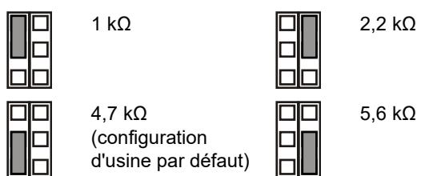

Position OFF : aucune FDL d'alarme embarquée.

**JT : détermine la résistance FDL de l'autoprotection embarquée (Rt)**

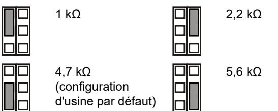

Position OFF : aucune FDL d'autoprotection embarquée.

**JF : détermine la résistance FDL de défaut embarquée (Rf)**

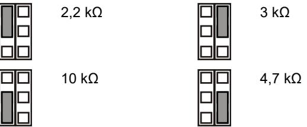

Position OFF : aucune FDL de défaut embarquée (configuration d'usine par défaut).

**J1 : détermine le mode FDL de la zone**

Position ON : zone unique à 3 résistances.

Position OFF : zone à 2 résistances et isolée contre les défauts de contact.

**Configuration de la zone**

Pour configurer la zone, suivez la procédure ci-après.

- Sélectionnez les valeurs appropriées de résistance FDL avec les cavaliers JA, JT et JF. Par exemple, le réglage du cavalier JT détermine la valeur Rt.
- Pour les sorties isolées, retirez les cavaliers JT et J1.
- Retirez les cavaliers JA, JT et JF pour exclure les valeurs de FDL embarquée.
- Pour le réglage à double résistance, retirez le cavalier J1 et utilisez les bornes 3 et 6.

Pour configurer une zone unique avec toutes les résistances embarquées réglées, la résistance de la zone peut être définie comme suit :

#### **Tableau 2 : Valeurs de résistance de zone**

| Etat de la zone                | Valeur   | Par défaut |
|--------------------------------|----------|------------|
| Autoprotection (court-circuit) | 0 Ω      | 0 Ω        |
| Normal                         | Rt       | 4,7 kΩ     |
| Alarme                         | Rt + Ra  | 9,4 kΩ     |
| Défaut                         | Rt+Rf    | 14,7 kΩ    |
| AM                             | Rt+Ra+Rf | 19,4 kΩ    |
| Autoprotection (ouvert)        | ∞        | ∞          |

### **Commutateurs DIP**

#### **Tableau 3 : SW1, paramètres généraux**

| Commutateur      | Valeurs                            |                                      |
|------------------|------------------------------------|--------------------------------------|
| 6 : Voyant       | Position ON : Voyant allumé*    | Position OFF : Voyant éteint      |
| 5 : Contrôle à   | Position ON : Contrôle à           | Position OFF : Contrôle              |
| distance         | distance activé                    | à distance désactivé*                |
| 4 : Test distant | Position ON : Test                 | Position OFF : Test                  |
| auto             | distant auto activé                | distant auto désactivé*              |
| 3 : Polarité     | Position ON : Polarité positive | Position OFF : Polarité négative* |
| 1, 2 : Portée du | 1 On, 2 On : 12 m*                 | 1 On, 2 Off : 6 m                    |
| radar            | 1 Off, 2 On : 9 m                  | 1 Off, 2 Off : 4 m                   |

* Configuration usine par défaut

**Tableau 4 : Commutateur SW2, réglages de l'anti-masque**

| Commutateur                            | Valeurs                                                  |                                                         |
|----------------------------------------|----------------------------------------------------------|---------------------------------------------------------|
| 4 : Signal de l'anti masque (AM)    | Position ON : AM sur relais d'alarme et de défaut* | Position OFF : AM sur relais de défaut uniquement |
| 3 : Réinitialisation                   | Position ON : réinitialisation automatique*        | Position OFF : réinitialisation autorisée         |
| 2 : Sensibilité d'anti-masque       | Position ON : sensibilité d'anti-masque avancée*      | Position OFF : sensibilité d'anti masque standard |
| 1 : Mode jour/nuit de l'anti-masque | Position ON : AM mode jour uniquement*                | Position OFF : AM jour et nuit                       |

* Configuration usine par défaut

### **Commutateur DIP SW1, paramètres généraux**

#### **SW1-1, SW1-2 : Portée du radar**

Utilisez les commutateurs SW1-1 et SW1-2 pour définir la portée du radar de sorte qu'elle s'adapte précisément à l'application. Ce radar inclut une fonction de crénelage spatial (range-gating), ce qui signifie que la portée de détection est extrêmement précise.

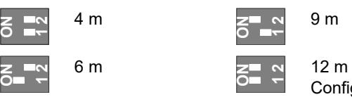

**1 2**

**1 2** Configuration d'usine par défaut

#### **SW1-3 : Polarité**

Position ON : Polarité positive. Configure les entrées (WT, test de marche et D/N, mode jour/nuit) avec le paramètre Actif haut.

Position OFF : Polarité négative. Configure les entrées (WT, test de marche et D/N, mode jour/nuit) avec le paramètre Actif bas. Configuration d'usine par défaut.

Cette fonctionnalité est expliquée dans la Figure 9.

| Figure 9 |  |
|----------|--|
|----------|--|

(1) Polarité haute (2) Polarité basse (3) Test de marche (4) Jour/nuit

Cette fonction dépend également du réglage du commutateur SW1-5. Reportez-vous à la section « SW1-5 : Fonction de contrôle à distance » ci-dessous.

#### **SW1-4 : Test distant auto**

Position ON : Test distant auto activé. Active le test automatique à distance.

Position OFF : Test distant auto activé. Désactive le test automatique à distance (paramètre usine).

Si le test automatique à distance est activé, la centrale peut déclencher le détecteur pour effectuer un test de diagnostic. Ce test est activé par activant le test de marche (mode jour et WT activé). Le détecteur active le relais d'alarme si le résultat du test est positif, et le relais de défaut si le résultat du test est négatif. Après le test, le détecteur revient en fonctionnement normal.

Cette fonction dépend également de la position du switch SW1-5. Voir « SW1-5 : Fonction de contrôle à distance » cidessous.

#### **SW1-5 : Fonction de contrôle à distance**

Position ON : contrôle à distance activé. Active les entrées du test de marche (WT) et du mode jour/nuit.

Position OFF : contrôle à distance désactivé. Désactive les entrées du test de marche et du mode jour/nuit (configuration d'usine par défaut).

La fonction suivante dépend du réglage du contrôle à distance.

**Tableau 5 : Fonctions dépendant du réglage du contrôle à distance**

| Elément | Description                           | Contrôle à distance activé sur SW1-5 | Contrôle à distance désactivé sur SW1-5 |
|---------|---------------------------------------|--------------------------------------------|-----------------------------------------------|
| SW1-3   | Polarité                              | Sélectionnable                             | Positive seulement                            |
| SW2-1   | Mode jour/nuit de l'anti masque | Sélectionnable                             | AM jour et nuit                               |
| SW2-3   | Réinitialisation                      | Sélectionnable                             | réinitialisation automatique               |
| WT      | Entrée du test de marche           | Activé                                     | Désactivée                                    |
| D/N     | Entrée du mode jour/nuit           | Activé                                     | Désactivée                                    |

| Elément | Description         | Contrôle à distance activé sur SW1-5                       | Contrôle à distance désactivé sur SW1-5 |
|---------|---------------------|------------------------------------------------------------------|-----------------------------------------------|
| Autre   | Mode vert           | Activée en mode jour sans test de marche                   | Désactivée                                    |
|         | Mémoire d'alarme | Activée en mode jour sans test de marche                   | Désactivée                                    |
|         | Test à distance     | Effectué après passage en mode jour avec test de marche | Désactivée                                    |

Reportez-vous également la section « Connexions » en page 24.

#### **SW1-6 : Voyants lumineux**

Position ON : les voyants lumineux sont activés. Reportezvous à la section « Voyants lumineux et sorties » en page 27 pour connaître la fonction des voyants lumineux.

Position OFF : les voyants lumineux sont désactivés pour tous les états.

### **Commutateur DIP SW2, réglages de l'antimasque**

#### **Commutateur SW2-1 : Mode jour/nuit de l'anti-masque**

Position ON : AM mode jour uniquement. La détection de l'antimasque ne fonctionne qu'en mode jour (configuration d'usine par défaut).

Position OFF : AM jour et nuit. La détection de l'anti-masque fonctionne en permanence (modes jour et nuit).

Cette fonction dépend également du réglage du commutateur SW1-5. Reportez-vous à la section « SW1-5 : Fonction de contrôle à distance » ci-dessus.

**Commutateur SW2-2 : Sensibilité de l'anti-masque**

Position ON : sensibilité d'anti-masque avancée. Le détecteur signale le masquage de la zone AM (configuration d'usine par défaut).

**Remarque :** Il s'agit de la configuration requise EN 50131 Grade 3.

Position OFF : sensibilité d'anti-masque standard. Le détecteur signale l'approche de la zone AM.

#### **Commutateur SW2-3 : Réinitialisation**

Position ON : réinitialisation automatique. L'état de l'alarme AM peut être réinitialisé 40 s après le déclenchement de l'alarme (configuration d'usine par défaut).

Position OFF : réinitialisation autorisée. L'état de l'alarme AM ne peut être réinitialisé qu'après avoir appliqué le mode WT (test de marche) et le mode jour.

#### **Remarques**

- Pour le réglage avancé (commutateur SW2-2 en position On), la source de l'alarme AM doit être retirée pour que vous puissiez réinitialiser l'anti-masque.
- Si l'alarme AM ne peut pas être réinitialisée avec la réinitialisation automatique ou autorisée, débranchez l'alimentation électrique, puis rebranchez-la.
- Il est recommandé d'effectuer un test de marche afin de vérifier que les paramètres de l'appareil conviennent pour cette application.

Cette fonction dépend également du réglage du commutateur SW1-5. Reportez-vous à la section « SW1-5 : Fonction de contrôle à distance » en page 26.

**Commutateur SW2-4 : Signal de l'anti-masque**

Position ON : AM sur relais d'alarme et de défaut. L'alarme AM est signalée à la fois par les sorties d'alarme et de défaut (configuration d'usine par défaut).

**Remarque :** Il s'agit de la configuration requise pour la norme EN 50131 Niveau 3.

Position OFF : AM sur relais de défaut uniquement. L'alarme AM est signalée par la sortie de défaut.

### **Calibrage de l'anti-masque**

Au démarrage, le circuit de l'anti-masque s'auto-calibre par rapport à son environnement. Il est important de vérifier qu'aucune modification n'est intervenue dans l'environnement, dans un rayon de 1 m de distance du détecteur, dans les 60 s suivant la mise sous tension. A défaut, le détecteur risque d'être sensible aux fausses alarmes AM, qui ne pourraient alors pas être réinitialisées.

### **Configuration de la couverture**

- Retirer les caches (Figure 8, indice 1) si nécessaire. La couverture modifiée est indiquée à la Figure 8, indices 3 à 7.
**Note :** Si tous les caches sont installés, la portée du détecteur est limitée à 6 m (par défaut).

- Modifier la couverture en cassant les différentes parties du cache (indiqué en gris sur la Figure 8, indice 1). Les fragments du rideau correspondant sont indiqués à la Figure 8, indice 2.
- Placer les autocollants de miroir appropriés si nécessaire. Voir la Figure 7, indice 1 pour plus détails.

**Attention :** La surface du miroir peut être endommagée en retirant les caches stickers.

- Quand des objets se situent directement sous le détecteurs, mettre en place le masque à l'intérieur de la fenêtre (par défaut). Cela désactivera les rideaux regardant en dessous, qui peuvent déstabiliser le détecteur. Voir la Figure 7, indice 2.
**Remarque :** la réduction du champ de vision proche n'est pas conforme aux installations EN 50131 Grade 3.

### **Auto-test**

Le détecteur surveille constamment les circuits IRP, AM et d'hyperfréquences. Sur la centrale, les défauts sont signalés en tant que problèmes techniques.

### **Test de marche sur le détecteur**

Le mode de test de marche peut être activé de deux façons.

**Voyant du SW1-6 activé, contrôle à distance du SW1-5 désactivé**

Dans cette configuration, le voyant lumineux est toujours activé (mode de test de marche constant).

**Voyant du SW1-6 activé, contrôle à distance du SW1-5 activé**

Ce paramètre active l'entrée du test de marche (broche n°7) et celle du mode jour/nuit (broche n°8). Il permet à l'utilisateur d'activer le voyant lumineux à distance en faisant basculer le détecteur en mode Jour et en activant le test de marche.

### **Mode vert**

Lorsque le contrôle à distance est activé sur le commutateur SW1-5, le radar est désactivé en mode Jour (aucun de test de marche) afin de réduire la consommation d'électricité. Le détecteur fonctionne alors en mode IRP seulement.

**Remarque :** Pour que ce mode fonctionne, la ligne Jour/Nuit doit être connectée à la centrale.

Ce mode n'est pas conforme à la norme EN 50131-2-4.

**DD1012AM-N uniquement :** Pendant les 180 premières secondes du fonctionnement en mode Eco, le détecteur passe en mode IRP haute sensibilité pour permettre des tests supplémentaires, par exemple, en utilisant une source de chaleur externe pour tester une réduction de portée significative. Après 180 secondes, le détecteur revient à la sensibilité standard.

### **Mémoire d'alarme**

Lorsque le contrôle à distance du commutateur SW1-5 est activé, les alarmes déclenchées en mode Nuit sont stockées dans la mémoire du détecteur. Elles sont indiquées par un voyant rouge lumineux lorsque l'unité passe en mode Jour (test de marche désactivé). La mémoire est effacée lorsque le détecteur repasse en mode Nuit.

**Remarque :** Réglez le commutateur SW1-6 sur Off (Désactivé) pour ne pas afficher la mémoire d'alarme sur les voyants lumineux. Reportez-vous à la section « SW1-6 : Voyants lumineux » en page 26.

### **Voyants lumineux et sorties**

Pour activer les voyants lumineux, réglez le commutateur SW1-6 sur On (Activé), sinon ils seront désactivés quel que soit l'état de l'unité. Reportez-vous à la section « SW1-6 : Voyants lumineux » en page 26 pour plus d'informations.

**Tableau 6: Voyants lumineux et sorties**

| Etat                                    | Voyant rouge | Voyant jaune | d'alarme Relais              | Relais de défaut | Réinitialisation                 |
|-----------------------------------------|--------------|--------------|---------------------------------|---------------------|----------------------------------|
| Démarrage                               |              |              | Fermé                           | Fermé               | Automatiquement après 60 s    |
| Basse tension                           |              |              | Ouvert                          | Ouvert              | Utiliser une tension correcte |
| Alarme intrusion IRP                 |              |              | Fermé                           | Fermé               |                                  |
| Alarme intrusion hyperfréquence      |              |              | Fermé                           | Fermé               |                                  |
| Alarme intrusion mouvement double |              |              | Ouvert                          | Fermé               | Automatiquement après 3 s     |
| Mémoire double détection             |              |              | Fermé                           | Fermé               | Passer en mode nuit           |
| Alarme AM                               |              |              | Selon le réglage du SW2-4 | Ouvert              | Selon le réglage du SW2-3     |
| Problème technique                   |              |              | Fermé                           | Ouvert              | Test de marche réussi         |
|                                         |              |              |                                 |                     |                                  |

Allumé en continu Clignotant (1 Hz)

### **Caractéristiques techniques**

| Technologie de détection                                       | Double + AM                                      |
|----------------------------------------------------------------|--------------------------------------------------|
| Portée                                                         | 4, 6, 9 ou 12 m, sélection via SW1-1 et SW1-2 |
| Angle de vue                                                   | 78 degrés                                        |
| Optique IRP                                                    | 9 miroirs à rideau haute densité                 |
| Fréquence de l'hyperfréquence                                  | 5725–5875 MHz                                    |
| Sortie de puissance maximum                                    | 13,46 mW                                         |
| Sortie hyperfréquence max. à 1 m                               | 0,003 μW/cm²                                     |
| Fonction de mémoire                                            | Oui                                              |
| Puissance d'entrée                                             | 9 à 15 V (12 V en tension nominale)          |
| Insensible à l'ondulation crête à crête                     | 2 V (à 12 V)                                    |
| Temps de démarrage du détecteur                                | 60 s                                             |
| Consommation électrique                                        | 12 à 22 mA (12 mA nom.)                          |
| Hauteur de montage                                             | 2 à 2,6 m                                        |
| Vitesse de la cible : DD1012AM-N DD1012AM-D-N            | 0,2 à 3,0 m/s 0,1 à 4,0 m/s                   |
| Caractéristiques du relais d'alarme (NC) / d'autoprotection | 80 mA 30 V, Forme A                             |
| Caractéristiques du relais de défaut                           | 80 mA 30 V, Forme A                             |
| Durée d'alarme                                                 | 3 s                                              |
| Température de fonctionnement                                  | −10 à +55 °C                                     |
| Humidité relative                                              | 95 % max., sans condensation                     |
| Poids                                                          | 120 g                                            |
| Dimensions (H x L x P)                                         | 126 × 63 × 50 mm                                 |
| Classe IP/IK                                                   | IP30 IK04                                        |
| Protection contre l'arrachement                                | Oui                                              |

### **Informations sur la réglementation**

| Fabricant                                          | MISE SUR LE MARCHÉ PAR : Carrier Fire & Security Americas Corporation Inc. 13995 Pasteur Blvd Palm Beach Gardens, FL 33418, USA REPRÉSENTANT DE L'UNION EUROPÉENNE AUTORISÉ : Carrier Fire & Security B.V. Kelvinstraat 7, 6003 DH Weert, Pays-Bas                                                                                                                                                                                                                                                                                                                                      |
|----------------------------------------------------|--------------------------------------------------------------------------------------------------------------------------------------------------------------------------------------------------------------------------------------------------------------------------------------------------------------------------------------------------------------------------------------------------------------------------------------------------------------------------------------------------------------------------------------------------------------------------------------------------------------|
| Avertissements et avis de non responsabilité | CES PRODUITS SONT DESTINÉS À DES PROFESSIONNELS EXPÉRIMENTÉS, QUI DOIVENT ÉGALEMENT SE CHARGER DE LEUR INSTALLATION. CARRIER FIRE & SECURITY NE PEUT GARANTIR QU'UNE PERSONNE OU ENTITÉ FAISANT L'ACQUISITION DE CEUX-CI, Y COMPRIS UN REVENDEUR AGRÉÉ, DISPOSE DE LA FORMATION OU DE L'EXPÉRIENCE REQUISE POUR PROCÉDER À CETTE MÊME INSTALLATION DE FAÇON APPROPRIÉE. Pour obtenir des informations supplémentaires sur les garanties et la sécurité, rendez-vous à l'adresse https://firesecurityproducts.com/policy/product warning/ ou scannez le code QR. |
| Certification                                      |                                                                                                                                                                                                                                                                                                                                                                                                                                                                                                                                                                                                              |
|                                                    | Carrier Fire & Security déclare par la présente que cet appareil est conforme aux exigences applicables et aux dispositions de toutes les règles et règlements applicables, y compris, mais sans s'y limiter, de la Directive 2014/53/EU. Pour plus d'informations, voir firesecurityproducts.com.                                                                                                                                                                                                                                                                                            |
| REACH                                              | Ce produit peut contenir des substances figurant également sur la Liste de substances candidates à une concentration supérieure à 0,1 % p/p, selon la Liste de substances candidates la plus récente publiée sur le site web de l'Agence européenne des produits chimiques (ECHA).                                                                                                                                                                                                                                                                                                            |
|                                                    | Vous trouverez des renseignements sur l'utilisation sécuritaire du produit à l'adresse https://firesecurityproducts.com/en/content/intrusi on-intro                                                                                                                                                                                                                                                                                                                                                                                                                                                 |
|                                                    | 2012/19/EU (WEEE) : Les produits marqués de ce symbole peuvent pas être éliminés comme déchets municipaux non triés dans l'Union européenne. Pour le recyclage, retourner ce produit à votre fournisseur au moment de l'achat d'un nouvel équipement équivalent, ou à des points de collecte désignés. Pour plus d'informations, voir: recyclethis.info                                                                                                                                                                                                                                 |
| Documentation produit                           | Veuillez consulter le lien Web suivant pour récupérer la version électronique de la documentation du produit. Ce lien vous guidera vers la page de contact régional EMEA. Sur cette page, vous pouvez demander votre connexion au portail Web sécurisé où tous les manuels sont stockés.                                                                                                                                                                                                                                                                                                   |

# **Informations de contact**

firesecurityproducts.com ou www.aritech.com

https://firesecurityproducts.com/en/contact

# **IT: Istruzioni d'installazione**

### **Descrizione**

Il dispositivo DD1012AM(-D)-N è un rilevatore duale di movimento AM.

Unisce la tecnologia ottica brevettata PIR alla tecnologia brevettata Range Controlled Radar.

### **Linee guida per l'installazione**

Vedere la figura 1.

Il rilevatore è progettato per l'installazione a parete, ma è anche possibile montarlo sul soffitto utilizzando una staffa di montaggio.

Per determinare la posizione di installazione ideale per il rilevatore, attenersi alle seguenti linee guida.

- Installare il rilevatore in modo che il movimento previsto di un eventuale intruso attraversi il campo di rilevamento (vedere la Figura 3).
- Installare il rilevatore su una superficie stabile. Per l'altezza di montaggio consentita, vedere "Specifiche" a pagina 33.
- Non installare il rilevatore a una distanza inferiore a 0,5 m da oggetti metallici o 1,5 m da luci fluorescenti.
- Non collocare davanti al rilevatore oggetti che possano ostacolare il raggio di copertura.
- Installare i rilevatori a una distanza minima di 6 m tra loro e utilizzare l'impostazione a corto raggio per evitare interferenze quando sono installati l'uno di fronte all'altro.

L'elaborazione a doppia tecnologia di questo rilevatore è molto resistente ai rischi di falsi allarmi. Tuttavia è opportuno evitare possibili fattori di instabilità, quali:

#### Rischi PIR:

- Esposizione del rilevatore alla luce solare diretta
- Fonti di calore nel campo di rilevazione del rilevatore
- Forti correnti d'aria in prossimità del rilevatore
- Animali all'interno del campo di rilevazione
- Oscuramento del campo di rilevazione del rilevatore con oggetti di grandi dimensioni (es. mobilio)

### Rischi microonde:

- Superficie di montaggio soggetta a vibrazioni
- Superfici metalliche che riflettano le microonde
- Movimento di acqua attraverso tubature in plastica
- Oggetti in movimento o soggetti a vibrazioni, come ventilatori e condutture del riscaldamento o dell'aria condizionata

#### Rischi AM:

- Movimento di oggetti davanti al rilevatore a una distanza inferiore a un metro
- Piccoli insetti sul rilevatore
- Moderne lampade fluorescenti nelle immediate vicinanze (entro 1,5 m)

**AVVERTIMENTO!** L'apparecchiatura non è collegata a terra. Qualsiasi circuito esterno collegato all'apparecchiatura deve essere situato nello stesso edificio e collegato a un conduttore di terra di protezione.

L'isolamento del cavo dei cavi collegati all'apparecchiatura deve essere conforme a IEC 60332-1-2 e IEC 60332-1-3 o IEC 60332-2-2, a seconda della sezione del cavo, o IEC TS 60695-11-21, indipendentemente di area della sezione trasversale. In alternativa, tali cavi devono essere conformi alla norma UL 2556 VW-1.

La fonte di alimentazione del rilevatore deve essere limitata a 15 W.

Si raccomanda di eseguire regolarmente il test di copertura del rilevatore e i relativi controlli sulla centrale di controllo.

**Per installare il rilevatore:**

- 1. Sollevare l'inserto di protezione (vedere la figura 2, voci 1 e 2).
- 2. Aprire il rilevatore facendo leva con un cacciavite (vedere la figura 2, voci 3 e 4).

**Attenzione:** non toccare il sensore piroelettrico (figura 6).

- 3. Rimuovere la vite del coperchio (figura 4, voce 2).
- 4. Fissare la base al muro. Per l'altezza di montaggio consentita, vedere "Specifiche" a pagina 33.

Osservare la figura 4. Utilizzare in tutte le posizioni almeno due viti M4 conformi alle normative DIN 7505B, DIN 96, DIN 7996 oppure una vite con testa avente un diametro minimo di 8 mm e superficie piatta.

- Per il montaggio su superficie piana, utilizzare le viti in posizione A.

- Per il montaggio angolare, utilizzare le viti nelle posizioni B o C.

**Nota per installazioni EN 50131 Grado 3:** non utilizzare la posizione di montaggio C. È necessario utilizzare entrambi i fori di montaggio A2 e B2 per le posizioni di montaggio A e B.

- Per installare la protezione antimanomissione e antirimozione ST400, ricorrere alle posizioni di montaggio A. La posizione di montaggio della protezione ST400 è visibile come voce 3 nella figura 4. Aprire l'uscita nella piastra posteriore (figura 5, voce 2).

- 5. Collegare il rilevatore (vedere le figure 4 e 12). Utilizzare gli ingressi dei cavi disponibili sulla piastra posteriore (figura 5, voce 1) e la canalina (figura 5, voce 3).
- 6. Selezionare le impostazioni desiderate per i ponticelli e i DIP switch (per ulteriori informazioni, consultare "Impostazione del rilevatore" a pagina 30).
- 7. Rimuovere le maschere di oscuramento e aggiungere gli adesivi, se richiesto.Vedere "Selezione del campo schema di copertura" a pagina 32 per ulteriori dettagli.
- 8. Per applicazioni con montaggio a soffitto, utilizzare il supporto mobile SB01. La posizione del supporto mobile SB01 è illustrata come voce 1 nella Figura 4.

**Nota:** l'utilizzo di SB01 non è conforme alle installazioni EN 50131 Grado 3.

- 9. Chiudere il coperchio, inserire la relativa vite e collocare l'inserto di protezione.
# **Collegamenti**

Vedere la figura 12.

#### **Tabella 1: Collegamenti del rilevatore**

| Terminale | Etichetta          | Spiegazione                                                                                                                                                                                                                                                                                                                                  |
|-----------|--------------------|----------------------------------------------------------------------------------------------------------------------------------------------------------------------------------------------------------------------------------------------------------------------------------------------------------------------------------------------|
| 1, 2      | GND, +12 V         | Collegamento all'alimentazione (da 9 a 15 V, 12 V nominale)                                                                                                                                                                                                                                                                             |
| 3, 4      | ALARM              | Uscita relè allarme (33 Ω). Utilizzare il ponticello JA per configurare la resistenza EOL integrata in serie con il relè. Vedere "Ponticelli" più sotto.                                                                                                                                                                            |
| 5, 6      | MANO MISSIONE   | Uscita interruttore antimanomissione (0 Ω). Utilizzare il ponticello JT per configurare la resistenza EOL sulla scheda in serie con l'interruttore. Vedere "Ponticelli" più sotto.                                                                                                                                               |
| 7         | Test copertura  | Questo ingresso consente di abilitare e di disabilitare il LED (test di copertura On/Off). La modalità test di copertura è accessibile solo quando il rilevatore si trova in modo giorno (pin 8). Lo stato alto o basso dell'uscita è determinato dal commutatore SW1-3 (vedere "SW1-3: Polarità" a pagina 31           |
| 8         | Giorno/notte       | Questo ingresso commuta il rilevatore in modo giorno (visualizzazione della memoria sull'indicatore LED) o notte (attivazione della memoria dell'allarme e cancellazione degli allarmi memorizzati in precedenza). La polarità alta o bassa è determinata dal commutatore SW1-3 (vedere "SW1-3: Polarità" a pagina 31). |
| 9, 10     | Modalità Avaria | Uscita relè di guasto (33 Ω). Utilizzare il ponticello JF per inserire una delle resistenze EOL integrate in serie con il relè. Per la configurazione corretta delle resistenze, consultare "Ponticelli" più sotto.                                                                                                           |

#### **Note**

- Gli ingressi 7 e 8 possono essere utilizzati solo quando il commutatore SW1-5 è impostato su Remote on. Vedere "SW1-5: Funzionalità remota" a pagina 31.
- Il LED è abilitato solo quando il commutatore SW1-6 è impostato su LED on.

La Figura 10 mostra come creare una zona singola con una configurazione a resistenza multipla.

#### **Figura 10**

- (1) Relè di allarme
- (2) Zona allarme
- (3) Uscita commutatore
- antimanomissione (4) Relè di guasto
- (EOL) Rt Resistenza antimanomissione di fine linea (EOL)

Ra Resistenza allarme di fine linea

- Rf Resistenza di guasto di fine linea (EOL)
### **Impostazione del rilevatore**

Per le posizioni dei ponticelli e del DIP switch, vedere la figura 13.

# **Ponticelli**

I ponticelli consentono di definire la modalità e il valore di fine linea (EOL) sulla scheda. Il circuito è visibile nella figura 10.

**JA: Impostazione resistenza allarme (Ra) di fine linea (EOL) integrata**

Off: Nessun allarme EOL integrato.

**JT: Impostazione resistenza antimanomissione (Rt) di fine linea (EOL) integrata**

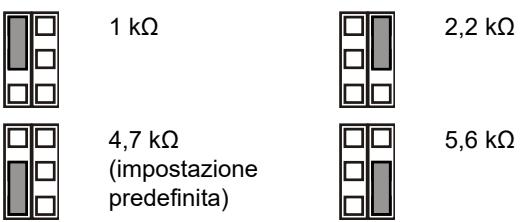

Off: Nessun allarme antimanomissione EOL integrato.

**JF: Impostazione resistenza di guasto (Rf) di fine linea (EOL) integrata**

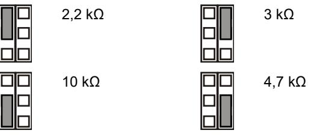

Off: Nessun allarme di guasto EOL integrato (impostazione predefinita).

### **J1: Impostazione modalità fine linea (EOL) zona**

- On: Zona singola a 3 resistenze.
- Off: Contatto di guasto isolato e zona a 2 resistenze.

#### **Configurazione della zona**

Per configurare una zona, attenersi alla seguente procedura.

- Selezionare i valori appropriati per la resistenza di fine linea (EOL) utilizzando i jumper JA, JT e JF. Ad esempio, attraverso il ponticello JT si determina il valore di Rt.
- Per le uscite isolate, rimuovere JT e J1.
- Rimuovere i ponticelli JA, JT e JF per escludere i valori di EOL integrati.
- Per la configurazione a resistenza doppia, rimuovere J1 e utilizzare i morsetti 3 e 6.

Per una singola zona con tutte le resistenze integrate impostate, la resistenza della zona può essere la seguente.

| Stato zona                | Valore   | Parametro predefinito |
|---------------------------|----------|-----------------------|
| Manomissione (breve)      | 0 Ω      | 0 Ω                   |
| Normale                   | Rt       | 4,7 kΩ                |
| Alarm (Allarme)           | Rt+Ra    | 9,4 kΩ                |
| Modalità Avaria           | Rt+Rf    | 14,7 kΩ               |
| AM                        | Rt+Ra+Rf | 19,4 kΩ               |
| Antimanomissione (aperto) | ∞        | ∞                     |

### **Interruttori DIP**

#### **Tabella 3: SW1, impostazioni generali**

| Switch                   | Valori                                |                                        |
|--------------------------|---------------------------------------|----------------------------------------|
| 6: LED                   | On: LED acceso*                       | Off: LED spento                        |
| 5: Remoto                | On: Remote on                         | Off: Remote off*                       |
| 4: Auto test remoto      | On: Auto test remoto abilitato     | Off: Auto test remoto disabilitato* |
| 3: Polarità              | On: Polarità positiva                 | Off: Polarità negativa*                |
| 1, 2: Copertura radar | 1 On, 2 On: 12 m* 1 Off, 2 On: 9 m | 1 On, 2 Off: 6 m 1 Off, 2 Off: 4 m  |

* Impostazione predefinita

#### **Tabella 4: SW2, impostazioni AM**

| Switch                     | Valori                                    |                                   |
|----------------------------|-------------------------------------------|-----------------------------------|
| 4: Segnalazione AM         | On: AM su relè di allarme e di guasto* | Off: AM solo su relè di guasto |
| 3: Reset                   | On: Auto reset*                           | Off: Reset autorizzato            |
| 2: Sensibilità AM          | On: Sensibilità AM avanzata*           | Off: Sensibilità AM standard   |
| 1: AM modo giorno/notte | On: AM solo modo giorno*               | Off: AM giorno/notte              |

* Impostazione predefinita

### **Commutatore DIP switch SW1, impostazioni generali**

#### **SW1-1, SW1-2: Copertura radar**

Utilizzare i commutatori SW1-1 e SW1-2 per impostare la copertura del radar in modo che si adatti esattamente all'applicazione. Il radar è di tipo range-gating, di conseguenza l'intervallo di rilevamento è molto preciso.

**ON**

**ON**

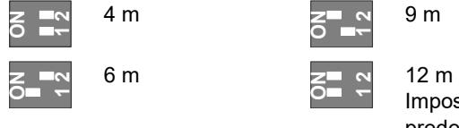

| 2 1 |  |
|--------|--|
| 2 1 |  |

Impostazione predefinita.

#### **SW1-3: Polarità**

On: Polarità positiva. Consente di configurare gli ingressi (WT e D/N) come "Attivo alto".

Off: Polarità negativa. Consente di configurare gli ingressi (WT e D/N) come "Attivo basso". Impostazione predefinita.

La funzionalità è spiegata nella figura 9.

#### **Figura 9**

(1) Polarità alta (2) Polarità bassa

- (3) Test copertura
- (4) Giorno/notte

Questa funzione dipende anche dall'impostazione del commutatore SW1-5. Vedere "SW1-5: Funzionalità remota" più sotto.

#### **SW1-4: Auto test remoto**

On: Auto test remoto on. Abilita l'Auto test remoto.

Off: Auto test remoto off. Disabilita l'Auto test remoto (impostazioni di fabbrica).

Se l'auto test remoto è abilitato, la centrale intrusione può attivare il sensore per eseguire il test di diagnostica. Questo test è attivato commutando nella modalità walk test (modalità giorno e WT abilitato). Il sensore attiva il relè d'allarme se il risultato del test è positivo, e il relè di guasto se il risultato del test è negativo. Dopo il test il sensore continua il normale funzionamento.

Questa funzione dipende anche dalle impostazioni dell' SW1-5. Vedere "SW1-5: Funzionalità remota" più sotto.

#### **SW1-5: Funzionalità remota**

On: Remote on. Abilita il test di copertura e gli ingressi giorno/notte.

Off: Remote off. Disabilita il test di copertura e gli ingressi giorno/notte (impostazione predefinita).

La seguente funzionalità dipende dall'impostazione Remote.

**Tabella 5: Funzionalità che dipendono dall'impostazione Remote**

| Voce  | Descrizione             | SW1-5 Remote on                                                                | SW1-5 Remote off |
|-------|-------------------------|--------------------------------------------------------------------------------|------------------|
| SW1-3 | Polarità                | Selezionabile                                                                  | Solo positivo    |
| SW2-1 | AM modo giorno/notte | Selezionabile                                                                  | AM giorno/notte  |
| SW2-3 | Reset                   | Selezionabile                                                                  | Auto reset       |
| WT    | Ingresso WT             | Abilitato                                                                      | Disabilitato     |
| D/N   | Ingresso D/N            | Abilitato                                                                      | Disabilitato     |
| Altro | Modalità verde          | Abilitato in modo giorno senza test di copertura                         | Disabilitato     |
|       | Memoria allarme      | Abilitato in modo giorno senza test di copertura                         | Disabilitato     |
|       | Test remoto             | Viene eseguito dopo il passaggio al modo giorno con test di copertura | Disabilitato     |

Vedere anche "Collegamenti" a pagina 30.

#### **SW1-6: LED**

On: I LED sono abilitati. Per le funzionalità dei LED, vedere "LED e uscite" a pagina 33.

Off: I LED sono disabilitati per qualsiasi stato.

### **Commutatore DIP switch SW2, impostazioni AM**

#### **SW2-1: AM modo giorno/notte**

On: AM solo modo giorno. Il rilevamento AM è attivo solo in modo giorno (impostazione predefinita).

Off: AM giorno e notte. Il rilevamento AM è sempre operativo (modo giorno e notte).

Questa funzione dipende anche dall'impostazione del commutatore SW1-5. Vedere "SW1-5: Funzionalità remota" a pagina 31.

#### **SW2-2: Sensibilità AM**

On: Sensibilità AM avanzata. Il rilevatore segnala il mascheramento dell'area AM (impostazione predefinita).

**Nota:** questa è la configurazione richiesta dalla norma EN 50131 Grado 3.

Off: Sensibilità AM standard. Il rilevatore segnala l'avvicinamento all'area AM.

#### **SW2-3: Reset**

On: Auto reset. Lo stato dell'allarme AM può essere resettato 40 secondi dopo l'azionamento dell'allarme AM (impostazione predefinita).

Off: Reset autorizzato. Lo stato dell'allarme AM può essere resettato solo dopo aver applicato il modo WT e il modo giorno.

#### **Note**

- Per le impostazioni avanzate (SW2-2 è impostato su On) l'origine dell'allarme AM deve essere rimossa prima di abilitare l'allarme AM.
- Se non è possibile resettare l'allarme AM con il reset automatico o con il reset autorizzato, scollegare l'alimentazione e ricollegarla.
- È necessario eseguire un test di copertura per verificare che le impostazioni del dispositivo siano adatte all'applicazione.

Questa funzione dipende anche dall'impostazione del commutatore SW1-5. Vedere "SW1-5: Funzionalità remota" a pagina 31.

#### **SW2-4: Segnalazione AM**

On: AM su relè di allarme e di guasto. L'allarme AM viene segnalato attraverso l'uscita di allarme e quella di guasto (impostazione predefinita).

**Nota:** Si tratta della configurazione necessaria EN 50131 di Grado 3.

Off: AM solo su relè di guasto. L'allarme AM viene segnalato attraverso l'uscita di guasto.

### **Calibrazione AM**

Durante l'avviamento, la circuiteria AM determina la calibrazione in base all'ambiente. È importante verificare che non avvengano variazioni ambientali entro un metro di distanza dal rilevatore nei 60 secondi successivi all'avvio; in caso contrario il rilevatore potrebbe essere soggetto a falsi

allarmi AM e potrebbe non essere possibile resettare tali allarmi.

### **Selezione del campo schema di copertura**

- Rimuovere le maschere (Figura 8, oggetto 1) se necessario. Il campo è illustrato in Figura 8, oggetto da 3 a 7.
**Nota:** Se entrambe le maschere sono installate, il campo di copertura è limitato a 6 m (impostazione di fabbrica).

- Modificare il campo di copertura staccando le parti della maschera (mostrare in grigio nella Figura 8, oggetto 1). Le porzioni di tende corrispondenti sono illustrate nella Figura 8, oggetto2.
- Mettere gli appropriati adesivi sullo specchio se necessario. Vedere Figura 7, oggetto 1 per dettagli.

**Attenzione:** La rimozione degli adesivi può danneggiare la superficie dello specchio.

- Quando ci sono oggetti vicino direttamente sotto il sensore, mettere la maschera all'interno della finestra (impostazioni di fabbrica). Questo disabilita la parte di tende che guardano in basso verso l'oggetto, la cui vicinanza potrebbe destabilizzare il sensore. Vedere Figura 7, oggetto 2.
**Nota:** la riduzione del campo visivo ravvicinato non è conforme alle installazioni EN 50131 Grado 3.

### **Autotest**

Il rilevatore esegue il monitoraggio continuo dei circuiti PIR, microonde e AM. Eventuali problemi vengono segnalati dalla centrale come guasti tecnici.

### **Esecuzione del test di copertura del rilevatore**

Esistono due modi per attivare il modo test di copertura.

**SW1-6 impostato su LED on, SW1-5 impostato su Remote off**

In questa modalità l'indicazione mediante LED è sempre abilitata (modalità test di copertura costante).

#### **SW1-6 impostato su LED on, SW1-5 impostato su Remote on**

Questa impostazione consente di abilitare l'ingresso del test di copertura (pin 7) e l'ingresso giorno/notte (pin 8). Questo consente all'utente di attivare l'indicazione LED in remoto impostando il rilevatore in modo giorno e attivando il test di copertura.

### **Modalità verde**

Quando il commutatore SW1-5 è impostato su Remote on, il radar viene disattivato in modo giorno (senza test di copertura) per ridurre il consumo energetico. Il rilevatore quindi è attivo solo in modo PIR.

**Nota:** Per il funzionamento in questa modalità, la linea giorno/notte deve essere collegata alla centrale.

Questa modalità non è conforme alla norma EN 50131-2-4.

**Solo DD1012AM-N:** Per i primi 180 secondi del funzionamento in modalità Green, il rilevatore passa alla modalità PIR ad alta sensibilità per consentire ulteriori test, ad esempio utilizzando una fonte di calore esterna per verificare una significativa riduzione del range. Dopo 180 secondi il rilevatore torna alla sensibilità standard.

### **Memoria allarme**

Quando il commutatore SW1-5 è impostato su Remote on, gli allarmi verificatisi in modo notte vengono archiviati nel rilevatore. Sono indicati da un LED lampeggiante quando l'unità passa al modo giorno (test di copertura disattivato). La memoria viene cancellata quando il rilevatore ritorna al modo notte.

**Nota:** Impostare il commutatore SW1-6 su Off per impedire la visualizzazione della memoria degli allarmi sui LED. Vedere "SW1-6: LED" a pagina 31.

### **LED e uscite**

Per attivare la funzionalità dei LED, impostare il commutatore SW1-6 su On, altrimenti i LED rimangono disattivati in tutte le condizioni. Per ulteriori dettagli vedere "SW1-6: LED" a pagina 31.

#### **Tabella 6: LED e uscite**

| Stato                                        | LED rosso | LED giallo | Relè di allarme                  | Relè di guasto | Reset                                      |
|----------------------------------------------|--------------|---------------|-------------------------------------|-------------------|--------------------------------------------|
| Avviamento                                   |              |               | Chiuso                              | Chiuso            | Automatico dopo 60 s                    |
| Bassa tensione                               |              |               | Aperto                              | Aperto            | Applicazione della tensione corretta |
| Allarme anti intrusione PIR               |              |               | Chiuso                              | Chiuso            |                                            |
| Allarme intrusione microonde           |              |               | Chiuso                              | Chiuso            |                                            |
| Allarme intrusione movimento doppio |              |               | Aperto                              | Chiuso            | Automatico dopo 3 s                     |
| Doppia memoria di allarme              |              |               | Chiuso                              | Chiuso            | Commutazione al modo notte              |
| Allarme AM                                   |              |               | Dipende dal commutatore SW2-4 | Aperto            | Dipende dal commutatore SW2-3        |
| Guasto tecnico                               |              |               | Chiuso                              | Aperto            | Test copertura superato                 |
|                                              |              |               |                                     |                   |                                            |

Sempre acceso Lampeggio normale (1 Hz)

### **Specifiche**

| Tecnologia di rilevamento | Doppio + AM                                                                 |
|---------------------------|-----------------------------------------------------------------------------|
| Range                     | 4, 6, 9, 12 metri, selezionabili mediante i commutatori SW1-1 e SW1-2 |
| Angolo visivo             | 78 gradi                                                                    |
| Ottica PIR                | 9 tende a specchio ad alta densità                                          |
| Frequenza microonda       | 5725–5875 MHz                                                               |

| Massima potenza in uscita                              | 13,46 mW                                  |
|--------------------------------------------------------|-------------------------------------------|
| Massima potenza uscita microonda a 1 m              | 0,003 μW/cm²                              |
| Funzionalità di memoria                                | Sì                                        |
| Corrente d'ingresso                                    | da 9 a 15 V (12 V nominali)              |
| Non sensibile all'ondulazione residua picco-picco   | 2 V (a 12 V)                             |
| Tempo di avvio rilevatore                              | 60 s                                      |
| Consumo di corrente                                    | da 10 a 22 mA (11 mA nominali)            |
| Altezza di montaggio                                   | da 2,0 a 2,6 m                            |
| Velocità di rilevamento: DD1012AM-N DD1012AM-D-N | da 0,2 a 3,0 m/s da 0,1 a 4,0 m/s      |
| Relè antimanomissione / allarme (NC) caratt.        | 80 mA, 30 V, forma A                     |
| Caratteristiche relè di guasto                         | 80 mA, 30 V, forma A                     |
| Tempo di allarme                                       | 3 s                                       |
| Temperatura di funzionamento                           | da −10 a +55°C                            |
| Umidità relativa                                       | 95% di umidità massima, senza condensa |
| Peso                                                   | 120 g                                     |
| Dimensioni (A x L x P)                                 | 126 × 63 × 50 mm                          |
| Grado di protezione IP/IK                              | IP30 IK04                                 |
| Protezione antirimozione                               | Sì                                        |

### **Informazioni sulle normative**

| Produttore                                                             | MESSO SUL MERCATO DA: Carrier Fire & Security Americas Corporation Inc. 13995 Pasteur Blvd Palm Beach Gardens, FL 33418, USA AUTORIZZATO RAPPRESENTANTE UE: Carrier Fire & Security B.V. Kelvinstraat 7, 6003 DH Weert, Netherlands                                                                                                                                                                                                                                                                                                                                                                                                                  |
|------------------------------------------------------------------------|------------------------------------------------------------------------------------------------------------------------------------------------------------------------------------------------------------------------------------------------------------------------------------------------------------------------------------------------------------------------------------------------------------------------------------------------------------------------------------------------------------------------------------------------------------------------------------------------------------------------------------------------------------------------|
| Avvertenze sul prodotto e dichiarazioni di non responsabilità | QUESTI PRODOTTI SONO DESTINATI ALLA VENDITA A, E DEVONO ESSERE MONTATI DA, UN ESPERTO QUALIFICATO. CARRIER FIRE & SECURITY NON PUÒ GARANTIRE CHE LE PERSONE O GLI ENTI CHE ACQUISTANO I SUOI PRODOTTI, COMPRESI I "RIVENDITORI AUTORIZZATI", DISPONGANO DELLA FORMAZIONE O ESPERIENZA ADEGUATE PER ESEGUIRE LA CORRETTA INSTALLAZIONE DI PRODOTTI PER LA SICUREZZA E PER LA PROTEZIONE ANTINCENDIO. Per ulteriori informazioni sulle esclusioni di garanzia e sulla sicurezza dei prodotti, consultare il sito https://firesecurityproducts.com/policy/product warning/ oppure eseguire la scansione del codice QR. |
|                                                                        |                                                                                                                                                                                                                                                                                                                                                                                                                                                                                                                                                                                                                                                                        |
|                                                                        |                                                                                                                                                                                                                                                                                                                                                                                                                                                                                                                                                                                                                                                                        |

Carrier Fire & Security dichiara che questo dispositivo è conforme ai requisiti applicabili e alle disposizioni di tutte le norme e regolamenti applicabili, inclusi ma non limitati alla direttiva 2014/53/EU. Per ulteriori informazioni, vedere firesecurityproducts.com.

| REACH                      | Il prodotto può contenere sostanze che sono anche sostanze appartenenti all'elenco di candidati per una concentrazione superiore allo 0,1% p / p, l'elenco dei candidati pubblicato più di recente è disponibile sul sito Web dell'ECHA. Informazioni sull'uso sicuro sono disponibili all'indirizzo https://firesecurityproducts.com/en/content/intrusi on-intro                                                                                  |
|----------------------------|----------------------------------------------------------------------------------------------------------------------------------------------------------------------------------------------------------------------------------------------------------------------------------------------------------------------------------------------------------------------------------------------------------------------------------------------------------------------------|
|                            | 2012/19/EU (Direttiva WEEE): I prodotti contrassegnati con questo simbolo, non possono essere smaltiti nei comuni contenitori per lo smaltimento rifiuti, nell' Unione Europea. Per il loro corretto smaltimento, potete restituirli al vostro fornitore locale a seguito dell'acquisto di un prodotto nuovo equivalente, oppure rivolgervi e consegnarli presso i centri di raccolta preposti. Per maggiori informazioni vedere: recyclethis.info |
| Documentazione Prodotto | Consultare il seguente collegamento Web per recuperare la versione elettronica della documentazione del prodotto. Questo link ti guiderà alla pagina dei contatti regionali EMEA. In questa pagina è possibile richiedere l'accesso al portale Web protetto in cui sono memorizzati tutti i manuali.                                                                                                                                                     |
|                            | https://firesecurityproducts.com/en/contact                                                                                                                                                                                                                                                                                                                                                                                                                                |

# **Informazioni di contatto**

firesecurityproducts.com o www.aritech.com.

# **NL: Installatieblad**

### **Beschrijving**

De DD1012AM(-D)-N is een dual AM-bewegingssensor.

Het combineert de gepatenteerde PIRspiegeloptiektechnologie met de gepatenteerde Range Controlled Radar-technologie.

### **Richtlijnen voor de installatie**

#### Zie afbeelding 1.

De detector dient aan de wand te worden gemonteerd maar kan ook op met behulp van een montagebeugel aan het plafond worden bevestigd.

Gebruik de volgende richtlijnen voor het bepalen van de beste locatie voor installatie van de detector.

- Monteer de detector zodanig dat de verwachte bewegingsrichting van een indringer dwars over het detectiepatroon verloopt (zie afbeelding 3).
- Monteer de detector op een stabiel oppervlak. Voor de toegestane montagehoogte, zie "Specificaties" op pagina 38.
- Plaats de detector niet binnen 0,5 m van metalen voorwerpen of binnen 1,5 m van TL-verlichting.
- Plaats geen voorwerpen voor de detector die het detectieveld kunnen blokkeren.
- Plaats detectors op ten minste 6 m van elkaar en gebruik de korte bereik instelling om storing te voorkomen.

De dual-technologie van deze detector voorkomt het risico van loze alarmen. Vermijd niettemin alle mogelijke oorzaken van instabiliteit, zoals:

#### PIR-invloeden:

- Rechtstreeks zonlicht op de detector
- Warmtebronnen binnen het detectieveld van de detector
- Veel tocht op de detector
- Dieren in het detectieveld
- Het detectieveld van de detector versperren met grote objecten, zoals meubels

#### Microgolf-invloeden:

- Montageplaats is onderhevig voor trillingen
- Metalen oppervlakken die de radargolven reflecteren
- Beweging van water door plastic buizen in het detectieveld of direct achter de detector
- Bewegende of trillende voorwerpen, zoals ventilatoren, verwarmingen of air-co's

#### AM-invloeden:

- Bewegende objecten dichterbij dan 1 m voor de detector
- Kleine insecten op de detector
- Moderne TL of LED-verlichting vlakbij (dichterbij dan 1,5 m)

**WAARSCHUWING!** De apparatuur is niet geaard. Elk extern circuit dat op de apparatuur wordt aangesloten, moet zich in hetzelfde gebouw bevinden en zijn aangesloten op een beschermde aarde aansluiting.

Draadisolatie van kabels aangesloten op de apparatuur moet voldoen aan IEC 60332-1-2 en IEC 60332-1-3 of IEC 60332- 2-2, afhankelijk van de doorsnede van de ader, of IEC TS 60695-11-21, ongeacht van dwarsdoorsnede. Als alternatief moeten dergelijke kabels voldoen aan UL 2556 VW-1.

De voedingsbron van de detector moet met een vermogen van 15 W worden begrensd.

Wij adviseren om regelmatig een looptest van de detector uit te voeren en het resultaat op het controlepaneel te verifiëren.

**Ga als volgt te werk om de detector te installeren:**

- 1. Neem het afdekplaatje uit (zie afbeelding 2, item 1 en 2).
- 2. Maak de detector voorzichtig open met een schroevendraaier (zie afbeelding 2, items 2 en 3).

**Let op:** Raak de pyro-elektrische sensor niet aan (afbeelding 6).

- 3. Verwijder de schroef uit het deksel (afbeelding 4, item 2).
- 4. Monteer de achterkant tegen de muur. Voor de toegestane montagehoogte, zie "Specificaties" op pagina 38.

Zie afbeelding 4. Gebruik in alle posities minimaal twee M4-schroeven van de standaarden DIN 7505B, DIN 96, DIN 7996, of een schroef met een platte kop van 8 mm doorsnede.

- Gebruik voor vlakke montage schroeven in posities A.
- Gebruik voor hoekmontage schroeven in positie B of C.

**Opmerking voor EN 50131 Klasse 3 installaties:**  Gebruik geen montagepositie C. Het is vereist om beide montagegaten A2 en B2 voor montageposities A en B.

- Als u de afneembeveiliging ST400 wilt installeren, gebruikt u montageposities A. De ST400-montagepositie wordt weergegeven als item 3 in afbeelding 4. Open de opening in de achterkant (afbeelding 5, item 2).

- 5. Sluit de bedrading van de detector aan (zie afbeeldingen 4 en 12). Gebruik de kabelopeningen (afbeelding 5, item 1) en kabelgoot (afbeelding 5, item 3) in de achterkant.
- 6. Selecteer de gewenste jumper- en DIP-switchinstellingen (zie "De detector instellen" hieronder voor meer informatie.
- 7. Verwijder de maskers en voeg de stickers toe, indien nodig. Zie "Het detectie patroon configureren" op pagina 37 voor meer details.
- 8. Gebruik voor plafondmontagetoepassingen de SB01 montagebeugel. SB01-montageposities worden weergegeven als item 1 in afbeelding 4.

**Opmerking:** Het gebruik van SB01 is niet in overeenstemming met EN 50131 Grade 3-installaties.

- 9. Sluit de voorkant, plaats de schroef in de behuizing en plaats het afdekplaatje.
### **Aansluitingen**

#### Zie afbeelding 12.

#### **Tabel 1: Detectoraansluitingen**

| Aansluiting | Label          | Verklaring                                                                                                                                                                                                                                                                                                   |
|-------------|----------------|--------------------------------------------------------------------------------------------------------------------------------------------------------------------------------------------------------------------------------------------------------------------------------------------------------------|
| 1, 2        | GND, +12V   | Voedingsaansluiting (9 t/m 15 V, 12 V nominaal)                                                                                                                                                                                                                                                         |
| 3, 4        | ALARM          | Alarmrelaisuitgang (33 Ω). Gebruik jumper JA om de ingebouwde EOL-weerstand in serie te plaatsen met het relais. Zie "Jumpers" hieronder.                                                                                                                                                           |
| 5, 6        | TAMPER         | Sabotagerelaisuitgang (0 Ω). Gebruik jumper JT om de ingebouwde EOL weerstand in serie te plaatsen met de schakelaar. Zie "Jumpers" hieronder.                                                                                                                                                      |
| 7           | Looptest       | Met deze ingang wordt de LED (looptest aan/uit) in- en uitgeschakeld. De looptestmodus kan alleen worden geactiveerd wanneer de detector zich in de dagmodus bevindt (pin 8). Actieve hoge of lage wordt bepaald door SW1-3 (zie "SW1- 3: Polariteit" op pagina 36.                        |
| 8           | Dag / nacht | Met deze ingang wordt de detector overgeschakeld in dag- (geheugen wordt op de LED-indicator getoond) of nachtmodus (alarmgeheugen wordt geactiveerd en eerder opgeslagen alarmen worden gewist). Actieve hoge of lage wordt bepaald door SW1-3 (zie "SW1-3: Polariteit" op pagina 36). |
| 9, 10       | Storing        | Storingrelaisuitgang (33 Ω). Gebruik de jumper JF om een van de ingebouwde EOL-weerstanden in serie te plaatsen met het relais. Zie "Jumpers" hieronder voor de correcte weerstandinstellingen.                                                                                                  |

#### **Opmerkingen**

- Ingangen 7 en 8 kunnen alleen worden gebruikt wanneer SW1-5 is ingesteld op (Extern aan). Zie "SW1-5: Externe functionaliteit" op pagina 36.
- De LED is alleen ingeschakeld wanneer SW1-6 is ingesteld op LED on (LED aan).

In afbeelding 10 wordt uitgelegd hoe u een enkele ingang met meerdere weerstanden kunt instellen.

#### **Afbeelding 10**

- (1) Alarmrelais
- (2) Alarmingang centrale
- Ra Alarm EOL-weerstand
- Rt Sabotage EOL-weerstand
- (3) Sabotageswitchuitgang
- 
- 
- Rf Storing EOL-weerstand
- (4) Storingrelais
- 

### **De detector instellen**

Zie afbeelding 13 voor locaties van jumpers en DIP-switches.

### **Jumpers**

Met dejumpers stelt u de ingebouwde EOL-mode en waarde in. Het circuit wordt weergegeven in afbeelding 10.

#### **JA: Ingebouwde alarm EOL-weerstand (Ra) instellen**

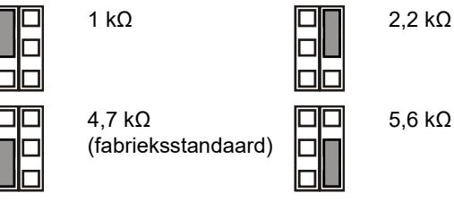

Off (Uit): Geen ingebouwde alarm EOL.

#### **JT: Ingebouwde sabotage EOL-weerstand (Rt) instellen**

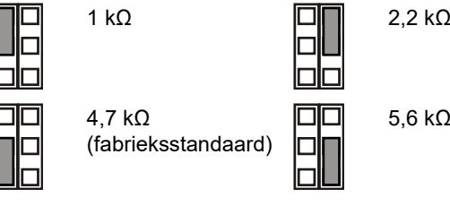

Off (Uit): Geen ingebouwde sabotage EOL.

**JF: Ingebouwde storing EOL-weerstand (Rf) instellen**

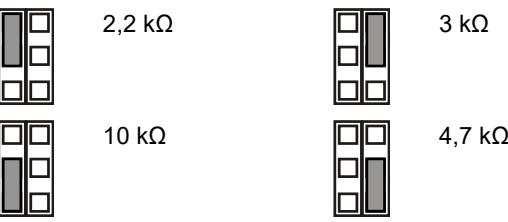

Off (Uit): Geen ingebouwde storing EOL (fabrieksstandaard).

#### **J1: Ingang EOL-modus instellen**

(Aan): Enkele zone ingang met 3 weerstanden configuratie.

(Uit): Geïsoleerd storingscontact en zone ingang met 2 weerstanden.

#### **Ingang configureren**

Als u de ingang wilt instellen, past u de volgende selectie toe.

- Selecteer de correcte EOL-weerstandwaarden met JA, JT en JF. Bijvoorbeeld, de instelling van jumper JT bepaalt de Rt-waarde.
- Voor geïsoleerde uitgangen, verwijdert u JT en J1(enkel zone).
- Verwijder jumpers JA, JT en JF om ingebouwde EOLwaarden uit te sluiten.(geen ingebouwde eindweerstanden)
- Voor dubbellus weerstand configuratie verwijder J1 en gebruik aansluiting 3 en 6.

Voor een 3 weerstand configuratie ingang met alle ingebouwde weerstanden ingesteld, kan de ingangsweerstand de volgende zijn.

#### **Tabel 2: Weerstandswaarden ingang**

| Ingangsstatus   | Waarde   | Standaard |
|-----------------|----------|-----------|
| Sabotage (kort) | 0 Ω      | 0 Ω       |
| Normaal         | Rt       | 4,7 kΩ    |
| Alarm           | Rt+Ra    | 9,4 kΩ    |
| Storing         | Rt+Rf    | 14,7 kΩ   |
| AM              | Rt+Ra+Rf | 19,4 kΩ   |
| Sabotage (open) | ∞        | ∞         |

# **Dipswitches**

#### **Tabel 3: SW1, algemene instellingen**

| Schakelaar          | Waarden                                    |                                               |  |
|---------------------|--------------------------------------------|-----------------------------------------------|--|
| 6: LED              | On (Aan): LED aan*                         | Off (Uit): LED uit                            |  |
| 5: Extern           | On (Aan): Extern aan                       | Off (Uit): Extern uit*                        |  |
| 4: Auto remote test | On (Aan): Auto remote test ingeschakeld | Off (Uit): Auto remote test uitgeschakeld* |  |
| 3: Polariteit       | On (Aan): Positieve polariteit          | Off (Uit): Negatieve polariteit*           |  |
| 1, 2: Radarbereik   | 1 aan, 2 aan: 12 m* 1 uit, 2 aan: 9 m   | 1 aan, 2 uit: 6 m 1 uit, 2 uit: 4 m        |  |

* Fabrieksinstellingen

#### **Tabel 4: SW2, AM-instellingen**

| Schakelaar                | Waarden                                       |                                            |  |  |
|---------------------------|-----------------------------------------------|--------------------------------------------|--|--|
| 4: AM-signaal             | On (Aan): AM naar storing- en alarmrelais* | Off (Uit): AM alleen naar storingrelais |  |  |
| 3: Reset                  | On (Aan): Automatische reset*              | Off (Uit): Geautoriseerde reset         |  |  |
| 2: AM gevoeligheid     | On (Aan): Geavanceerde AM-gevoeligheid*    | Off (Uit): Standaard AM gevoeligheid    |  |  |
| 1: AM dag / nachtmodus | On (Aan): Alleen AM dagmodus*              | Off (Uit): AM dag en nacht              |  |  |

* Fabrieksinstellingen

### **DIP-switch SW1, algemene instellingen**

#### **SW1-1, SW1-2: Radarbereik**

Gebruik SW1-1 en SW1-2 om het radarbereik in te stellen dat precies bij het detectiebereik hoort. De radar is van het type Range-gating, wat betekent dat het detectiebereik bijzonder nauwkeurig is.

**ON**

**ON**

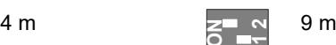

**1 2**

6 m 12 m Fabrieksinstelling.

### **SW1-3: Polariteit**

On (Aan): Positieve polariteit. Configureert de ingangen (WT en D/N) als "Active high" (Actieve hoog).

Off (Uit): Negatieve polariteit. Configureert de ingangen (WT en D/N) als "Active low" (Actieve laag). Fabrieksinstelling.

De functionaliteit wordt verklaard in afbeelding 9.

#### **Afbeelding 9**

| (1) | Polariteit hoog | (3) | Looptest  |
|-----|-----------------|-----|-----------|
| (2) | Polariteit laag | (4) | Dag/nacht |

Deze functie is tevens afhankelijk van de SW1-5-instelling. Zie "SW1-5: Externe functionaliteit" hieronder.

### **SW1-4 Auto extrene test**

On (Aan): Automatische externe test aan.

Off (Uit): Automatische externe test uit. Hiermee schakelt u automatische externe test uit (fabrieksinstelling).

Als de automatische externe test is ingeschakeld, kan het alarm paneel de detector triggeren om een diagnostische test uit te voeren. Deze test wordt geactiveerd door over te schakelen naar de loop test-modus (de dag modus en WT ingeschakeld). De detector activeerd het alarmrelais als het testresultaat positief is, en het fout relais als het testresultaat negatief is. De detector staat na de test in de normale werking.

Deze functie is ook afhankelijk van de instelling SW1-5. Zie "SW1-5: Externe functionaliteit" hieronder.

#### **SW1-5: Externe functionaliteit**

On (Aan): Extern aan. Activeert WT en dag-/nachtingangen.

Off (Uit): Extern uit. Schakelt WT (looptest) en dag- /nachtingangen uit (fabrieksinstelling).

De volgende functionaliteit is afhankelijk van de instelling voor Remote (Extern).

| Item    | Beschrijving           | SW1-5 Extern aan                                                          | SW1-5 Extern uit      |
|---------|------------------------|---------------------------------------------------------------------------|-----------------------|
| SW1-3   | Polariteit             | Instelbaar                                                                | Alleen positief       |
| SW2-1   | AM dag / nachtmodus | Instelbaar                                                                | AM dag en nacht       |
| SW2-3   | Reset                  | Instelbaar                                                                | Automatische reset |
| WT      | WT-ingang              | Ingeschakeld                                                              | Uitgeschakeld         |
| D/N     | D/N-ingang             | Ingeschakeld                                                              | Uitgeschakeld         |
| Overige | Groene mode            | Ingeschakeld in de dagmodus zonder WT (looptest)                    | Uitgeschakeld         |
|         | Alarmgeheugen          | Ingeschakeld in de dagmodus zonder WT (looptest)                    | Uitgeschakeld         |
|         | Test op afstand        | Uitgevoerd na het omschakelen naar de dagmodus met WT (looptest) | Uitgeschakeld         |

Zie ook "Aansluitingen" op pagina 35.

#### **SW1-6: LED's**

On (Aan): LED's zijn ingeschakeld. Zie "LED's en uitgangen" op pagina 38 voor LED-functionaliteit.

### **AM-instellingen SW2 DIP-schakelaars**

### **SW2-1: AM dag/nachtmodus**

On (Aan): Alleen AM-dagmode. AM-detectie wordt alleen gedetecteerd tijdens de dagmode (fabrieksinstelling).

Off (Uit): AM dag en nacht. AM-detectie wordt altijd gedetecteerd (dag- en nachtmodus).

Deze functie is afhankelijk van de SW1-5-instelling. Zie "SW1- 5: Externe functionaliteit" op pagina 36.

### **SW2-2: AM-gevoeligheid**

On (Aan): Geavanceerde AM-gevoeligheid De detector signaleert de maskering van het AM-bereik (fabrieksinstelling).

**Opmerking:** dit is EN 50131 Grade 3 vereiste configuratie.

Off (Uit): Standaard AM-gevoeligheid. De detector signaleert de nadering van het AM-bereik.

#### **SW2-3: Reset**

On (Aan): Automatische reset. AM-alarm kan 40 sec. na het AM-alarm worden hersteld (fabrieksinstelling).

Off (Uit): Geverifieerd herstellen. AM-alarmstatus kan alleen worden hersteld na toepassing van de WT-modus en dagmodus.

#### **Opmerkingen**

- Voor de geavanceerde instelling (SW2-2 is On (Aan)) moet de oorzaak van het AM-alarm zijn verwijderd voordat AM-herstel is toegestaan.
- Indien het AM-alarm niet kan worden hersteld met automatisch herstellen of geverifieerd herstellen, schakelt u de voedingvan de detector uit en schakelt u deze weer opnieuw aan.
- Er moet een looptest worden uitgevoerd om er zeker van te zijn dat dedetector instellingen correct zijn voor deze toepassing.

Deze functie is tevens afhankelijk van de SW1-5-instelling. Zie "SW1-5: Externe functionaliteit" op pagina 36.

#### **SW2-4: AM-gevoeligheid**

On (Aan): AM activeert het storing- en alarmrelais AM-alarm wordt gesignaleerd via zowel alarm- als storingsuitgangen (fabrieksinstelling).

**Opmerking:** Dit is een configuratie die EN 50131 klasse 3 vereist.

Off (Uit): AM alleen naar storingrelais. AM-alarm wordt gesignaleerd via storingsuitgang.

### **AM-kalibratie**

Tijdens het opstarten wordt het AM-circuit gekalibreerd Het is belangrijk om binnen deze 60 seconden na het opstarten te controleren of er zich geen veranderingen hebben voorgedaan in het detectie veld binnen een straal van 1 meter van de detector. De detector kan anders valse AM-alarmen veroorzaken en mogelijk zijn deze alarmen niet te herstellen.

### **Het detectie patroon configureren**

- Indien nodig verwijderen de maskers (figuur 8, punt 1). Het gewijzigde patroon is afgebeeld in figuur 8, punten 3 tot en met 7.
**Opmerking:** Als zowel beide maskers zijn geïnstalleerd, het detectie bereik is beperkt tot 6 m

- Het detectiepatroon wijzigen door uit breken van maskers delen (weergegeven als grijs in figuur 8, punt 2).
- Plak de juiste spiegel stickers indien nodig. Zie afbeelding 7, punt 1 voor details.

**Let op:** Verwijderen van stickers kan het spiegel oppervlak beschadigen.

- Wanneer er stoor objecten zich direct onder de detector bevinden, plaats dan het masker aan de binnenkant van het venster (standaard). Hiermee schakelt u dat deel van het gordijnen uit, dat neer kijkt op het object, hierdoor kan de detector onstabiel worden. Zie afbeelding 7, punt 2.
**Opmerking:** het verkleinen van het gezichtsveld van dichtbij is niet in overeenstemming met EN 50131 Grade 3-installaties.

### **Zelftest**

De detector test de PIR-, microgolf- en AM-schakelingen doorlopend. Storingen worden gerapporteerd aan de centrale als technische fouten.

### **Looptest voor de detector uitvoeren**

U kunt op twee manieren overschakelen naar de looptestfunctie.

**SW1-6 ingesteld op (LED aan), SW1-5 ingesteld op (Extern uit)**

In deze modus is de LED-indicatie altijd ingeschakeld (constante looptestmodus).

#### **SW1-6 ingesteld op (LED aan), SW1-5 ingesteld op (Extern aan)**

Deze instelling activeert de looptestingang (pin 7) en de dag/nacht-ingang (pin 8). Hiermee kan de gebruiker extern de LED-aanduiding activeren door de detector in de dagmodus in te stellen en de looptest te activeren.

### **Groene modus**

Wanneer SW1-5 is ingesteld op Extern aan, wordt de radar uitgeschakeld gedurende de dagmode (zonder WT) om het stroomverbruik te reduceren. De detector werkt vervolgens alleen maar als Alleen PIR.

**Opmerking:** De dag/nacht-lijn moet zijn aangesloten op de centrale om deze mode te kunnen gebruiken.

Deze modus voldoet niet aan de norm EN 50131-2-4.

**Alleen DD1012AM-N:** Gedurende de eerste 180 seconden van de werking in de groene modus, wordt de detector geschakeld naar de PIR-modus met hoge gevoeligheid om extra testen mogelijk te maken. Bijvoorbeeld door een externe warmtebron te gebruiken om te testen op een aanzienlijke vermindering van het bereik. Na 180 seconden schakelt de melder terug naar de standaard gevoeligheid.

### **Alarmgeheugen**

Wanneer SW1-5 is ingesteld op Extern aan, worden de alarmen die gedurende de nacht zijn opgetreden opgeslagen in het detectorgeheugen. Ze worden aangeduid met een knipperende rode LED wanneer de centrale wordt overgeschakeld naar de dagmodus (looptest uitgeschakeld). Het geheugen wordt gewist wanneer de detector weer in de nachtmode wordt geschakeld.

**Opmerking:** Stel SW1-6 in op (Uit) om te voorkomen dat het alarmgeheugen op de LED's wordt weergegeven. Zie "SW1-6: LED's" op pagina 36.

### **LED's en uitgangen**

Als u de LED-functionaliteit wilt inschakelen, stelt u SW1-6 in op (Aan), anders zijn de LED's uitgeschakeld in iedere willekeurige conditie. Zie "SW1-6: LED's" op pagina 36 voor meer informatie.

#### **Tabel 6: LED's en uitgangen**

| Status                        | Rode LED | Gele LED | Alarm relais | Storing relais | Opnieuw instellen                   |
|-------------------------------|-------------|-------------|-----------------|-------------------|----------------------------------------|
| Opstarten                     |             |             | G               | G                 | Automatisch na 60 sec               |
| Lage spanning                 |             |             | O               | O                 | Correcte spanning toepassen      |
| PIR-inbraakalarm              |             |             | G               | G                 |                                        |
| Microgolf inbraakalarm     |             |             | G               | G                 |                                        |
| Dual beweging inbraakalarm |             |             | O               | G                 | Automatisch na 3 sec                |
| Dual alarm geheugen        |             |             | G               | G                 | Overschakelen naar de nachtmodus |
| AM-alarm                      |             |             | [1]             | O                 | Afhankelijk van SW2-3               |
| Technische storing            |             |             | G               | O                 | Succesvolle looptest                |

G — Gesloten, O — Open, [1] — Afhankelijk van SW2-4

Continu aan Normaal knipperend (1 Hz)

### **Specificaties**

| Detectortechnologie | Dual+AM                                        |
|---------------------|------------------------------------------------|
| Bereik              | 4, 6, 9, 12 m instelbaar via SW1-1 en SW1-2 |
| Kijkveld            | 78 graden                                      |
| PIR-optiek          | 9 spiegelgordijnen met hoge dichtheid       |
| Radarfrequentie     | 5725–5875 MHz                                  |
| Maximale vermogen   | 13,46 mW                                       |

| Max. microgolfuitgang op 1 m               | 0,003 μW/cm²                |
|--------------------------------------------|-----------------------------|
| Geheugenfunctie                            | Ja                          |
| Aansluitspanning                           | 9 t/m 15 V (12 V nominaal) |
| Immuniteit rimpelspanning piek-tot piek | 2 V (bij 12 V)             |
| Opstarttijd detector                       | 60 sec                      |
| Stroomverbruik                             | 10 t/m 22 mA (11 mA nom.)   |
| Montagehoogte                              | 2,0 t/m 2,6 m               |
| Bewegingsnelheid:                          |                             |
| DD1012AM-N                                 | 0,2 t/m 3,0 m/s             |
| DD1012AM-D-N                               | 0,1 t/m 4,0 m/s             |
| Alarm (NC) / Sabotagerelais kenmerk        | 80 mA 30 V, Form A         |
| Storingsrelais kenmerk                     | 80 mA 30 V, Form A         |
| Alarmtijd                                  | 3 sec                       |
| Omgevingstemperatuur                       | −10 tot +55°C               |
| Relatieve luchtvochtigheid                 | 95% max., niet-condenserend |
| Gewicht                                    | 120 gr.                     |
| Afmetingen (H x B x D)                     | 126 × 63 × 50 mm            |
| IP/IK-klasse                               | IP30 IK04                   |
| Afneembeveiliging                          | Ja                          |

### **Regelgeving**

| Fabrikant                                                              | OP DE MARKT GEBRACHT DOOR: Carrier Fire & Security Americas Corporation Inc. 13995 Pasteur Blvd Palm Beach Gardens, FL 33418, USA GEAUTORISEERDE EU VERTEGENWOORDIGER: Carrier Fire & Security B.V. Kelvinstraat 7, 6003 DH Weert, Nederland                                                                                                                                                                                                                                                                                                                                                                        |
|------------------------------------------------------------------------|------------------------------------------------------------------------------------------------------------------------------------------------------------------------------------------------------------------------------------------------------------------------------------------------------------------------------------------------------------------------------------------------------------------------------------------------------------------------------------------------------------------------------------------------------------------------------------------------------------------------------------------|
| Waarschuwingen en disclaimers met betrekking tot de producten | DEZE PRODUCTEN ZIJN BEDOELD VOOR VERKOOP AAN EN INSTALLATIE DOOR GEKWALIFICEERDE BEROEPSKRACHTEN. CARRIER FIRE & SECURITY GEVEN GEEN GARANTIE DAT EEN PERSOON OF ENTITEIT DIE DIENS PRODUCTEN AANSCHAFT, WAARONDER "GEAUTORISEERDE DEALERS" OF "GEAUTORISEERDE WEDERVERKOPERS", OP DE JUISTE WIJZE ZIJN OPGELEID OF VOLDOENDE ERVARING HEBBEN OM PRODUCTEN MET BETREKKING TOT BRAND EN BEVEILIGING OP DE JUISTE WIJZE TE INSTALLEREN. Zie voor meer informatie over garantiebepalingen en productveiligheid https://firesecurityproducts.com/policy/product warning/ of scan de QR-code. |
|                                                                        |                                                                                                                                                                                                                                                                                                                                                                                                                                                                                                                                                                                                                                          |
|                                                                        | Carrier Fire & Security verklaart hierbij dat dit apparaat voldoet aan de geldende eisen en bepalingen van alle toepasselijke regels en voorschriften, met inbegrip van maar niet beperkt tot de richtlijn 2014/53/EU. Voor meer informatie zie firesecurityproducts.com.                                                                                                                                                                                                                                                                                                                                                 |
| REACH                                                                  | Product kan stoffen bevatten die ook stoffen van de kandidatenlijst zijn in een concentratie van meer dan 0,1% w/w, volgens de meest recent gepubliceerde kandidatenlijst op ECHA-website. Informatie over veilig gebruik is te vinden op https://firesecurityproducts.com/en/content/intrusi on-intro                                                                                                                                                                                                                                                                                                                 |

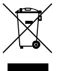

2012/19/EU (WEEE richtlijn): Producten met deze label mogen niet verwijdert worden via de gemeentelijke huisvuilscheiding in de Europese Gemeenschap. Voor correcte vorm van kringloop, geef je de producten terug aan jou locale leverancier tijdens het aankopen van een gelijkaardige nieuw toestel, of geef het af aan een gespecialiseerde verzamelpunt. Meer informatie vindt u op de volgende website: recyclethis.info

Product documentatie

versie van de productdocumentatie te downloaden.

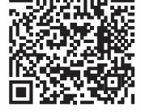

Deze link leidt u naar de regionale contactpagina van EMEA. Op deze pagina kunt u uw login aanvragen bij de beveiligde webportal waar alle handleidingen

Raadpleeg de volgende weblink om de digitale

zijn opgeslagen.

https://firesecurityproducts.com/en/contact

# **Contactgegevens**

firesecurityproducts.com of www.aritech.com

# **PL: Instrukcja instalacji**

### **Opis**

DD1012AM(-D)-N to dualna czujka ruchu z układem wykrywania przesłonięcia czujki (AM).

Połączono w niej opatentowaną technologię optyki lustrzanej PIR z opatentowaną radarową technologią sterowania zasięgiem.

**Instalacja - wskazówki**

Patrz Rysunek 1.

Czujka jest przeznaczona do montażu na ścianie, ale przy zastosowaniu uchwytu mocującego można ją też zamontować na suficie.

Poniższe wskazówki pomogą określić najlepsze miejsce instalacji czujki.

- Czujkę należy zamontować w taki sposób, aby oczekiwany kierunek ruchu intruza przecinał obszar wykrywania (patrz rys. 3).
- Czujkę należy zamontować na stabilnej powierzchni. Dopuszczalna wysokość montażu jest podana w sekcji "Dane techniczne" na stronie 43.
- Czujki nie należy montować w odległości 0,5 m od metalowych obiektów lub w odległości 1,5 m od lamp fluorescencyjnych.
- Z przodu czujki nie należy umieszczać obiektów, które mogłyby zasłaniać pole widzenia.
- Czujki należy umieścić w odległości co najmniej 6 m od siebie. Jeśli czujki są montowane naprzeciwko siebie, aby zapobiec zakłóceniom, należy użyć ustawienia krótkiego zasięgu.

Technologia podwójnego przetwarzania zastosowana w niniejszej czujce zabezpiecza ją przed fałszywymi alarmami. Należy jednak unikać potencjalnych przyczyn niestabilności, takich jak:

Zakłócenia związane z technologią PIR:

- Światło słoneczne padające bezpośrednio na czujkę
- Źródła ciepła w polu widzenia czujki
- Silne strumienie powietrza skierowane na czujkę
- Zwierzęta w polu widzenia
- Przesłonięcie pola widzenia czujki przez duże przedmioty, takie jak meble

Zakłócenia mikrofalowe:

- Powierzchnia mocowania wrażliwa na drgania
- Powierzchnie metalowe odbijające energię mikrofalową
- Ruch wody przez plastikowe rury
- Poruszające się lub drgające przedmioty, takie jak wentylatory bądź rury ogrzewania lub klimatyzacji

Zakłócenia związane z AM:

- Obiekty poruszające się w odległości poniżej 1 m od przodu czujki
- Małe owady na powierzchni czujki
- Nowoczesne oświetlenie fluorescencyjne w niewielkiej odległości (do 1,5 m)

**OSTRZEŻENIE!** Urządzenie nie jest uziemione. Każdy obwód zewnętrzny podłączony do czujki musi w całości znajdować się wewnątrz tego samego budynku i być uziemione za pomocą dedykowanego zacisku uziemienia.

Izolacja kabli podłączonych do urządzenia powinno odpowiadać wymogom norm IEC 60332-1-2 oraz IEC 60332- 1-3 lub IEC 60332-2-2, w zależności od przekroju kabla, albo IEC TS 60695-11-21 niezależnie od przekroju. Ewentualnie te kable muszą spełniać wymogi normy UL 2556 VW-1.

Moc źródła zasilania czujki musi być ograniczona do 15 W.

Zalecamy regularne testowanie czujki i sprawdzanie za pomocą centrali.

**Aby zamontować czujkę, należy wykonać następujące czynności:**

- 1. Unieś przesłony kurtyn (patrz rys. 2, poz. 1 i 2).
- 2. Otwórz czujkę, podważając ją ostrożnie wkrętakiem (patrz rys. 2, poz. 3 i 4).

**Uwaga:** Nie należy dotykać czujnika piroelektrycznego (rys. 6).

- 3. Wyjmij śrubę pokrywy (rys. 4, poz. 2).
- 4. Przymocuj podstawę do ściany. Dopuszczalna wysokość montażu jest podana w sekcji "Dane techniczne" na stronie 43.

Patrz rys. 4. We wszystkich pozycjach należy użyć co najmniej dwóch śrub M4 zgodnych z normami DIN 7505B, DIN 96, DIN 7996 lub śruby z łbem płaskim o średnicy 8 mm.

- W przypadku montażu płaskiego użyj śrub w pozycji A.

- W przypadku montażu narożnego użyj śrub w pozycji B lub C.

**Uwaga dla instalacji EN 50131 klasy 3:** Nie należy używać pozycji montażowej C. Dla pozycji montażowych A i B należy użyć śrub w obu pozycjach A2 i B2.

- Aby zainstalować zabezpieczenie przed oderwaniem ST400, użyj pozycji montażowej A. Pozycja montażowa elementu ST400 jest pokazana jako poz. 3 na rys. 4. Otwórz wylot w płycie tylnej (rys. 5, poz. 2).

- 5. Podłącz okablowanie czujki (patrz rys. 4 i 12). Użyj wlotów kablowych w płycie tylnej (rys. 5, poz. 1) i kanału kablowego (rys. 5, poz. 3).
- 6. Wybierz żądane ustawienia zworek i przełączników DIP (patrz "Konfiguracja czujki" niżej, aby uzyskać więcej informacji).
- 7. W razie potrzeby, należy usunąć przesłony i nakleić wyklejki. Zobacz rozdział "Kszałtowanie charakterystyki pokrycia czujki" na stronie 42 w celu uzyskania szczegółów.
- 8. W przypadku montażu do sufitu zastosuj wspornik obrotowy SB01. Pozycja montażowa wspornika SB01 jest pokazana jako poz. 1 na rys. 4.

**Uwaga:** Użycie SB01 nie jest zgodne z wymogami do instalacji EN 50131 Grade 3.

- 9. Zamknij pokrywę, wsuń śrubę pokrywy i załóż przesłony kurtyny.
### **Połączenia**

Patrz Rysunek 12.

#### **Tabela 1: Połączenia czujki**

| Styk  | Oznaczenie | Objaśnienie                                                                                                                                                                                                                                                                                                     |
|-------|------------|-----------------------------------------------------------------------------------------------------------------------------------------------------------------------------------------------------------------------------------------------------------------------------------------------------------------|
| 1, 2  | GND, +12V  | Połączenie zasilania (od 9 do 15 V, nominalnie 12 V)                                                                                                                                                                                                                                                       |
| 3, 4  | ALARM      | Wyjście przekaźnikowe alarmowe (33 Ω). Za pomocą zworki JA ustaw wbudowany rezystor EOL szeregowo z przekaźnikiem. Patrz "Zworki" niżej.                                                                                                                                                               |
| 5, 6  | TAMPER     | Wyjście przełącznikowe sabotażowe (0 Ω). Za pomocą zworki JT ustaw wbudowany rezystor EOL szeregowo z przełącznikiem. Patrz "Zworki" niżej.                                                                                                                                                            |
| 7     | Wakl test  | To wejście włącza i wyłącza diodę LED (test przejścia wł./wył.). Tryb testu przejścia można włączyć tylko wówczas, gdy czujka działa w trybie dziennym (styk 8). O tym, czy aktywna jest polaryzacja wysoka czy niska, decyduje przełącznik SW1-3 (patrz "SW1-3: Polaryzacja" na stronie 41). |
| 8     | Day/Night  | To wejście przełącza czujkę w tryb dzienny (ukazanie pamięci na wskaźniku LED) lub nocny (aktywacja pamięci alarmów i skasowanie wcześniej zapisanych alarmów). O tym, czy aktywna jest polaryzacja wysoka czy niska, decyduje przełącznik SW1-3 (patrz "SW1-3: Polaryzacja" na stronie 41).  |
| 9, 10 | Fault      | Wyjście przekaźnikowe sygnalizacji usterek (33 Ω). Za pomocą zworki JF ustaw jeden z wbudowanych rezystorów EOL szeregowo z przekaźnikiem. Prawidłowe ustawienia rezystorów — patrz "Zworki" niżej.                                                                                                 |

**Uwagi**

- Wejść 7 i 8 można użyć tylko wówczas, gdy przełącznik SW1-5 jest ustawiony na Zdalne zał. Patrz "SW1-5: Funkcje sterowane zdalnie" na stronie 41.
- Dioda LED jest włączona tylko wówczas, gdy przełącznik SW1-6 jest ustawiony na Dioda LED zał.
Na rys. 10 pokazano, jak skonfigurować linię w konfiguracji wielorezystorowej.

#### **Rysunek 10**

- (1) Przekaźnik alarmowy
- (2) Linia alarmowa
- (3) Wyjście przełącznikowe
	- sabotażowe
- Ra Rezystor alarmowy EOL

sygnalizacji usterek

- Rt Rezystor sabotażowy
- EOL Rf Rezystor EOL
- (4) Przekaźnik sygnalizacji usterek

# **Konfiguracja czujki**

Lokalizację zworek i przełączników DIP przedstawiono na rys. 13.

### **Zworki**

Zworki służą do ustawiania trybu i wartości wbudowanego rezystora EOL. Jego obwód pokazano na rys. 10.

### **JA: Konfiguracja wbudowanego rezystora EOL alarmowego (Ra)**

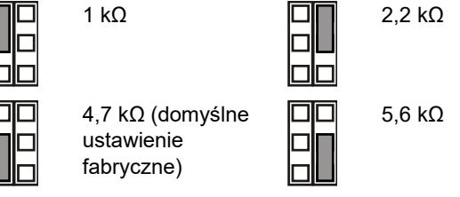

Wył.: Brak wbudowanego rezystora EOL alarmowego.

### **JT: Konfiguracja wbudowanego rezystora EOL sabotażowego (Rt)**

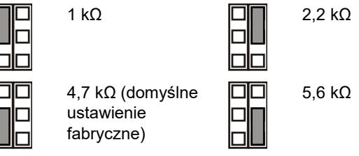

Wył.: Brak wbudowanego rezystora EOL sabotażowego.

#### **JF: Konfiguracja wbudowanego rezystora EOL sygnalizacji usterek (Rf)**

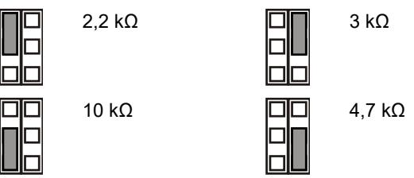

Wył.: Brak wbudowanego rezystora EOL sygnalizacji usterek (domyślne ustawienie fabryczne).

- **J1: Konfiguracja trybu EOL linii**
- Zał.: 3-rezystorowa linia pojedyncza.
- Wył.: Izolowany styk usterki i linia 2-rezystorowa.

#### **Konfigurowanie linii**

Aby skonfigurować linie, należy skorzystać z poniższych wskazówek.

- Wybierz odpowiednie wartości rezystora EOL za pomocą zworek JA, JT i JF. Na przykład za pomocą zworki JT można określić wartość Rt.
- W przypadku wyjść izolowanych wyjmij zworkę JT i J1.
- Aby wykluczyć wewnętrzne rezystory EOL, wyjmij zworki JA, JT i JF.
- W przypadku konfiguracji dwurezystorowej wyjmij zworkę J1 i użyj styków 3 i 6.

W przypadku linii z ustawionymi wszystkimi rezystorami wbudowanymi rezystancja strefy może mieć poniższe wartości.

### **Tabela 2: Wartości rezystancji linii**

| Stan linii          | Wartość  | Domyślnie |
|---------------------|----------|-----------|
| Sabotaż (zwarcie)   | 0 Ω      | 0 Ω       |
| Normalny            | Rt       | 4,7 kΩ    |
| Alarm               | Rt+Ra    | 9,4 kΩ    |
| Usterka             | Rt+Rf    | 14,7 kΩ   |
| AM                  | Rt+Ra+Rf | 19,4 kΩ   |
| Sabotaż (rozwarcie) | ∞        | ∞         |

### **Przełączniki DIP**

#### **Tabela 3: SW1, ustawienia ogólne**

| Przełącznik                    | Wartości                                     |                                              |
|--------------------------------|----------------------------------------------|----------------------------------------------|
| 6: Dioda LED                   | Zał.: Dioda LED zał.*                        | Wył.: Dioda LED wył.                         |
| 5: Zdalne                      | Zał.: Zdalne zał.                            | Wył.: Zdalne wył.*                           |
| 4: Zdalny test automatyczny | Zał.: Zdalny test automatyczny włączony   | Wył:: Zdalny test automatyczny wyłączony* |
| 3: Polaryzacja                 | Zał.: Polaryzacja dodatnia                | Wył.: Polaryzacja ujemna*                    |
| 1, 2: Zasięg radaru         | 1 zał., 2 zał.: 12 m* 1 wył., 2 zał.: 9 m | 1 zał., 2 wył.: 6 m 1 wył., 2 wył.: 4 m   |

* Domyślne ustawienie fabryczne

#### **Tabela 4: SW2, ustawienia AM**

| Przełącznik                 | Wartości                                                         |                                                          |
|-----------------------------|------------------------------------------------------------------|----------------------------------------------------------|
| 4: Sygnalizacja AM          | Zał.: AM do przekaźnika sygnalizacji usterek i alarmowego* | Wył.: AM tylko do przekaźnika sygnalizacji usterek |
| 3: Resetowanie              | Zał.: Automatyczne resetowanie*                               | Wył.: Autoryzowane resetowanie                        |
| 2: Czułość AM               | Zał.: Zaawansowana czułość AM*                                | Wył.: Standardowa czułość AM                          |
| 1: Tryb dzienny/nocny AM | Zał.: Tylko tryb dzienny AM*                                  | Wył.: Tryb dzienny i nocny AM                         |

* Domyślne ustawienie fabryczne

### **Przełącznik DIP SW1, ustawienia ogólne**

#### **SW1-1, SW1-2: Zasięg radaru**

Za pomocą przełączników SW1-1 i SW1-2 można ustawić zasięg radaru odpowiednio do zastosowania. Jest to radar z regulacją zasięgu, przez co zasięg wykrywania jest bardzo dokładny.

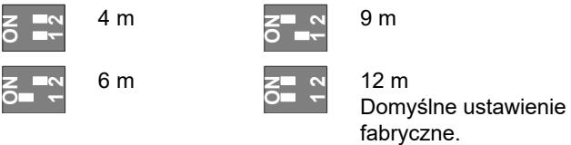

#### **SW1-3: Polaryzacja**

Zał.: Polaryzacja dodatnia. Konfiguruje wejścia (WT i D/N) jako "Active high" (Aktywna polaryzacja wysoka).

Wył.: Polaryzacja ujemna. Konfiguruje wejścia (WT i D/N) jako "Active low" (Aktywna polaryzacja niska). Domyślne ustawienie fabryczne.

Funkcję objaśniono na rys. 9.

#### **Rysunek 9**

| (1) | Polaryzacja wysoka | (3) | Test przejścia |
|-----|--------------------|-----|----------------|
| (2) | Polaryzacja niska  | (4) | Dzień/noc      |

Ta funkcja zależy także od ustawienia przełącznika SW1-5. Patrz "SW1-5: Funkcje sterowane zdalnie" niżej.

#### **SW1-4: Zdalny test automatyczny**

Zał: Zdalny test automatyczny włączony-pozwala na włączanie zdalne testu z centrali.

Wył: Zdalny test automatyczny wyłączony-funkcja nie jest dostępna (ustawienie domyślne).

Gdy zdalny test automatyczny jest włączony, centrala może wprowadzić czujkę w tryb testu diagnotycznego.Test jest włączany przez aktywację trybu Walk Test (sygnał WT w trybie dziennym). Czujka otwiera przekaźnik alarmowy, jeżeli wynik testu jest pozytywny.Jeżeli wyjnik jest negatywny, otwarty zostanie również przekaźnik uszkodzenia. Po zakończeniu testu, czujka wraca do normalnego trybu pracy.

Działanie funkcji zależy również od ustawień przełącznika SW1-5. Zobacz również opis poniżej "SW1-5: Funkcje sterowane zdalnie" niżej.

#### **SW1-5: Funkcje sterowane zdalnie**

Zał.: Zdalne zał. Włącza wejścia WT i dzień/noc.

Wył.: Zdalne wył. Wyłącza wejścia WT i dzień/noc (domyślne ustawienie fabryczne).

Poniższe funkcje zależą od ustawienia Zdalne.

#### **Tabela 5: Funkcje zależne od ustawienia Zdalne**

| Lp.   | Opis                       | SW1-5 Zdalne zał.                    | SW1-5 Zdalne wył.           |
|-------|----------------------------|--------------------------------------|-----------------------------|
| SW1-3 | Polaryzacja                | Możliwość wyboru                     | Tylko dodatnia              |
| SW2-1 | Tryb dzienny / nocny AM | Możliwość wyboru                     | Tryb dzienny i nocny AM  |
| SW2-3 | Resetowanie                | Możliwość wyboru                     | Automatyczne resetowanie |
| WT    | Wejście WT                 | Włączone                             | Wyłączone                   |
| D/N   | Wejście D/N                | Włączone                             | Wyłączone                   |
| Inne  | Tryb eko                   | Włączony w trybie dziennym bez WT | Wyłączony                   |
|       | Pamięć alarmu              | Włączona w trybie dziennym bez WT | Wyłączona                   |

| Lp. | Opis        | SW1-5 Zdalne zał.               | SW1-5 Zdalne wył. |
|-----|-------------|---------------------------------|-------------------|
|     | Zdalny test | Wykonywany po przełączeniu w | Wyłączony         |
|     |             | tryb dzienny z WT               |                   |

Patrz również "Połączenia" na stronie 40.

### **SW1-6: Diody LED**

Zał.: Diody LED włączone. Funkcje diod LED — patrz "Diody LED i wyjścia" na stronie 43.

Wył.: Diody LED wyłączone w każdym stanie.

### **Przełącznik DIP SW2, ustawienia AM**

### **SW2-1: Tryb dzienny/nocny AM**

Zał.: Tylko tryb dzienny AM. Wykrywanie AM działa tylko w trybie dziennym (domyślne ustawienie fabryczne).

Wył.: Tryb dzienny i nocny AM. Wykrywanie AM zawsze działa (w trybie dziennym i nocnym).

Ta funkcja zależy także od ustawienia przełącznika SW1-5. Patrz "SW1-5: Funkcje sterowane zdalnie" na stronie 41.

#### **SW2-2: Czułość AM**

Zał.: Zaawansowana czułość AM. Czujka sygnalizuje maskowanie obszaru AM (domyślne ustawienie fabryczne).

**Uwaga:** Ta konfiguracja jest wymagana dla instalacji EN 50131 Stopień 3.

Wył.: Standardowa czułość AM. Czujka sygnalizuje zbliżanie się do obszaru AM.

#### **SW2-3: Resetowanie**

Zał.: Automatyczne resetowanie. Stan alarmu AM można zresetować po 40 s od wystąpienia alarmu AM (domyślne ustawienie fabryczne).

Wył.: Autoryzowane resetowanie. Stan alarmu AM można zresetować tylko po zastosowaniu trybu WT i trybu dziennego.

#### **Uwagi**

- Przy ustawieniu zaawansowanym (SW2-2 zał.) należy usunąć źródło alarmu AM, aby dozwolone było resetowanie alarmu AM.
- Jeśli alarmu AM nie można zresetować przez resetowanie automatyczne lub autoryzowane, należy odłączyć i ponownie podłączyć zasilanie.
- Należy przeprowadzić test przejścia, aby sprawdzić, czy ustawienia urządzenia są odpowiednie dla danego zastosowania.

Ta funkcja zależy także od ustawienia przełącznika SW1-5. Patrz "SW1-5: Funkcje sterowane zdalnie" na stronie 41.

#### **SW2-4: Sygnalizacja AM**

Zał.: AM do przekaźnika sygnalizacji usterek i alarmowego. Alarm AM jest sygnalizowany przez wyjście alarmowe i sygnalizacji usterek (domyślne ustawienie fabryczne).

**Uwaga:** Jest to konfiguracja wymagana normą EN 50131 klasa 3.

Wył.: AM tylko do przekaźnika sygnalizacji usterek. Alarm AM jest sygnalizowany przez wyjście sygnalizacji usterek.

### **Kalibracja AM**

Podczas uruchamiania układ AM kalibruje się zgodnie ze swoim środowiskiem. Należy zadbać o to, aby nie było żadnych zmian w środowisku w odległości do 1 m od czujki w czasie 60 s od włączenia zasilania. W przeciwnym razie czujka może być podatna na fałszywe alarmy AM, których nie można zresetować.

### **Kszałtowanie charakterystyki pokrycia czujki**

- Usuń przesłony w razie potrzeby (Rysunek 8, pozycja 1). Zmodyfikowane charaktetystyki są pokazane na Rysunku 8, pozycje od 3 do 7.
**Uwaga:** jeżeli obie przesłony pozostaną założone, zasięg czujki jest ograniczony do 6 m (domyślnie).

- Możliwa jest modyfikacja charakterystyki przez wyłamywanie części przesłony (pokazane jako wyszarzone fragmenty na Rysunku 8, pozycja 1). Odpowiadające fragmenty kurtyn są pokazane na Rysunku 8, pozycja 2.
- Naklej wyklejki na lustra w celu zamaskowania części kurtyny. Zobacz szczegóły na Rysunku 7, pozycja 1.

**Przestroga:** Usuwanie naklejonych elementów może uszkodzić powierzchnię lustra.

- Jeżeli bezpośrednio pod czujką znajdują się przeszkody, należy założyć odpowiednią przesłonę (jest założona domyślnie). Zobacz Rysunek 7, pozycja 2.
	- **Uwaga:** Ograniczenie pola widzenia nie jest dopuszczalne w instalacjach EN 50131 Stopień 3.

### **Autotest**

Czujka stale monitoruje obwody PIR, mikrofalowe i AM. Uszkodzenia są zgłaszane do centrali jako usterki techniczne.

### **Testowanie czujki**

Istnieją dwa sposoby włączenia trybu testu przejścia.

**Przełącznik SW1-6 ustawiony na Dioda LED zał., a przełącznik SW1-5 na Zdalne wył.**

W tym trybie sygnalizacja LED jest zawsze włączona (stały tryb testu przejścia).

**Przełącznik SW1-6 ustawiony na Dioda LED zał., a przełącznik SW1-5 na Zdalne zał.**

Przy tym ustawieniu włączone jest wejście testu przejścia (styk 7) i wejście dzień/noc (styk 8). Umożliwia to użytkownikowi zdalne włączenie sygnalizacji LED przez przestawienie czujki w tryb dzienny oraz aktywację testu przejścia.

# **Tryb ekologiczny**

Gdy przełącznik SW1-5 jest ustawiony na Remote on (Zdalne zał.), radar jest wyłączony w trybie dziennym (bez WT) w celu ograniczenia poboru prądu. Czujka działa wówczas tylko w trybie PIR.

**Uwaga:** Aby ten tryb działał, linia dzień/noc musi być podłączona do centrali.

Ten tryb nie jest zgodny ze standardem EN 50131-2-4.

**Tylko dla DD1012AM-N:** Podczas pierwszych 180 sekund Trybu ekologicznego czujka jest przełączana w tryb PIR o wysokiej czułości po to, aby dodatkowo przetestować czujkę, na przykład, wykorzystując zewnętrzne źródło ciepła dla wykrywania znaczącego zmniejszenia zasięgu. Po upływie 180 sekund czujka przełącza się w tryb standardowej czułości.

### **Pamięć alarmu**

Gdy przełącznik SW1-5 jest ustawiony na Zdalne zał., alarmy, które wystąpiły w trybie nocnym, są zapisywane w pamięci czujki. Są one sygnalizowane przez migającą na czerwono diodę LED po przełączeniu urządzenia w tryb dzienny (test przejścia wyłączony). Pamięć jest czyszczona po ponownym przełączeniu czujki w tryb nocny.

**Uwaga:** Aby zapobiec pokazywaniu pamięci alarmu przez diody LED, należy ustawić przełącznik SW1-6 na Off (Wył.). Patrz "SW1-6: Diody LED" na stronie 42.

### **Diody LED i wyjścia**

Aby włączyć funkcje diod LED, należy ustawić przełącznik SW1-6 na On (Zał.); w przeciwnym razie diody LED będą wyłączone w każdym stanie. Aby uzyskać więcej szczegółów, patrz "SW1-6: Diody LED" na stronie 42.

#### **Tabela 6: Diody LED i wyjścia**

| Status                                        | Czerwona dioda LED | Żółta dioda LED | Przekaźnik alarmowy | Przekaźnik sygnalizacj i usterek | Resetowanie                        |
|-----------------------------------------------|-----------------------|--------------------|------------------------|----------------------------------------|------------------------------------|
| Uruchomienie                                  |                       |                    | Zw.                    | Zw.                                    | Automatycznie po 60 s.          |
| Niskie napięcie                               |                       |                    |                        | Rozw. Rozw.                            | Zastosuj prawidłowe napięcie |
| Alarm intruza PIR                             |                       |                    | Zw.                    | Zw.                                    |                                    |
| Alarm intruza mikrofalowy                  |                       |                    | Zw.                    | Zw.                                    |                                    |
| Podwójny alarm wykrywania ruchu intruza |                       |                    | Rozw. Zw.              |                                        | Automatycznie po 3 s.           |
| Pamięć alarmu z dwóch czujników            |                       |                    | Zw.                    | Zw.                                    | Przełącz w tryb nocny           |
| Alarm AM                                      |                       |                    | [1]                    | Rozw.                                  | Zależy od ustawienia SW2- 3  |
| Usterka techniczna                            |                       |                    | Zw.                    | Rozw.                                  | Udany test przejścia            |
| [1] — Zależy od ustawienia SW2-4              |                       |                    |                        |                                        |                                    |
| Świeci w sposób ciągły                        |                       |                    |                        | Miga normalnie (1 Hz)                  |                                    |

### **Dane techniczne**

| Technologia czujki | Dualna+AM                                                         |
|--------------------|-------------------------------------------------------------------|
| Zasięg             | 4, 6, 9, 12 m, wybierany za pomocą przełączników SW1-1 i SW1-2 |

| Kąt widzenia                                         | 78 stopni                                |
|------------------------------------------------------|------------------------------------------|
| Optyka PIR                                           | 9 kurtyn lustrzanych o wysokiej gęstości |
| Częstotliwość mikrofalowa                            | 5725–5875 MHz                            |
| Maskymalna moc wyjściowa                             | 13,46 mW                                 |
| Maks. moc wyjściowa mikrofal przy 1 m             | 0,003 μW/cm²                             |
| Funkcja pamięci                                      | Tak                                      |
| Zasilanie                                            | od 9 do 15 V (nominalnie 12 V)          |
| Odporność na tętnienia                               | 2 V (przy 12 V)                         |
| Czas uruchamiania czujki                             | 60 s                                     |
| Pobór prądu                                          | od 10 do 22 mA (nominalnie 11 mA)        |
| Wysokość montażu                                     | od 2,0 do 2,6 m                          |
| Zakres prędkości celu: DD1012AM-N DD1012AM-D-N | od 0,2 do 3,0 m/s od 0,1 do 4,0 m/s   |
| Charakterystyka przekaźnika Alarm (NC) / Sabotaż  | 80 mA 30 V, Typ A                       |
| Charakterystyka przekaźnika sygnalizacji usterek  | 80 mA 30 V, Typ A                       |
| Czas alarmu                                          | 3 s                                      |
| Temperatura pracy                                    | od −10 do +55°C                          |
| Wilgotność względna                                  | maks. 95%, bez kondensacji               |
| Waga                                                 | 120 g                                    |
| Wymiary (S x W x G)                                  | 126 × 63 × 50 mm                         |
| Klasa IP/IK                                          | IP30 IK04                                |
| Zabezpieczenie przed oderwaniem                   | Tak                                      |

### **Informacje prawne**

| Producent                                              | WPROWADZONE NA RYNEK PRZEZ: Carrier Fire & Security Americas Corporation Inc. 13995 Pasteur Blvd Palm Beach Gardens, FL 33418, USA AUTORYZOWANY PRZEDSTAWICIEL NA TERENIE UE: Carrier Fire & Security B.V. Kelvinstraat 7, 6003 DH Weert, Holandia                                                                                                                                                                                                                                                                                                                                           |
|--------------------------------------------------------|-------------------------------------------------------------------------------------------------------------------------------------------------------------------------------------------------------------------------------------------------------------------------------------------------------------------------------------------------------------------------------------------------------------------------------------------------------------------------------------------------------------------------------------------------------------------------------------------------------------------|
| Ostrzeżenia i zastrzeżenia dotyczące produktu | TEN PRODUKT JEST PRZEZNACZONY DO SPRZEDAŻY I MONTAŻU PRZEZ WYKWALIFIKOWANYCH SPECJALISTÓW. CARRIER FIRE & SECURITY NIE UDZIELA ŻADNEJ GWARANCJI, ŻE JAKAKOLWIEK OSOBA LUB JAKIKOLWIEK PODMIOT NABYWAJĄCY JEJ PRODUKTY, W TYM "AUTORYZOWANI SPRZEDAWCY" ORAZ "AUTORYZOWANI DEALERZY", SĄ PRAWIDŁOWO PRZESZKOLENI LUB DOŚWIADCZENI TAK, BY MOGLI PRAWIDŁOWO ZAMONTOWAĆ PRODUKTY ZABEZPIECZAJĄCE. Więcej informacji o zastrzeżeniach dotyczących gwarancji oraz bezpieczeństwa produktów można przeczytać na stronie https://firesecurityproducts.com/policy/product |
|                                                        | warning/ lub po zeskanowaniu kodu QR.                                                                                                                                                                                                                                                                                                                                                                                                                                                                                                                                                                             |

|                          | Carrier Fire & Security niniejszym deklaruje zgodność urządzenia ze wszystkimi wymaganiami wszystkich stosownych dyrektyw, lącznie z, lecz nie ograniczając się do, Dyrektywą 2014/53/EU. Więcej informacji na stronie firesecurityproducts.com.                                                                                          |
|--------------------------|----------------------------------------------------------------------------------------------------------------------------------------------------------------------------------------------------------------------------------------------------------------------------------------------------------------------------------------------------------|
| REACH                    | Produkt może zawierać substancje, które znajdują się na liście kandydackiej, w stężeniu powyżej 0,1% wag., zgodnie z ostatnio opublikowaną listą kandydacką na stronie internetowej ECHA.                                                                                                                                                    |
|                          | Informacje na temat bezpiecznego użytkowania można znaleźć na stronie https://firesecurityproducts.com/en/content/intrusi on-intro                                                                                                                                                                                                              |
|                          | 2012/19/EU (dyrektywa WEEE): Na terenie Unii Europejskiej produktów oznaczonych tym znakiem nie wolno wyrzucać wraz z odpadami miejskimi. W celu zapewnienia prawidłowego recyklingu produkt należy oddać lokalnemu sprzedawcy lub przekazać do wyznaczonego punktu zbiórki. Aby uzyskać więcej informacji, patrz: recyclethis.info |
| Dokumentacja produktu | Zapoznaj się z poniższym linkiem, aby pobrać elektroniczne wersje dokumentacji produktu.                                                                                                                                                                                                                                                              |
|                          | Ten link prowadzi do regionalnej strony kontaktowej w regionie EMEA. Na tej stronie możesz wnioskować o login do bezpiecznego portalu internetowego, na którym przechowywane są wszystkie instrukcje. https://firesecurityproducts.com/en/contact                                                                                         |

### **Informacje kontaktowe**

firesecurityproducts.com lub www.aritech.com

# **PT: Ficha de Instalação**

# **Descrição**

DD1012AM(-D)-N é um sensor de movimento duplo AM.

Combina a tecnologia patenteada PIR de óptica de espelho com a tecnologia patenteada "Range Controlled Radar".

### **Conselhos de instalação**

Ver a figura 1.

O detector destina-se a ser montado na parede, embora possa ser instalado também no tecto, utilizando um suporte de montagem.

Utilize as directrizes que se seguem para determinar a melhor localização para a instalação do detector.

- Instale o detector de modo que o movimento previsto de um intruso atravesse o padrão de detecção (consulte a Figura 3).
- Instale o detector numa superfície estável. Para a altura de montagem permitida, ver "Especificações" na página nº 48.
- Não instale o detector a menos de 0,5 m de objectos metálicos ou a menos de 1,5 m de luzes fluorescentes.
- Não coloque objectos à frente do detector que possam impedir uma linha de visão clara.
- Instale os detectores a uma distância mínima de 6 m uns dos outros, e utilize a definição de curto alcance para evitar interferências ao montar os detectores virados um para o outro.

A tecnologia de duplo processamento deste detector é muito resistente ao perigo de falsos alarmes. No entanto, evite potenciais causas de instabilidade, tais como:

#### Perigos PIR:

- Luz solar directa no detector
- Fontes de calor dentro do campo de visão do detector
- Correntes de ar fortes que incidam no detector
- Animais dentro do campo de visão
- Obscurecimento do campo de visão do detector devido a objectos de grandes dimensões, tais como peças de mobiliário

Perigos relacionados com microondas:

- Superfície de instalação susceptível a vibrações
- Superfícies metálicas que reflictam a energia das microondas
- Movimento da água nos tubos de plástico
- Objectos em movimento ou que vibrem, tais como ventoinhas e canais de aquecimento ou ar condicionado

#### Perigos AM:

- Objectos em movimento a menos de 1 m da parte da frente do detector
- Pequenos insectos no detector
- Iluminação fluorescente moderna na proximidade (dentro de 1,5 m)

**AVISO!** O equipamento não se encontra ligado à terra. Qualquer circuito externo ligado ao equipamento deve estar localizado no interior do mesmo edifício e ligado a um condutor de terra.

O isolamento dos condutores ligados ao equipamento devem estar em conformidade com a IEC 60332-1-2 e IEC 60332-1- 3 ou IEC 60332-2-2, dependendo da área da secção transversal do condutor, ou com a IEC TS 60695-11-21, independentemente da área transversal. Em alternativa, os condutores devem estar em conformidade com a norma UL 2556 VW-1.

A fonte de alimentação do detetor deve ser limitada a 15 W de potência.

Recomenda-se fazer regularmente um walk test ao detector e uma verificação no painel de controlo.

**Para instalar o detector:**

- 1. Retire o insert personalizável (consulte a Figura 2, itens 1 e 2).
- 2. Inserindo uma chave de parafusos, abra cuidadosamente o detector (consulte a Figura 2, itens 3 e 4).

**Cuidado:** não toque no sensor piroeléctrico (Figura 6).

- 3. Retire o parafuso da tampa (Figura 4, item 2).
- 4. Fixe a base à parede. Para a altura de montagem permitida, ver "Especificações" na página nº 48.
Consulte a Figura 4. Em todas as posições, utilize um mínimo de dois parafusos M4 dos padrões DIN 7505B, DIN 96, DIN 7996, ou um parafuso de cabeça chata com 8 mm de diâmetro.

- Para montagem plana, utilize parafusos nas posições A.

- Para montagem de canto, utilize parafusos na posição B ou C.

**Nota para as instalações EN 50131 Grau 3:** Não utilizar a posição de montagem C. É necessário utilizar ambos os orifícios A2 e B2 para as posições de montagem A e B.

- Para instalar a tamper de remoção ST400, utilize as posições de montagem A. A posição de montagem ST400 é mostrada como o item 3 na Figura 4. Abra a saída na chapa traseira (Figura 5, item 2).

- 5. Ligue os cabos eléctricos do detector (consulte as Figuras 4 e 12). Utilize as entradas de cabos na chapa traseira (Figura 5, item 1) e o canal de cabos (Figura 5, item 3).
- 6. Seleccione o jumper desejado e as configurações dos DIP switches (consulte "Configuração do detector" abaixo para obter mais informações).
- 7. Remova as máscaras e coloque os autocolantes, se necessário. Para mais informação, consultar "Configurar padrão de cobertura" na página nº 47.
- 8. Para aplicações em tectos, utilize o suporte de montagem rotativo SB01. A posição de montagem SB01 é mostrada como o item 1 na Figure 4.

**Nota:** A utilização do SB01 não está em conformidade com as instalações EN50131 Grau 3.

- 9. Feche a tampa, insira o parafuso da tampa e coloque o insert personalizável.
### **Ligações**

Ver a figura 12.

#### **Tabela 1: Ligações do detector**

| Terminal | Etiqueta     | Explicação                                                                                                                                                                                                                                                 |
|----------|--------------|------------------------------------------------------------------------------------------------------------------------------------------------------------------------------------------------------------------------------------------------------------|
| 1, 2     | GND, +12V | Ligação da fonte de alimentação (9 a 15 V, 12 V nominal)                                                                                                                                                                                              |
| 3, 4     | ALARM        | Saída de relé de alarme (33 Ω). Utilize o jumper JA para configurar a resistência EOL integrada em série com o relé. Consulte "Jumpers" abaixo.                                                                                                   |
| 5, 6     | TAMPER       | Saída de interruptor tamper (0 Ω). Utilize o jumper JT para configurar a resistência EOL integrada em série com o interruptor. Consulte "Jumpers" abaixo.                                                                                         |
| 7        | Walk test    | Esta entrada activa e desactiva o LED (walk test On/Off). Só é possível entrar no modo de walk test quando o detector está no modo Dia (pino 8). Active high ou low é determinado por SW1-3 (consulte "SW1-3: Polaridade" na página nº 46). |

| Terminal | Etiqueta  | Explicação                                                                                                                                                                                                                                                                                   |
|----------|-----------|----------------------------------------------------------------------------------------------------------------------------------------------------------------------------------------------------------------------------------------------------------------------------------------------|
| 8        | Day/Night | Esta entrada alterna o detector no modo dia (mostra a memória no indicador LED) ou noite (activa a memória de alarmes e limpa os alarmes anteriormente guardados). A polaridade active high ou low é determinada por SW1-3 (consulte "SW1-3: Polaridade" na página nº 46). |
| 9, 10    | Fault     | Saída de relé de falha (33 Ω). Utilize o jumper JF para inserir uma das resistências EOL integradas em série com o relé. Consulte "Jumpers" abaixo para ver as definições correctas da resistência.                                                                              |

#### **Notas**

- As entradas 7 e 8 só podem ser utilizadas quando SW1-5 estiver configurado como Remoto ligado. Consulte "SW1- 5: Funcionalidade remota" na página nº 47.
- O LED só é activado quando SW1-6 está configurado como LED ligado.

A Figura 10 explica como criar uma zona única com uma configuração de resistência múltipla.

#### **Figura 10**

- (1) Relé de alarme (2) Zona de alarme
- Ra Resistência EOL de alarme
	- Rt Resistência EOL de tamper
- (3) Saída do interruptor de
- Rf Resistência EOL de falha
- tamper (4) Relé de falha

### **Configuração do detector**

Consulte a Figura 13 para ver as localizações dos jumpers e DIP switches.

### **Jumpers**

Os jumpers definem o modo e o valor do EOL integrado. O circuito é mostrado na Figura 10.

**JA: definir a resistência EOL de alarmes integrada (Ra)**

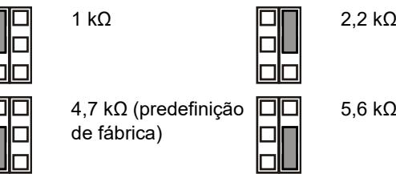

5,6 kΩ

Off (Desligado): sem EOL de alarme integrado.

**JT: definir a resistência EOL de tamper integrada (Rt)**

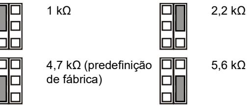

Off (Desligado): sem EOL de tamper integrado.

**JF: definir a resistência EOL de falha integrada (Rf)**

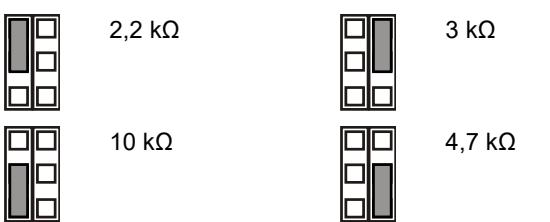

Off (Desligado): sem EOL de falha integrado (predefinição de fábrica).

#### **J1: definir o modo EOL de zona**

On (Ligado): zona única de 3 resistências.

Off (Desligado): zona de 2 resistências e contacto de falha isolado

#### **Configuração da zona**

Para configurar a zona, aplique as directrizes seguintes:

- Seleccione os valores da resistência EOL aplicáveis com JA, JT e JF. Por exemplo, a definição do jumper JT determina o valor Rt.
- Para saídas isoladas, remova JT e J11.
- Remova os jumpers JA, JT e JF para excluir os valores de EOL integrado.
- Para a configuração de resistência dupla, remova J1 e utilize o terminal 3 e 6.

Para uma zona única com todas as resistências integradas definidas, a resistência de zona pode ser a seguinte:

#### **Tabela 2: Valores de resistência de zona**

| Estado da zona  | Valor    | Valor predefinido |
|-----------------|----------|-------------------|
| Tamper (curto)  | 0 Ω      | 0 Ω               |
| Normal          | Rt       | 4,7 kΩ            |
| Alarme          | Rt+Ra    | 9,4 kΩ            |
| Fault (Falha)   | Rt+Rf    | 14,7 kΩ           |
| AM              | Rt+Ra+Rf | 19,4 kΩ           |
| Tamper (aberto) | ∞        | ∞                 |

### **DIP switches**

#### **Tabela 3: SW1, definições gerais**

| Interruptor               | Valores                                   |                                                   |
|---------------------------|-------------------------------------------|---------------------------------------------------|
| 6: LED                    | On (Ligado): LED ligado*               | Off (Desligado): LED desligado                 |
| 5: Remoto                 | On (Ligado): remoto ligado             | Off (Desligado): remoto desligado*             |
| 4. Teste auto remoto      | On (Ligado): Teste auto remote ativado | Off (Desligado): Teste auto remote desativado* |
| 3: Polaridade             | On (Ligado): polaridade positiva       | Off (Desligado): polaridade negativa*          |
| 1, 2: Alcance do radar | 1 On, 2 On: 12 m* 1 Off, 2 On: 9 m     | 1 On, 2 Off: 6 m 1 Off, 2 Off: 4 m             |

* Predefinição de fábrica

|  | Tabela 4: SW2, definições AM |  |
|--|------------------------------|--|
|  |                              |  |

| Valores              |                       |
|----------------------|-----------------------|
| On (Ligado): AM para | Off (Desligado): AM   |
| relés de falha e     | para relé de falha    |
| alarme*              | apenas                |
| On (Ligado):         | Off (Desligado):      |
| reinicialização      | reinicialização       |
| automática*          | autorizada            |
| On (Ligado):         | Off (Desligado):      |
| sensibilidade AM     | sensibilidade AM      |
| avançada*            | padrão                |
| On (Ligado): Apenas  | Off (Desligado): Modo |
| modo dia AM*         | dia e noite AM        |
|                      |                       |

* Predefinição de fábrica

# **DIP switch SW1, definições gerais**

#### **SW1-1, SW1-2: alcance do radar**

Utilize SW1-1 e SW1-2 para definir o alcance do radar exactamente para corresponder à aplicação. O radar é do tipo "range-gating" (com selecção de profundidade), o que significa que o alcance de detecção é muito preciso.

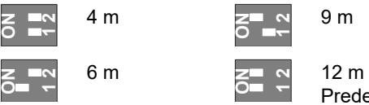

### Predefinição de fábrica.

#### **SW1-3: Polaridade**

On (Ligado): polaridade positiva. Configura as entradas (WT e D/N) como "Active high".

Off (Desligado): polaridade negativa. Configura as entradas (WT e D/N) como "Active low". Predefinição de fábrica.

A funcionalidade é mostrada na Figura 9.

| Figura 9 |                  |  |  |  |     |           |           |  |  |  |  |
|----------|------------------|--|--|--|-----|-----------|-----------|--|--|--|--|
| (1)      | Polaridade alta  |  |  |  |     | (3)       | Walk test |  |  |  |  |
| (2)      | Polaridade baixa |  |  |  | (4) | Dia/noite |           |  |  |  |  |
|          |                  |  |  |  |     |           |           |  |  |  |  |

Esta função depende também da configuração de SW1-5. Consulte "SW1-5: Funcionalidade remota" na página nº 47.

### **SW1-4: Teste auto remoto**

On (Ligado): Teste auto remoto ligado. Ativa o teste auto remoto

Off (Desligado): Teste auto remoto desligado. Desativa o teste auto remoto (por defeito).

Se o teste auto remoto se for ativado, o painel de controlo pode ativar o detetor para que este execute o diagnóstico de teste. Este teste é ativado, comutando o modo de 'walk test' (modo dia e WT ativado). O detetor o relé de alarme se o resultado do teste for positivo, e o relé de falha se o resultado for negativo. Após o teste o detetor continua em operação normal.

Esta função também depende da configuração do SW1-5. Ver "SW1-5: Funcionalidade remota" na página nº 47.

#### **SW1-5: Funcionalidade remota**

On (Ligado): remoto ligado. Activa as entradas de dia/noite e WT.

Off (Desligado): remoto desligado. Desactiva as entradas de dia/noite e WT (predefinição de fábrica).

A funcionalidade seguinte depende da configuração remota.

| Item  | Descrição            | SW1-5 Remote on                                        | SW1-5 Remote off              |
|-------|----------------------|--------------------------------------------------------|-------------------------------|
| SW1-3 | Polaridade           | Selecionável                                           | Só positivo                   |
| SW2-1 | Modo dia/noite AM | Selecionável                                           | Modo dia e noite AM        |
| SW2-3 | Reinicialização      | Selecionável                                           | reinicialização automática |
| WT    | Entrada de WT        | Activado                                               | Desactivado                   |
| D/N   | Entrada D/N          | Activado                                               | Desactivado                   |
| Outro | Modo verde           | Activado no modo dia sem WT                         | Desactivado                   |
|       | Memória de alarme | Activado no modo dia sem WT                         | Desactivado                   |
|       | Teste remoto         | Executado depois de comutar para modo dia com WT | Desactivado                   |

**Tabela 5: Funções que dependem da configuração remota**

Consulte também "Ligações" na página nº 45.

#### **SW1-6: LEDs**

On (Ligado): LEDs activados. Consulte "LEDs e saídas" na página nº 48 para ver a funcionalidade dos LEDs.

Off (Desligado): LEDs desactivados para qualquer estado.

### **DIP switch SW2, definições AM**

#### **SW2-1: Modo dia/noite AM**

On (Ligado): apenas modo dia AM. A detecção AM só funciona durante o modo dia (predefinição de fábrica).

Off (Desligado): dia e noite AM. A detecção AM opera sempre (modo dia e noite).

Esta função depende também da configuração de SW1-5. Consulte "SW1-5: Funcionalidade remota" acima.

#### **SW2-2: Sensibilidade AM**

On (Ligado): sensibilidade AM avançada. O detector assinala a máscara de área AM (predefinição de fábrica).

**Nota:** Esta é a configuração exigida pela EN 50131 Grau 3.

Off (Desligado): sensibilidade AM padrão. O detector assinala a área AM a aproximar-se.

#### **SW2-3: Reinicialização**

On (Ligado): reinicialização automática. O estado de alarme AM pode ser reinicializado 40 s após a emissão do alarme (predefinição de fábrica).

Off (Desligado): reinicialização autorizada. O estado de alarme AM só pode ser reinicializado depois de aplicar o modo WK e o modo dia.

#### **Notas**

- Para a configuração avançada (SW2-2 ligado) a origem do alarme AM deve ser eliminada antes de ser permitida a reinicialização AM.
- Se o alarme AM não puder ser reinicializado através de reinicialização automática ou autorizada, desligue e volte a ligar a fonte de alimentação .
- Deve ser executado um walk test para assegurar que as configurações do dispositivo são correctas para a aplicação.

Esta função depende também da configuração de SW1-5. Consulte "SW1-5: Funcionalidade remota" acima.

#### **SW2-4: Sinalização AM**

On (Ligado): AM para relés de falha e alarme. O alarme AM é assinalado através das saídas de alarme e de falha (predefinição de fábrica).

**Nota:** esta é uma configuração EN 50131 necessária de grau 3.

Off (Desligado): AM para relé de falha apenas. O alarme AM é assinalado através da saída de falha.

### **Calibração AM**

Durante o arranque, o circuito AM calibra-se em relação ao ambiente. É importante assegurar que não são efectuadas alterações ao ambiente dentro da distância de 1 m do detector no espaço de 60 s após o arranque, caso contrário o detector poderá ser vulnerável a alarmes AM falsos, os quais poderão ser impossíveis de reinicializar.

### **Configurar padrão de cobertura**

- Remova as máscaras (Figura 8, item 1) se necessário. O padrão modificado é indicado na Figura 8, itens 3 a 7.
**Nota:** Com ambas as mascaras instaladas, o alcance do detetor é limitado a 6m (de fábrica)

- Modique o padrão através partes das máscaras (indicado na Figura 8, item 1 a cinzento). A correspondência com os fragmentos de cortinas é indicado na Figura 8, item 2.
- Coloque os autocolantes apropriados se necessário. Para mais informação, ver figura 7 item 1.

**Atenção:** A remoção dos autocolante pode danificar a superfície do espelho.

- Quando existem por baixo do detetor, coloque a máscara no interior da janela (por defeito). Desta forma a desativa a parte da cortina que observa para baixo sobre objeto, cuja proximidade pode destabilizar o detetor. Ver figura 7, item 2.
**Nota:** A redução do campo de visão não está em conformidade com a norma EN 50131 Grau 3.

### **Auto-teste**

O detector monitoriza continuamente os circuitos PIR, de microondas e AM. Os defeitos são comunicados ao painel como falhas técnicas.

### **Walk test do detector**

O modo de walk test pode ser activado de duas maneiras.

**SW1-6 configurado como LED ligado, SW1-5 configurado como Remoto desligado**

Neste modo, a indicação LED está sempre activada (modo de walk test constante).

**SW1-6 configurado como LED ligado, SW1-5 configurado como Remoto ligado**

Esta configuração activa a entrada de walk test (pino 7) e a entrada de dia/noite (pino 8). Isto permite que o utilizador active remotamente a indicação LED, colocando o detector no modo dia e activando o walk test.

### **Modo verde**

Quando SW1-5 está configurado como Remoto ligado, o radar é desligado durante o modo dia (sem WT) para reduzir o consumo de energia eléctrica. O detector funciona então no modo apenas PIR.

**Nota:** a linha dia/noite deve ser ligada ao painel de controlo para permitir o funcionamento deste modo.

Este modo não está em conformidade com a norma EN 50131-2-4.

**Só DD1012AM-N:** Nos primeiros 180 segundos do funcionamento em modo Verde, o detetor é comutado para modo PIR de alta sensibilidade para permitir testes adicionais, por exemplo, utilizando uma fonte de calor externa para testar contra uma redução significativa do alcance. Após 180 segundos, o detetor é comutado de volta à sensibilidade padrão.

### **Memória de alarme**

Quando SW1-5 está configurado como Remoto ligado, os alarmes que ocorreram no modo noite são guardados na memória do detector. São indicados por um LED vermelho a piscar quando a unidade comuta para o modo dia (walk test desactivado). A memória é limpa quando o detector volta a entrar no modo noite.

**Nota:** Configure SW1-6 como desligado (Off) para evitar mostrar a memória de alarmes nos LEDs. Consulte "SW1-6: LEDs" na página nº 47.

### **LEDs e saídas**

Para activar a funcionalidade dos LEDs, configure SW1-6 como ligado (On), caso contrário os LEDs estão desactivados em qualquer estado. Consulte "SW1-6: LEDs" na página nº 47 para obter mais informações.

#### **Tabela 6: LEDs e saídas**

| Estado       | vermelho LED | amarelo LED | Relé de alarme | Relé de falha | Para reinicializar           |
|--------------|-----------------|----------------|-------------------|------------------|------------------------------|
| Arranque     |                 |                | F                 | F                | Automaticamente após 60 s |
| Baixa tensão |                 |                | A                 | A                | Aplicar tensão correcta   |

| Estado                                          | vermelho LED | amarelo LED | Relé de alarme | Relé de falha | Para reinicializar          |
|-------------------------------------------------|-----------------|----------------|-------------------|------------------|-----------------------------|
| Alarme de intruso PIR                        |                 |                | F                 | F                |                             |
| Alarme de intrusão por microondas            |                 |                | F                 | F                |                             |
| Alarme de intrusão de movimento duplo     |                 |                | A                 | F                | Automaticamente após 3 s |
| Memória Alarme DT                               |                 |                | F                 | F                | Mudar para o modo noite  |
| Alarme AM                                       |                 |                | [1]               | A                | Depende de SW2- 3        |
| Falha técnica                                   |                 |                | F                 | A                | Walk test bem sucedido   |
| F — Fechado, A — Aberto, [1] — Depende de SW2-4 |                 |                |                   |                  |                             |

Continuamente ligado Intermitência normal (1 Hz)

### **Especificações**

| Tecnologia de detector                          | Duplo+AM                                               |
|-------------------------------------------------|--------------------------------------------------------|
| Alcance                                         | 4, 6, 9, 12 m selecionável através de SW1-1 e SW1-2 |
| Ângulo de visão                                 | 78 graus                                               |
| Óptica PIR                                      | 9 cortinas de espelho de elevada densidade          |
| Frequência de microondas                        | 5725–5875 MHz                                          |
| Potência máxima de saída                        | 13,46 mW                                               |
| Saída máx. de microondas a 1 m                  | 0,003 μW/cm²                                           |
| Função de memória                               | Sim                                                    |
| Entrada de alimentação                          | 9 a 15 V (12 V nominal)                               |
| Imunidade ripple pico a pico                    | 2 V (a 12 V)                                          |
| Tempo de início do detector                     | 60 s                                                   |
| Consumo de corrente                             | 10 a 22 mA (11 mA nom.)                                |
| Altura da instalação                            | 2,0 até 2,6 m                                          |
| Velocidade ao "alvo":                           |                                                        |
| DD1012AM-N                                      | 0,2 a 3,0 m/s                                          |
| DD1012AM-D-N                                    | 0,1 a 4,0 m/s                                          |
| Característica do alarme (NC)/relé do tamper | 80 mA 30 V, Form A                                    |
| Característica do relé de falha                 | 80 mA 30 V, Form A                                    |
| Hora de alarme                                  | 3 s                                                    |
| Temperatura de funcionamento                    | −10 a +55°C                                            |
| Humidade relativa                               | Máx. 95%, sem condensação                              |
| Peso                                            | 120 g                                                  |
| Dimensões (A x L x P)                           | 126 × 63 × 50 mm                                       |
| Classificação de IP/IK                          | IP30 IK04                                              |
| Tamper de remoção                               | Sim                                                    |

### **Informação reguladora**

| Fabricante                                                  | COLOCADO NO MERCADO POR: Carrier Fire & Security Americas Corporation Inc. 13995 Pasteur Blvd Palm Beach Gardens, FL 33418, USA REPRESENTANTE EU AUTORIZADO: Carrier Fire & Security B.V. Kelvinstraat 7, 6003 DH Weert, Netherlands                                                                                                                                                                                                                                                                                                                                                                                       |
|-------------------------------------------------------------|----------------------------------------------------------------------------------------------------------------------------------------------------------------------------------------------------------------------------------------------------------------------------------------------------------------------------------------------------------------------------------------------------------------------------------------------------------------------------------------------------------------------------------------------------------------------------------------------------------------------------------------------|
| Avisos e isenções de responsabilidade dos produtos | ESTES PRODUTOS ESTÃO PREVISTOS PARA SEREM VENDIDOS E INSTALADOS POR PROFISSIONAIS QUALIFICADOS. A CARRIER FIRE & SECURITY NÃO PODE APRESENTAR QUALQUER GARANTIA DE QUE QUALQUER PESSOA OU ENTIDADE QUE COMPRE OS SEUS PRODUTOS, INCLUINDO QUALQUER "DISTRIBUIDOR AUTORIZADO" OU "REVENDEDOR AUTORIZADO", TEM FORMAÇÃO OU EXPERIÊNCIA ADEQUADA PARA INSTALAR CORRETAMENTE PRODUTOS RELACIONADOS COM A SEGURANÇA E A PROTEÇÃO CONTRA INCÊNDIOS. Para mais informações sobre isenções de garantia e sobre a segurança dos produtos, consulte https://firesecurityproducts.com/policy/product |
|                                                             | warning/ ou faça a leitura do código QR.                                                                                                                                                                                                                                                                                                                                                                                                                                                                                                                                                                                                     |
|                                                             | A Carrier Fire & Security declara que este dispositivo se encontra em conformidade com os requisitos e disposições aplicáveis, e com todas as regras e regulamentos aplicáveis, incluindo, entre outros, a Diretiva 2014/53/EU. Para mais informações consulte firesecurityproducts.com.                                                                                                                                                                                                                                                                                                                                      |
| REACH                                                       | O produto pode conter substancias da Lista de Candidatos de concentração acima de 0.1% w/w, de acordo com a lista de Candidatos publicada recentemente no site ECHA.                                                                                                                                                                                                                                                                                                                                                                                                                                                                |
|                                                             | Informações de utilização segura podem ser encontradas em https://firesecurityproducts.com/en/content/intrusi on-intro                                                                                                                                                                                                                                                                                                                                                                                                                                                                                                              |
|                                                             | 2012/19/EU (directiva WEEE, sobre Resíduos de Equipamentos Eléctricos e Electrónicos): Os produtos marcados com este símbolo não podem ser eliminados como lixo municipal não separado na União Europeia. Para uma reciclagem adequada, devolva este equipamento ao fornecedor local aquando da compra de um novo equipamento equivalente, ou coloque-o num ponto de recolha designado para o efeito. Para mais informações, consulte: recyclethis.info                                                                                                                                                           |
| Documentação de produto                                  | Por favor consulte o link seguinte para obter a versão eletrónica da documentação do produto.                                                                                                                                                                                                                                                                                                                                                                                                                                                                                                                                             |
|                                                             | Este link irá direciona-lo para a página regional da EMEA. Nesta página pode solicitar o acesso ao portal seguro, onde todos os manuais se encontram armazenados. https://firesecurityproducts.com/en/contact                                                                                                                                                                                                                                                                                                                                                                                                                    |

## **Informação de contacto**

firesecurityproducts.com ou www.aritech.com

# **SV: Installationsmanual**

### **Beskrivning**

DD1012AM(-D)-N är en kombi AM-rörelsedetektor

Den kombinerar den patenterade PIR spegeloptiska teknologin med den patenterade Range Controlled Radar mikrovågsteknologin.

### **Installationsanvisningar**

Se figur 1.

Detektorn är avsedd för väggmontering, men kan även takmonteras med hjälp av en fästvinkel.

Använd följande anvisningar för att hitta den bästa monteringsplatsen för detektorn.

- Montera detektorn så att en eventuell inkräktare förväntas korsa detektorns övervakningsområde vid förflyttning. (se figur 3).
- Montera detektorn på en stabil yta. För monteringshöjd, se "Specifikationer" på sidan 53.
- Montera inte detektorn inom 0,5 m från metallföremål eller inom 1,5 m från fluorescerande ljuskällor.
- Placera inte föremål framför detektorn som blockerar detektionsområdet.
- Montera detektorerna minst 6 meter från varandra och använd inställningen för korta avstånd för att undvika störningar när detektorerna monteras mot varandra.

Den här detektorns dubbla behandlingsteknik är mycket resistent mot falsklarm. Undvik trots detta potentiella källor till instabilitet, såsom:

#### PIR-risker:

- direkt solljus på detektorn
- värmekällor inom detektorns täckningsområde
- kraftigt luftdrag på detektorn
- djur i täckningsområdet
- avskärmning av detektorns täckningsområde med stora föremål såsom möbler m.m.

Risker med mikrovågor:

- monteringsytan som är känslig för vibrationer
- metallytor som reflekterar mikrovågor
- vattenrörelser genom plaströr
- föremål som rör sig eller vibrerar, som t.ex. fläktar och värme- eller luftkonditioneringstrummor

#### AM-risker:

- Objekt i rörelse mindre än 1 meter framför detektorn
- Små insekter på detektorn
- Modernt fluorecerande ljus i närheten (inom 1,5 meter)

**VARNING!** Utrustningen är inte jordad. Alla externa kretsar som är anslutna till utrustningen måste vara belägna i samma byggnad och anslutna till en skyddande jordledare.

Isoleringen på ledarna som är anslutna till utrustningen måste överensstämma med IEC 60332-1-2 och IEC 60332-1-3 eller IEC 60332-2-2, beroende på ledarens tvärsnittsarea, eller IEC TS 60695-11-21, oavsett av tvärsnittsarea. Alternativt måste sådana ledare överensstämma med UL 2556 VW-1.

Spänningskällan för detektorn måste vara begränsad till 15 W.

Vi rekommenderar att detektorn regelbundet gångtestas och kontrolleras via centralapparaten/manöverpanelen.

**Montering av detektorn:**

- 1. Ta av täckluckan och ta bort skruven (se figur 2, del 1 och 2).
- 2. Bänd försiktigt upp detektorn med hjälp av en skruvmejsel (fig. 2, del 3 och 4).

**Varning!** Vidrör inte den pyroelektriska sensorn (figur 6).

- 3 Ta ut skruven för locket (figur 4, del 2).
- 4. Fäst bakstycket på väggen. För monteringshöjd, se "Specifikationer" på sidan 53.

Se figur 4. I alla lägen använd minst två M4-skruvar av standarden DIN 7505B, DIN 96, DIN 7996 eller en skruv med ett huvud med en diameter om 8 mm och en plan yta.

- För plan montering ska du använda skruvar i lägena A.

- För hörnmontering ska du använda skruvarna i position B eller C.

**Observera för EN50131 klass 3 installationer:** Använd inte monteringsläge C. Det är nödvändigt att använda båda monteringshålen A2 och B2 för monteringslägena A och B.

- För installering av bortbrytningsskydd ST400 ska du använda monteringspositionerna A. Monteringspositionen för ST 400 visas som pos. 3 i figur 4. Öppna utgången på bakstycket (figur 5, del 2).

- 5. Dra kablarna till detektorn (se bild 4 och 12). Använd bakstyckets kabelingångar (figur 5, del 1) och kabelränna (figur 5 del 3)
- 6. Välj önskade bygel och DIP-omkopplarinställningar (se "Ställa in detektorn" nedan för mer information.
- 7. Ta bort maskskydd och sätt dit klisterskydd på spegeln, om så krävs. Se "Inställning av täckningsområdet" på sidan 52 för mera detaljer.
- 8. För takmontering ska du använda SB01-monteringsfäste. Monteringspositionen för SB01 visas som del 1 i figur 4.

**Obs:** Om SB01 används uppfylls inte EN 50131 Grade 3.

- 9. Stäng skyddet, sätt i fästskruven och placera täckluckan.
### **Anslutningar**

Se figur 12.

#### **Tabell 1: Detektoranslutningar**

| Skruv | Beteckning | Beskrivning                                                                                                                                      |
|-------|------------|--------------------------------------------------------------------------------------------------------------------------------------------------|
| 1, 2  | GND, +12 V | Strömförsörjning (9–15 V, 12 V nominal)                                                                                                        |
| 3, 4  | LARM       | Utgående larmrelä (33 Ω). Använd bygel JA för att ställa in den inbyggda EOL-motståndet i serie med reläet. Se "Byglar" nedan.             |
| 5, 6  | SABOTAGE   | Utgående sabotagebrytare (0 Ω). Använd bygel JT för att ställa in den inbyggda EOL motståndet i serie med kontakten. Se "Byglar" nedan. |

| Skruv | Beteckning | Beskrivning                                                                                                                                                                                                                                           |
|-------|------------|-------------------------------------------------------------------------------------------------------------------------------------------------------------------------------------------------------------------------------------------------------|
| 7     | Gångtest   | Denna ingång aktiverar och inaktiverar lysdioden (gång test Till/Från) Gångtestläge kan bara aktiveras när detektorn är i dagläge (pin 8). Aktiv högt eller lågt bestäms av SW1-3 (se "SW1-3: Polaritet" på sidan 51).                    |
| 8     | Dag/natt   | Denna ingång växlar detektor i dagläge (visar minne på lysdiodindikatorn) eller nattläge (aktiverar larmminne och raderar tidigare sparade larm). Aktiv hög eller låg polaritet bestäms av SW1-3 (se ""SW1-3: Polaritet" på sidan 51). |
| 9, 10 | Fel        | Utgående felrelä (33 Ω). Använd bygel JF för att använda en av de inbyggda resistorerna i serie med reläet. Se "Byglar" nedan för rätt resistorinställningar.                                                                                |

#### **OBS!**

- Ingång 7 och 8 kan bara användas när SW1-5 är inställd på fjärrkontroll på. Se "SW1-5: Fjärstyringsfunktion" på sidan 51.
- Lysdioden är bara aktiv när SW1-6 är inställd på LED på.

Figur 10 förklarar hur en enkel sektion skapas med multipla motståndskonfigureringar.

**Figur 10**

- (1) Larmrelä
- (2) Larmsektion
- (3) Sabotageutgång
- (4) Felrelä
- Ra Larm EOL-motstånd Rt Sabotage EOL-motstånd
- Rf Fel EOL-motstånd
- **Ställa in detektorn**

Se figur 13 för bygel och DIP-omkopplingar.

### **Byglar**

Byglar inställda för inbyggt EOL-läge och -värde. Kretsen visas i figur 10.

### **JA: Ställ in inbyggd EOL-motstånd (Ra)**

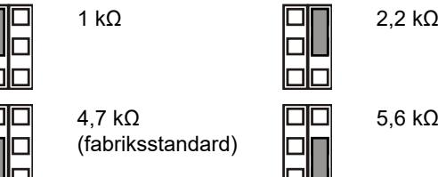

5,6 kΩ

Av: Inget inbyggt EOL-motstånd (brytande relä).

#### **JT: Ställ in inbyggd sabotage EOL-motstånd (Rt)**

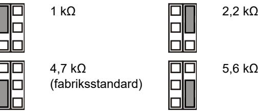

Av: Inget inbyggt EOL- motstånd (brytande relä).

**JF: Inställning felutgång inbyggd EOL-motstånd (Rf)**

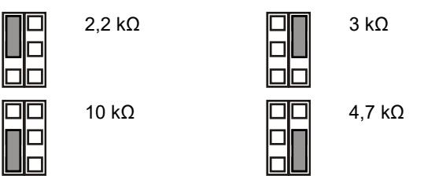

Av: Inget inbyggt EOL-motstånd (brytande relä) (fabriksstandard).

#### **J1 : Ställ in sektion EOL-läge**

- På: Tre motstånd enkel sektion
- Av: Potentialfri felutgång och sektion med två motstånd.

#### **Konfigurera sektionen**

För att konfigurera sektionen, gör på följande sätt.

- Välj lämpliga EOL-motståndsvärden med JA, JT och JF. Till exempel bestämmer inställningen för bygel JT Rtvärdet.
- Ta bort JT och J1 för isolerade utgångar.
- Ta bort byglarna JA och JT för att exkludera inbyggda EOL-värden.
- Ta bort J1 och använd terminal 3 och 6 för inställning av dubbla motstånd.

För en enskild sektion med alla inbyggda resistorer inställda, kan sektionsmotstånd vara följande.

#### **Tabell 2: Värden för sektionsmotstånd**

| Sektionsläge         | Värde    | Standard |  |
|----------------------|----------|----------|--|
| Sabotage (kortslutn) | 0 Ω      | 0 Ω      |  |
| Normalt              | Rt       | 4,7 kΩ   |  |
| Larm                 | Rt+Ra    | 9,4 kΩ   |  |
| Fel                  | Rt+Rf    | 14,7 kΩ  |  |
| AM                   | Rt+Ra+Rf | 19,4 kΩ  |  |
| Sabotage (öppen)     | ∞        | ∞        |  |

### **DIP-omkopplare**

#### **Tabell 3: SW1 allmänna inställningar**

| Switch                  | Värden                                |                                          |
|-------------------------|---------------------------------------|------------------------------------------|
| 6: LED                  | På: LED på*                           | Av: LED frånslagen                       |
| 5: Fjärrkontroll        | På: Fjärrstyrning på                  | Av: Fjärrstyrning av*                    |
| 4: Automatisk fjärrtest | På: Automatisk fjärrtest aktiverad | Av: Automatisk fjärrtest inaktiverad* |
| 3: Polaritet            | På: Positiv polaritet                 | Av: Negativ polaritet*                   |
| 1, 2: Mikrovågs område  | 1 På, 2 På 12 m* 1 Av, 2 På: 9 m   | 1 På, 2 Av 6 m 1 På, 2 Av 4 m         |

* Fabriksinställning

#### **Tabell 4: SW2, AM-inställningar**

| Switch            | Värden                            |                             |
|-------------------|-----------------------------------|-----------------------------|
| 4: AM-signalering | På: AM på fel- och larmreläer* | Av: Endast AM på felrelä |

| Switch              | Värden                                  |                                   |
|---------------------|-----------------------------------------|-----------------------------------|
| 3: Återställa       | På: Automatisk återställning (40 s)* | Av: Auktoriserad återställning |
| 2: AM-känslighet    | På: Avancerad AM känslighet*         | Av: Standard AM känslighet     |
| 1: AM dag-/nattläge | På: Endast AM dagläge*               | Av: AM dag och natt               |

* Fabriksinställning

### **DIP-omkopplare SW 1, allmänna inställningar**

#### **SW1-1, SW1-2: Mikrovågsområde**

Använd SW1-1 och SW1-2 för att ställa in exakt täckningsområde för att passa applikationen. Mikrovågen är av typen range-gating, vilket innebär att områdesbevakningen är mycket precis.

**ON**

**ON**

**1**

**1 2 2**

Fabriksstandard.

#### **SW1-3: Polaritet**

På: Positiv polaritet. Konfigurerar ingångarna (WT och D/N) som "Hög aktivitet".

Av: Negativ polaritet. Konfigurerar ingångarna (WT och D/N) som "Låg aktivitet". Fabriksinställning.

Funktionen förklaras i figur 9.

| Figur 9 |               |     |           |
|---------|---------------|-----|-----------|
| (1)     | Polaritet hög | (3) | Gångtest  |
| (2)     | Polaritet låg | (4) | Dag /natt |

Denna funktion är också beroende av SW1-5-inställningen. Se "SW1-5: Fjärstyringsfunktion" nedan.

**SW1-4: Automatisk fjärrtest** 

På: Automatisk fjärrtest på. Aktiverar automatisk fjärrtest.

Av: Automatisk fjärrtest av. Inaktiverar automatisk fjärrtest (fabriksinställning).

Om den automatiska fjärrtestet är aktiverad kan kontrollpanelen starta detektorn för att utföra ett diagnostiskt test. Detta test aktiveras genom att växla till gångtestläge (dagläge och gångtest aktiverad). Detektorn aktiveras larmreläet om testresultatet är lyckas och felreläet om testresultatet misslyckas. Efter testet kommer detektorn att fortsätter med normal drift.

Denna funktion beror också på SW1-5 inställning. Se "SW1-5: Fjärstyringsfunktion" nedan.

#### **SW1-5: Fjärstyringsfunktion**

På: Fjärrstyrning på. Aktiverar WT- och dag/natt-ingångar.

Av: Fjärrstyrning av. Inaktiverar WT- och dag/natt-ingångar (fabriksstandard).

Följande funktionalitet är beroende av fjärrinställningen.

#### **Tabell 5: Funktioner beroende av fjärrinställningen**

| Objekt | Beskrivning          | SW1-5 Fjärrstyrning på                         | SW1-5 Fjärrstyrning av   |
|--------|----------------------|---------------------------------------------------|-----------------------------|
| SW1-3  | Polaritet            | Valbar                                            | Endast positiv              |
| SW2-1  | AM dag- /nattläge | Valbar                                            | AM dag och natt             |
| SW2-3  | Återställa           | Valbar                                            | Automatisk återställning |
| WT     | WT-ingång            | Inkopplad                                         | Frånkopplad                 |
| D/N    | D/N-ingång           | Inkopplad                                         | Frånkopplad                 |
| Övrigt | Grönt läge           | Aktiverad i dagläge utan WT                    | Frånkopplad                 |
|        | Larmminne            | Aktiverad i dagläge utan WT                    | Frånkopplad                 |
|        | Fjärrtest            | Utförd efter omkoppling till dagläge med WT | Frånkopplad                 |

Se även "Anslutningar" på sidan 50.

#### **SW1-6: LED-lampor**

På: LED-lamporna är aktiverade. Se "LED-lampor och utgångar" på sidan 53 för LED-funktionalitet.

Av: LED-lamporna är inaktiva för alla lägen.

### **DIP-omkopplare SW2, AM-inställningar**

#### **SW2-1: AM dag-/nattläge**

På: Endast AM-dagläge AM-detektering fungerar endast i dagläget (fabriksstandard).

Av: AM dag och natt AM-detektering är alltid aktiv (dag och nattläge)

Denna funktion är också beroende av SW1-5-inställningen. Se "SW1-5: Fjärstyringsfunktion" på sidan 51.

#### **SW2-2: AM-känslighet**

På: Högre AM känslighet (fabriksstandard).

**Obs:** Detta är en EN 50131 Grade 3 rekommenderad konfiguration.

Av: Normal AM känslighet.

#### **SW2-3: Återställ**

På: Automatisk återställning AM-larmstatus kan återställas 40 sekunder efter att AM-larmet har utlöst (fabriksstandard).

Av: Auktoriserad återställning. AM-larmstatus kan endast återställas när WT och dagläge är aktiverat.

#### **OBS!**

- För den avancerade inställningen (SW2-2 är På) behöver orsaken till AM-larmet elimineras innan det är möjligt att utföra AM-återställning.
- Om AM-larmet inte kan återställas med en automatisk återställning ska du koppla från strömförsörjningen och anslut den på nytt.
- Ett gångtest ska genomföras för att säkerställa att detektorn fungerar tillfredställande.

Denna funktion är också beroende av SW1-5-inställningen. Se "SW1-5: Fjärstyringsfunktion" på sidan 51.

#### **SW2-4: AM-larmutgångar**

På: AM till fel och larmreläer. AM-larm signaleras med både larm och felutgångar (fabrikstandard).

**Obs!** Detta är en konfiguration som krävs av EN 50131, grad 3.

Av: Endast AM till felrelä. AM-larm drar endast felutgång.

### **AM-kalibrering**

Under uppstart kalibrerar AM-detektorn sig själv till miljön. Det är viktigt att se till att inga ändringar görs i miljön inom en meters radie från detektorn inom 60 sekunder efter uppstart, i annat fall kan detektorn vara känslig för falska AM-larm och dessa larm kan vara omöjliga att återställa.

### **Inställning av täckningsområdet**

- Ta bort maskskydden (Bild 8, punkt 1) om så krävs. Det modifierade täckningsområdet visas i bild 8, punkt 3 och 7.
**OBS:** Om båda maskskydden är monterade blir detektorns täckningsområdet begränsad till 6 m (default).

- Modifiera täckningsområdet genom att bryta ut maskskydden (visas som grått i Bild 8, punkt 1). Motsvarande ridåer visas i bild 8, punkt 2.
- Sätt på lämpliga klistermärken för respektive spegelridå. Se bild 7, punkt 1 för mer information.

**Varning:** Vid borttagning av klistermärkena kan spegelytan skadas.

- Då det finns föremål nära direkt under detektorn, placera maskningen på insidan av fönstret (standard). Detta inaktiverar den del av ridåerna som ser ner på objektet, vars närhet kan destabilisera detektorn. Se bild 7, punkt 2.
**Obs:** Att minska närsynsfältet uppfyller inte EN 50131 Grade 3 installationer.

### **Självtest**

Detektorn övervakar kontinuerligt PIR-, mikrovågs- och AMkretsar. Fel rapporteras till panelen som tekniska fel.

### **Gångtesta detektorn**

Det finns två metoder för att koppla på gångtestläge.

**SW1-6 inställd på LED på, SW1-5 inställd på fjärrstyrning av**

I detta läge indikerar LED-lampan ständigt (konstant läge för gångtest).

**SW1-6 inställd på LED på, SW1-5 inställd på fjärrstyrning på**

Inställningen aktiverar gångtestets ingång (stift 7) och dag/natt (stift 8). Detta gör det möjligt för användaren att fjärraktivera LED-indikeringen genom att ställa in detektorn på dagläge och aktivera gångtestet.

### **Grönt läge**

När SW1-5 är inställt för fjärrstyrning på stängs mikrovågen av under dagläge (utan WT) för att minska strömförbrukningen. Detektorn arbetar då enbart i PIR-läge.

**OBS!** Dag/natt-ingången måste vara ansluten till centralapparaten för att detta läge ska fungera.

Detta läge uppfyller inte EN 50131-2-4 standard.

**Endast DD1012AM-N:** De första sekunderna i Grönt läge är detektorn inställd för hög IR känslighet för att möjliggöra ytterligare test, till exempel genom att använda en extern värmekälla för att testa mot en betydande minskning av området. Efter 180 sekunder går detektorn tillbaka till standardkänsligheten.

### **Larmminne**

När SW1-5 är inställt på fjärrstyrning på, sparas larm som uppkommer med nattkoppling i detektorminnet. De indikeras med en blinkande röd LED-lampa när enheten kopplas om till dagläge (gångtest inaktiverat). Minnet rensas när detektorn kopplas tillbaka till nattläget.

**OBS!** Ställ in SW1-6 Av för att undvika att visa larmminnet på LED-lamporna. Se "SW1-6: LED-lampor" på sidan 52.

### **LED-lampor och utgångar**

För att aktivera LED-lampornas funktion ska du ställa SW1-6 På, annars är LED-lamporna inaktiva i alla förhållanden. Se "SW1-6: LED-lampor" på sidan 52 för mer information.

**Tabell 6: LED-lampor och utgångar**

| Status              | Röd LED | Gul LED | Larmrelä             | Felrelä | Återställa                       |
|---------------------|------------|------------|----------------------|---------|----------------------------------|
| Start               |            |            | Stängd               | Stängd  | Automatiskt efter 60 sekunder |
| Låg spänning        |            |            | Öppen                | Öppen   | Anslut korrekt spänning       |
| PIR-larm            |            |            | Stängd               | Stängd  |                                  |
| Mikrovågs larm   |            |            | Stängd               | Stängd  |                                  |
| Kombilarm MW/PIR |            |            | Öppen                | Stängd  | Automatiskt efter 3 sekunder  |
| Dubbellarm minne |            |            | Stängd               | Stängd  | Växla till nattläget             |
| AM-larm             |            |            | Beroende av SW2-4 | Öppen   | Beroende av SW2-3             |
| Tekniskt fel        |            |            | Stängd               | Öppen   | Lyckat gångtest                  |

Permanent på Normal blinkning (1 Hz)

### **Specifikationer**

| Detektorteknik     | Dubbel+AM                                           |
|--------------------|-----------------------------------------------------|
| Räckvidd           | 4, 6, 9, 12 meter kan väljas med SW1-1 och SW1-2 |
| Betraktningsvinkel | 78 grader                                           |
| PIR-optik          | Nio HD-spegelridåer                                 |
| Mikrovågsfrekvens  | 5725–5875 MHz                                       |
| Maximal effekt     | 13,46 mW                                            |

| Max. Mikrovågseffekt på 1 meter   | 0,003 μW/cm²                |
|-----------------------------------|-----------------------------|
| Minnesfunktion                    | Ja                          |
| Ingångsspänning                   | 9–15 V (12 V nominal)      |
| Vpp-rippelresistens               | 2 V (vid 12 V)             |
| Uppstartningstid                  | 60 sekunder                 |
| Aktuell strömförbrukning          | 10–22 mA (11 mA nom.)       |
| Monteringshöjd                    | 2,0–2,6 m                   |
| Objektets rörelsehastighet:       |                             |
| DD1012AM-N                        | 0,2–3,0 m/s                 |
| DD1012AM-D-N                      | 0,1–4,0 m/s                 |
| Larm (NC)/sabotagerelä egenskaper | 80 mA 30 V, Form A         |
| Karaktärsdrag för felrelä         | 80 mA 30 V, Form A         |
| Larmtid                           | 3 sekunder                  |
| Drifttemperatur                   | −10 till +55°C              |
| Relativ fuktighet                 | 95 % max., ej kondenserande |
| Vikt                              | 120 g                       |
|                                   |                             |
| Mått (H x B x D)                  | 126 × 63 × 50 mm            |
| IP/IK-klassning                   | IP30 IK04                   |

### **Användarinstruktion**

Informera användaren att inte skärma av detektorns bevakningsområde genom att placera föremål framför detektorn.

### **Information om regler och föreskrifter**

| Tillverkare                            | SLÄPPT PÅ MARKNADEN AV: Carrier Fire & Security Americas Corporation Inc. 13995 Pasteur Blvd Palm Beach Gardens, FL 33418, USA AUKTORISERAD EU-REPRESENTANT: Carrier Fire & Security B.V. Kelvinstraat 7, 6003 DH Weert, Netherlands/Holland                                                                                                                                                                                                                                                                                                 |
|----------------------------------------|-------------------------------------------------------------------------------------------------------------------------------------------------------------------------------------------------------------------------------------------------------------------------------------------------------------------------------------------------------------------------------------------------------------------------------------------------------------------------------------------------------------------------------------------------------------------|
| Produktvarningar och friskrivningar | DESSA PRODUKTER ÄR AVSEDDA FÖR FÖRSÄLJNING TILL OCH INSTALLATION AV BEHÖRIG PERSONAL. CARRIER FIRE & SECURITY KAN INTE GARANTERA ATT EN PERSON ELLER JURIDISK PERSON SOM KÖPER DESS PRODUKTER, INKLUSIVE "KVALIFICERAD FÖRSÄLJARE" ELLER "ÅTERFÖRSÄLJARE", ÄR ORDENTLIGT UTBILDAD ELLER HAR ERFARENHET AV ATT INSTALLERA BRAND- OCH SÄKERHETSRELATERADE PRODUKTER. För mer information om garantifriskrivningar och produktsäkerhet, se https://firesecurityproducts.com/policy/product warning/ eller skanna QR-koden. |
|                                        |                                                                                                                                                                                                                                                                                                                                                                                                                                                                                                                                                                   |
| Certifiering                           | Carrier Fire & Security deklarerar härmed att denna enhet överensstämmer med gällande krav och bestämmelser i alla tillämpliga regler och föreskrifter, inklusive men inte begränsat till direktivet 2014/53/EU. För mer information:                                                                                                                                                                                                                                                                                                                 |

firesecurityproducts.com.

| REACH | Produkten kan innehålla ämnen som finns i Kandidatförteckningen i en koncentration av 0,1% w/w, per den senast listade kandidatförteckningen på ECHA:s webbplats.                                                                                                                   |
|-------|----------------------------------------------------------------------------------------------------------------------------------------------------------------------------------------------------------------------------------------------------------------------------------------------|
|       | Information om säker användning finns på https://firesecurityproducts.com/en/content/intrusi on-intro                                                                                                                                                                                  |
|       | 2012/19/EU (WEEE): Produkter märkta med denna symbol får inte kastas i allmänna sophanteringssytem inom den europeiska unionen. För korrekt återvinning av utrustningen skall den returneras din lokala återförsäljare vid köp av liknande ny utrustning eller lämnas till en |

Produktdokumentation

Använd följande webblänk för att hämta den elektroniska versionen av produktdokumentationen. Den här länken leder dig till EMEAs regionala

se: recyclethis.info

kontaktsida. På den här sidan kan du begära din inloggning till den säkra webbportalen där alla manualer är lagrade. https://firesecurityproducts.com/en/contact

därför avsedd deponering. För mer information,

**Kontaktuppgifter**

firesecurityproducts.com eller www.aritech.com

# **Certification**

#### **EN**

Cert. no.: 222350048/AA/00 Product: DD1012AM-N Standard: EN 50131-2-4:2020 Tested and certified by: Telefication B.V. Security Grade 3, Environmental class II

#### **VdS**

VdS Anerkennung G122029 Produkt: DD1012AM-D-N

Geprüft und zertifiziert durch VdS nach VdS2312:2010

Tested and Certified by VdS according to VdS2312:2010

Sicherheitsklasse C nach VdS2312 und Umweltklasse II nach VdS2110

Safety class C according to VdS2312 and environmental class II according to VdS2110

**NF & A2P**

Cert. no.: 2831100023B0 Produit: DD1012AM-N Norme: EN 50131-2-4, RTC50131-2-4, N 324 H58 Testé et certifié: Telefication B.V. Grade de sécurité 3, Classe d'environnement II

Autoprotection à l'ouverture / arrachement : oui / oui

Immunité à un champ magnétique : oui (aimant type 2, EN 50131-2-4)

Certifié suivant les référentiels : -EN 50131-2-4 -RTC50131-2-4 -N 324 H58 CNPP Cert AFNOR Certification www.cnpp.com www.afnor.org

#### **Remarques importantes**

- La certification NFA2P ne couvre pas l'utilisation de rotule de fixation telle que la SB01.

- Afin que le détecteur conserve sa certification NFA2P, il n'est pa autorisé qu'il soit en mode IRP seul lorsque le système est armé. Couverture de détection suivant la norme Européenne :

**IMQ**

Cert. no.: pending Prodotto: DD1012AM-D-N Norma: EN 50131-2-4:2020 Testato e certificato da: VdS Grado di sicurezza 3, Classe ambientale II

#### **INCERT**

Cert. no.: C-001-1633 Product: DD1012AM-N Standard: T031+A1:2018 Issued by: Telefication B.V. Security Grade 3, Environmental class II

**SBSC**

Cert. no.: pending Produkt: DD1012AM-N Standard: SSF 1014 Testad och certifierad av: SBSC Säkerhetsklass 3, Miljöklass II

