# DD1012-N and DD1012PI-N Dual Detector Installation Sheet

**EN DA DE ES FR IT NL PL PT SV**

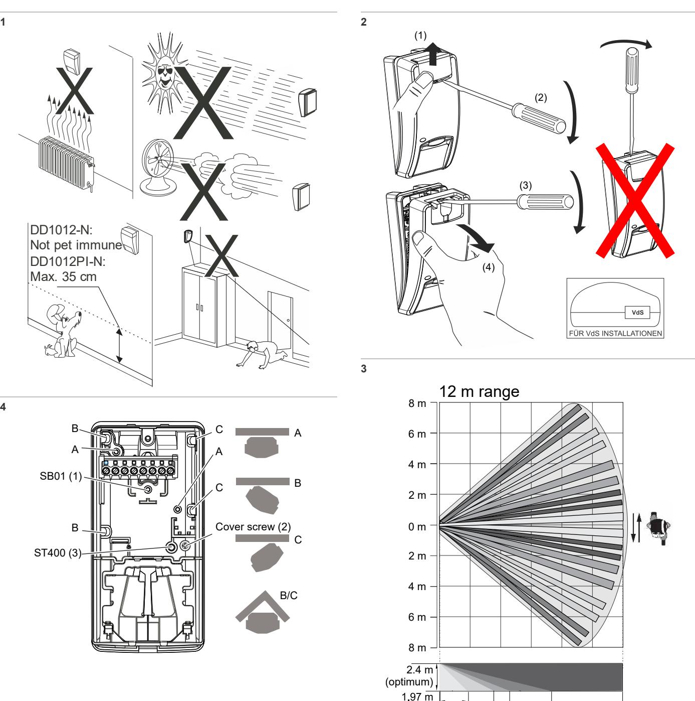

12.0 m

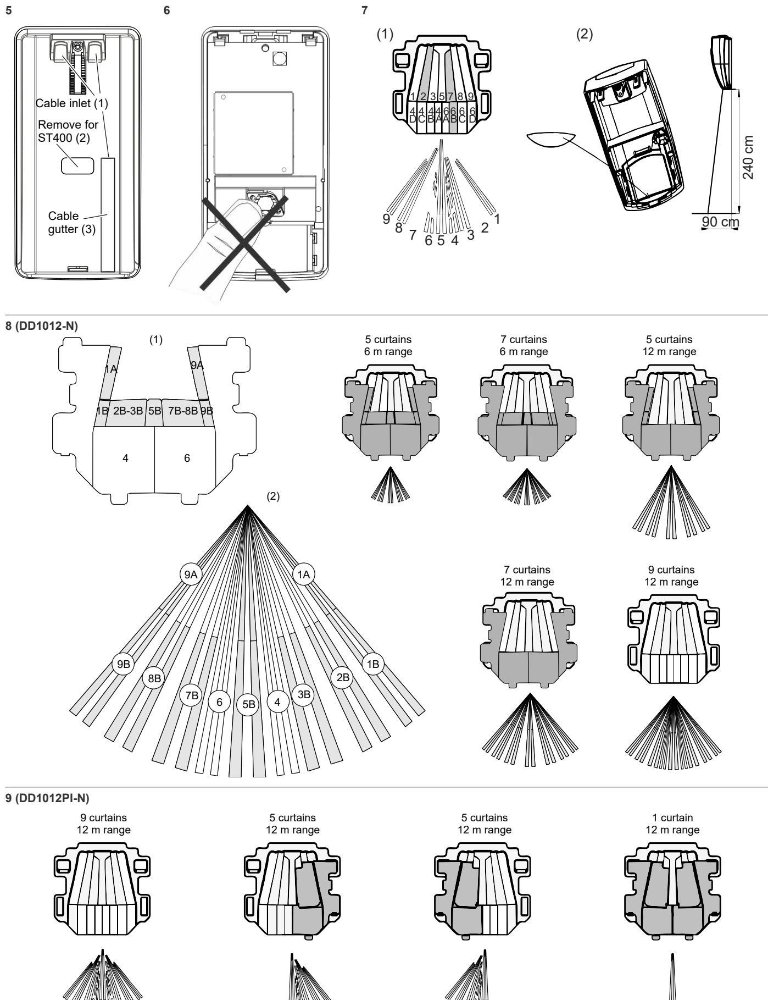

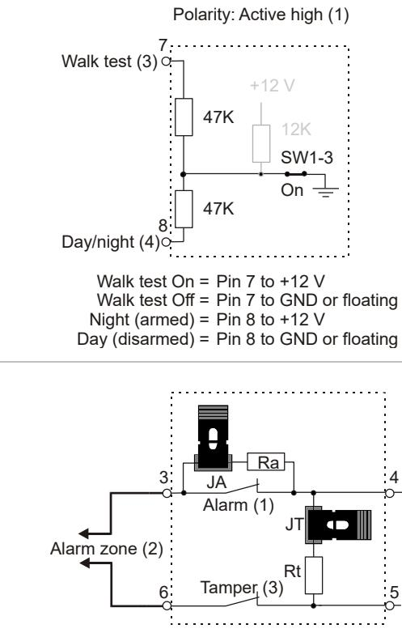

**13**

**11**

**14**

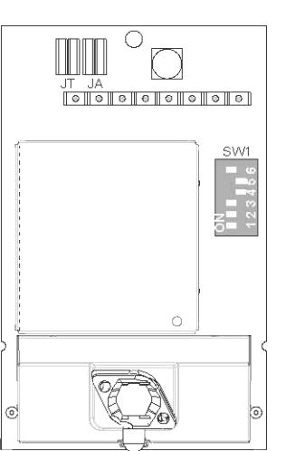

#### **15**

#### **Single zone EOL**

| Zone state     | Value | Default |
|----------------|-------|---------|
| Tamper (short) | 0 Ω   | 0 Ω     |
| Normal         | Rt    | 4.7 kΩ  |
| Alarm          | Rt+Ra | 9.4 kΩ  |
| Tamper (open)  | ∞     | ∞       |

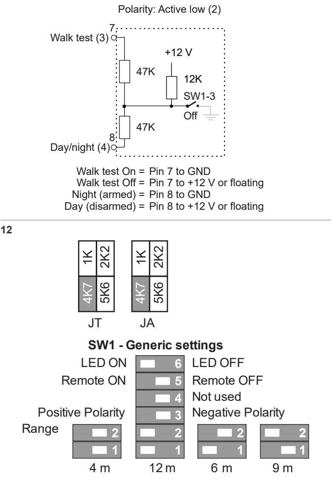

### **EN: Installation Sheet**

### **Description**

DD1012-N and DD1012PI-N are dual motion sensors. They combine the patented PIR mirror optics technology with the patented Range Controlled Radar technology.

The DD1012PI-N is designed to be immune up to certain size and build of pets. Pets up to 18 kg (about 35 cm height) normally do not cause any problems in standard application unless they are able to move higher than 35 cm from the floor in the detection field of view.

### **Installation guidelines**

#### See Figure 1.

The detector is intended to be mounted on walls but can also be mounted on ceilings by using a mounting bracket.

Use the following guidelines to determine the best location to install the detector.

- Mount the detector so the expected movement of an intruder is across the detection pattern (see Figure 3).
- Mount the detector at a stable surface. For the allowed mounting height, see "Specifications" on page 6.
- Do not mount the detector within 0.5 m of metallic objects or within 1.5 m of fluorescent lights.
- Do not place objects in front of the detector that may prevent a clear line of sight.
- Place detectors at least 6 m apart, and use the shortrange setting to avoid interference, when mounting detectors face to face.

The dual technology processing of this detector is very resistant to false alarm hazards. However, avoid potential causes of instability, such as:

PIR hazards:

- Direct sunlight on the detector
- Heat sources within the detector field of view
- Strong air draughts onto the detector
- Animals in the field of view (DD1012-N detectors)
- Obscuring the detector field of view with large objects, such as furniture

Microwave hazards:

- Mounting surface susceptible to vibrations
- Metal surfaces reflecting microwave energy
- Water movement through plastic pipes
- Moving or vibrating objects like fans, heating or airconditioning ducts

**WARNING!** The equipment is not earthed. Any external circuit connected to the equipment must be located within the same building and connected to a protective earthing conductor.

Wire insulation of cables connected to the equipment must conform to IEC 60332-1-2 and IEC 60332-1-3 or IEC 60332- 2-2, depending on the wire cross sectional area, or IEC TS 60695-11-21, regardless of cross sectional area. Alternatively, such wires must comply with UL 2556 VW-1.

The detector power supply source must be power limited at 15 W.

We recommend that the detector is regularly walk tested and checked at the control panel.

#### **To install the detector:**

- 1. Lift off the custom insert (see Figure 2, items 1 and 2).
- 2. Using a screwdriver, carefully prise open the detector (see Figure 2, items 3 and 4).

**Caution:** Do not touch the pyroelectric sensor (Figure 6).

- 3. Take out the cover screw (Figure 4, item 2).
- 4. Fix the detector base to the wall. For the allowed mounting height, see "Specifications" on page 6.

See Figure 4.

- For flat mounting, use a minimum of two screws (DIN 7998) in positions A.

- For corner mounting, use screws in position B or C.

- To install the pry-off tamper ST400, use mounting positions A. ST400 mounting position is shown as item 3 in Figure 4. Open the outlet in the back plate (Figure 5, item 2).

- 5. Wire the detector (see Figures 4 and 13). Use back plate cable inlets (Figure 5, item 1) and cable gutter (Figure 5, item 3).
- 6. Select the desired jumper and DIP switch settings. See "Setting the detector" below for more information.
- 7. Remove the blinders and add the stickers, if required. See "Configuring the coverage pattern" on page 5 for more details.
- 8. For ceiling-mount applications, use the SB01 swivel-mount bracket. SB01 mounting position is shown as item 1 in Figure 4.
- 9. Close the cover, insert the cover screw, and place the custom insert.

### **Connections**

See Figure 13.

| Terminal | Label     | Explanation                                                                                                                                                                                                                                                   |  |
|----------|-----------|---------------------------------------------------------------------------------------------------------------------------------------------------------------------------------------------------------------------------------------------------------------|--|
| 1, 2     | GND, +12V | Power supply connection (9 to 15 V, 12 V nominal)                                                                                                                                                                                                        |  |
| 3, 4     | ALARM     | Alarm relay output (33 Ω). Use jumper JA to set the onboard EOL resistor in series with the relay. See "Jumpers" below.                                                                                                                                 |  |
| 5, 6     | TAMPER    | Tamper switch output (0 Ω). Use jumper JT to set the onboard EOL resistor in series with the switch. See "Jumpers" below.                                                                                                                               |  |
| 7        | Walk test | This input enables and disables the LED (walk test On/Off). Walk test mode can only be entered when detector is in Day mode (pin 8). Active high or low is determined by SW1-3 (see "SW1-3: Polarity" on page 5).                                 |  |
| 8        | Day/Night | This input switches the detector in day (show memory on the LED indicator) or night mode (activates the alarm memory and clears previous stored alarms). Active high or low polarity is determined by SW1-3 (see "SW1-3: Polarity" on page 5). |  |

#### **Notes**

- Inputs 7 and 8 are only useable when SW1-5 is set to Remote on. See "SW1-5: Remote functionality" on page 5. • The LED is only enabled when SW1-6 is set to LED on.
Figure 11 explains how to create a single zone with multiple resistor configuration.

#### **Figure 11**

- (1) Alarm relay
- Ra Alarm EOL resistor
- (2) Alarm zone
- Rt Tamper EOL resistor
- (3) Tamper switch output

### **Setting the detector**

See Figure 14 for jumpers and DIP switch location.

### **Jumpers**

Jumpers set onboard EOL mode and value. The circuit is shown in Figure 11.

1 kΩ 2.2 kΩ

### **JA: Set onboard alarm EOL resistor (Ra)**

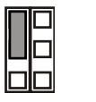

4.7 kΩ (factory default)

5.6 kΩ

Off: No onboard alarm EOL.

#### **JT: Set onboard tamper EOL resistor (Rt)**

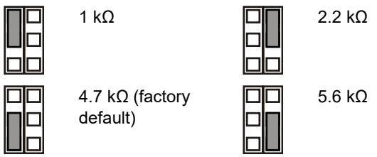

Off: No onboard tamper EOL.

#### **Configuring the zone**

To set up the zone, apply the following guidelines.

- Select appropriate EOL resistor values with JA and JT. For example, setting of jumper JT determines Rt value.
- For isolated outputs remove JT. • Remove jumpers JA and JT to exclude onboard EOL values.

For a single zone with all onboard resistors set, the zone resistance can be the following.

#### **Table 2: Zone resistance values**

| Zone state     | Value | Default |  |
|----------------|-------|---------|--|
| Tamper (short) | 0 Ω   | 0 Ω     |  |
| Normal         | Rt    | 4.7 kΩ  |  |
| Alarm          | Rt+Ra | 9.4 kΩ  |  |
| Tamper (open)  | ∞     | ∞       |  |

### **DIP switches**

#### **Table 3: SW1, general settings**

| Switch      | Values                |                         |
|-------------|-----------------------|-------------------------|
| 6: LED      | On: LED on*           | Off: LED off            |
| 5: Remote   | On: Remote on         | Off: Remote off*        |
| 4: Reserved |                       |                         |
| 3: Polarity | On: Positive polarity | Off: Negative polarity* |
| 1, 2: Radar | 1 On, 2 On: 12 m*     | 1 On, 2 Off: 6 m        |
| range       | 1 Off, 2 On: 9 m      | 1 Off, 2 Off: 4 m       |

* Factory default

### **DIP switch SW1**

#### **SW1-1, SW1-2: Radar range**

Use SW1-1 and SW1-2 to set the radar range exactly to fit the application. The radar is of a range-gating type which means that the range of detection is very accurate.

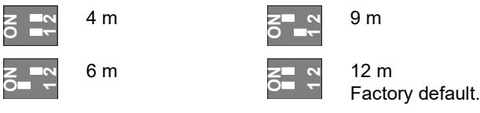

**SW1-3: Polarity**

On: Positive polarity. Configures the inputs (WT and D/N) as "Active high".

Off: Negative polarity. Configures the inputs (WT and D/N) as "Active low". Factory default.

The functionality is explained in Figure 10.

| Figure 10 |  |
|-----------|--|
|           |  |

| (1) | Polarity high | (3) | Walk test |
|-----|---------------|-----|-----------|
| (2) | Polarity low  | (4) | Day/night |

This function also depends on the SW1-5 setting. See "SW1-5: Remote functionality" below.

#### **SW1-4: Reserved**

Do not change.

#### **SW1-5: Remote functionality**

On: Remote on. Enables WT and day/night inputs.

Off: Remote off. Disables WT and day/night inputs (factory default).

The following functionality depends on the Remote setting.

#### **Table 4: Functions dependent on the Remote setting**

| Item  | Description  | SW1-5 Remote on                   | SW1-5 Remote off |
|-------|--------------|-----------------------------------|------------------|
| SW1-3 | Polarity     | Selectable                        | Positive only    |
| WT    | WT input     | Enabled                           | Disabled         |
| D/N   | D/N input    | Enabled                           | Disabled         |
| Other | Green Mode   | Enabled in day mode with no WT | Disabled         |
|       | Alarm memory | Enabled in day mode with no WT | Disabled         |

See also "Connections" on page 4.

#### **SW1-6: LEDs**

On: LEDs are enabled. See "LEDs and outputs" on page 6 for LED functionality.

Off: LEDs are disabled for any state.

### **Configuring the coverage pattern**

- Remove blinders (Figures 8 and 9) if necessary. The modified pattern is shown below blinder configuration.
**Note:** If both blinders are installed in DD1012-N, the detector range is limited to 6 m (default) .

- In case of DD1012-N, modify the pattern by breaking out blinder parts (shown as gray in Figure 8, item 1). The corresponding curtain fragments are shown in Figure 8, item 2.
- Put the appropriate mirror stickers if necessary. See Figure 7, item 1 for details.

**Caution:** Removing stickers can damage the mirror surface.

- When near objects directly under the detector, fit the mask to the inside of the window (default). This disables the part of the curtains looking down at the object, whose
closeness might destabilize the detector. See Figure 7, item 2.

### **Walk testing the detector**

There are two ways for switching on the walk test mode.

#### **SW1-6 set to LED on, SW1-5 set to Remote off**

In this mode the LED indication is always enabled (constant walk test mode).

#### **SW1-6 set to LED on, SW1-5 set to Remote on**

This setting enables the walk test input (pin 7) and the day/night input (pin 8). This allows the user to activate LED indication remotely by setting the detector into the day mode and activate the walk test.

### **Green mode**

When SW1-5 is set to Remote on, the radar is switched off during the day mode (with no WT) to reduce current consumption. The detector is then operating in PIR only mode.

**Note:** The Day/night line must be connected to the control panel for this mode to work.

This mode is not compliant with the EN 50131-2-4 standard.

### **Alarm memory**

When SW1-5 is set to Remote on, alarms that occurred during the night mode are stored in the detector memory. They are indicated by flashing red LED when the unit switches to day mode (walk test disabled). The memory is cleared when the detector switches back to the night mode.

**Note:** Set SW1-6 to Off to prevent showing the alarm memory on the LEDs. See "SW1-6: LEDs" on page 5.

### **LEDs and outputs**

To enable LEDs functionality, set SW1-6 to On, otherwise LEDs are disabled in any condition. See "SW1-6: LEDs" on page 5 for more details.

#### **Table 5: LEDs and outputs**

| Status                        | Red LED             | Alarm relay | To reset                 |
|-------------------------------|------------------------|----------------|--------------------------|
| Start up                      |                        | Closed         | Automatically after 60 s |
| Low voltage                   |                        | Open           | Apply correct voltage    |
| PIR intruder alarm            |                        | Closed         |                          |
| Microwave intruder alarm   |                        | Closed         |                          |
| Dual motion intruder alarm |                        | Open           | Automatically after 3 s  |
| Dual Alarm Memory             |                        | Closed         | Switch to the night mode |
| Continuously on               | Normal blinking (1 Hz) |                |                          |

### **Specifications**

| Detector technology: |                  |
|----------------------|------------------|
| DD1012-N             | Dual             |
| DD1012PI-N           | Dual, pet immune |

| Range                                       | 4, 6, 9, 12 m selectable via SW1-1 and SW1-2 |
|---------------------------------------------|-------------------------------------------------|
| Viewing angle                               | 78 degrees                                      |
| PIR optics                                  | 9 high-density mirror curtains                  |
| Microwave frequency                         | 5725 to 5875 MHz                                |
| Maximum power output                        | 13.46 mW                                        |
| Max microwave output at 1 m                 | 0.003 μW/cm²                                    |
| Memory function                             | Yes                                             |
| Input power                                 | 9 to 15 V (12 V nominal)                       |
| Peak-to-peak ripple immunity                | 2 V (at 12 V)                                  |
| Detector start-up time                      | 60 s                                            |
| Current consumption                         | 5 to 17 mA (9 mA nom.)                          |
| Mounting height:                            |                                                 |
| DD1012-N                                    | 1.8 to 2.6 m                                    |
| DD1012PI-N                                  | 2.3 to 2.6 m                                    |
| Target speed range                          | 0.2 to 3.0 m/s                                  |
| Alarm (NC) / Tamper relay characteristic | 80 mA 30 V, Form A                             |
| Alarm time                                  | 3 s                                             |
| Operating temperature                       | −10 to +55°C                                    |
| Relative humidity                           | 95% max., noncondensing                         |
| Weight                                      | 120 g                                           |
| Dimensions (H x W x D)                      | 126 × 63 × 50 mm                                |
| IP/IK rating                                | IP30 IK04                                       |
| Pry-off tamper                              | Optional (ST400)                                |

### **Regulatory information**

| Manufacturer                        | PLACED ON THE MARKET BY: Carrier Fire & Security Americas Corporation Inc. 13995 Pasteur Blvd Palm Beach Gardens, FL 33418, USA AUTHORIZED EU REPRESENTATIVE: Carrier Fire & Security B.V. Kelvinstraat 7, 6003 DH Weert, Netherlands                                                                                                                                                                                                                                                                                                         |
|-------------------------------------|-----------------------------------------------------------------------------------------------------------------------------------------------------------------------------------------------------------------------------------------------------------------------------------------------------------------------------------------------------------------------------------------------------------------------------------------------------------------------------------------------------------------------------------------------------------------|
| Product warnings and disclaimers | THESE PRODUCTS ARE INTENDED FOR SALE TO AND INSTALLATION BY QUALIFIED PROFESSIONALS. CARRIER FIRE & SECURITY CANNOT PROVIDE ANY ASSURANCE THAT ANY PERSON OR ENTITY BUYING ITS PRODUCTS, INCLUDING ANY "AUTHORIZED DEALER" OR "AUTHORIZED RESELLER", IS PROPERLY TRAINED OR EXPERIENCED TO CORRECTLY INSTALL FIRE AND SECURITY RELATED PRODUCTS. For more information on warranty disclaimers and product safety information, please check https://firesecurityproducts.com/policy/product warning/ or scan the QR code. |
|                                     |                                                                                                                                                                                                                                                                                                                                                                                                                                                                                                                                                                 |

Carrier Fire & Security hereby declares that this device is in compliance with the applicable requirements and provisions of all applicable rules and regulations, including but not limited to the Directive 2014/53/EU. For more information see: www.firesecurityproducts.com

| REACH                    | Product may contain substances that are also Candidate List substances in a concentration above 0.1% w/w, per the most recently published Candidate List found at ECHA Web site.                                                                                                                                                                                    |
|--------------------------|------------------------------------------------------------------------------------------------------------------------------------------------------------------------------------------------------------------------------------------------------------------------------------------------------------------------------------------------------------------------------|
|                          | Safe use information can be found at https://firesecurityproducts.com/en/content/intrusi on-intro                                                                                                                                                                                                                                                                      |
|                          | 2012/19/EU (WEEE directive): Products marked with this symbol cannot be disposed of as unsorted municipal waste in the European Union. For proper recycling, return this product to your local supplier upon the purchase of equivalent new equipment, or dispose of it at designated collection points. For more information see: www.recyclethis.info |
| Product documentation | Please consult the following web link to retrieve the electronic version of the product documentation. This link will guide you to the EMEA regional contact page. On this page you can request your login to the secured web portal where all manuals are stored.                                                                                         |

https://firesecurityproducts.com/en/contact

### **Contact information**

www.firesecurityproducts.com or www.aritech.com

## **DA: Installationsvejledning**

### **Beskrivelse**

DD1012-N og DD1012PI-N er kombi detektorer. De omfatter den patentbeskyttede PIR-spejloptikteknologi med den patentbeskyttede Range Controlled Radar-teknologi.

DD1012PI-N er designet til at ignorere en given størrelse og bygning af kæledyr. Kæledyr op til 18 kg (ca 35 cm høje) giver normalt ikke problemer ved standardanvendelse, medmindre de kan bevæge sig over 35 cm fra gulvet i detektorens synsfelt.

### **Installationsvejledning**

#### Se figur 1.

Detektoren er beregnet til vægophæng men kan også monteres i loftet med et monteringsbeslag.

Følg denne vejledning til at fastlægge den bedste placering til installation af detektoren.

- Monter detektoren så den forventede bevægelse ved et indbrud er på tværs af detektionsmønstret (se figur 3).
- Monter detektoren på en stabil overflade. For den tilladte monterings højde, se "Specifikationer" på side 9.
- Monter ikke detektoren på en afstand af 0,5 m fra metalgenstande eller 1,5 m fra lysstofarmaturer.
- Placer ikke en genstand foran detektoren, som kan forhindre en direkte synslinje.
- Placer detektorerne mindst 6 m fra hinanden og juster afstanden på enheden, således at man undgår interferens ved montering af detektorerne rettet mod hinanden.

Detektorteknologien beskytter effektivt mod falske alarmer. Undgå imidlertid mulige årsager til ustabilitet, f.eks.:

#### PIR-fare:

- Direkte sollys på detektoren
- Varmekilder inden for detektorens synsfelt
- Kraftig træk på detektoren
- Dyr i synsfeltet (DD1012-N detektorer)
- Blokering af detektorens synsfelt med store genstande som f.eks. møbler

#### Mikrobølgefare:

- Monteringsoverflade modtagelig for rystelser
- Metaloverflader reflekterer mikrobølgeenergi
- Vandbevægelse gennem plastikrør
- Bevægelige eller vibrerende dele som blæsere, varmeeller airconditionkanaler

**ADVARSEL!** Udstyret er ikke jordet. Ethvert ekstern kredsløb, der er tilsluttet udstyreret, skal være placeret i den samme bygning og tilsluttes en beskyttende jordleder.

Trådisolering af kabler, der er tilsluttet udstyret, skal være i overensstemmelse med IEC 60332-1-2 og IEC 60332-1-3 eller IEC 60332-2-2, afhængig af ledningens tværsnit, eller IEC TS 60695-11-21, uanset af tværsnitsarealet. Alternativ skal sådanne ledninger være i overensstemmelse med UL 2556 VW-1.

Strømforsyning til detektoren skal være begrænset til 15 W.

Vi anbefaler, at alarmen gangtestes med jævne mellemrum, og at kommunikationen med kontrolpanelet kontrolleres.

**Sådan installeres detektoren:**

- 1. Tag dækpladen af (se figur 2, pkt. 1 og 2).
- 2. Åbn forsigtigt detektoren med en skruetrækker (se figur 2, pkt. 3 og 4).

**Bemærk:** Rør ikke den pyroelektriske føler (figur 5).

- 3. Tag dækskruen ud (figur 4, pkt. 2).
- 4. Gør soklen fast til væggen. For den tilladte monterings højde, se "Specifikationer" på side 9.

Se figur 4.

- Ved flad montering bruges mindst to skruer (DIN 7998) i position A.

- Ved hjørnemontering bruges skruer i position B eller C.
- For installation af vægsabotagekontakt ST400 bruges monteringsposition A. ST400-monteringsposition vises som pkt. 3 i figur 4. Åbn kontakten i bagpladen (figur 5, pkt. 2).

- 5. Tilslut detektoren (se figur 4 og 13). Brug bagpladens ledningsindgange (figur 5, pkt. 1) og kabelrende (figur 5, pkt. 3).
- 6. Vælg de ønskede indstillinger for jumper og DIP-switch (se "Indstilling af detektoren" på side 8 for mere information).
- 7. Fjern afdækningspladerne foran spejlet og indsæt afdækningslabel, hvis dette kræves. Se "Indstilling af dækningsmønster" på side 9 for flere detaljer.
- 8. Til loftmontering anvendes SB01-svingmonteringskonsol. SB01-monteringspositionen vises som pkt. 1 i figur 3.
- 9. Luk detektoren, indsæt dækskrue og indsæt dækpladen.

### **Tilslutninger**

Se figur 13.

#### **Tabel 1: Detektortilslutninger**

| Terminal | Etiket       | Forklaring                                                                                                                                                                                                                                                        |
|----------|--------------|-------------------------------------------------------------------------------------------------------------------------------------------------------------------------------------------------------------------------------------------------------------------|
| 1, 2     | GND, +12V | Strømforsyningstilslutning (9 til 15 VDC, 12 VDC nominel)                                                                                                                                                                                                      |
| 3, 4     | ALARM        | Alarmrelæudgang (33 Ω). Brug jumper JA til at sætte den indbyggede EOL-modstand i serie med relæet. Se "Jumpere" nedenfor.                                                                                                                                  |
| 5, 6     | TAMPER       | Sabotagekontaktudgang (0 Ω). Brug jumper JT til at sætte den indbyggede EOL-modstand i serie med kontakten. Se "Jumpere" nedenfor.                                                                                                                          |
| 7        | Gangtest     | Denne indgang aktiverer og deaktiverer LED (gangtest til/fra). Gangtestfunktionen kan kun vælges, når detektoren er i dagtilstand (pin 8). Aktiv høj eller lav fastsættes af SW1-3 (se "SW1-3: Polaritet" nedenfor).                                  |
| 8        | Dag/nat      | Det indstiller detektoren til dagtilstand (vis hukommelse på LED-indikator) eller nattilstand (aktiverer alarmhukommelsen og sletter tidligere gemte alarmer). Aktiv høj eller lav polaritet fastsættes af SW1-3 (se "SW1-3: Polaritet" nedenfor). |

#### **Noter**

- Indgang 7 og 8 kan kun anvendes, når SW1-5 indstilles til Ekstern til. Se "SW1-5: Ekstern funktion" på side 9.
- LED aktiveres kun, når SW1-6 indstilles til LED til.

Figur 11 forklarer, hvordan man opretter en enkelt zone med individuel indstilling af modstandene.

|            | Figur 11               |          |                                             |
|------------|------------------------|----------|---------------------------------------------|
| (1) (2) | Alarmrelæ Alarmzone | Ra Rt | Alarm EOL-modstand Sabotage EOL-modstand |
| (3)        | Sabotagekontaktudgang  |          |                                             |

### **Indstilling af detektoren**

Se figur 14 om placering af jumpere og DIP-kontakt.

### **Jumpere**

Jumpere, indstilling af indbyggede EOL, tilstand og værdi. Kredsløbet vises i figur 11.

#### **JA: Indstil indbygget alarm EOL-modstand (Ra)**

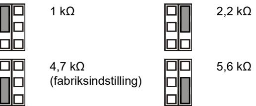

OFF: Ingen indbygget alarm EOL.

#### **JT: Indstil indbygget sabotage EOL-modstand (Rt)**

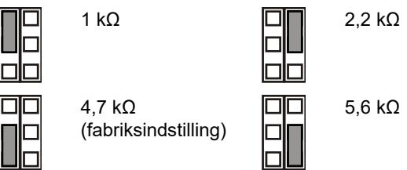

OFF: Ingen indbygget sabotage EOL.

#### **Zonekonfiguration**

Du kan indstille zonen ved hjælp af følgende retningslinjer.

- Vælg den relevante EOL modstandsværdi med JA og JT. Eksempelvis indstilling af jumper JT fastsætter Rtværdien.
- Ved isolering af udgange fjernes JT.
- Fjern jumpere JA og JT for at afbryde forbindelsen til de indbyggede EOL-modstande.

For en enkelt zone med indbyggede modstande kan zonemodstanden være følgende.

#### **Tabel 2: Zonemodstandsværdier**

| Zonetilstand    | Værdi | Fabriksindstilling |
|-----------------|-------|--------------------|
| Sabotage (kort) | 0 Ω   | 0 Ω                |
| Normal          | Rt    | 4,7 kΩ             |
| Alarm           | Rt+Ra | 9,4 kΩ             |
| Sabotage (åben) | ∞     | ∞                  |
|                 |       |                    |

### **DIP-kontakter**

#### **Tabel 3: SW1, generelle indstillinger**

| Kontakt               | Værdier               |                         |
|-----------------------|-----------------------|-------------------------|
| 6: Lydsdiode          | ON: Lysdioder til*    | OFF: Lydsdiode slukket  |
| 5: Eksternt           | ON: Ekstern til       | OFF: Ekstern fra*       |
| 4: Reserveret         |                       |                         |
| 3: Polaritet          | ON: Positiv polaritet | OFF: Negativ polaritet* |
| 1, 2: Radarrækkevidde | 1 til, 2 til: 12 m*   | 1 til, 2 fra: 6 m       |
|                       | 1 fra, 2 til: 9 m     | 1 til, 2 fra: 4 m       |

* Fabriksindstilling

### **DIP-kontakt SW1**

#### **SW1-1, SW1-2: Radarrækkevidde**

Brug SW1-1 og SW1-2 til at indstille radarrækkevidden, så den passer til formålet. Radarens dækningsområde er meget præcis.

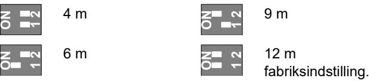

#### **SW1-3: Polaritet**

ON: Positiv polaritet. Konfigurerer indgang (WT og D/N) som "aktiv høj".

OFF: Negativ polaritet. Konfigurerer indgang (WT og D/N) som "aktiv lav". Fabriksindstilling.

Funktionen forklares i figur 10.

#### **Figur 10 symbolforklaring**

- (1) Polaritet høj (2) Polaritet lav
- (3) Gangtest (4) Dag/nat

Funktionen afhænger også af indstillingen af SW1-5. Se "SW1- 5: Ekstern funktion" nedenfor.

#### **SW1-4: Reserveret**

Må ikke ændres (Off = fabriksindstilling).

#### **SW1-5: Ekstern funktion**

ON: Ekstern til. Aktiverer WT og dag/nat.

OFF: Ekstern fra. Deaktiverer WT og dag/nat-indgang (fabriksindstilling).

Følgende funktion afhænger af ekstern indstilling.

#### **Tabel 4: Funktion afhænger af ekstern indstilling**

| Punkt | Beskrivelse     | SW1-5 Ekstern til                  | SW1-5 Ekstern fra |
|-------|-----------------|------------------------------------|-------------------|
| SW1-3 | Polaritet       | Valgbar                            | Kun positiv       |
| WT    | WT indgang      | Tilkoblet                          | Frakoblet         |
| D/N   | D/N-indgang     | Tilkoblet                          | Frakoblet         |
| Andet | Grøn tilstand   | Aktiveret i dagtilstand uden WT | Frakoblet         |
|       | Alarm hukom. | Aktiveret i dagtilstand uden WT | Frakoblet         |

Se også "Tilslutninger" på side 8.

#### **SW1-6: Lysdioder**

ON: LED er aktiveret. Se "Lysdioder og udgange" nedenfor for LED-funktioner.

OFF: Lysdioder er deaktiverede for enhver tilstand.

### **Indstilling af dækningsmønster**

- Fjern afdækning (Figurer 8 og 9) hvis nødvendig. Dækningsområdet er vis under afdæknings konfigurationen.
**Bemærk:** Hvis begge afdækninger er installeret i DD1012- N, vil detektorens rækkevide være begrænset til 6 m (standard).

- Ved DD1012-N, ændring af dækningsområde ved fjerne atdæknings dele (vist som grå i figur 8, punkt 1). Det tilsvarende gardin er vist i figur 8, punkt 2.
- Indsæt nu de aktuelle afdækningslabels, hvis dette ønskes. Se figur 7, punkt 1 for yderligere detaljer.

**Husk:** Ved fjernelse af afdækningslabels kan spejlets overflade ødelægges.

- Når emner (reoler o.a) som er placeret direkte under detektoren, placeres afdækningspladen inde i detektoren (fabriksindstilling). Dette afskærmer den del af spejlet som kigger direkte ned under detektoren. Emner der er i direkte nærhed under detektoren, kan medføre utilsigtede alarmer. Se figur 7, punkt 2.
### **Gangtest af detektoren**

Der er to måder til at aktivere gangtestfunktionen på.

**SW1-6 indstilles til LED til, SW1-5 indstilles til Ekstern fra**

I denne tilstand er LED-angivelsen altid aktiveret (konstant gangtesttilstand).

**SW1-6 indstilles til LED til, SW1-5 indstilles til Ekstern til**

Denne indstilling aktiverer gangtestindgangen (pin 7) og dag/nat-indgang (pin 8). Så kan brugeren aktivere LEDangivelse på afstand ved at indstille detektoren til dagtilstand og aktivere gangtesten.

### **Grøn tilstand**

Når SW1-5 indstilles til Ekstern til, så slukkes radaren i dagstilstand (uden WT) for at reducere strømforbruget. Detektoren kører så kun i PIR-tilstand.

**Note:** Dag/nat-forbindelsen skal tilsluttes kontrolpanelet for, at funktionen virker.

Denne tilstand er ikke kompatibel med EN 50131-2-4 standard.

#### **Alarm hukommelse**

Når SW1-5 indstilles til Ekstern til, gemmes en alarm, som opstår om natten, i detektorens hukommelse. De angives med blinkende rød lysdiode, når enheden skifter til dagtilstand (gangtest deaktiveret). Hukommelsen slettes, når detektoren skifter til nattilstand.

**Note:** Indstil SW1-6 til Fra for at forhindre, at alarmhukommelsen vises på LED. Se "SW1-6: Lysdioder" ovenfor.

### **Lysdioder og udgange**

LED-funktionen aktiveres ved at indstille SW1-6 til Til, eller er LED deaktiveret i en given tilstand. Se "SW1-6: Lysdioder" ovenfor for flere detaljer.

#### **Tabel 5: Lysdioder og udgange**

| Status                      | Rød lys diode | Alarm relæ | Afstilling               |
|-----------------------------|------------------|---------------|--------------------------|
| Start                       |                  | Lukket        | Automatisk efter 60 sek. |
| Lav spænding                |                  | Åben          | Tilfør korrekt spænding  |
| PIR-indbrudsalarm           |                  | Lukket        |                          |
| Mikrobølge indbrudsalarm |                  | Lukket        |                          |
| Kombiindbrudsalarm          |                  | Åben          | Automatisk efter 3 sek.  |
| Dobbel alarm hukommelse  |                  | Lukket        | Skift til nattilstand    |
|                             |                  |               |                          |

Løbende TIL Normal blink (1 Hz)

### **Specifikationer**

| Detektorteknologi: |                                         |  |
|--------------------|-----------------------------------------|--|
| DD1012             | Kombi                                   |  |
| DD1012PI-N         | Kombi, ignorerer kæledyr                |  |
| Rækkevidde         | 4, 6, 9, 12 m vælges via SW1-1 og SW1-2 |  |
| Visningsvinkel     | 78 grader                               |  |

| PIR-optik                               | 9 spejlgardiner med høj densitet |  |
|-----------------------------------------|----------------------------------|--|
| Mikrobølgefrekvens                      | 5725–5875 MHz                    |  |
| Maksimal udgangs effekt                 | 13,46 mW                         |  |
| Maks. mikrobølge ved 1 m                | 0,003 μW/cm²                     |  |
| Hukommelsesfunktion                     | Ja                               |  |
| Indgangseffekt                          | 9 til 15 VDC (12 VDC nominel)    |  |
| Peak-to-peak ripple                     | 2 V (ved 12 VDC)                 |  |
| Detektoropstartstid                     | 60 sek.                          |  |
| Strømforbrug                            | 5 til 17 mA (9 mA nom.)          |  |
| Monteringshøjde:                        |                                  |  |
| DD1012-N                                | 1,8 til 2,6 m                    |  |
| DD1012PI-N                              | 2,3 til 2,6 m                    |  |
| Indstilling af detekteringshastighed | 0,2 til 3,0 m/s                  |  |
| Alarm (NC) / sabotagerelæegenskaber  | 80 mA 30 VDC Form A              |  |
| Alarmtid                                | 3 sek.                           |  |
| Driftstemperatur                        | −10 til +55°C                    |  |
| Relativ fugtighed                       | 95% maks., ikke-kondenserende    |  |
| Vægt                                    | 120 g                            |  |
| Mål (H x B x D)                         | 126 × 63 × 50 mm                 |  |
| IP-/IK-klasse                           | IP30 IK04                        |  |
| Vægsabotage                             | Ekstraudstyr (ST400)             |  |

### **Lovgivningsmæssig information**

| Producent                                                | MARKEDSFØRT AF: Carrier Fire & Security Americas Corporation Inc. 13995 Pasteur Blvd Palm Beach Gardens, FL 33418, USA AUTORISERET EU-REPRÆSENTANT: Carrier Fire & Security B.V. Kelvinstraat 7, 6003 DH Weert, Netherlands                                                                                                                               |
|----------------------------------------------------------|-----------------------------------------------------------------------------------------------------------------------------------------------------------------------------------------------------------------------------------------------------------------------------------------------------------------------------------------------------------------------------|
| Advarsler og fraskrivelser vedrørende produktet | DISSE PRODUKTER ER BEREGNET TIL SALG TIL OG INSTALLATION AF KVALIFICEREDE FAGFOLK. CARRIER FIRE & SECURITY KAN IKKE GIVE NOGEN GARANTI FOR, AT EN PERSON ELLER ENHED, DER KØBER VORES PRODUKTER, INKLUSIVE EN "AUTORISERET FORHANDLER", ER BEHØRIGT UDDANNET ELLER ERFAREN TIL KORREKT INSTALLATION AF BRAND- OG SIKKERHEDSRELATEREDE PRODUKTER. |
| Certificering                                            | Flere oplysninger om garanti og fraskrivelser samt oplysninger om produktsikkerhed kan findes ved at gå til https://firesecurityproducts.com/policy/product warning/ eller scanne QR-koden.                                                                                                                                                                     |
|                                                          |                                                                                                                                                                                                                                                                                                                                                                             |
| EU-direktiver                                            | Carrier Fire & Security erklærer herved, at denne enhed overholder gældende regler og bestemmelser i alle gældende regler og                                                                                                                                                                                                                                          |

bestemmelser i alle gældende regler og bestemmelser, indeholdt men ikke begrænset til direktivet 2014/53/EU. For yderligere informationer se www.firesecurityproducts.com.

| REACH                 | Produktet kan indeholde stoffer, er også er kandidatliste stoffer i en koncentration over 0,1% w/w, pr. Den seneste offentliggjorte kandidatliste, findes på ECHAs websted. Oplysninger om sikker brug findes på https://firesecurityproducts.com/en/content/intrusi on-intro                                                                                                                                                                                                                                   |  |  |  |
|-----------------------|-----------------------------------------------------------------------------------------------------------------------------------------------------------------------------------------------------------------------------------------------------------------------------------------------------------------------------------------------------------------------------------------------------------------------------------------------------------------------------------------------------------------------------------|--|--|--|
|                       | 2012/19/EU (WEEE): Bortskaffelse af elektrisk og elektronisk udstyr har til formål at minimere den indvirkning, som affald af elektrisk og elektronisk udstyr har på miljøet og mennesker. I henhold til direktivet må elektrisk udstyr, der er mærket med dette symbol, ikke bortskaffes sammen med almindeligt husholdningsaffald i Europa. Europæiske brugere af elektrisk udstyr skal aflevere kasserede produkter til genbrug. Yderligere oplysninger findes på webstedet www.recyclethis.info |  |  |  |
| Produkt dokumation | Se følgende weblink for at hente den elektroniske version af produktdokumentationen. Denne link vil guide dig til EMEA's regionale kontaktside. På denne side kan du anmode om dit log-ind til den sikrede webportal, hvor alle manualer er gemt. https://firesecurityproducts.com/en/contact                                                                                                                                                                                                                   |  |  |  |

### **Kontaktinformation**

www.firesecurityproducts.com eller www.aritech.com.

## **DE: Installationsanleitung**

### **Beschreibung**

DD1012-N und DD1012PI-N sind Dual-Bewegungsmelder. Sie vereinen die patentierte PIR-Spiegeloptik mit der patentierten Radar-Reichweitensteuerung.

Der DD1012PI-N reagiert nicht auf Haustiere unterhalb einer bestimmten Größe und Gestalt. Haustiere mit einem Gewicht von bis zu 18 kg (entspricht in etwa einer Höhe von 35 cm) verursachen bei der Standardanwendung keine Auslösung, solange sie sich nicht im Bereich über 35 cm über dem Boden innerhalb des Erkennungssichtfelds bewegen können.

### **Installationsanleitung**

Siehe Abb. 1.

Der Melder ist auf die Montage an Wänden ausgerichtet, kann aber auch mithilfe einer Montagehalterung an der Decke angebracht werden.

Die folgenden Richtlinien helfen Ihnen bei der Auswahl einer geeigneten Montageposition für den Melder:

- Montieren Sie den Melder so, dass die Bewegung eines Eindringlings im Erfassungsbereich des Melders liegt (siehe Abb. 3).
- Montieren Sie den Melder auf einer stabilen Oberfläche. Die zulässige Montagehöhe finden Sie unter "Technische Daten" auf Seite 13.
- Montieren Sie den Melder nicht innerhalb eines Radius von 0,5 m um metallische Objekte oder innerhalb eines Radius von 1,5 m um Leuchtstoffleuchten.
- Stellen Sie keine Objekte vor den Melder, die die Sichtlinie beeinträchtigen könnten.
- Platzieren Sie Melder in einem Abstand von mindestens 6 m zueinander, und verwenden Sie die Einstellung für eine kurze Reichweite, um Störungen zu vermeiden, wenn Sie die Melder gegenüberliegend anbringen.

Die Dual-Technologie dieses Melders dient der Vermeidung falscher Alarmmeldungen. Sie sollten jedoch potenzielle Instabilitätsfaktoren vermeiden, darunter:

Risiken für PIR:

- Direkte Sonneneinstrahlung auf den Melder
- Hitzequellen innerhalb des Erfassungsbereichs des Melders
- Starke Zugluft am Melder
- Tiere im Sichtfeld (Melder DD1012-N)
- Verdecken des Erfassungsbereichs des Melders durch große Objekte wie z. B. Möbel

Risiken für Mikrowellen:

- Vibrationsanfällige Montagefläche
- Metallische Oberflächen, die Mikrowellen reflektieren
- Durch Kunststoffleitungen fließendes Wasser
- Sich bewegende oder vibrierende Objekte wie Ventilatoren, Heizungs- oder Klimaanlagenschächte

**WARNUNG!** Das Gerät ist nicht geerdet. Jeder externe Stromkreis, der an das Gerät angeschlossen ist, muss sich im selben Gebäude befinden und mit einem Schutzleiter verbunden sein.

Die Aderisolation von Kabeln, die an das Gerät angeschlossen sind, muss den Anforderungen der IEC 60332-1-2 und IEC 60332-1-3 oder IEC 60332-2-2-2, abhängig von der Drahtquerschnittsfläche, oder der IEC TS 60695-11-21 entsprechen, unabhängig von der Querschnittsfläche. Alternativ müssen diese Leitungen der UL 2556 VW-1 entsprechen.

Die Leistung der Spannungsquelle muss auf 15 W begrenzt sein.

Wir empfehlen, in regelmäßigen Abständen einen Meldergehtest durchzuführen und den Melder vom Bedienelement der Zentrale aus zu überprüfen.

**Montage des Bewegungsmelders:**

- 1. Nehmen Sie den kundenspezifischen Einsatz ab (siehe Abb. 2, Elemente 1 und 2).
- 2. Öffnen Sie den Melder vorsichtig mit einem Schraubendreher (siehe Abb. 2, Elemente 3 und 4).

**Achtung:** Berühren Sie nicht den pyroelektrischen Sensor (siehe Abb. 6).

- 3. Nehmen Sie die Schraube der Abdeckung heraus (siehe Abb. 4, Element 2).
- 4. Befestigen Sie den Sockel an der Wand. Die zulässige Montagehöhe finden Sie unter "Technische Daten" auf Seite 13.

Siehe Abb. 4.

- Verwenden Sie für eine flache Montage mindestens zwei Schrauben (DIN 7998) an den Positionen A.

- Verwenden Sie für die Eckmontage die Schrauben in Position B oder C.

- Um den Abreißkontakt für die Gehäuseüberwachung ST400 zu installieren, verwenden Sie Montageposition A. Die Montageposition für ST400 wird in Abbildung 4, Element 3 dargestellt. Öffnen Sie die Öffnung in der Rückplatte (siehe Abb. 5, Element 2).

- 5. Verdrahten Sie den Melder (siehe Abb. 4 und 13). Verwenden Sie die Kabeleinführungen (siehe Abb. 5, Element 1) und die Kabelrinne (siehe Abb. 5, Element 3).
- 6. Wählen Sie die gewünschten Steckbrücken- und DIP-Schalter-Einstellungen aus (weitere Informationen unter "Einstellen des Melders" unten.
- 7. Entfernen Sie die Abdeckungen und bringen Sie die Aufkleber falls erforderlich an. Siehe auch "Konfiguration des Erfassungsbereichs" unten für weitere Details.
- 8. Verwenden Sie für Deckenmontagen die Dreh-Befestigungshalterung SB01. Die Montageposition für SB01 ist in Abbildung 4 als Element 1 dargestellt.
- 9. Schließen Sie die Abdeckung und setzen Sie die Schraube und den kundenspezifischen Einsatz ein.

### **Anschlüsse**

Siehe Abb. 13.

**Tabelle 1: Melderanschlüsse**

| Klemme | Bezeichnung                            | Erklärung                                                                                                                                                                                                                                                                                                                    |
|--------|----------------------------------------|------------------------------------------------------------------------------------------------------------------------------------------------------------------------------------------------------------------------------------------------------------------------------------------------------------------------------|
| 1, 2   | GND, +12 V                             | Anschluss Stromversorgung (9 bis 15 V, 12 V nominal)                                                                                                                                                                                                                                                                    |
| 3, 4   | ALARM                                  | Alarmrelaisausgang (33 Ω). Verwenden Sie die Steckbrücke JA, um den integrierten Abschlusswiderstand mit dem Relais in Serie zu schalten. Siehe "Steckbrücken" unten.                                                                                                                                            |
| 5, 6   | SABOTAGE ALARM                      | Sabotageschalterausgang (0 Ω). Verwenden Sie die Steckbrücke JT, um den integrierten Abschlusswiderstand mit dem Schalter in Serie zu schalten. Siehe Siehe "Steckbrücken" unten.                                                                                                                                |
| 7      | Gehtest                                | Dieser Eingang aktiviert und deaktiviert die LED (Gehtest ein/aus). Der Gehtest Modus kann nur eingeschaltet werden, wenn sich der Melder im Unscharf-Modus befindet (Pin 8) "Aktiv-High" bzw. "Aktiv Low" wird durch SW1-3 festgelegt (siehe "SW1-3: Polarität" unten).                                   |
| 8      | Scharf / Unscharft (Day / Night) | Dieser Eingang versetzt den Melder in den Unscharf-Modus (Alarmspeicher auf LED Anzeige anzeigen) oder Scharf-Modus (aktiviert den Alarmspeicher und löscht bereits gespeicherte Alarme). Die Polarität für "Aktiv-High" oder "Aktiv-Low" wird durch SW1-3 festgelegt (siehe "SW1-3: Polarität" unten). |

#### **Hinweise**

- Eingänge 7 und 8 werden nur verwendet, wenn SW1-5 auf Remote geschaltet ist. Siehe "SW1-5: Remote-Funktionalität" unten.
- Die LED ist nur aktiviert, wenn "LED ein" über SW1-6 aktiviert wurde.

#### In Abbildung 11 wird erklärt, wie eine einzelne Meldegruppe mit mehreren Widerständen eingerichtet werden kann.

Ra Alarmabschlusswiderstand Rt Sabotageabschlusswiderstand

#### **Abbildung 11**

- (1) Alarmrelais
- (2) Meldegruppe
- (3) Sabotageschalterausgang

### **Einstellen des Melders**

Die Positionen der Steckbrücken und DIP-Schalter sind in Abbildung 14 dargestellt.

### **Steckbrücken**

Steckbrücken legen den integrierten Abschlusswiderstand und dessen Wert fest. Die Schaltung ist in Abbildung 10 dargestellt.

**JA: Definiert den integrierten Alarmabschlusswiderstand (Ra)**

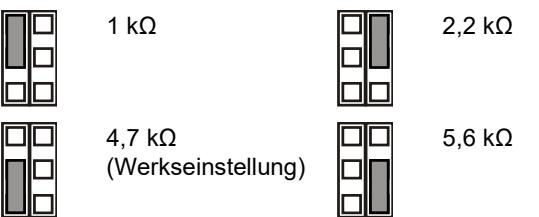

Aus: Kein integrierter Alarmabschlusswiderstand.

**JT: Definiert den integrierten Sabotageabschlusswiderstand (Rt)**

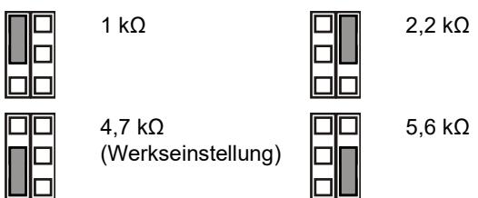

Aus: Kein integrierter Sabotageabschlusswiderstand.

#### **Konfigurieren der Meldegruppe**

Beachten Sie bei der Einrichtung der Meldegruppe folgende Richtlinien:

- Wählen Sie die passenden Werte für den Abschlusswiderstand über JA und JT. Das Setzen der Steckbrücke JT bestimmt beispielsweise den Rt-Wert.
- Entfernen Sie die Steckbrücke JT für einen getrennten Alarm-und Sabotageausgang.
- Entfernen Sie die Steckbrücken JA und JT, um keine integrierte Abschlusswiderstands-Werte zu berücksichtigen.

Bei einer einzelne Meldegruppe, bei der alle integrierten Widerstände eingeschaltet sind, kann der Widerstand der Gruppe wie folgt aussehen.

#### **Tabelle 2: Widerstandswerte der Meldegruppe**

| Meldegruppen-status | Wert  | Default (Werkseinstellung) |
|---------------------|-------|----------------------------|
| Sabotage (kurz)     | 0 Ω   | 0 Ω                        |
| Normal              | Rt    | 4,7 kΩ                     |
| Alarm               | Rt+Ra | 9,4 kΩ                     |
| Sabotage (offen)    | ∞     | ∞                          |

### **DIP-Schalter**

#### **Tabelle 3: SW1, allgemeine Einstellungen**

| Schalter              | Werte               |                                                  |
|-----------------------|---------------------|--------------------------------------------------|
| 6: LED                | Ein: LED ein*       | Aus: LED aus                                     |
| 5: Remote             | Ein: Remote ein     | Aus: Remote aus*                                 |
| 4: Reserviert         |                     |                                                  |
| 3: Polarität          |                     | Ein: Positive Polarität Aus: Negative Polarität* |
| 1, 2: Radarreichweite | 1 Ein, 2 Ein: 12 m* | 1 Ein, 2 Aus: 6 m                                |
|                       | 1 Aus, 2 Ein: 9 m   | 1 Aus, 2 Aus: 4 m                                |
|                       |                     |                                                  |

* Werkseitige Einstellung

### **DIP-Schalter SW1**

#### **SW1-1, SW1-2: Radarreichweite**

Verwenden Sie SW1-1 und SW1-2, um die Radarreichweite exakt an die Anwendung anzupassen. Das Radarsystem basiert auf der Range-Gating-Technologie und gewährleistet somit eine sehr genaue Erfassungsreichweite.

**ON**

**ON**

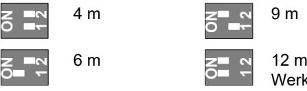

Werkseitige Einstellung. **1 2 1 2**

#### **SW1-3: Polarität**

Ein: Positive Polarität. Konfiguriert die Eingänge (WT und D/N) als "Aktiv-High".

Aus: Negative Polarität. Konfiguriert die Eingänge (WT und D/N) als "Aktiv-Low". Werkseitige Einstellung.

Die Funktionalität wird in Abbildung 10 erklärt.

#### **Abbildung 10**

- (1) Polarität hoch (2) Polarität gering
- (3) Gehtest (WT) (4) Scharf/Unscharf (D/N)

Diese Funktion hängt ebenfalls von der Einstellung von SW1-5 ab. Siehe "SW1-5: Remote-Funktionalität" unten.

#### **SW1-4: Reserviert**

Nicht ändern.

#### **SW1-5: Remote-Funktionalität**

Ein: Remote ein. Aktiviert die Eingänge (Gehtest) WT und (Scharf/Unscharf) D/N.

Aus: Remote aus. Deaktiviert die Eingänge WT und D/N (werkseitig eingestellt).

Die folgenden Funktionen sind von der Remote-Einstellung abhängig.

#### **Tabelle 4: Von der Remote-Einstellung abhängige Funktionen**

| Element                     | Bezeichnung   | SW1-5 Remote ein                  | SW1-5 Remote aus |
|-----------------------------|---------------|-----------------------------------|------------------|
| SW1-3                       | Polarität     | Einstellbar                       | Nur positiv      |
| WT                          | Eingang WT    | Aktiviert                         | Deaktiviert      |
| D/N                         | Eingang D/N   | Aktiviert                         | Deaktiviert      |
| Andere "Grüner" Modus |               | Im Tag-Modus aktiviert ohne WT | Deaktiviert      |
|                             | Alarmspeicher | Im Tag-Modus aktiviert ohne WT | Deaktiviert      |

Siehe auch "Anschlüsse" oben.

#### **SW1-6: LEDs**

Ein: LEDs sind aktiviert. Siehe "LEDs und Ausgänge" unten, um mehr über die LED-Funktionen zu erfahren.

Aus: LEDs sind in allen Zuständen deaktiviert.

### **Konfiguration des Erfassungsbereichs**

- Entferne die Abdeckungen (Abbildung 8 und 9) falls erforderlich. Der jeweilig zutreffende Erfassungsbereich ist unterhalb der Abdeckungs-Konfiguration abgebildet.
**Hinweis:** Wenn beide Spiegel-Abdeckungen im DD1012- N eingesetzt sind, wird die Erfassungsreichweite auf 6 m begrenzt (Werkseinstellung).

- Bei der Ausführung DD1012-N kann der Erfassungsbereich durch ausbrechen von Abdeckungs-Segmenten verändert werden (grau dargestellt in Abbildung 8, Punkt 1). Die zutreffenden Vorhang-Fragmente sind in Abbildung 8, Punkt 2 dargestellt.
- Setzten Sie die passenden Spiegelabdeckungen falls erforderlich ein. Siehe Abbildung 7, Punkt 1 für Details..

**Vorsicht:** Das Entfernen der Aufkleber kann die Spiegeloberfläche beschädigen.

- Falls sich in der Nähe Objekte direkt unterhalb des Melders befinden, setzten Sie die Abdeckmaske in die Innenseite des Melderfensters ein (Werkseinstellung). Hierdurch werden Teile des Vorhangs die nach unten auf das Objekt gerichtet sind ausgeblendet, dessen Nähe möglicherweise den Melder destabilisieren könnte. Siehe Abbildung 7, Punkt 2.
### **Durchführen eines Gehtests**

Es gibt zwei Möglichkeiten, den Gehtest-Modus zu aktivieren.

**SW1-6 wird auf "LED ein" geschaltet, SW1-5 wird auf "Remote aus" geschaltet**

In diesem Modus ist die LED-Anzeige immer aktiviert (durchgehender Gehtest-Modus).

**SW1-6 wird auf "LED ein" geschaltet, SW1-5 wird auf "Remote ein" geschaltet**

Diese Einstellung aktiviert den Gehtest-Eingang (Klemme 6) und den Scharf/Unscharf-Eingang (Klemme 8). Auf diese Weise kann die LED-Anzeige über einen Gehttestausgang der Zentrale im unscharfen Zustand aktiviert werden.

### **"Grüner" Modus**

Wenn SW1-5 auf "Remote ein" geschaltet wird, ist der Radar im Unscharf Modus (ohne WT) deaktiviert, um den Stromverbrauch zu senken. Der Melder arbeitet in diesem Fall ausschließlich im PIR-Modus.

**Hinweis:** Dieser Modus funktioniert nur, wenn die Scharf/Unscharf Klemme an der Zentrale angeschaltet wurde.

Dieser Modus ist nicht konform mit der Norm EN 50131-2-4.

### **Alarmspeicher**

Wird SW1-5 auf "Remote ein" eingestellt, werden Alarmzustände, die während des Scharf-Modus ausgelöst wurden, im Speicher des Melders gespeichert. Sie werden durch ein rot blinkendes LED-Signal angezeigt, sobald die Einheit in den Unscharf-Modus wechselt (Gehtest deaktiviert). Der Speicher wird gelöscht, sobald der Melder wieder in den Scharf-Modus umschaltet.

**Hinweis:** Schalten Sie SW1-6 auf "Aus", um zu verhindern, dass der Alarmspeicher über die LEDs angezeigt wird. Siehe "SW1-6: LEDs" oben.

### **LEDs und Ausgänge**

Um die LED-Funktionalität zu aktivieren, schalten Sie SW1-6 auf "Ein". Anderenfalls sind die LEDs in allen Zuständen deaktiviert. Weitere Einzelheiten finden Sie in Abschnitt "SW1- 6: LEDs" oben.

#### **Tabelle 5: LEDs und Ausgänge**

| Status                              | Rote LED | Alarmrelais | Zurücksetzen                            |
|-------------------------------------|-------------|-------------|-----------------------------------------|
| Start                               |             | Geschlossen | Automatisch nach 60 s                   |
| Unterspannung                       |             | Offen       | Verwenden Sie die korrekte Spannung. |
| PIR-Einbruchalarm                   |             | Geschlossen |                                         |
| Mikrowellen Einbruchalarm        |             | Geschlossen |                                         |
| (Dual) Bewegungs- /Einbruchalarm |             | Offen       | Automatisch nach 3 s                    |
| Dual Alarmspeicher                  |             | Geschlossen | Schalten Sie in den Scharfbetrieb    |
|                                     |             |             |                                         |

Ständig an Normales Blinken (1 Hz)

### **Technische Daten**

| Melder-Technologie:                                |                                                   |
|----------------------------------------------------|---------------------------------------------------|
| DD1012                                             | Dual                                              |
| DD1012PI-N                                         | Dual, haustiertolerant                            |
| Reichweite                                         | 4, 6, 9, 12 m einstellbar über SW1-1 und SW1-2 |
| Sichtwinkel                                        | 78 Grad                                           |
| PIR-Optik                                          | 9 Spiegelvorhänge mit hoher Dichte             |
| Mikrowellenfrequenz                                | 5725–5875 MHz                                     |
| Maximale Ausgangsleistung                          | 13,46 mW                                          |
| Max. Mikrowellenleistung bei 1 m                   | 0,003 µW/cm²                                      |
| Alarmspeicher-Funktion                             | Ja                                                |
| Versorgungsspannung                                | 9 bis 15 V (12 V nominal)                        |
| Spitze/Spitze-Brummspannung                        | 2 V (bei 12 V)                                   |
| Meldereinschaltzeit                                | 60 s                                              |
| Stromaufnahme                                      | 5 bis 17 mA (9 mA nom.)                           |
| Montagehöhe:                                       |                                                   |
| DD1012-N                                           | 1,8 bis 2,6 m                                     |
| DD1012PI-N                                         | 2,3 bis 2,6 m                                     |
| Erfassungsgeschwindigkeits bereich              | 0,2 bis 3 m/s                                     |
| Eigenschaften Alarmrelais (NC) / Sabotagerelais | 80 mA, 30 V, Form A                              |
| Alarmzeit                                          | 3 s                                               |
| Betriebstemperatur                                 | −10 bis +55°C                                     |
| Relative Luftfeuchtigkeit                          | max. 95 %, nicht kondensierend                    |

| Gewicht                 | 120 g            |
|-------------------------|------------------|
| Abmessungen (H x B x T) | 126 × 63 × 50 mm |
| IP/IK-Klasse            | IP30 – IK04      |
| Abreisskontakt          | Optional (ST400) |

### **Zertifizierung und Einhaltung**

| Hersteller                                     | INVERKEHRBRINGER: Carrier Fire & Security Americas Corporation Inc. 13995 Pasteur Blvd Palm Beach Gardens, FL 33418, USA BEVOLLMÄCHTIGTER EU REPRÄSENDANT: Carrier Fire & Security B.V. Kelvinstraat 7, 6003 DH Weert, Niederlande                                                                                                                                                                                                                                                                                                                                                                                                             |
|------------------------------------------------|------------------------------------------------------------------------------------------------------------------------------------------------------------------------------------------------------------------------------------------------------------------------------------------------------------------------------------------------------------------------------------------------------------------------------------------------------------------------------------------------------------------------------------------------------------------------------------------------------------------------------------------------------------------|
| Produktwarnungen und Haftungs ausschluss | DIESE PRODUKTE SIND FÜR DEN VERKAUF AN UND DIE INSTALLATION DURCH QUALIFIZIERTES PERSONAL VORGESEHEN. CARRIER FIRE & SECURITY ÜBERNIMMT KEINERLEI GEWÄHRLEISTUNG DAFÜR, DASS NATÜRLICHE ODER JURISTISCHE PERSONEN, DIE UNSERE PRODUKTE ERWERBEN, SOWIE "AUTORISIERTE HÄNDLER" ODER "AUTORISIERTE WIEDERVERKÄUFER" ÜBER DIE ERFORDERLICHE QUALIFIKATION UND ERFAHRUNG VERFÜGEN, UM BRANDSCHUTZ- ODER SICHERHEITSTECHNISCHE PRODUKTE ORDNUNGSGEMÄSS ZU INSTALLIEREN. Weitere Informationen zu Haftungsausschlüssen sowie zur Produktsicherheit finden Sie unter https://firesecurityproducts.com/policy/product |
|                                                | warning/, oder scannen Sie den QR-Code.                                                                                                                                                                                                                                                                                                                                                                                                                                                                                                                                                                                                                          |
|                                                | Carrier Fire & Security erklärt hiermit, dass dieses Gerät den geltenden Anforderungen und Bestimmungen aller anwendbaren Regeln und Vorschriften entspricht - einschließlich, aber nicht beschränkt auf die Richtlinie 2014/53/EU. Für weitere Informationen siehe www.firesecurityproducts.com.                                                                                                                                                                                                                                                                                                                                              |
| REACH                                          | Das Produkt kann Stoffe enthalten, die auch unter Stoffe der Kandidatenliste in einer Konzentration von mehr als 0,1 % w/w gemäß der zuletzt veröffentlichten Kandidatenliste auf der ECHA Website aufgeführt sind.                                                                                                                                                                                                                                                                                                                                                                                                                                  |
|                                                | Informationen zur sicheren Verwendung finden Sie unter https://firesecurityproducts.com/en/content/intrusi on-intro                                                                                                                                                                                                                                                                                                                                                                                                                                                                                                                                     |
|                                                | 2012/19/EU (WEEE): Produkte die mit diesem Symbol gekennzeichnet sind, dürfen nicht als unsortierter städtischer Abfall in der europäischen Union entsorgt werden. Für die korrekte Wiederverwertung bringen Sie dieses Produkt zu Ihrem lokalen Lieferanten nach dem Kauf der gleichwertigen neuen Ausrüstung zurück, oder entsorgen Sie das Produkt an den gekennzeichneten Sammelstellen. Weitere Informationen hierzu finden Sie auf der folgenden Website: www.recyclethis.info                                                                                                                                               |

Produkt-Dokumentation

Bitte konsultieren Sie den folgenden Web-Link, um die elektronische Version der Produktdokumentation abzurufen.

Dieser Link führt Sie zu der regionalen EMEA-Kontaktseite. Auf dieser Seite können Sie Ihr Login zum gesicherten Webportal anfordern, in dem alle Handbücher gespeichert sind.

https://firesecurityproducts.com/en/contact

### **Kontaktinformationen**

www.firesecurityproducts.com oder www.aritech.com

## **ES: Hoja de instalación**

### **Descripción**

El DD1012-N y DD1012PI-N son sensores de movimiento de doble tecnología. Combinan la tecnología de óptica de espejo patentada PIR con la tecnología patentada de zonas controladas por radar.

El modelo DD1012PI-N se ha diseñado para ser inmune a determinados tipos y tamaños de mascotas. Las mascotas de hasta 18 kg (y alrededor de 35 cm de altura) no suelen causar ningún problema en aplicaciones estándar a no ser que se puedan mover a una distancia del suelo superior a los 35 cm dentro del campo de visión de detección.

### **Instrucciones para la instalación**

Consulte la figura 1.

El detector se ha diseñado para que se instale en la pared, pero también puede instalarse en el techo utilizando un soporte de montaje.

Utilice las siguientes instrucciones para determinar cuál es la mejor posición para instalar el detector.

- Instale el detector de forma que el movimiento esperado de un intruso entre dentro del patrón de detección (consulte la figura 3).
- Instale el detector sobre una superficie estable. Para conocer la altura de montaje permitida, véase "Especificaciones" en la página 17.
- No instale el detector a una distancia inferior a 0,5 m de objetos metálicos o 1,5 m de luces fluorescentes.
- No coloque objetos delante del detector que puedan impedir una línea de visión clara.
- Cuando coloque los detectores uno enfrente del otro, colóquelos a una distancia de al menos 6 m entre sí y utilice una configuración de corto alcance para evitar las interferencias.

El procesamiento de tecnología dual de este detector es muy resistente a los riesgos de falsas alarmas. Sin embargo, debe evitar potenciales causas de inestabilidad, como:

Riesgos relacionados con los PIR:

- Luz solar directa en el detector.
- Fuentes de calor dentro del campo de visión del detector.
- Fuertes corrientes de aire sobre el detector.
- Animales dentro del campo de visión (detectores DD1012- N).

- Oscurecer el campo de visión del detector con objetos de gran tamaño, como por ejemplo mobiliario.
Causas relacionadas con las microondas:

- Superficie de montaje susceptible a sufrir vibraciones.
- Superficies de metal que reflejan la energía de microondas.
- Movimiento de agua a través de tuberías de plástico.
- Objetos en movimiento o que vibren, como ventiladores o conductos de calefacción o aire acondicionado.

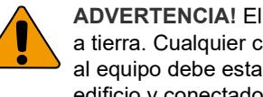

**ADVERTENCIA!** El equipo no está conectado a tierra. Cualquier circuito externo conectado al equipo debe estar situado dentro del mismo edificio y conectado a a tierra.

El aislamiento de los cables conectados al equipo debe cumplir con las normas IEC 60332-1-2 e IEC 60332-1-3 o IEC 60332-2-2-2, dependiendo de la sección del cable, o IEC TS 60695-11-21, independientemente de la sección. Alternativamente, estos cables deben cumplir con UL 2556 VW-1.

La fuente de alimentación del detector debe tener una potencia de 15 W.

Se recomienda que se realice la prueba de paseo al detector con regularidad y se compruebe con el panel de control.

#### **Para instalar el detector:**

- 1. Levante la tapa de la carcasa (consulte la figura 2, pasos 1 y 2).
- 2. Utilizando un destornillador, abra el detector con cuidado (consulte la figura 2, pasos 3 y 4).

**Precaución:** No toque el sensor piroeléctrico (figura 6).

- 3. Saque el tornillo de la tapa (figura 4, paso 2).
- 4. Fije la base a la pared. Para conocer la altura de montaje permitida, véase "Especificaciones" en la página 17.

Consulte la figura 4.

- Para realizar el montaje sobre una superficie plana, utilice como mínimo dos tornillos (DIN 7998) en posición A.

- Para los montajes en esquina, utilice tornillos en posición B o C.

- Para instalar el ST400 de tamper de pared, utilice las posiciones de montaje A. La posición de montaje del ST400 se muestra como paso 3 en la figura 4. Abra la tapa de la placa posterior (figura 5, paso 2).

- 5. Conecte el detector (figuras 4 y 13). Utilice las entradas de cable de la placa posterior (figura 5, paso 1) y la abrazadera de cables (figura 5, paso 3).
- 6. Seleccione el puente que desee y la configuración de los conmutadores DIP (consulte "Configuración del detector" más adelante para obtener más información).
- 7. Retire las mascaras y coloque las etiquetas, si es necesario. Para mas detalles, consulte "Configuración del patron de cobertura" en la página 16.
- 8. Para las aplicaciones de montaje en el techo, utilice el soporte de montaje giratorio SB01. La posición de montaje del SB01 se muestra en el paso 1 de la figura 4.

- 9. Cierre la carcasa, introduzca el tornillo de la tapa y coloque la tapa de la carcasa.
### **Conexiones**

Consulte la figura 13.

| Terminal | Etiqueta               | Explicación                                                                                                                                                                                                                                                                                                         |
|----------|------------------------|---------------------------------------------------------------------------------------------------------------------------------------------------------------------------------------------------------------------------------------------------------------------------------------------------------------------|
| 1, 2     | GND, +12V           | Conexión de alimentación eléctrica (de 9 a 15 V, 12 V nominal)                                                                                                                                                                                                                                                 |
| 3, 4     | ALARMA                 | Relé de salida de alarma (33 Ω). Utilice el puente JA para definir la resistencia EOL integrada en serie con el relé. "Puentes" más adelante.                                                                                                                                                              |
| 5, 6     | TAMPER                 | Salida del interruptor del tamper (0 Ω). Utilice el puente JT para definir la resistencia EOL integrada en serie con el interruptor. "Puentes" más adelante.                                                                                                                                               |
| 7        | Prueba de detección | Esta entrada habilita e inhabilita el LED (prueba de detección activada/desactivada). El modo de prueba de detección solo puede introducirse cuando el detector está en modo Día (clavija 8). Activo nivel bajo o alto viene determinado por SW1-2 (consulte "SW1-3: Polaridad" en la página 16). |
| 8        | Día/noche              | El interruptor cambia el detector a modo día (muestra la memoria en el indicador LED) o noche (activa la memoria de la alarma y borra las alarmas almacenadas previamente). La polaridad activa nivel bajo o alto viene determinada por SW1-3 (consulte "SW1-3: Polaridad" en la página 16).      |

#### **Notas**

- Las entradas 7 y 8 solo se utilizan cuando SW1-5 tiene activado el modo remoto. Consulte "SW1-5: Funcionalidad remota" en la página 16.
- El LED solo está habilitado cuando SW1-6 tiene activado el LED.

La figura 11 explica cómo se crea una zona única con una configuración de resistencia múltiple.

#### **Figura 11**

(2) Zona de alarma

- (1) Relé de alarma Ra Resistencia EOL de la
	- alarma
- (3) Salida del interruptor del tamper Rt Resistencia EOL del tamper

### **Configuración del detector**

Consulte la figura 14 para ver la ubicación de los puentes y del interruptor DIP.

### **Puentes**

Los puentes definen el valor y el modo EOL integrado. El circuito se muestra en la figura 11.

#### **JA: Define la resistencia EOL integrada de la alarma (Ra)**

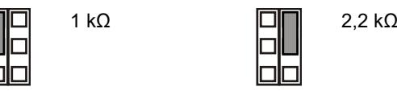

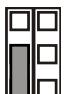

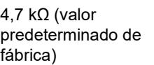

Desactivado: No hay EOL integrado de alarma.

#### **JT: Define la resistencia EOL integrada del tamper (Rt)**

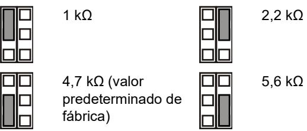

Desactivado: No hay EOL integrado de tamper.

#### **Configuración de la zona**

Para configurar la zona, aplique las siguientes instrucciones.

- Seleccione los valores de resistencia EOL correspondientes con JA y JT. Por ejemplo, la configuración del puente JT determina el valor Rt.
- Para las salidas aisladas elimine JT.
- Elimine los puentes JA y JT para excluir los valores EOL integrados.

Para una zona única con todos los valores de resistencia definidos, la zona de resistencia puede ser la siguiente.

#### **Tabla 2: Valores de resistencia de la zona**

| Estado de zona   | Valor | Predeterminado |
|------------------|-------|----------------|
| Tamper (corto)   | 0 Ω   | 0 Ω            |
| Normal           | Rt    | 4,7 kΩ         |
| Alarma           | Rt+Ra | 9,4 kΩ         |
| Tamper (abierto) | ∞     | ∞              |

### **Conmutadores DIP**

#### **Tabla 3: SW1, configuración general**

| Interruptor           | Valores                           |                                      |
|-----------------------|-----------------------------------|--------------------------------------|
| 6: LED                | Activado: LED activado*        | Desactivado: LED desactivado      |
| 5: Remoto             | Activado: Remoto activado      | Desactivado: Remoto desactivado*  |
| 4: Reservado          |                                   |                                      |
| 3: Polaridad          | Activada: Polaridad positiva   | Desactivada: Polaridad negativa*  |
| 1, 2: Rango del radar | 1 activado, 2 activado: 12 m*  | 1 activado, 2 desactivado: 6 m    |
|                       | 1 desactivado, 2 activado: 9 m | 1 desactivado, 2 desactivado: 4 m |

* Predeterminado de fábrica

### **Conmutador DIP SW1**

#### **SW1-1, SW1-2: Rango del radar**

utilice SW1-1 y SW1-2 para definir el rango del radar para que se ajuste exactamente a la aplicación. El radar es de tipo

puerta de distancia lo que significa que el rango de detección es muy preciso.

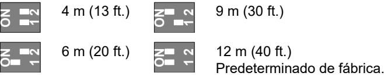

#### **SW1-3: Polaridad**

Activada: Polaridad positiva. Configura las entradas (WT y D/N) como "Activo alto".

Desactivada: Polaridad negativa. Configura las entradas (WT y D/N) como "Activo bajo". Predeterminado de fábrica.

Esta funcionalidad se explica en la figura 10.

#### **Figura 10**

- (1) Polaridad alta
- (3) Prueba de detección
- (2) Polaridad baja
- (4) Day/Night (Día/noche)

Esta función también depende de la configuración de SW1-5. Consulte "SW1-5: Funcionalidad remota" más adelante.

#### **SW1-4: Reservado**

No se cambia.

**SW1-5: Funcionalidad remota**

Activada: Remoto activado. Activa WT y las entradas día/noche.

Desactivada: Remoto desactivado. Desactiva las entradas día/noche y WT (predeterminado de fábrica).

La siguiente funcionalidad depende de la configuración Remoto.

**Tabla 4: Funciones que dependen de la configuración Remoto.**

| Elemento | Descripción          | SW1-5 Remoto activado         | SW1-5 Remoto desactivado |
|----------|----------------------|----------------------------------|-----------------------------|
| SW1-3    | Polaridad            | Seleccionable                    | Solo positivo               |
| WT       | Entrada WT           | Habilitado                       | Inhabilitado                |
| D/N      | Entrada D/N          | Habilitado                       | Inhabilitado                |
| Otros    | Modo verde           | Habilitado en modo día sin WT | Inhabilitado                |
|          | Memoria de alarma | Habilitado en modo día sin WT | Inhabilitado                |

Consulte también "Conexiones" en la página 15.

#### **SW1-6: LED**

Activado: Los LED están activados. Consulte "LED y salidas" en la página 17 para ver la funcionalidad de los LED.

Desactivado: Los LED están desactivados para todos los estados.

#### **Configuración del patron de cobertura**

- Remover mascaras (Figuras 8 y 9) si es necesario. La modificación del patrón de captación se muestra debajo de la configuración de las máscaras.
**Nota:** Si ambas mascaras están instaladas en el DD1012 (-D), el rango del detector se limita a 6 m (valor por defecto).

- En el caso del DD1012 (-D), modificar el patrón retirando las partes de mascara (mostradas en gris en la figura 8, parte 1). En la figura 8, parte 2, se muestran los correspondientes fragmentos de cortina.
- Si fuera necesario, colocar las apropiadas etiquetas en los espejos. Para mas detalles Figura 7, parte 1.

**Precaución:** Al retirar las etiquetas una vez colocadas, se puede dañar la superficie del espejo.

- Cuando existen objetos cercanos justo debajo del detector, encaje la mascara en el interior de la ventana (por defecto). Esto anula la parte de las cortinas que enfocan hacia abajo del detector, y que pueden desestabilizar al detector. Mirar Figura 7, parte 2.
### **Prueba de detección del detector**

Existen dos formas de activar el modo de prueba de detección.

#### **SW1-6 configurado en LED activado, SW1-5 configurado en remoto desactivado**

En este modo la indicación del LED siempre es activado (modo de prueba de detección constante).

**SW1-6 configurado en LED activado, SW1-5 configurado en remoto activado**

Esta configuración permite la entrada de prueba de detección (clavija 7) y la entrada de día/noche (clavija 8). Esto permite que el usuario active la indicación LED de forma remota configurando el detector en modo de día y activar la prueba de detección.

### **Modo verde**

Cuando SW1-5 se configura en remoto activado, el radar se apaga durante el modo de día (sin WT) para reducir el consumo actual. El detector funciona entonces en modo PIR únicamente.

**Nota:** La línea día/noche se tiene que conectar al panel de control para que este modo funcione.

Este modo no cumple con la norma EN 50131-2-4.

### **Memoria de alarma**

Cuando SW1-5 se establece en remoto activado, las alarmas que se producen durante el modo noche se almacenan en la memoria del detector. Se indican mediante un LED de color rojo intermitente cuando la unidad se cambia a modo día (prueba de detección desactivada). La memoria se borra cuando el detector se vuelve a poner en modo noche.

**Nota:** Define SW1-6 en desactivado para evitar que la memoria de la alarma se muestre en los LED. Consulte "SW1- 6: LED" en la página 16.

#### **LED y salidas**

Para habilitar las funcionalidad LED, define SW1-6 en activado, de los contrario los LED estarán desactivados en cualquier condición. Consulte "SW1-6: LED" en la página 16 para obtener más información.

#### **Tabla 5: LED y salidas**

| Estado                                    | LED rojo | Relé de alarma | Restablecimiento                   |
|-------------------------------------------|-------------|-------------------|------------------------------------|
| Inicio                                    |             | Cerrado           | Automáticamente después de 60 s |
| Bajo voltaje                              |             | Abrir             | Aplicar el voltaje adecuado        |
| Alarma PIR de intruso                  |             | Cerrado           |                                    |
| Alarma de intruso por microondas       |             | Cerrado           |                                    |
| Alarma de intruso por movimiento doble |             | Abrir             | Automáticamente después de 3 s  |
| Memoria alarma dual                       |             | Cerrado           | Cambiar a modo noche               |
| Activado de forma continua                |             |                   | Parpadeo normal (1 Hz)             |

### **Especificaciones**

| Tecnología del detector: DD1012 DD1012PI-N       | Dual Dual, inmune a las mascotas                   |
|--------------------------------------------------------|-------------------------------------------------------|
| Rango                                                  | 4, 6, 9, 12 m seleccionable mediante SW1-1 y SW1-2 |
| Ángulo de visión                                       | 78 grados                                             |
| Óptica PIR                                             | 9 cortinas de espejo de alta densidad              |
| Frecuencia de microondas                               | 5725–5875 MHz                                         |
| Maxima potencia de salida                              | 13,46 mW                                              |
| Salida de microondas máxima a 1 m                      | 0,003 μW/cm²                                          |
| Función de memoria                                     | Sí                                                    |
| Alimentación de entrada                                | de 9 a 15 V (12 V nominal)                           |
| Inmunidad de tensión de pico a pico                    | 2 V (a 12 V)                                         |
| Tiempo de arranque del detector                        | 60 s                                                  |
| Consumo de corriente                                   | entre 5 y 17 mA (9 mA nom.)                           |
| Altura de instalación:                                 |                                                       |
| DD1012-N                                               | De 1,8 a 2,6 m                                        |
| DD1012PI-N                                             | De 2,3 a 2,6 m                                        |
| Rango de velocidades de destino                        | De 0,2 a 3,0 m/s                                      |
| Característica de relé del tamper/de la alarma (NC) | 80 mA 30 V, Formulario A                             |
| Tiempo de alarma                                       | 3 s                                                   |
| Temperatura de funcionamiento                          | De −10 a +55°C (de 14 a 130ºF)                     |
| Humedad relativa                                       | 95% máx., sin condensación                            |
| Peso                                                   | 120 g                                                 |
| Dimensiones (Al x An x Pro)                            | 126 × 63 × 50 mm                                      |
| Rango de IP/IK                                         | IP30 IK02                                             |
| Tamper de pared                                        | Opcional (ST400)                                      |

### **Información normativa**

| Fabricante | COLOCADO EN EL MERCADO POR: Carrier Fire & Security Americas Corporation Inc. |
|------------|----------------------------------------------------------------------------------|
|            | 13995 Pasteur Blvd Palm Beach Gardens, FL 33418, EE. UU.                      |
|            | REPRESENTANTE AUTORIZADO DE LA UE: Carrier Fire & Security B.V.               |
|            | Kelvinstraat 7, 6003 DH Weert, Países Bajos                                      |

| Advertencias del producto y descargos de responsabilidad | ESTOS PRODUCTOS ESTÁN DESTINADOS A LA VENTA A, E INSTALACIÓN POR, UN PROFESIONAL DE SEGURIDAD EXPERIMENTADO. CARRIER FIRE & SECURITY NO PUEDE GARANTIZAR QUE TODA PERSONA O ENTIDAD QUE COMPRE SUS PRODUCTOS, INCLUYENDO CUALQUIER "DISTRIBUIDOR O VENDEDOR AUTORIZADO", CUENTE CON LA FORMACIÓN O EXPERIENCIA PERTINENTE PARA INSTALAR CORRECTAMENTE PRODUCTOS RELACIONADOS CON LOS INCENDIOS Y LA SEGURIDAD. Para obtener más información sobre exclusiones de garantía e información de seguridad de productos, consulte https://firesecurityproducts.com/policy/product |
|-------------------------------------------------------------------|-----------------------------------------------------------------------------------------------------------------------------------------------------------------------------------------------------------------------------------------------------------------------------------------------------------------------------------------------------------------------------------------------------------------------------------------------------------------------------------------------------------------------------------------------------------------------------------------------------------------------------|
| Certificado                                                       | warning/ o escanee el código QR.                                                                                                                                                                                                                                                                                                                                                                                                                                                                                                                                                                                            |
|                                                                   | Carrier Fire & Security declara por este medio que este dispositivo cumple con los requisitos y disposiciones aplicables de todas las reglas y regulaciones aplicables, incluyendo pero no limitado a la Directiva 2014/53/EU. Para mas información consulte www.firesecurityproducts.com.                                                                                                                                                                                                                                                                                                                |
| REACH                                                             | Los productos REACH pueden contener sustancias que están incluidas en la Lista de sustancias Candidatas en una concentración en peso superior al 0,1%, según la más reciente Lista de sustancias Candidatas publicada en la Web de ECHA. Puede encontrar información sobre su uso seguro en https://firesecurityproducts.com/en/content/intrusi on-intro                                                                                                                                                                                                                                         |
|                                                                   | 2012/19/EU (directiva WEEE): los productos marcados con este símbolo no se pueden desechar como residuos urbanos no clasificados en la Unión Europea. Para que se pueda realizar un reciclaje adecuado, devuelva este producto a su representante de ventas local al comprar un equipo nuevo similar o deséchelo en los puntos de recogida designados. Para obtener más información, consulte: www.recyclethis.info                                                                                                                                                                                 |
| Documentación de producto                                      | Por favor, consulte el siguiente enlace Web para recuperar la versión electrónica de la documentación del producto. Este enlace le guiará a su página de contacto local de EMEA. En esta página puede solicitar su acceso al portal web seguro donde se almacenan todos los manuales. https://firesecurityproducts.com/en/contact                                                                                                                                                                                                                                                                      |

### **Información de contacto**

www.firesecurityproducts.com o www.aritech.com

## **FR: Fiche d'installation**

### **Description**

DD1012-N et DD1012PI-N sont des détecteurs de mouvement à double technologie. Ils associent la technologie brevetée d'optique à miroir IRP à la technologie brevetée de radar à portée contrôlée.

Le modèle DD1012PI-N est conçu pour rester indifférent à la présence d'animaux d'une certaine taille et d'une certaine catégorie. Les animaux pesant jusqu'à 18 kg (et mesurant jusqu'à 35 cm environ) ne provoquent généralement aucune perturbation du fonctionnement standard du détecteur, à moins qu'ils ne se déplacent à une hauteur supérieure à 35 cm audessus du sol, dans le champ de vision du détecteur.

### **Instructions d'installation**

Voir la Figure 1.

Le détecteur est conçu pour un montage mural mais peut également être fixé au plafond à l'aide d'un support adapté.

Suivez les instructions ci-dessous pour déterminer le meilleur endroit où installer le détecteur.

- Montez le détecteur de manière à ce que la zone de couverture couvre le passage d'un intrus (voir la Figure 3).
- Montez le détecteur sur une surface stable. Pour la hauteur de montage autorisée, voir « Caractéristiques techniques » en page 21.
- Ne montez pas le détecteur à moins de 0,5 m d'objets métalliques ou à moins de 1,5 m de lumières fluorescentes.
- Ne placez pas d'objets pouvant masquer le champ de vision du détecteur.
- Respectez une distance d'au moins 6 m entre chaque détecteur et utilisez le réglage de courte portée pour éviter les interférences lorsque des détecteurs sont montés en vis-à-vis.

Le traitement à double technologie de ce détecteur est conçu pour résister aux risques de fausses alarmes. Toutefois, il est conseillé d'éviter les causes d'instabilité potentielles, telles que :

#### Risques liés à l'IRP :

- L'exposition du détecteur à la lumière directe du soleil
- Les sources de chaleur dans le champ de vision du détecteur
- Les courants d'air puissants sur le détecteur
- La présence d'animaux dans le champ de vision (détecteurs DD1012-N)
- L'obstruction du champ de vision du détecteur par des objets volumineux, comme des meubles

Risques liés aux hyperfréquences :

- La surface de montage est sensible aux vibrations
- Les surfaces métalliques reflétant l'énergie des hyperfréquences
- Le mouvement de l'eau à travers les tuyaux de plastique
- Le déplacement ou les vibrations d'objets tels que des ventilateurs ou des conduits thermiques ou de climatisation

**ATTENTION!** L'équipement n'est pas mis à la terre. Tout circuit externe raccordé à l'équipement doit être situé dans le même bâtiment et relié à un conducteur de terre de protection.

L'isolation des câbles raccordés à l'équipement doit être conforme aux normes IEC 60332-1-2 et IEC 60332-1-3 ou IEC 60332-2-2, selon la section du câble, ou IEC TS 60695- 11-21, indépendamment de la section. Ces fils doivent être également conformes à la norme UL 2556 VW-1.

La source d'alimentation du détecteur doit être limitée à 15 W.

Nous recommandons de tester régulièrement le détecteur et de vérifier la centrale.

**Installation du détecteur :**

- 1. Soulevez le couvercle (voir la Figure 2, éléments 1 et 2).
- 2. A l'aide d'un tournevis, ouvrez délicatement le détecteur en faisant levier (voir fig. 2, éléments 3 et 4).

**Attention :** Veillez à ne pas toucher le capteur pyroélectrique (Figure 6).

- 3. Retirez la vis du cache (Figure 4, élément 2).
- 4. Fixez la base au mur. Pour la hauteur de montage autorisée, voir « Caractéristiques techniques » en page 21.

Voir la Figure 4.

- Pour un montage à plat, utilisez au moins deux vis (DIN 7998) dans la position A.

- Pour un montage en angle, utilisez les vis en position B ou C.

- Pour installer l'autoprotection à l'arrachement (ST400), utilisez les positions de montage A. La position de montage de l'autoprotection ST400 est représentée par l'élément 3 dans la Figure 4. Ouvrez le loquet du panneau arrière (Figure 5, élément 2).

- 5. Raccordez le détecteur (voir figures 4 et 13). Utilisez les orifices d'entrée (Figure 5, élément 1) et le coupe-câble (Figure 5, élément 3) situés sur le panneau arrière.
- 6. Réglez les cavaliers et les commutateurs DIP de manière appropriée (pour plus d'informations, reportez-vous à la section « Réglage du détecteur » ci-dessous).
- 7. Retirer les caches et ajouter les autocollants, si nécessaire. Voir « Configuration de la couverture » en page 21 pour plus détails.
- 8. Pour les applications de montage au plafond, utilisez la patte de fixation à pivot SB01. La position de montage de la patte de fixation SB01 est représentée par l'élément 1 de la Figure 4.
- 9. Fermez le cache, insérez la vis, puis replacez le couvercle.

### **Connexions**

Voir la Figure 13.

**Tableau 1 : Connexions du détecteur**

| Borne | Libellé            | Explication                                                                                                                                                                                                                                                                                                                                                        |
|-------|--------------------|--------------------------------------------------------------------------------------------------------------------------------------------------------------------------------------------------------------------------------------------------------------------------------------------------------------------------------------------------------------------|
| 1, 2  | GND, +12V          | Raccordement électrique (9 à 15 V, 12 V nominal)                                                                                                                                                                                                                                                                                                              |
| 3, 4  | ALARM              | Sortie relais d'alarme (33 Ω). Utilisez le cavalier JA pour définir la résistance de fin de ligne (FDL) en série avec le relais. Reportez-vous à la section « Cavaliers » en page 20.                                                                                                                                                                  |
| 5, 6  | AUTO PROTECTION | Sortie du commutateur d'autoprotection (0 Ω). Utilisez le cavalier JT pour définir la résistance de fin de ligne (FDL) en série avec le commutateur. Reportez-vous à la section « Cavaliers » en page 20.                                                                                                                                              |
| 7     | Walk test          | Cette entrée permet d'activer et de désactiver le voyant lumineux (test de marche activé/désactivé). Le mode Walk Test (Test de marche) ne peut être utilisé que lorsque le détecteur est en mode Jour (broche n°8). Les modes Active (Actif) haut et bas sont déterminés par le commutateur SW1-3 (voir « SW1-3 : Polarité » en page 20). |
| 8     | Day/Night          | Cette entrée active le mode Jour (affichage de l'alarme mémorisée sur le voyant lumineux) ou Nuit (active la mémoire d'alarme et efface les alarmes précédemment enregistrées). La polarité des modes Active (Actif) haut et bas est déterminée par le commutateur SW1-3 (voir « SW1-3 : Polarité » en page 20).                              |

#### **Remarques**

- Les entrées 7 et 8 ne peuvent être utilisées que lorsque le commutateur SW1-5 est défini sur Remote on (Contrôle à distance activé). Reportez-vous à la section « SW1-5 : Fonction de contrôle à distance » en page 20.
- Ce voyant lumineux n'est actif que lorsque le commutateur SW1-6 est réglé sur LED on (Voyant activé).

La Figure 11 explique comment créer une zone unique avec une configuration en résistances multiples.

#### **Figure 11**

- (1) Relais d'alarme
- Ra Résistance de fin de ligne
- (2) Zone d'alarme (3) Sortie du contact d'autoprotection
- d'alarme
	- Rt Résistance de fin de ligne d'autoprotection

#### **Réglage du détecteur**

Consultez la Figure 14 pour connaître l'emplacement des cavaliers et du commutateur DIP.

### **Cavaliers**

Les cavaliers déterminent le mode et la valeur des résistances de fin de ligne intégrées (FDL). Le circuit est illustré dans la Figure 11.

**JA : détermine la résistance FDL de l'alarme embarquée (Ra)**

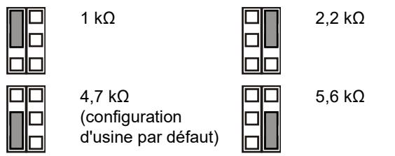

Position OFF : aucune FDL d'alarme.

**JT : détermine la résistance FDL de l'autoprotection embarquée (Rt)**

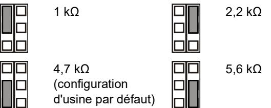

Position OFF : aucune FDL d'autoprotection.

#### **Configuration de la zone**

Pour configurer la zone, suivez la procédure ci-après.

- Sélectionnez les valeurs appropriées de résistance FDL avec les cavaliers JA et JT. Par exemple, le réglage du cavalier JT détermine la valeur Rt.
- Pour les sorties isolées, retirez le cavalier JT.
- Retirez les cavaliers JA et JT pour exclure les valeurs de FDL embarquée.

Pour configurer une zone unique avec toutes les résistances embarquées réglées, la résistance de la zone peut être définie comme suit :

#### **Tableau 2 : Valeurs de résistance de zone**

| Etat de la zone                | Valeur  | Par défaut |
|--------------------------------|---------|------------|
| Autoprotection (court-circuit) | 0 Ω     | 0 Ω        |
| Normal                         | Rt      | 4,7 kΩ     |
| Alarme                         | Rt + Ra | 9,4 kΩ     |
| Autoprotection (ouvert)        | ∞       | ∞          |

### **Commutateurs DIP**

#### **Tableau 3 : SW1, paramètres généraux**

| Commutateur               | Valeurs                                     |                                                  |  |
|---------------------------|---------------------------------------------|--------------------------------------------------|--|
| 6: Voyant                 | Position ON : Voyant allumé*             | Position OFF : Voyant éteint                  |  |
| 5: Contrôle à distance | Position ON : Contrôle à distance activé | Position OFF : Contrôle à distance désactivé* |  |
| 4: Réservé                |                                             |                                                  |  |
| 3: Polarité               | Position ON : Polarité positive          | Position OFF : Polarité négative*             |  |

| Commutateur     | Valeurs            |                    |
|-----------------|--------------------|--------------------|
| 1, 2: Portée du | 1 On, 2 On : 12 m* | 1 On, 2 Off : 6 m  |
| radar           | 1 Off, 2 On : 9 m  | 1 Off, 2 Off : 4 m |

* Configuration usine par défaut

### **Commutateur DIP SW1**

### **SW1-1, SW1-2 : Portée du radar**

Utilisez les commutateurs SW1-1 et SW1-2 pour définir la portée du radar de sorte qu'elle s'adapte précisément à l'application. Ce radar inclut une fonction de crénelage spatial (range-gating), ce qui signifie que la portée de détection est extrêmement précise.

**ON**

**ON**

 **2**

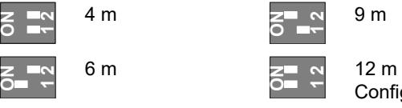

#### **SW1-3 : Polarité**

Position ON : Polarité positive. Configure les entrées (WT, test de marche et D/N, mode jour/nuit) avec le paramètre Active (Actif) haut.

Position OFF : Polarité négative. Configure les entrées (WT, test de marche et D/N, mode jour/nuit) avec le paramètre Active (Actif) bas. Configuration d'usine par défaut.

Cette fonctionnalité est expliquée à la Figure 10.

| Figure 10 |  |
|-----------|--|
|-----------|--|

- (1) Polarité haute (2) Polarité basse
- (3) Test de marche (4) Jour/nuit

Cette fonction dépend également du réglage du commutateur SW1-5. Reportez-vous à la section « SW1-5 : Fonction de contrôle à distance » ci-dessous.

#### **SW1-4 : Réservé**

Ne pas modifier.

#### **SW1-5 : Fonction de contrôle à distance**

Position ON : contrôle à distance activé. Active les entrées du test de marche (WT) et du mode jour/nuit.

Position OFF : contrôle à distance désactivé. Désactive les entrées du test de marche et du mode jour/nuit (configuration d'usine par défaut).

La fonction suivante dépend du réglage du contrôle à distance.

**Tableau 4 : Fonctions dépendant du réglage du contrôle à distance**

| Elément | Description                 | Contrôle à distance activé sur SW1-5 | Contrôle à distance désactivé sur SW1-5 |
|---------|-----------------------------|--------------------------------------------|-----------------------------------------------|
| SW1-3   | Polarité                    | Sélectionnable                             | Positive seulement                            |
| WT      | Entrée du test de marche | Activé                                     | Désactivé                                     |
| D/N     | Entrée du mode jour/nuit | Activé                                     | Désactivé                                     |

| Elément | Description         | Contrôle à distance activé sur SW1-5     | Contrôle à distance désactivé sur SW1-5 |
|---------|---------------------|------------------------------------------------|-----------------------------------------------|
| Autre   | Mode vert           | Activé en mode jour sans test de marche     | Désactivé                                     |
|         | Mémoire d'alarme | Activée en mode jour sans test de marche | Désactivée                                    |

Reportez-vous également la section « Connexions » en page 19.

#### **SW1-6 : Voyants lumineux**

Position ON : les voyants lumineux sont activés. Reportezvous à la section « Voyants lumineux et sorties » ci-dessous pour connaître la fonction des voyants lumineux.

Position OFF : les voyants lumineux sont désactivés pour tous les états.

### **Configuration de la couverture**

- Retirer les caches si nécessaire (Figures 8 et 9). Le lobe de détection modifié est indiqué sous les configurations des caches.
**Note:** Si tous les caches sont installés dans le DD1012-N, la portée du détecteur est limitée à 6 m (par défaut).

- Dans le cas du DD1012-N, modifier le lobe de détection en cassant les caches (indiqué en gris au indice 1 de la figure 8). Les fragments de rideau correspondants sont indiqués au indice 2 de la figure 8.
- Placer les autocollants de miroir appropriés si nécessaire. Voir la Figure 7, indice 1 pour plus détails.

**Attention:** La surface du miroir peut être endommagée en retirant les caches stickers.

- Quand des objets se situent directement sous le détecteurs, mettre en place le masque à l'intérieur de la fenêtre (par défaut). Cela désactivera les rideaux regardant en dessous, qui peuvent déstabiliser le détecteur. Voir la Figure 7, indice 2.
### **Test de marche sur le détecteur**

Le mode de test de marche peut être activé de deux façons.

#### **Voyant du SW1-6 activé, contrôle à distance du SW1-5 désactivé**

Dans cette configuration, le voyant lumineux est toujours activé (mode de test de marche constant).

**Voyant du SW1-6 activé, contrôle à distance du SW1-5 activé**

Ce paramètre active l'entrée du test de marche (broche n°7) et celle du mode jour/nuit (broche n°8). Il permet à l'utilisateur d'activer le voyant lumineux à distance en faisant basculer le détecteur en mode Jour et en activant le test de marche.

#### **Mode vert**

Lorsque le contrôle à distance est activé sur le commutateur SW1-5, le radar est désactivé en mode Jour (aucun de test de marche) afin de réduire la consommation d'électricité. Le détecteur fonctionne alors en mode IRP seulement.

**Remarque :** Pour que ce mode fonctionne, la ligne Jour/Nuit doit être connectée à la centrale.

Ce mode n'est pas conforme à la norme EN 50131-2-4.

### **Mémoire d'alarme**

Lorsque le contrôle à distance du commutateur SW1-5 est activé, les alarmes déclenchées en mode Nuit sont stockées dans la mémoire du détecteur. Elles sont indiquées par un voyant rouge lumineux lorsque l'unité passe en mode Jour (test de marche désactivé). La mémoire est effacée lorsque le détecteur repasse en mode Nuit.

**Remarque :** Réglez le commutateur SW1-6 sur Off (Désactivé) pour ne pas afficher la mémoire d'alarme sur les voyants lumineux. Reportez-vous à la section « SW1-6 : Voyants lumineux » ci-dessus.

### **Voyants lumineux et sorties**

Pour activer les voyants lumineux, réglez le commutateur SW1-6 sur On (Activé), sinon ils seront désactivés quel que soit l'état de l'unité. Reportez-vous à la section « SW1-6 : Voyants lumineux » ci-dessus pour plus d'informations.

#### **Tableau 5 : Voyants lumineux et sorties**

| Etat                                 | Voyant rouge | d'alarme Relais | Réinitialisation              |
|--------------------------------------|-----------------|--------------------|-------------------------------|
| Démarrage                            |                 | Fermé              | Automatiquement après 60 s |
| Basse tension                        |                 | Ouvert             | Utiliser une tension correcte |
| Alarme intrusion IRP                 |                 | Fermé              |                               |
| Alarme intrusion hyperfréquence   |                 | Fermé              |                               |
| Alarme intrusion mouvement double |                 | Ouvert             | Automatiquement après 3 s     |
| Mémoire double détection          |                 | Fermé              | Passer en mode nuit           |
| Allumé en continu                    |                 | Clignotant (1 Hz)  |                               |

**Caractéristiques techniques**

| Technologie de détection :                 |                                                  |
|--------------------------------------------|--------------------------------------------------|
| DD1012                                     | Double                                           |
| DD1012PI-N                                 | Double, indifférent aux animaux                  |
| Portée                                     | 4, 6, 9 ou 12 m, sélection via SW1-1 et SW1-2 |
| Angle de vue                               | 78 degrés                                        |
| Optique IRP                                | 9 miroirs à rideau haute densité                 |
| Fréquence de l'hyperfréquence              | 5725–5875 MHz                                    |
| Sortie de puissance maximum                | 13,46 mW                                         |
| Sortie hyperfréquence max. à 1 m           | 0,003 μW/cm²                                     |
| Fonction de mémoire                        | Oui                                              |
| Puissance d'entrée                         | 9 à 15 V (12 V nominal)                         |
| Insensible à l'ondulation crête à crête | 2 V (à 12 V)                                    |
| Temps de démarrage du détecteur            | 60 s                                             |
| Consommation électrique                    | 5 à 17 mA (10 mA nominal)                        |
|                                            |                                                  |

| Hauteur de montage :                                           |                              |
|----------------------------------------------------------------|------------------------------|
| DD1012-N                                                       | 1,8 à 2,6 m                  |
| DD1012PI-N                                                     | 2,3 à 2,6 m                  |
| Vitesse de la cible                                            | 0,2 à 3 m/s                  |
| Caractéristiques du relais d'alarme (NC) / d'autoprotection | 80 mA 30 V, Forme A         |
| Durée d'alarme                                                 | 3 s                          |
| Température de fonctionnement                                  | −10 à +55 °C                 |
| Humidité relative                                              | 95 % max., sans condensation |
| Poids                                                          | 120 g                        |
| Dimensions (H x L x P)                                         | 126 × 63 × 50 mm             |
| Classe IP/IK                                                   | IP30 IK04                    |
| Protection contre l'arrachement                                | En option (ST400)            |

### **Informations sur la réglementation**

| Fabricant                                          | MISE SUR LE MARCHÉ PAR : Carrier Fire & Security Americas Corporation Inc. 13995 Pasteur Blvd Palm Beach Gardens, FL 33418, USA REPRÉSENTANT DE L'UNION EUROPÉENNE AUTORISÉ : Carrier Fire & Security B.V. Kelvinstraat 7, 6003 DH Weert, Pays-Bas                                                                                                                                                                                                                                                                                                                                      |
|----------------------------------------------------|--------------------------------------------------------------------------------------------------------------------------------------------------------------------------------------------------------------------------------------------------------------------------------------------------------------------------------------------------------------------------------------------------------------------------------------------------------------------------------------------------------------------------------------------------------------------------------------------------------------|
| Avertissements et avis de non responsabilité | CES PRODUITS SONT DESTINÉS À DES PROFESSIONNELS EXPÉRIMENTÉS, QUI DOIVENT ÉGALEMENT SE CHARGER DE LEUR INSTALLATION. CARRIER FIRE & SECURITY NE PEUT GARANTIR QU'UNE PERSONNE OU ENTITÉ FAISANT L'ACQUISITION DE CEUX-CI, Y COMPRIS UN REVENDEUR AGRÉÉ, DISPOSE DE LA FORMATION OU DE L'EXPÉRIENCE REQUISE POUR PROCÉDER À CETTE MÊME INSTALLATION DE FAÇON APPROPRIÉE. Pour obtenir des informations supplémentaires sur les garanties et la sécurité, rendez-vous à l'adresse https://firesecurityproducts.com/policy/product warning/ ou scannez le code QR. |
| Certification                                      |                                                                                                                                                                                                                                                                                                                                                                                                                                                                                                                                                                                                              |
|                                                    | Carrier Fire & Security déclare par la présente que cet appareil est conforme aux exigences applicables et aux dispositions de toutes les règles et règlements applicables, y compris, mais sans s'y limiter, de la Directive 2014/53/EU. Pour plus d'informations, voir www.firesecurityproducts.com.                                                                                                                                                                                                                                                                                     |
| REACH                                              | Ce produit peut contenir des substances figurant également sur la Liste de substances candidates à une concentration supérieure à 0,1 % p/p, selon la Liste de substances candidates la plus récente publiée sur le site web de l'Agence européenne des produits chimiques (ECHA).                                                                                                                                                                                                                                                                                                            |
|                                                    | Vous trouverez des renseignements sur l'utilisation sécuritaire du produit à l'adresse https://firesecurityproducts.com/en/content/intrusi on-intro                                                                                                                                                                                                                                                                                                                                                                                                                                                 |

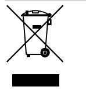

2012/19/EU (WEEE) : Les produits marqués de ce symbole peuvent pas être éliminés comme déchets municipaux non triés dans l'Union européenne. Pour le recyclage, retourner ce produit à votre fournisseur au moment de l'achat d'un nouvel équipement équivalent, ou à des points de collecte désignés. Pour plus d'informations, voir: www.recyclethis.info

Documentation produit

Veuillez consulter le lien Web suivant pour récupérer la version électronique de la documentation du produit.

Ce lien vous guidera vers la page de contact régional EMEA. Sur cette page, vous pouvez demander votre connexion au portail Web sécurisé où tous les manuels sont stockés. https://firesecurityproducts.com/en/contact

### **Informations de contact**

www.firesecurityproducts.com ou www.aritech.com

## **IT: Istruzioni d'installazione**

### **Descrizione**

I dispositivi DD1012-N e DD1012PI-N sono rilevatori di movimento doppi. Uniscono la tecnologia ottica brevettata PIR alla tecnologia brevettata Range Controlled Radar.

Il dispositivo DD1012PI-N è progettato per non rilevare animali domestici di una certa corporatura e fino a determinate dimensioni. Gli animali di peso inferiore a 18 kg (alti circa 35 cm) generalmente non provocano alcun problema nelle applicazioni a meno che siano in grado di raggiungere un'altezza superiore ai 35 cm dal terreno nel campo visivo di rilevamento.

### **Linee guida per l'installazione**

Vedere la figura 1.

Il rilevatore è progettato per l'installazione a parete, ma è anche possibile montarlo sul soffitto utilizzando una staffa di montaggio.

Per determinare la posizione di installazione ideale per il rilevatore, attenersi alle seguenti linee guida.

- Installare il rilevatore in modo che il movimento previsto di un eventuale intruso attraversi il campo di rilevamento (vedere la figura 3).
- Installare il rilevatore su una superficie stabile. Per l'altezza di montaggio consentita, vedere "Specifiche" a pagina 25.
- Non installare il rilevatore a una distanza inferiore a 0,5 m da oggetti metallici o 1,5 m da luci fluorescenti.
- Non collocare davanti al rilevatore oggetti che possano ostacolare il raggio di copertura.
- Installare i rilevatori a una distanza minima di 6 m tra loro e utilizzare l'impostazione a corto raggio per evitare interferenze quando sono installati l'uno di fronte all'altro.

L'elaborazione a doppia tecnologia di questo rilevatore è molto resistente ai rischi di falsi allarmi. Tuttavia è opportuno evitare possibili fattori di instabilità, quali:

#### Rischi PIR:

- Esposizione del rilevatore alla luce solare diretta
- Fonti di calore nel campo di rilevazione del rilevatore
- Forti correnti d'aria in prossimità del rilevatore
- Animali all'interno del campo visivo (rilevatori DD1012-N)
- Oscuramento del campo di rilevazione del rilevatore con oggetti di grandi dimensioni (es. mobilio)

Rischi microonde:

- Superficie di montaggio soggetta a vibrazioni
- Superfici metalliche che riflettano le microonde
- Movimento di acqua attraverso tubature in plastica
- Oggetti in movimento o soggetti a vibrazioni, come ventilatori e condutture del riscaldamento o dell'aria condizionata

**AVVERTIMENTO!** L'apparecchiatura non è collegata a terra. Qualsiasi circuito esterno collegato all'apparecchiatura deve essere situato nello stesso edificio e collegato a un conduttore di terra di protezione.

L'isolamento del cavo dei cavi collegati all'apparecchiatura deve essere conforme a IEC 60332-1-2 e IEC 60332-1-3 o IEC 60332-2-2, a seconda della sezione del cavo, o IEC TS 60695-11-21, indipendentemente di area della sezione trasversale. In alternativa, tali cavi devono essere conformi alla norma UL 2556 VW-1.

La fonte di alimentazione del rilevatore deve essere limitata a 15 W.

Si raccomanda di eseguire regolarmente il test di copertura del rilevatore e i relativi controlli sulla centrale di controllo.

**Per installare il rilevatore:**

- 1. Sollevare l'inserto di protezione (vedere la figura 2, voci 1 e 2).
- 2. Aprire il rilevatore facendo leva con un cacciavite (vedere la figura 2, voci 3 e 4).

**Attenzione:** non toccare il sensore piroelettrico (figura 6).

- 3. Rimuovere la vite del coperchio (figura 4, voce 2).
- 4. Fissare la base al muro. Per l'altezza di montaggio consentita, vedere "Specifiche" a pagina 25.

Vedere la figura 4.

- Per il montaggio su superficie piana, utilizzare almeno 2 viti (DIN 7998) nelle posizioni A.

- Per il montaggio angolare, utilizzare le viti nelle posizioni B o C.

- Per installare la protezione antimanomissione e antirimozione ST400, ricorrere alle posizioni di montaggio A. La posizione di montaggio della protezione ST400 è visibile come voce 3 nella Figura 4. Aprire l'uscita nella piastra posteriore (figura 5, voce 2).

- 5. Collegare il rilevatore (vedere le figure 4 e 13). Utilizzare gli ingressi dei cavi disponibili sulla piastra posteriore (figura 5, voce 1) e la canalina (figura 5, voce 3).
- 6. Selezionare le impostazioni desiderate per i ponticelli e i DIP switch (per ulteriori informazioni, consultare "Impostazione del rilevatore" più sotto).
- 7. Rimuovere le maschere di oscuramento e aggiungere gli adesivi, se richiesto.Vedere "Selezione del campo schema di copertura" a pagina 25 per ulteriori dettagli.
- 8. Per applicazioni con montaggio a soffitto, utilizzare il supporto mobile SB01. La posizione del supporto mobile SB01 è illustrata come voce 1 nella figura 4.
- 9. Chiudere il coperchio, inserire la relativa vite e collocare l'inserto di protezione.

**Collegamenti**

Vedere la figura 13.

|  |  | Tabella 1: Collegamenti del rilevatore |  |  |
|--|--|----------------------------------------|--|--|
|--|--|----------------------------------------|--|--|

| Terminale | Etichetta         | Spiegazione                                                                                                                                                                                                                                                                                                                                  |
|-----------|-------------------|----------------------------------------------------------------------------------------------------------------------------------------------------------------------------------------------------------------------------------------------------------------------------------------------------------------------------------------------|
| 1, 2      | GND, +12 V     | Collegamento all'alimentazione (da 9 a 15 V, 12 V nominale)                                                                                                                                                                                                                                                                             |
| 3, 4      | ALARM             | Uscita relè allarme (33 Ω). Utilizzare il ponticello JA per configurare la resistenza EOL integrata in serie con il relè. Vedere "Ponticelli" a pagina 24.                                                                                                                                                                          |
| 5, 6      | MANO MISSIONE  | Uscita interruttore antimanomissione (0 Ω). Utilizzare il ponticello JT per configurare la resistenza EOL sulla scheda in serie con l'interruttore. Vedere "Ponticelli" a pagina 24.                                                                                                                                                |
| 7         | Test copertura | Questo ingresso consente di abilitare e di disabilitare il LED (test di copertura On/Off). La modalità test di copertura è accessibile solo quando il rilevatore si trova in modo giorno (pin 8). Lo stato alto o basso dell'uscita è determinato dal commutatore SW1-3 (vedere "SW1-3: Polarità" a pagina 24).         |
| 8         | Giorno / notte | Questo ingresso commuta il rilevatore in modo giorno (visualizzazione della memoria sull'indicatore LED) o notte (attivazione della memoria dell'allarme e cancellazione degli allarmi memorizzati in precedenza). La polarità alta o bassa è determinata dal commutatore SW1-3 (vedere "SW1-3: Polarità" a pagina 24). |

#### **Note**

- Gli ingressi 7 e 8 possono essere utilizzati solo quando il commutatore SW1-5 è impostato su Remote on. Vedere "SW1-5: Funzionalità remota" a pagina 24.
- Il LED è abilitato solo quando il commutatore SW1-6 è impostato su LED on.

La figura 11 mostra come creare una zona singola con una configurazione a resistenza multipla.

#### **Figura 11**

- (1) Relè di allarme
- (2) Zona allarme
- (3) Uscita commutatore
- Ra Resistenza allarme di fine linea (EOL)
- antimanomissione
- Rt Resistenza
	- antimanomissione di fine linea (EOL)

### **Impostazione del rilevatore**

Per le posizioni dei ponticelli e del DIP switch, vedere la figura 14.

### **Ponticelli**

I ponticelli consentono di definire la modalità e il valore di fine linea (EOL) sulla scheda. Il circuito è visibile nella figura 11.

**JA: Impostazione resistenza allarme (Ra) di fine linea (EOL) integrata**

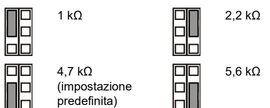

Off: Nessun allarme EOL integrato.

**JT: Impostazione resistenza antimanomissione (Rt) di fine linea (EOL) integrata**

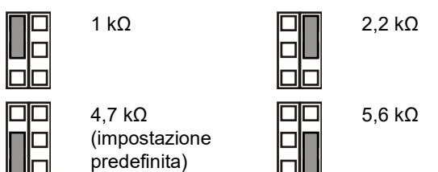

Off: Nessun allarme antimanomissione EOL integrato.

#### **Configurazione della zona**

Per configurare una zona, attenersi alla seguente procedura.

- Selezionare i valori appropriati per la resistenza di fine linea (EOL) utilizzando i jumper JA e JT. Ad esempio, attraverso il ponticello JT si determina il valore di Rt.
- Per le uscite isolate, rimuovere JT.
- Rimuovere i ponticelli JA e JT per escludere i valori di EOL integrati.

Per una singola zona con tutte le resistenze integrate impostate, la resistenza della zona può essere la seguente.

#### **Tabella 2: Valori di resistenza della zona**

| Stato zona                | Valore | Parametro predefinito |
|---------------------------|--------|-----------------------|
| Manomissione (breve)      | 0 Ω    | 0 Ω                   |
| Normale                   | Rt     | 4,7 kΩ                |
| Alarm (Allarme)           | Rt+Ra  | 9,4 kΩ                |
| Antimanomissione (aperto) | ∞      | ∞                     |

### **Interruttori DIP**

#### **Tabella 3: SW1, impostazioni generali**

| Switch                   | Valori                    |                         |
|--------------------------|---------------------------|-------------------------|
| 6: LED                   | Chiuso: LED acceso*       | Off: LED spento         |
| 5: Remoto                | Chiuso: Remote on         | Off: Remote off*        |
| 4: Riservato             |                           |                         |
| 3: Polarità              | Chiuso: Polarità positiva | Off: Polarità negativa* |
| 1, 2: Copertura radar | 1 On, 2 On: 12 m*         | 1 On, 2 Off: 6 m        |
|                          | 1 Off, 2 On: 9 m          | 1 Off, 2 Off: 4 m       |

* Impostazione predefinita

### **DIP switch SW1**

#### **SW1-1, SW1-2: Copertura radar**

Utilizzare i commutatori SW1-1 e SW1-2 per impostare la copertura del radar in modo che si adatti esattamente all'applicazione. Il radar è di tipo range-gating, di conseguenza l'intervallo di rilevamento è molto preciso.

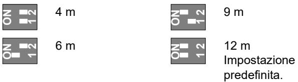

#### **SW1-3: Polarità**

Chiuso: Polarità positiva. Consente di configurare gli ingressi (WT e D/N) come "Attivo alto".

Off: Polarità negativa. Consente di configurare gli ingressi (WT e D/N) come "Attivo basso". Impostazione predefinita.

La funzionalità è spiegata nella Figura 10.

$$\mathbf{\color{red}{Figura 40}}$$

(1) Polarità alta (2) Polarità bassa

- (3) Test copertura (4) Giorno/notte
Questa funzione dipende anche dall'impostazione del commutatore SW1-5. Vedere "SW1-5: Funzionalità remota" più sotto.

#### **SW1-4: Riservato**

Non modificare il valore visualizzato.

#### **SW1-5: Funzionalità remota**

Chiuso: Remote on. Abilita il test di copertura e gli ingressi giorno/notte.

Off: Remote off. Disabilita il test di copertura e gli ingressi giorno/notte (impostazione predefinita).

La seguente funzionalità dipende dall'impostazione Remote.

|  | Tabella 4: Funzionalità che dipendono dall'impostazione Remote |
|--|----------------------------------------------------------------|
|--|----------------------------------------------------------------|

| Voce  | Descrizione        | SW1-5 Remote on                                        | SW1-5 Remote off |
|-------|--------------------|--------------------------------------------------------|------------------|
| SW1-3 | Polarità           | Selezionabile                                          | Solo positivo    |
| WT    | Ingresso WT        | Abilitato                                              | Disabilitato     |
| D/N   | Ingresso D/N       | Abilitato                                              | Disabilitato     |
| Altro | Modalità verde     | Abilitato in modo giorno senza test di copertura | Disabilitato     |
|       | Memoria allarme | Abilitato in modo giorno senza test di copertura | Disabilitato     |

Vedere anche "Collegamenti" a pagina 23.

#### **SW1-6: LED**

Chiuso: I LED sono abilitati. Per le funzionalità dei LED, vedere "LED e uscite" a pagina 25.

Off: I LED sono disabilitati per qualsiasi stato.

### **Selezione del campo schema di copertura**

- Rimuovere le maschere (Figure 8 e 9) se necessario. Lo schema modificato è mostrato sotto la configurazione delle maschere.
**Nota:** Se entrambe le maschere sono installate nel DD1012-N, il campo di copertura del sensore è limitato a 6 mt (impostazione di fabbrica) .

- Nel caso di un DD1012-N, modificare lo schema rimuovendo le parti di maschera ( mostrato in grigio nella Figura 8, oggetto1 ). I frammenti delle tende corrispondenti sono mostrati in Figura 8, oggetto 2.
- Mettere gli appropriati adesivi sullo specchio se necessario. Vedere Figura 7, oggetto 1 per dettagli.

**Attenzione:** La rimozione degli adesivi può danneggiare la superficie dello specchio.

- Quando ci sono oggetti vicino direttamente sotto il sensore, mettere la maschera all'interno della finestra (impostazioni di fabbrica). Questo disabilita la parte di tende che guardano in basso verso l'oggetto, la cui vicinanza potrebbe destabilizzare il sensore. Vedere Figura 7, oggetto 2.
### **Esecuzione del test di copertura del rilevatore**

Esistono due modi per attivare il modo test di copertura.

#### **SW1-6 impostato su LED on, SW1-5 impostato su Remote off**

In questa modalità l'indicazione mediante LED è sempre abilitata (modalità test di copertura costante).

#### **SW1-6 impostato su LED on, SW1-5 impostato su Remote on**

Questa impostazione consente di abilitare l'ingresso del test di copertura (pin 7) e l'ingresso giorno/notte (pin 8). Questo consente all'utente di attivare l'indicazione LED in remoto impostando il rilevatore in modo giorno e attivando il test di copertura.

### **Modalità verde**

Quando il commutatore SW1-5 è impostato su Remote on, il radar viene disattivato in modo giorno (senza test di copertura) per ridurre il consumo energetico. Il rilevatore quindi è attivo solo in modo PIR.

**Nota:** Per il funzionamento in questa modalità, la linea giorno/notte deve essere collegata alla centrale.

Questa modalità non è conforme alla norma EN 50131-2-4.

### **Memoria allarme**

Quando il commutatore SW1-5 è impostato su Remote on, gli allarmi verificatisi in modo notte vengono archiviati nel rilevatore. Sono indicati da un LED lampeggiante quando l'unità passa al modo giorno (test di copertura disattivato). La memoria viene cancellata quando il rilevatore ritorna al modo notte.

**Nota:** Impostare il commutatore SW1-6 su Off per impedire la visualizzazione della memoria degli allarmi sui LED. Vedere "SW1-6: LED" a pagina 24.

### **LED e uscite**

Per attivare la funzionalità dei LED, impostare il commutatore SW1-6 su On, altrimenti i LED rimangono disattivati in tutte le condizioni. Per ulteriori dettagli vedere "SW1-6: LED" a pagina 24.

#### **Tabella 5: LED e uscite**

| Stato                                  | LED rosso | Relè di allarme | Reset                                   |
|----------------------------------------|--------------|--------------------|-----------------------------------------|
| Avviamento                             |              | Chiuso             | Automatico dopo 60 s                    |
| Bassa tensione                         |              | Aperto             | Applicazione della tensione corretta |
| Allarme anti intrusione PIR            |              | Chiuso             |                                         |
| Allarme intrusione microonde        |              | Chiuso             |                                         |
| Allarme intrusione movimento doppio |              | Aperto             | Automatico dopo 3 s                     |
| Doppia memoria di allarme              |              | Chiuso             | Commutazione al modo notte           |
|                                        |              |                    |                                         |

Sempre acceso Lampeggio normale (1 Hz)

### **Specifiche**

| Tecnologia di rilevamento:                           |                                                                             |
|------------------------------------------------------|-----------------------------------------------------------------------------|
| DD1012 DD1012PI-N                                 | Doppio Doppio, non sensibile agli animali domestici                   |
| Range                                                | 4, 6, 9, 12 metri, selezionabili mediante i commutatori SW1-1 e SW1-2 |
| Angolo visivo                                        | 78 gradi                                                                    |
| Ottica PIR                                           | 9 tende a specchio ad alta densità                                          |
| Frequenza microonda                                  | 5725–5875 MHz                                                               |
| Massima potenza in uscita                            | 13,46 mW                                                                    |
| Max potenza uscita microonda a 1 m                | 0,003 μW/cm²                                                                |
| Funzionalità di memoria                              | Sì                                                                          |
| Corrente d'ingresso                                  | da 9 a 15 V (12 V nominali)                                                |
| Non sensibile all'ondulazione residua picco-picco | 2 V (a 12 V)                                                               |
| Tempo di avvio rilevatore                            | 60 s                                                                        |
| Consumo di corrente                                  | da 5 a 17 mA (9 mA nominali)                                                |
| Altezza di montaggio: DD1012-N DD1012PI-N      | da 1,8 a 2,6 m da 2,3 a 2,6 m                                            |
| Velocità di rilevamento                              | da 0,2 a 3,0 m/s                                                            |
| Relè antimanomissione/allarme (NC) caratt.        | 80 mA, 30 V, forma A                                                       |
| Tempo di allarme                                     | 3 s                                                                         |
| Temperatura di funzionamento                         | da −10 a +55°C                                                              |
| Umidità relativa                                     | 95% di umidità massima, senza condensa                                   |
| Peso                                                 | 120 g                                                                       |
| Dimensioni (A x L x P)                               | 126 × 63 × 50 mm                                                            |
| Grado di protezione IP/IK                            | IP30 IK04                                                                   |
| Protezione antirimozione                             | Opzionale (ST400)                                                           |

### **Informazioni sulle normative**

| Produttore                                                             | MESSO SUL MERCATO DA: Carrier Fire & Security Americas Corporation Inc. 13995 Pasteur Blvd Palm Beach Gardens, FL 33418, USA AUTORIZZATO RAPPRESENTANTE UE: Carrier Fire & Security B.V. Kelvinstraat 7, 6003 DH Weert, Netherlands                                                                                                                                                                                                                                                                                                                                                                                                                  |
|------------------------------------------------------------------------|------------------------------------------------------------------------------------------------------------------------------------------------------------------------------------------------------------------------------------------------------------------------------------------------------------------------------------------------------------------------------------------------------------------------------------------------------------------------------------------------------------------------------------------------------------------------------------------------------------------------------------------------------------------------|
| Avvertenze sul prodotto e dichiarazioni di non responsabilità | QUESTI PRODOTTI SONO DESTINATI ALLA VENDITA A, E DEVONO ESSERE MONTATI DA, UN ESPERTO QUALIFICATO. CARRIER FIRE & SECURITY NON PUÒ GARANTIRE CHE LE PERSONE O GLI ENTI CHE ACQUISTANO I SUOI PRODOTTI, COMPRESI I "RIVENDITORI AUTORIZZATI", DISPONGANO DELLA FORMAZIONE O ESPERIENZA ADEGUATE PER ESEGUIRE LA CORRETTA INSTALLAZIONE DI PRODOTTI PER LA SICUREZZA E PER LA PROTEZIONE ANTINCENDIO. Per ulteriori informazioni sulle esclusioni di garanzia e sulla sicurezza dei prodotti, consultare il sito https://firesecurityproducts.com/policy/product warning/ oppure eseguire la scansione del codice QR. |
|                                                                        | Carrier Fire & Security dichiara che questo dispositivo è conforme ai requisiti applicabili e alle disposizioni di tutte le norme e regolamenti applicabili, inclusi ma non limitati alla direttiva 2014/53/EU. Per ulteriori informazioni, vedere www.firesecurityproducts.com.                                                                                                                                                                                                                                                                                                                                                                        |
| REACH                                                                  | Il prodotto può contenere sostanze che sono anche sostanze appartenenti all'elenco di candidati per una concentrazione superiore allo 0,1% p / p, l'elenco dei candidati pubblicato più di recente è disponibile sul sito Web dell'ECHA. Informazioni sull'uso sicuro sono disponibili all'indirizzo https://firesecurityproducts.com/en/content/intrusi on-intro                                                                                                                                                                                                                                                                              |
|                                                                        | 2012/19/EU (Direttiva WEEE): I prodotti contrassegnati con questo simbolo, non possono essere smaltiti nei comuni contenitori per lo smaltimento rifiuti, nell' Unione Europea. Per il loro corretto smaltimento, potete restituirli al vostro fornitore locale a seguito dell'acquisto di un prodotto nuovo equivalente, oppure rivolgervi e consegnarli presso i centri di raccolta preposti. Per maggiori informazioni vedere: www.recyclethis.info                                                                                                                                                                                      |
| Documentazione Prodotto                                             | Consultare il seguente collegamento Web per recuperare la versione elettronica della documentazione del prodotto. Questo link ti guiderà alla pagina dei contatti regionali EMEA. In questa pagina è possibile richiedere l'accesso al portale Web protetto in cui sono memorizzati tutti i manuali. https://firesecurityproducts.com/en/contact                                                                                                                                                                                                                                                                                                  |

### **Informazioni di contatto**

www.firesecurityproducts.com o www.aritech.com.

## **NL: Installatieblad**

### **Beschrijving**

DD1012-N en DD1012PI-N zijn dual bewegingsdetectors. Ze combineren de gepatenteerde PIR-spiegeloptiektechnologie met de gepatenteerde Range Controlled Radar-technologie.

De DD1012PI-N is ontworpen om immuun te zijn voor bepaalde soorten en grote van dieren. Dieren tot 18 kg (ongeveer 35 cm groot) zorgen normaal niet voor problemen/alarmen bij een standaardtoepassing, behalve als ze zich hoger dan 35 cm van de vloer in het detectieveld bewegen.

### **Richtlijnen voor de installatie**

#### Zie afbeelding 1.

De detector dient aan de wand te worden gemonteerd maar kan ook op met behulp van een montagebeugel aan het plafond worden bevestigd.

Gebruik de volgende richtlijnen voor het bepalen van de beste locatie voor installatie van de detector.

- Monteer de detector zodanig dat de verwachte bewegingsrichting van een indringer dwarsdoor het detectiepatroon loopt (zie afbeelding 3).
- Monteer de detector op een stabiel oppervlak. Voor de toegestane montagehoogte, zie "Specificaties" op pagina 29.
- Plaats de detector niet binnen 0,5 m van metalen voorwerpen of binnen 1,5 m van TL-verlichting.
- Plaats geen voorwerpen voor de detector die het detectieveld kunnen blokkeren.
- Plaats detectors op ten minste 6 m van elkaar en gebruik de korte bereik instelling om storing te voorkomen.

De dual-technologie van deze detector voorkomt het risico van loze alarmen. Vermijd niettemin alle mogelijke oorzaken van instabiliteit, zoals:

#### PIR-invloeden:

- Rechtstreeks zonlicht op de detector
- Warmtebronnen binnen het dectieveld van de detector
- Veel tocht op de detector
- Dieren in het detectieveld (DD1012-N-detectors)
- Het detectieveld van de detector versperren met grote objecten, zoals meubels

#### Microgolf-invloeden:

- Montageplaats is onderhevig aan trillingen
- Metalen oppervlakken die de radargolven reflecteren
- Beweging van water door plastic buizen in het detectieveld of direct achter de detector
- Bewegende of trillende voorwerpen, zoals ventilatoren, verwarmingen of air-co's

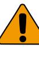

**WAARSCHUWING!** De apparatuur is niet geaard. Elk extern circuit dat op de apparatuur wordt aangesloten, moet zich in hetzelfde gebouw bevinden en zijn aangesloten op een beschermde aarde aansluiting.

Draadisolatie van kabels aangesloten op de apparatuur moet voldoen aan IEC 60332-1-2 en IEC 60332-1-3 of IEC 60332- 2-2, afhankelijk van de doorsnede van de ader, of IEC TS 60695-11-21, ongeacht van dwarsdoorsnede. Als alternatief moeten dergelijke kabels voldoen aan UL 2556 VW-1.

De voedingsbron van de detector moet met een vermogen van 15 W worden begrensd.

Wij adviseren om regelmatig een looptest van de detector uit te voeren en het resultaat op het controlepaneel te verifiëren.

**Ga als volgt te werk om de detector te installeren:**

- 1. Neem het afdekplaatje uit (zie afbeelding 2, item 1 en 2).
- 2. Maak de detector voorzichtig open met een schroevendraaier (zie afbeelding 2, items 2 en 3).

**Let op:** Raak de pyro-elektrische sensor niet aan (afbeelding 6).

- 3. Verwijder de schroef uit het deksel (afbeelding 4, item 2).
- 4. Monteer de achterkant tegen de muur. Voor de toegestane montagehoogte, zie "Specificaties" op pagina 29.

Zie afbeelding 4.

- Voor vlakke montage, gebruik ten minste twee schroeven (DIN 7998) in posities A.

- Gebruik voor hoekmontage schroeven in positie B of C.

- Als u de afneembeveiliging ST400 wilt installeren, gebruikt u montageposities A. De ST400-montagepositie wordt weergegeven als item 3 in afbeelding 4. Open de opening in de achterkant (afbeelding 5, item 2).

- 5. Sluit de bedrading van de detector aan (zie afbeeldingen 4 en 13). Gebruik de kabelopeningen (afbeelding 5, item 1) en kabelgoot (afbeelding 5, item 3) in de achterkant.
- 6. Selecteer de gewenste jumper- en DIP-switch instellingen (zie"De detector instellen" hieronder voor meer informatie.
- 7. Verwijder de maskers en voeg de stickers toe, indien nodig. Zie "Het detectie patroon configureren" op pagina 28 voor meer details.
- 8. Gebruik voor plafondmontage de SB01-montagebeugel. SB01-montageposities worden weergegeven als item 1 in afbeelding 34
- 9. Sluit de voorkant, plaats de schroef in de behuizing en plaats het afdekplaatje.

### **Aansluitingen**

Zie afbeelding 13.

#### **Tabel 1: Detectoraansluitingen**

| Aansluiting | Label        | Verklaring                                                                                                                                         |
|-------------|--------------|----------------------------------------------------------------------------------------------------------------------------------------------------|
| 1, 2        | GND, +12V | Voedingsaansluiting (9 t/m 15 V, 12 V nominaal)                                                                                               |
| 3, 4        | ALARM        | Alarmrelaisuitgang (33 Ω). Gebruik jumper JA om de ingebouwde EOL-weerstand in serie te plaatsen met het relais. Zie "Jumpers" hieronder. |

| Aansluiting | Label          | Verklaring                                                                                                                                                                                                                                                                                                    |  |
|-------------|----------------|---------------------------------------------------------------------------------------------------------------------------------------------------------------------------------------------------------------------------------------------------------------------------------------------------------------|--|
| 5, 6        | TAMPER         | Sabotagerelaisuitgang (0 Ω). Gebruik jumper JT om de ingebouwde EOL weerstand in serie te plaatsen met de schakelaar. Zie "Jumpers" hieronder.                                                                                                                                                       |  |
| 7           | Looptest       | Met deze ingang wordt de LED (looptest aan/uit) in- en uitgeschakeld. De looptestmodus kan alleen worden geactiveerd wanneer de detector zich in de dagmodus bevindt (pin 8). Actieve hoge of lage wordt bepaald door SW1-3 (zie "SW1- 3: (Polariteit)" op pagina 28).                      |  |
| 8           | Dag / nacht | Met deze ingang wordt de detector overgeschakeld in dag- (geheugen wordt opde LED-indicator getoond) of nachtmodus (alarmgeheugen wordt geactiveerd en eerder opgeslagen alarmen worden gewist). Actieve hoge of lage wordt bepaald door SW1-3 (zie "SW1-3: (Polariteit)" op pagina 28). |  |

#### **Opmerkingen**

- Ingangen 7 en 8 kunnen alleen worden gebruikt wanneer SW1-5 is ingesteld op Remote on (Extern aan). Zie "SW1- 5: (Externe functionaliteit)" op pagina 28.
- De LED is alleen ingeschakeld wanneer SW1-6 is ingesteld op LED on (LED aan).

In afbeelding 11 wordt uitgelegd hoe u een enkele ingang met meerdere weerstanden kunt instellen.

#### **Afbeelding 11**

- (1) Alarmrelais
- Ra Alarm EOL-weerstand Rt Sabotage EOL-weerstand
- (2) Alarmingang centrale (3) Sabotageswitchuitgang

## **De detector instellen**

Zie afbeelding 14 voor locaties van jumpers en DIP-switches.

#### **Jumpers**

Met de jumpers stelt u de ingebouwde EOL-mode en waarde in. Het circuit wordt weergegeven in afbeelding 11.

#### **JA: Ingebouwde alarm EOL-weerstand (Ra) instellen**

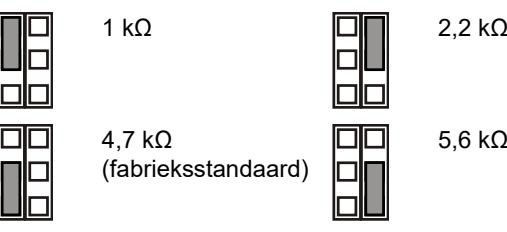

Off (Uit): Geen ingebouwde alarm EOL.

#### **JT: Ingebouwde sabotage EOL-weerstand (Rt) instellen**

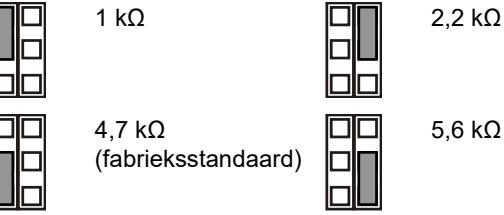

Off (Uit): Geen ingebouwde sabotage EOL.

#### **Ingang configureren**

Als u de ingang wilt instellen, past u de volgende selectie toe.

- Selecteer de correcte EOL-weerstandwaarden met JA en JT. Bijvoorbeeld, de instelling van jumper JT bepaalt de Rt-waarde.
- Verwijder JT voor geïsoleerde uitgangen.(enkel lus)
- Verwijder jumpers JA, en JT om ingebouwde EOLwaarden uit te sluiten.(geen ingebouwde eindweerstanden)

Voor een (dubbellus weerstand configuratie) ingang met alle ingebouwde weerstanden ingesteld, kan de ingangsweerstand de volgende zijn.

#### **Tabel 2: Weerstandswaarden ingang**

| Ingangsstatus   | Waarde | Standaard |
|-----------------|--------|-----------|
| Sabotage (kort) | 0 Ω    | 0 Ω       |
| Normaal         | Rt     | 4,7 kΩ    |
| Alarm           | Rt+Ra  | 9,4 kΩ    |
| Sabotage (open) | ∞      | ∞         |

### **Dipswitches**

#### **Tabel 3: SW1, algemene instellingen**

| Schakelaar        | Waarden                                  |                                        |
|-------------------|------------------------------------------|----------------------------------------|
| 6: LED            | On (Aan): LED aan*                       | Off (Uit): LED uit                     |
| 5: Extern         | On (Aan): Extern aan                     | Off (Uit): Extern uit*                 |
| 4: Gereserveerd   |                                          |                                        |
| 3: Polariteit     | On (Aan): Positieve polariteit        | Off (Uit): Negatieve polariteit*    |
| 1, 2: Radarbereik | 1 aan, 2 aan: 12 m* 1 uit, 2 aan: 9 m | 1 aan, 2 uit: 6 m 1 uit, 2 uit: 4 m |

* Fabrieksinstellingen

### **DIP-switch SW1**

### **SW1-1, SW1-2: Radar range (Radarbereik)**

Gebruik SW1-1 en SW1-2 om het radarbereik in te stellen dat precies bij het detectiebereik hoort. De radar is van het type Range-gating, wat betekent dat het detectiebereik bijzonder nauwkeurig is.

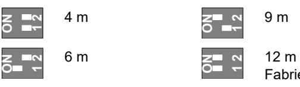

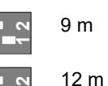

**1** 

Fabrieksinstelling

#### **SW1-3: (Polariteit)**

On (Aan): Positieve polariteit. Configureert de ingangen (WT en D/N) als "Active high" (Actieve hoog).

Off (Uit): Negatieve polariteit. Configureert de ingangen (WT en D/N) als "Active low" (Actieve laag). Fabrieksinstelling.

De functionaliteit wordt verklaard in afbeelding 10.

#### **Afbeelding 9**

| (1) | Polariteit hoog |
|-----|-----------------|
| (2) | Polariteit laag |

(3) Looptest (4) Dag/nacht

Deze functie is tevens afhankelijk van de SW1-5-instelling. Zie "SW1-5: (Externe functionaliteit)" hieronder.

#### **SW1-4: Niet gebruikt (Gereserveerd)**

Niet wijzigen.

**SW1-5: (Externe functionaliteit)**

On (Aan): Extern aan. Activeert WT en dag-/nachtingangen.

Off (Uit): Extern uit. Schakelt WT en dag-/nachtingangen uit (fabrieksinstelling).

De volgende functionaliteit is afhankelijk van de instelling voor Remote (Extern).

**Tabel 4: Functies zijn afhankelijk van de instelling Remote (Extern)**

| Item    | Beschrijving      | SW1-5 (Extern aan)                       | SW1-5 (Extern uit) |
|---------|-------------------|------------------------------------------|--------------------|
| SW1-3   | Polariteit        | Instelbaar                               | Alleen positief    |
| WT      | WT-ingang         | Ingeschakeld                             | Uitgeschakeld      |
| D/N     | D/N-ingang        | Ingeschakeld                             | Uitgeschakeld      |
| Overige | Groene mode       | Ingeschakeld in de dagmodus zonder WT | Uitgeschakeld      |
|         | Alarm geheugen | Ingeschakeld in de dagmodus zonder WT | Uitgeschakeld      |

Zie ook "Aansluitingen" op pagina 27.

#### **SW1-6: LED's**

On (Aan): LED's zijn ingeschakeld. Zie "LED's en uitgangen" op pagina 29 voor LED-functionaliteit.

Off (Uit): LED's zijn uitgeschakeld voor elke status.

### **Het detectie patroon configureren**

- Verwijder de blinders (Figuur 8 en 9) indien noodzakelijk. Het aangepaste bereik wordt getoond onder de blinder configuratie.
**Opmerking:** Indien beide blinders zijn geplaatst in de DD1012-N, heeft de detector een gelimiteerd PIR bereik tot 6 mtr. (standaard).

- In geval van de DD1012-N, pas het bereik aan door het verwijderen van de blinder, of delen van de blinder (getoond in figuur 8, punt 1). De bijbehorende gordijn velden, worden getoond in figuur 8, punt 2
- Plak de juiste spiegel stickers indien nodig. Zie afbeelding 7, punt 1 voor details.

**Let op:** Verwijderen van stickers kan het spiegel oppervlak beschadigen.

- Wanneer er stoor objecten zich direct onder de detector bevinden, plaats dan het masker aan de binnenkant van het venster (standaard). Hiermee schakelt u dat deel van het gordijnen uit, dat neer kijkt op het object, hierdoor kan de detector onstabiel worden. Zie afbeelding 7, punt 2.
#### **Looptest voor de detector uitvoeren**

U kunt op twee manieren overschakelen naar de looptestfunctie.

#### **SW1-6 ingesteld op (LED aan), SW1-5 ingesteld op (Extern uit)**

In deze modus is de LED-indicatie altijd ingeschakeld (constante looptestmodus).

Deze instelling activeert de looptestingang (pin 7) en de dag/nacht-ingang (pin 8). Hiermee kan de gebruiker extern deLED- activeren door de detector in de dagmodus in te stellen en de looptest te activeren.

### **Groene modus**

Wanneer SW1-5 is ingesteld op (Extern aan), wordt de radar uitgeschakeld gedurende de dagmode (zonder WT) om het stroomverbruik te reduceren. De detector werkt vervolgens alleen maar als PIR (enkel detector PIR).

**Opmerking:** De dag/nacht-lijn moet zijn aangesloten op de centrale om deze mode te kunnen gebruiken.

Deze modus voldoet niet aan de norm EN 50131-2-4.

### **Alarmgeheugen**

Wanneer SW1-5 is ingesteld op (Extern aan), worden de alarmen die gedurende de nacht zijn opgetreden opgeslagen in het detectorgeheugen. Ze worden aangeduid met een knipperende rode LED wanneer de centrale wordt overgeschakeld naar de dagmodus (looptest uitgeschakeld). Het geheugen wordt gewist wanneer de detector weer in de nachtmode wordt geschakeld.

**Opmerking:** Stel SW1-6 in op (Uit) om te voorkomen dat het alarmgeheugen op de LED's wordt weergegeven. Zie "SW1-6: LED's" op pagina 28.

### **LED's en uitgangen**

Als u de LED-functionaliteit wilt inschakelen, stelt u SW1-6 in op (Aan), anders zijn de LED's uitgeschakeld in iedere willekeurige conditie. Zie "SW1-6: LED's" op pagina 28 voor meer informatie.

#### **Tabel 5: LED's en uitgangen**

| Status                           | Rode LED | Alarm relais | Opnieuw instellen                   |
|----------------------------------|-------------|-----------------|-------------------------------------|
| Opstarten                        |             | Gesloten        | Automatisch na 60 sec               |
| Lage spanning                    |             | Open            | Correcte spanning toepassen      |
| PIR-inbraakalarm                 |             | Gesloten        |                                     |
| Microgolf inbraakalarm           |             | Gesloten        |                                     |
| Dubbele beweging inbraakalarm |             | Open            | Automatisch na 3 sec                |
| Dual alarm geheugen              |             | Gesloten        | Overschakelen naar de nachtmodus |

Continu aan Normaal knipperend (1 Hz)

### **Specificaties**

| Detectortechnologie: DD1012 DD1012PI-N | Dual Dual, immuun voor huisdieren           |
|----------------------------------------------|------------------------------------------------|
| Bereik                                       | 4, 6, 9, 12 m instelbaar via SW1-1 en SW1-2 |
| Kijkveld                                     | 78 graden                                      |
| PIR-optiek                                   | 9 spiegelgordijnen met hoge dichtheid       |
| Radarfrequentie                              | 5725–5875 MHz                                  |

| Maximale vermogen                          | 13,46 mW                       |
|--------------------------------------------|--------------------------------|
| Max. microgolfuitgang op 1 m               | 0,003 μW/cm²                   |
| Geheugenfunctie                            | Ja                             |
| Aansluitspanning                           | 9 t/m 15 V (12 V nominaal)    |
| Immuniteit rimpelspanning piek tot-piek | 2 V (bij 12 V)                |
| Opstarttijd detector                       | 60 sec                         |
| Stroomverbruik                             | 5 t/m 17 mA (9 mA nom.)        |
| Montagehoogte: DD1012-N DD1012PI-N   | 1,8 t/m 2,6 m 2,3 t/m 2,6 m |
| Bewegingsnelheid                           | 0,2 t/m 3,0 m/s                |
| Alarm (NC) / Sabotagerelais kenmerk     | 80 mA 30 V, Form A            |
| Alarmtijd                                  | 3 sec                          |
| Omgevingstemperatuur                       | −10 tot +55°C                  |
| Relatieve luchtvochtigheid                 | 95% max., niet-condenserend    |
| Gewicht                                    | 120 gr.                        |
| Afmetingen (H x B x D)                     | 126 × 63 × 50 mm               |
| IP/IK-klasse                               | IP30 IK04                      |
| Afneembeveiliging                          | Optioneel (ST400)              |

### **Regelgeving**

| Fabrikant                                                              | OP DE MARKT GEBRACHT DOOR: Carrier Fire & Security Americas Corporation Inc. 13995 Pasteur Blvd Palm Beach Gardens, FL 33418, USA GEAUTORISEERDE EU VERTEGENWOORDIGER: Carrier Fire & Security B.V. Kelvinstraat 7, 6003 DH Weert, Nederland                                                                                                                                                                                                                                                                                                                                                                        |
|------------------------------------------------------------------------|------------------------------------------------------------------------------------------------------------------------------------------------------------------------------------------------------------------------------------------------------------------------------------------------------------------------------------------------------------------------------------------------------------------------------------------------------------------------------------------------------------------------------------------------------------------------------------------------------------------------------------------|
| Waarschuwingen en disclaimers met betrekking tot de producten | DEZE PRODUCTEN ZIJN BEDOELD VOOR VERKOOP AAN EN INSTALLATIE DOOR GEKWALIFICEERDE BEROEPSKRACHTEN. CARRIER FIRE & SECURITY GEVEN GEEN GARANTIE DAT EEN PERSOON OF ENTITEIT DIE DIENS PRODUCTEN AANSCHAFT, WAARONDER "GEAUTORISEERDE DEALERS" OF "GEAUTORISEERDE WEDERVERKOPERS", OP DE JUISTE WIJZE ZIJN OPGELEID OF VOLDOENDE ERVARING HEBBEN OM PRODUCTEN MET BETREKKING TOT BRAND EN BEVEILIGING OP DE JUISTE WIJZE TE INSTALLEREN. Zie voor meer informatie over garantiebepalingen en productveiligheid https://firesecurityproducts.com/policy/product warning/ of scan de QR-code. |
| Certificatie                                                           |                                                                                                                                                                                                                                                                                                                                                                                                                                                                                                                                                                                                                                          |

Carrier Fire & Security verklaart hierbij dat dit apparaat voldoet aan de geldende eisen en bepalingen van alle toepasselijke regels en voorschriften, met inbegrip van maar niet beperkt tot de richtlijn 2014/53/EU. Voor meer informatie zie www.firesecurityproducts.com.

| Product kan stoffen bevatten die ook stoffen van de kandidatenlijst zijn in een concentratie van meer dan 0,1% w/w, volgens de meest recent gepubliceerde kandidatenlijst op ECHA-website. Informatie over veilig gebruik is te vinden op https://firesecurityproducts.com/en/content/intrusi on-intro                                                                                                                                      |
|---------------------------------------------------------------------------------------------------------------------------------------------------------------------------------------------------------------------------------------------------------------------------------------------------------------------------------------------------------------------------------------------------------------------------------------------------------------|
| 2012/19/EU (WEEE richtlijn): Producten met deze label mogen niet verwijdert worden via de gemeentelijke huisvuilscheiding in de Europese Gemeenschap. Voor correcte vorm van kringloop, geef je de producten terug aan jou locale leverancier tijdens het aankopen van een gelijkaardige nieuw toestel, of geef het af aan een gespecialiseerde verzamelpunt. Meer informatie vindt u op de volgende website: www.recyclethis.info |
| Raadpleeg de volgende weblink om de digitale versie van de productdocumentatie te downloaden.                                                                                                                                                                                                                                                                                                                                                           |
| Deze link leidt u naar de regionale contactpagina van EMEA. Op deze pagina kunt u uw login aanvragen bij de beveiligde webportal waar alle handleidingen zijn opgeslagen. https://firesecurityproducts.com/en/contact                                                                                                                                                                                                                             |
|                                                                                                                                                                                                                                                                                                                                                                                                                                                               |

### **Contactgegevens**

www.firesecurityproducts.com of www.aritech.com.

## **PL: Instrukcja instalacji**

### **Opis**

DD1012-N i DD1012PI-N to dualne czujki ruchu. Połączono w nich opatentowaną technologię optyki lustrzanej PIR z opatentowaną radarową technologią sterowania zasięgiem.

Czujka DD1012PI-N została zaprojektowana tak, że nie reaguje na zwierzęta domowe określonej wielkości i budowy. Zwierzęta o wadze do 18 kg (około 35 cm wysokości) zwykle nie stwarzają żadnych problemów w standardowych zastosowaniach, o ile nie mogą stanąć wyżej niż 35 cm od podłogi w polu widzenia czujki.

### **Instalacja - wskazówki**

#### Patrz rysunek 1.

Czujka jest przeznaczona do montażu na ścianie, ale przy zastosowaniu uchwytu mocującego można ją też zamontować na suficie.

Poniższe wskazówki pomogą określić najlepsze miejsce instalacji czujki.

- Czujkę należy zamontować w taki sposób, aby oczekiwany kierunek ruchu intruza przecinał obszar wykrywania (patrz rys. 3).
- Czujkę DD1012-N należy zamontować na stabilnej powierzchni. Dopuszczalna wysokość montażu jest podana w sekcji "Dane techniczne" na stronie 33.
- Czujki nie należy montować w odległości do 0,5 m od metalowych obiektów lub w odległości do 1,5 m od lamp fluorescencyjnych.
- Z przodu czujki nie należy umieszczać obiektów, które mogłyby zasłaniać pole widzenia.
- Czujki należy umieścić w odległości co najmniej 6 m od siebie. Jeśli czujki są montowane naprzeciwko siebie, aby zapobiec zakłóceniom, należy użyć ustawienia krótkiego zasięgu.

Technologia podwójnego przetwarzania zastosowana w niniejszej czujce zabezpiecza ją przed fałszywymi alarmami. Należy jednak unikać potencjalnych przyczyn niestabilności, takich jak:

Zakłócenia związane z technologią PIR:

- Światło słoneczne padające bezpośrednio na czujkę
- Źródła ciepła w polu widzenia czujki
- Silne strumienie powietrza skierowane na czujkę
- Zwierzęta w polu widzenia (czujki DD1012-N)
- Przesłonięcie pola widzenia czujki przez duże przedmioty, takie jak meble

Zakłócenia mikrofalowe:

- Powierzchnia mocowania wrażliwa na drgania
- Powierzchnie metalowe odbijające energię mikrofalową
- Ruch wody przez plastikowe rury
- Poruszające się lub drgające przedmioty, takie jak wentylatory bądź rury ogrzewania lub klimatyzacji

**OSTRZEŻENIE!** Urządzenie nie jest uziemione. Każdy obwód zewnętrzny podłączony do czujki musi w całości znajdować się wewnątrz tego samego budynku i być uziemione za pomocą dedykowanego zacisku uziemienia.

Izolacja kabli podłączonych do urządzenia powinno odpowiadać wymogom norm IEC 60332-1-2 oraz IEC 60332- 1-3 lub IEC 60332-2-2, w zależności od przekroju kabla, albo IEC TS 60695-11-21 niezależnie od przekroju. Ewentualnie te kable muszą spełniać wymogi normy UL 2556 VW-1.

Moc źródła zasilania czujki musi być ograniczona do 15 W.

Zalecamy regularne testowanie czujki i sprawdzanie za pomocą centrali.

**Aby zamontować czujkę, należy wykonać następujące czynności:**

- 1. Unieś przesłony kurtyn (patrz rys. 2, poz. 1 i 2).
- 2. Otwórz czujkę, podważając ją ostrożnie wkrętakiem (patrz rys. 2, poz. 3 i 4).

**Uwaga:** Nie należy dotykać czujnika piroelektrycznego (rys. 6).

- 3. Wyjmij śrubę pokrywy (rys. 4, poz. 2).
- 4. Przymocuj podstawę czujki do ściany. Dopuszczalna wysokość montażu jest podana w sekcji "Dane techniczne" na stronie 33.

Patrz rysunek 4.

- W przypadku montażu płaskiego użyj co najmniej dwóch śrub (DIN 7998), umieszczając je w pozycji A.

- W przypadku montażu narożnego użyj śrub w pozycji B lub C.

- Aby zainstalować zabezpieczenie przed oderwaniem ST400, użyj pozycji montażowej A. Pozycja montażowa elementu ST400 jest pokazana jako poz. 3 na rys. 4. Otwórz wylot w płycie tylnej (rys. 5, poz. 2).

- 5. Podłącz okablowanie czujki (patrz rys. 4 i 13). Użyj wlotów kablowych w płycie tylnej (rys. 5, poz. 1) i kanału kablowego (rys. 5, poz. 3).
- 6. Wybierz żądane ustawienia zworek i przełączników DIP (patrz "Konfiguracja czujki" niżej, aby uzyskać więcej informacji).
- 7. W razie potrzeby, należy usunąć przesłony i nakleić wyklejki. Zobacz rozdział "Kszałtowanie charakterystyki pokrycia czujki" na stronie 32 w celu uzyskania szczegółów.
- 8. W przypadku montażu do sufitu zastosuj wspornik obrotowy SB01. Pozycja montażowa wspornika SB01 jest pokazana jako poz. 1 na rys. 4.
- 9. Zamknij pokrywę, wsuń śrubę pokrywy i załóż przesłony kurtyny.

### **Połączenia**

#### Patrz rysunek 13.

#### **Tabela 1: Połączenia czujki**

| Styk | Oznaczenie | Objaśnienie                                                                                                                                                                                                                                                                                                                  |
|------|------------|------------------------------------------------------------------------------------------------------------------------------------------------------------------------------------------------------------------------------------------------------------------------------------------------------------------------------|
| 1, 2 | GND, +12V  | Połączenie zasilania (od 9 do 15 V, nominalnie 12 V)                                                                                                                                                                                                                                                                    |
| 3, 4 | ALARM      | Wyjście przekaźnikowe alarmowe (33 Ω). Za pomocą zworki JA ustaw wbudowany rezystor EOL szeregowo z przekaźnikiem. Patrz "Zworki" niżej.                                                                                                                                                                            |
| 5, 6 | TAMPER     | Wyjście przełącznikowe sabotażowe (0 Ω). Za pomocą zworki JT ustaw wbudowany rezystor EOL szeregowo z przełącznikiem. Patrz"Zworki" niżej.                                                                                                                                                                          |
| 7    | Walk test  | To wejście włącza i wyłącza diodę LED (test przejścai (walk test) wł./wył.). Tryb testu przejściao można włączyć tylko wówczas, gdy czujka działa w trybie dziennym (styk 8). O tym, czy aktywna jest polaryzacja wysoka czy niska, decyduje przełącznik SW1-3 (patrz "SW1-3: Polaryzacja" na stronie 32). |
| 8    | Day/Night  | To wejście przełącza czujkę w tryb dzienny (ukazanie pamięci na wskaźniku LED) lub nocny (aktywacja pamięci alarmów i skasowanie wcześniej zapisanych alarmów). O tym, czy aktywna jest polaryzacja wysoka czy niska, decyduje przełącznik SW1-3 (patrz "SW1-3: Polaryzacja" na stronie 32).               |

#### **Uwagi**

- Wejść 7 i 8 można użyć tylko wówczas, gdy przełącznik SW1-5 jest ustawiony na Zdalne zał. Patrz "SW1-5: Funkcje sterowane zdalnie" na stronie 32.
- Dioda LED jest włączona tylko wówczas, gdy przełącznik SW1-6 jest ustawiony na Dioda LED zał.

Na rys. 11 pokazano, jak skonfigurować pojedynczą linie w konfiguracji wielorezystorowej.

#### **Rysunek 11**

- (1) Przekaźnik alarmowy
- Ra Rezystor alarmowy EOL
- (2) Strefa alarmowa (3) Wyjście przełącznikowe sabotażowe
- Rt Rezystor sabotażowy EOL

- **Zworki**
rys. 14.

**Konfiguracja czujki**

Zworki służą do ustawiania trybu i wartości wbudowanego rezystora EOL. Jego obwód pokazano na rys. 11.

Lokalizację zworek i przełączników DIP przedstawiono na

#### **JA: Konfiguracja wbudowanego rezystora EOL alarmowego (Ra)**

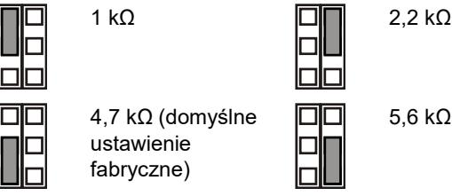

Wył.: Brak wbudowanego rezystora EOL alarmowego.

### **JT: Konfiguracja wbudowanego rezystora EOL sabotażowego (Rt)**

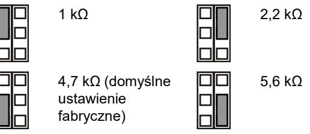

Wył.: Brak wbudowanego rezystora EOL sabotażowego.

### **Konfigurowanie linii**

Aby skonfigurować linię, należy skorzystać z poniższych wskazówek.

- Wybierz odpowiednie wartości rezystora EOL za pomocą zworek JA i JT. Na przykład za pomocą zworki JT można określić wartość Rt.
- W przypadku wyjść izolowanych wyjmij zworkę JT.
- Aby wykluczyć wewnętrzne rezystory EOL, wyjmij zworki JA i JT.

W przypadkuj linii z ustawionymi wszystkimi rezystorami wbudowanymi rezystancja linii może mieć poniższe wartości.

#### **Tabela 2: Wartości rezystancji linii**

| Wartość | Domyślnie |  |  |
|---------|-----------|--|--|
| 0 Ω     | 0 Ω       |  |  |
| Rt      | 4,7 kΩ    |  |  |
| Rt+Ra   | 9,4 kΩ    |  |  |
| ∞       | ∞         |  |  |
|         |           |  |  |

### **Przełączniki DIP**

#### **Tabela 3: SW1, ustawienia ogólne**

| Przełącznik      | Wartości                      |                              |
|------------------|-------------------------------|------------------------------|
| 6: Dioda LED     | Zał.: Dioda LED zał.*         | Wył.: Dioda LED wył.         |
| 5: Zdalne        | Zał.: Zdalne zał.             | Wył.: Zdalne wył.*           |
| 4: Zarezerwowany |                               |                              |
| 3: Polaryzacja   | Zał.: Polaryzacja dodatnia | Wył.: Polaryzacja ujemna* |

| Przełącznik         | Wartości              |                     |
|---------------------|-----------------------|---------------------|
| 1, 2: Zasięg radaru | 1 zał., 2 zał.: 12 m* | 1 zał., 2 wył.: 6 m |
|                     | 1 wył., 2 zał.: 9 m   | 1 wył., 2 wył.: 4 m |

* Domyślne ustawienie fabryczne

### **Przełącznik DIP SW1**

#### **SW1-1, SW1-2: Zasięg radaru**

Za pomocą przełączników SW1-1 i SW1-2 można ustawić zasięg radaru odpowiednio do zastosowania. Jest to radar z regulacją zasięgu, przez co zasięg wykrywania jest bardzo dokładny.

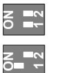

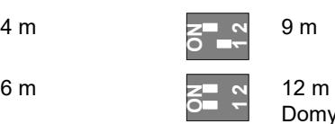

Domyślne ustawienie fabryczne.

#### **SW1-3: Polaryzacja**

Zał.: Polaryzacja dodatnia. Konfiguruje wejścia (WT i D/N) jako "Active high" (Aktywna polaryzacja wysoka).

Wył.: Polaryzacja ujemna. Konfiguruje wejścia (WT i D/N) jako "Active low" (Aktywna polaryzacja niska). Domyślne ustawienie fabryczne.

Funkcję objaśniono na rys. 10.

#### **Rysunek 10**

- (1) Polaryzacja wysoka
- (3) Test przejścia (walk test)
- (2) Polaryzacja niska
- (4) Dzień/noc

Ta funkcja zależy także od ustawienia przełącznika SW1-5. Patrz "SW1-5: Funkcje sterowane zdalnie" niżej.

#### **SW1-4: Zarezerwowany**

Tego ustawienia nie należy zmieniać.

#### **SW1-5: Funkcje sterowane zdalnie**

Zał.: Zdalne zał. Włącza wejścia WT i dzień/noc.

Wył.: Zdalne wył. Wyłącza wejścia WT i dzień/noc (domyślne ustawienie fabryczne).

Poniższe funkcje zależą od ustawienia Zdalne.

#### **Tabela 4: Funkcje zależne od ustawienia Zdalne**

| Lp.   | Opis          | SW1-5 Zdalne zał.                    | SW1-5 Zdalne wył. |
|-------|---------------|--------------------------------------|-------------------|
| SW1-3 | Polaryzacja   | Możliwość wyboru                     | Tylko dodatnia    |
| WT    | Wejście WT    | Włączone                             | Wyłączone         |
| D/N   | Wejście D/N   | Włączone                             | Wyłączone         |
| Inne  | Tryb eko      | Włączony w trybie dziennym bez WT | Wyłączony         |
|       | Pamięć alarmu | Włączona w trybie dziennym bez WT | Wyłączona         |

Patrz również "Połączenia" na stronie 31.

#### **SW1-6: Diody LED**

Zał.: Diody LED włączone. Funkcje diod LED — patrz "Diody LED i wyjścia" na stronie 33.

Wył.: Diody LED wyłączone w każdym stanie.

### **Kszałtowanie charakterystyki pokrycia czujki**

- Usuń przesłony w razie potrzeby (rysunki 8 i 9). Zmodyfikowane charaktetystyki są pokazane pod rysunkami konfiguracji przesłon.
**Uwaga:** jeżeli obie przesłony pozostaną założone w czujce DD1012-N, jej zasięg jest ograniczony do 6 m (domyślnie).

- W przypadku czujki DD1012-N możliwa jest modyfikacja charakterystyki przez wyłamywanie części przesłony (pokazane jako wyszarzone fragmenty na rysunku 8, pozycja 1). Odpowiadające fragmenty kurtyn są pokazane na rysunku 8, pozycja 2.
- Naklej wyklejki na lustra w celu zamaskowania części kurtyny. Zobacz szczegóły na rysunku 7, pozycja 1.
	- **Przestroga:** Usuwanie naklejonych elementów może uszkodzić powierzchnię lustra.
- Jeżeli bezpośrednio pod czujką znajdują się przeszkody, należy założyć odpowiednią przesłonę (jest założona domyślnie). Zobacz rysunek 7, pozycja 2.

### **Testowanie czujki**

Istnieją dwa sposoby włączenia trybu testu przejścia.

**Przełącznik SW1-6 ustawiony na "Dioda LED zał.", przełącznik SW1-5 na "Zdalne wył."**

W tym trybie sygnalizacja LED jest zawsze włączona (stały tryb testu przejścia).

**Przełącznik SW1-6 ustawiony na "Dioda LED zał.", a przełącznik SW1-5 na "Zdalne zał."**

Przy tym ustawieniu włączone jest wejście testu przejścia (styk 7) i wejście dzień/noc (styk 8). Umożliwia to użytkownikowi zdalne włączenie sygnalizacji LED przez przestawienie czujki w tryb dzienny oraz aktywację testu przejścia.

### **Tryb ekologiczny**

Gdy przełącznik SW1-5 jest ustawiony na Zdalne zał., radar jest wyłączony w trybie dziennym (bez WT) w celu ograniczenia poboru prądu. Czujka działa wówczas tylko w trybie PIR.

**Uwaga:** Aby ten tryb działał, linia dzień/noc musi być podłączona do centrali.

Ten tryb nie jest zgodny ze standardem EN 50131-2-4.

### **Pamięć alarmu**

Gdy przełącznik SW1-5 jest ustawiony na Zdalne zał., alarmy, które wystąpiły w trybie nocnym, są zapisywane w pamięci czujki. Są one sygnalizowane przez migającą na czerwono diodę LED po przełączeniu urządzenia w tryb dzienny (test przejściowy wyłączony). Pamięć jest czyszczona po ponownym przełączeniu czujki w tryb nocny.

**Uwaga:** Aby zapobiec pokazywaniu pamięci alarmu przez diody LED, należy ustawić przełącznik SW1-6 na Wył. Patrz "SW1-6: Diody LED" wyżej.

### **Diody LED i wyjścia**

Aby włączyć funkcje diod LED, należy ustawić przełącznik SW1-6 na Zał.; w przeciwnym razie diody LED będą wyłączone w każdym stanie. Aby uzyskać więcej szczegółów, patrz "SW1-6: Diody LED" na stronie 32.

#### **Tabela 5: Diody LED i wyjścia**

| Status                                     | Czerwona dioda LED | Przekaźnik alarmowy | Resetowanie                     |
|--------------------------------------------|-----------------------|------------------------|---------------------------------|
| Uruchomienie                               |                       | Zwarty                 | Automatycznie po 60 s.       |
| Niskie napięcie                            |                       | Rozwarty               | Zastosuj prawidłowe napięcie |
| Alarm intruza PIR                          |                       | Zwarty                 |                                 |
| Alarm intruza mikrofalowy                  |                       | Zwarty                 |                                 |
| Podwójny alarm wykrywania ruchu intruza |                       | Rozwarty               | Automatycznie po 3 s.        |
| Pamięć alarmu z dwóch czujników         |                       | Zwarty                 | Przełącz w tryb nocny           |
| Świeci w sposób ciągły                     |                       | Miga normalnie (1 Hz)  |                                 |

## **Dane techniczne**

| Technologia czujki:                                 |                                                                   |
|-----------------------------------------------------|-------------------------------------------------------------------|
| DD1012 DD1012PI-N                                | Dualna Dualna, niereagująca na zwierzęta domowe             |
| Zasięg                                              | 4, 6, 9, 12 m, wybierany za pomocą przełączników SW1-1 i SW1-2 |
| Kąt widzenia                                        | 78 stopni                                                         |
| Optyka PIR                                          | 9 kurtyn lustrzanych o wysokiej gęstości                          |
| Częstotliwość mikrofalowa                           | 5725–5875 MHz                                                     |
| Maskymalna moc wyjściowa                            | 13,46 mW                                                          |
| Maks. moc wyjściowa mikrofal przy 1 m            | 0,003 μW/cm²                                                      |
| Funkcja pamięci                                     | Tak                                                               |
| Zasilanie                                           | od 9 do 15 V (nominalnie 12 V)                                   |
| Odporność na tętnienia                              | 2 V (przy 12 V)                                                  |
| Czas uruchamiania czujki                            | 60 s                                                              |
| Pobór prądu                                         | od 5 do 17 mA (nominalnie 9 mA)                                   |
| Wysokość montażu:                                   |                                                                   |
| DD1012-N                                            | od 1,8 do 2,6 m                                                   |
| DD1012PI-N                                          | od 2,3 do 2,6 m                                                   |
| Zakres prędkości celu                               | od 0,2 do 3,0 m/s                                                 |
| Charakterystyka przekaźnika Alarm (NC) / Sabotaż | 80 mA 30 V, Typ A                                                |
| Czas alarmu                                         | 3 s                                                               |
| Temperatura pracy                                   | od −10 do +55°C                                                   |
| Wilgotność względna                                 | maks. 95%, bez kondensacji                                        |
| Waga                                                | 120 g                                                             |
| Wymiary (S x W x G)                                 | 126 × 63 × 50 mm                                                  |
| Klasa IP/IK                                         | IP30 IK04                                                         |
| Zabezpieczenie przed oderwaniem                  | Opcjonalne (ST400)                                                |

### **Informacje prawne**

| Producent                                              | WPROWADZONE NA RYNEK PRZEZ: Carrier Fire & Security Americas Corporation Inc. 13995 Pasteur Blvd Palm Beach Gardens, FL 33418, USA AUTORYZOWANY PRZEDSTAWICIEL NA TERENIE UE: Carrier Fire & Security B.V.                                                                                                                                                                                                                                                                                                                                                                                                                                 |
|--------------------------------------------------------|--------------------------------------------------------------------------------------------------------------------------------------------------------------------------------------------------------------------------------------------------------------------------------------------------------------------------------------------------------------------------------------------------------------------------------------------------------------------------------------------------------------------------------------------------------------------------------------------------------------------------------------------------------------|
| Ostrzeżenia i zastrzeżenia dotyczące produktu | Kelvinstraat 7, 6003 DH Weert, Holandia TEN PRODUKT JEST PRZEZNACZONY DO SPRZEDAŻY I MONTAŻU PRZEZ WYKWALIFIKOWANYCH SPECJALISTÓW. CARRIER FIRE & SECURITY NIE UDZIELA ŻADNEJ GWARANCJI, ŻE JAKAKOLWIEK OSOBA LUB JAKIKOLWIEK PODMIOT NABYWAJĄCY JEJ PRODUKTY, W TYM "AUTORYZOWANI SPRZEDAWCY" ORAZ "AUTORYZOWANI DEALERZY", SĄ PRAWIDŁOWO PRZESZKOLENI LUB DOŚWIADCZENI TAK, BY MOGLI PRAWIDŁOWO ZAMONTOWAĆ PRODUKTY ZABEZPIECZAJĄCE. Więcej informacji o zastrzeżeniach dotyczących gwarancji oraz bezpieczeństwa produktów można przeczytać na stronie https://firesecurityproducts.com/policy/product |
|                                                        | warning/ lub po zeskanowaniu kodu QR. Carrier Fire & Security niniejszym deklaruje zgodność urządzenia ze wszystkimi wymaganiami wszystkich stosownych dyrektyw,                                                                                                                                                                                                                                                                                                                                                                                                                                                                                    |
|                                                        | lącznie z, lecz nie ograniczając się do, Dyrektywą 2014/53/EU. Więcej informacji na stronie www.firesecurityproducts.com.                                                                                                                                                                                                                                                                                                                                                                                                                                                                                                                              |
| REACH                                                  | Produkt może zawierać substancje, które znajdują się na liście kandydackiej, w stężeniu powyżej 0,1% wag., zgodnie z ostatnio opublikowaną listą kandydacką na stronie internetowej ECHA. Informacje na temat bezpiecznego użytkowania można znaleźć na stronie https://firesecurityproducts.com/en/content/intrusi on-intro                                                                                                                                                                                                                                                                                                         |
|                                                        | 2012/19/EU (dyrektywa WEEE): Na terenie Unii Europejskiej produktów oznaczonych tym znakiem nie wolno wyrzucać wraz z odpadami miejskimi. W celu zapewnienia prawidłowego recyklingu produkt należy oddać lokalnemu sprzedawcy lub przekazać do wyznaczonego punktu zbiórki. Aby uzyskać więcej informacji, patrz: www.recyclethis.info                                                                                                                                                                                                                                                                                                 |
| Dokumentacja produktu                               | Zapoznaj się z poniższym linkiem, aby pobrać elektroniczne wersje dokumentacji produktu. Ten link prowadzi do regionalnej strony kontaktowej w regionie EMEA. Na tej stronie możesz wnioskować o login do bezpiecznego portalu internetowego, na którym przechowywane są wszystkie instrukcje. https://firesecurityproducts.com/en/contact                                                                                                                                                                                                                                                                                              |

### **Informacje kontaktowe**

www.firesecurityproducts.com lub www.aritech.com.

## **PT: Ficha de Instalação**

### **Descrição**

DD1012-N e DD1012PI-N são sensores de movimento duplo. Combinam a tecnologia patenteada PIR de óptica de espelho com a tecnologia patenteada "Range Controlled Radar".

O DD1012PI-N foi concebido para oferecer imunidade a animais domésticos, até um determinado tamanho e constituição dos mesmos. Os animais domésticos com um peso até 18 kg (cerca de 35 cm de altura) normalmente não causam problemas na aplicação padrão, a menos que ultrapassem a altura de 35 cm a partir do solo no campo de visão de detecção.

### **Conselhos de instalação**

#### Ver a figura 1.

O detector destina-se a ser montado na parede, embora possa ser instalado também no tecto, utilizando um suporte de montagem.

Utilize as directrizes que se seguem para determinar a melhor localização para a instalação do detector.

- Instale o detector de modo que o movimento previsto de um intruso atravesse o padrão de detecção (consulte a Figura 3).
- Instale o detector numa superfície estável. Para a altura de montagem permitida, ver "Especificações" na página nº 37.
- Não instale o detector a menos de 0,5 m de objectos metálicos ou a menos de 1,5 m de luzes fluorescentes.
- Não coloque objectos à frente do detector que possam impedir uma linha de visão clara.
- Instale os detectores a uma distância mínima de 6 m uns dos outros, e utilize a definição de curto alcance para evitar interferências ao montar os detectores virados um para o outro.

A tecnologia de duplo processamento deste detector é muito resistente ao perigo de falsos alarmes. No entanto, evite potenciais causas de instabilidade, tais como:

#### Perigos PIR:

- Luz solar directa no detector
- Fontes de calor dentro do campo de visão do detector
- Correntes de ar fortes que incidam no detector
- Animais dentro do campo de visão (detectores DD1012- N
- Obscurecimento do campo de visão do detector devido a objectos de grandes dimensões, tais como peças de mobiliário

Perigos relacionados com microondas:

- Superfície de instalação susceptível a vibrações
- Superfícies metálicas que reflictam a energia das microondas
- Movimento da água nos tubos de plástico
- Objectos em movimento ou que vibrem, tais como ventoinhas e canais de aquecimento ou ar condicionado

**AVISO!** O equipamento não se encontra ligado à terra. Qualquer circuito externo ligado ao equipamento deve estar localizado no interior do mesmo edifício e ligado a um condutor de terra.

O isolamento dos condutores ligados ao equipamento devem estar em conformidade com a IEC 60332-1-2 e IEC 60332-1- 3 ou IEC 60332-2-2, dependendo da área da secção transversal do condutor, ou com a IEC TS 60695-11-21, independentemente da área transversal. Em alternativa, os condutores devem estar em conformidade com a norma UL 2556 VW-1.

A fonte de alimentação do detetor deve ser limitada a 15 W de potência.

Recomenda-se fazer regularmente um walk test ao detector e uma verificação no painel de controlo.

**Para instalar o detector:**

- 1. Retire o insert personalizável (consulte a Figura 2, itens 1 e 2).
- 2. Inserindo uma chave de parafusos, abra cuidadosamente o detector (consulte a Figura 2, itens 3 e 4).

**Cuidado:** não toque no sensor piroeléctrico (Figura 5).

- 3. Retire o parafuso da tampa (Figura 4, item 2).
- 4. Fixe a base à parede. Para a altura de montagem permitida, ver "Especificações" na página nº 37.

Ver a figura 4.

- Para uma montagem plana, utilize um mínimo de dois parafusos (DIN 7998) nas posições A.

- Para montagem de canto, utilize parafusos na posição B ou C.

- Para instalar a tamper de remoção ST400, utilize as posições de montagem A. A posição de montagem ST400 é mostrada como o item 3 na Figura 4. Abra a saída na chapa traseira (Figura 5, item 2).

- 5. Ligue os cabos eléctricos do detector (consulte as Figuras 4 e 13). Utilize as entradas de cabos na chapa traseira (Figura 5, item 1) e o canal de cabos (Figura 5, item 3).
- 6. Seleccione o jumper desejado e as configurações dos DIP switches (consulte "Configuração do detector" na página nº 35 para obter mais informações).
- 7. Remova as máscaras e coloque os autocolantes, se necessário. Para mais informação, consultar "Configurar padrão de cobertura" na página nº 36.
- 8. Para aplicações em tectos, utilize o suporte de montagem rotativo SB01. A posição de montagem SB01 é mostrada como o item 1 na Figure 4.
- 9. Feche a tampa, insira o parafuso da tampa e coloque o insert personalizável.

### **Ligações**

#### Ver a figura 13.

#### **Tabela 1: Ligações do detector**

| Terminal | Etiqueta       | Explicação                                                                                                                                                                                                                                                                                   |
|----------|----------------|----------------------------------------------------------------------------------------------------------------------------------------------------------------------------------------------------------------------------------------------------------------------------------------------|
| 1, 2     | GND, +12V   | Ligação da fonte de alimentação (9 a 15 V, 12 V nominal)                                                                                                                                                                                                                                |
| 3, 4     | ALARM          | Saída de relé de alarme (33 Ω). Utilize o jumper JA para configurar a resistência EOL integrada em série com o relé. Consulte "Jumpers" abaixo.                                                                                                                                     |
| 5, 6     | TAMPER         | Saída de interruptor tamper (0 Ω). Utilize o jumper JT para configurar a resistência EOL integrada em série com o interruptor. Consulte "Jumpers" abaixo.                                                                                                                           |
| 7        | Walk test      | Esta entrada activa e desactiva o LED (walk test On/Off). Só é possível entrar no modo de walk test quando o detector está no modo Dia (pino 8). Active high ou low é determinado por SW1-3 (consulte "SW1-3: Polaridade" na página nº 36).                                   |
| 8        | Day / Night | Esta entrada alterna o detector no modo dia (mostra a memória no indicador LED) ou noite (activa a memória de alarmes e limpa os alarmes anteriormente guardados). A polaridade active high ou low é determinada por SW1-3 (consulte "SW1-3: Polaridade" na página nº 36). |

#### **Notas**

- As entradas 7 e 8 só podem ser utilizadas quando SW1-5 estiver configurado como Remoto ligado. Consulte "SW1- 5: Funcionalidade remota" na página nº 36.
- O LED só é activado quando SW1-6 está configurado como LED ligado.

A Figura 11 explica como criar uma zona única com uma configuração de resistência múltipla.

#### **Figura 11**

- (1) Relé de alarme
tamper

- (2) Zona de alarme (3) Saída do interruptor de
- Ra Resistência EOL de alarme Rt Resistência EOL de tamper
- **Configuração do detector**

Consulte a Figura 14 para ver as localizações dos jumpers e DIP switches.

### **Jumpers**

Os jumpers definem o modo e o valor do EOL integrado. O circuito é mostrado na Figura 11.

|  |  | JA: definir a resistência EOL de alarmes integrada (Ra) |  |  |  |  |
|--|--|---------------------------------------------------------|--|--|--|--|
|--|--|---------------------------------------------------------|--|--|--|--|

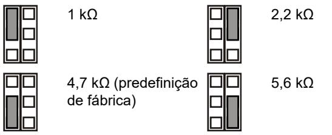

Off (Desligado): sem EOL de alarme integrado.

**JT: definir a resistência EOL de tamper integrada (Rt)**

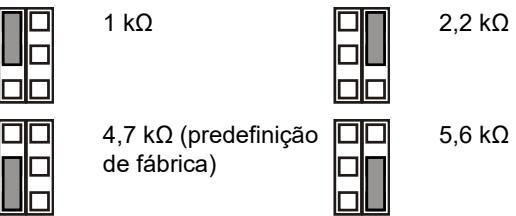

Off (Desligado): sem EOL de tamper integrado.

#### **Configuração da zona**

Para configurar a zona, aplique as directrizes seguintes:

- Seleccione os valores da resistência EOL aplicáveis com JA e JT. Por exemplo, a definição do jumper JT determina o valor Rt.
- Para saídas isoladas, remova JT.
- Remova os jumpers JA e JT para excluir os valores de EOL integrado.

Para uma zona única com todas as resistências integradas definidas, a resistência de zona pode ser a seguinte:

#### **Tabela 2: Valores de resistência de zona**

| Estado da zona  | Valor | Valor predefinido |
|-----------------|-------|-------------------|
| Tamper (curto)  | 0 Ω   | 0 Ω               |
| Normal          | Rt    | 4,7 kΩ            |
| Alarme          | Rt+Ra | 9,4 kΩ            |
| Tamper (aberto) | ∞     | ∞                 |

### **DIP switches**

#### **Tabela 3: SW1, definições gerais**

| Interruptor            | Valores                                                                |                                          |
|------------------------|------------------------------------------------------------------------|------------------------------------------|
| 6: LED                 | On (Ligado): LED ligado*                                            | Off (Desligado): LED desligado        |
| 5: Remoto              | On (Ligado): remoto Off (Desligado): ligado remoto desligado* |                                          |
| 4: Reservado           |                                                                        |                                          |
| 3: Polaridade          | On (Ligado): polaridade positiva                                    | Off (Desligado): polaridade negativa* |
| 1, 2: Alcance do radar | 1 On, 2 On: 12 m* 1 Off, 2 On: 9 m                                  | 1 On, 2 Off: 6 m 1 Off, 2 Off: 4 m    |

* Predefinição de fábrica

### **DIP switch SW1**

#### **SW1-1, SW1-2: alcance do radar**

Utilize SW1-1 e SW1-2 para definir o alcance do radar exactamente para corresponder à aplicação. O radar é do tipo "range-gating" (com selecção de profundidade), o que significa que o alcance de detecção é muito preciso.

**ON**

**ON**

**1 2**

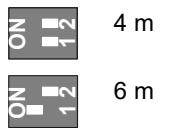

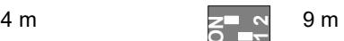

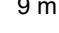

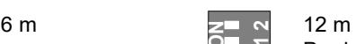

Predefinição de fábrica.

#### **SW1-3: Polaridade**

On (Ligado): polaridade positiva. Configura as entradas (WT e D/N) como "Active high".

Off (Desligado): polaridade negativa. Configura as entradas (WT e D/N) como "Active low". Predefinição de fábrica.

A funcionalidade é mostrada na Figura 10.

#### **Figura 10**

| (1) | Polaridade alta  | (3) | Walk test |
|-----|------------------|-----|-----------|
| (2) | Polaridade baixa | (4) | Dia/noite |

Esta função depende também da configuração de SW1-5. Consulte "SW1-5: Funcionalidade remota" abaixo.

#### **SW1-4: Reservado**

Não alterar.

#### **SW1-5: Funcionalidade remota**

On (Ligado): remoto ligado. Activa as entradas de dia/noite e WT.

Off (Desligado): remoto desligado. Desactiva as entradas de dia/noite e WT (predefinição de fábrica).

A funcionalidade seguinte depende da configuração remota.

|  |  | Tabela 4: Funções que dependem da configuração remota |
|--|--|-------------------------------------------------------|
|--|--|-------------------------------------------------------|

| Item  | Descrição            | SW1-5 Remote on                | SW1-5 Remote off |
|-------|----------------------|--------------------------------|------------------|
| SW1-3 | Polaridade           | Selecionável                   | Só positivo      |
| WT    | Entrada de WT        | Activado                       | Desactivado      |
| D/N   | Entrada D/N          | Activado                       | Desactivado      |
| Outro | Modo verde           | Activado no modo dia sem WT | Desactivado      |
|       | Memória de alarme | Activado no modo dia sem WT | Desactivado      |

Consulte também "Ligações" na página nº 35.

#### **SW1-6: LEDs**

On (Ligado): LEDs activados. Consulte "LEDs e saídas" abaixo para ver a funcionalidade dos LEDs.

Off (Desligado): LEDs desactivados para qualquer estado.

### **Configurar padrão de cobertura**

- Remover as cortinas (Figuras 8 e 9) se necessário. O padrão modificado é indicado abaixo da configuração de cortinas.
**Nota:** Se forem instaladas ambas as cortinas no DD1012- N, o alcance do detector é limitado a 6m (de fábrica).

- No caso do DD1012-N, modificar o padrão removendo partes das cortinas (indicado a cinzento na Figura 8, item 1). A correspondência dos fragmentos das cortinas são indicados na Figura 8, item 2.
- Coloque os autocolantes apropriados se necessário. Para mais informação, ver figura 7 item 1.

**Atenção:** A remoção dos autocolante pode danificar a superfície do espelho.

- Quando existem por baixo do detetor, coloque a máscara no interior da janela (por defeito). Desta forma a desativa a parte da cortina que observa para baixo sobre objeto,
cuja proximidade pode destabilizar o detetor. Ver figura 7, item 2.

### **Walk test do detector**

O modo de walk test pode ser activado de duas maneiras.

**SW1-6 configurado como LED ligado, SW1-5 configurado como Remoto desligado**

Neste modo, a indicação LED está sempre activada (modo de walk test constante).

**SW1-6 configurado como LED ligado, SW1-5 configurado como Remoto ligado**

Esta configuração activa a entrada de walk test (pino 7) e a entrada de dia/noite (pino 8). Isto permite que o utilizador active remotamente a indicação LED, colocando o detector no modo dia e activando o walk test.

### **Modo verde**

Quando SW1-5 está configurado como Remoto ligado, o radar é desligado durante o modo dia (sem WT) para reduzir o consumo de energia eléctrica. O detector funciona então no modo apenas PIR.

**Nota:** a linha dia/noite deve ser ligada ao painel de controlo para permitir o funcionamento deste modo.

Este modo não está em conformidade com a norma EN 50131-2-4.

### **Memória de alarme**

Quando SW1-5 está configurado como Remoto ligado, os alarmes que ocorreram no modo noite são guardados na memória do detector. São indicados por um LED vermelho a piscar quando a unidade comuta para o modo dia (walk test desactivado). A memória é limpa quando o detector volta a entrar no modo noite.

**Nota:** Configure SW1-6 como desligado (Off) para evitar mostrar a memória de alarmes nos LEDs. Consulte "SW1-6: LEDs" acima.

### **LEDs e saídas**

Para activar a funcionalidade dos LEDs, configure SW1-6 como ligado (On), caso contrário os LEDs estão desactivados em qualquer estado. Consulte "SW1-6: LEDs" acima para obter mais informações.

#### **Tabela 5: LEDs e saídas**

| Estado                                   | vermelho LED | Relé de alarme | Para reinicializar           |
|------------------------------------------|-----------------|-------------------|------------------------------|
| Arranque                                 |                 | Fechado           | Automaticamente após 60 s |
| Baixa tensão                             |                 | Aberto            | Aplicar tensão correcta      |
| Alarme de intruso PIR                    |                 | Fechado           |                              |
| Alarme de intrusão por microondas     |                 | Fechado           |                              |
| Alarme de intrusão de movimento duplo |                 | Aberto            | Automaticamente após 3 s  |

| Estado                                          |                 |                                | Para reinicializar                                     |  |
|-------------------------------------------------|-----------------|--------------------------------|--------------------------------------------------------|--|
|                                                 | vermelho LED | Relé de alarme              |                                                        |  |
| Memória Alarme DT                               |                 | Fechado                        | Mudar para o modo noite                             |  |
| Continuamente ligado                            |                 |                                | Intermitência normal (1 Hz)                            |  |
| Especificações                                  |                 |                                |                                                        |  |
| Tecnologia de detecção: DD1012 DD1012PI-N |                 | Dupla domésticos            | Dupla, imunidade a animais                             |  |
| Alcance                                         |                 |                                | 4, 6, 9, 12 m selecionável através de SW1-1 e SW1-2 |  |
| Ângulo de visão                                 |                 | 78 graus                       |                                                        |  |
| Óptica PIR                                      |                 | densidade                      | 9 cortinas de espelho de elevada                       |  |
| Frequência de microondas                        |                 | 5725–5875 MHz                  |                                                        |  |
| Potência máxima de saída                        |                 | 13,46 mW                       |                                                        |  |
| Saída máx. de microondas a 1 m                  |                 | 0,003 μW/cm²                   |                                                        |  |
| Função de memória                               |                 | Sim                            |                                                        |  |
| Entrada de alimentação                          |                 |                                | 9 a 15 V (12 V nominal)                               |  |
| Imunidade ripple pico a pico                    |                 | 2 V (a 12 V)                  |                                                        |  |
| Tempo de início do detector                     |                 | 60 s                           |                                                        |  |
| Consumo de corrente                             |                 |                                | 5 a 17 mA (9 mA nom.)                                  |  |
| Altura da instalação: DD1012-N DD1012PI-N |                 | 1,8 até 2,6 m 2,3 até 2,6 m |                                                        |  |
| Velocidade ao "alvo"                            |                 | 0,2 a 3,0 m/s                  |                                                        |  |
| Característica do alarme (NC)/relé do tamper |                 |                                | 80 mA 30 V, Form A                                    |  |
| Hora de alarme                                  |                 | 3 s                            |                                                        |  |
| Temperatura de funcionamento                    |                 | −10 a +55°C                    |                                                        |  |
| Humidade relativa                               |                 |                                | Máx. 95%, sem condensação                              |  |
| Peso                                            |                 | 120 g                          |                                                        |  |
| Dimensões (A x L x P)                           |                 |                                | 126 × 63 × 50 mm                                       |  |
| Classificação de IP/IK                          |                 | IP30 IK04                      |                                                        |  |
| Tamper de remoção                               |                 |                                | Opcional (ST400)                                       |  |

### **Informação reguladora**

| Fabricante | COLOCADO NO MERCADO POR:                          |
|------------|---------------------------------------------------|
|            | Carrier Fire & Security Americas Corporation Inc. |
|            | 13995 Pasteur Blvd                                |
|            | Palm Beach Gardens, FL 33418, USA                 |
|            | REPRESENTANTE EU AUTORIZADO:                      |
|            | Carrier Fire & Security B.V.                      |
|            | Kelvinstraat 7, 6003 DH Weert, Netherlands        |

Avisos e isenções de responsabilidade

dos produtos

ESTES PRODUTOS ESTÃO PREVISTOS PARA SEREM VENDIDOS E INSTALADOS POR PROFISSIONAIS QUALIFICADOS. A CARRIER FIRE & SECURITY NÃO PODE APRESENTAR QUALQUER GARANTIA DE QUE QUALQUER PESSOA OU ENTIDADE QUE COMPRE OS SEUS PRODUTOS, INCLUINDO QUALQUER "DISTRIBUIDOR AUTORIZADO" OU "REVENDEDOR AUTORIZADO", TEM FORMAÇÃO OU EXPERIÊNCIA ADEQUADA PARA INSTALAR CORRETAMENTE PRODUTOS RELACIONADOS COM A SEGURANÇA E A PROTEÇÃO CONTRA INCÊNDIOS. Para mais informações sobre isenções de

garantia e sobre a segurança dos produtos, consulte

https://firesecurityproducts.com/policy/productwarning/ ou faça a leitura do código QR.

| Certificação               |                                                                                                                                                                                                                                                                                                                                                                                                                                                                                        |
|----------------------------|----------------------------------------------------------------------------------------------------------------------------------------------------------------------------------------------------------------------------------------------------------------------------------------------------------------------------------------------------------------------------------------------------------------------------------------------------------------------------------------|
|                            | A Carrier Fire & Security declara que este dispositivo se encontra em conformidade com os requisitos e disposições aplicáveis, e com todas as regras e regulamentos aplicáveis, incluindo, entre outros, a Diretiva 2014/53/EU. Para mais informações consulte www.firesecurityproducts.com.                                                                                                                                                                         |
| REACH                      | O produto pode conter substancias da Lista de Candidatos de concentração acima de 0.1% w/w, de acordo com a lista de Candidatos publicada recentemente no site ECHA. Informações de utilização segura podem ser encontradas em https://firesecurityproducts.com/en/content/intrusi on-intro                                                                                                                                                                       |
|                            | 2012/19/EU (directiva WEEE, sobre Resíduos de Equipamentos Eléctricos e Electrónicos): Os produtos marcados com este símbolo não podem ser eliminados como lixo municipal não separado na União Europeia. Para uma reciclagem adequada, devolva este equipamento ao fornecedor local aquando da compra de um novo equipamento equivalente, ou coloque-o num ponto de recolha designado para o efeito. Para mais informações, consulte: www.recyclethis.info |
| Documentação de produto | Por favor consulte o link seguinte para obter a versão eletrónica da documentação do produto. Este link irá direciona-lo para a página regional da EMEA. Nesta página pode solicitar o acesso ao portal seguro, onde todos os manuais se encontram armazenados. https://firesecurityproducts.com/en/contact                                                                                                                                                          |

### **Informação de contacto**

www.firesecurityproducts.com ou www.aritech.com.

## **SV: Installationsmanual**

### **Beskrivning**

DD1012-N och DD1012PI-N är kombi rörelsedetektorer De kombinerar den patenterade PIR-spegeloptiska tekniken med den patenterad Range Controlled Radar-tekniken.

DD1012PI-N är utformad för att vara immun mot husdjur av vissa storlekar och typer. Sällskapsdjur upp till 18 kilo (cirka 35 cm höga) orsakar normalt inga problem vid standardanvändning, såvida de inte kan röra sig över 35 cm över golvnivå inom detekteringsområdet.

### **Installationsanvisningar**

#### Se figur 1.

Detektorn är avsedd för väggmontering, men kan även takmonteras med hjälp av en fästvinkel.

Använd följande anvisningar för att hitta den bästa monteringsplatsen för detektorn.

- Montera detektorn så att en eventuell inkräktare förväntas korsa detektorns övervakningsområde vid förflyttning (se figur 3).
- Montera detektorn på en stabil yta. För monteringshöjd, se "Specifikationer" på sidan 40.
- Montera inte detektorn inom 0,5 m från metallföremål eller inom 1,5 m från fluorescerande ljuskällor.
- Placera inte föremål framför detektorn som blockerar täckningsområdet.
- Montera detektorerna minst 6 meter från varandra och använd inställningen för korta avstånd för att undvika störningar när detektorerna monteras mot varandra.

Den här detektorns dubbla behandlingsteknik är mycket resistent mot falsklarm. Undvik trots detta potentiella källor till instabilitet, såsom:

#### PIR-risker:

- direkt solljus på detektorn
- värmekällor inom detektorns täckningsområde
- kraftigt luftdrag på detektorn
- Djur inom synfältet för (DD1012-N-detektorer)
- avskärmning av detektorns täckningsområde med stora föremål såsom möbler m.m.

Risker med mikrovågor:

- montera inte på vibrerande ytor
- metallytor som reflekterar mikrovågor
- vattenrörelser genom plaströr
- föremål som rör sig eller vibrerar, som t.ex. fläktar och värme- eller luftkonditioneringstrummor

**VARNING!** Utrustningen är inte jordad. Alla externa kretsar som är anslutna till utrustningen måste vara belägna i samma byggnad och anslutna till en skyddande jordledare.

Isoleringen på ledarna som är anslutna till utrustningen måste överensstämma med IEC 60332-1-2 och IEC 60332-1-3 eller IEC 60332-2-2, beroende på ledarens tvärsnittsarea, eller IEC TS 60695-11-21, oavsett av tvärsnittsarea. Alternativt måste sådana ledare överensstämma med UL 2556 VW-1.

Spänningskällan för detektorn måste vara begränsad till 15 W.

Vi rekommenderar att detektorn regelbundet gångtestas och kontrolleras via centralapparaten/manöverpanelen.

#### **Montering av detektorn:**

- 1. Ta av täckluckan och ta bort skruven (se figur 2, del 1 och 2).
- 2. Bänd försiktigt upp detektorn med hjälp av en skruvmejsel (fig. 2, del 3 och 4).

**Varning!** Vidrör inte den pyroelektriska sensorn (figur 6).

- 3 Ta ut skruven för locket (figur 4, del 2).
- 4. Fäst bakstycket på väggen. För monteringshöjd, se "Specifikationer" på sidan 40.

Se figur 4.

- För plan montering ska du använda minst två skruvar (DIN 7998) i positionerna A.

- För hörnmontering ska du använda skruvarna i position B eller C.

- För installering av bortbrytningsskydd ST400 ska du använda monteringspositionerna A. Monteringspositionen för ST 400 visas som pos. 3 i figur 4. Öppna utgången på bakstycket (figur 5, del 2).

- 5. Dra kablarna till detektorn (se bild 4 och 13). Använd bakstyckets kabelingångar (figur 5, del 1) och kabelränna (figur 5, del 3)
- 6. Välj önskade bygel och DIP-omkopplarinställningar (se "Ställa in detektorn" på sidan 39 för mer information.
- 7. Ta bort maskskydd och sätt dit klisterskydd på spegeln, om så krävs. Se "Inställning av täckningsområdet" på sidan 40 för mera detaljer.
- 8 För takmontering ska du använda SB01-monteringsfäste. Monteringspositionen för SB01 visas som del 1 i figur 4.
- 9 Stäng skyddet, sätt i fästskruven och placera täckluckan.

### **Anslutningar**

Se figur 13.

#### **Tabell 1: Detektoranslutningar**

| Skruv | Beteckning | Beskrivning                                                                                                                                            |
|-------|------------|--------------------------------------------------------------------------------------------------------------------------------------------------------|
| 1, 2  | GND, +12 V | Strömförsörjning (9–15 V, 12 V nominal)                                                                                                              |
| 3, 4  | LARM       | Utgående larmrelä (33 Ω). Använd bygel JA för att ställa in den inbyggda EOL-motståndet i serie med reläet. Se "Byglar" på sidan 39.             |
| 5, 6  | SABOTAGE   | Utgående sabotagebrytare (0 Ω). Använd bygel JT för att ställa in den inbyggda EOL motståndet i serie med kontakten. Se "Byglar" på sidan 39. |

| Skruv | Beteckning | Beskrivning                                                                                                                                                                                                                                    |
|-------|------------|------------------------------------------------------------------------------------------------------------------------------------------------------------------------------------------------------------------------------------------------|
| 7     | Gångtest   | Denna ingång aktiverar och inaktiverar lysdioden (gång test Till/Från) Gångtestläge kan bara aktiveras när detektorn är i dagläge (pin 8). Aktiv högt eller lågt bestäms av SW1-3 (se "SW1-3: Polaritet" nedan).                   |
| 8     | Dag/natt   | Denna ingång växlar detektor i dagläge (visar minne på lysdiodindikatorn) eller nattläge (aktiverar larmminne och raderar tidigare sparade larm). Aktiv hög eller låg polaritet bestäms av SW1-3 (se "SW1-3: Polaritet" nedan). |

#### **OBS!**

- Ingång 7 och 8 kan bara användas när SW1-5 är inställd på fjärrkontroll på. Se "SW1-5: Fjärstyringsfunktion" nedan.
- Lysdioden är bara aktiv när SW1-6 är inställd på LED på.

Figur 11 förklarar hur en enkel sektion skapas med multipla motståndskonfigureringar.

#### **Figur 11**

- (1) Larmrelä
- (2) Larmsektion
- (3) Sabotageutgång

Ra Larm EOL-motstånd Rt Sabotage EOL-motstånd

### **Ställa in detektorn**

Se figur 14 för bygel och DIP-omkopplingar.

### **Byglar**

Byglar inställda för inbyggt EOL-läge och -värde. Kretsen visas i figur 11.

#### **JA: Ställ in inbyggd EOL-motstånd (Ra)**

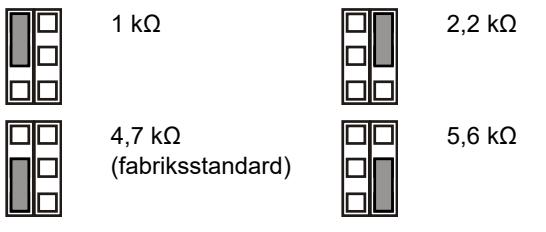

Av: Inget inbyggt EOL-motstånd (brytande relä).

#### **JT: Ställ in inbyggd sabotage EOL-motstånd (Rt)**

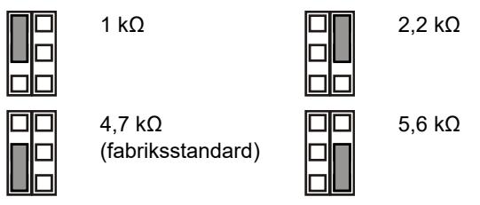

Av: Inget inbyggt EOL-motstånd (brytande relä).

#### **Konfigurera sektionen**

För att konfigurera sektionen, gör på följande sätt.

- Välj lämplig EOL-motståndsvärde med JA och JT. Till exempel bestämmer inställningen för bygel JT Rt-värdet.
- Ta bort JT för potentialfria utgångar.
- Ta bort bygel JA och JT för exkludera inbyggda EOLvärden.

För en enskild sektion med alla inbyggda motstånd inställda, kan sektionsmotstånden vara följande.

#### **Tabell 2: Värden för sektionsmotstånd**

| Sektionsläge          | Värde | Standard |
|-----------------------|-------|----------|
| Sabotage (kortslutn.) | 0 Ω   | 0 Ω      |
| Normalt               | Rt    | 4,7 kΩ   |
| Larm                  | Rt+Ra | 9,4 kΩ   |
| Sabotage (öppen)      | ∞     | ∞        |

### **DIP-omkopplare**

#### **Tabell 3: SW1 allmänna inställningar**

| Switch                 | Värden                              |                                  |
|------------------------|-------------------------------------|----------------------------------|
| 6: LED                 | På: LED på*                         | Av: LED frånslagen               |
| 5: Fjärrkontroll       | På: Fjärrstyrning på                | Av: Fjärrstyrning av*            |
| 4: Reserverad          |                                     |                                  |
| 3: Polaritet           | På: Positiv polaritet               | Av: Negativ polaritet*           |
| 1, 2: Mikrovågs område | 1 På, 2 På 12 m* 1 Av, 2 På: 9 m | 1 På, 2 Av 6 m 1 På, 2 Av 4 m |

* Fabriksinställning

### **DIP-omkopplare SW1**

#### **SW1-1, SW1-2: Mikrovågsområde**

Använd SW1-1 och SW1-2 för att ställa in exakt täckningsområde för att passa applikationen. Mikrovågen är av typen range-gating, vilket innebär att områdesbevakningen är mycket precis.

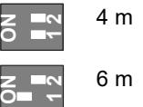

| 4 m | ON 2 1 | 9 m  |
|-----|--------------|------|
| 6 m | ON 2 1 | 12 m |

| Fabriksstandard. |  |
|------------------|--|

#### **SW1-3: Polaritet**

På: Positiv polaritet. Konfigurerar ingångarna (WT och D/N) som "Hög aktivitet".

Av: Negativ polaritet. Konfigurerar ingångarna (WT och D/N) som "Låg aktivitet". Fabriksinställning.

Funktionen förklaras i figur 10.

| Figur 10 |               |     |          |
|----------|---------------|-----|----------|
| (1)      | Polaritet hög | (3) | Gångtest |
| (2)      | Polaritet låg | (4) | Dag/natt |

Denna funktion är också beroende av SW1-5-inställningen. Se "SW1-5: Fjärstyringsfunktion" nedan.

#### **SW1-4: Reserverad**

Ändra inte denna.

#### **SW1-5: Fjärstyringsfunktion**

På: Fjärrstyrning på. Aktiverar WT- och dag/natt-ingångar.

Av: Fjärrstyrning av. Inaktiverar WT- och dag/natt-ingångar (fabriksstandard).

#### Följande funktionalitet är beroende av fjärrinställningen.

| Objekt | Beskrivning | SW1-5 Fjärrstyrning på      | SW1-5 Fjärrstyrning av |
|--------|-------------|--------------------------------|---------------------------|
| SW1-3  | Polaritet   | Valbar                         | Endast positiv            |
| WT     | WT-ingång   | Inkopplad                      | Frånkopplad               |
| D/N    | D/N-ingång  | Inkopplad                      | Frånkopplad               |
| Övrigt | Grönt läge  | Aktiverad i dagläge utan WT | Frånkopplad               |
|        | Larmminne   | Aktiverad i dagläge utan WT | Frånkopplad               |

**Tabell 4: Funktioner beroende av fjärrinställningen**

Se även "Anslutningar" på sidan 38.

#### **SW1-6: LED-lampor**

På: LED-lamporna är aktiverade. Se "LED-lampor och utgångar" nedan för LED-funktionalitet.

Av: LED-lamporna är inaktiva för alla lägen.

### **Inställning av täckningsområdet**

- Ta bort maskeringsskydden (Figur 8 och 9) om nödvändigt. Det modifierade mönstret för täckning visas nedanför maskeringskonfigureringen.
**Obs:** Om båda maskeringarna är installerade i DD1012-N, är räckvidden begränsad till 6 m (fabriksinställt).

- Om DD1012-N modifieras genom att byta bort maskeringsskydden (visas i grått i Figur 8, punkt 1). Visas den nya täckningen i Figur 8, punkt 2.
- Sätt på lämpliga klistermärken för respektive spegelridå. Se bild 7, punkt 1 för mer information.

**Varning:** Vid borttagning av klistermärkena kan spegelytan skadas.

- Då det finns föremål nära direkt under detektorn, placera maskningen på insidan av fönstret (standard). Detta inaktiverar den del av ridåerna som ser ner på objektet, vars närhet kan destabilisera detektorn. Se bild 7, punkt 2.
#### **Gångtesta detektorn**

Det finns två metoder för att koppla på gångtestläge.

**SW1-6 inställd på LED på, SW1-5 inställd på fjärrstyrning av**

I detta läge indikerar LED-lampan ständigt (konstant läge för gångtest).

**SW1-6 inställd på LED på, SW1-5 inställd på fjärrstyrning på**

Inställningen aktiverar gångtestets ingång (stift 7) och dag/natt (stift 8). Detta gör det möjligt för användaren att fjärraktivera LED-indikeringen genom att ställa in detektorn på dagläge och aktivera gångtest. Se figur 10.

#### **Grönt läge**

När SW1-5 är inställt för fjärrstyrning på stängs mikrovågen av under dagläge (utan WT) för att minska strömförbrukningen. Detektorn arbetar då enbart i PIR-läge.

**OBS!** Dag/natt- ingången måste vara ansluten till centralapparaten för att detta läge ska fungera.

Detta läge uppfyller inte EN 50131-2-4 standard.

### **Larmminne**

När SW1-5 är inställt på fjärrstyrning på, sparas larm som uppkommer med nattkoppling i detektorminnet. De indikeras med en blinkande röd LED-lampa när enheten kopplas om till dagläge (gångtest inaktiverat). Minnet rensas när detektorn kopplas tillbaka till nattläget.

**OBS!** Ställ in SW1-6 Av för att undvika att visa larmminnet på LED-lamporna. Se "SW1-6: LED-lampor" ovan.

### **LED-lampor och utgångar**

För att aktivera LED-lampornas funktion ska du ställa SW1-6 På, annars är LED-lamporna inaktiva i alla förhållanden. Se "SW1-6: LED-lampor" ovan för mer information.

#### **Tabell 5: LED-lampor och utgångar**

| Status           | Röd LED | Larm relä | Återställa                       |
|------------------|------------|-----------|----------------------------------|
| Start            |            | Stängd    | Automatiskt efter 60 sekunder |
| Låg spänning     |            | Öppen     | Anslut korrekt spänning          |
| PIR-Larm         |            | Stängd    |                                  |
| Mikrovågslarm    |            | Stängd    |                                  |
| Kombilarm MW/PIR |            | Öppen     | Automatiskt efter 3 sekunder  |
| Dubbellarm minne |            | Stängd    | Växla till nattläget             |

Permanent på Normal blinkning (1 Hz)

### **Specifikationer**

| Detektorteknik:                      |                                                     |
|--------------------------------------|-----------------------------------------------------|
| DD1012                               | Dubbel                                              |
| DD1012PI-N                           | Dubbel, immun mot sällskapsdjur                     |
| Räckvidd                             | 4, 6, 9, 12 meter kan väljas med SW1-1 och SW1-2 |
| Betraktningsvinkel                   | 78 grader                                           |
| PIR-optik                            | Nio HD-spegelridåer                                 |
| Mikrovågsfrekvens                    | 5725–5875 MHz                                       |
| Maximal effekt                       | 13,46 mW                                            |
| Max. Mikrovågseffekt på 1 meter      | 0,003 μW/cm²                                        |
| Minnesfunktion                       | Ja                                                  |
| Ingångsspänning                      | 9–15 V (12 V nominal)                              |
| Vpp-rippelresistens                  | 2 V (vid 12 V)                                     |
| Uppstartningstid                     | 60 sekunder                                         |
| Aktuell strömförbrukning             | 5–17 mA (9 mA nom.)                                 |
| Monteringshöjd:                      |                                                     |
| DD1012-N                             | 1,8–2,6 m                                           |
| DD1012PI-N                           | 2,3–2,6 m                                           |
| Objektets rörelsehastighet           | 0,2–3,0 m/s                                         |
| Larm (NC)/sabotagerelä egenskaper | 80 mA 30 V, Form A                                 |
| Larmtid                              | 3 sekunder                                          |
| Drifttemperatur                      | −10 till +55°C                                      |

| Relativ fuktighet                | 95 % max., ej kondenserande |
|----------------------------------|-----------------------------|
| Vikt                             | 120 g                       |
| Mått (H x B x D)                 | 126 × 63 × 50 mm            |
| IP/IK-klassning                  | IP30 IK04                   |
| Bortbrytningsskydds-manipulering | Tillval (ST400)             |

### **Användarinstruktion**

Informera användaren att inte skärma av detektorns bevakningsområde genom att placera föremål framför detektorn.

### **Information om regler och föreskrifter**

| Tillverkare                            | SLÄPPT PÅ MARKNADEN AV: Carrier Fire & Security Americas Corporation Inc. 13995 Pasteur Blvd Palm Beach Gardens, FL 33418, USA AUKTORISERAD EU-REPRESENTANT: Carrier Fire & Security B.V. Kelvinstraat 7, 6003 DH Weert, Netherlands/Holland                                                                                                                                                                                                                                                                                                 |
|----------------------------------------|-------------------------------------------------------------------------------------------------------------------------------------------------------------------------------------------------------------------------------------------------------------------------------------------------------------------------------------------------------------------------------------------------------------------------------------------------------------------------------------------------------------------------------------------------------------------|
| Produktvarningar och friskrivningar | DESSA PRODUKTER ÄR AVSEDDA FÖR FÖRSÄLJNING TILL OCH INSTALLATION AV BEHÖRIG PERSONAL. CARRIER FIRE & SECURITY KAN INTE GARANTERA ATT EN PERSON ELLER JURIDISK PERSON SOM KÖPER DESS PRODUKTER, INKLUSIVE "KVALIFICERAD FÖRSÄLJARE" ELLER "ÅTERFÖRSÄLJARE", ÄR ORDENTLIGT UTBILDAD ELLER HAR ERFARENHET AV ATT INSTALLERA BRAND- OCH SÄKERHETSRELATERADE PRODUKTER. För mer information om garantifriskrivningar och produktsäkerhet, se https://firesecurityproducts.com/policy/product warning/ eller skanna QR-koden. |
| Certifiering                           |                                                                                                                                                                                                                                                                                                                                                                                                                                                                                                                                                                   |
|                                        | Carrier Fire & Security deklarerar härmed att denna enhet överensstämmer med gällande krav och bestämmelser i alla tillämpliga regler och föreskrifter, inklusive men inte begränsat till direktivet 2014/53/EU. För mer information: www.firesecurityproducts.com.                                                                                                                                                                                                                                                                                |
| REACH                                  | Produkten kan innehålla ämnen som finns i Kandidatförteckningen i en koncentration av 0,1% w/w, per den senast listade kandidatförteckningen på ECHA:s webbplats. Information om säker användning finns på https://firesecurityproducts.com/en/content/intrusi on-intro                                                                                                                                                                                                                                                                         |
|                                        | 2012/19/EU (WEEE): Produkter märkta med denna symbol får inte kastas i allmänna sophanteringssytem inom den europeiska unionen. För korrekt återvinning av utrustningen skall den returneras din lokala återförsäljare vid köp av liknande ny utrustning eller lämnas till en därför avsedd deponering. För mer information, se: www.recyclethis.info                                                                                                                                                                                        |

Produktdokumentation

Använd följande webblänk för att hämta den elektroniska versionen av produktdokumentationen.

Den här länken leder dig till EMEAs regionala kontaktsida. På den här sidan kan du begära din inloggning till den säkra webbportalen där alla manualer är lagrade.

https://firesecurityproducts.com/en/contact

### **Kontaktuppgifter**

www.firesecurityproducts.com eller www.aritech.com

## **Certification**

#### **EN**

Cert. no.: 222350048/AA/00 Product: DD1012-N, DD1012PI-N Standard: EN 50131-2-4:2020 Tested and certified by: Telefication B.V. Security Grade 2, Environmental class II

#### **VdS**

VdS Anerkennung G122512 Produkt: DD1012-N

Geprüft und zertifiziert durch VdS nach VdS2312:2010

Tested and Certified by VdS according to VdS2312:2010

Sicherheitsklasse B nach VdS2312 und Umweltklasse II nach VdS2110 Safety class B according to VdS2312 and

environmental class II according to VdS2110

#### **NF & A2P**

Cert. no.: DD1012-N: 2821100025B0 DD1012PI-N: 2821100024B0 Norme: EN 50131-2-4, RTC50131-2-4, N 324 H58 Testé et certifié: Telefication B.V.

Grade de sécurité 2, Classe d'environnement II

Autoprotection à l'ouverture / arrachement : oui / oui Immunité à un champ magnétique : oui (aimant type 2, EN 50131-2-4)

Certifié suivant les référentiels :

|              | -EN 50131-2-4 -RTC50131-2-4 -N 324 H58 |  |
|--------------|----------------------------------------|--|
| CNPP Cert    | AFNOR Certification                    |  |
| www.cnpp.com | www.afnor.org                          |  |

#### **Remarques importantes**

- La certification NFA2P ne couvre pas l'utilisation de rotule de fixation telle que la SB01.

- Afin que le détecteur conserve sa certification NFA2P, il n'est pa autorisé qu'il soit en mode IRP seul lorsque le système est armé.

#### Couverture de détection suivant la norme Européenne :

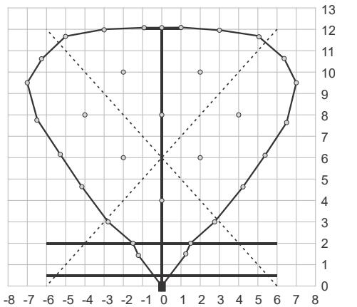

#### **INCERT**

Cert. no.: C-001-1633 Product: DD1012-N, DD1012PI-N Standard: T031+A1:2018 Issued by: Telefication B.V. Security Grade 2, Environmental class II

#### **SBSC**

Cert. no.: pending Produkt: DD1012-N, DD1012PI-N Standard: SSF 1014 Testad och certifierad av: SBSC Säkerhetsklass 2, Miljöklass II