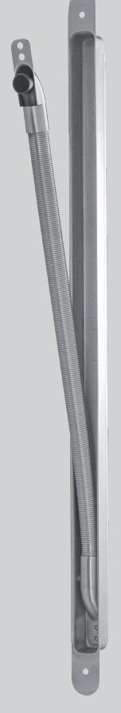
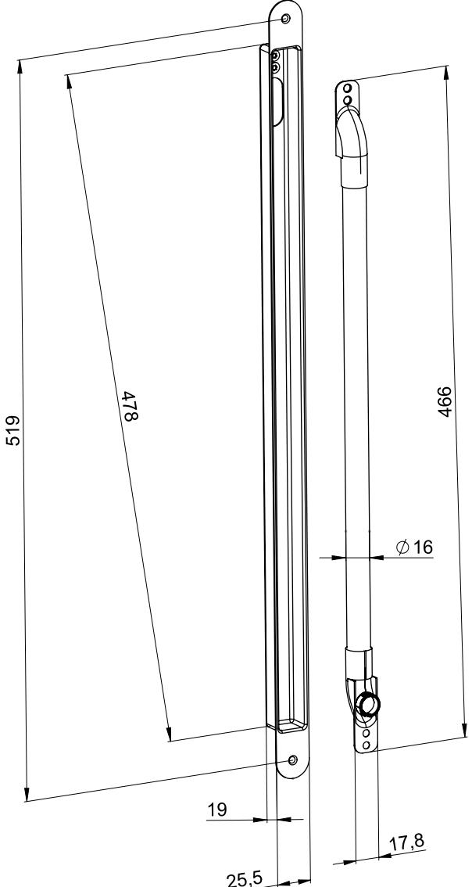

## ASSA ABLOY Karmöverföring 84

### **Användningsområde**

Karmöverföring ASSA ABLOY 84 är avsedd att skydda kabeln vid överföring mellan dörr och karm.

#### **Egenskaper**

ASSA ABLOY Karmöverföring 84 är tillverkad i rostfritt stål har en innerdiameter på max Ø 12,8mm som ger gott om plats för kablage anpassade för dörrar med krav på elektrisk låsning. För högsta driftsäkerhet ska mångtrådig mjuk kabel användas. Karmöverföringen har avrundade hörn för enkelt montage och urfräsning i dörr och passar både trä-, stål- och aluminiumdörrar. Den är anpassad för en öppningsvinkel upp till 180°.

ASSA ABLOY Karmöverföring 84 har genomgått brandprov med godkänt resultat upp till brandklass E/EI 120.

#### **Funktion**

ASSA ABLOY Karmöverföring 84 installeras mellan övre och undre gångjärn på gångjärnssidan av dörrbladet. Urtag för skyddsbaljan görs i dörrbladet. Ledningsgenomdragning sker innan fastmontering. Hålbild ska göras stor nog så att kabel/kablar kan röra sig något fritt bakom skyddsbalja och fjäder. Med karmöverföringen medföljer en skyddshylsa för att minska eventuellt slitage på kabeln i övergången mellan fjäder och karm.

**Artikelnummer**  708286 100 000

# ASSA ABLOY Karmöverföring 84

Document ID Alternate ID

ASSA ABLOY Opening Solutions Sweden P.O. Box 371 SE-631 05 Eskilstuna Sweden Phone +46 (0)16 17 70 00 Customer support:

Phone intl. +46 (0)16 17 71 00 Phone nat. 0771-640 640 helpdesk.se.openingsolutions@assaabloy.com assaabloyopeningsolutions.se

1:5 (A3)

Alternate ID

Created (YYYY-MM-DD): Designed by: Drawn by:

Document ID

**1**