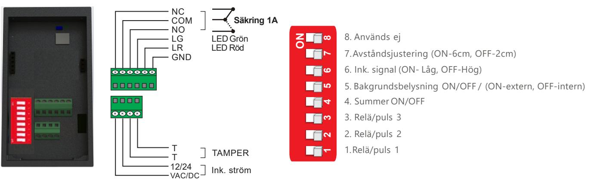
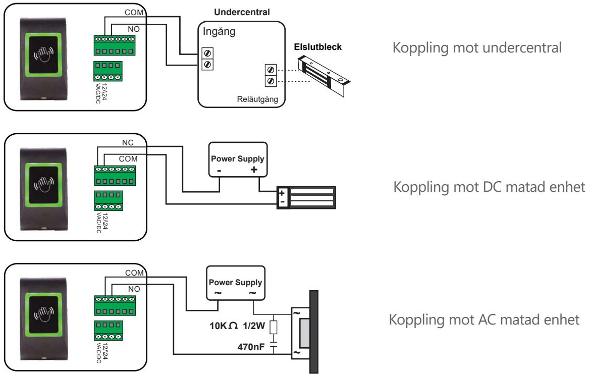
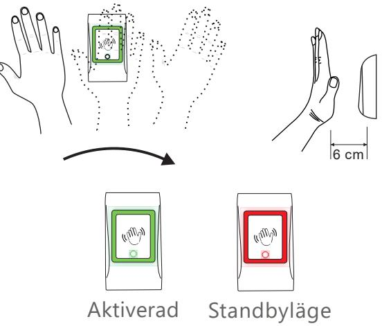
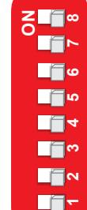
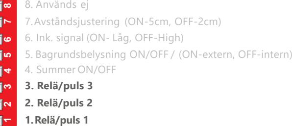
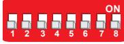
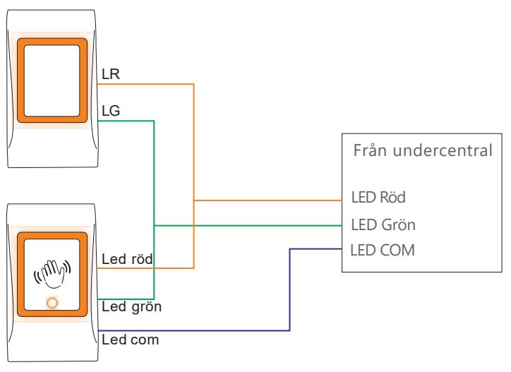

# **Användarmanual - Öppnaknapp Touchless**

VIKTIG NOTERING! Den beröringsfria utgångsknappen är avsedd för inomhusbruk. För utomhusbruk måste den skyddas mot direkt regn/slask/snö med MC-MINI skyddshölje för att undvika falsk utlösning av sensorn

## **Terminalkoppling och dip-switch**

# **Kabeldragning**

#### **Så fungerar den**

Enheten aktiveras med en enkel handvinkning framför enheten. Enheten kommer inte att aktiveras om handen inte tas bort från sensorn inom 3 sekunder

#### **Inställningar för relä/puls**

| Relä/puls               |     | DIP Switch 1 DIP Switch 2 DIP Switch 3 |     |  |
|-------------------------|-----|----------------------------------------|-----|--|
| Toggle (ON/OFF Mode) | OFF | OFF                                    | OFF |  |
| 1 Second                | ON  | OFF                                    | OFF |  |
| 3 Seconds               | OFF | ON                                     | OFF |  |
| 5 Seconds               | ON  | ON                                     | OFF |  |
| 10 Seconds              | OFF | OFF                                    | ON  |  |
| 20 Seconds              | ON  | OFF                                    | ON  |  |
| 30 Seconds              | OFF | ON                                     | ON  |  |
| 60 Seconds              | ON  | ON                                     | ON  |  |

### **LED styrning**

| Mode                                  | રખર | SWE | LR Terminal | LG Terminal                   | Relav         | Color    |
|---------------------------------------|-----|-----|-------------|-------------------------------|---------------|----------|
|                                       | OFF | OFF |             | Not Connected   Not Connected | OFF (Standby) | ROG      |
| Normal Mode                           |     |     |             |                               | ON            | Green    |
| External Control (Active High Signal) | ON  | OFF | Low         | Low                           |               | No Light |
|                                       |     |     | High        | Low                           |               | Read     |
|                                       |     |     | Low         | High                          |               | Greer    |
|                                       |     |     | High        | High                          |               | Orange   |
| External Control (Active Low Signal)  | ON  | ON  | Low         | Low                           |               | Orange   |
|                                       |     |     | High        | Low                           |               | Greer    |
|                                       |     |     | Low         | High                          |               |          |
|                                       |     |     | High        | High                          |               | No Light |

**5. Bakgrundsbelysning ON/OFF / (ON-externs, OFF-intern 6. Ink. signal (ON- Låg, OFF-Hög)**

Om switch 5 är OFF, kontrolleras belysningen av enheten. Om switch 5 är ON, kontrolleras belysningen från enheten där LED terminalen är kontakterad. Switch 6 anger grundinställningen på enheten, där LED terminalen är kontakterad. Grundinställning Low är GND och grundinställning High är 12V eller öppen

Exempel av extern kontrollerad LED, där öppnaknappen följer belysningen från passagesystemet

#### **Specifikation**

| Inkommande ström:   | 12-24 VAC/DC;                                        |
|---------------------|------------------------------------------------------|
| Strömförbrukning:   | max. 50mA                                            |
| Sensortyp:          | Infraröd                                             |
| Reläutgång          | 1A vid 24V DC / 120V AC                              |
| Tidsinställningar:  | 1, 3, 5, 10, 20, 30, 60 sekunder eller (ON/OFF) läge |
| Avståndsindikering: | Upp till 6 cm                                        |
| LED indikator:      | Grön, röd, orange                                    |
| LED kontroll:       | Ja, internal or external                             |
| Tamper:             | Ja                                                   |
| Bakgrundsbelysning: | Ja, med ON/OFF switch                                |
| Summer:             | Ja, med ON/OFF switch                                |
| Arbetstemperatur:   | -20 to 50o C                                      |
| Dimentioner (mm):   | 92L x 51W x 27H                                      |
| Kappsling:          | ABS                                                  |
| IP-klass:           | IP65                                                 |