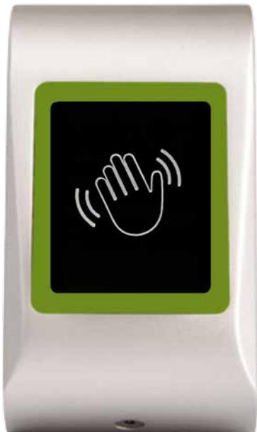

## **Öppnaknapp Touchless**

Öppnaknapp med touchfunktion som har ett rörelseavstånd som är justerbart upp till 6 cm. Passar utmärkt där man vill minimera spridningar av bakterier och minskat mekaniskt slitage. Denna knapp används med fördel på kontor, sjukhus, köpcentrum, butiker, utställningslokaler och övriga ställen där det passerar ett stort flöde av människor.

Öppnaknapp Touchless har ett tydligt ljud och ljusindikering som standard och dessa funktioner kan enkelt avaktiveras om mer diskretion behövs.

## **Snabbfakta**

- LED för statusindikering
- Integrerad summer
- Ställbart läsavstånd upp till 6 cm
- IP 65
- Kopplingsplint för enkel installation
- Tillverkad av robust ABS plast
- Beröringsfri öppning

## **Specifikationer**

Material: Termoplast Ytbehandling/färg: Silver Arbetstemperatur: -20 grader till +50 grader Höjd: 92 mm Längd: 51 mm Bredd: 27 mm Vikt: 0,15 kg