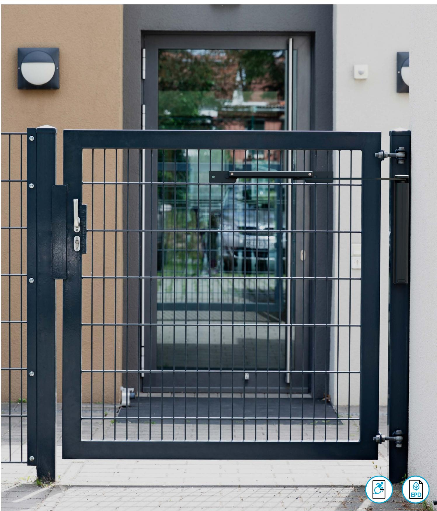

# DC630G tekniskt datablad

Vertikal grinddörrstängare med 3D Cam-Motion®-teknik och glidskena

### Vertikal grinddörrstängare med 3D Cam-Motion®-teknik och glidskena

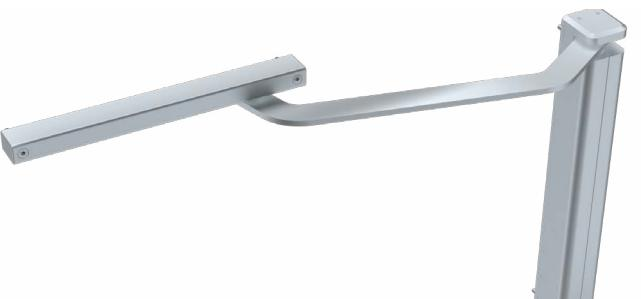

*DC630 G, silver, EV1*

**Cam-Motion® tekniken** skapar snabbt minskad öppningskraft samtidigt som den stänger säkert.

Med sin minimalistiska och smala design monteras DC630G vertikalt på grindens karm eller väggliv. Den unika 3D Cam-Motion-tekniken gör det enkelt att öppna med minimal ansträngning för användaren. Den säkerställer bekväm användning och hinderfri åtkomst samtidigt som den upprätthåller en stängningskraft som garanterar en säker stängning.

- ∙ Lämplig för många olika typer av grindar, både befintliga och nyinstallerade
- ∙ För enkelverkande grindar med en bredd på upp till 1300 mm
- ∙ Barriärfri enligt CEN/TR 15894
- ∙ Levereras med glidskena, monteringsskruvar och nitar

#### **Färger**

- Silver, EV1
- Matt Black, liknar RAL 9004

#### **Funktioner**

- ∙ Kan användas i fyra olika typer av installationer: pelare eller väggmontering på grindens tryck- och dragsida
- ∙ Lätt att installera ingen svetsning krävs
- ∙ Stängnings och tillslags-hastigheterna kan ökas och minskas oberoende av varandra
- ∙ Slitstarka, sidovända metallventiler gör justeringarna enkla och tillförlitliga
- ∙ Konsekvent prestanda i ett brett spektrum av inomhus- och utomhustemperaturer
- ∙ Den klämfria styrskenan ger ökad säkerhet

#### **Produktvarianter**

- ∙ **DC630G-R** för högerhängda grindar
- ∙ **DC630G-L** för vänsterhängda grindar

#### **Tillbehör**

- ∙ **AC632** montageplattor för glidskena. Används då stänger ligger utanpå grindens ramprofil
- ∙ **AC633** vinkelkonsoll för montering på vägg
- ∙ **A152** mekanisk uppställningsenhet med justerbar hållkraft som håller grinden öppen i en valfri vinkel mellan 80° och 130°
- ∙ **A153** mekanisk öppningsdämpare, steglöst justerbart upp till en öppningsvinkel på max. 130°

**Fyra monteringsalternativ med en produkt**

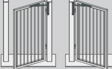

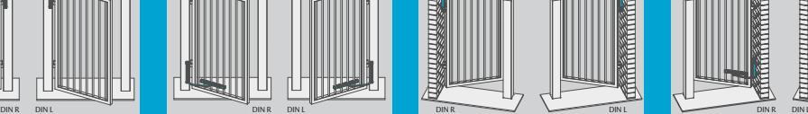

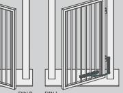

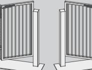

Pelarmontering på dragsidan, standard Pelarmontering på dragsidan, upp och ner Väggmontering på trycksidan, standard

Väggmontering på tryck sidan, upp och ner

### Tekniska egenskaper och certifiering

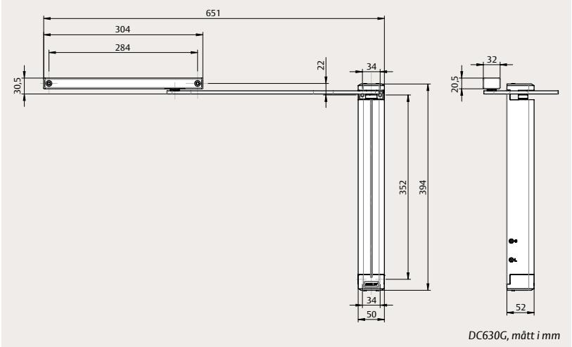

| Tekniska egenskaper      |                                                        |  |
|--------------------------|--------------------------------------------------------|--|
| Maximal vikt för grinden | 150 kg                                                 |  |
| Maximal bredd på grinden | 1300 mm                                                |  |
| Stängningshastighet (C)  | Variabel mellan 130° och 20°                           |  |
| Tillslagshastighet (L)   | Variabel mellan 20° och 0°                             |  |
| System för grindar       | Enkelverkande, med eller utan utskjutande stänger      |  |
| Varianter                | Vänster-/höger                                         |  |
| Monteringssätt           | Pelare eller väggmontering Dragande eller tryckande |  |
| Justerbar förspänning    | Ja                                                     |  |
| Korrosionsbeständighet   | Ja                                                     |  |
| Mått (H x D x L)         | 50 x 52 x 394 mm                                       |  |

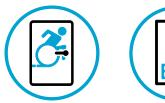

| Certifiering och provning     |                     |  |
|-------------------------------|---------------------|--|
| Barriärfri enligt             | CEN/TR 15894        |  |
| EPD verifierad av tredje part | ISO 14025, EN 15804 |  |
|                               |                     |  |

### Utrymmeskrav och monteringsmått

Skanna QRkoden för att se [installationsvideon](https://youtu.be/z-a5oceui0c
)

**Standard montering på pelare**  på dragsidan

*Ritningen illustrerar installation på högerhängda grindar med DC630G-R. För installation på vänsterhängda grindar med DC630G-L är det tvärtom.* 

210 Min.

60

*AC633*

#### **Montageplattor för pelarmontering**  på dragsidan

*Ritningen illustrerar installation på högerhängda grindar med DC630G-R. För installation på vänsterhängda grindar med DC630G-L är det tvärtom.* 

#### **Vinkelkonsoll för pelarmontering**  på trycksidan

*Ritningen illustrerar installationen på vänsterhängda grindar med DC630G-L. För installation på högerhängda grindar med DC630G-R är det tvärtom.*

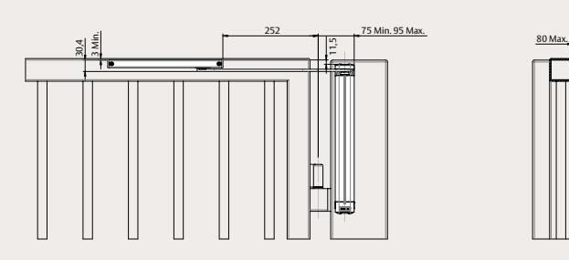

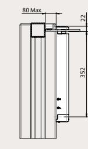

80 Max.

352

*Utrymme som krävs på grindarna för standardmontering på pelaren*

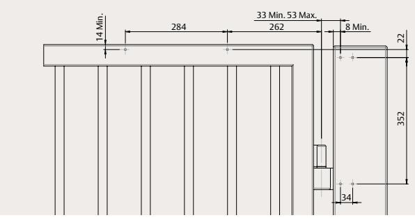

252 75 Min. 95 Max.

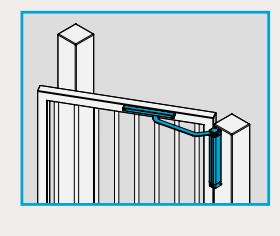

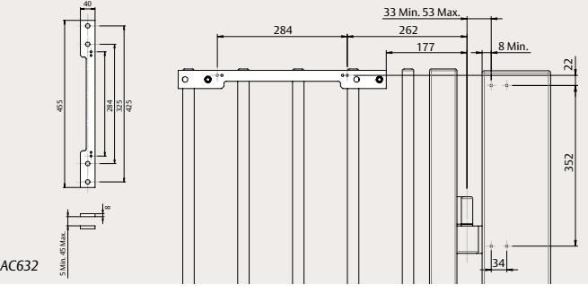

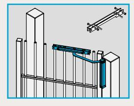

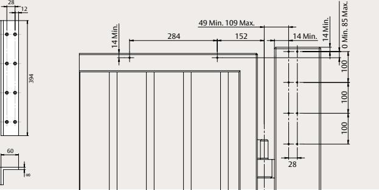

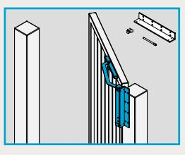

394

60

60

8

47 100 100 100

12

28

40

455

284

8

5 Min. 45 Max.

425

325

#### 30,4 3 Min. 11,5 252 75 Min. 95 Max. 80 Max. Utrymmeskrav och monteringsmått

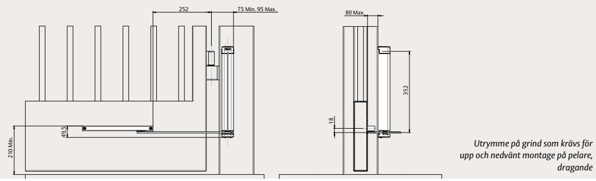

22 352

#### **Upp och ner vänt montage på pelare** på dragsidan

*Ritningen illustrerar installationen på högerhängda grindar med DC630G-L. För installation på vänsterhängda grindar med DC630G-R är det tvärtom.*

#### **Standard väggmontage** på trycksidan

*Ritningen illustrerar installationen på vänsterhängda grindar med DC630G-L. För installation på högerhängda grindar med DC630G-R är det tvärtom.*

### **Vinkelkonsoll väggmontering**

på dragsidan

*Ritningen illustrerar installation på högerhängda grindar med DC630G-R. För installation på vänsterhängda grindar med DC630G-L är det tvärtom.* 

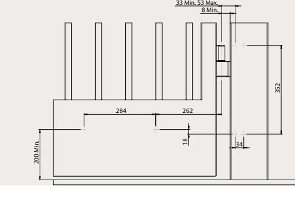

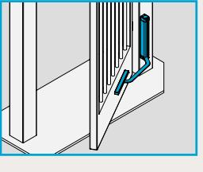

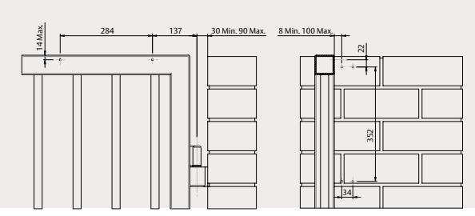

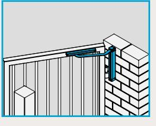

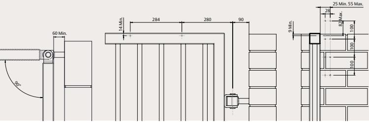

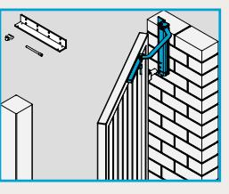

### Beställningsinformation

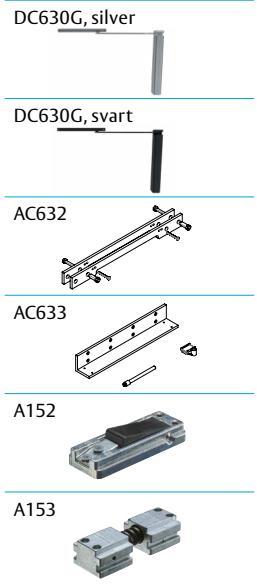

394

60

 60 8

100 100 100 47

12

| Grinddörrstängare                                                                    |                 |
|--------------------------------------------------------------------------------------|-----------------|
| DC630G-L, vänster, silver, EV1                                                       | DC630G-L---EV1- |
| DC630G-R, höger, silver, EV1                                                         | DC630G-R---EV1- |
| DC630G-L, vänster, svart, liknar RAL 9004                                            | DC630G-L---9004 |
| DC630G-R, höger, svart, liknar RAL 9004                                              | DC630G-R---9004 |
|                                                                                      |                 |
| Tillbehör 425 325 284 8                                                  |                 |
| Montageplatta för glidskena AC632, silver, EV1                                       | DCAC632----EV1- |
| 5 Min. 45 Max. 455 Montageplatta för glidskena AC632, svart, liknande RAL 9004 | DCAC632----9004 |
| Vinkelkonsoll AC633, silver, EV1                                                     | DCAC633----EV1- |
| Vinkelkonsoll AC633, svart, liknande RAL 9004                                        | DCAC633----9004 |
| Mekanisk uppställningsenhet A152                                                     | DCA152--------- |
| Mekanisk öppningsdämpare A153                                                        | DCA153--------- |

ASSA ABLOY Opening Solutions Sweden P.O. Box 371 SE-631 05 Eskilstuna Sweden Phone +46 (0)16 17 70 00 Customer support: Phone intl. +46 16 17 71 00 Phone nat. 0771 640 640 helpdesk.se.openingsolutions@assaabloy.com assaabloy.com