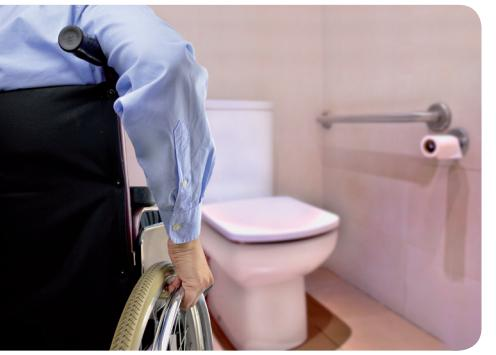
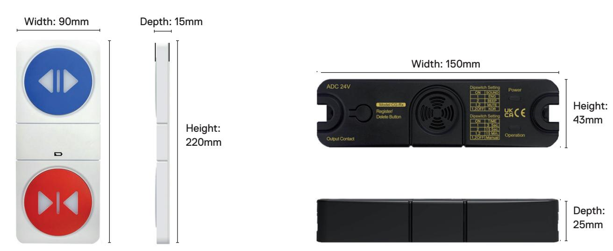
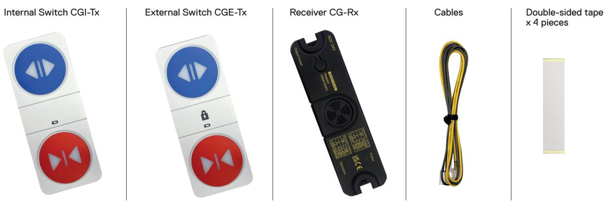

**Clearguard** Activation

# Barrier-Free Public Toilet Door Access Control

# Wireless Technology – IP65

### **EASY TO USE**

Large surface, soft touch push buttons make toilet entry/exit and door locking/unlocking easy for all.

### **ILLUMINATED**

Open/Close buttons illuminate when pressed and the lock symbol on the external switch illuminates when access is attempted to a toilet cubicle already in use. Visual indication when the batteries need replacing.

### **WIRELESS**

Simple push button registration of both the internal and external switches to our 2.4GHz wireless receiver.

### **AUDIO**

Switches can be set to indicate the door position with a beep or spoken word. Audio indication will sound when the batteries need replacing.

**www.hotron.com**

# **Clearguard**

Activation

## **Dimensions**

# **Technical Specifications**

| DC12-30V/AC12-24V                            |  |
|----------------------------------------------|--|
| 1A/30VDC, 0.5A/125VDC                        |  |
| -20 to -50°C                                 |  |
| 150 x 43 x 25mm                              |  |
| Standby: 30mA / Operation: 80mA (for DC 24V) |  |
|                                              |  |

#### **Internal Switch (CGI-Tx) / External Switch (CGE-Tx)**

| Rated frequency          | 2.455GHz          |
|--------------------------|-------------------|
| Battery                  | 1.5V AAA 4EA each |
| Operating temperature    | -20 to -50°C      |
| Product size             | 90 x 220 x 15mm   |
| International protection | IP65              |

## **Parts included**

