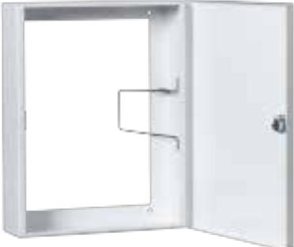

# OR Skåp A4S

## OR-Skåp A4 smal variant för service- och orienteringsritningar A4 format i smal variant med horisontell öppning och brandkårslås

#### **Produktdetajler:**

| Metall                      |
|-----------------------------|
| Vit                         |
| 370x290x55                  |
| Ja, Brandkårslås med nyckel |
|                             |

OR-skåp i format A4 smal variant för orienterings- och service-ritningar för brandlarmanläggningar med ett brandkårslås enligt SS3654:2016. Skåpet har horisontell öppning av locket och är vändbara för höger eller vänster öppning av locket med en fjädrande hållare för dokumenten.

OR-skåpet är avsett för smala A4 pärmar.

Skåpet är tillverkat i 1.5 mm stålplåt som pulverlackeras i vit färg. OR-skåpet har en öppen baksida för att kunna monteras över manöverpanel eller korskopplingsplint direkt på väggen. Baksidan på skåpet har en ram på ca 20 mm med färdigstansade borrhål på 4 mm för att enkelt kunna skruvas fast på väggen. Det finns en knockout för en kabelgenomföring på ovansidan. Som tillbehör finns en nyckelhållare eller DIN-skena med förberett fäste samt förberedda hål för Alarmtech öppningskontakt. Skåpet levereras komplett med en brandnyckel och dekal i rött som är utformad enligt brandnormen att fästas på locket.

| BESTÄLLINGSINFORMATION |      |                                                                                  |  |  |
|------------------------|------|----------------------------------------------------------------------------------|--|--|
| Typ                    | E-nr | Beskrivning                                                                      |  |  |
| OR-Skåp A4S            |      | OR Skåp A4 smal variant i stålplåt med horisontell öppning och brandkårslås, vit |  |  |

## **ALARMTECH SWEDEN AB**

### **Relaterade produkter och tillbehör:**

| NH A4                                           |
|-------------------------------------------------|
| Nyckelhållare - Tillbehör för Docbox A4         |
| DIN A4                                          |
| DIN-skena för montering i A4 skåp, metall       |
| SAB 1                                           |
|                                                 |
| BL 1                                            |
| Brandkårslås med nyckel för OR-skåp A4 eller A3 |

Powered by TCPDF (www.tcpdf.org)