Dokumentskåp i A4- och A3-format **POWER SUPPLIES** för inbrottslarmanläggningar

# **Dokumentskåp i A4- och A3-format för inbrottslarmanläggningar**

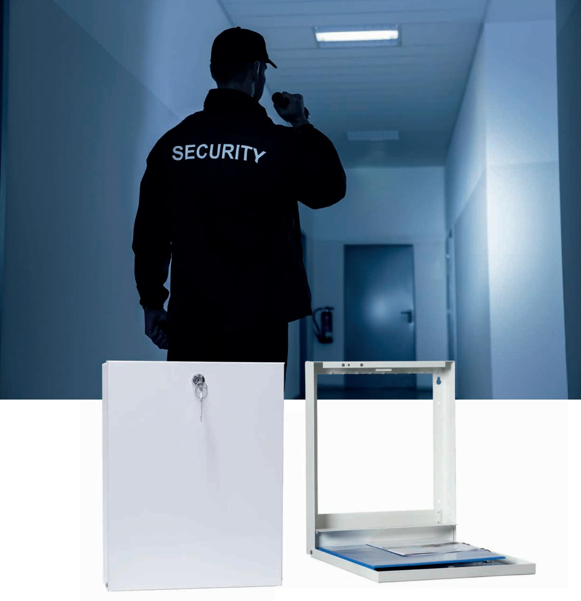

Alarmtech DOCBOX dokumentskåp och ritningsskåp är avsedda att förvara service- och orienteringsritningar i närheten av manöverpanelen enligt SSF 130:8. Skåpen finns i A4-eller A3-format. Dokumentskåpen finns med horisontell öppning eller med vertikal öppning. De horisontellt öppnade skåpen är vändbara för höger eller vänsterhängd dörr och har en fjädrande dokumenthållare som hindrar att dokumenten att falla ut vid öppning. Locket för de vertikalt öppnade skåpen stannar i horisontellt läge och bildar en arbetsyta för dokument, mätinstrument eller laptop.

Skåpen är tillverkade i 1,5 mm stålplåt som pulverlackas i färgerna vit eller antracitgrå som lagervara. Annan färg kan erhållas som specialbeställning. De har en öppen baksida för att exempelvis kunna monteras över en manöverpanel eller korskopplingsplint direkt på väggen. Det finns en knockout för kabelgenomföring på ovansidan. Skåpen finns i ett format för A4-pärmar med tjock rygg eller smal rygg. De är försedda med ett fäste för nyckelhållare eller DIN-skena. Varje skåp är förberett med hålbild för Alarmtech öppningskontakt.

Dokumentskåpet A4 finns även med hålbild anpassad för ett kodlås eller en industricylinder av standardtyp t.ex. ASSA cylinderlås (8450).

## Dokumentskåp i A4- och A3-format för inbrottslarmanläggningar

# **DOCBOX A4V**

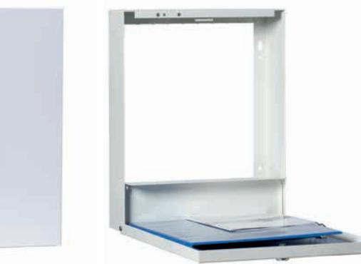

- Dokumentskåp A4 med vertikal öppning och lås med 2 nycklar.
- Dokumentskåpet är avsett för A4-pärmar.
- Öppen baksida för att kunna monteras över manöverpanel.
- Knock-out hål på ovansidan för kabelgenomföring.
- Levereras med 2 nycklar.
- Färg vit eller antracitgrå.

# **DOCBOX A4SV**

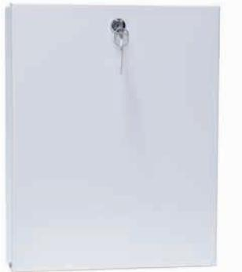

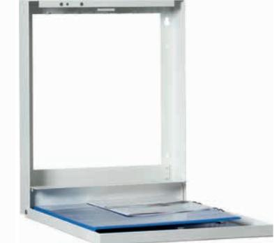

- • Dokumentskåp A4 smal variant med vertikal öppning och lås med 2 nycklar.
- • Dokumentskåpet är avsett för smala A4-pärmar.
- • Öppen baksida för att kunna monteras över manöverpanel.
- • Knock-out hål på ovansidan för kabelgenomföring.
- • Levereras med 2 nycklar.
- • Färg vit eller antracitgrå.

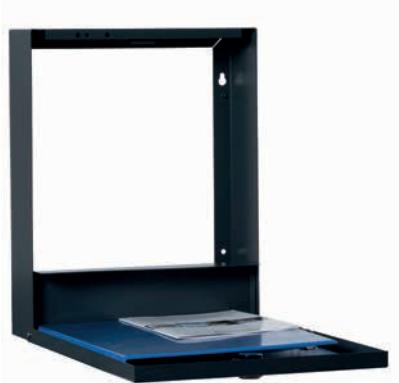

#### Mått (L x B x H) 370 x 290 x 55 mm

#### **Beställningsinformation**

| Typ           | E-nr    | Beskrivning                                                                          |
|---------------|---------|--------------------------------------------------------------------------------------|
| DOCBOX A4SV   | 6303475 | Dokumentskåp A4 smal variant i stålplåt med vertikal öppning och lås, vit         |
| DOCBOX A4SV-A |         | Dokumentskåp A4 smal variant i stålplåt med vertikal öppning och lås, antracitgrå |

### Mått (L x B x H) 370 x 290 x 85 mm

| Typ          | E-nr    | Beskrivning                                                            |
|--------------|---------|------------------------------------------------------------------------|
| DOCBOX A4V   | 6303474 | Dokumentkåp A4 i stålplåt med vertikal öppning och lås, vit         |
| DOCBOX A4V-A |         | Dokumentkåp A4 i stålplåt med vertikal öppning och lås, antracitgrå |

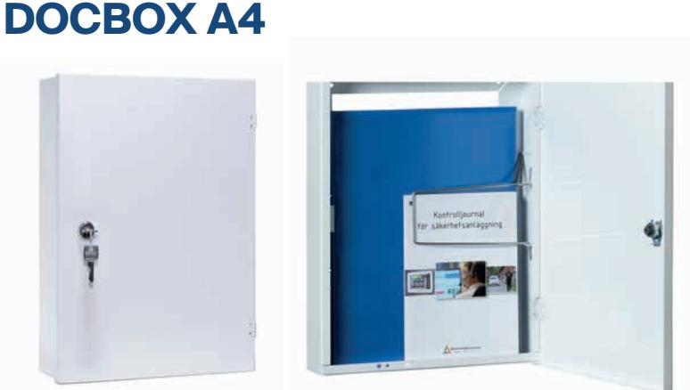

- Dokumentskåp A4 med horisontell öppning och lås med 2 nycklar.
- Dokumentskåpet är avsett för A4-pärmar.
- Öppen baksida för att kunna monteras över manöverpanel.
- Levereras med 2 nycklar.
- Färg vit eller antracitgrå.

### Mått (L x B x H) 370 x 290 x 85 mm

#### **Beställningsinformation**

| Typ         | E-nr    | Beskrivning                                                                    |
|-------------|---------|--------------------------------------------------------------------------------|
| DOCBOX A4   | 6309149 | Dokumentkåp A4 i stålplåt med horisontell öppning och lås, vit              |
| DOCBOX A4-A |         | OR Skåp A4 i stålplåt med horisontell öppning och brandkårslås, antracitgrå |

# **DOCBOX A4S**

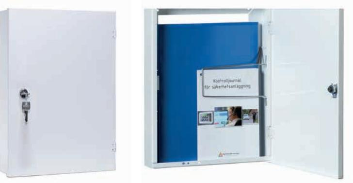

- Dokumentskåp A4 smal variant med horisontell öppning och lås med 2 nycklar.
- Dokumentskåpet är avsett för smala A4-pärmar.
- Öppen baksida för att kunna monteras över manöverpanel.
- Levereras med 2 nycklar.
- Färg vit eller antracitgrå.

### Mått (L x B x H) 370 x 290 x 55 mm

| Typ          | E-nr    | Beskrivning                                                                             |
|--------------|---------|-----------------------------------------------------------------------------------------|
| DOCBOX A4S   | 6303476 | Dokumentskåp A4 smal variant i stålplåt med horisontell öppning och lås, vit         |
| DOCBOX A4S-A |         | Dokumentskåp A4 smal variant i stålplåt med horisontell öppning och lås, antracitgrå |

# **DOCBOX A4-CL**

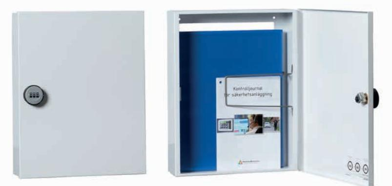

- Dokumentskåp A4 med horisontell öppning och kodlås.
- Dokumentskåpet är avsett för A4-pärmar.
- Öppen baksida för att kunna monteras över manöverpanel.
- Levereras med kodlås.

- Mått (L x B x H) 370 x 290 x 85 mm
#### **Beställningsinformation**

| Typ          | E-nr    | Beskrivning                               |
|--------------|---------|-------------------------------------------|
| DOCBOX A4-CL | 6309274 | Dokumentkåp A4 i stålplåt med horisontell |
|              |         | öppning och kodlås, vit                   |

- Färg vit.
# **DOCBOX A4-I**

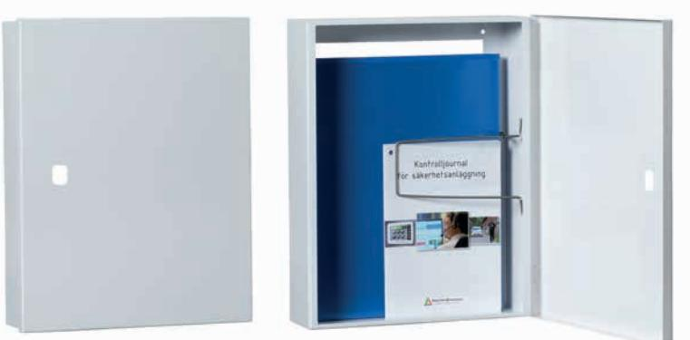

- Dokumentskåp A4 med horisontell öppning utan lås med hål avsett för ASSA cylinderlås 8450.
- Dokumentskåpet är avsett för A4-pärmar.
- Öppen baksida för att kunna monteras över manöverpanel.
- Levereras utan lås och nyckel.
- Färg vit.

### Mått (L x B x H) 370 x 290 x 85 mm

#### **Beställningsinformation**

| Typ         | E-nr    | Beskrivning                                                                                              |
|-------------|---------|----------------------------------------------------------------------------------------------------------|
| DOCBOX A4-I | 6309273 | Dokumentskåp A4 i stålplåt med horisontell öppning utan lås med hål för ASSA cylinderlås 8450, vit |

3

## Dokumentskåp i A4- och A3-format för inbrottslarmanläggningar

# **DOCBOX A3V**

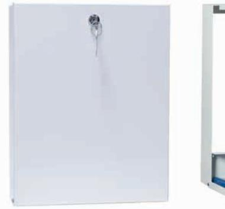

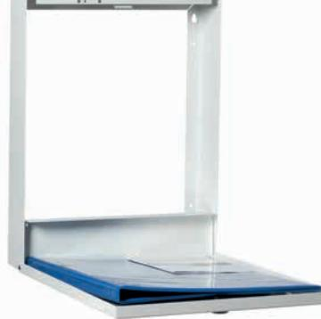

- Dokumentskåp A3 med vertikal öppning och lås med 2 nycklar.
- Dokumentskåpet är avsett för A3-pärmar.
- Öppen baksida för att kunna monteras över manöverpanel.
- Knock-out hål på ovansidan för kabelgenomföring.
- Levereras med 2 nycklar.
- Färg vit eller antracitgrå.

# **DOCBOX A3SV**

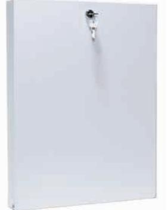

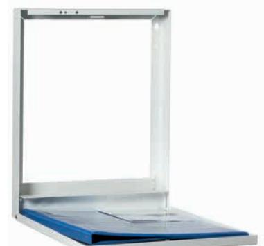

- • Dokumentskåp A3 smal variant med vertikal öppning och lås med 2 nycklar.
- • Dokumentskåpet är avsett för smala A3-pärmar.
- • Öppen baksida för att kunna monteras över manöverpanel.
- • Knock-out hål på ovansidan för kabelgenomföring.
- • Levereras med 2 nycklar.
- • Färg vit eller antracitgrå.

### Mått (L x B x H) 465 x 355 x 90 mm

**Beställningsinformation**

| Typ          | E-nr | Beskrivning                                                            |
|--------------|------|------------------------------------------------------------------------|
| DOCBOX A3V   |      | Dokumentkåp A3 i stålplåt med vertikal öppning och lås, vit         |
| DOCBOX A3V-A |      | Dokumentkåp A3 i stålplåt med vertikal öppning och lås, antracitgrå |

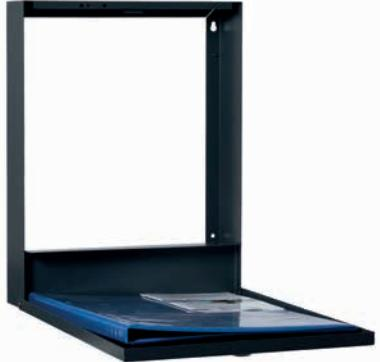

#### Mått (L x B x H) 465 x 355 x 55 mm

| Typ           | E-nr | Beskrivning                                                                          |
|---------------|------|--------------------------------------------------------------------------------------|
| DOCBOX A3SV   |      | Dokumentskåp A3 smal variant i stålplåt med vertikal öppning och lås, vit         |
| DOCBOX A3SV-A |      | Dokumentskåp A3 smal variant i stålplåt med vertikal öppning och lås, antracitgrå |

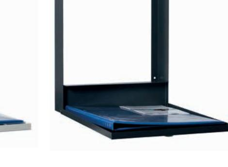

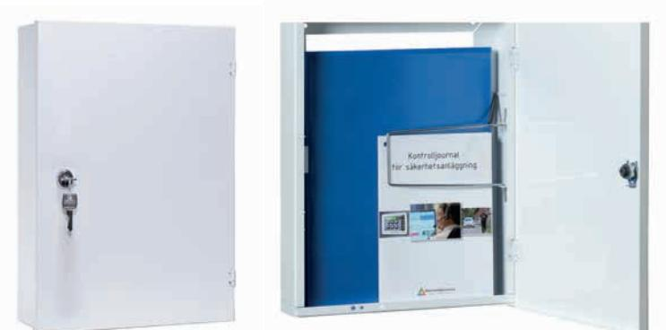

- Dokumentskåp A3 med horisontell öppning och lås med 2 nycklar.
- Dokumentskåpet är avsett för A3-pärmar.
- Öppen baksida för att kunna monteras över manöverpanel.
- Knock-out hål på ovansidan för kabelgenomföring.
- Levereras med 2 nycklar.
- Färg vit eller antracitgrå.

# **DOCBOX A3S**

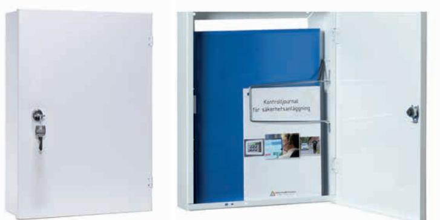

- Dokumentskåp A3 smal variant med horisontell öppning och lås med 2 nycklar.
- Dokumentskåpet är avsett för smala A3-pärmar.
- Öppen baksida för att kunna monteras över manöverpanel.
- Knock-out hål på ovansidan för kabelgenomföring.
- Levereras med 2 nycklar.
- Färg vit eller antracitgrå.

### Mått (L x B x H) 465 x 355 x 90 mm

#### **Beställningsinformation**

| Typ         | E-nr | Beskrivning                                                                |
|-------------|------|----------------------------------------------------------------------------|
| DOCBOX A3   |      | Dokumentskåp A3 i stålplåt med horisontell öppning och lås, vit         |
| DOCBOX A3-A |      | Dokumentskåp A3 i stålplåt med horisontell öppning och lås, antracitgrå |

### Mått (L x B x H) 465 x 355 x 55 mm

| Typ          | E-nr | Beskrivning                                                                             |
|--------------|------|-----------------------------------------------------------------------------------------|
| DOCBOX A3S   |      | Dokumentskåp A3 smal variant i stålplåt med horisontell öppning och lås, vit         |
| DOCBOX A3S-A |      | Dokumentskåp A3 smal variant i stålplåt med horisontell öppning och lås, antracitgrå |

## Dokumentskåp i A4- och A3-format för inbrottslarmanläggningar

# **Dokumentskåp Tillbehör**

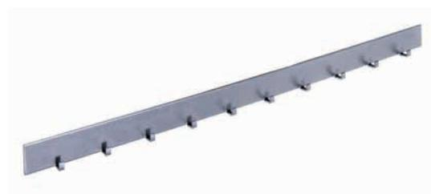

### **NH A4**

Nyckelhållare för 10 stycken nycklar avsedd att monteras i dokumentskåp A4. Skåpen har färdigstansade hål för nyckelhållaren.

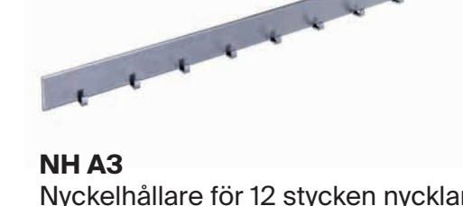

Nyckelhållare för 12 stycken nycklar avsedd att monteras i dokumentskåp A3. Skåpen har färdigstansade hål för nyckelhållaren.

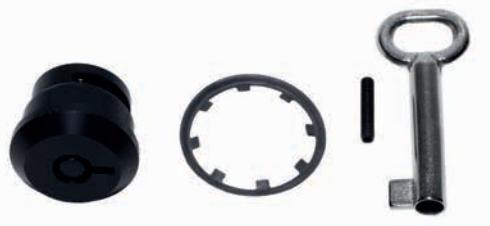

### **BL 1**

Brandkårslås med nyckel för dokument skåp A4 eller A3.

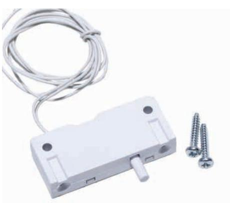

### **SAB 1**

Öppningskontakt för utökad säkerhet avsedd att monteras i dokumentskåp A4 eller A3.

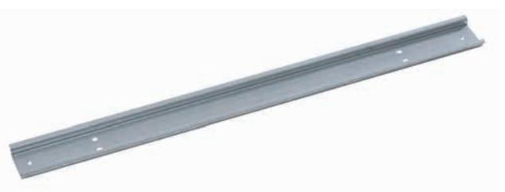

### **DIN A4**

DIN-skena för montering i A4-skåp. Kan användas för montering av egen utrustning på DIN skena i dokument skåp A4. Skåpen har färdigstansade hål för DIN-skenan.

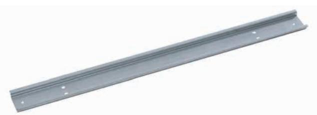

### **DIN A3**

DIN-skena för montering i A3-skåp. Kan användas för montering av egen utrustning på DIN skena i dokument skåp A3. Skåpen har färdigstansade hål för DIN-skenan.

För mer information: www.alarmtechglobal.com