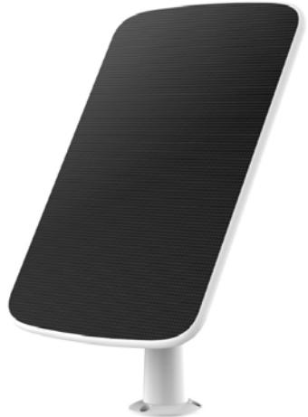

## **CS-CMT-Solar Panel-E**

**EZVIZ Solar Charging Panel with Type-C Interface**

## **Introduction**

EZVIZ solar charging panel can power battery camera. It makes battery cameras more convenient to use and eliminates the need to disassemble and recharge battery.

## **Specification**

| Model                     | CS-CMT-Solar Panel-E                                     |
|---------------------------|----------------------------------------------------------|
| Performance parameter     |                                                          |
| Open circuit voltage      | 7.2±5%                                                   |
| Short circuit current     | 1090mA±5%                                                |
| Power voltage             | 6V ±5%                                                   |
| Power current             | 1030mA ±5%                                               |
| Max. Power                | 6.18W                                                    |
| Interface                 | Type-C                                                   |
| Transformation efficiency | 21.6%                                                    |
| Operation temperature     | -20℃ ~60℃(-4℉~140℉)Humidity 90% or less (non-condensing) |
| IP Grade                  | IP65                                                     |
| Mechanical Data           |                                                          |
| Solar Cell Type           | Monocrystalline solar cells                              |
| Product Dimensions        | 283.7mm x 185.7mm x 2.4mm                                |
| Packaging Dimensions      | 300x202.5x78mm                                           |
| Certification             | ROHS\WEEE\REACH\EMC                                      |
| Weight                    | Net weight: 484g With package: 854g                |

**Data under standard testing conditions (STC): 1000W/m**²,**AM1.5,25**℃,(**38000-40000LUX)**

