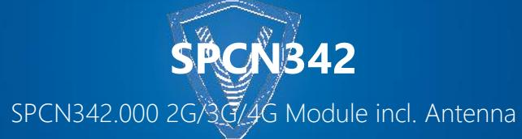
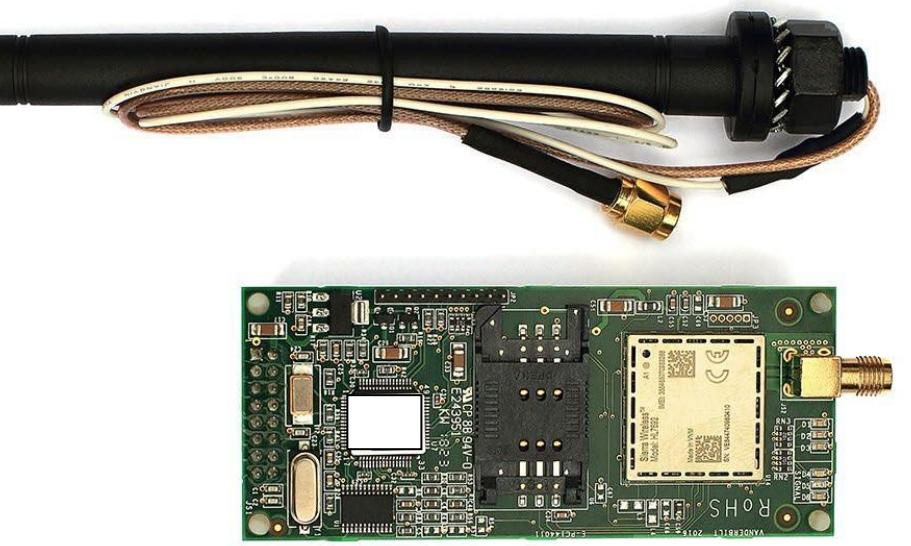
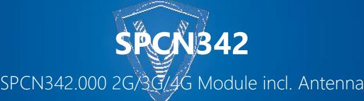
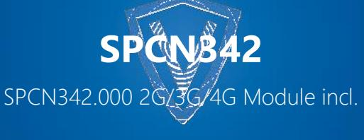

#### **Overview:**

The 2G/3G/4G module can be assigned to any mobile network by the insertion of a standard SIM card. The modem is compatible with the complete range of SPC panels and plugs directly on the main PCB removing the need for any additional wiring.

The unit comes with an external antenna that fits on the cabinet. The modem communicates with an alarm receiving centre (ARC) using IP based protocols like EDP or FlexC over 2G/3G/4G (FW3.13.5 or later) to transmit alarm event to compatible alarm receiving centres.

It also supports a connection to SPC Connect Pro Software for remote programming and configuration up-/download (requires a static connection to SPC Connect). The SMS feature allows user/ engineer to be sent a predefined text when selected events occur in the system or receiving of predefined SMS commands for security system control. The GSM modem can be used as the primary source of communication or as backup to the IP communication.

# **Features & Benefits:**

## **WIRELESS REMOTE COMMUNICATION**

The communication module enables the control panel to communicate with 2G, 3G or 4G networks and can be used as a primary or as a backup for the Ethernet communication path for IP alarm event transmission to a FlexC/EDP compatible receivers.

### **SMS REPORTING**

The SPC system can support up to 100 SMS numbers (SPC6xxx) each number can have a unique filter of which events are to be sent.

# **SMS CONTROL**

Users who have SMS configured can be given the ability to fullset, unset, restore alerts and/or control outputs remotely.

#### **EASY MOUNTING AND CONFIGURATION**

The modem plugs directly onto the SPC controller main board removing the need for any additional wiring. All the module functions are configurable via the control panel.

#### **Additional Features:**

- **•** 2G/3G/4G network support
- **•** SMS events
- **•** SMS commands
- **•** FlexC and EDP protocol transmission via TCP/IP
- **•** Compliance with latest approval standards such as EN
- **•** Low power consumption

| Technical Data       |                                                                                           |  |  |
|-------------------------|-------------------------------------------------------------------------------------------|--|--|
| SPC Controller Firmware | FW3.13.5 or later                                                                      |  |  |
| Network connection      | 2G frequencies: 900 MHz/1800MHz                                                           |  |  |
|                         | 3G frequencies: 900 MHz/1800MHz                                                           |  |  |
|                         | 4G frequencies: 800MHz/900MHz/1800MHz                                                     |  |  |
| Sim card size           | Standard SIM card (not supplied with the product)                                         |  |  |
| Antenna                 | Supplied with the product, panel mounted, complete with 380mm of cable & BNC connector |  |  |
| Operating current       | Max. 130 mA at 12 VDC                                                                     |  |  |
| Quiescent current       | Max. 40 mA at 12 VDC                                                                      |  |  |
| Operating temperature   | -10° ~ +50 °C                                                                             |  |  |
| Dimensions              | 90 x 38 x 25 (PCB)                                                                        |  |  |
| Relative humidity       | Max. 90 % (non-condensing)                                                                |  |  |
| Mounting                | Plug on module to SPC controller                                                          |  |  |
| Weight                  | 0.130 kg                                                                                  |  |  |
| Approvals               | EN, VDS                                                                                   |  |  |

# **Ordering Information:**

| Type        | Art. No.         | Description                   | Weight* |
|-------------|------------------|-------------------------------|---------|
| SPCN342.000 | V54550-B102-A600 | 2G/3G/4G Module incl. Antenna | 0.130kg |
| SPCW101.000 | V54559-B101-A100 | External aerial kit           | 0.090kg |

*Data and design subject to change without notice.*

# **Vanderbilt International Ltd.**

Clonshaugh Business and Technology Park Clonshaugh, Dublin D17 KV 84, Ireland +353 1 437 2560