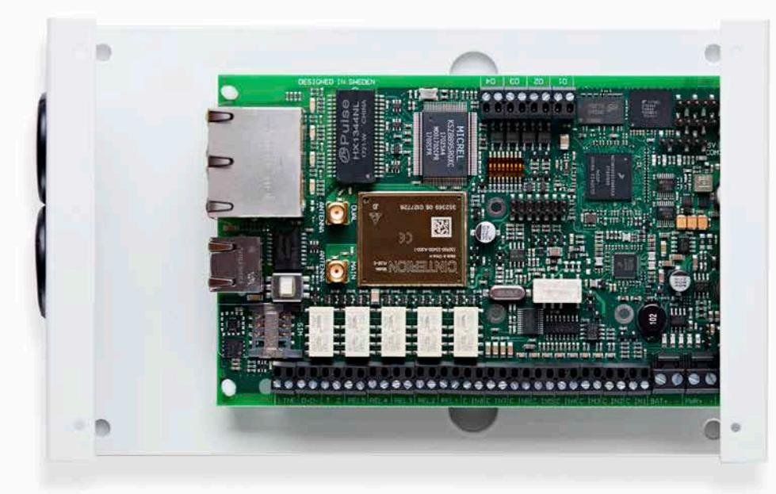

# **Edge RT7020 Enterprise**

Edge RT7020 är en Smart Gateway som kombinerar avancerad och snabb routerteknologi med certifierad överföring av brand- och inbrottslarm. Den har designats utifrån säkerhetsbranschens hårda krav och kan användas för att länka samman alla säkerhets- och kontrollsystem i en byggnad.

- **Egenskaper**
- y Edge RT7020 Enterprise skapar en effektiv knutpunkt för anslutning av olika larm- och övervakningssystem inom samma fastighet.
- y Dubbla kommunikationsvägar för larmöverföring. Radio och fast IP-förbindelse.
- y Erbjuder säker fjärraccess till anslutna system.

### **Fördelar**

- y Framtidssäker.
- y Snabb och enkel installation.
- y Smidig konfiguration via Edge Manager.
- y Automatisk driftsättning via AddSecure Connect-plattform.
- y Inkluderar LINK SIM-kort med datamängd avsedd för larmkommunikation. Extra mobildata för övrig trafik finns som tillägg.

## **Tekniska specifikationer Edge RT7020 Enterprise**

| Ethernet Standard Anslutning IP adressering Feldetektering                                            | 1 x WAN för larmkommunikation och 4 x LAN med VLAN teknologi och VPN (ej standard) RJ45 kontakt för CAT5 kablage Dynamisk (DHCP) eller fast Ja |
|-------------------------------------------------------------------------------------------------------------------|------------------------------------------------------------------------------------------------------------------------------------------------------------|
| Strömförsörjning Matningsspänning Strömförbrukning                                                          | 11-30 VDC 200mA @ 12VDC                                                                                                                                 |
| Mobilnät Teknologier Frekvenser Antennanslutning Feldetektering                                       | 2G/3G/4G LTE (4G): 800/900/1800/2100/2600 MHz UMTS (3G): 900/2100 MHz GSM (2G): 900/1800 MHz SMA Ja                                         |
| Larmtransmission gränssnitt Gränssnitt mot larmcentral Dial capture mot larmpanel Seriellt mot larmpanel | AddSecure Connect Skruvplint för två trådar RS485, TTL, RS232                                                                                        |
| In- och utgångar Ingångar Utgångar                                                                          | 8 digitala ingångar 5 bi-stabila reläutgångar och 4 potentialfria utgångar                                                                              |
| Kapsling Material                                                                                              | Metall                                                                                                                                                     |
| Vikt och dimensioner Vikt Storlek [L x H x B] Temperaturområde                                           | 1,2 kg 21,5 x 4,5 x 13,5 cm -5̊ till +40̊ C                                                                                                          |
| Artikelnummer                                                                                                     | 22 400 125                                                                                                                                                 |

# **Tillbehör**

| Beskrivning                                                                                                    | Artikelnummer |
|----------------------------------------------------------------------------------------------------------------|---------------|
| Edge EXT2 Expansionskort med ytterligare 8 digitala ingångar och 4 potentialfria utgångar.                  | 22 400 126    |
| Edge RT PSU 12V/1A strömförsörjningsaggregat i metallkapsling med batteribackup. Plats för ett 7Ah batteri. | 22 400 128    |

| Standarder   |                              |
|--------------|------------------------------|
| EN50136-2    | 2014/53/EU (Radiodirektivet) |
| SSF114       | 2015/863/EU (ROHS 3.0)       |
| SBF110:8     | 1907/2006/EU (REACH)         |
| EN50131-10   | 2002/96/EC (WEEE)            |
| EN54-21:2006 |                              |