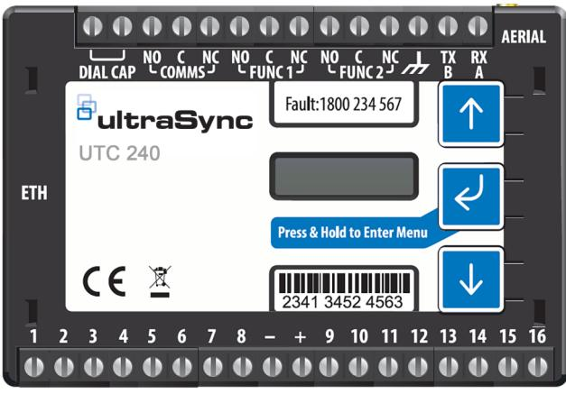

# 2010-2-UC240-KIT

**UC240 Kit (incl. enclosure) for fire panel, UltraSync communicator with IP and 4G/2G dual path suitable**

#### **Overview**

UC240 UltraSync communicator is a dual path alarm signalling unit for transmitting alarm signals from a customer's alarm panel to a Central Monitoring Stations (CMS). The monitoring path is based on IP and SIM 4G/2G mobile technology. The unit is designed for use in both security and fire systems.

• Dual-path monitoring for low, medium and high risk sites, covering intruder applications, fire and more.

• These monitored alarm signalling devices are small enough to fit inside most alarm panels. They use two signalling paths – if the primary path is down, the secondary path kicks in. And if that happens, the secondary path will use the primary path reporting and polling times.

• The primary path uses IP technology to send alarm signals over the customer's network or broadband hub.

• The secondary path uses 4G or 2G mobile connectivity – with dual SIMs for extra resilience.

• EN50131 Grade 3 and EN50136 certified for intrusion systems.

- EN54-21 certified for fire alarm systems.
### **Alarm panel interfaces**

• 16 general purpose alarm inputs (Logic High = +2 to +30 V / Logic Low = <1.3 V)

- 3 relay outputs
- Unconnected state: Logic Low
- Standard screw terminals
- Programmable function output-for remote control of site devices
- Line fault output-for status indication at site of alarm signalling path
- Dial Capture with phone line simulation
- Onboard RS232 or RS485 for direct panel interface to some panels

#### **Dial Capture features**

• Converts dialler alarm systems into high security signalling devices

• Alarm panel interface supports: Ademco Contact ID, Ademco Hi

Speed, Ademco 4+1, Ademco 4+2, SIA 1/2/3

#### **Configuration**

- Simple single push button pin learn
- iOS and Android installer app
- Using on board menu driven by push buttons

## 2010-2-UC240-KIT

**UC240 Kit (incl. enclosure) for fire panel, UltraSync communicator with IP and 4G/2G dual path suitable**

#### **Technical specifications**

| Allmänt               |                                                                                                                         |
|-----------------------|-------------------------------------------------------------------------------------------------------------------------|
| Product line          | UltraSync                                                                                                               |
| Nätverk               |                                                                                                                         |
| Communicator type     | 2G, 4G, Cellular, IP                                                                                                    |
| GSM frequency         | LTE: Penta-Band 700 (Bd28) / 800 (Bd20) / 900 (Bd8) / 1800 (Bd3) / 2100 MHz (Bd1) + GPRS Dual band (900/1800 MHz) |
| Rapportering          |                                                                                                                         |
| Reporting protocols   | Contact ID, SIA                                                                                                         |
| Supported receivers   | UltraSync                                                                                                               |
| Interface             |                                                                                                                         |
| Ethernet              | RJ-45 1000 Mbps Ethernet Interface                                                                                      |
| Antenna               | Yes, included                                                                                                           |
| Ingång/utgång         |                                                                                                                         |
| Inputs                | 16 general purpose alarm inputs                                                                                         |
| Outputs               | 3 relay outputs                                                                                                         |
| Spänning              |                                                                                                                         |
| Operating voltage     | 9.5 to 30 VDC                                                                                                           |
| Current consumption   | 85mA @12 VDC                                                                                                            |
| Mått                  |                                                                                                                         |
| Physical dimensions   | 95 x 67 x 17 mm                                                                                                         |
| Colour                | Black                                                                                                                   |
| Miljö                 |                                                                                                                         |
| Operating temperature | -10 to +55°C                                                                                                            |
| Relative humidity     | 5 to 75%                                                                                                                |
| Miljö                 | EN50130-5 ; Class II - Indoor (General)                                                                                 |
| Regulatory            |                                                                                                                         |
| Intygande             | EN50131 Grade 3, EN50136, EN54-21                                                                                       |
|                       |                                                                                                                         |

[Powered by TCPDF (www.tcpdf.org)](http://www.tcpdf.org)

Carrier Fire & Security förbehåller sig rätten att ändra produktspecifikationer utan föregående meddelande. För de senaste produktspecifikationerna, besök se.firesecurityproducts.com online eller kontakta din försäljningsrepresentant.