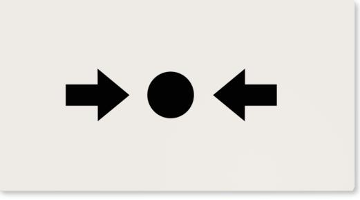

# N-MC-FE **MCP accessory, intelligent manual call point frangible element**

#### **General**

The N-MC-FE is a glass trigger element for compatible, Type-A series manual call points. It may be used as alternative for resettable elements that are normally used in these manual call points. The N-MC-FE allows the manual call point to be easily activated without the need for tools.

### **Visual indication**

The N-MC-FE uses clear black print on a brilliant white background. An arrow on either side pointing inwards towards a dot indicates to the operator where to push on the element to activate the manual call point.

#### **Easy to install**

Installation of the frangible element in a compatible manual call point is made easy by the design of the manual call point. Using the test key the front cover of the manual call point is removed, allowing the insertion of the N-MC-FE with a quick and simple action.

#### **Safe to use**

The coated glass element is designed to break easily and safely across a vertical running break guide, consistently in the same place. Little force is required to break the element, eliminating the need for special tools to facilitate activation. The glass coating ensures no splintering of the glass, avoiding possible injury to the operator during the activation process.

#### **Detaljer**

- Quick installation without special tools
- Easy to retrofit
- Coated glass prevents operator injury by controlling the glass break and avoiding glass fragments
- Easy break glass for smooth and consistent breaks in the same position
- Easy to operate without the need for hammers
- EN54 certified with compatible manual call points

# N-MC-FE **MCP accessory, intelligent manual call point frangible element**

## **Technical specifications**

| General               |                               |
|-----------------------|-------------------------------|
| User interface        | Printed                       |
| Compatibility         | Excellence manual call points |
| Physical              |                               |
| Physical dimensions   | 68 x 37 x 3 mm (W x H x D)    |
| Net weight            | 11.5 g                        |
| Colour                | Beige, Vit (RAL 9003)         |
| Mounting type         | Tillbehör                     |
| Material (body)       | Glas, Polykarbonat            |
| Functional marking    | →●←                           |
| Environmental         |                               |
| Vandal proof          | No                            |
| Operating temperature | −25 to +72°C                  |
| Storage temperature   | −25 to +72°C                  |
| Relative humidity     | 10 to 95% noncondensing       |
| Miljö                 | Inomhus, Utomhus              |
| Regulatory            |                               |
| Compliancy            | CE, REACH, RoHS 3, WEEE       |
| Standards             | EN54-11                       |

[Powered by TCPDF (www.tcpdf.org)](http://www.tcpdf.org)

Carrier Fire & Security förbehåller sig rätten att ändra produktspecifikationer utan föregående meddelande. För de senaste produktspecifikationerna, besök se.firesecurityproducts.com online eller kontakta din försäljningsrepresentant.