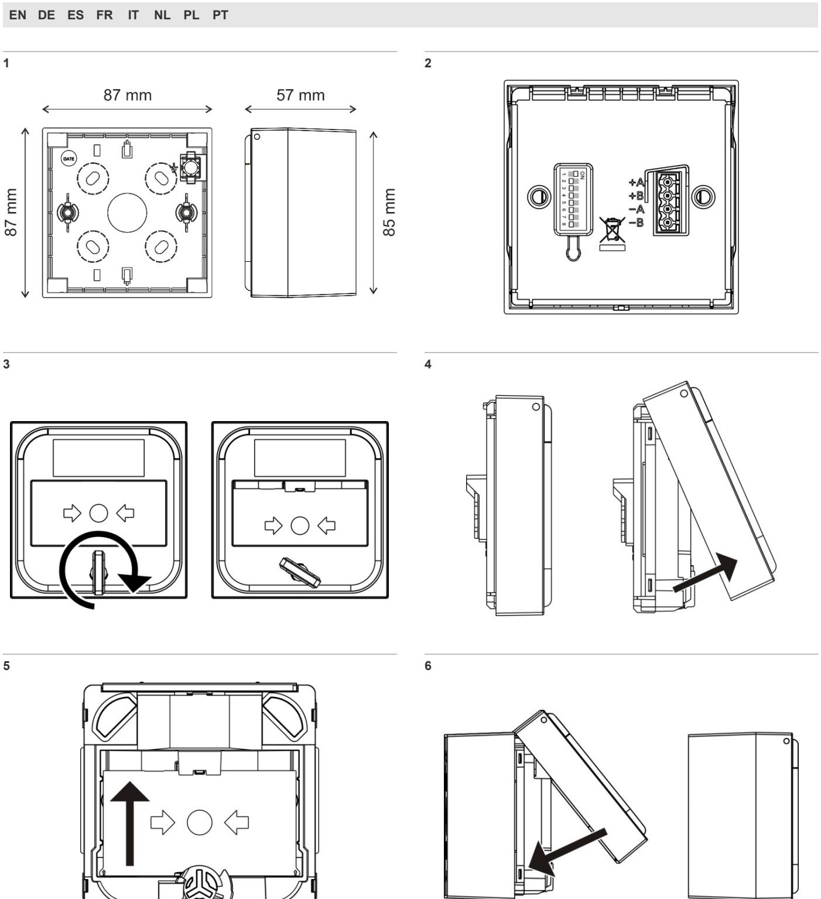
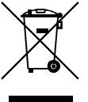
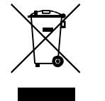
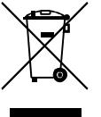

# DM3000 Series Intelligent Addressable Manual Call Point Installation Sheet

## **EN: Installation Sheet**

## **Description**

The DM3000 Series Intelligent Addressable Manual Call Point is designed for indoor use and supports the Aritech 2000 protocol.

All units are supplied with a resettable element – this can be replaced with a breakable element, if required (order number N-MC-FE). See ["Replacing the resettable element"](#page-2-0) on page [3.](#page-2-0)

The series includes the following models.

| Model       | Description                                                                             |
|-------------|-----------------------------------------------------------------------------------------|
| DM3010R [1] | Red intelligent addressable manual call point                                           |
| DM3110R [1] | Red intelligent addressable manual call point with integrated short circuit isolator |

[1] Also available in blue, green, orange, white, and yellow.

## **Figures**

**Figure 1: Mounting holes and dimensions**

**Figure 2: Front assembly terminal block and DIP switch**

**Figure 3: Unlocking the front cover**

**Figure 4: Removing the front cover**

**Figure 5: Removing the resettable element**

**Figure 6: Replacing the front cover**

## **Installation**

**Caution:** This product must be installed and maintained by qualified personnel adhering to all local or national installation requirements and any other applicable regulations.

### **Addressing**

Set the device address before installation using the DIP switch on the back of the front assembly (see Figure 2).

The address range is 001-128. See the table on the last page of this publication for DIP switch positions for each address.

**Note:** If you change the device address after installation, you must disconnect the device from the loop power for at least one second and then reconnect it for the new address to be recognised.

### **Installation**

The manual call point can be surface mounted or recess mounted.

For surface mounting, order one of the backboxes shown in the table below.

| Model     | Description   |
|-----------|---------------|
| N-MC-BB-R | Red backbox   |
| N-MC-BB-U | Blue backbox  |
| N-MC-BB-G | Green backbox |

| Model     | Description    |
|-----------|----------------|
| N-MC-BB-O | Orange backbox |
| N-MC-BB-W | White backbox  |
| N-MC-BB-Y | Yellow backbox |

For recess mounting, order one of the recess adaptors and (if required) trim skirts shown in the table below.

| Model       | Description                        |
|-------------|------------------------------------|
| N-MC-AFM-R  | Red recess adaptor                 |
| N-MC-AFMG-R | Red recess adaptor with fork grips |
| N-MC-S-R    | Red trim skirt                     |
| N-MC-AFM-G  | Green recess adaptor               |
| N-MC-S-G    | Green trim skirt                   |

Remember to remove the protective dust cover after commissioning.

**Note:** The dust cover may also be used to indicate when the unit is not operational (for example, before commissioning, during maintenance, when disabled, etc.)

**To surface mount the manual call point:**

- 1. Fix the backbox onto the wall using 4 × M4 screws (not supplied) and feed the loop cable through the selected cable knockouts.
Depending on your installation requirements, the backbox can be installed with two cable knockouts at the top and one at the bottom or with one cable knockout at the top and two at the bottom.

See Figure 1 for the location of the mounting holes.

- 2. Connect loop cable to the supplied terminal block, and then plug the terminal block into the PCB connector on the back of the front assembly (see Figure 2).
Use the supplied cable link to test cable continuity before the terminal block is plugged into the PCB connector on the back of the front assembly.

See ["Wiring" on page 3](#page-2-1) for terminal block connections and loop cable specifications.

- 3. Unlock and remove the front cover, and then remove the resettable element.
To unlock the front cover, insert the key and turn it clockwise (two clicks), then pull the cover outwards from the bottom to remove it (see Figure 3 and Figure 4).

To remove the resettable element, push the element up, and then pull it out (see Figure 5).

- 4. Fix the front assembly to the backbox using the 2 screws supplied with the unit (located in the backbox).
- 5. Replace the resettable element (or add the breakable element, if required), and then replace the front cover (see Figure 6).

Turn the key anticlockwise (two clicks) to lock the cover, and then remove the key.

Finally, test the manual call point (see ["Testing"](#page-2-2) on page [3)](#page-2-2).

### **Wiring**

For optimal system performance, use 0.13 to 3.31 mm² (0.40 to 2.05 mm) twisted-pair cable with a maximum length of 2 km.

Wire the unit as described below. Observe the indicated polarity.

| Terminal | Description       |
|----------|-------------------|
| A+       | Positive line (+) |
| B+       | Positive line (+) |
| A–       | Negative line (–) |
| B–       | Negative line (–) |

### **Device status**

The device status is indicated by two colour changing LEDs on the front of the unit, as shown in the table below.

| State            | Indication             |
|------------------|------------------------|
| Alarm            | Steady red LEDs [1]    |
| Isolation active | Steady yellow LEDs [2] |
| Fault            | Flashing yellow LEDs   |
| Communicating    | Flashing green LEDs    |

[1] This may also indicate an active Locate Device command from the control panel.

[2] DM3110 models only.

## **Maintenance and testing**

#### **Maintenance**

The unit should be maintained and tested according to local or national requirements and any other applicable regulations. Do not modify internal wiring or circuitry.

### **Testing**

To activate an alarm, push the resettable element or turn the key clockwise (one click). To reset the device, turn the key anticlockwise (one click). Reset the control panel after testing.

### **Replacing the resettable element**

Replace the resettable element (or add the breakable element) as follows:

- 1. Unlock and remove the front cover as described in ["Installation"](#page-1-0) on page [2.](#page-1-0)
- 2. Push the element up, and then pull it out (see Figure 5).
- 3. Replace the resettable element (or add the breakable element, if required).
- 4. Replace the front cover.

#### **Analogue values**

Analogue values for diagnosing and troubleshooting device status are shown in the table below.

| Value | Device Status |  |
|-------|---------------|--|
| 32    | Normal        |  |
| 128   | Alarm         |  |

## **Specifications**

### **Electrical**

| Operating voltage   | 17 to 38 VDC |  |
|---------------------|--------------|--|
| Current consumption |              |  |
| Standby             |              |  |
| DM3010              | 180 µA       |  |
| DM3110              | 200 µA       |  |
| Alarm               |              |  |
| DM3010              | 2.8 mA       |  |
| DM3110              | 2.8 mA       |  |

### **Isolation**

The following isolation specifications apply to DM3110 models with an integrated short circuit isolator.

| Current consumption (isolation active) | 1.5 mA      |  |
|-------------------------------------------|-------------|--|
| Isolation voltage                         |             |  |
| Minimum                                   | 14 VDC      |  |
| Maximum                                   | 15.5 VDC    |  |
| Reconnect voltage                         |             |  |
| Minimum                                   | 14 VDC      |  |
| Maximum                                   | 15.5 VDC    |  |
| Rated current                             |             |  |
| Continuous (switch closed)                | 1 A         |  |
| Switching (short circuit)                 | 1 A         |  |
| Leakage current                           | 1 mA max.   |  |
| Series impedance                          | 0.06 Ω max. |  |
| Number of isolators per loop              | 128 max.    |  |
| Number of devices between isolators    | 32 max.     |  |

### **Mechanical and environmental**

| IP rating               | IP41                          |
|-------------------------|-------------------------------|
| Backbox cable knockouts |                               |
| Back                    | 1 × Ø 20 mm                   |
| Top/bottom [1]          | 1 × Ø 25 mm                   |
|                         | 2 × Ø 20 mm                   |
| Wire size               |                               |
| Minimum                 | 0.13 mm² (0.40 mm)            |
| Maximum                 | 3.31 mm² (2.05 mm)            |
| Operating environment   |                               |
| Operating temperature   | −25 to +72°C                  |
| Storage temperature     | −25 to +72°C                  |
| Relative humidity       | 10 to 95% (noncondensing)     |
| Colour                  |                               |
| Red                     | RAL3028                       |
| Blue                    | RAL5005                       |
| Green                   | RAL6024                       |
| Orange                  | RAL2008                       |
| White                   | RAL9003                       |
| Yellow                  | RAL1003                       |
| Material                |                               |
| Body                    | ABS, PC, PMMA, POM            |
| Contacts                | Nickel plated H59, tin plated |
|                         | QSn6.5-0.1, tin plated H65    |
| Weight                  |                               |
| Without backbox         | 110 g                         |
| With backbox [2]        | 165 g                         |

| Dimensions       |                |
|------------------|----------------|
| Without backbox  | 87 × 87× 26 mm |
| With backbox [2] | 87 × 87× 57 mm |

[1] Top/bottom location subject to installation orientation. [2] Backbox not supplied.

## **Regulatory information**

This section provides a summary on the declared performance according to the Construction Products Regulation (EU) 305/2011 and Delegated Regulations (EU) 157/2014 and (EU) 574/2014.

For detailed information, see the product Declaration of Performance (available at [firesecurityproducts.com)](https://firesecurityproducts.com/).

| Conformity                                                   |                                                                                                                                                                                                                                                                                                                                                                              |
|--------------------------------------------------------------|------------------------------------------------------------------------------------------------------------------------------------------------------------------------------------------------------------------------------------------------------------------------------------------------------------------------------------------------------------------------------|
| Notified/Approved body                                       | 0370                                                                                                                                                                                                                                                                                                                                                                         |
| Manufacturer                                                 | Carrier Safety System (Hebei) Co. Ltd., 80 Changjiang East Road, QETDZ, Qinhuangdao 066004, Hebei, China. Authorized EU manufacturing representative: Carrier Fire & Security B.V., Kelvinstraat 7, 6003 DH Weert, Netherlands.                                                                                                                         |
| Year of first CE marking                                     | 2022                                                                                                                                                                                                                                                                                                                                                                         |
| Declaration of Performance number [1] DM3010 DM3110 | 03-0210-360-1083 03-0210-360-1093                                                                                                                                                                                                                                                                                                                                         |
| EN 54 [1]                                                    | EN 54-11 Type A (Indoor Use) EN 54-17:2005                                                                                                                                                                                                                                                                                                                                |
| Product identification [1]                                   | DM3010R, DM3110R, DM3010RS06, DM3110RS06, DM3010RS18, DM3110RS18, DM3010RS27, DM3110RS27, DM3010RSCH, DM3110RSCH, DM3010RSCL, DM3110RSCL                                                                                                                                                                                                                      |
| Intended use                                                 | See the product Declaration of Performance                                                                                                                                                                                                                                                                                                                                |
| Declared performance                                         | See the product Declaration of Performance                                                                                                                                                                                                                                                                                                                                |
|                                                              | 2012/19/EU (WEEE Directive): Products marked with this symbol cannot be disposed of as unsorted municipal waste in the European Union. For proper recycling, return this product to your local supplier upon the purchase of equivalent new equipment, or dispose of it at designated collection points. For more information see: recyclethis.info. |

[1] The Declaration of Performance only covers red manual call points. Only red manual call points are covered by EN 54-11 and EN 54-17.

## **Contact information and product documentation**

For contact information or to download the latest product documentation, visit [firesecurityproducts.com.](https://firesecurityproducts.com/)

## **Product warnings and disclaimers**

THESE PRODUCTS ARE INTENDED FOR SALE TO AND INSTALLATION BY QUALIFIED PROFESSIONALS. CARRIER FIRE & SECURITY B.V. CANNOT PROVIDE ANY ASSURANCE THAT ANY PERSON OR ENTITY BUYING ITS PRODUCTS, INCLUDING ANY "AUTHORIZED DEALER" OR "AUTHORIZED RESELLER", IS PROPERLY TRAINED OR EXPERIENCED TO CORRECTLY INSTALL FIRE AND SECURITY RELATED PRODUCTS.

For more information on warranty disclaimers and product safety information, please check [https://firesecurityproducts.com/policy/product](https://firesecurityproducts.com/policy/product-warning/) [-warning/](https://firesecurityproducts.com/policy/product-warning/) or scan the QR code:

## **DE: Installationsanweisungen**

## **Beschreibung**

Der intelligente adressierbare

Druckknopfmelder/Handfeuermelder der Serie DM3000 ist für den Innenbereich vorgesehen und unterstützt das Protokoll Aritech 2000.

Alle Geräte verfügen standardmäßig über ein rücksetzbares Element, das ggf. durch ein unterbrechbares/zerbrechbares Element ersetzt werden kann (Bestellnummer N-MC-FE). Siehe ["Ersetzen des rücksetzbaren Elements"](#page-5-0) auf Seite [6.](#page-5-0)

Die Serie umfasst die folgenden Modelle.

| Modell      | Beschreibung                                                                                   |
|-------------|------------------------------------------------------------------------------------------------|
| DM3010R [1] | Roter intelligenter adressierbarer Druckknopfmelder                                         |
| DM3110R [1] | Roter intelligenter adressierbarer Druckknopfmelder mit integriertem Kurzschlussisolator |

[1] Auch in Blau, Grün, Orange, Weiß und Gelb erhältlich.

## **Abbildungen**

**Abbildung 1: Montagebohrungen und Abmessungen**

**Abbildung 2: Anschlussklemmleiste vordere Baugruppe und DIP Schalter**

**Abbildung 3: Entriegeln der Vorderabdeckung**

**Abbildung 4: Entfernen der Vorderabdeckung**

**Abbildung 5: Entfernen des rücksetzbaren Elements**

**Abbildung 6: Austauschen der Vorderabdeckung**

## **Installation**

**Warnung:** Dieses Produkt muss von qualifiziertem Personal gemäß allen vor Ort bzw. landesweit geltenden Installationsanforderungen und behördlichen Vorschriften installiert und gewartet werden.

### **Adressierung**

Stellen Sie die Melderadresse vor der Installation mit dem DIP Schalter auf der Rückseite der vorderen Baugruppe ein (siehe Abbildung 2).

Der Adressbereich ist 001-128. In der Tabelle auf der letzten Seite dieser Veröffentlichung finden Sie die Positionen des DIP Schalters für jede Adresse.

**Hinweis:** Wenn Sie die Melderadresse nach der Installation ändern, müssen Sie den Melder mindestens eine Sekunde lang von der Versorgung der Ringleitung trennen und dann wieder anschließen, damit die neue Adresse erkannt wird.

### **Installation**

Der Druckknopfmelder kann auf Putz oder bündig montiert werden.

Bestellen Sie für die Aufputzmontage eines der in der folgenden Tabelle aufgeführten Aufputzgehäuse.

| Modell    | Beschreibung           |
|-----------|------------------------|
| N-MC-BB-R | Rotes Aufputzgehäuse   |
| N-MC-BB-U | Blaues Aufputzgehäuse  |
| N-MC-BB-G | Grünes Aufputzgehäuse  |
| N-MC-BB-O | Oranges Aufputzgehäuse |
| N-MC-BB-W | Weißes Aufputzgehäuse  |
| N-MC-BB-Y | Gelbes Aufputzgehäuse  |

Bestellen Sie für die bündige Montage einen entsprechenden Adapter und (falls erforderlich) UP-Rahmen-Adapter, die in der folgenden Tabelle aufgeführt sind.

| Modell      | Beschreibung                          |
|-------------|---------------------------------------|
| N-MC-AFM-R  | Rote UP-Adapterplatte                 |
| N-MC-AFMG-R | Rote UP-Adapterplatte mit Griffgabeln |
| N-MC-S-R    | Roter umlaufender UP-Rahmen-Adapter   |
| N-MC-AFM-G  | Grüne UP-Adapterplatte                |
| N-MC-S-G    | Grüner umlaufender UP-Rahmen-Adapter  |

Denken Sie daran, die Staubschutzabdeckung nach der Inbetriebnahme zu entfernen.

**Hinweis:** Durch Anbringen der Staubschutzabdeckung kann auch darauf hingewiesen werden, dass das Gerät nicht betriebsbereit ist (z. B. vor der Inbetriebnahme, während der Wartung, bei Deaktivierung usw.).

**So montieren Sie den Druckknopfmelder auf Putz:**

- 1. Befestigen Sie das Aufputzgehäuse mit Schrauben (4 × M4, nicht im Lieferumfang enthalten) an der Wand und führen Sie das Ringleitungskabel durch die passenden Kabelausstanzungen.
Abhängig von Ihren Installationsanforderungen kann das Aufputzgehäuse mit zwei Kabelausstanzungen oben und einer unten oder mit einer Kabelausstanzung oben und zwei unten montiert werden.

Die Lage der Montagebohrungen ist in Abbildung 1 dargestellt.

- 2. Schließen Sie das Ringleitungskabel am beiliegenden Anschlussklemmblock an und stecken Sie den Anschlussklemmblock anschließend in den Steckverbinder der Leiterplatte auf der Rückseite der vorderen Baugruppe (siehe Abbildung 2).
Verwenden Sie die mitgelieferte Kabelverbindung, um den Kabeldurchgang zu testen, bevor der Anschlussklemmblock in den Steckverbinder der Leiterplatte auf der Rückseite der vorderen Baugruppe gesteckt wird.

Informationen zu den Anschlüssen des Anschlussklemmblocks sowie die Spezifikationen für das Ringleitungskabel finden Sie unter ["Verkabelung"](#page-5-1) weiter unten.

- 3. Entriegeln und entfernen Sie die Vorderabdeckung und entfernen Sie dann das rücksetzbare Element.
Setzen Sie zum Entriegeln der Vorderabdeckung den Schlüssel ein und drehen Sie diesen im Uhrzeigersinn (zwei Klicks). Ziehen Sie dann die Abdeckung von unten nach außen, um diese zu entfernen (siehe Abbildung 3 und Abbildung 4).

Zum Entfernen des rücksetzbaren Elements drücken Sie das Element nach oben und ziehen es anschließend heraus (siehe Abbildung 5).

- 4. Befestigen Sie die vordere Baugruppe mithilfe der 2 mit dem Gerät gelieferten Schrauben (im Aufputzgehäuse) am Aufputzgehäuse.
- 5. Setzen Sie das rücksetzbare Element wieder ein (oder installieren Sie ggf. das unterbrechbare Element) und bringen Sie dann die Vorderabdeckung wieder an (siehe Abbildung 6).

Drehen Sie den Schlüssel gegen den Uhrzeigersinn (zwei Klicks), um die Abdeckung zu verriegeln, und ziehen Sie dann den Schlüssel ab.

Testen Sie abschließend den Druckknopfmelder (siehe ["Testen"](#page-5-2) weiter unten).

### **Verkabelung**

Verwenden Sie für eine optimale Systemleistung Twisted-Pair-Kabel mit 0,13 bis 3,31 mm² (0,40 bis 2,05 mm) und einer maximalen Länge von 2 km.

Verkabeln Sie das Gerät wie nachfolgend beschrieben. Achten Sie auf die angegebene Polarität.

| Anschlusskle mme | Beschreibung     |
|---------------------|------------------|
| A+                  | Plusleitung (+)  |
| B+                  | Plusleitung (+)  |
| A–                  | Minusleitung (–) |
| B–                  | Minusleitung (–) |

## **Melderstatus**

Der Melderstatus wird durch zwei die Farbe wechselnde LEDs an der Gerätevorderseite angezeigt (siehe folgende Tabelle).

| Status                 | Anzeige                              |
|------------------------|--------------------------------------|
| Alarm                  | Durchgehend rot leuchtende LEDs [1]  |
| Isolation aktiv        | Durchgehend gelb leuchtende LEDs [2] |
| Störung                | Gelb blinkende LEDs                  |
| Kommunikation läuft | Grün blinkende LEDs                  |

[1] Dies kann auch bedeuten, dass über die Brandmelderzentrale der Befehl "Lokalisiere Melder" aktiv ist.

[2] Nur DM3110-Modelle.

### **Wartung und Testen**

### **Wartung**

Das Gerät sollte gemäß den vor Ort bzw. landesweit geltenden Anforderungen und behördlichen Vorschriften gewartet und getestet werden. Interne Verdrahtungen oder Schaltkreise dürfen nicht verändert werden.

#### **Testen**

Drücken Sie zum Aktivieren eines Alarms das rücksetzbare Element oder drehen Sie den Schlüssel im Uhrzeigersinn (ein Klick). Wenn Sie das Gerät zurücksetzen möchten, drehen Sie den Schlüssel gegen den Uhrzeigersinn (ein Klick). Setzen Sie die Brandmelderzentrale nach dem Testen zurück.

#### **Ersetzen des rücksetzbaren Elements**

Gehen Sie zum Ersetzen des rücksetzbaren Elements (bzw. zum Installieren des unterbrechbaren Elements) wie folgt vor:

- 1. Entriegeln und entfernen Sie die Vorderabdeckung, wie unter ["Installation"](#page-4-0) auf Seite [5](#page-4-0) beschrieben.
- 2. Drücken Sie das Element nach oben und ziehen Sie es anschließend heraus (siehe Abbildung 5).
- 3. Ersetzen Sie das rücksetzbare Element (bzw. installieren Sie das unterbrechbare Element).
- 4. Setzen Sie die Vorderabdeckung wieder ein.

### **Analoge Werte**

In der folgenden Tabelle sind analoge Werte für die Diagnose und Fehlerbehebung des Melderstatus aufgeführt.

| Wert | Melderstatus |
|------|--------------|
| 32   | Normal       |
| 128  | Alarm        |

## **Technische Daten**

### **Elektrik**

| Betriebsspannung | 17 bis 38 V DC |  |
|------------------|----------------|--|
| Stromaufnahme    |                |  |
| Ruhezustand      |                |  |
| DM3010           | 180 µA         |  |
| DM3110           | 200 µA         |  |
| Alarm            |                |  |
| DM3010           | 2,8 mA         |  |
| DM3110           | 2,8 mA         |  |
|                  |                |  |

### **Isolation**

Die folgenden technischen Daten zur Isolation gelten für DM3110-Modelle mit integriertem Kurzschlussisolator.

| Stromaufnahme (Isolation aktiv)                                                 | 1,5 mA               |
|---------------------------------------------------------------------------------|----------------------|
| Isolationsspannung Minimum Maximum                                        | 14 V DC 15,5 V DC |
| Wiederanschlussspannung Minimum Maximum                                   | 14 V DC 15,5 V DC |
| Nennstrom Kontinuierlich (Wechsler geschlossen) Schalten (Kurzschluss) | 1 A 1 A           |
| Leckstrom                                                                       | max. 1 mA            |
| Impedanz der Serie                                                              | max. 0.06 Ω          |
| Anzahl von Isolatoren pro Ringleitung                                        | max. 128             |
| Maximale Anzahl von Meldern zwischen Isolatoren                              | max. 32              |

### **Maße und Umgebungsbedingungen**

| IP Nennbelastung      | IP41                              |
|-----------------------|-----------------------------------|
| Aufputzgehäuse        |                                   |
| Kabelausstanzungen    | 1 × Ø 20 mm                       |
| Hinten                | 1 × Ø 25 mm                       |
| Oben/unten [1]        | 2 × Ø 20 mm                       |
| Drahtstärke           |                                   |
| Minimum               | 0,13 mm² (0,40 mm)                |
| Maximum               | 3,31 mm² (2,05 mm)                |
| Betriebsumgebung      |                                   |
| Betriebstemperatur    | −25 bis +72 °C                    |
| Lagertemperatur       | −25 bis +72 °C                    |
| Relative Feuchtigkeit | 10 bis 95 % (nicht kondensierend) |

| Farbe                  |                            |
|------------------------|----------------------------|
| Rot                    | RAL3028                    |
| Blau                   | RAL5005                    |
| Grün                   | RAL6024                    |
| Orange                 | RAL2008                    |
| Weiß                   | RAL9003                    |
| Gelb                   | RAL1003                    |
| Material               |                            |
| Gehäuse                | ABS, PC, PMMA, POM         |
| Kontakte               | H59 vernickelt, QSn6.5-0.1 |
|                        | verzinnt, H65 verzinnt     |
| Gewicht                |                            |
| Ohne Aufputzgehäuse    | 110 g                      |
| Mit Aufputzgehäuse [2] | 165 g                      |
| Abmessungen            |                            |
| Ohne Aufputzgehäuse    | 87 × 87× 26 mm             |

87 × 87× 57 mm

[1] Oben/unten je nach Einbaulage.

Mit Aufputzgehäuse [2]

[2] Aufputzgehäuse nicht im Lieferumfang enthalten.

## **Regulatorische Informationen**

Dieser Abschnitt enthält eine Zusammenfassung der erklärten Leistung gemäß der Verordnung zu Bauprodukten (EU) 305/2011 und den delegierten Verordnungen (EU) 157/2014 und (EU) 574/2014.

Ausführliche Informationen finden Sie in der Leistungserklärung des Produkts (verfügbar auf [firesecurityproducts.com)](https://firesecurityproducts.com/).

| Konformität                                              |                                                                                                                                                                                                                                              |
|----------------------------------------------------------|----------------------------------------------------------------------------------------------------------------------------------------------------------------------------------------------------------------------------------------------|
| Notifizierte Stelle(n)                                   | 0370                                                                                                                                                                                                                                         |
| Hersteller                                               | Carrier Safety System (Hebei) Co. Ltd., 80 Changjiang East Road, QETDZ, Qinhuangdao 066004, Hebei, China. Autorisierter EU-Produktionsvertreter: Carrier Fire & Security B.V., Kelvinstraat 7, 6003 DH Weert, Niederlande. |
| Jahr der ersten CE Kennzeichnung                      | 2022                                                                                                                                                                                                                                         |
| Nummer der Leistungserklärung [1] DM3010 DM3110 | 03-0210-360-1083 03-0210-360-1093                                                                                                                                                                                                         |
| EN 54 [1]                                                | EN 54-11, Typ A (Verwendung im Innenbereich) EN 54-17:2005                                                                                                                                                                             |
| Produktbezeichnung [1]                                   | DM3010R, DM3110R, DM3010RS06, DM3110RS06, DM3010RS18, DM3110RS18, DM3010RS27, DM3110RS27, DM3010RSCH, DM3110RSCH, DM3010RSCL, DM3110RSCL                                                                                      |
| Vorgesehener Verwendungszweck                         | Siehe Leistungserklärung des Produkts                                                                                                                                                                                                        |
| Erklärte Leistung                                        | Siehe Leistungserklärung des Produkts                                                                                                                                                                                                        |

2012/19/EU (WEEE-Richtlinie): Innerhalb der Europäischen Union dürfen mit dem WEEE-Logo gekennzeichnete Produkte nicht als unsortierter Hausmüll entsorgt werden. Um eine ordnungsgemäße Wiederverwertung zu gewährleisten, können Sie Produkte, die mit diesem Symbol versehen sind, beim Kauf eines gleichartigen neuen Produkts zu Ihrem Händler vor Ort bringen oder diese an den geeigneten Sammelstellen entsorgen. Weitere Informationen finden Sie unter[: recyclethis.info.](http://www.recyclethis.info/)

[1] Die Leistungserklärung gilt nur für die roten Druckknopfmelder. Nur rote Druckknopfmelder sind durch EN 54-11 und EN 54-17 abgedeckt.

## **Kontaktinformationen und Produktdokumentationen**

Kontaktinformationen und aktuelle Produktdokumentationen finden Sie unter [firesecurityproducts.com.](https://firesecurityproducts.com/)

## **Produktwarnungen und Haftungsausschluss**

DIESE PRODUKTE SIND FÜR DEN VERKAUF AN UND DIE INSTALLATION DURCH QUALIFIZIERTES PERSONAL VORGESEHEN. CARRIER FIRE & SECURITY B.V. ÜBERNIMMT KEINERLEI GEWÄHRLEISTUNG DAFÜR, DASS NATÜRLICHE ODER JURISTISCHE PERSONEN, DIE UNSERE PRODUKTE ERWERBEN, SOWIE "AUTORISIERTE HÄNDLER" ODER "AUTORISIERTE WIEDERVERKÄUFER" ÜBER DIE ERFORDERLICHE QUALIFIKATION UND ERFAHRUNG VERFÜGEN, UM BRANDSCHUTZ- ODER SICHERHEITSTECHNISCHE PRODUKTE ORDNUNGSGEMÄSS ZU INSTALLIEREN.

Weitere Informationen zu Haftungsausschlüssen sowie zur Produktsicherheit finden Sie unter [https://firesecurityproducts.com/policy/product](https://firesecurityproducts.com/policy/product-warning/) [-warning/](https://firesecurityproducts.com/policy/product-warning/) oder scannen Sie den QR-Code:

## **ES: Hoja de instalación**

## **Descripción**

El pulsador direccionable inteligente de la serie DM3000 está diseñado para uso en interiores y es compatible con el protocolo Aritech 2000.

Todas las unidades se suministran con un elemento reseteable, que puede reemplazarse con un elemento rompible, si fuera necesario (número de pedido N-MC-FE). Consulte [«Reemplazo del elemento reseteable»](#page-8-0) en la página [9.](#page-8-0)

La serie incluye los siguientes modelos.

| Modelo      | Descripción                                                                        |
|-------------|------------------------------------------------------------------------------------|
| DM3010R [1] | Pulsador direccionable inteligente rojo                                            |
| DM3110R [1] | Pulsador direccionable inteligente rojo con aislador de cortocircuito integrado |

[1] También disponible en azul, verde, naranja, blanco y amarillo.

## **Figuras**

**Figura 1: Agujeros de montaje y dimensiones**

**Figura 2: Bloque de terminales frontal y microinterruptor**

**Figura 3: Desbloqueo de la cubierta frontal**

**Figura 4: Extracción de la cubierta frontal**

**Figura 5: Extracción del elemento reseteable**

**Figura 6: Reemplazo de la cubierta frontal**

## **Instalación**

**Precaución:** La instalación y el mantenimiento de este producto deben realizarse por personal cualificado en conformidad con todos los requisitos de instalación locales o nacionales y con cualquier otra normativa aplicable.

### **Direccionamiento**

Establezca la dirección del dispositivo antes de la instalación usando el microinterruptor en la parte posterior del ensamblaje frontal (ver Figura 2).

El rango de direcciones es 001-128. Consulte la tabla en la última página de esta publicación para ver las posiciones de los microinterruptores para cada dirección.

**Nota:** Si cambia la dirección del dispositivo después de la instalación, debe desconectar el dispositivo del lazo de alimentación durante al menos un segundo y luego volver a conectarlo para que se reconozca la nueva dirección.

### **Instalación**

El pulsador se puede instalar sobre una superficie o empotrado.

Para el montaje en superficie, solicite una de las cajas posteriores que se muestran en la siguiente tabla.

| Modelo    | Descripción             |
|-----------|-------------------------|
| N-MC-BB-R | Caja posterior roja     |
| N-MC-BB-U | Caja posterior azul     |
| N-MC-BB-G | Caja posterior verde    |
| N-MC-BB-O | Caja posterior naranja  |
| N-MC-BB-W | Caja posterior blanca   |
| N-MC-BB-Y | Caja posterior amarilla |

Para el montaje empotrado, solicite uno de los adaptadores y embellecedores (si son necesarios) que se muestran en la siguiente tabla.

| Modelo      | Descripción                                                           |  |
|-------------|-----------------------------------------------------------------------|--|
| N-MC-AFM-R  | Adaptador para montaje empotrado rojo                                 |  |
| N-MC-AFMG-R | Adaptador para montaje empotrado rojo con empuñaduras de horquilla |  |
| N-MC-S-R    | Embellecedor rojo                                                     |  |
| N-MC-AFM-G  | Adaptador para montaje empotrado verde                                |  |
| N-MC-S-G    | Embellecedor verde                                                    |  |

Recuerde quitar la cubierta protectora contra el polvo después de la puesta en marcha.

**Nota:** La cubierta antipolvo también se puede usar para señalar cuándo la unidad no está operativa (por ejemplo, antes de la puesta en marcha, durante el mantenimiento, cuando está desactivada, etc.)

**Para instalar en superficie el pulsador:**

- 1. Fije la caja posterior en la pared con 4 tornillos M4 (no suministrados) y pase el cable de lazo a través de los orificios ciegos del cable seleccionado.
Según los requisitos de instalación, la caja posterior se puede instalar con dos orificios pasacables en la parte superior y uno en la parte inferior, o con uno en la parte superior y dos en la parte inferior.

Consulte la Figura 1 para conocer la ubicación de los orificios de montaje.

- 2. Conecte el cable de lazo al bloque de terminales suministrado y, a continuación, enchufe el bloque de terminales al conector de la PCB en la parte posterior del conjunto frontal (consulte la Figura 2).
Utilice el enlace de cable suministrado para probar la continuidad del cable antes de enchufar el bloque de terminales en el conector PCB en la parte posterior del conjunto frontal.

Consulte [«Cableado»](#page-8-1) a continuación para ver las conexiones del bloque de terminales y las especificaciones del cable de lazo.

- 3. Desbloquee y retire la cubierta frontal y, a continuación, retire el elemento reseteable.
Para desbloquear la cubierta frontal, inserte la llave y gírela en el sentido de las agujas del reloj (dos clics), tire de la cubierta hacia afuera desde la parte inferior para extraerla (consulte la Figura 3 y la Figura 4).

Para quitar el elemento reseteable, empuje el elemento hacia arriba y extráigalo (consulte la Figura 5).

- 4. Fije el conjunto frontal a la caja posterior utilizando los 2 tornillos suministrados con la unidad (ubicados en la caja posterior).
- 5. Reemplace el elemento reseteable (o añada el elemento rompible, si fuera necesario), y vuelva a colocar la cubierta frontal (consulte la Figura 6).

Gire la llave en sentido contrario a las agujas del reloj (dos clics) para bloquear la cubierta y retire la llave.

Por último, pruebe el pulsador (consulte [«Pruebas»](#page-8-2) en la página [9)](#page-8-2).

### **Cableado**

Para un rendimiento óptimo del sistema, utilice un cable de par trenzado de 0,13 a 3,31 mm² (de 0,40 a 2,05 mm) con una longitud máxima de 2 km.

Coloque los cables de la unidad como se describe a continuación. Respete la polaridad que se indica.

| Terminal | Descripción        |
|----------|--------------------|
| A+       | Línea positiva (+) |
| B+       | Línea positiva (+) |
| A–       | Línea negativa (–) |
| B–       | Línea negativa (–) |

## **Estado del dispositivo**

El estado del dispositivo se indica mediante dos LED que cambian de color en la parte frontal de la unidad, como se muestra en la siguiente tabla.

| Estado             | Indicación                       |
|--------------------|----------------------------------|
| Alarma             | LED con luz roja fija [1]        |
| Aislamiento activo | LED con luz amarilla fija [2]    |
| Avería             | LED con luz amarilla parpadeante |
| En comunicación    | LED con luz verde parpadeante    |

[1] Esto también puede indicar un comando activo para localizar el dispositivo desde el panel de control.

[2] Solo modelos DM3110.

## **Mantenimiento y pruebas**

### **Mantenimiento**

El mantenimiento y las pruebas de la unidad deben realizarse de acuerdo con los requisitos locales o nacionales y cualquier otra normativa aplicable. No modifique el circuito interno ni la disposición de los cables.

### **Pruebas**

Para activar una alarma, pulse el elemento reseteable o gire la llave en el sentido de las agujas del reloj (un clic). Para restablecer el dispositivo, gire la llave en sentido contrario a las agujas del reloj (un clic). Reinicie el panel de control después de la prueba.

### **Reemplazo del elemento reseteable**

Reemplace el elemento reseteable (o añada el elemento rompible) de la siguiente manera:

- 1. Desbloquee y extraiga la cubierta frontal tal y como se describe en [«Instalación»](#page-7-0) en la página [8.](#page-7-0)
- 2. Empuje el elemento hacia arriba y extráigalo (consulte la Figura 5).
- 3. Reemplace el elemento reseteable (o añada el elemento rompible, si fuera necesario).
- 4. Vuelva a colocar la cubierta frontal.

### **Valores analógicos**

Los valores analógicos del estado del dispositivo para diagnóstico y resolución de problemas se muestran en la tabla siguiente.

| Valor | Estado del dispositivo |  |
|-------|------------------------|--|
| 32    | Normal                 |  |
| 128   | Alarma                 |  |

## **Especificaciones**

### **Características eléctricas**

| Tensión de alimentación | De 17 a 38 VCC |  |
|-------------------------|----------------|--|
| Corriente de consumo    |                |  |
| Reposo                  |                |  |
| DM3010                  | <180 µA        |  |
| DM3110                  | <200 µA        |  |
| Alarma                  |                |  |
| DM3010                  | 2,8 mA         |  |
| DM3110                  | 2,8 mA         |  |

### **Aislamiento**

Las siguientes especificaciones de aislamiento se aplican a los modelos DM3110 con un aislador de cortocircuito integrado.

| Corriente de consumo (aislamiento activo) | 1,5 mA      |  |  |
|----------------------------------------------|-------------|--|--|
| Voltaje de aislamiento                       |             |  |  |
| Mínimo                                       | 14 VCC      |  |  |
| Máximo                                       | 15,5 VCC    |  |  |
| Voltaje de reconexión                        |             |  |  |
| Mínimo                                       | 14 VCC      |  |  |
| Máximo                                       | 15,5 VCC    |  |  |
| Corriente nominal                            |             |  |  |
| Continuo (interruptor cerrado)               | 1 A         |  |  |
| Conmutación (cortocircuito)                  | 1 A         |  |  |
| Corriente de fuga                            | 1 mA        |  |  |
| Impedancia en serie                          | 0,06 Ω máx. |  |  |
| Número de aisladores por lazo                | Máx. 128    |  |  |
| Número de dispositivo entre aisladores    | Máx. 32     |  |  |

### **Especificaciones mecánicas y del entorno**

| Índice de protección            | IP41               |  |  |  |
|---------------------------------|--------------------|--|--|--|
| Orificios pasacables de la caja |                    |  |  |  |
| posterior                       | 1 × Ø 20 mm        |  |  |  |
| Posterior                       | 1 × Ø 25 mm        |  |  |  |
| Superior/inferior [1]           | 2 × Ø 20 mm        |  |  |  |
| Tamaño de cable                 |                    |  |  |  |
| Mínimo                          | 0,13 mm² (0,40 mm) |  |  |  |
| Máximo                          | 3,31 mm² (2,05 mm) |  |  |  |
| Entorno de funcionamiento       |                    |  |  |  |
| Temperatura de funcionamiento   | De −25 a 72 °C     |  |  |  |
| Temperatura de almacenamiento   | De −25 a 72 °C     |  |  |  |
| Humedad relativa                | De 10 a 95 % (sin  |  |  |  |
|                                 | condensación)      |  |  |  |
|                                 |                    |  |  |  |

| Color                  |                          |  |  |  |  |
|------------------------|--------------------------|--|--|--|--|
| Rojo                   | RAL3028                  |  |  |  |  |
| Azul                   | RAL5005                  |  |  |  |  |
| Verde                  | RAL6024                  |  |  |  |  |
| Naranja                | RAL2008                  |  |  |  |  |
| Blanco                 | RAL9003                  |  |  |  |  |
| Amarillo               | RAL1003                  |  |  |  |  |
| Material               |                          |  |  |  |  |
| Cuerpo                 | ABS, PC, PMMA, POM       |  |  |  |  |
| Contactos              | Niquelado H59, estañado  |  |  |  |  |
|                        | QSn6.5-0.1, estañado H65 |  |  |  |  |
| Peso                   |                          |  |  |  |  |
| Sin caja posterior     | 110 g                    |  |  |  |  |
| Con caja posterior [2] | 165 g                    |  |  |  |  |
| Dimensiones            |                          |  |  |  |  |
| Sin caja posterior     | 87 × 87× 26 mm           |  |  |  |  |

[1] Ubicación superior/inferior sujeta a la orientación de la instalación. [2] Caja posterior no suministrada.

87 × 87× 57 mm

## **Información relativa a las normativas**

Con caja posterior [2]

En esta sección, se proporciona un resumen de las prestaciones declaradas según el Reglamento sobre los productos de construcción (UE) 305/2011 y los Reglamentos delegados (UE) 157/2014 y (UE) 574/2014.

Para obtener información detallada, consulte la Declaración de prestaciones (disponible en [firesecurityproducts.com)](https://firesecurityproducts.com/).

| Conformidad                                  |                                                                                                                                                                                                                                                             |
|----------------------------------------------|-------------------------------------------------------------------------------------------------------------------------------------------------------------------------------------------------------------------------------------------------------------|
| Organismos notificados                       | 0370                                                                                                                                                                                                                                                        |
| Fabricante                                   | Carrier Safety System (Hebei) Co. Ltd., 80 Changjiang East Road, QETDZ, Qinhuangdao 066004, Hebei, China. Representante de fabricación autorizado en Europa: Carrier Fire & Security B.V., Kelvinstraat 7, 6003 DH Weert, Netherlands. |
| Año de la primera marca CE                | 2022                                                                                                                                                                                                                                                        |
| Número de Declaración de prestaciones [1] |                                                                                                                                                                                                                                                             |
| DM3010 DM3110                             | 03-0210-360-1083 03-0210-360-1093                                                                                                                                                                                                                        |
| EN 54 [1]                                    | EN 54-11 Tipo A (uso en interiores) EN 54-17:2005                                                                                                                                                                                                        |
| Identificación del producto [1]           | DM3010R, DM3110R, DM3010RS06, DM3110RS06, DM3010RS18, DM3110RS18, DM3010RS27, DM3110RS27, DM3010RSCH, DM3110RSCH, DM3010RSCL, DM3110RSCL                                                                                                     |
| Uso previsto                                 | Consulte la Declaración de prestaciones del producto                                                                                                                                                                                                     |
| Prestaciones declaradas                      | Consulte la Declaración de prestaciones del producto                                                                                                                                                                                                     |

2012/19/UE (directiva WEEE): aquellos productos que tengan este símbolo no podrán desecharse como residuos municipales no clasificados en lo que respecta al ámbito de la Unión Europea. Al comprar un equipo nuevo equivalente, devuelva este producto a su proveedor local o deséchelo en los puntos de recogida designados a tal efecto a fin de ayudar a un proceso de reciclaje adecuado. Para obtener más información, consulte [www.recyclethis.info.](http://www.recyclethis.info/)

[1] La Declaración de prestaciones solo cubre los pulsadores rojos. Solo los pulsadores rojos están cubiertos por las normas EN 54-11 y EN 54-17.

## **Información de contacto y documentación del producto**

Para conocer la información de contacto o para descargar la última documentación del producto, visite [firesecurityproducts.com.](https://firesecurityproducts.com/)

## **Advertencias y declaraciones sobre el producto**

ESTOS PRODUCTOS ESTÁN DESTINADOS A LA VENTA E INSTALACIÓN POR UN PROFESIONAL DE SEGURIDAD EXPERIMENTADO. CARRIER FIRE & SECURITY B.V. NO PUEDE GARANTIZAR QUE TODA PERSONA O ENTIDAD QUE COMPRE SUS PRODUCTOS, INCLUYENDO CUALQUIER «DISTRIBUIDOR O VENDEDOR AUTORIZADO», CUENTE CON LA FORMACIÓN O EXPERIENCIA PERTINENTE PARA INSTALAR CORRECTAMENTE PRODUCTOS RELACIONADOS CON LA SEGURIDAD.

Para obtener más información sobre exclusiones de garantía e información de seguridad de productos, consulte [https://firesecurityproducts.com/policy/product](https://firesecurityproducts.com/policy/product-warning/) [-warning/](https://firesecurityproducts.com/policy/product-warning/) o escanee el código QR:

## **FR : Instructions d'installation**

## **Description**

Le déclencheur manuel d'alarme adressable intelligent de la gamme DM3000 est conçu pour une utilisation en intérieur et prend en charge le protocole Aritech 2000.

Toutes les unités sont dotées d'un élément réinitialisable. Celui-ci peut être remplacé par un élément sécable, si nécessaire (numéro de commande : N-MC-FE). Reportez-vous à la section [Remise en place de l'élément réinitialisable,](#page-11-0) à la page [12.](#page-11-0)

La gamme comprend les modèles suivants.

| Modèle      | Description                                                                                            |
|-------------|--------------------------------------------------------------------------------------------------------|
| DM3010R [1] | Déclencheur manuel d'alarme adressable intelligent rouge                                            |
| DM3110R [1] | Déclencheur manuel d'alarme adressable intelligent rouge avec isolateur de court-circuit intégré |

[1] Également disponible en bleu, vert, orange, blanc et jaune.

### **Figures**

|  |  |  |  |  |  | Figure 1 : Trous de fixation et dimensions |
|--|--|--|--|--|--|--------------------------------------------|
|--|--|--|--|--|--|--------------------------------------------|

| Figure 2 : Bornier avant et DIP Switch |  |  |  |  |  |  |
|----------------------------------------|--|--|--|--|--|--|
|----------------------------------------|--|--|--|--|--|--|

**Figure 3 : Déverrouillage du couvercle avant**

**Figure 4 : Retrait du couvercle avant**

**Figure 5 : Retrait de l'élément réinitialisable**

**Figure 6 : Remise en place du couvercle avant**

## **Installation**

**Attention :** ce produit doit être installé et entretenu par une personne qualifiée, conformément à toutes les normes nationales et régionales, et à toutes les autres réglementations applicables.

### **Adressage**

Avant de procéder à l'installation, configurez l'adresse du dispositif à l'aide du DIP Switch, situé à l'arrière du boîtier avant (reportez-vous à la Figure 2).

001-128 correspond à la plage d'adresses. Reportez-vous au tableau se trouvant sur la dernière page de ce document afin d'obtenir des informations sur le positionnement du DIP Switch pour chaque adresse.

**Remarque :** si vous modifiez l'adresse du dispositif après l'installation, vous devez déconnecter le dispositif de l'alimentation en boucle pendant au moins une seconde, puis le reconnecter afin que la nouvelle adresse soit reconnue.

#### **Installation**

Le déclencheur manuel d'alarme peut être monté en surface ou encastré.

En cas de montage en surface, commandez l'un des boîtiers arrière indiqués dans le tableau ci-dessous.

| Modèle    | Description            |
|-----------|------------------------|
| N-MC-BB-R | Boîtier arrière rouge  |
| N-MC-BB-U | Boîtier arrière bleu   |
| N-MC-BB-G | Boîtier arrière vert   |
| N-MC-BB-O | Boîtier arrière orange |
| N-MC-BB-W | Boîtier arrière blanc  |
| N-MC-BB-Y | Boîtier arrière jaune  |

En cas de montage encastré, commandez l'un des adaptateurs indiqués dans le tableau ci-dessous et, si nécessaire, l'un des caches également mentionnés.

| Modèle      | Description                                 |  |
|-------------|---------------------------------------------|--|
| N-MC-AFM-R  | Adaptateur d'encastrement rouge             |  |
| N-MC-AFMG-R | Adaptateur d'encastrement rouge avec pinces |  |
| N-MC-S-R    | Cache rouge                                 |  |
| N-MC-AFM-G  | Adaptateur d'encastrement vert              |  |
| N-MC-S-G    | Cache vert                                  |  |

Assurez-vous de retirer le cache anti-poussière après la mise en service.

**Remarque :** le cache anti-poussière peut également être utilisé pour indiquer que l'unité n'est pas opérationnelle (par exemple, avant la mise en service, en cas de maintenance ou de désactivation, etc.)

**Pour monter le déclencheur manuel d'alarme en surface :**

- 1. Fixez le boîtier arrière au mur à l'aide de quatre vis M4 (non fournies) et faites passer le câble à travers les sorties de câble de votre choix.
En fonction du type d'installation, le boîtier arrière peut comporter deux sorties de câble sur le haut et une sur le bas, ou une sur le haut et deux sur le bas.

Reportez-vous à la Figure 1 pour consulter l'emplacement des trous de fixation.

- 2. Connectez le câble au bornier fourni, puis branchez ce dernier au connecteur CCI à l'arrière du boîtier avant (reportez-vous à la Figure 2).
À l'aide du câble de liaison fourni, testez la continuité du câble avant de brancher le bornier au connecteur CCI à l'arrière du boîtier avant.

Reportez-vous à la section [Câblage](#page-11-1) ci-dessous, dédiée aux connexions du bornier et aux caractéristiques du câble.

- 3. Déverrouillez et retirez le couvercle avant, puis retirez l'élément réinitialisable.
Pour déverrouiller le couvercle avant, insérez la clé et tournez-la dans le sens des aiguilles d'une montre. Dès que vous entendez deux clics, tirez le couvercle vers le bas pour le retirer (reportez-vous aux Figures 3 et 4).

Pour retirer l'élément réinitialisable, poussez l'élément vers le haut, puis retirez-le (reportez-vous à la Figure 5).

- 4. Fixez la face avant au boîtier à l'aide des deux vis fournies (situées dans le boîtier).
- 5. Remettez l'élément réinitialisable en place (ou ajoutez l'élément sécable, le cas échéant), puis replacez le couvercle avant (reportez-vous à la Figure 6).

Tournez la clé dans le sens inverse des aiguilles d'une montre (jusqu'à ce que vous entendiez deux clics) pour verrouiller le couvercle, puis retirez la clé.

Enfin, testez le déclencheur manuel d'alarme (reportez-vous à la section [Tests,](#page-11-2) à la page [12)](#page-11-2).

### **Câblage**

Pour bénéficier de performances optimales, utilisez un câble à paire torsadée de 0,13 à 3,31 mm² (0,40 à 2,05 mm) d'une longueur maximale de 2 km.

Branchez le dispositif comme décrit ci-dessous. Veillez à respecter la polarité.

| Bornier | Description        |
|---------|--------------------|
| A+      | Ligne positive (+) |
| B+      | Ligne positive (+) |
| A–      | Ligne négative (–) |
| B–      | Ligne négative (–) |

## **État du dispositif**

L'état du dispositif est signalé par deux LED de couleur situées à l'avant, comme indiqué dans le tableau ci-dessous.

| État             | Indicateur              |
|------------------|-------------------------|
| Alarme           | LED rouges fixes [1]    |
| Isolation active | LED jaunes fixes [2]    |
| Défaut           | LED jaunes clignotantes |
| Communication    | LED vertes clignotantes |

[1] Peut également indiquer qu'une commande de localisation du dispositif a été activée à partir de la centrale. [2] Concerne uniquement les modèles DM3110.

### **Maintenance et tests**

### **Maintenance**

L'unité doit être entretenue et testée conformément aux exigences nationales et locales, et à toute autre réglementation applicable. Ne modifiez pas les circuits ou le câblage internes.

### **Tests**

Pour activer une alarme, appuyez sur l'élément réinitialisable ou tournez la clé dans le sens des aiguilles d'une montre (jusqu'à ce que vous entendiez un clic). Pour réinitialiser le dispositif, tournez la clé dans le sens inverse des aiguilles d'une montre (jusqu'à ce que vous entendiez un clic). Réinitialisez la centrale une fois le test terminé.

**Remise en place de l'élément réinitialisable** 

Remettez en place l'élément réinitialisable (ou ajoutez un élément sécable) en procédant comme suit :

- 1. Déverrouillez et retirez le couvercle avant comme décrit dans la section [Installation,](#page-10-0) à la page [11.](#page-10-0)
- 2. Poussez l'élément vers le haut, puis retirez-le (reportezvous à la Figure 5).
- 3. Remettez en place l'élément réinitialisable (ou ajoutez un élément sécable).
- 4. Remettez le couvercle avant en place.

### **Valeurs analogiques**

Les valeurs analogiques utiles au diagnostic et au dépannage du dispositif sont indiquées dans le tableau ci-dessous.

| Valeur | État du dispositif |
|--------|--------------------|
| 32     | Normal             |
| 128    | Alarme             |

## **Caractéristiques techniques**

### **Spécifications électriques**

| Tension de fonctionnement | 17 à 38 Vcc |  |
|---------------------------|-------------|--|
| Consommation électrique   |             |  |
| Veille DM3010          | 180 µA      |  |
| DM3110                    | 200 µA      |  |
| Alarme                    |             |  |
| DM3010                    | 2,8 mA      |  |
| DM3110                    | 2,8 mA      |  |

### **Isolation**

Les spécifications suivantes s'appliquent aux modèles DM3110 dotés d'un isolateur de court-circuit intégré.

| Consommation électrique (isolation active) | 1,5 mA      |
|-----------------------------------------------|-------------|
| Tension d'isolation                           |             |
| Minimale                                      | 14 Vcc      |
| Maximale                                      | 15,5 Vcc    |
| Tension de reconnexion                        |             |
| Minimale                                      | 14 Vcc      |
| Maximale                                      | 15,5 Vcc    |
| Courant nominal                               |             |
| Continu (interrupteur fermé)                  | 1 A         |
| Commutation (court-circuit)                   | 1 A         |
| Courant de fuite                              | 1 A max.    |
| Impédance                                     | 0,06 Ω max. |
| Nombre d'isolateurs par boucle                | 128 max.    |
| Nombre de dispositifs entre les isolateurs | 32 max.     |

### **Spécifications mécaniques et environnementales**

| Indice IP                           | IP41                          |
|-------------------------------------|-------------------------------|
| Sorties de câble du boîtier arrière |                               |
| Arrière                             | 1 x Ø 20 mm                   |
| Haut/Bas [1]                        | 1 x Ø 25 mm                   |
|                                     | 2 x Ø 20 mm                   |
| Taille de câble                     |                               |
| Minimale                            | 0,13 mm² (0,40 mm)            |
| Maximale                            | 3,31 mm² (2,05 mm)            |
| Environnement de fonctionnement     |                               |
| Température de fonctionnement       | −25 à 72 °C                   |
| Température de stockage             | −25 à 72 °C                   |
| Humidité relative                   | 10 à 95 % (sans condensation) |
| Couleur                             |                               |
| Rouge                               | RAL3028                       |
| Bleu                                | RAL5005                       |
| Vert                                | RAL6024                       |
| Orange                              | RAL2008                       |
| Blanc                               | RAL9003                       |
| Jaune                               | RAL1003                       |

Matériau

| Corps    |  |
|----------|--|
| Contacts |  |

| Contacts                 | Plaqué nickel H59, plaqué étain QSn6.5-0.1, plaqué étain H65 |
|--------------------------|-----------------------------------------------------------------|
| Poids                    |                                                                 |
| Sans boîtier arrière     | 110 g                                                           |
| Avec boîtier arrière [2] | 165 g                                                           |
| Dimensions               |                                                                 |
| Sans boîtier arrière     | 87 x 87 x 26 mm                                                 |
| Avec boîtier arrière [2] | 87 x 87 x 57 mm                                                 |

ABS, PC, PMMA, POM

[1] Emplacement supérieur/inférieur dépendant de l'orientation de l'installation.

[2] Boîtier arrière non fourni.

## **Informations réglementaires**

Cette section constitue un résumé de la déclaration des performances. Cette dernière est établie conformément au règlement (UE) 305/2011 relatif aux produits de construction, ainsi qu'aux règlements délégués (UE) 157/2014 et (UE) 574/2014.

Pour obtenir des informations détaillées, consultez la déclaration des performances à l'adresse [firesecurityproducts.com.](https://firesecurityproducts.com/)

| Conformité                                    |                                                                                                                                                                                                                                                                                                                                                                                                                                    |
|-----------------------------------------------|------------------------------------------------------------------------------------------------------------------------------------------------------------------------------------------------------------------------------------------------------------------------------------------------------------------------------------------------------------------------------------------------------------------------------------|
| Organisme(s) notifié(s)                       | 0370                                                                                                                                                                                                                                                                                                                                                                                                                               |
| Fabricant                                     | Carrier Safety System (Hebei) Co. Ltd., 80 Changjiang East Road, QETDZ, Qinhuangdao 066004, Hebei, Chine                                                                                                                                                                                                                                                                                                                     |
|                                               | Représentant européen du fabricant : Carrier Fire & Security B.V., Kelvinstraat 7, 6003 DH Weert, Pays-Bas                                                                                                                                                                                                                                                                                                                   |
| Année de la première certification CE      | 2022                                                                                                                                                                                                                                                                                                                                                                                                                               |
| Numéro de déclaration des performances [1] |                                                                                                                                                                                                                                                                                                                                                                                                                                    |
| DM3010 DM3110                              | 03-0210-360-1083 03-0210-360-1093                                                                                                                                                                                                                                                                                                                                                                                               |
| Norme EN 54 [1]                               | Type A EN 54-11 (utilisation en intérieur) EN 54-17:2005                                                                                                                                                                                                                                                                                                                                                                        |
| Identification du produit [1]                 | DM3010R, DM3110R, DM3010RS06, DM3110RS06, DM3010RS18, DM3110RS18, DM3010RS27, DM3110RS27, DM3010RSCH, DM3110RSCH, DM3010RSCL, DM3110RSCL                                                                                                                                                                                                                                                                            |
| Usage prévu                                   | Voir la déclaration des performances                                                                                                                                                                                                                                                                                                                                                                                               |
| Performance déclarée                          | Voir la déclaration des performances                                                                                                                                                                                                                                                                                                                                                                                               |
|                                               | 2012/19/UE (directive DEEE) : au sein de l'Union européenne, les produits portant ce symbole ne doivent pas être mêlés aux déchets ménagers non assujettis au tri. Remettez-les à votre fournisseur au moment de l'achat d'un nouvel équipement équivalent, ou déposez-les dans un point de collecte agréé. Pour obtenir des informations supplémentaires, rendez-vous à l'adresse recyclethis.info. |

[1] La déclaration des performances ne couvre que les déclencheurs manuels d'alarme rouges. Seuls les déclencheurs manuels d'alarme rouges sont couverts par les normes EN 54-11 et EN 54-17.

## **Coordonnées et documentation**

Pour obtenir nos coordonnées ou télécharger la documentation la plus récente sur le produit, rendez-vous à l'adresse [firesecurityproducts.com.](https://firesecurityproducts.com/)

**Avertissements et avis de nonresponsabilité**

CES PRODUITS SONT DESTINÉS À DES PROFESSIONNELS EXPÉRIMENTÉS, QUI DOIVENT ÉGALEMENT SE CHARGER DE LEUR INSTALLATION. CARRIER FIRE & SECURITY B.V. NE PEUT GARANTIR QU'UNE PERSONNE OU ENTITÉ FAISANT L'ACQUISITION DE CEUX-CI, Y COMPRIS UN REVENDEUR AGRÉÉ, DISPOSE DE LA FORMATION OU DE L'EXPÉRIENCE REQUISE POUR PROCÉDER À CETTE MÊME INSTALLATION DE FAÇON APPROPRIÉE.

Pour obtenir des informations

supplémentaires sur les garanties et la sécurité, rendez-vous à l'adresse [https://firesecurityproducts.com/policy/product](https://firesecurityproducts.com/policy/product-warning/) [-warning/](https://firesecurityproducts.com/policy/product-warning/) ou scannez le code QR :

## **IT: Foglio di installazione**

## **Descrizione**

Il pulsante indirizzabile intelligente serie DM3000 è progettato per l'uso in interni e supporta il protocollo Aritech 2000.

Tutte le unità sono fornite con un elemento ripristinabile che, se necessario, può essere sostituito con un elemento fragile (numero ordine N-MC-FE). Vedere ["Sostituzione dell'elemento](#page-14-0)  [ripristinabile"](#page-14-0) a pagina [15.](#page-14-0)

La serie comprende i seguenti modelli.

| Modello     | Descrizione                                                                           |  |
|-------------|---------------------------------------------------------------------------------------|--|
| DM3010R [1] | Pulsante indirizzabile intelligente rosso                                             |  |
| DM3110R [1] | Pulsante indirizzabile intelligente rosso con isolatore di cortocircuito integrato |  |

[1] Disponibile anche in blu, verde, arancione, bianco e giallo.

### **Figure**

**Figura 1: Fori di montaggio e dimensioni**

**Figura 2: Gruppo morsettiera anteriore e DIP switch**

**Figura 3: Sblocco del coperchio anteriore**

**Figura 4: Rimozione del coperchio anteriore**

**Figura 5: Rimozione dell'elemento ripristinabile**

**Figura 6: Rimontaggio del coperchio anteriore**

## **Installazione**

**Attenzione:** l'installazione e la manutenzione di questo prodotto devono essere effettuate da personale qualificato che aderisce a tutti i requisiti di installazione locali o nazionali e a tutte le altre normative applicabili.

### **Indirizzo**

Impostare l'indirizzo del dispositivo prima dell'installazione utilizzando il DIP switch sul retro del gruppo anteriore (vedere la Figura 2).

L'intervallo di indirizzi è 001-128. Vedere la tabella nell'ultima pagina di questa pubblicazione per le posizioni del DIP switch per ciascun indirizzo.

**Nota:** se si modifica l'indirizzo del dispositivo dopo l'installazione, affinché il nuovo indirizzo venga riconosciuto è necessario scollegare il dispositivo dal loop di alimentazione per almeno un secondo, quindi ricollegarlo.

### **Installazione**

Il pulsante può essere montato a parete o a incasso.

Per il montaggio su superfici, ordinare una delle scatole di collegamento mostrate nella tabella di seguito.

| Modello   | Descrizione       |
|-----------|-------------------|
| N-MC-BB-R | Scatola rossa     |
| N-MC-BB-U | Scatola blu       |
| N-MC-BB-G | Scatola verde     |
| N-MC-BB-O | Scatola arancione |
| N-MC-BB-W | Scatola bianca    |
| N-MC-BB-Y | Scatola gialla    |

Per il montaggio a incasso, ordinare uno degli adattatori da incasso e (se necessario) le mascherine mostrati nella tabella di seguito.

| Modello     | Descrizione                                       |
|-------------|---------------------------------------------------|
| N-MC-AFM-R  | Adattatore da incasso rosso                       |
| N-MC-AFMG-R | Adattatore da incasso rosso con fissaggio a forca |
| N-MC-S-R    | Mascherina rossa                                  |
| N-MC-AFM-G  | Adattatore da incasso verde                       |
| N-MC-S-G    | Mascherina verde                                  |

Ricordare di rimuovere il coperchio antipolvere protettivo dopo la messa in servizio.

**Nota:** il coperchio antipolvere può essere utilizzato anche per indicare che l'unità non è in servizio (per esempio, prima della messa in servizio, durante la manutenzione, quando è disabilitata ecc.)

**Per montare il pulsante a parete:**

- 1. Fissare la scatola di collegamento alla parete utilizzando 4 viti M4 (non fornite) e fare passare il cavo di loop attraverso i fori predisposti per i cavi desiderati.
Secondo i requisiti di installazione, la scatola di collegamento può essere installata con due fori passacavi in alto e uno in basso o con un foro passacavi in alto e due in basso.

Per la posizione dei fori di montaggio, vedere la Figura 1.

- 2. Collegare il cavo di loop alla morsettiera in dotazione, quindi collegare la morsettiera al connettore del circuito stampato sul retro del gruppo anteriore (vedere la Figura 2).
Utilizzare il cavo di collegamento in dotazione per testare la continuità del cavo prima di collegare la morsettiera al connettore del circuito stampato sul retro del gruppo anteriore.

Per i collegamenti della morsettiera e le specifiche del cavo di loop, vedere ["Cablaggio"](#page-13-0) di seguito.

- 3. Sbloccare e rimuovere il coperchio anteriore, quindi rimuovere l'elemento ripristinabile.
Per sbloccare il coperchio anteriore, inserire la chiave e ruotarla in senso orario (due clic), quindi tirare il coperchio verso l'esterno dalla parte inferiore per rimuoverlo (vedere la Figura 3 e la Figura 4).

Per rimuovere l'elemento ripristinabile, spingere l'elemento verso l'alto, quindi estrarlo (vedere la Figura 5).

- 4. Fissare il gruppo anteriore alla scatola posteriore utilizzando le 2 viti fornite con l'unità (situate nella scatola di collegamento).
- 5. Sostituire l'elemento ripristinabile (o aggiungere l'elemento fragile, se necessario), quindi rimontare il coperchio anteriore (vedere la Figura 6).

Ruotare la chiave in senso antiorario (due clic) per bloccare il coperchio, quindi rimuovere la chiave.

Infine, testare il pulsante (vedere ["Test"](#page-14-1) a pagina [15)](#page-14-1).

### **Cablaggio**

Per prestazioni ottimali del sistema, utilizzare un doppino ritorto da 0,13 a 3,31 mm² (da 0,40 a 2,05 mm) con una lunghezza massima di 2 km.

Cablare l'unità come descritto di seguito, Rispettare la polarità indicata.

| Morsetto | Descrizione        |
|----------|--------------------|
| A+       | Linea positivo (+) |
| B+       | Linea positivo (+) |
| A-       | Linea negativo (-) |
| B-       | Linea negativo (-) |

## **Stato del dispositivo**

Lo stato del dispositivo è indicato da due LED che cambiano colore sulla parte anteriore dell'unità, come mostrato nella tabella di seguito.

| Stato                     | Indicazione             |
|---------------------------|-------------------------|
| Allarme                   | LED rossi fissi [1]     |
| Isolamento attivo         | LED gialli fissi [2]    |
| Guasto                    | LED gialli lampeggianti |
| Comunicazione in corso | LED verdi lampeggianti  |

[1] Può anche indicare un comando di individuazione dei dispositivi attivo dalla centrale. [2] Solo modelli DM3110.

## **Manutenzione e test**

### **Manutenzione**

L'unità deve essere sottoposta a manutenzione e testata secondo i requisiti locali o nazionali e qualsiasi altra normativa applicabile. Non modificare il cablaggio interno o i circuiti.

### **Test**

Per attivare un allarme, premere l'elemento ripristinabile o ruotare la chiave in senso orario (un clic). Per ripristinare il dispositivo, ruotare la chiave in senso antiorario (un clic). Dopo il test, resettare la centrale.

### **Sostituzione dell'elemento ripristinabile**

Sostituire l'elemento ripristinabile (o aggiungere l'elemento fragile) come indicato di seguito:

- 1. Sbloccare e rimuovere il coperchio anteriore come descritto in ["Installazione"](#page-13-1) a pagina [14.](#page-13-1)
- 2. Spingere l'elemento verso l'alto, quindi estrarlo (vedere la Figura 5).
- 3. Sostituire l'elemento ripristinabile (o aggiungere l'elemento fragile, se necessario).
- 4. Rimontare il coperchio anteriore.

### **Valori analogici**

I valori analogici per la diagnosi e la risoluzione dei problemi dello stato del dispositivo sono mostrati nella tabella di seguito.

| Valore | Stato del dispositivo |
|--------|-----------------------|
| 32     | Normale               |
| 128    | Allarme               |

## **Specifiche tecniche**

### **Elettriche**

| Tensione di funzionamento | Da 17 a 38 Vcc |  |
|---------------------------|----------------|--|
| Assorbimento di corrente  |                |  |
| A riposo                  |                |  |
| DM3010                    | 180 µA         |  |
| DM3110                    | 200 µA         |  |
| Allarme                   |                |  |
| DM3010                    | 2,8 mA         |  |
| DM3110                    | 2,8 mA         |  |
|                           |                |  |

### **Isolamento**

Le seguenti specifiche di isolamento sono valide per i modelli DM3110 con isolatore di cortocircuito integrato.

| Assorbimento di corrente (isolamento attivo) | 1,5 mA      |
|-------------------------------------------------|-------------|
| Tensione di isolamento                          |             |
| Minima                                          | 14 Vcc      |
| Massima                                         | 15,5 Vcc    |
| Tensione di riconnessione                       |             |
| Minima                                          | 14 Vcc      |
| Massima                                         | 15,5 Vcc    |
| Corrente nominale                               |             |
| Continua (interruttore chiuso)                  | 1 A         |
| Commutazione (cortocircuito)                    | 1 A         |
| Corrente di dispersione                         | 1 mA max.   |
| Impedenza in serie                              | 0,06 Ω max. |
| Numero di isolatori per loop                    | 128 max.    |
| Numero di dispositivi tra gli isolatori      | 32 max.     |

### **Specifiche meccaniche e ambientali**

| Grado di protezione             | IP41                         |  |
|---------------------------------|------------------------------|--|
| Fori passacavi della scatola di |                              |  |
| collegamento                    | 1 × Ø 20 mm                  |  |
| Retro                           | 1 × Ø 25 mm                  |  |
| In alto/in basso [1]            | 2 × Ø 20 mm                  |  |
| Dimensione del filo             |                              |  |
| Minima                          | 0,13 mm² (0,40 mm)           |  |
| Massima                         | 3,31 mm² (2,05 mm)           |  |
| Ambiente operativo              |                              |  |
| Temperatura di esercizio        | Da -25 a +72 °C              |  |
| Temperatura di stoccaggio       | Da -25 a +72 °C              |  |
| Umidità relativa                | Da 10 a 95% (senza condensa) |  |
| Colore                          |                              |  |
| Rosso                           | RAL3028                      |  |
| Blu                             | RAL5005                      |  |
| Verde                           | RAL6024                      |  |
| Arancione                       | RAL2008                      |  |
| Bianco                          | RAL9003                      |  |
| Giallo                          | RAL1003                      |  |
| Materiale                       |                              |  |
| Corpo                           | ABS, PC, PMMA, POM           |  |
| Contatti                        | H59 nichelato, QSn6.5-0.1    |  |
|                                 | stagnato, H65 stagnato       |  |
| Peso                            |                              |  |
| Senza scatola di collegamento   | 110 g                        |  |
| Con scatola di collegamento [2] | 165 g                        |  |
| Dimensioni                      |                              |  |
| Senza scatola di collegamento   | 87 × 87× 26 mm               |  |
| Con scatola di collegamento [2] | 87 × 87× 57 mm               |  |

[1] Posizione superiore/inferiore soggetta all'orientamento

dell'installazione.

[2] Scatola di collegamento non fornita.

## **Informazioni sulle normative**

Questa sezione fornisce una sintesi relativa alle prestazioni dichiarate secondo il Regolamento Prodotti da Costruzione (UE) 305/2011 e i Regolamenti Delegati (UE) 157/2014 e (UE) 574/2014.

Per informazioni dettagliate, consultare la Dichiarazione di prestazione del prodotto (disponibile all'indirizzo: [firesecurityproducts.com)](https://firesecurityproducts.com/).

| Conformità                                                     |                                                                                                                                                                                                                                                                                                                                                                                                                                                                                             |
|----------------------------------------------------------------|---------------------------------------------------------------------------------------------------------------------------------------------------------------------------------------------------------------------------------------------------------------------------------------------------------------------------------------------------------------------------------------------------------------------------------------------------------------------------------------------|
| Organismi notificati                                           | 0370                                                                                                                                                                                                                                                                                                                                                                                                                                                                                        |
| Produttore                                                     | Carrier Safety System (Hebei) Co. Ltd., 80 Changjiang East Road, QETDZ, Qinhuangdao, Hebei, China 066004. Rappresentante di produzione autorizzato per l'UE: Carrier Fire & Security B.V., Kelvinstraat 7, 6003 DH Weert, Netherlands.                                                                                                                                                                                                                                 |
| Anno della prima marcatura CE                               | 2022                                                                                                                                                                                                                                                                                                                                                                                                                                                                                        |
| Numero Dichiarazione di prestazione [1] DM3010 DM3110 | 03-0210-360-1083 03-0210-360-1093                                                                                                                                                                                                                                                                                                                                                                                                                                                        |
| EN 54 [1]                                                      | EN 54-11 Tipo A (uso in interni) EN 54-17:2005                                                                                                                                                                                                                                                                                                                                                                                                                                           |
| Identificazione del prodotto [1]                            | DM3010R, DM3110R, DM3010RS06, DM3110RS06, DM3010RS18, DM3110RS18, DM3010RS27, DM3110RS27, DM3010RSCH, DM3110RSCH, DM3010RSCL, DM3110RSCL                                                                                                                                                                                                                                                                                                                                     |
| Uso previsto                                                   | Consultare la Dichiarazione di prestazione (DoP) del prodotto                                                                                                                                                                                                                                                                                                                                                                                                                            |
| Prestazioni dichiarate                                         | Consultare la Dichiarazione di prestazione (DoP) del prodotto                                                                                                                                                                                                                                                                                                                                                                                                                            |
|                                                                | 2012/19/UE (Direttiva RAEE): all'interno dell'Unione europea, i prodotti contrassegnati da questo simbolo non possono essere smaltiti come rifiuti domestici indifferenziati. Ai fini di un adeguato riciclaggio, al momento dell'acquisto di un'apparecchiatura analoga nuova restituire il prodotto al fornitore locale o smaltirlo consegnandolo presso gli appositi punti di raccolta. Per ulteriori informazioni, visitare il sito: recyclethis.info. |

[1] La Dichiarazione di prestazione copre solo i pulsanti rossi. Solo i pulsanti rossi sono coperti da EN 54-11 e EN 54-17.

## **Informazioni di contatto e documentazione del prodotto**

Per informazioni di contatto o per scaricare la documentazione del prodotto più recente, visitare [firesecurityproducts.com.](https://firesecurityproducts.com/)

## **Avvertenze sul prodotto e dichiarazioni di non responsabilità**

QUESTI PRODOTTI SONO DESTINATI ALLA VENDITA A E ALL'INSTALLAZIONE DA PARTE DI UN ESPERTO QUALIFICATO. CARRIER FIRE & SECURITY B.V. NON PUÒ GARANTIRE CHE LE PERSONE O GLI ENTI CHE ACQUISTANO I SUOI PRODOTTI, COMPRESI I "RIVENDITORI AUTORIZZATI", DISPONGANO DELLA FORMAZIONE O DELL'ESPERIENZA ADEGUATE A ESEGUIRE LA CORRETTA INSTALLAZIONE DI PRODOTTI PER LA SICUREZZA E PER LA PROTEZIONE ANTINCENDIO.

Per ulteriori informazioni sulle esclusioni di garanzia e sulla sicurezza dei prodotti, consultare il sito [https://firesecurityproducts](https://firesecurityproducts.com/policy/product-warning/) [.com/policy/product-warning/](https://firesecurityproducts.com/policy/product-warning/) o effettuare la scansione del codice QR:

## **NL: Installatieblad**

## **Beschrijving**

De intelligent adresseerbare handbrandmelder van de DM3000-serie is ontworpen voor gebruik binnenshuis en ondersteunt het Aritech 2000-protocol.

Alle eenheden worden geleverd met een opnieuw instelbaar element – dit kan indien nodig worden vervangen door een element dat kan breken (bestelnummer N-MC-FE). Zie ["Het](#page-17-0)  [opnieuw instelbare element vervangen"](#page-17-0) op pagina [18.](#page-17-0)

De serie omvat de volgende modellen.

| Model                                                                                                   | Beschrijving                                      |  |
|---------------------------------------------------------------------------------------------------------|---------------------------------------------------|--|
| DM3010R [1]                                                                                             | Rode intelligent adresseerbare handbrandmelder |  |
| Rode intelligent adresseerbare DM3110R [1] handbrandmelder met geïntegreerde kortsluitisolator |                                                   |  |
|                                                                                                         |                                                   |  |

[1] Ook verkrijgbaar in blauw, groen, oranje, wit en geel.

## **Afbeeldingen**

**Afbeelding 1: Bevestigingsgaten en afmetingen**

**Afbeelding 2: Aansluitblok aan voorzijde en DIP-schakelaar**

**Afbeelding 3: De voorkant ontgrendelen**

**Afbeelding 4: De voorkant verwijderen**

**Afbeelding 5: Het opnieuw instelbare element verwijderen**

**Afbeelding 6: De voorkant vervangen**

## **Installatie**

**Let op:** Dit product moet worden geïnstalleerd en onderhouden door geautoriseerd personeel volgens de nationale installatievereisten en eventuele andere toepasselijke regelgeving.

### **Adressen toewijzen**

Stel vóór de installatie het apparaatadres in met behulp van de DIP-schakelaar aan de achterkant van het voorpaneel (zie afbeelding 2).

Het adresbereik is 001-128. Zie de tabel op de laatste pagina van deze publicatie voor DIP-schakelaarposities voor elk adres.

**Opmerking:** Als u het apparaatadres na installatie wijzigt, moet u het apparaat gedurende ten minste één seconde loskoppelen van het lusvermogen en vervolgens opnieuw aansluiten om het nieuwe adres te laten herkennen.

### **Installatie**

De handbrandmelder kan op het oppervlak of in een uitsparing worden gemonteerd.

Bestel voor opbouwmontage één van de in onderstaande tabel getoonde inbouwdozen.

| Model     | Beschrijving      |
|-----------|-------------------|
| N-MC-BB-R | Rode opbouwdoos   |
| N-MC-BB-U | Blauwe opbouwdoos |
| N-MC-BB-G | Groene opbouwdoos |
| N-MC-BB-O | Oranje opbouwdoos |
| N-MC-BB-W | Witte opbouwdoos  |
| N-MC-BB-Y | Gele opbouwdoos   |

Voor inbouwmontage bestelt u een van de inbouwadapters en (indien nodig) sierlijsten zoals weergegeven in onderstaande tabel.

| Model       | Beschrijving                           |
|-------------|----------------------------------------|
| N-MC-AFM-R  | Rode uitsparingsadapter                |
| N-MC-AFMG-R | Rode uitsparingsadapter met vorkgrepen |
| N-MC-S-R    | Rok met rode bies                      |
| N-MC-AFM-G  | Groene uitsparing adapter              |
| N-MC-S-G    | Rok met groene bies                    |

Vergeet niet de beschermende stofkap te verwijderen na inbedrijfstelling.

**Opmerking:** De stofkap kan ook worden gebruikt om aan te geven wanneer het apparaat niet operationeel is (bijvoorbeeld vóór inbedrijfstelling, tijdens onderhoud, wanneer uitgeschakeld, enz.)

**De handbrandmelder op het oppervlak monteren:**

- 1. Bevestig de opbouwdoos op de muur met behulp van 4 × M4-schroeven (niet meegeleverd) en voer de luskabel door de geselecteerde uitbreekplaatjes voor kabels.
Afhankelijk van uw installatievereisten kan de opbouwdoos worden geïnstalleerd met twee uitbreekplaatjes voor kabels aan de bovenkant en één aan de onderkant of met één uitbreekplaatje voor kabels aan de bovenkant en twee aan de onderkant.

Zie afbeelding 1 voor de locatie van de montagegaten.

- 2. Sluit de luskabel aan op het meegeleverde aansluitblok en sluit vervolgens het aansluitblok aan op de PCBaansluiting aan de achterkant van de voorzijde (zie afbeelding 2).
Gebruik de meegeleverde kabelverbinding om de kabeldoorgang te testen voordat het aansluitblok wordt aangesloten op de PCB-aansluiting aan de achterkant van het voorpaneel.

Raadpleeg ["Bedrading"](#page-17-1) hieronder voor specificaties van de aansluitingen van het aansluitblok en de luskabel.

- 3. Ontgrendel en verwijder de voorkant en verwijder vervolgens het opnieuw instelbare element.
Om de voorkant te ontgrendelen, draait u de sleutel rechtsom (twee keer klikken) en trekt u de kap vervolgens van onder uit naar buiten om deze te verwijderen (zie afbeelding 3 en afbeelding 4).

Om het opnieuw instelbare element te verwijderen, duwt u het element omhoog en trekt u het eruit (zie afbeelding 5).

- 4. Bevestig de voorste eenheid op de opbouwdoos met behulp van de 2 schroeven die bij de eenheid zijn meegeleverd (in de opbouwdoos).
- 5. Vervang het opnieuw instelbare element (of voeg het element dat kan breken toe, indien nodig) en vervang vervolgens de voorkant (zie afbeelding 6).

Draai de sleutel linksom (twee keer klikken) om de voorkant te vergrendelen en verwijder vervolgens de sleutel.

Test tot slot de handbrandmelder (zie ["Testen"](#page-17-2) op pagina [18](#page-17-2) ).

### **Bedrading**

Gebruik voor optimale systeemprestaties 0,13 tot 3,31 mm² (0,40 tot 2,05 mm) twisted-pair kabel met een maximale lengte van 2 km.

Sluit de eenheid aan zoals hieronder wordt beschreven. Let hierbij op de aangegeven polariteit.

| Klem | Beschrijving       |
|------|--------------------|
| A+   | Positieve lijn (+) |
| B+   | Positieve lijn (+) |
| A–   | Negatieve lijn (-) |
| B–   | Negatieve lijn (-) |

## **Melderstatus**

De status van het apparaat wordt aangegeven door twee leds die van kleur veranderen aan de voorkant van het apparaat, zoals weergegeven in onderstaande tabel.

| Status             | Indicatie              |  |
|--------------------|------------------------|--|
| Alarm              | Constant rode leds [1] |  |
| Isolator is actief | Constant gele leds [2] |  |
| Storing            | Knipperend gele leds   |  |
| Communiceren       | Knipperend groene leds |  |

[1] Dit kan ook wijzen op een actieve opdracht Locate Device vanaf het bedieningspaneel.

[2] Uitsluitend DM3110-modellen.

## **Onderhoud en testen**

### **Onderhoud**

Het apparaat moet worden onderhouden en getest in overeenstemming met plaatselijke of nationale vereisten en eventueel andere toepasselijke voorschriften. Wijzig nooit de interne bedrading of circuits.

### **Testen**

Om een alarm te activeren, drukt u op het opnieuw instelbare element of draait u de sleutel (één klik) rechtsom. Om het apparaat opnieuw in te stellen, draait u de sleutel (één klik) linksom. Stel het bedieningspaneel opnieuw in na het testen.

### **Het opnieuw instelbare element vervangen**

Vervang het opnieuw instelbare element (of voeg het element dat kan breken toe) als volgt:

- 1. Verwijder de voorkant op de manier zoals is beschreven in ["Installatie"](#page-16-0) op pagina [17.](#page-16-0)
- 2. Duw het element naar boven en trek het vervolgens naar buiten (zie afbeelding 5).
- 3. Vervang het opnieuw instelbare element (of voeg het element dat kan breken toe, indien nodig).
- 4. Vervang de voorkant.

### **Analoge waarden**

Analoge waarden voor diagnosticeren en probleemoplossing met betrekking tot de apparaatstatus worden weergegeven in onderstaande tabel.

| Waarde | Apparaatstatus |
|--------|----------------|
| 32     | Normaal        |
| 128    | Alarm          |

## **Specificaties**

### **Elektrisch**

| Bedrijfsspanning       | 17 tot 38 VDC |
|------------------------|---------------|
| Huidig stroomverbruik: |               |
| Stand-by               |               |
| DM3010                 | 180 µA        |
| DM3110                 | 200 µA        |
| Alarm                  |               |
| DM3010                 | 2,8 mA        |
| DM3110                 | 2,8 mA        |

### **Isolatie**

De volgende isolatiespecificaties zijn van toepassing op DM3110-modellen met een geïntegreerde kortsluitisolator.

| Stroomverbruik (isolatie actief)         | 1,5 mA      |
|------------------------------------------|-------------|
| Isolatiespanning                         |             |
| Minimum                                  | 14 VDC      |
| Maximum                                  | 15,5 VDC    |
| Spanning bij opnieuw aansluiten          |             |
| Minimum                                  | 14 VDC      |
| Maximum                                  | 15,5 VDC    |
| Nominale stroom                          |             |
| Continu (schakelaar gesloten)            | 1 A         |
| Schakelen (kortsluiting)                 | 1 A         |
| Lekstroom                                | 1 mA max.   |
| Serie-impedantie                         | 0,06 Ω max. |
| Aantal isolatoren per lus                | 128 max.    |
| Aantal apparaten tussen de isolatoren | 32 max.     |

### **Mechanisch en omgeving**

| IP-beschermingsklasse   | IP41                           |
|-------------------------|--------------------------------|
| Uitbreekpoorten voor    |                                |
| opbouwdooskabels        | 1 × Ø 20 mm                    |
| Achterkant              | 1 × Ø 25 mm                    |
| Bovenkant/onderkant [1] | 2 × Ø 20 mm                    |
| Draadlengte             |                                |
| Minimum                 | 0,13 mm² (0,40 mm)             |
| Maximum                 | 3,31 mm² (2,05 mm)             |
| Bedrijfsomgeving        |                                |
| Bedrijfstemperatuur     | −25 tot +72 °C                 |
| Opslagtemperatuur       | −25 tot +72 °C                 |
| Relatieve vochtigheid   | 10 tot 95% (niet-condenserend) |

| Kleur              |                                 |  |
|--------------------|---------------------------------|--|
| Rood               | RAL3028                         |  |
| Blauw              | RAL5005 RAL6024 RAL2008   |  |
| Groen              |                                 |  |
| Oranje             |                                 |  |
| Wit                | RAL9003                         |  |
| Geel               | RAL1003                         |  |
| Materiaal          |                                 |  |
| Basis              | ABS, PC, PMMA, POM              |  |
| Contacten          | Vernikkeld H59, vertind QSn6.5- |  |
|                    | 0.1, vertind H65                |  |
| Gewicht            |                                 |  |
| Zonder opbouwdoos  | 110 g                           |  |
| Met opbouwdoos [2] | 165 g                           |  |
| Afmetingen         |                                 |  |
| Zonder opbouwdoos  | 87 × 87× 26 mm                  |  |
| Met opbouwdoos [2] | 87 × 87× 57 mm                  |  |

[1] Locatie bovenkant/onderkant afhankelijk van installatierichting. [2] Opbouwdoos niet meegeleverd.

## **Regelgeving**

Dit gedeelte geeft een samenvatting van de aangegeven prestaties conform de Verordening Bouwproducten (EU) 305/2011 en Gedelegeerde Verordeningen (EU) 157/2014 en (EU) 574/2014.

Zie de Prestatieverklaring van het product voor gedetailleerde informatie (beschikbaar op [firesecurityproducts.com)](https://firesecurityproducts.com/).

| Overeenstemming                                           |                                                                                                                                                                                                                                                         |
|-----------------------------------------------------------|---------------------------------------------------------------------------------------------------------------------------------------------------------------------------------------------------------------------------------------------------------|
| Aangemelde instanties                                     | 0370                                                                                                                                                                                                                                                    |
| Fabrikant                                                 | Carrier Safety System (Hebei) Co. Ltd., 80 Changjiang East Road, QETDZ, Qinhuangdao 066004, Hebei, China. EU-geautoriseerde fabricatievertegenwoordiger: Carrier Fire & Security B.V., Kelvinstraat 7, 6003 DH Weert, Netherlands. |
| Jaar van eerste CE markering                           | 2022                                                                                                                                                                                                                                                    |
| Nummer van Prestatieverklaring [1] DM3010 DM3110 | 03-0210-360-1083 03-0210-360-1093                                                                                                                                                                                                                    |
| EN 54 [1]                                                 | EN 54-11 type A-bevestiging (Gebruik binnenshuis) EN 54-17:2005                                                                                                                                                                                   |
| Productidentificatie [1]                                  | DM3010R, DM3110R, DM3010RS06, DM3110RS06, DM3010RS18, DM3110RS18, DM3010RS27, DM3110RS27, DM3010RSCH, DM3110RSCH, DM3010RSCL, DM3110RSCL                                                                                                 |
| Bedoeld gebruik                                           | Zie de Prestatieverklaring van het product                                                                                                                                                                                                           |
| Aangegeven prestaties                                     | Zie de Prestatieverklaring van het product                                                                                                                                                                                                           |

2012/19/EU (WEEE-richtlijn): Producten die van dit waarmerk zijn voorzien, mogen in de Europese Unie niet bij het ongesorteerde gemeenteafval worden gegooid. U kunt dit product retourneren aan uw plaatselijke leverancier op het moment dat u vergelijkbare nieuwe apparatuur aanschaft, of inleveren op een aangewezen inzamelpunt voor de juiste recycling. Meer informatie vindt u op[: recyclethis.info.](http://www.recyclethis.info/)

[1] De Prestatieverklaring heeft alleen betrekking op rode handbrandmelders. Alleen rode handbrandmelders vallen onder EN 54-11 en EN 54-17.

## **Contactgegevens en productdocumentatie**

Ga naar [firesecurityproducts.com](https://firesecurityproducts.com/) voor contactgegevens of om de nieuwste productdocumentatie te downloaden.

## **Waarschuwingen en disclaimers met betrekking tot de producten**

DEZE PRODUCTEN ZIJN BEDOELD VOOR VERKOOP AAN EN INSTALLATIE DOOR GEKWALIFICEERDE BEROEPSKRACHTEN. CARRIER FIRE & SECURITY B.V., GEEFT GEEN GARANTIE DAT EEN PERSOON OF ENTITEIT DIE DIENS PRODUCTEN AANSCHAFT, WAARONDER "GEAUTORISEERDE DEALERS" OF "GEAUTORISEERDE WEDERVERKOPERS", OP DE JUISTE WIJZE ZIJN OPGELEID OF VOLDOENDE ERVARING HEBBEN OM PRODUCTEN MET BETREKKING TOT BRAND EN BEVEILIGING OP DE JUISTE WIJZE TE INSTALLEREN.

Zie voor meer informatie over garantiebepalingen en productveiligheid naa[rhttps://firesecurityproducts.com/policy/pro](https://firesecurityproducts.com/policy/product-warning/) [duct-warning/](https://firesecurityproducts.com/policy/product-warning/) of scan de QR-code:

## **PL: Instrukcja instalacji**

### **Opis**

Inteligentny adresowalny ręczny ostrzegacz pożarowy serii DM3000 jest przeznaczony do użytku w pomieszczeniach i obsługuje protokół Aritech 2000.

Wszystkie urządzenia są dostarczane z elementem resetowalnym – w razie potrzeby można go zastąpić szybką (numer katalogowy N-MC-FE). Patrz ["Wymiana elementu](#page-20-0)  [resetowalnego"](#page-20-0) na stronie [21.](#page-20-0)

Seria obejmuje poniższe modele.

| Model       | Opis                                                                                                              |
|-------------|-------------------------------------------------------------------------------------------------------------------|
| DM3010R [1] | Inteligentny, adresowalny ręczny ostrzegacz pożarowy w kolorze czerwonym                                       |
| DM3110R [1] | Inteligentny, adresowalny ręczny ostrzegacz pożarowy ze zintegrowanym izolatorem zwarć, w kolorze czerwonym |

[1] Dostępny również w kolorze niebieskim, zielonym, pomarańczowym, białym i żółtym.

## **Rysunki**

**Rysunek 1: Otwory montażowe i wymiary**

**Rysunek 2: Listwa zaciskowa do montażu przedniego i przełącznik DIP**

**Rysunek 3: Odblokowanie przedniej pokrywy**

**Rysunek 4: Zdejmowanie pokrywy przedniej**

**Rysunek 5: Usuwanie elementu resetowalnego**

**Rysunek 6: Montaż pokrywy przedniej**

## **Instalacja**

**Uwaga:** Ten produkt musi być zainstalowany i serwisowany przez wykwalifikowany personel przestrzegający wszystkich lokalnych lub krajowych wymogów instalacyjnych oraz wszelkich innych obowiązujących przepisów.

### **Adresowanie**

Ustaw adres urządzenia przed instalacją za pomocą przełącznika DIP z tyłu przedniego zespołu (patrz Rysunek 2).

Zakres adresów to 001-128. Pozycje przełącznika DIP dla każdego adresu znajdują się w tabeli na ostatniej stronie niniejszej publikacji.

**Uwaga:** W przypadku zmiany adresu urządzenia po instalacji, należy odłączyć urządzenie od zasilania pętli na co najmniej jedną sekundę, a następnie podłączyć je ponownie, aby nowy adres został rozpoznany.

### **Instalacja**

Ręczny ostrzegacz pożarowy może być montowany natynkowo lub podtynkowo.

Do montażu natynkowego zamów jedną z obudów przedstawionych w poniższej tabeli.

| Model     | Opis                 |
|-----------|----------------------|
| N-MC-BB-R | Obudowa czerwona     |
| N-MC-BB-U | Obudowa niebieska    |
| N-MC-BB-G | Obudowa zielona      |
| N-MC-BB-O | Obudowa pomarańczowa |
| N-MC-BB-W | Obudowa biała        |
| N-MC-BB-Y | Obudowa żółta        |

W przypadku montażu wpuszczanego należy zamówić jeden z adapterów wpuszczanych oraz (jeśli wymagane) listwy wykończeniowe przedstawione w poniższej tabeli.

| Model       | Opis                                                   |
|-------------|--------------------------------------------------------|
| N-MC-AFM-R  | Czerwony adapter wpuszczany                            |
| N-MC-AFMG-R | Czerwony adapter wpuszczany z uchwytami widełkowymi |
| N-MC-S-R    | Czerwony cokolik wykończeniowy                         |
| N-MC-AFM-G  | Zielony adapter wpuszczany                             |
| N-MC-S-G    | Zielony cokolik wykończeniowy                          |

Należy pamiętać, aby po oddaniu do użytku zdjąć ochronną osłonę przeciwpyłową.

**Uwaga:** Osłona przeciwpyłowa może być również używana do wskazania, kiedy urządzenie nie działa (na przykład przed wdrożeniem do pracy, podczas konserwacji, po wyłączeniu itp.).

**Aby zamontować ręczny ostrzegacz natynkowo:**

- 1. Zamocuj obudowę tylną na ścianie za pomocą śrub 4 × M4 (nie są dołączone) i przeprowadź kabel pętli przez wybrane otwory kablowe.
W zależności od wymagań instalacyjnych, obudowa tylna może być zainstalowana z dwoma otworami na kable na górze i jednym na dole lub z jednym otworem na kable na górze i dwoma na dole.

Lokalizację otworów montażowych przedstawiono na Rysunku 1.

- 2. Podłącz przewód pętlowy do dostarczonej kostki zaciskowej, a następnie podłącz kostkę zaciskową do złącza PCB z tyłu modułu przedniego (patrz Rysunek 2).
Za pomocą dostarczonego łącznika kablowego sprawdź ciągłość przewodu, zanim kostka zaciskowa zostanie podłączona do złącza PCB z tyłu modułu przedniego.

Specyfikacja kostek zaciskowych oraz przewodu pętlowego znajduje się w sekcji ["Podłączenie](#page-19-0)".

- 3. Odblokuj i zdejmij pokrywę przednią, a następnie wyjmij element resetowalny.
Aby odblokować przednią pokrywę, włóż klucz i obróć go w prawo (dwa kliknięcia), a następnie pociągnij pokrywę na zewnątrz od dołu, zdejmując ją (patrz Rysunek 3 i Rysunek 4).

Aby wyjąć element resetowalny, popchnij go do góry, a następnie wyciągnij (patrz Rysunek 5).

- 4. Przymocuj przednią część do obudowy za pomocą 2 śrub dostarczonych z urządzeniem (znajdujących się w obudowie).
- 5. Wymień element resetowalny (lub dodaj szybkę, jeśli to konieczne), a następnie załóż pokrywę przednią (patrz Rysunek 6.)

Obróć kluczyk w lewo (dwa kliknięcia), aby zablokować pokrywę, a następnie wyjmij kluczyk.

Na koniec przetestuj ręczny ostrzegacz pożarowy (patrz sekcja ["Testowanie"](#page-20-1) na stronie [21)](#page-20-1).

### **Podłączenie**

Aby uzyskać optymalną wydajność systemu, należy użyć skrętki dwużyłowej 0,13 do 3,31 mm² (0,40 do 2,05 mm) o maksymalnej długości 2 km.

Podłącz urządzenie zgodnie z poniższym opisem. Przestrzegaj wskazanej polaryzacji.

| Złącze | Opis                |
|--------|---------------------|
| A+     | Przewód dodatni (+) |
| B+     | Przewód dodatni (+) |
| A–     | Przewód ujemny (–)  |
| B–     | Przewód ujemny (–)  |

## **Status urządzenia**

Status urządzenia jest sygnalizowany przez dwie zmieniające kolor diody LED z przodu urządzenia, jak pokazano w poniższej tabeli.

| Stan             | Wskazanie                                |
|------------------|------------------------------------------|
| Alarm            | Świecące stale na czerwono diody LED [1] |
| Izolacja aktywna | Świecące stale na żółto diody LED [2]    |
| Błąd             | Migające na żółto diody LED              |
| Komunikacja      | Migające na zielono diody LED            |

[1] Może to również wskazywać na aktywne polecenie lokalizacji urządzenia z centrali alarmowej

[2] Tylko modele DM3110.

## **Konserwacja i testowanie**

### **Konserwacja**

Urządzenie należy konserwować i testować zgodnie z lokalnymi lub krajowymi wymaganiami oraz innymi obowiązującymi przepisami. Nie wolno wprowadzać zmian w wewnętrznym okablowaniu ani w obwodach.

### **Testowanie**

Aby aktywować alarm należy wcisnąć element resetowalny lub obrócić klucz w prawo (jedno kliknięcie). Aby zresetować urządzenie, obróć klucz w prawo (jedno kliknięcie). Po przetestowaniu zresetuj centralę sygnalizacji pożarowej.

### **Wymiana elementu resetowalnego**

Zdemontuj element resetowalny (lub dodaj szybkę) w następujący sposób:

- 1. Odblokuj i zdejmij przednią pokrywę zgodnie z opisem w sekcji ["Instalacja"](#page-19-1) na str. [20.](#page-19-1)
- 2. Wypchnij element do góry, a następnie wyciągnij go (patrz Rysunek 5).
- 3. Wymień element resetowalny (lub dodaj szybkę, jeśli to konieczne).
- 4. Załóż pokrywę przednią.

### **Wartości analogowe**

W poniższej tabeli przedstawiono wartości analogowe do diagnozowania i rozwiązywania problemów ze stanem urządzenia.

| Wartość | Stan urządzeń |
|---------|---------------|
| 32      | Normalny      |
| 128     | Alarm         |

## **Specyfikacja**

### **Elektryczna**

| Napięcie pracy | Od 17 do 38 V DC |  |
|----------------|------------------|--|
| Pobór prądu    |                  |  |
| Spoczynkowy    |                  |  |
| DM3010         | 180 µA           |  |
| DM3110         | 200 µA           |  |
| Alarm          |                  |  |
| DM3010         | 2,8 mA           |  |
| DM3110         | 2,8 mA           |  |
|                |                  |  |

### **Izolacja**

Poniższe specyfikacje izolacji dotyczą modeli DM3110 ze zintegrowanym izolatorem zwarć.

| Pobór prądu (izolacja aktywna)        | 1,5 mA       |
|---------------------------------------|--------------|
| Napięcie izolacji                     |              |
| Minimalne                             | 14 V DC      |
| Maksymalne                            | 15,5 V DC    |
| Napięcie ponownego podłączenia        |              |
| Minimalne                             | 14 V DC      |
| Maksymalne                            | 15,5 V DC    |
| Prąd znamionowy                       |              |
| Ciągły (przełącznik zamknięty)        | 1 A          |
| Przełączanie (zwarcie)                | 1 A          |
| Prąd upływowy                         | Maks. 1 mA   |
| Impedancja szeregowa                  | 0,06 Ω maks. |
| Liczba izolatorów na pętlę            | Maks. 128    |
| Liczba urządzeń między izolatorami | Maks. 32     |

### **Mechaniczna oraz środowiskowa**

| Klasa IP                   | IP41                      |
|----------------------------|---------------------------|
| Przepusty przewodów w      |                           |
| obudowie                   | 1 × Ø 20 mm               |
| Tył                        | 1 × Ø 25 mm               |
| Góra/dół [1]               | 2 × Ø 20 mm               |
| Rozmiar przewodu           |                           |
| Minimalny                  | 0,13 mm² (0,40 mm)        |
| Maksymalne                 | 3,31 mm² (2,05 mm)        |
| Środowisko pracy           |                           |
| Temperatura pracy          | Od -25 do +72°C           |
| Temperatura przechowywania | Od -25 do +72°C           |
| Wilgotność względna        | 10 do 95% bez kondensacji |
| Kolor                      |                           |
| Czerwona                   | RAL3028                   |
| Niebieska                  | RAL5005                   |
| Zielona                    | RAL6024                   |
| Pomarańczowa               | RAL2008                   |
| Biała                      | RAL9003                   |
| Żółta                      | RAL1003                   |
| Materiał                   |                           |
| Korpus                     | ABS, PC, PMMA, POM        |
| Styki                      | Niklowany H59, cynowany   |
|                            | QSn6,5-0,1, cynowany H65  |

| Masa          |                |  |
|---------------|----------------|--|
| Bez obudowy   | 110 g          |  |
| Z obudową [2] | 165 g          |  |
| Wymiary       |                |  |
| Bez obudowy   | 87 × 87× 26 mm |  |
| Z obudową [2] | 87 × 87× 57 mm |  |

[1] Położenie góra/dół w zależności od orientacji instalacji.

[2] Brak obudowy w zestawie.

### **Informacje prawne**

W tej sekcji przedstawiono podsumowanie deklarowanych właściwości użytkowych zgodnie z rozporządzeniem UE 305/2011 dotyczącym produktów budowlanych oraz rozporządzeniami delegowanymi UE 157/2014 i 574/2014.

Szczegółowe informacje podano w Deklaracji właściwości użytkowych (dostępnej na stronie [firesecurityproducts.com)](https://firesecurityproducts.com/).

| Zgodność                                       |                                                                                                                                                                                                                                                                                                                                                                        |
|------------------------------------------------|------------------------------------------------------------------------------------------------------------------------------------------------------------------------------------------------------------------------------------------------------------------------------------------------------------------------------------------------------------------------|
| Jednostki notyfikowane                         | 0370                                                                                                                                                                                                                                                                                                                                                                   |
| Producent                                      | Carrier Safety System (Hebei) Co. Ltd., 80 Changjiang East Road, QETDZ, Qinhuangdao 066004, Hebei, Chiny.                                                                                                                                                                                                                                                        |
|                                                | Autoryzowany przedstawiciel w UE: sCarrier Fire & Security B.V. Kelvinstraat 7, 6003 DH Weert, Holandia                                                                                                                                                                                                                                                          |
| Rok pierwszego oznakowania CE               | 2022                                                                                                                                                                                                                                                                                                                                                                   |
| Numer deklaracji właściwości użytkowych [1] |                                                                                                                                                                                                                                                                                                                                                                        |
| DM3010 DM3110                               | 03-0210-360-1083 03-0210-360-1093                                                                                                                                                                                                                                                                                                                                   |
| EN 54 [1]                                      | EN 54-11 Typ A (do użytku w pomieszczeniach) EN 54-17:2005                                                                                                                                                                                                                                                                                                       |
| Identyfikacja produktu [1]                     | DM3010R, DM3110R, DM3010RS06, DM3110RS06, DM3010RS18, DM3110RS18, DM3010RS27, DM3110RS27, DM3010RSCH, DM3110RSCH, DM3010RSCL, DM3110RSCL                                                                                                                                                                                                                |
| Przeznaczenie                                  | Patrz Deklaracja właściwości użytkowych                                                                                                                                                                                                                                                                                                                                |
| Deklarowane właściwości użytkowe            | Patrz Deklaracja właściwości użytkowych                                                                                                                                                                                                                                                                                                                                |
|                                                | 2012/19/WE (dyrektywa WEEE): Na obszarze Unii Europejskiej produktów oznaczonych tym znakiem nie wolno utylizować wraz z odpadami miejskimi. W celu zapewnienia prawidłowej utylizacji produkt należy oddać lokalnemu sprzedawcy lub przekazać do wyznaczonego punktu zbiórki. Więcej informacji znajduje się na stronie: recyclethis.info. |

[1] Deklaracja właściwości użytkowych obejmuje tylko ręczne ostrzegacze pożarowe w kolorze czerwonym. Norma EN 54-11 i EN 54-17 obejmuje tylko ręczne ostrzegacze pożarowe w kolorze czerwonym.

## **Informacje kontaktowe i dokumentacja produktu**

Aby uzyskać informacje kontaktowe lub pobrać najnowszą dokumentację produktu, odwiedź witrynę [firesecurityproducts.com.](https://firesecurityproducts.com/)

## **Ostrzeżenia i zastrzeżenia dotyczące produktu**

TEN PRODUKT JEST PRZEZNACZONY DO SPRZEDAŻY I INSTALACJI PRZEZ WYKWALIFIKOWANYCH SPECJALISTÓW. CARRIER FIRE & SECURITY B.V. NIE DAJE GWARANCJI, ŻE JAKAKOLWIEK OSOBA LUB PODMIOT KUPUJĄCY JEJ PRODUKTY, W TYM "AUTORYZOWANY DEALER" LUB "AUTORYZOWANY SPRZEDAWCA", JEST ODPOWIEDNIO PRZESZKOLONY LUB MA DOŚWIADCZENIE W PRAWIDŁOWYM INSTALOWANIU PRODUKTÓW ZWIĄZANYCH Z OCHRONĄ PRZECIWPOŻAROWĄ I BEZPIECZEŃSTWEM.

Więcej informacji o zastrzeżeniach dotyczących gwarancji oraz bezpieczeństwa produktów można przeczytać na stronie [https://firesecurityproducts.com/policy/product](https://firesecurityproducts.com/policy/product-warning/) [-warning/](https://firesecurityproducts.com/policy/product-warning/) lub po zeskanowaniu kodu QR:

## **PT: Ficha de instalação**

## **Descrição**

A Botoneira Endereçável Inteligente Série DM3000 foi concebida para utilização em ambientes interiores e suporta o protocolo Aritech 2000.

Todas as unidades são fornecidas com um elemento rearmável – este pode ser substituído por um elemento quebrável, se necessário (número do pedido N-MC-FE). Consulte ["Substituir o elemento rearmável"](#page-23-0) na página [24.](#page-23-0)

A série inclui os seguintes modelos.

| Modelo      | Descrição                                                                              |
|-------------|----------------------------------------------------------------------------------------|
| DM3010R [1] | Botoneira endereçável inteligente vermelha                                             |
| DM3110R [1] | Botoneira endereçável inteligente vermelha com isolador de curto-circuito integrado |

[1] Também disponível em azul, verde, laranja, branco e amarelo.

## **Figuras**

**Figura 1: Orifícios e dimensões de montagem**

**Figura 2: Bloco de terminais de montagem frontal e dip switch**

**Figura 3: Desbloqueio da tampa frontal**

**Figura 4: Remoção da tampa frontal**

**Figura 5: Remoção do elemento rearmável**

**Figura 6: Substituição da tampa frontal**

## **Instalação**

**Cuidado:** Este produto tem de ser instalado e mantido por pessoal qualificado com todos os requisitos locais ou nacionais de instalação e a quaisquer outros regulamentos aplicáveis.

### **Endereçamento**

Defina o endereço do dispositivo antes da instalação usando o dip switch na parte traseira do conjunto frontal (ver a Figura 2).

O intervalo de endereços é 001-128. Consulte a tabela na última página desta publicação para saber as posições do dip switch para cada endereço.

**Nota:** Se alterar o endereço do dispositivo após a instalação, tem de desligar o dispositivo da alimentação de loop durante, pelo menos, um segundo e depois voltar a ligá-lo para que o novo endereço seja reconhecido.

### **Instalação**

A botoneira pode ser montada à superfície ou embutida.

Para montagem à superfície, solicite uma das bases de montagem indicadas na tabela em baixo.

| Modelo    | Descrição                 |  |
|-----------|---------------------------|--|
| N-MC-BB-R | Base de montagem vermelha |  |
| N-MC-BB-U | Base de montagem azul     |  |
| N-MC-BB-G | Base de montagem verde    |  |
| N-MC-BB-O | Base de montagem laranja  |  |
| N-MC-BB-W | Base de montagem branca   |  |
| N-MC-BB-Y | Base de montagem amarela  |  |

Para montagem embutida, solicite um dos adaptadores de embutir e (se necessário) saias de guarnição indicadas na tabela em baixo.

| Modelo      | Descrição                                |
|-------------|------------------------------------------|
| N-MC-AFM-R  | Adaptador de embutir vermelho            |
| N-MC-AFMG-R | Adaptador de embutir vermelho com garras |
| N-MC-S-R    | Saia de guarnição vermelha               |
| N-MC-AFM-G  | Adaptador de embutir verde               |
| N-MC-S-G    | Saia de guarnição verde                  |

Lembre-se de remover a capa de proteção contra poeira depois do comissionamento.

**Nota:** A proteção contra poeira também pode ser usada para indicar quando a unidade não está operacional (por exemplo, antes da colocação em funcionamento, durante a manutenção, quando desativada, etc.)

**Para montar a botoneira à superfície:**

- 1. Fixe a base de montagem na parede usando parafusos 4 × M4 (não fornecidos) e passe o cabo de loop através do bucim.
Dependendo dos seus requisitos de instalação, a base de montagem pode ser instalada com dois bucins na parte superior e um na parte inferior ou com um bucim na parte superior e dois na parte inferior.

Veja a Figura 1 para saber a localização dos furos de montagem.

- 2. Ligue o cabo de loop ao bloco de terminais fornecido e, em seguida, ligue o bloco de terminais no conector da PCB na parte traseira do conjunto frontal (consulte a Figura 2).
Utilize a ligação de cabo fornecida para testar a continuidade do cabo antes de o bloco de terminais ser ligado ao conector PCB na parte de trás do conjunto frontal.

Consulte ["Ligação"](#page-22-0) em baixo para obter informações sobre as ligações do bloco de terminais e as especificações do cabo de loop.

- 3. Desbloqueie e remova a tampa frontal e remova o elemento rearmável.
Para desbloquear a tampa frontal, insira a chave e gire-a no sentido horário (dois cliques), depois puxe a tampa para fora a partir da parte inferior para a remover (ver a Figura 3 e a Figura 4).

Para remover o elemento rearmável, empurre-o para cima e, depois, puxe-o para fora (ver a Figura 5).

- 4. Fixe a parte da frente na base de montagem usando os 2 parafusos fornecidos com a unidade (localizada na base de montagem).
- 5. Coloque o elemento rearmável (ou adicione o elemento quebrável, se necessário) e, em seguida, a tampa frontal (ver a Figura 6).

Gire a chave no sentido anti-horário (dois cliques) para bloquear a tampa e, em seguida, remova a chave.

Finalmente, teste a botoneira (consulte ["Teste"](#page-23-1) na página [24)](#page-23-1).

#### **Ligação**

Para um desempenho ideal do sistema, utilize um cabo de par trançado de 0,13 a 3,31 mm² (0,40 a 2,05 mm) com comprimento máximo de 2 km.

Ligue os cabos da unidade conforme descrito em baixo. Observe a polaridade indicada.

| Terminal | Descrição          |
|----------|--------------------|
| A+       | Linha positiva (+) |
| B+       | Linha positiva (+) |
| A–       | Linha negativa (–) |
| B–       | Linha negativa (–) |

## **Estado do dispositivo**

O estado do dispositivo é indicado por dois LEDs que mudam de cor na parte frontal da unidade, conforme mostrado na tabela abaixo.

| Estado           | Indicação               |
|------------------|-------------------------|
| Alarme           | LEDs vermelhos fixos[1] |
| Isolamento ativo | LEDs amarelos fixos [2] |
| Falha            | LEDs amarelos a piscar  |
| Em comunicação   | LEDs verdes a piscar    |

[1] Isto também pode indicar um comando Localizar Dispositivo ativo do painel de controlo.

[2] Apenas modelos DM3110.

## **Manutenção e testes**

### **Manutenção**

A unidade deverá ser mantida e testada de acordo com os requisitos locais ou nacionais e quaisquer outros regulamentos aplicáveis. Não modifique as ligações internas nem os circuitos.

### **Teste**

Para ativar um alarme, pressione o elemento rearmável ou gire a chave no sentido horário (um clique). Para reiniciar o dispositivo, gire a chave no sentido anti-horário (um clique). Reponha o painel de controlo após o teste.

### **Substituir o elemento rearmável**

Substitua o elemento rearmável (ou adicione o elemento quebrável) da seguinte forma:

- 1. Desbloqueie e retire a tampa frontal conforme descrito em ["Instalação"](#page-22-1) na página [23.](#page-22-1)
- 2. Empurre o elemento para cima e puxe-o para fora (ver a Figura 5).
- 3. Volte a colocar o elemento rearmável (ou adicione o elemento quebrável, se necessário).
- 4. Volte a colocar a tampa frontal.

### **Valores analógicos**

Os valores analógicos de diagnóstico e resolução de problemas referentes ao estado do dispositivo estão indicados na tabela a seguir.

| Valor | Estado do dispositivo |  |
|-------|-----------------------|--|
| 32    | Normal                |  |
| 128   | Alarme                |  |

## **Especificações**

### **Elétricas**

| Tensão de funcionamento | 17 a 38 VCC |
|-------------------------|-------------|
| Consumo de corrente     |             |
| Standby                 |             |
| DM3010                  | 180 µA      |
| DM3110                  | 200 µA      |
| Alarme                  |             |
| DM3010                  | 2,8 mA      |
| DM3110                  | 2,8 mA      |
|                         |             |

### **Isolamento**

As especificações de isolamento a seguir aplicam-se aos modelos DM3110 com um isolador de curto-circuito integrado.

| Consumo de corrente (isolamento ativo)  | 1,5 mA      |  |
|--------------------------------------------|-------------|--|
| Tensão de isolamento                       |             |  |
| Mínimo                                     | 14 VCC      |  |
| Máximo                                     | 15,5 VCC    |  |
| Volte a ligar a tensão                     |             |  |
| Mínimo                                     | 14 VCC      |  |
| Máximo                                     | 15,5 VCC    |  |
| Corrente nominal                           |             |  |
| Contínuo (interruptor fechado)             | 1 A         |  |
| Comutação (curto-circuito)                 | 1 A         |  |
| Corrente de fuga                           | Máx. 1 mA   |  |
| Impedância em série                        | Máx. 0,06 Ω |  |
| Número de isoladores por loop              | Máx. 128    |  |
| Número de dispositivos entre isoladores | Máx. 32     |  |

### **Especificações mecânicas e ambientais**

| Classificação IP               | IP41                                                  |  |
|--------------------------------|-------------------------------------------------------|--|
| Passagem para cabos da base de |                                                       |  |
| montagem                       | 1 × Ø 20 mm                                           |  |
| Atrás                          | 1 × Ø 25 mm                                           |  |
| Em cima/Em baixo [1]           | 2 × Ø 20 mm                                           |  |
| Dimensão do cabo               |                                                       |  |
| Mínimo                         | 0,13 mm² (0,40 mm)                                    |  |
| Máximo                         | 3,31 mm² (2,05 mm)                                    |  |
| Ambiente de funcionamento      |                                                       |  |
| Temperatura de funcionamento   | −25 a +72 °C                                          |  |
| Temperatura de armazenamento   | −25 a +72 °C                                          |  |
| Humidade relativa              | 10 a 95% (sem condensação)                            |  |
| Cor                            |                                                       |  |
| Vermelho                       | RAL3028                                               |  |
| Azul                           | RAL5005                                               |  |
| Verde                          | RAL6024                                               |  |
| Laranja                        | RAL2008                                               |  |
| Branco                         | RAL9003                                               |  |
| Amarelo                        | RAL1003                                               |  |
| Material                       |                                                       |  |
| Corpo                          | ABS, PC, PMMA, POM                                    |  |
| Contactos                      | Niquelado H59, estanhado QSn6.5-0.1, estanhado H65 |  |

| Peso                              |                |  |
|-----------------------------------|----------------|--|
| Sem base de montagem              | 110 g          |  |
| Com base de montagem [2]          | 165 g          |  |
|                                   |                |  |
|                                   |                |  |
| Dimensões Sem base de montagem | 87 × 87× 26 mm |  |

[1] Localização em cima/em baixo sujeita à orientação de instalação.

[2] Base de montagem não fornecida.

## **Informação reguladora**

Esta seção apresenta um resumo da declaração de desempenho conforme o Regulamento relativo aos Produtos de Construção (UE) 305/2011 e os Regulamentos Delegados (UE) 157/2014 e (UE) 574/2014.

Para informações detalhadas, consulte a Declaração de desempenho do produto (disponível em [firesecurityproducts.com)](https://firesecurityproducts.com/).

| Conformidade                                                  |                                                                                                                                                                                                                                                 |
|---------------------------------------------------------------|-------------------------------------------------------------------------------------------------------------------------------------------------------------------------------------------------------------------------------------------------|
| Organismos notificados                                        | 0370                                                                                                                                                                                                                                            |
| Fabricante                                                    | Carrier Safety System (Hebei) Co. Ltd., 80 Changjiang East Road, QETDZ, Qinhuangdao 066004, Hebei, China. Representante de fabrico autorizado na UE: Carrier Fire & Security B.V., Kelvinstraat 7, 6003 DH Weert, Netherlands |
| Ano da primeira marcação CE                                | 2022                                                                                                                                                                                                                                            |
| Número da Declaração de Desempenho [1] DM3010 DM3110 | 03-0210-360-1083 03-0210-360-1093                                                                                                                                                                                                            |
| EN 54 [1]                                                     | EN 54-11, Tipo A (utilização em ambientes interiores) EN 54-17:2005                                                                                                                                                                       |
| Identificação do produto [1]                                  | DM3010R, DM3110R, DM3010RS06, DM3110RS06, DM3010RS18, DM3110RS18, DM3010RS27, DM3110RS27, DM3010RSCH, DM3110RSCH, DM3010RSCL, DM3110RSCL                                                                                         |
| Utilização prevista                                           | Consulte a Declaração de Desempenho do produto                                                                                                                                                                                               |
| Declaração de desempenho                                   | Consulte a Declaração de Desempenho do produto                                                                                                                                                                                               |

2012/19/EU (diretiva REEE, sobre Resíduos de Equipamentos Elétricos e Eletrónicos): Os produtos marcados com este símbolo não podem ser eliminados como lixo municipal não separado na União Europeia. Para uma reciclagem adequada, devolva este equipamento ao fornecedor local aquando da compra de um novo equipamento equivalente ou elimine-o num ponto de recolha designado para o efeito. Para mais informações, consulte: [www.recyclethis.info.](http://www.recyclethis.info/)

[1] A declaração de desempenho cobre apenas as botoneiras vermelhas. Apenas botoneiras vermelhas estão cobertas pelas normas EN 54-11 e EN 54-17.

## **Informações de contacto e documentação do produto**

Para obter informações de contacto ou para transferir a documentação mais recente do produto, visite [firesecurityproducts.com.](https://firesecurityproducts.com/)

## **Avisos e isenções de responsabilidade dos produtos**

ESTES PRODUTOS DESTINAM-SE A SER VENDIDOS E INSTALADOS POR PROFISSIONAIS QUALIFICADOS. A CARRIER FIRE & SECURITY B.V. NÃO PODE APRESENTAR QUALQUER GARANTIA DE QUE QUALQUER PESSOA OU ENTIDADE QUE COMPRE OS SEUS PRODUTOS, INCLUINDO QUALQUER "DISTRIBUIDOR AUTORIZADO" OU "REVENDEDOR AUTORIZADO", TEM FORMAÇÃO OU EXPERIÊNCIA ADEQUADA PARA INSTALAR CORRETAMENTE PRODUTOS RELACIONADOS COM A SEGURANÇA E A PROTEÇÃO CONTRA INCÊNDIOS.

Para mais informações sobre isenções de garantia e sobre a segurança dos produtos, consulte [https://firesecurityproducts.com/](https://firesecurityproducts.com/policy/product-warning/) [policy/product-warning/](https://firesecurityproducts.com/policy/product-warning/) ou leia o código QR:

128

| ååååååå                                                                                                                                                                        | 00 →■■9 01: |
|--------------------------------------------------------------------------------------------------------------------------------------------------------------------------------|-------------------|
| ååååååå                                                                                                                                                                        | - □□Ω 01       |
| ចំ ចំចំ ចំ ចំ ចំ ចំ ចំ ចំ ចំ ចំ ចំ ចំ ចំ ចំ ចំ ចំ ចំ ចំ ចំ                                                                                                                     | → 02           |
| ដំបំចំចំចំចំចំចំចំចំចំចំ                                                                                                                                                       | →	9 03         |
| ចំ ចំ ចំ ចំ ចំ ចំ ចំ ចំ ចំ ចំ ចំ ចំ ចំ ចំ ចំ ចំ ចំ ចំ ចំ ចំ                                                                                                                    | → 04           |
| បំផំចំចំចំចំចំចំចំ                                                                                                                                                             | - □ 1 04    |
| ååååååå                                                                                                                                                                        | → ■	9 05       |
| ចំ ចំចំ ចំ ចំ ចំ ចំ ចំ ចំ ចំ ចំ ចំ ចំ ចំ ចំ ចំ ចំ ចំ ចំ ចំ ចំ ចំ ចំ ចំ ចំ ចំ ចំ ចំ ចំ ចំ ចំ ចំ ចំ ចំ ចំ ចំ ចំ ចំ ចំ ចំ ចំ ចំ ចំ ចំ ចំ ចំ ចំ ចំ ចំ ចំ ចំ ចំ ចំ ចំ ចំ ចំ ចំ ចំ   | → 06           |
| ðáðáðáð                                                                                                                                                                        | → ■ 1 06    |
| ចំ ដំបំ ចំ ចំ ចំ ចំ ចំ ចំ ចំ ចំ ចំ ចំ ចំ ចំ ចំ ចំ ចំ ចំ ចំ ចំ                                                                                                                  | → 07           |
| ដំបំផំចំចំចំចំចំចំចំ                                                                                                                                                           | → 08:          |
| ចំចំចំចំចំចំចំចំចំចំចំចំចំ                                                                                                                                                     | → 08           |
| åååååååå                                                                                                                                                                       | → 09           |
| �����                                                                                                                                                                          | → 10           |
| បំផំចំចំចំចំចំចំចំចំ                                                                                                                                                           | - □□ΩΩ 11      |
| មិថ៌មំចំចំចំចំចំចំចំចំចំចំចំ                                                                                                                                                   | -009 11        |
| ååååååå                                                                                                                                                                        | 网登 12          |
| 000000000000000000000000000000000000000000000000000000000000000000000000000000000000000000000000000000000000000000000000000000000000000000000000000000000000000000000000000000 | il                |

| 005 |  |  |  |                                                                                                                                                                               |  |
|-----|--|--|--|-------------------------------------------------------------------------------------------------------------------------------------------------------------------------------|--|
|     |  |  |  | ាដើម្បី និង ប្រជាជាតិ  ភូមិ  ភូមិ  ភូមិ  ភូមិ  ភូមិ  ភូមិ  ភូមិ  ភូមិ  ភូមិ  ភូមិ  ភូមិ  ភូមិ  ភូមិ  ភូមិ  ភូមិ  ភូមិ  ភូមិ  ភូមិ  ភូមិ  ភូមិ  ភូមិ  ភូមិ  ភូមិ  ភូមិ  ភូមិ   |  |
|     |  |  |  |                                                                                                                                                                               |  |
|     |  |  |  |                                                                                                                                                                               |  |
|     |  |  |  |                                                                                                                                                                               |  |
|     |  |  |  |                                                                                                                                                                               |  |
|     |  |  |  |                                                                                                                                                                               |  |
|     |  |  |  | ការប្រជាជាតិ  ពិភពលោក  ស្ថិតនៅក្រោយ                                                                                                                                           |  |
|     |  |  |  |                                                                                                                                                                               |  |
|     |  |  |  |                                                                                                                                                                               |  |
|     |  |  |  |                                                                                                                                                                               |  |
|     |  |  |  | មាន ៣៣០ និង គឺជាការប្រការ កំពុង ប្រើប្រាសាទ និង ប្រាសាទ និង ប្រាសាទ និង ប្រចាំខ្លួន និង ប្រចាំខ្លួន  ប្រាសាទ                                                                  |  |
|     |  |  |  |                                                                                                                                                                               |  |
|     |  |  |  |                                                                                                                                                                               |  |
|     |  |  |  |                                                                                                                                                                               |  |
|     |  |  |  |                                                                                                                                                                               |  |
|     |  |  |  |                                                                                                                                                                               |  |
|     |  |  |  | កំពុង គឺជា និង គឺជា និង គឺជា និង គឺជា និង គឺជា និង គឺជា និង គឺជា និង គឺជា និង គឺ និង គឺ និង គឺ និង គឺ និង គឺ និង គឺ និង គឺ និង គឺ និង គឺ និង គឺ និង គឺ និង គឺ និង គឺ និង គឺ ន |  |
|     |  |  |  |                                                                                                                                                                               |  |
|     |  |  |  |                                                                                                                                                                               |  |
|     |  |  |  |                                                                                                                                                                               |  |
|     |  |  |  | ក៏ចំណាយ និង និង និង និង និង និង និង និង និង និង និង និង និង និង និង និង និង និង និង និង និង និង និង និង និង និង និង និង និង និង និង និង និង និង និង និង និង និង និង និង និង ន |  |
|     |  |  |  |                                                                                                                                                                               |  |
|     |  |  |  |                                                                                                                                                                               |  |
|     |  |  |  |                                                                                                                                                                               |  |
|     |  |  |  | 08 នាក់                                                                                                                                                                       |  |
|     |  |  |  |                                                                                                                                                                               |  |
|     |  |  |  |                                                                                                                                                                               |  |
| 103 |  |  |  |                                                                                                                                                                               |  |
|     |  |  |  | ារ ប្រជាជន មាន ចំនួន ដែល មួយ ដែល ប្រចាំ ចំណាក់ មួយ ចំនួន ប្រើ ជា ចំនួន ប្រើ ជា ចំនួន ប្រើ ជា ចំនួន ប្រើ ជា ចំនួន ប្រើ ជា ចំនួន ប្រើ ជា ចំនួន ប្រើ ជា ចំនួន ប្រើ ជា ចំនួន ប្រើ |  |
|     |  |  |  |                                                                                                                                                                               |  |
|     |  |  |  |                                                                                                                                                                               |  |
|     |  |  |  |                                                                                                                                                                               |  |
|     |  |  |  | ����������������������������������������������������������������������������������������������������������������������������������������������������������������������������� |  |
|     |  |  |  |                                                                                                                                                                               |  |
|     |  |  |  | ចិច                                                                                                                                                                           |  |

| 대       | 이어                        |
|---------|---------------------------|
|         |                           |
| 대       | 014  日前日記                 |
|         | 021                       |
| ចំចុំចំ | ្រព្យ                     |
|         | 028                       |
| ម្ពុជា  | ្រីកំពង់ចំ                |
|         |                           |
| 000     | 035  하나마                  |
|         | 042                       |
| 이다.     | 하는데                       |
|         |                           |
| 이다.     | 049  무리                   |
|         |                           |
|         |                           |
| 대       | 056  ជាប់ប្រជាជាតិ 063 |
|         |                           |
| ាមួយ    | ាំ                        |
|         | 070                       |
| 대       | ម៉ូតូម៉ូតូម៉ូ ក           |
|         | 077                       |
| 이디      | 하다. 이러한                   |
|         | 084                       |
| បំបំដំ  | 이유 위한다. 이러한               |
|         | 091                       |
| កំដឹក   | ម៉ូតម៉ូតំបំផុត            |
|         | 098                       |
| 000     | ដើម ដឹង ដឹ                |
|         | 105                       |
|         |                           |
| ាដូច    | ប់ដំបំផ                   |
|         | 112                       |
| ម៉ាត់ដំ | ម៉ូតំបំបំបំ               |
|         | 119                       |
| កម្ពុជ  | ម៉ូតម៉ូត                  |
|         | 126                       |
|         | ON                        |