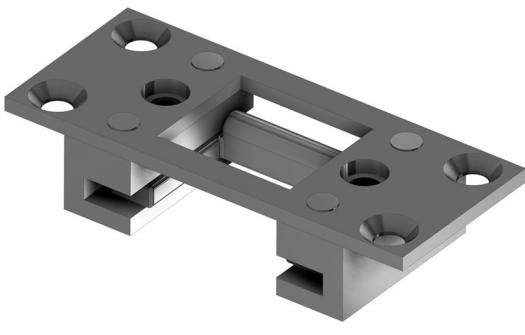
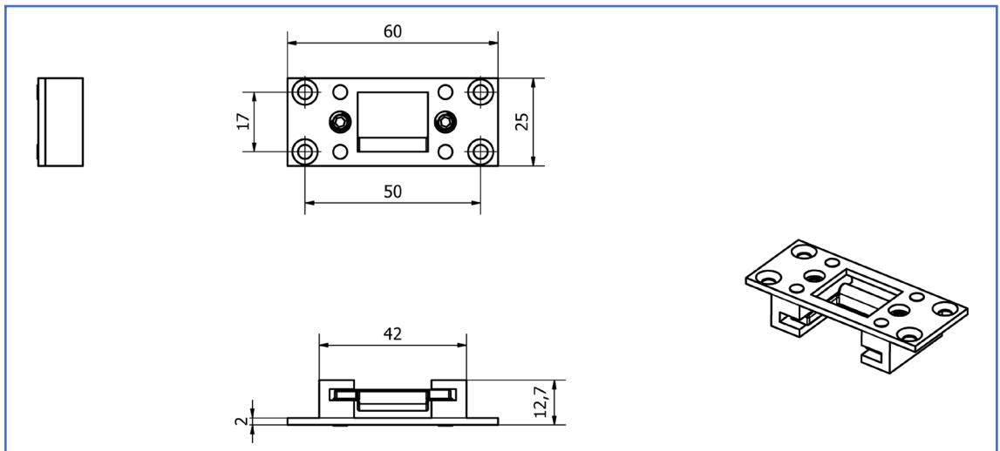
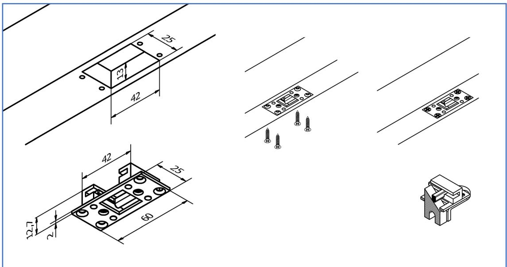

# **Produktblad: 19 HZ**

# **Justerbart slutbleck OLDA 19 HZ**

- Öppning:
	- o djup: 17 mm
	- o stopp justerbart 2 9 mm
	- o bredd: 20 mm
- Produkt:
	- o bredd: 60 mm
	- o höjd: 13 mm
	- o djup: 25 mm
	- o tjocklek: 2 mm
- Bakstycke:
	- o bredd: 42 mm
	- o djup: 25 mm
- Material: stål
- Ytbehandling: elförzinkning

#### **Relaterade produkter:**

- Slutbleck OLDA LP
- Slutbleck OLDA LT

# **Kompletterande produkt:**

Infällt slutbleck 19 HZ är justerbart efter montage, vilket bidrar till den tätslutande funktionen på 37 HZA.

#### **Service:**

Funktions- & systemtest rekommenderas en till två gånger per år. Testa, smörj och justera rörliga delar vid behov.

Vid krävande miljöer eller hög passagefrekvens bör kantregeln testas oftare.

#### **Garanti:**

Mekaniska produkter med varumärke "OLDA" har 36 månaders fabriksgaranti

# **Funktion:**

Rekommenderat behör för kantregel OLDA 37 HZA.

# **Egenskaper:**

OLDA 19 HZ har en rektangulär öppning med bredd 20 mm som tex. passar den rektangulära regeln (med bredd 15 mm) på 37 HZA.

Detta slutbleck är justerbart efter montage, vilket är speciellt användbart vid större eller äldre dörrar, men det bidrar även till den tätslutande funktionen på 37 HZA.

Tillverkas i elförzinkat stål.

# **Användning:**

Rekommenderas för att underlätta installationen, säkra funktionen och öka livslängden hos reglar, särskilt vid dörrar med hög passagefrekvens.

# **Montage:**

Skruvas fast, infällt i karm, tröskel eller trägolv, antingen med eller utan uttag för stolpen. Fästs med fyra försänkta 3,5 x 16 mm skruvar.

# **Justerbart slutbleck OLDA 19 HZ**

#### **Produktdokument:**

- [Mått](https://www.olda.com/docs/olda-19-hz-cad-dd-pdf-2d/)
- [Montering](https://www.olda.com/docs/olda-19-hz-mg-int-pdf/) med urtag för stolpe
- [Montering –](https://www.olda.com/docs/olda-19-hz-mg-ext-pdf/) utan urtag för stolpe

#### **Produktvyer – 2D:**

- [PDF](https://www.olda.com/docs/olda-19-hz-cad-vd-pdf-2d/)
- [DXF](https://www.olda.com/docs/olda-19-hz-cad-vd-dxf-2d/)
- [DWG](https://www.olda.com/docs/olda-19-hz-cad-vd-dwg-2d/)

#### **Produktmodeller – 3D:**

- [STEP](https://www.olda.com/docs/olda-19-hz-cad-stp-3d/)
- [DWG](https://www.olda.com/docs/olda-19-hz-cad-dwg-3d/)
- [PDF](https://www.olda.com/docs/olda-19-hz-cad-pdf-3d/) 3D

#### **OLDA produktlänkar:**

- [Slutbleck 19 HZ](https://www.olda.com/beslag/justerbart-slutbleck-olda-19-hz/)
- [Automatisk kantregel 37 HZA](https://www.olda.com/beslag/automatisk-kantregel-olda-37-hz/)
- [Behör kantreglar](https://www.olda.com/produktkategori/kantreglar/behor/)
- OLDA [kantregelguide](https://www.olda.com/docs/olda-kantregel-guide-pdf/)
- [OLDA beslagsskolan](https://www.olda.com/beslagsskolan/)