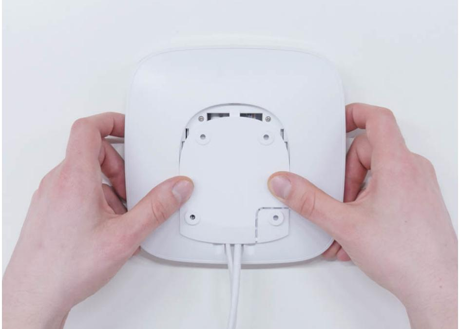
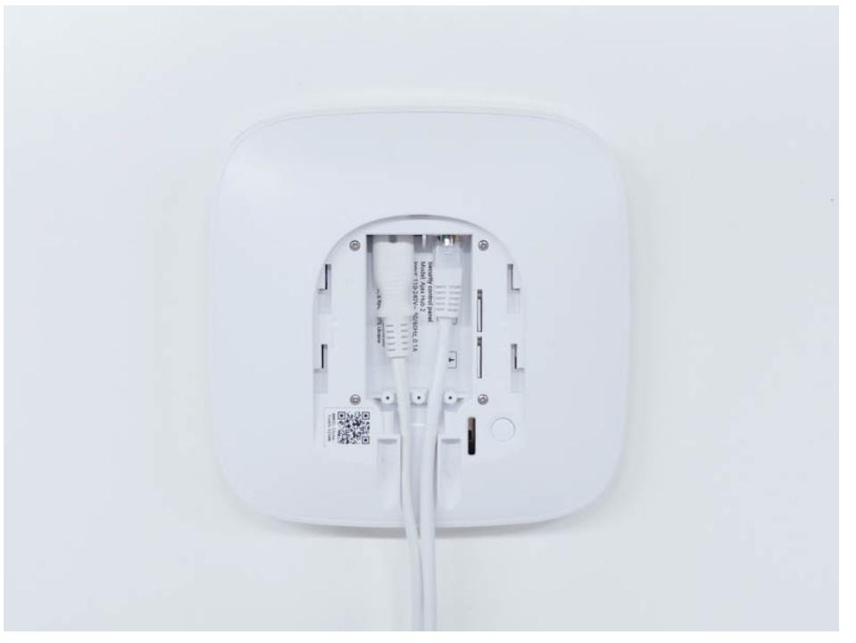
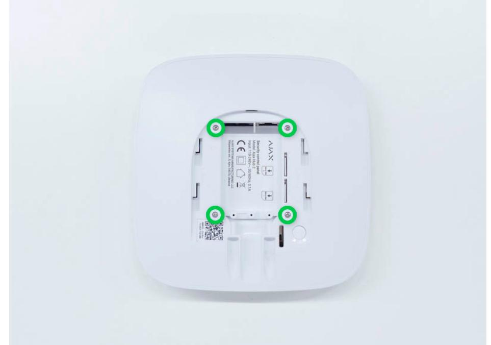
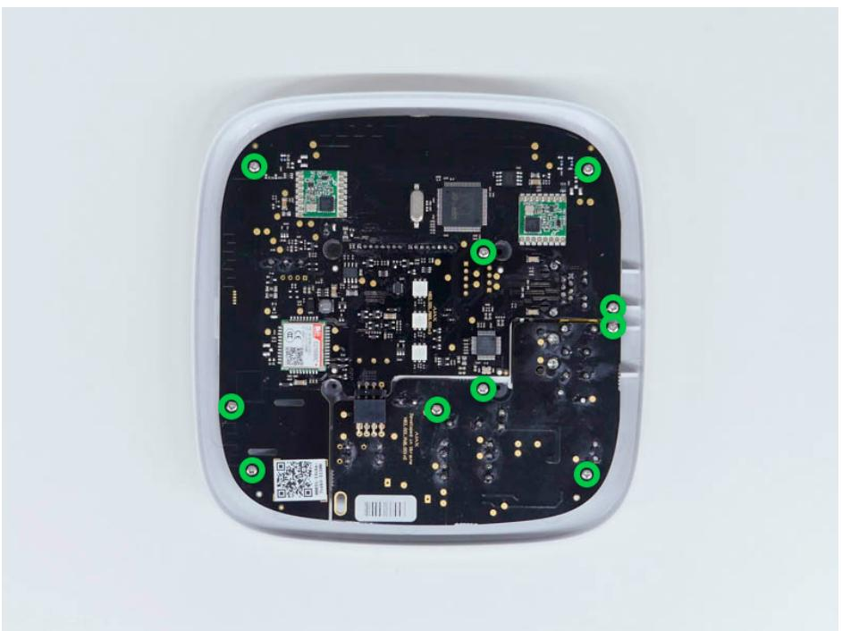
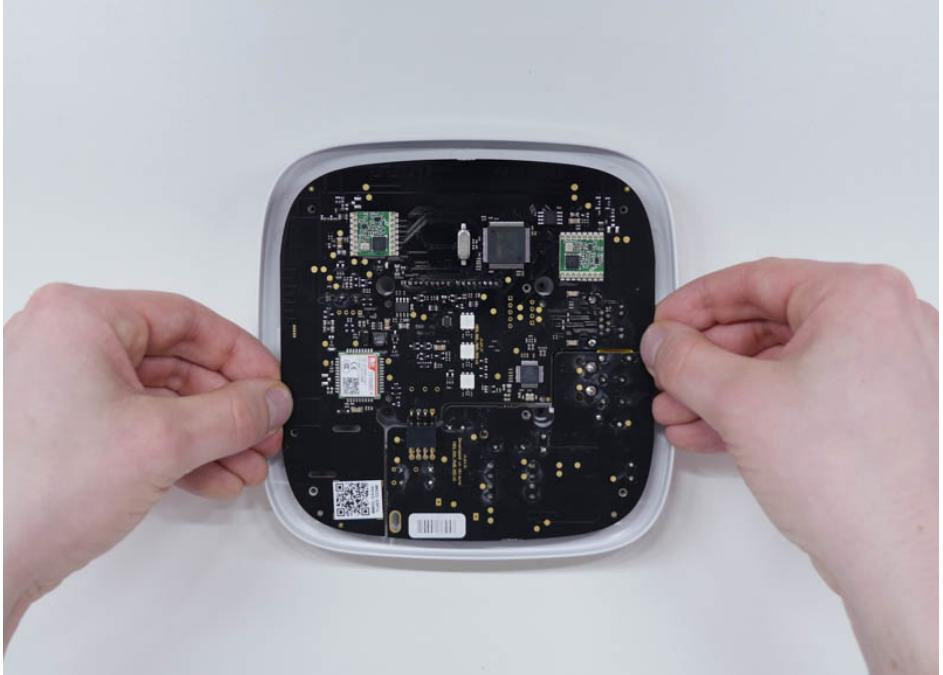
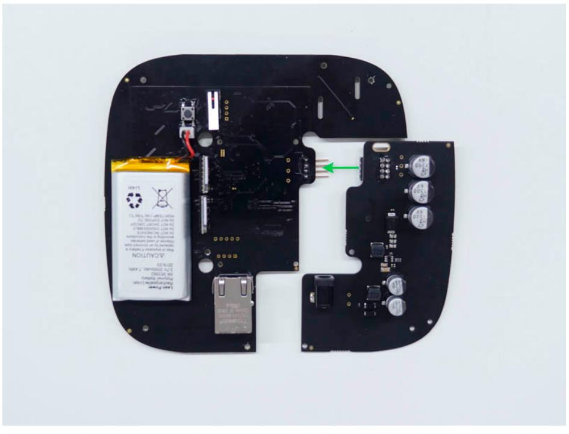

## User Manual 12–24V PSU for Hub 2/Hub 2 Plus/ReX 2

Posted on November 14, 2022

**12–24V PSU for Hub 2/Hub 2 Plus/ReX 2** is an alternative power supply unit to connect an Ajax hub or range extender to an 8–32 V⎓ power supply. 12–24V PSU is an electronic board built into the control panel enclosure, replacing the standard 110/230 V~ power supply unit.

You can also buy the alternative power supply units for Hub, Hub Plus, and ReX.

Buy 12–24V PSU for Hub 2/Hub 2 Plus/ReX 2

## Installing the power supply unit

Security requirements

Only should install 12–24V PSU for Hub 2/Hub 2 Plus/ReX 2. qualified specialists

When installing 12–24V PSU for Hub 2/Hub 2 Plus/ReX 2, follow the electrical safety rules for using electrical appliances and the requirements of electrical safety regulations. Before installing the power supply unit, ensure that the hub or range extender is turned off using the button on the enclosure and disconnected from the electrical network. When installing, do not allow moisture ingress on boards of the hub, range extender, or power supply unit.

## How to install 12–24V PSU for Hub 2/Hub 2 Plus/ReX 2

- https://support.ajax.systems/en/12-24v-psu-hub2/?utm_source=eSputnik-promo&utm_medium=email&utm_campaign=%5BEN_%7C_Partners%… 1/6 1. Remove the screws and take off the hub or range extender from the SmartBracket mounting panel, shifting the device up.

- 2. Switch off the hub or range extender holding the power button for 2 seconds.
- 3. Disconnect power and Ethernet cables.

Wait 5 minutes for the capacitors to discharge.

- 4. Remove four screws of the back lid and take it off.

- 5. Remove the screws attaching the boards to the device body.

- 6. Carefully remove both boards, keeping them in the same plane and not disconnecting them. There is a connector between boards: do not break it.

- 7. Disconnect the power supply unit (smaller board) from the mainboard.
- 8. Connect 12–24V PSU for Hub 2/Hub 2 Plus/ReX 2 to the mainboard using the eight-pin connector between them. Do not warp or bend the antennas while replacing the board: this can cause the device to malfunction.

Please note: the board contacts should be plugged in the bottom row of the connector (closest to the board). When connected correctly, the boards are on the same level.

2023-06-27 15:11 User Manual 12–24V PSU for Hub 2/Hub 2 Plus/ReX 2 | Ajax Systems Support

- 9. Reassemble the boards and the device body than tighten the screws.
Check that the battery and its cables are not clamped. When installed properly, the boards stand firmly on all guides and do not stagger. Holding the boards together with the back lid, turn the device over. The SIM card slot, power, and Ethernet sockets should match accurately and fit the corresponding sockets, and the power button should not be stuck.

Change the information about input voltage on the device body to avoid incorrect power connections in the future. Use the special bundled sticker with the instruction included in the set.

- 10. Connect the power and Ethernet cable to the appropriate sockets.
- 11. Switch on the power source to the hub or range extender.

Do not connect the power cable with a voltage that exceeds the acceptable input voltage of 12–24V PSU for Hub 2/Hub 2 Plus/ReX 2.

- 12. Switch on the device by holding the power button for 2 seconds.
- 13. Close and fix the SmartBracket mounting panel.
- https://support.ajax.systems/en/12-24v-psu-hub2/?utm_source=eSputnik-promo&utm_medium=email&utm_campaign=%5BEN_%7C_Partners%… 5/6 Switch on the device, wait until loading, and check the external power status in the Ajax app. If there is no power, and you are using a terminal adapter check the polarity of the connected wires If there is

no power even after reconnecting, please . contact the Ajax Support Service

## Maintenance

The device does not require technical maintenance.