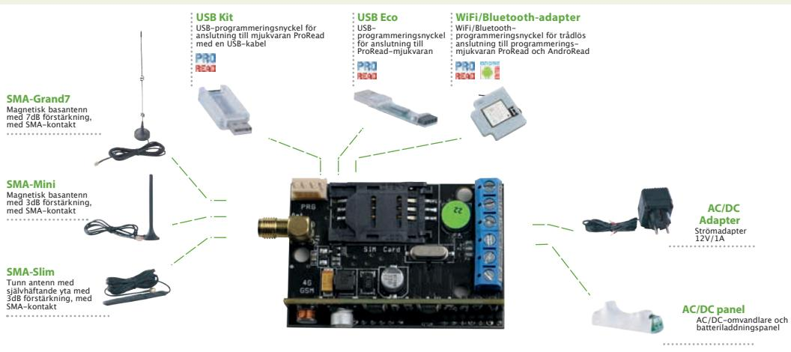
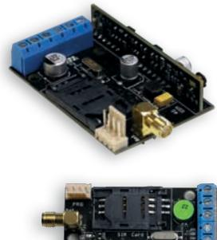

# **EASYLINE 4G**

### PROFESSIONELL 4G LARMSÄNDARE OCH TELEFONLINE (PSTN) SIMULATOR

EasyLine 4G-enheten är en analog telefonlinjesimulator. Den kan användas som en larmsändare till en centralapparat och som ersättning till en befintlig telefonlinje, eller som en driftslarmsändare. EasyLine 4G är en Plug&Play lösning: endast ett aktivt SIM-kort krävs, sedan är enheten redo att fungera.

#### **PSTN-linjesimulering**

PSTN-linjesimuleringen uppnås genom simulering av linje- och ringspänningar. Telefonlinjen Ger en anslutningen mellan sändaren och det befintliga centralapparaten.

#### **Ingång**

Sändaren har 1 ingång. Ingången kan vara brytande (NC) eller slutande funktion (NO). Vid aktivering kan larm skickas som SMS eller som ett telefonsamtal - upp till 8 telefonnummer kan programmeras. SMS och talmeddelanden ändras med mjukvaran ProRead.

#### **Utgångskontroll**

Utgång kan aktiveras med ett samtal från ett obegränsat antal telefonnummer, eller upp till 1000 telefonnummer vid funktionen igenkänt nummer (nummerpresentation) används.

#### **Kontroll av strömförsörjning**

Mjukvaran ProRead tillåter inställningar av spänningsnivån under vilket EasyLine 4G modul skickar ett larm vid ett strömavbrott. Centralapparaten kan skicka meddelande om batteriets tillstånd och återställning efter strömavbrott.

#### **Tvåvägskommunikation**

EasyLine 4G kan användas för larmöverföring till hisslarmsändare som ringer och kopplar upp en tvåvägskommunikation i fall av en nödsituation. Det finns även möjligheten till fjärrprogramming till enheten som är ansluten till via telelinjen.

#### **Utgång**

Utgång kan vara monostabil (puls), eller bistabilt (växlar vid aktivering). Utgång kan belastas med 300mA och max 30V.

#### **Programming**

Modulen kan programmeras med SMS kommandon eller med en dator och PCprogram ProRead. En säkerhetskod gör det möjligt att säkerhetställa eventuella obehörig ändring med SMS-kommando.

#### **Övervakning**

Övervakningsfunktionen kan meddela användaren att sändaren fungerar korrekt.

#### **Händelselogg**

Händelseloggen kan lagra de senaste 16000 händelserna.

#### **GSM status**

GSM statusen som är tillgänglig i mjukvaran ProRead gör det möjligt att kontrollera GSM-signalens status.

## **EasyLine 4G**

**www.extronic.se**

## **Övervakning av status**

Vid kontroll av sändarens status får man reda på följande information:

- Ingångsstatus
- Utgångsstatus
- Indikering av spänningsfel
- Lista över möjliga fel/händelser (t.ex. SIM-kort inte isatt, SIM-kort låst med PIN-kod)
- Status för GSM-nätverksanslutning (t.ex. registrerad på nätverk, roaming, ingen anslutning, anslutning nekad)
- Aktuell GSM-nätets signalstyrka.

Det att vara möjligt att konvertera Contact ID-koder från centralapparaten till att skicka SMS upptill till 8 programmerade telefonnummer. Det går också att överföra Contact-ID-meddelandet till molnportalen, vilket ger pushmeddelanden. Molnportalen gör det möjligt att styra utgångar från appen, förutom status.

## **Tekniska detaljer**

- **Spänning: 9-24 VDC**
- **Simulerad telelinje: 48V (linje), 72V (ring signal)**
- **Strömförbrukning vila: 80 mA**
- **Strömförbrukning larm: 1000 mA**
- **Utgång: max. 30V / 300 mA**
- **Modultyp: SIM A7672**
- **Modulfrekvenser: TDD-LTE B38/B40/B41, FDD-LTE B1/B3/B5/B7/B8/B20, WCDMA/HSDPA/HSPA+ B1/B5/B8, GSM/GPRS/EDGE 900/1800 MHz**
- **SIM-kortsanvändning: nätverksoberoende GSM-modul**
- **GSM-antenntyp: SMA-kontakt (ingår i paketet)**
- **Storlek: 62 x 42 x 16 mm, förpackning: 132 x 128 x 32 mm**
- **Drifttemperatur: -20°C +50°C**

