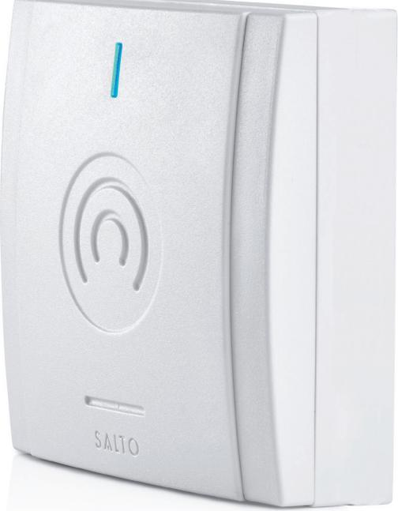
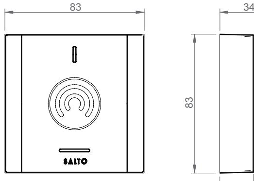
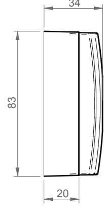

# REPEATER03 by SALTO

SALTO online wireless solution är nästa steg inom batteridriven passerkontroll. SALTO's trådlösa lösning skapar krypterad tvåvägskommunikation i realtid mellan SALTO trådlösa lås/läsare och SPACE systemadministratör.

www.saltosystems.se

TEKNISKA SPECIFIKATIONER: BLUENET REPEATER - REPEATER03

Publications of SALTO SYSTEMS S.L. are protected by copyright and all rights are reserved. SALTO SYSTEMS publications may not be reproduced in any form or by any means without written permission from the copyright owner.

#### TEKNISK DATA:

| Mått (H x B x D): | 83 x 83 x 20 mm          |
|-------------------|--------------------------|
| Vikt:             | 118 g                    |
| Materiall:        | ABS V0 plast             |
| IP class:         | Ej för utomhusbruk       |
| Certifikat:       | CE, FCC/IC, RCM, SRRC |

#### ELEKTRONISKA SPECIFIKATIONER:

Smile - Selfprogrammable — ROM: — SVN data-on-card: • SALTO RFnet: — SALTO BLUEnet: •

SALTO KS: •

TEKNOLOGI PLATTFORMAR:

| Strömförsörjning:                        | 12V, strömförsörjning ingår                    |
|------------------------------------------|------------------------------------------------|
| Firmware uppdatering:                    | Via ProAccess SPACE och Ethernet anslutning |
| LED signaler:                            | Blå LED signal                                 |
| Antal BLUEnet lås:                       | Max 16                                         |
| Antal BLUEnet Repeaters per gateway : | Max 6                                          |
| GATEWAY kompatibilitet:                  | GATEWAYx3C                                     |

## RITNING:

#### SPECIFIKATIONER

#### Temperaturområde:

|                                | Min | Typ | Max | Unit |
|--------------------------------|-----|-----|-----|------|
| Temperatur (Non kondensation): | -20 | 25  | 70  | ºC   |
| Fuktighet:                     | 35  | -   | 85  | %    |

#### BLUEnet specifikationer:

| Frekvensmområde:        | 2400-2483,5 Mhz      |
|-------------------------|----------------------|
| RF standard:            | Bluetooth Low Energy |
| Inomhus radio räckvidd: | 10/15m               |
| Max output:             | 8dBm                 |

#### Strömförsörjning BLUEnet:

|              | Min | Typ | Max | Unit |
|--------------|-----|-----|-----|------|
| Input        | 7   | 12  | 28  | v    |
| Förbrukning: | -   | -   | 75  | mA   |

# SALTO SALLIS:

SALTO KS:

SALTO SPACE:

SALLIS: —

## FÄRG/YTBEHANDLING:

| Svart: | —         |
|--------|-----------|
| Vit:   | • Krämvit |

