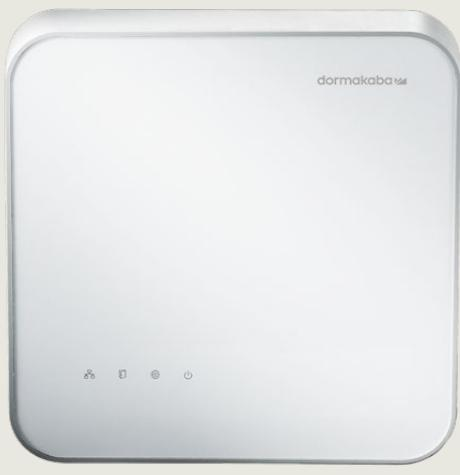
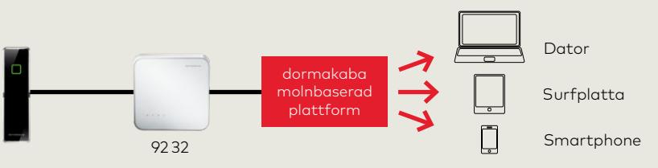
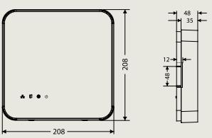

# **Dörrstyrenhet 92  32** för exivo

#### **Optimal dörrstyrning**

Dörrstyrenhet 92 32 är en effektiv passerstyrenhet som är optimerad för enskilda dörrar. Tack vare intelligent beslutslogik kan den styra tillträdet till allt från en enkel passage till att kunna hantera dörrar med krav på läsare för både in och utpassage.

#### **Enkel installation, effektiv användning**

Styrenhet 92  32 uppfyller alla krav på moderna säkerhetskoncept och är samtidigt enkel och effektiv att installera och använda. Den snabba och enkla monteringen vid dörrmiljön sparar både tid och pengar vid installation.

#### **Ett minimum av kablar, minskade kostnader**

Styrenhet 92  32 kan användas med den moderna IT-infrastrukturen i byggnaden, vilket minimerar behovet av kablar. Strömförsörjning kan ske helt och hållet via Power over Ethernet (PoE) vilket eliminerar behovet av andra strömkällor.

#### **Kompakt och diskret design**

När styrenhet 92  32 måste installeras på synlig plats smälter den väl in i omgivande miljö tack vare sin diskreta design.

#### **Fördelar**

**Minimal kabeldragning** Användning av modern IT-infrastruktur.

#### **Effektiv installation**

Utförs enkelt och snabbt utan elektriker.

#### **Enkel planering**

En enhet vid varje dörr, samt läsare för in och / eller utpassage.

#### **Enkel installation**

Enkel installation i befintligt nätverk

#### **Självständig**

Autonom tack vare beslutslogik och lokal datalagring.

#### **Framtidssäker**

Förberedd för användning med dormakabas mobila åtkomst.

#### **Diskret design**

Kan installeras i synliga utrymmen utan problem.

## **Egenskaper**

Dörrstyrenhet 92  32 är kopplad till passerkomponenter, och via ethernet-kabel till dormakaba molnbaserad plattform och anslutet passersystem.

#### **Dörrstyrenhet**

Styrenhet 92  32 hanterar och styr såväl enkla som komplicerade dörrar.

#### **Drifttillstånd nätanslutning/-frånkoppling**

Styrenheten kan hanteras centralt eller lokalt, beroende på om den är ansluten till eller frånkopplad från internet.

#### **Driftsäkerhet**

Automatisk omstart av systemet efter strömavbrott ser till att systemet omedelbart blir tillgängligt igen utan inskränkningar.

#### **Stöd för kringutrustning**

Det går att koppla till två kortläsare: dormakaba läsare 90 00 / 90 01 / 90 02 / 90 04

#### **Anslutningar**

Alla anslutningar är utförda som plugin-anslutningar vilket gör att installationen går snabbt och enkelt. Tack vare olika färger och märkning direkt på anslutningarna får man en tydligt översikt.

#### **Säkring mot sabotage**

Manipulering av utrustningen utlöser ett larm från passersystemet tack vare den inbyggda sabotagekontakten.

Måttskiss för dörrstyrenhet 92  32 (mått i mm).

### **Tekniska uppgifter**

#### **Stöd för RFID-teknik**

LEGIC Advant MIFARE (DESFire og Classic)

**Mått / kapsling** 208 × 208 × 48 mm (b × h × d)

#### **Kapsling**

- Väggmontering
- Färg: ljusgrå NCS 1502-B, frontfolie vitt RAL: 9016

#### **Gränssnitt**

- Ethernet 10/100 Mbit/s med DNS/DHCP-server
- 2 koaxiala anslutningar för läsare
- 4 digitala ingångar: max. 5 V DC
- 3 reläutgångar: 30 V AC/DC; max. 2 A 12 V DC; max 7 W (PoE) 12 V DC; max 17 W (PoE+)

#### **Strömförsörjning**

- PoE (IEEE 802.3af),15,4 W
- PoE+ (IEEE 802.3at), 25,5 W
- 24 V DC

#### **Miljö**

Skyddsklass: IP40 Relativ luftfuktighet: 5 % till 85 %, icke-kondenserande Omgivningstemperatur: −0 °C till +50 °C (drift)

#### dormakaba Sverige AB

T: 031-355 20 00 info.se@dormakaba.com www.dormakaba.se