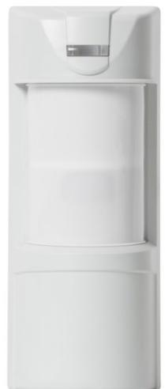
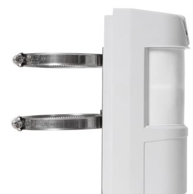
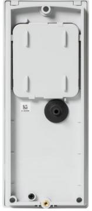
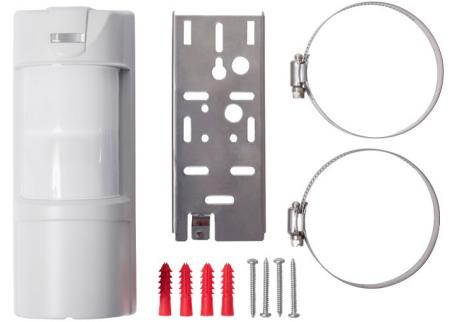
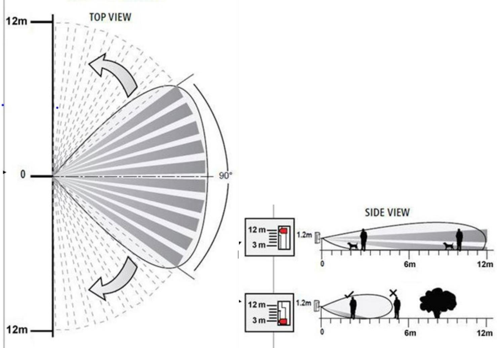

## **Överblick:**

Vanderbilts WPIR-EXT är en dubbel fyrrörelsedetektor som sömlöst blandarstil och säkerhet vilket resulterar i en klassledande produkt. Thär enhet has ett detekteringsområde på 3 till 12 uppfylldares och kan till och medkonfigureras för användning i hård miljös, upprätta högstasäkerhetsskydd. Enheten är enkel att montera, enkel att para ihop och enkel att konfigurera, vilket säkerställer att installationstiden minimeras. Dessutom använder enheten förbättrad, lågströms RF-teknik som ger överlägsen kommunikation och säkerställer lång batteritid.

### **Klassledande Säkerhetsskydd:**

| 3 till 12 m räckvidd                                |
|-----------------------------------------------------|
| Programmerbar för anpassning till de flesta miljöer |
| Övertäckningsskydd (AM)                             |
| Husdjursimmunitet upp till 25 kg                    |
| IP65                                                |
|                                                     |

## **Överlägsen RF- och batteriprestanda:**

### **Lång batteritid**

Med högpresterande litiumbatterier och APS-teknik (Automatic Power Save) har WPIR-EXT-detektorerna en batteritid på 5 år.

### **Långt RF-intervall**

500m utomhusområde innebär att SPC-sändtagaren kan täcka de flesta installationer.

### **Snabb installation och konfiguration:**

### **Lätt att montera**

WPIR-EXT-enheten stöder både hörn- och platt montering med fullt stöd för manipulering. WPIR-EXT-enheten kan också monteras med fästena s och tillhörande klämmor som medföljer.

### **Lätt att parkoppla**

Smart parkopplingsmekanism gör att enheten kan paras ihop med SPC-sändtagaren på några sekunder.

Viktiga funktioner inkluderar:

Automatisk parkoppling vid batteriinfogning

- LED & Intern summer guidad gångtest

## **Lätt att konfigurera**

WPIR-EXT-enheterna är en hybridenhet med en kombination av inbyggd programvara som kan konfigureras "over-the-air" och mekaniska doppbrytare.

Konfigurerbara funktioner inkluderar:

## **Transmission:**

| Frekvensband | 868-869 MHz |
|--------------|-------------|
|              |             |

## **Batteri / Kraft:**

| Batterityp                      | 4 x 1,5v typ AA LR06 aggregat L91                                           |
|---------------------------------|-----------------------------------------------------------------------------|
| Batteritid                      | 5 år                                                                        |
| Område i öppet utrymme          | 500 m                                                                       |
| Aktuellt dragning (dragning)    | Vänteläge ~22 μA (μA) mottagningsläge ~24 mA sändningsläge ~45 mor |
| Överför Överför (på andra ström | ~ 14dBm                                                                     |
| Automatiskt energisparande      | Ja (ja)                                                                     |

# **Egenskaper för intrångsidentifiering:**

| Täckning för identifiering | 3 - 12m                                                   |
|----------------------------|-----------------------------------------------------------|
| Övervakningstid            | 7 min som standard (programmerbar mellan 1 och 30 min) |
| Händelseöverföring         | Larm, manipulering, övervakning, lågt batteri             |
| PET-immunitet              | 25kg                                                      |

## **Monteringsspecifikationer:**

| Driftstemperatur          | -25°C till +55°C                              |
|---------------------------|-----------------------------------------------|
| Optimal installationshöjd | 0,8 till 1,5m,optimal 1,2 m                   |
| Mått (h x w x d)          | 200mm x 86mmx 80mm - Produkt                  |
| Vikt (Inc. batteri)       | 500 gr                                        |
| LED-indikationer          | Röd lysdiod: PIR Aktiverad och /eller problem |

# **Beställningsinformation:**

| Typ      | Art. Nr          | Beskrivning                                |
|----------|------------------|--------------------------------------------|
| WPIR-EXT | V54538-F124-A100 | WPIR-EXT PIR AM Wrls.c/w husdjursklämma |

### **vanderbiltindustries.com**

@VanderbiltInd Vanderbilt Industries

### **Vanderbilt International Ltd.**

Clonshaugh Business and Technology Park Clonshaugh, Dublin D17 KV 84, Irland

**DOC ID: I-200477 Upplagadatum: juli 2021** +353 1 437 2560