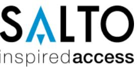
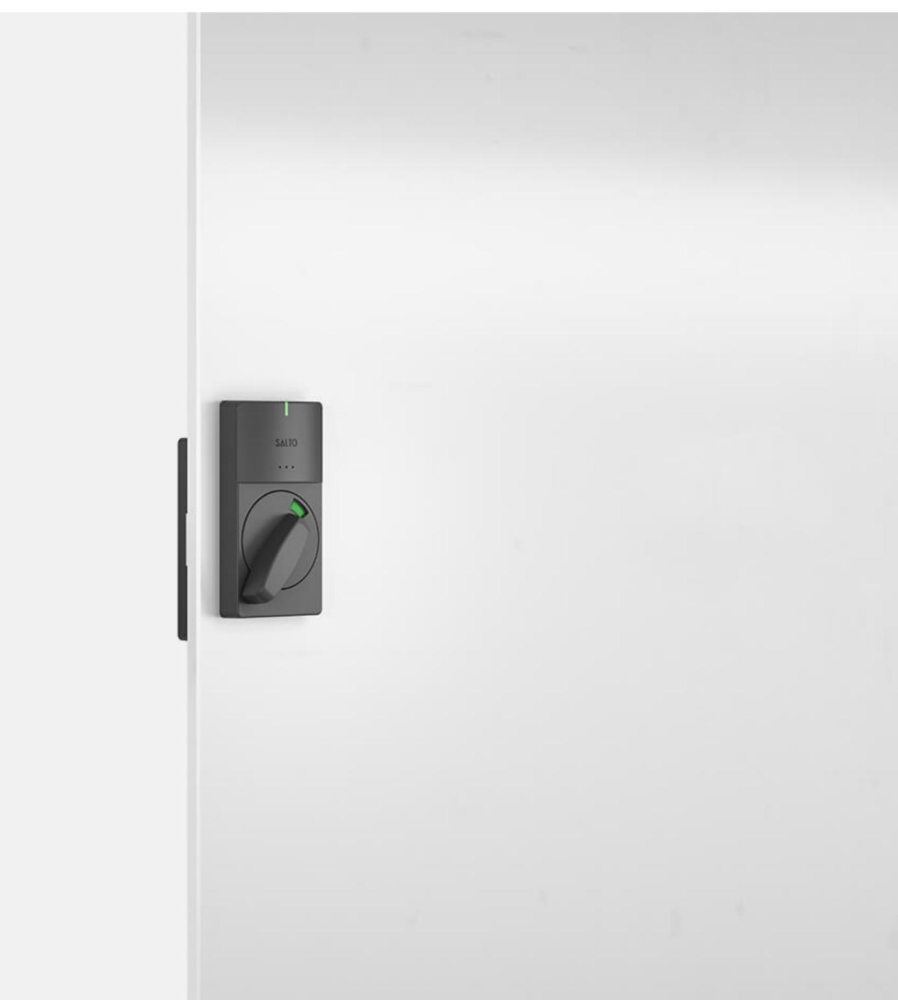
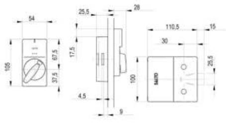
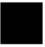
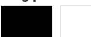
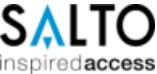

Skåplås

# **XS4 Locker Locks**

SALTO XS4 skåplås är utformat för att ge alla fördelar med passerkontroll till skåp och kabinetter. XS4 Skåplås är en säker och bekväm lösning för att bestämma och kontrollera behörighet till omklädningsskåp, medicinskåp, förrådsskåp, lådor och monterinredning där det är viktigt att besluta och se vem som har tillgång samt kunna hämta loggar.

XS4 Locker Locks | Tech. Specs [saltosystems.com](https://saltosystems.com)

#### **Funktioner**

- Fullt integrerad med SALTO SPACE-plattformen.
- Easy to maintain: Battery change is all that's needed.
- Yttre vred med röd / grön indikering för tillgänglighet av skåpet; elektronisk öppning/låsning.
- Loggar och händelser på användarnas kort via SALTO Virtual Network (SVN).
- All kommunikation mellan kodbärare och skåplås är krypterad och säkrad.
- Low battery status information is obtained from users' keycards (SVN) or wirelessly (BLUEnet).
- Behörigheter beslutas och programmeras via programvara.
- Comes with BioCote® antimicrobial technology.
- Batteripaket, elektroniska komponenter och låsmekanismer placerade på insidan av dörren, säkrade för vandalism eller sabotage.
- Nödöppning via bärbar programmeringsenhet (PPD).

#### **Tekniska egenskaper**

- Enkel offline installation är möjlig på många typer av små och tunna skåpdörrar. Dörrtjocklek: anpassningsbar på plats.
- Mått på insidan: 100 mm x 110,5 mm x 25 mm.
- Utvändiga mått: 54 mm x 105 mm x 28 mm.
- Regel: 15mm.

- Säkerhetsregel är inbyggd i skåpet.
- Perfekt för eftermontering eftersom låsen är framtagna för olika standard för skåp.
- Passar för både vänster och höger montage.

### **Teknisk ritning**

#### **Ytbehandling**

#### **Färg på läsare**

#### **Teknikplattformar**

#### **SALTO Space**

- On-premise Network

Cloud application

## **Trådlösa teknologier Certifikat Kodbärare - Teknologier RFID kort** NXP MIFARE® LEGIC® LEGIC Advant HID® **Tagg/Nyckelbricka** NXP MIFARE® LEGIC® **Armband av silikon** NXP MIFARE® LEGIC® **Digital nyckel** Bluetooth LE NFC - Near Field Communication

#### **varning:**

Kontakta den lokala auktoriserade SALTO återförsäljaren eller ett SALTO kontor för en fullständig beskrivning av produktsortimentet, verifiering av den valda produktens tillgänglighet och tekniska genomförbarhet och ett kommersiellt erbjudande.

SALTO Systems förbehåller sig rätten att modifiera produkten och dess komponenter.

Teknisk information och bilder som visas på SALTO Systems produktsida är endast i informationssyfte och utformade för att informera om de viktigaste produktegenskaperna, alternativen och tekniska specifikationer. Därför ska alla bilder, illustrationer, former, funktioner, specifikationer, storlekar, data, beskrivningar och färger som visas på SALTO Systems sida endast betraktas som ungefärliga indikationer som inte är bindande.

