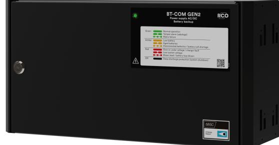

PRODUKTBLAD - STRÖMFÖRSÖRJNING FRÅN MILLETEK-

### **namn, artikelnummer, e-nummer och certifikatsnummer**

NIK

| Namn                                      | Artikelnum mer | E-nummer  |
|-------------------------------------------|-------------------|-----------|
| BT-5 FLX SMALL COM t.o.m 20231015      | 28160120          | 52 574 54 |
| BT-5 FLX Small COM Gen2 från 20231016  | 28160121          | 52 576 96 |
| BT-10 FLX SMALL COM                       | 28160122          | 52 574 55 |
| BT-10 FLX Small COM Gen2 från 20240101 | 28160123          | 52 576 97 |

# **ssf1014 certifierad batteribackup med kommunikation**

## **spänning, ström och effekt**

Spänning ut: 27,3 VDC, (24 V).

Laddström: 10 A.

Strömuttag: 5A. 10 A.

### **reservdrifttid på batterier**

Reservdrifttiden i batteridrift beror på hur stor belastning som är inkopplad på strömförsörjningen. Varierar belastningen, som vid frekvent öppning av dörrlås, sjunker tiden som batterier kan driva vidare säkerhetssystemet. För att få en uppskattning av reservdriffterser se: [www.milleteknik.se/Manu](https://www.milleteknik.se/Manualer/FaQ/Reservdrifttider/)[aler/FaQ/Reservdrifttider/](https://www.milleteknik.se/Manualer/FaQ/Reservdrifttider/)

### **batteri och batterityp**

Två 7,2 Ah batterier.

Två 14 Ah batterier.

Batterityp: 12 V, AGM blysyra batteri, underhållsfritt. Batterier ingår ej.

### **säkringar**

Elnätssäkring: 2,5 A.

Batterisäkring: 16 A och 30 A.

### **kapsling, utförande**

Plåtskåp för väggmontering eller i 19" rackskåp (5 HE). Pulverlackat svart. Fyra kabelgenomföringar på ovansidan och utslagshål på baksidan. Buntbandshållare i kapsling.

| Mått, höjd x bredd x djup | IP-klass |
|---------------------------|----------|
| 222 x 437 x 145 mm        | IP30     |

### **vikt**

| Namn                     | Nettovikt | Vikt m förp. |
|--------------------------|-----------|--------------|
| BT-10 FLX Small COM Gen2 | 5,8 kg    | 6,5 kg       |

### **installationskrav**

Enheten är avsedd för fast installation. Enheten skall installeras inomhus, miljöklass 1, omgivningstemperatur: +5°C – 40°C. Rekommenderad omgivningstemperatur är +15°C - 25°C.

#### **krav som produkten uppfyller**

| EMC:      | EMC Direktivet 2014/30EU                                                                         |
|-----------|--------------------------------------------------------------------------------------------------|
| El:       | Lågspänningsdirektivet: 2014/35/EU                                                               |
| CE:       | CE direktivet enligt:765/2008                                                                    |
| Emission: | EN61000-6-:2001 EN55022:1998:-A1:2000, A2:2003 Klass B, EN61000-3-2:2001                      |
| Immunity: | EN61000-6-2:2005, EN61000-4-2, -3, 4, -5, -6, -11 SS-EN 50 130-4:2011 Edition 2, EN50131-6 |
|           |                                                                                                  |

## **standarder som produkt(er) uppfyller och är godkänd för**

#### **Tabell 1. SSF**

SSF1014 Larmklass 1-4 (inbrottslam). SSF1014, utgåva 5.

#### **garanti**

Produkten har fem års garanti för tillverkningsfel. Batterier och förslitningsdelar omfattas ej av garanti.

### **utbyggbar, tillval och tillbehör**

Plåt för att fästa sabotagekontakt i vägg för att uppfylla larmklass för [FLX S](https://www.milleteknik.se/produkt/cabinet-tamper-flx-s/) och [FLX M och FLX L.](https://www.milleteknik.se/produkt/cabinet-tamper-flx-m-l/)

## **tillverkning, livslängd, miljöpåverkan och återvinning**

Tillverkad av Milleteknik i Partille, Sverige.

Produkten är designad och konstruerad för lång livslängd vilket minskar miljöpåverkan. Produktens livslängd (förutom slitagedelar) är beroende på, bland annat miljöfaktorer, främst omgivningstemperatur, oförutsedd belastning på komponenter som blixtnedslag, yttre åverkan, handhavandefel, med flera. Produkter återvinns, enkelt då de är moduluppbyggda, genom att lämnas till närmaste återvinningsstation eller sändas åter till tillverkare.1Kontakta din distributör för mer information.

### **om dessa uppgifter**

Alla uppgifter publiceras med reservation för eventuella fel. Uppdateras utan föregående meddelande.

1Kostnader som uppkommer i samband med återvinning ersätts ej.