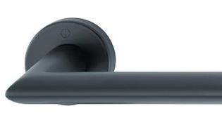
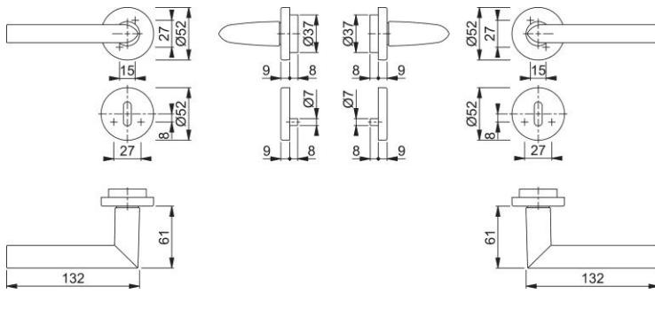

## Produktdatablad Stockholm 1140/42FI/42FIS

| Artikelnummer       | 11746828          |
|---------------------|-------------------|
| EAN-kod             | 4012789880939     |
| Ursprungsland       | Tyskland          |
| Tariffnummer på pro | 83024110          |
| dukt                |                   |
| Dörrtjocklek        | 37-42 mm          |
| Sprintmått          | 8 mm              |
| Hål                 | ovalt nyckelhål   |
| Skruvar             | 4,0x45 mm         |
| Färg                | F9714M svart matt |
| Sortiment           | kärnsortiment     |
| Förpackningsenhet   | 1                 |
| Kartong             | 10                |

HOPPE-handtagsset i aluminium med nyckelskylt för innerdörrar:

- Lagring: lösa handtag, returfjäder höger/vänster vändbar, underhållsfria glidlager
- Fastsättning: HOPPE Kvick-i-Sprint med HOPPE-solid sprint (mottagare/mottagare)
- Underdel: plast, styrtappar
- Montering: dold, genomgående, passar bägge sidor, självborrande skruvar

