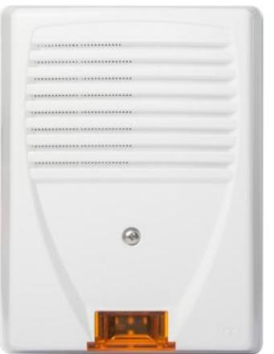
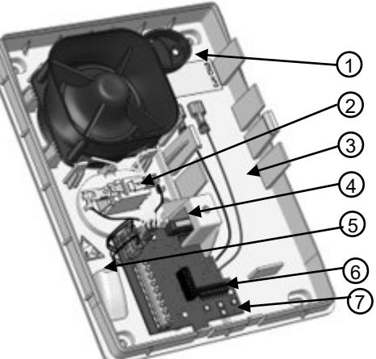
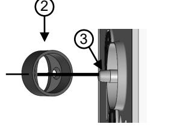
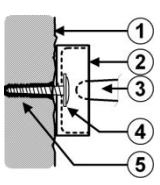
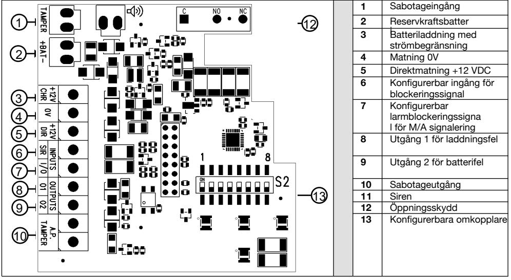
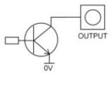
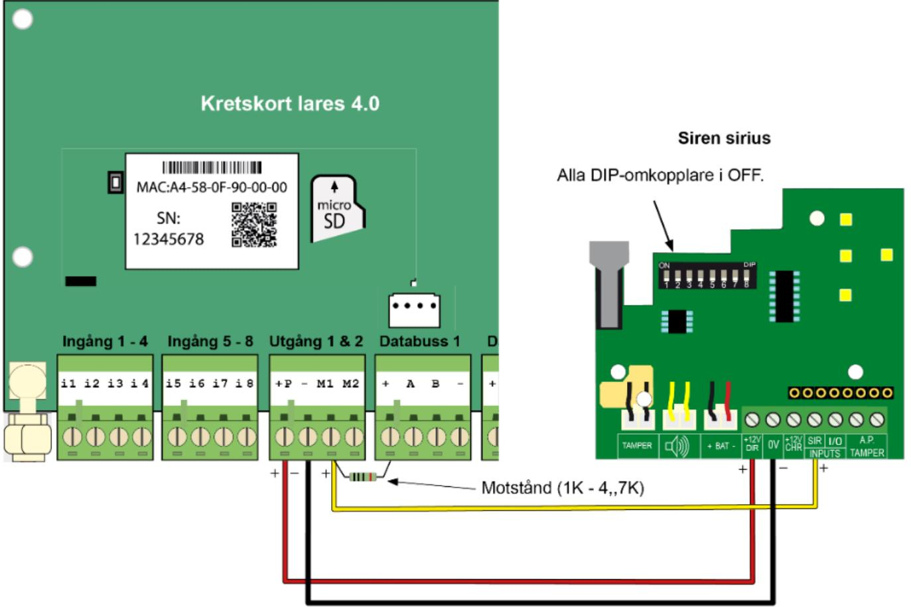
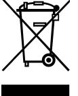
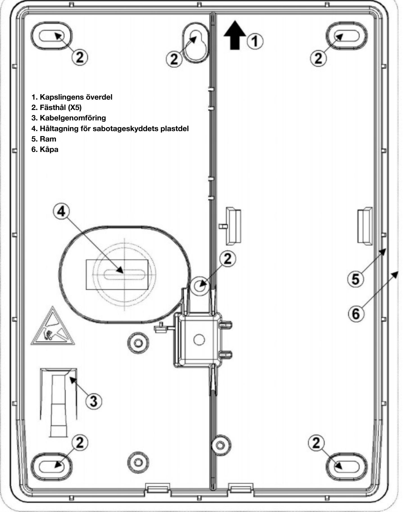

# **Utomhussiren SIRIUS**

Installationsanvisning art.nr. 16115

#### **Beskrivning**

**Sirius** är en rubust utomhussiren i en plastkapsling av polykarbonat med lång UVbeständighet. Sirenen har inbyggt LED-blixtljus med hög ljusstyrka och möjlighet att använda ett reservkraftsbatteri.

#### **Laddning för reservkraftsbatteri**

Sirenen har dubbel laddningsreglering för reservkraftsbatteriet:

- **Reglerad laddningsström** på 200 mA, vilket är tillräckligt för normal laddning av batteriet. Vid larm tar sirenen i huvudsak sin spänning från batteriet. Detta minskar belastningen i den anslutna centralapparaten.

- **Reglerad laddningsspänning** på 13,8 VDC. Funktionen SBMS (Smart Battery Management System) justerar automatiskt laddningsspänningen till 13,8 VDC. Sirenen ger full kraft även när den externa strömförsörjningen är knappt 12 VDC.

- **Två transistorutgångar** ger information i händelse av laddningsfel eller batterifel.

### **Översikt**

- 1. Rund plastdel för sabotageskydd
- 2. Sabotagekontakt
- 3. Plats för 12V, 2Ah reservkraftsbatteri
- 4. Öppningsskydd
- 5. Kabelgenomföring
- 6. Konfigurationsomkopplare
- 7. LED-blixtljus. **VARNING!!!** LED med ultrahög ljusstyrka används. Titta inte direkt in i dessa LED.

Installationsanvisning art.nr. 16115

#### **INSTALLATION**

Sirenen Sirius är en utomhussiren som kan monteras utomhus på en plan vägg om är större än sirenens hölje, med minst två 2 cm till godo påvarje sida om sirenen. Fäst den runda plastdelen (2) på väggen. Om väggen är ojämn eller har stora hål (>4mm) ska du försöka att centrera den runda delen vid montering så att sabotagebrytaren (3) på sirenens baksida kommer att komma i mitten av den runda plastdelen. Positionera sedan sirenen och se till så att sabotagebrytaren på baksidan av sirenen hamnar rätt inuti den runda plastdetaljen. Vi rekommenderar återkommande kontroll av anslutningarna och reservkraftsbatteriets skick och batteribyte vid behov.

**3-** Sabotagekontakt **4-** Skruv **5-** Skruvplugg

**1-** Vägg **2-** Rund plastdel

#### **INKOPPLING**

- � Anslutning **+ 12V DIR** används för att SIRUS ska kunna fungera utan ett reservkraftsbatteri. Helst bör en kraftförsörjning med hög kapacitet som är strömbegränsad användas. Varning! Att använda sirenen utan reservkraftsbatteri är inte godkänt enligt NF & A2P.
- � Anslutning **+ 12V CHR** används för att ge reservkraftsbatteriet en konstant laddning med en inställd spänning på 13.8 VDC och en strömbegränsning på 200 mA. När sirenen aktiveras tas strömmen huvudsakligen från reservkraftsbatteriet, vilket minskar belastningen på centralapparatens laddningskrets.
- � Om laddningsspänningen inte tas från centralapparaten som sirenen är kopplad till, bör anslutningen **0V** anslutas till centralapparaten för att erhålla en gemensam referens.
- � Blockering och återställning av SIRUS drivs av en styrspänning som kan konfigureras med DIPomkopplare för SIR-ingången (se nästa stycke).
- � Till-/Frånkopplingsindikering av centralapparaten kan fås med både ljud och blixtljus i sirenen med en styrspänning på anslutningen **1/0 input** (se nästa stycke).
- � Sirenen har även två transistorutgångar för fel (se nästa stycke).

| FUNKTION Konfigurationsomkopplare |           |                |            |                |                     |                 |           |                      |
|--------------------------------------|-----------|----------------|------------|----------------|---------------------|-----------------|-----------|----------------------|
| Position                             | 1         | 2              | 3          | 4              | 5                   | 6               | 7         | 8                    |
| Funktion                             | SIR In    |                | I/O Ingång |                | I/O Signalering     |                 | Utgångar  | Blixtljus            |
|                                      | Polaritet | Läge           | Polaritet  | Läge           | Summerton Summer på |                 | Polaritet | I/O Ingång           |
| ON                                   | Negativ   | NO             | Negativ    | NO             | MIN                 | Blixt +         | NO        | Separat styr         |
|                                      |           | Slutande *1 |            | Slutande *1 |                     | Summer          | *1        | ning av Blixt        |
| OFF                                  | Positiv   | NC Brytande | Positiv    | NC Brytande | MAX                 | Endast Blixt | NF        | 1/0 signal ingång |

**1 konfiguration inte godkänd enligt NF & A2P-certifiering*

#### **SIR INPUT**

När blockeringsspänningen försvinner på SIR-ingången aktiveras sirenen i 3 minuter, medan blixtljuset fortsätter att blinka tills dess att blockeringsspänningen återställs. Det bör noteras att sirenljudet inte kommer att starta när sirenen spänningssätts första gången, även om blockeringsspänningen inte finns. SIR-ingången ska ställas in först med sin blockeringssignal under minst en sekund. SIR-ingångens blockerings- och återställningsläge kan konfigureras med dip-omkopplarna 1 och 2 (se tabellen nedan).

| Polaritet  | Positiv            |                    | Negativ                |                        |  |
|------------|--------------------|--------------------|------------------------|------------------------|--|
| Läge       | NC Brytande     | NO Slutande     | NC Brytande         | NO Slutande         |  |
| Blockering | +12VDC             | 0V eller ingenting | 0V                     | +12VDC eller ingenting |  |
| Larm       | 0V eller ingenting | +12VDC             | +12VDC eller ingenting | 0V                     |  |

#### **I/O Input**

När larmet till- och frånkopplas kan man få en indikering i sirenen med en serie av korta sirenpip och blixtar när styrspänningen I/O ändras. När styrspänningen går tillbaka avger sirenen ytterliggare en serie med längre pip och blixtar för att skilja mellan till- och frånkoppling. Inställningarna för I / O-ingången kan konfigureras med dip-omkopplarna 3 och 4 (se tabell nedan).**Polarit**

| y              | Positiv            |                    | Negativ                |                        |  |
|----------------|--------------------|--------------------|------------------------|------------------------|--|
| Läge           | NC Brytande     | NO Slutande     | NC Brytande         | NO Slutande         |  |
| Frånk. (AV) | +12VDC             | 0V eller ingenting | 0V                     | +12VDC eller ingenting |  |
| Tillk. (PÅ) | 0V eller ingenting | +12VDC             | +12VDC eller ingenting | 0V                     |  |

För Till- och frånsignalering lägger Sirius till pip förutom blixtljus (dip-omkopplare nr 6). Volymen på ljudsignalerna kan också sänkas (dip-omkopplare nr 5). Det är också möjligt att konfigurera denna ingång för att styra blixtljuset separat (dip-omkopplare nr 8).

#### **UTGÅNGAR O1 och O2**

- Transistorutgången **"O1"** aktiveras (0V försvinner) 5 sekunder efter att laddnings-spänningen försvinner.

- Transistorutgången "**O2**" aktiveras (0V försvinner) vid batterifel i reservkraftsbatteriet (låg spänning eller saknas). Testet utförs var 24:e timme. Utgången aktiveras även om batterispänningen är låg och laddningsspänningen försvinner.
Vid byte av batteri måste all spänning tas bort från sirenen för att säkerställa att standardutgången återställs före dess dagliga test. För att förenkla inkoppling kan utgångar konfigureras så att de normalt är öppna genom att ställa dip-omkopplare 7 i läge ON 7 (ej godkänt enligt NF & A2P).

# **Utomhussiren SIRIUS**

Installationsanvisning art.nr. 16115

### *Inkopplingsexempel*

Inkopplingsexempel av siren SIRIUS (16115) till centralapparat lares 4.0.

#### **Utgång ska programmeras som Normalt öppen (NO)**

Blockeringssignalen till sirenen får en plus via motstånd (1Kohm till 4,7 Kohm) vilket innebär att siren är tyst. När utgången drar till jord vid larm försvinner plussignalen och sirener börjar ljuda.

Rekommendationen är att styra sirenen Sirius via en plus med hjälp av ett motstånd eller ett relä och plusstyrning. Om man använder en negativ blockeringssignal (minus) med Normalt sluten (NC) funktion så finns det en risk att utgången kortvarit bryts vid en ev. uppdatering vilket då innebär att sirenen börjar ljuda, vilket inte är optimalt.

Installationsanvisning art.nr. 16115

|  | Teknisk specifikation |
|--|-----------------------|
|  |                       |

| Spänning direktmatning:                         | 9 till 15 VDC                           |  |  |
|-------------------------------------------------|-----------------------------------------|--|--|
| Laddningsspänning till +12 V CHR:               | 12 till 14.5 VDC                        |  |  |
| Utgångsspänning på +BAT:                        | 13.8 VDC (+/- 0.2 VDC)                  |  |  |
| Tillåten restrippel:                            | 250 mV                                  |  |  |
| Strömförbrukning i vila:                        | 5 mA                                    |  |  |
| Strömförbrukning vid larm:                      | Max. 1 A                                |  |  |
| Batteritid på reservkraftsbatteriet:            | 60 timmar                               |  |  |
| Sirentid:                                       | 180 sekunder                            |  |  |
| Ljudtryck:                                      | 107 dB (+/- 2dB) vid 1 m                |  |  |
| Strömförbrukning med endast blixtljus:          | 20 mA                                   |  |  |
| Max. Styrspänning på SIR och I/O:               | 16 VDC (0.1 mA)                         |  |  |
| Negativ styrspänning på SIR och I/O:            | Mindre än 1 VDC                         |  |  |
| Positiv styrspänning på SIR och I/O:            | Högre än 3 VDC                          |  |  |
| Nivå för aktivering av utgång för laddningsfel: | <10.5 VDC                               |  |  |
| Max. Strömbelastning på transistorutgångar:     | 50 mA                                   |  |  |
| Späning på transistorutgångar:                  | 0-3 - 0.5 V                             |  |  |
| Utgångstid:                                     | 5 sekunder                              |  |  |
| Färg på blixtljus:                              | Orange                                  |  |  |
| Blixtfrekvens:                                  | 0.67 Hz                                 |  |  |
| Kapsling:                                       | Polykarbonat anti-UV klass V0     |  |  |
| Kapslingsklass:                                 | IP 44 IK 08                             |  |  |
| Miljö:                                          | Klass IV - Allmän användning utomhus |  |  |
| Driftstemperatur:                               | -25 till +70°C                          |  |  |
| Mått B x H x D):                                | 187 x 245 x 86 mm                       |  |  |
| Vikt:                                           | 1.1 kg                                  |  |  |
| Typ av anslutningskabel:                        | 4-par                                   |  |  |
| Reservkraftsbatteri:                            | 2 - 2.3 AH                              |  |  |

## *Kassering av batterier*

Sirius kan ha installerats med ett batter. Kasta inte de uttjänta batterierna i din soptunna. Det är förbjudet att bränna dem, gräva ner dem eller kasta dem på offentliga soptippar. Kassera batterierna i enlighet med gällande lagar och bestämmelser. Vänligen kontakta de berörda myndigheterna för mer information om rutinerna i din region för insamling, återvinning och bort- skaffande av använda batterier.

### *Kassering av produkten*

I enlighet med kraven i WEEE-direktivet (elektrisk och elektronisk utrustning) skall uttjänta elektriska och elektroniska produkter kastas åtskillt från vanliga hushållssopor för att främja återanvändning, återvinning och andra tillvara-tagandeformer, liksom begränsa mängden avfall som måste destrueras och samtidigt minska belastningen av soptipparna. När du vill bli av med sådana produkter, var vänlig respektera de kommunala föreskrifterna och / eller be om information från din återförsäljare vid köpet av en produkt.

Elektromagnetisk kompatibilitet: överensstämmer med NF EN 50130-4 (08/11) + A1 och NF EN 55022 standarder Elektrisk säkerhet: överensstämmer med standarden EN 60950, reviderad. Oktober 2000 + A1 + A2 + A11 + A12GUARANTEEATLS ger en 5-års garanti från och med produktionsdatumet. Året och

produktionsmånaden finns på serienummeretiketten inuti enheten. Garantin täcker inte skador som inte har med funktion att göra som till exempel repor eller sprickor orsakade av fall eller stötar eller skador orsakade av onormal användning. Garantin gäller endast elektroniska kort och enheter och täcker inte skador orsakade av naturliga eller konstgjorda strömmar. Garantin gäller endast om elektroniken inte har demonterats, feljusterat eller omformerats. Garantin är strikt begränsad till reparation eller utbyte av de

delar som vi erkänner som felaktiga. Returkostnaderna ska alltid bäras av avsändaren. Immobilisering av utrustningen inom ramen för garantin kan inte ge upphov till någon kompensation av någon anledning. Ansvaret för A.T.L.S. är begränsad till reparation av produkterna och täcker inte de konsekvenser som följer av användning av produkten, dess implementering eller att dessa inte fungerar.

# **Utomhussiren SIRIUS**

Installationsanvisning art.nr. 16115

