# **SKYDDSHUV FÖR ASSA KODLÅS, KORTLÄSARE OCH PORTTELEFONER**

Skyddar mot regn, snö och smuts och ger genom detta produkterna längre liv. **Material:** 4 mm Pet-G. Levereras med packningar för skruvhål.

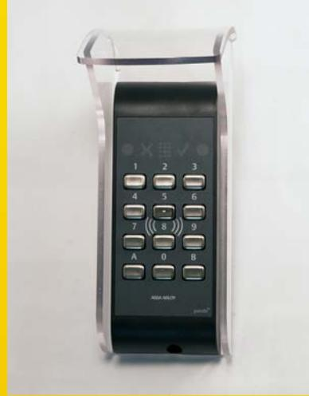

**Skyddshuv för Kortläsare Pando**  Artikelnummer: LT143 Mått (LxBxD)190x75x80mm

Invändig bredd 66mm Invändig höjd, "plan yta" 160mm

**Skyddshuv Assa Pando opal insynsskyddad** Artikelnummer: LT143-1 Mått (LxBxD)190x75x80mm

Invändig bredd 66mm Invändig höjd, "plan yta" 160mm

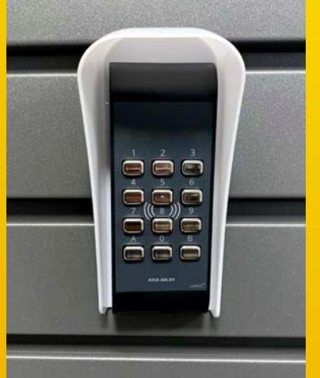

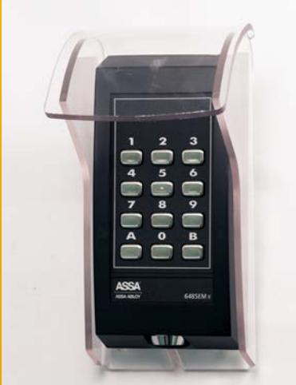

**Skyddshuv för Assa Kodlås/kortläsare 22CL, PCR40/45, 5485EM/6485EM**  Artikelnummer: LT144 Mått (LxBxD)190x90x100mm

Invändig bredd 80mm Invändig höjd, "plan yta" 165mm

# **SKYDDSHUV FÖR ASSA KODLÅS, KORTLÄSARE OCH PORTTELEFONER**

Skyddar mot regn, snö och smuts och ger genom detta produkterna längre liv. **Material:** 4 mm Pet-G. Levereras med packningar för skruvhål.

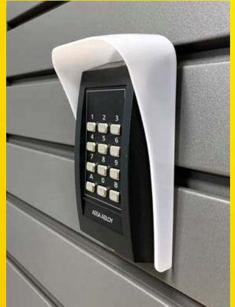

**Skyddshuv Assa läsare/kodlås 22CL, PCR40/45, 5485EM/6485EM Opal insynsskyddad** Artikelnummer: LT144-1 Mått (LxBxD)190x90x100mm

Invändig bredd 80mm Invändig höjd, "plan yta" 165mm

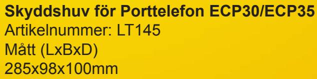

Invändig bredd 90mm Invändig höjd, "plan yta" 260mm

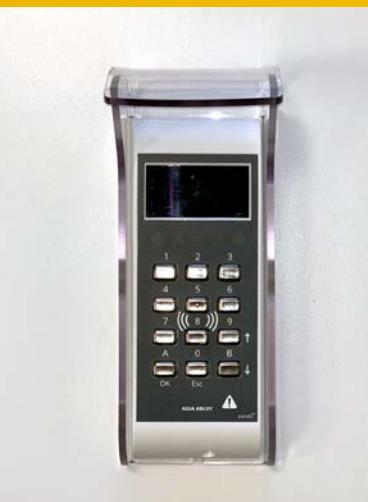

**Skyddshuv för Kodlås och Kortläsare** Artikelnummer: LT163 Mått (LxBxD) 215x87x80mm

Invändig bredd 75mm Invändig höjd, "plan yta" 200mm

## **FORMGJUTEN SKYDDSHUV FÖR ASSA KODLÅS OCK KORTLÄSARE**

Skyddar mot regn, snö och smuts och ger genom detta produkterna längre liv. **Material:** UV stabiliserad Polycarbonat som tål sol, värme och kyla. Levereras med packningar för skruvhål.

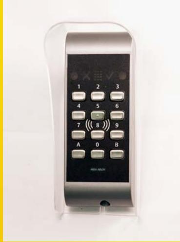

**Skyddshuv för Kortläsare Pando** Artikelnummer: LT146 Mått (LxBxD) 180x78x70mm

Invändig bredd 70mm Invändig höjd 175mm

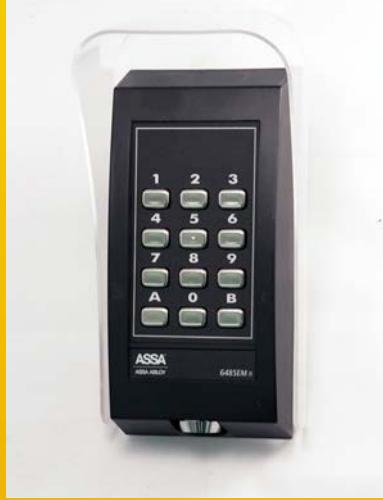

**Skyddshuv för Kodlås och Kortläsare** Artikelnummer: LT147 Mått (LxBxD) 181x93x74mm

Invändig bredd 84mm Invändig höjd 180mm

# **INFÄLLNADSLÅDA FÖR ASSA PANDO KORTLÄSARE**

Med hjälp av infällnadslådan kan kortläsaren fällas in i väggar, fasader, hisskorrgar etc, vilket gör att läsaren smälter in i de olika miljöerna då den inte sticker ut. Rostfri frontplåt. Avsedd för Assa Pando kortläsare.

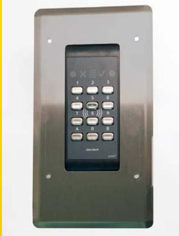

#### **Infällnadslåda för Kortläsare Pando**

Artikelnummer: LT148 Mått (BxHxD) Infällnadslåda: 225x116x22mm Frontplåt: 243x134mm

**Infällnadslåda för Kortläsare Pando** Monteringsbild

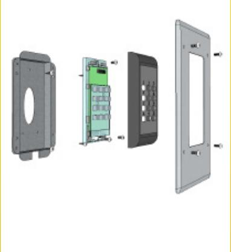

# **TÄCKPLÅT TILL KORTLÄSARE ASSA PANDO**

Täckplåt till ASSA Pando kortläsare, döljer skador på vägg från gamla kortläsare/kodlås eller när uttag gjorts för apparatdosor. Plåten löser även problematiken att sabotagekontakten inte fungerar när väggar är ojämna. Lackerad svart.

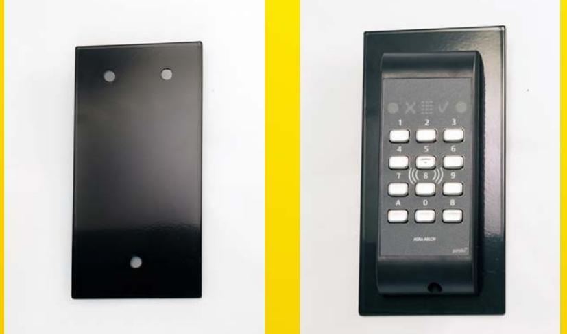

**Täckplåt för Kortläsare Pando** Artikelnummer: LT149 Mått (BxH): 186 x 94 mm

### **VINKELFÄSTE ASSA PANDO**

Tillgänglighetsfäste för Assa Pando Secure kortläsare, används när det är krav på tillgänglighetsanpassning.

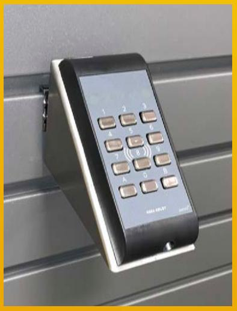

**Vinkelfäste för tillgänglighetsanpassning Assa Pando** Artikelnummer: LT161 Mått (BxHxD) 71 x 100 x 135 mm

# **SKYDDSHUVAR FÖR ÖVRIGA KORTLÄSARE OCH PORTTELEFONER**

211x101x90mm

Skyddar mot regn, snö och smuts och ger genom detta produkterna längre liv. **Material:** 4 mm Pet-G. Levereras med packningar för skruvhål.

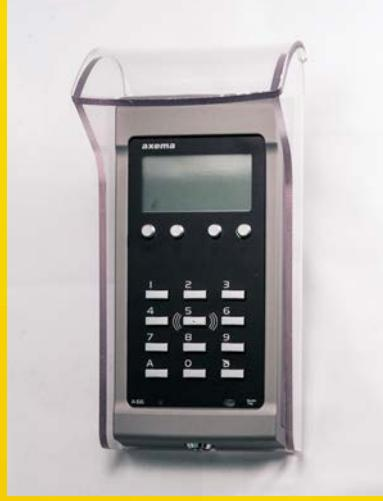

### **Skyddshuv för Axema A66/A04** Artikelnummer: LT151 Mått (LxBxD)

Invändig bredd 93mm Invändig höjd, plan yta 180mm

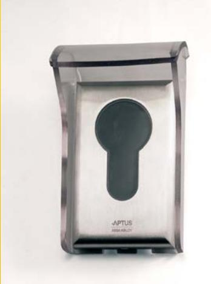

**Skyddshuv som passar porttelefoner i öppna-serien** Artikelnummer: LT162 Mått (LxBxD) 145x81x75mm

Invändig bredd 73mm Invändig höjd, plan yta 120mm

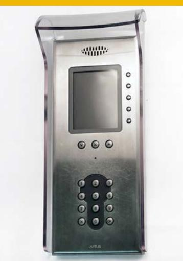

**Skyddshuv passar porttelefoner i ringa-serien** Artikelnummer: LT153 Mått (LxBxD) 312x130x90mm

Invändig bredd 121mm Invändig höjd, plan yta 285mm

# **SKYDDSHUVAR FÖR ÖVRIGA KORTLÄSARE OCH PORTTELEFONER**

Skyddar mot regn, snö och smuts och ger genom detta produkterna längre liv. **Material:** 4 mm Pet-G. Levereras med packningar för skruvhål.

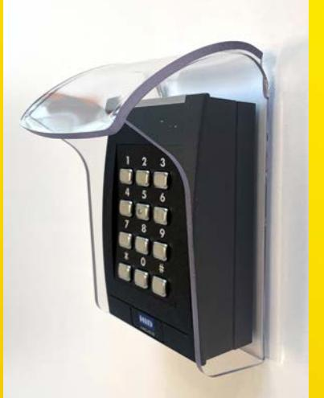

**Skyddshuv anpassad för att kombinera kortläsare med "spacer"". Skyddshuv HID RK40/ RPK40** Artikelnummer: LT171 Mått LxBxD 150x104x90 Invändig bredd: 91mm Invändig höjd, plan yta: 120mm

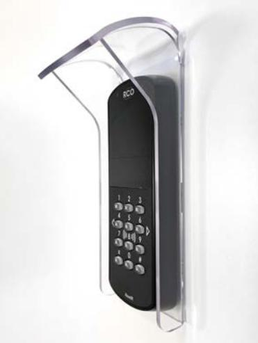

**Skyddshuv RCO MIF-509KS, PROX/MIF-509KS, MapR 509 mfl** Artikelnummer: LT181 Mått LxBxD 214x90x75mm Innermått plan yta LxB 192x75mm

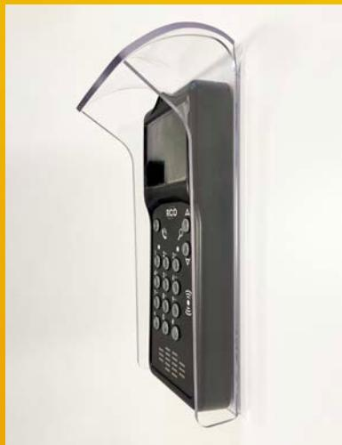

**Skyddshuv Passar RCO MIF PA-519** Artikelnummer: LT182 Mått LxBxD 260x107x90mm Innermått plan yta LxB 240x101mm