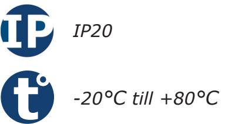
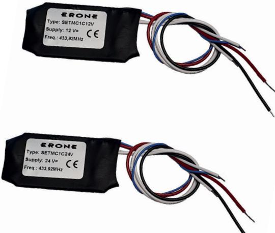
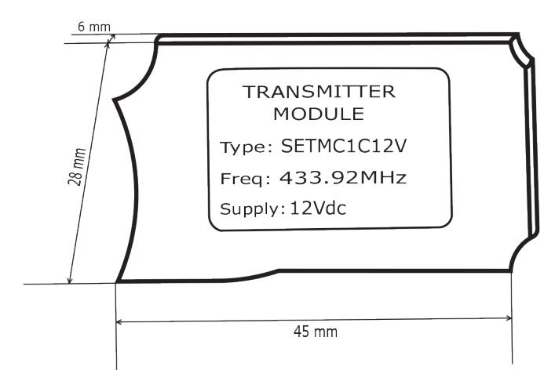

# **Produktblad**

## **Radiosändare - SETMC1C12V / SETMC1C24V**

### **Produktbeskrivning**

Väldigt liten och smidig radiosändare för inbyggnad, perfekt för att bygga in i armbågskontakter, sparkkontakter etc.

Med den här lilla radiosändaren för du om vilken NO-utgång som helst till en radiosignal. Du slipper dra kablar samtidigt som du får en driftsäker och kostnadseffektiv lösning.

Radiosändaren finns i olika modellerhar en räckvidd på upp till 500 meter och drivs av en 12/24Vdc spänningsmatning.

Radiosändarens kommunikation är krypterad med Keeloq® Hopping Code och har 264 kodkombinationer vilket ger den en väldigt hög säkerhet.

### **Funktioner**

- Räckvidd upp till 500 m
- Kryptering: KeeLoq® Hopping Code
- Sändare för inbyggnad
- Gör en potentialfri slutning till en radiosignal
- Strömförsörjning 12/24 Vdc

*IK10*

#### **Teknisk information**

**Kanaler:** 1 kanal **Räckvidd:** Upp till 500m **LED-indikering:** Nej **Frekvens:** 433.92 MHz **Kryptering:** KeeLoq ® Hopping Code **Moduleringar:** AM/ASK **Kodkombinationer:**  264 **E.R.P.:** n/a **Dimensioner (L x B x H):** 45 x 28 x 6mm **Vikt:** 11 gr. **Strömförbrukning:** n/a **Spänningsmatning:** 12/24Vdc **Kapslingsklass:** IP20 **Temperaturområde:** -20°C till +80°C

