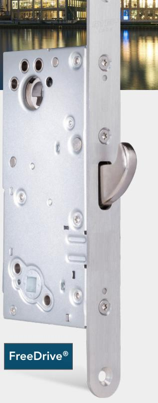
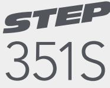
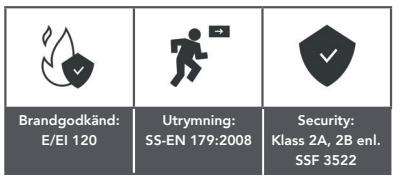
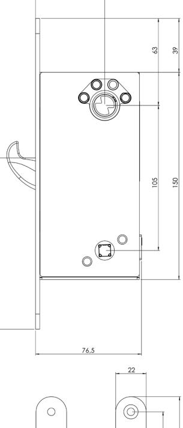
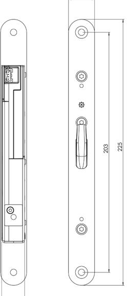
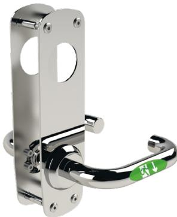

### www.steplock.se

# STEP 351S™

## – ökar intrångssäkerheten dygnet runt i högfrekventa dörrmiljöer

STEP 351S är ett motorlås med inbyggd splitfunktion designat för att ersätta fallås i skalskydd och därmed skapa en säker låsning dygnet runt. Låset är konstruerat för en högfrekvent dörrmiljö och klarar flera miljoner öppningar! Uppfyller kraven i klass 2A och 2B enligt SSF 3522.

STEP 351S är utvecklat för högfrekvent användande och klarar flera miljoner öppningar, som dessutom sker lika snabbt som ett elslutbleck. Låset kan kombinera alla krav på utrymning, återinrymning och tillgänglighet, samtidigt som dörrmiljön får en markant högre intrångssäkerhet och en oslagbar användarvänlighet.

- Certifierat för inbrottsskydd enl. SSF 3522 Klass 2A, 2B.
- Certifierat för utrymning enl. SS-EN 179:2008.
- Certifierat i brandteknisk klass E/EI120 enl. SS-EN 14846:2008 i kombination med tillhållande lås.

### Hög användarvänlighet med inbyggd splitfunktion

En inbyggd splitfunktion möjliggör mekanisk öppning från insidan utan öppnaknapp. Låset har larmförbikoppling (by-pass funktion) så att "Godkänd passage" kan erhållas vilket ger dörrmiljön en oslagbar användarvänlighet.

### Med FreeDrive® och manipulationsskyddad spärr

STEP 351S är utrustad med FreeDrive®, vår unika och patenterade teknik som gör att låsets motor och växellåda helt frikopplas varje gång dörren låses upp mekaniskt.

Låset har även en dubbel blockering där även hakregelns blockering är spärrad.

### Styrenheter med smarta funktioner

Välj mellan två olika styrenheter, ST300C eller ST500C, för koppling till passersystem, larm och annan väsentlig funktion. Styrenheterna använder krypterad kommunikation AES-128 för låsning, upplåsning och statusindikeringar. 351S

#### När det måste fungera.

### Tekniska data

### Funktionsbeskrivning

- Hakregeln låser/låser upp elektriskt via öppnasignal från passersystem, kodlås, tryckknapp eller liknande.
- Hakregeln låser upp mekaniskt via tryckesroddare från insidan (splitfunktion).
- Omställbar mekanisk split-sida. Att ändra sida görs mekaniskt på låshuset.

#### Certifikat

- Certifierat för inbrottsskydd i Klass 2A och 2B enligt SSF 3522.
- Certifierat för utrymning enligt SS-EN 179:2008.
- Certifierat i brandteknisk klass E/EI120 enligt SS-EN 14846:2008 i kombination med tillhållande lås.
- Certifierat i Grade L för korrosion, temperaturer och luftfuktighet vilket motsvarar högt ställda krav enligt SS-EN 14846.

### Produktegenskaper

- Frånreglar på mindre än 0,1 sekund.
- Modern kolvplacering.
- Båda styrenheterna hanterar återinrymning.
- FreeDrive®-teknik.
- Manipulationsskyddad spärrteknik.
- 50 mm dorndjup.
- Krypterad kommunikation AES-128.
- Anslutning till motorlåset sker genom RS-485.
- Inbyggd split-spindle.
- Utrymning och återinrymning säkerställs tillsammans med STEP Exit.
- Konstruerad för att användas i högfrekventa dörrar.

#### Miljö

- Styrenheten klarar temperaturer från -5 till +70 grader.
- Låset klarar temperaturer från -20 till +70 grader.

| Art.nr     | Benämning                                                                                                                                                                                                                                              |
|------------|--------------------------------------------------------------------------------------------------------------------------------------------------------------------------------------------------------------------------------------------------------|
| ST351S     | Motorlås STEP 351S. Med hakregel och splitfunktion. Klass 2A, 2B enligt SSF 3522.                                                                                                                                                                   |
| ST351S-KPL | STEP 351S komplett set. Inkl. ST351S, STEP Styrenhet ST300C, STEP Karmöverföring ST1283, 10 m anslutningskabel ST0916, mekaniskt slutbleck ST2009-15, anslutningskabel med adapter ST0917, borrskydd ST1199 samt skruv- och magnetset ST1192. |

### Utrymning med oöverträffad användarvänlighet

Kombinera STEP 351S med STEP Exit nödutrymningsbehör för att skapa en tryggare utrymningsväg med oöverträffad användarvänlighet.

Certifierat enligt SS-EN 179:2008.

Kombinera med STEP Exit för att maximera fördelarna med FreeDrive® FreeDrive® tekniken frikopplar motorn och växellådan, vilket innebär att de aldrig påverkas när utrymningsbehörets trycke används. Därmed minimeras påverkan på motor och växellåda – trots att beslaget kanske används tusentals gånger varje dag.

Måttskiss för STEP 351S.

Välj mellan flera olika STEP Exit nödutrymningsbeslag i Exitguiden på steplock.se