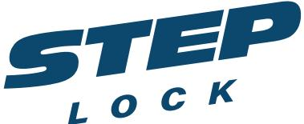
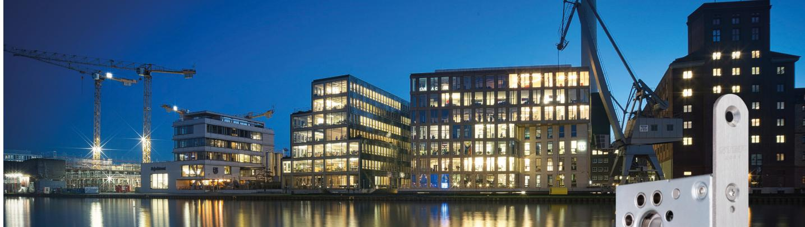
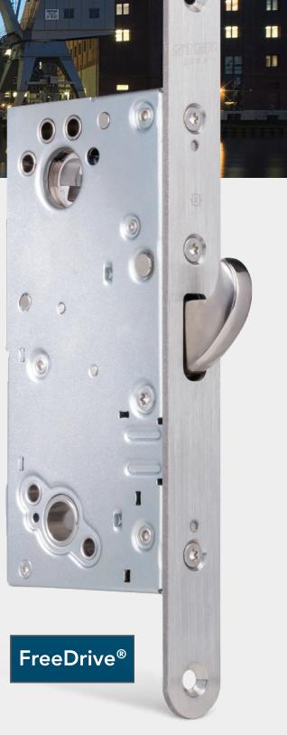
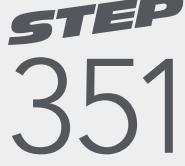
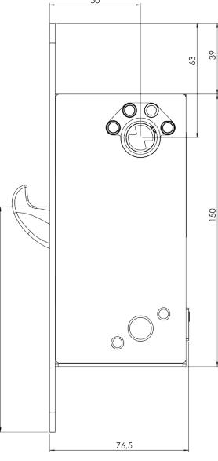
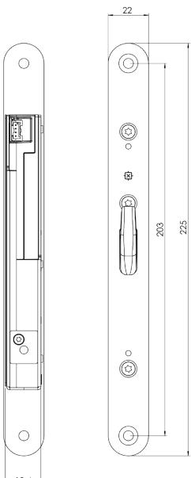
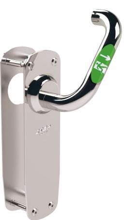

### www.steplock.se

# STEP 351™

## – motorlås för nattlåsning i klass 3

STEP 351 är ett kraftfullt motorlås med hakregel för nattlåsning. Låshuset har en modern kolvplacering med hakregeln placerad i centrum av låskistan. Uppfyller kraven i klass 2A, 2B och 3 enligt SSF 3522.

STEP 351 ingår i STEPs revolutionerande 300-serie. Det är ett snabbt hakregelmotorlås som tål stora påfrestningar.

- Certifierat för inbrottsskydd enl. SSF 3522 Klass 2A, 2B och 3.
- Certifierat för utrymning enl. SS-EN 179:2008.
- Certifierat i brandteknisk klass E/EI120 enl. SS-EN 14846:2008, i kombination med tillhållande lås.

### Manipulationsskyddad spärr

Låset har en dubbel blockering där även hakregelns blockering är spärrad. Spärrens läge avläses av en optisk sensor så att du kan lita på att det verkligen är låst. Spärren är helt skyddad från åtkomst och säkerställer därmed skydd mot manipulation.

### FreeDrive®-tekniken minimerar slitage

STEP 351 är utrustad med FreeDrive®, vår unika och patenterade teknik som gör att låsets motor och växellåda helt frikopplas varje gång dörren låses upp mekaniskt. Det gör att slitaget minimeras vid användningen av nyckel, vred eller utrymningsbehör.

Lås med FreeDrive® används därför med fördel tillsammans med STEP Exit i nödutrymningsbehör och kan användas tusentals gånger varje dag.

### Styrenheter med smarta funktioner

Välj mellan två olika styrenheter, ST300C eller ST500C, för koppling till passersystem, larm och annan väsentlig funktion. Styrenheterna använder krypterad kommunikation AES-128 för låsning, upplåsning och statusindikeringar. 351

### När det måste fungera.

### Tekniska data

### Funktionsbeskrivning

- Hakregeln låser/låser upp elektriskt via öppnasignal från passersystem, kodlås, tryckknapp eller liknande.
#### Certifikat

- Certifierat för inbrottsskydd i Klass 2A, 2B och 3 enligt SSF 3522.
- Certifierat för utrymning enligt SS-EN 179:2008.
- Certifierat i brandteknisk klass E/EI120 enligt SS-EN 14846:2008 i kombination med tillhållande lås.
- Certifierat i Grade L för korrosion, temperaturer och luftfuktighet vilket motsvarar högt ställda krav enligt SS-EN 14846.

### Produktegenskaper

- Frånreglar på mindre än 0,1 sekund.
- Modern kolvplacering.
- Båda styrenheterna hanterar återinrymning.
- FreeDrive®-teknik.
- Manipulationsskyddad spärrteknik.
- 50 mm dorndjup.
- Krypterad kommunikation AES-128.
- Anslutning till motorlåset sker genom RS-485.
- Utrymning och återinrymning säkerställs tillsammans med STEP Exit.
- Konstruerad för att användas i högfrekventa dörrar.

### Miljö

- Styrenheten klarar temperaturer från -5 till +70 grader.
- Låset klarar temperaturer från -20 till +70 grader.

| Art.nr   | Benämning                                                                                                                                                                                                                                            |
|----------|------------------------------------------------------------------------------------------------------------------------------------------------------------------------------------------------------------------------------------------------------|
| ST351    | Motorlås STEP 351. Med hakregel. Klass 2A, 2B, 3 enligt SSF 3522.                                                                                                                                                                                    |
| ST351KPL | STEP 351 komplett set. Inkl. ST351, STEP Styrenhet ST300C, STEP Karmöverföring ST1283, 10 m anslutningskabel ST0916, mekaniskt slutbleck ST2009-15, anslutningskabel med adapter ST0917, borrskydd ST1199 samt skruv- och magnetset ST1192. |

Security: Klass 2A, 2B, 3 enl. SSF 3522 Brandgodkänd: E/EI 120 med tillhållande lås Utrymning: SS-EN 179:2008

### Utrymning med oöverträffad användarvänlighet

Kombinera STEP 351 med STEP Exit nödutrymningsbehör för att skapa en tryggare utrymningsväg med oöverträffad användarvänlighet.

Certifierat enligt SS-EN 179:2008.

Kombinera med STEP Exit för att maximera fördelarna med FreeDrive® FreeDrive® tekniken frikopplar motorn och växellådan, vilket innebär att de aldrig påverkas när utrymningsbehörets trycke används. Därmed minimeras påverkan på motor och växellåda – trots att beslaget kanske används tusentals gånger varje dag.

Måttskiss för STEP 351.

Välj mellan flera olika STEP Exit nödutrymningsbeslag i Exitguiden på steplock.se