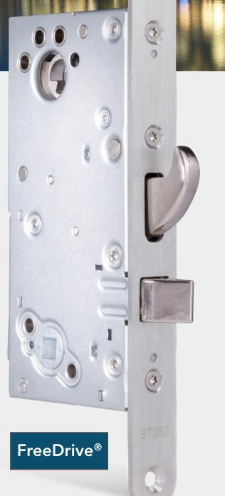
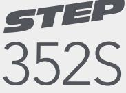
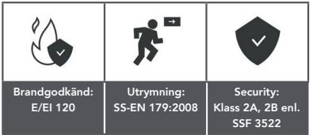
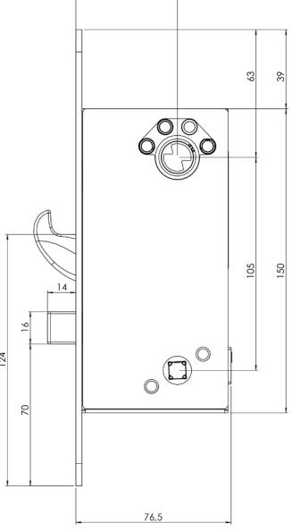
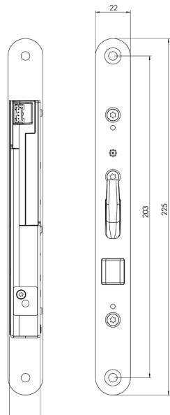
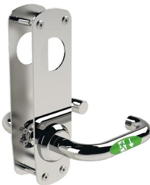

### www.steplock.se

# STEP 352S™

### – ökar intrångssäkerheten dygnet runt i högfrekventa dörrmiljöer med dörrautomatik

STEP 352S är ett motorlås med inbyggd splitfunktion och automatikkolv designat för att ersätta fallås i skalskydd och därmed skapa en säker låsning dygnet runt. Låset är konstruerat för en högfrekvent dörrmiljö med dörrautomatik och klarar flera miljoner öppningar! Uppfyller kraven i klass 2A och 2B enligt SSF 3522.

STEP 352S är utvecklat för högfrekvent användande med flera miljoner öppningar, som dessutom sker lika snabbt som ett elslutbleck. Låset kan kombinera krav på utrymning, återinrymning, tillgänglighet och brandtillhållning, samtidigt som dörrmiljön får en markant högre intrångssäkerhet och en oslagbar användarvänlighet.

- Certifierat för inbrottsskydd enl. SSF 3522 Klass 2A, 2B.
- Certifierat för utrymning enl. SS-EN 179:2008.
- Certifierat i brandteknisk klass E/EI120 enl. SS-EN 14846:2008.

### Inbyggda tekniker som ger stora fördelar

- När dörren öppnas elektriskt kan automatikkolven vika sig och möjliggör därmed öppning med dörrautomatik. Direkt efter att dörren öppnats skjuter automatikkolven ut, blir fast i sin position och fungerar precis som en vanlig fallkolv igen.
- En inbyggd splitfunktion möjliggör mekanisk öppning från insidan utan öppnaknapp. Låset har larmförbikoppling så att "Godkänd passage" kan erhållas.
- FreeDrive® tekniken gör att låsets motor och växellåda helt frikopplas varje gång dörren låses upp mekaniskt.
- Låset har även en dubbel blockering där även hakregelns blockering är spärrad.

### Styrenheter med smarta funktioner

Välj mellan två olika styrenheter, ST300C eller ST500C, för koppling till passersystem, larm och annan väsentlig funktion. Styrenheterna använder krypterad kommunikation AES-128 för låsning, upplåsning och statusindikeringar. 352S

### När det måste fungera.

## Tekniska data

### Funktionsbeskrivning

- Hakregeln och automatikkolven låser/låser upp elektriskt via öppnasignal från passersystem, kodlås, tryckknapp eller liknande.
- Hakregeln och automatikkolven låser/låser upp mekaniskt via tryckesroddare från insidan (splitfunktion).
- Automatikkolven dras in mekaniskt via tryckesroddaren med trycke från insida och utsida.
- Normal passage sker med trycke från insidan.
- Omställbar mekanisk split-sida. Att ändra sida görs mekaniskt på låshuset.

### Certifikat

- Certifierat för inbrottsskydd i Klass 2A och 2B enligt SSF 3522.
- Certifierat för utrymning enligt SS-EN 179:2008.
- Certifierat i brandteknisk klass E/EI120 enligt SS-EN 14846:2008.
- Certifierat i Grade L för korrosion, temperaturer och luftfuktighet vilket motsvarar högt ställda krav enligt SS-EN 14846.

### Produktegenskaper

- Frånreglar på mindre än 0,1 sekund.
- Modern kolvplacering.
- Båda styrenheterna hanterar återinrymning.
- FreeDrive®-teknik.
- Manipulationsskyddad spärrteknik.
- 50 mm dorndjup.
- Krypterad kommunikation AES-128.
- Anslutning till motorlåset sker genom RS-485.
- Inbyggd split-spindle.
- Utrymning och återinrymning säkerställs tillsammans med STEP Exit.
- Konstruerad för att användas i högfrekventa dörrar.

#### Miljö

- Styrenheten klarar temperaturer från -5 till +70 grader.
- Låset klarar temperaturer från -20 till +70 grader.

| Art.nr           | Benämning                                                                                                                                                                                                                                                |
|------------------|----------------------------------------------------------------------------------------------------------------------------------------------------------------------------------------------------------------------------------------------------------|
| ST352S-R         | Motorlås STEP 352S. För högerhängd dörr. Klass 2A, 2B enl. SSF 3522.                                                                                                                                                                                     |
| ST352S-L         | Motorlås STEP 352S. För vänsterhängd dörr. Klass 2A, 2B enl. SSF 3522.                                                                                                                                                                                   |
| ST352S-R -KPL | STEP 352S komplett set. Inkl. ST352S-R, STEP Styrenhet ST300C, STEP Karmöverföring ST1283, 10 m anslutningskabel ST0916, mekaniskt slutbleck ST2009-15, anslutningskabel med adapter ST0917, borrskydd ST1199 samt skruv- och magnetset ST1192. |
| ST352S-L -KPL | STEP 352S komplett set. Inkl. ST352S-L, STEP Styrenhet ST300C, STEP Karmöverföring ST1283, 10 m anslutningskabel ST0916, mekaniskt slutbleck ST2009-15, anslutningskabel med adapter ST0917, borrskydd ST1199 samt skruv- och magnetset ST1192. |

### Utrymning med oöverträffad användarvänlighet

Kombinera STEP 352S med STEP Exit nödutrymningsbehör för att skapa en tryggare utrymningsväg med oöverträffad användarvänlighet.

Certifierat enligt SS-EN 179:2008.

Kombinera med STEP Exit för att maximera fördelarna med FreeDrive® FreeDrive® tekniken frikopplar motorn och växellådan, vilket innebär att de aldrig påverkas när utrymningsbehörets trycke används. Därmed minimeras påverkan på motor och växellåda – trots att beslaget kanske används tusentals gånger varje dag.

Måttskiss för STEP 352S.

Välj mellan flera olika STEP Exit nödutrymningsbeslag i Exitguiden på steplock.se